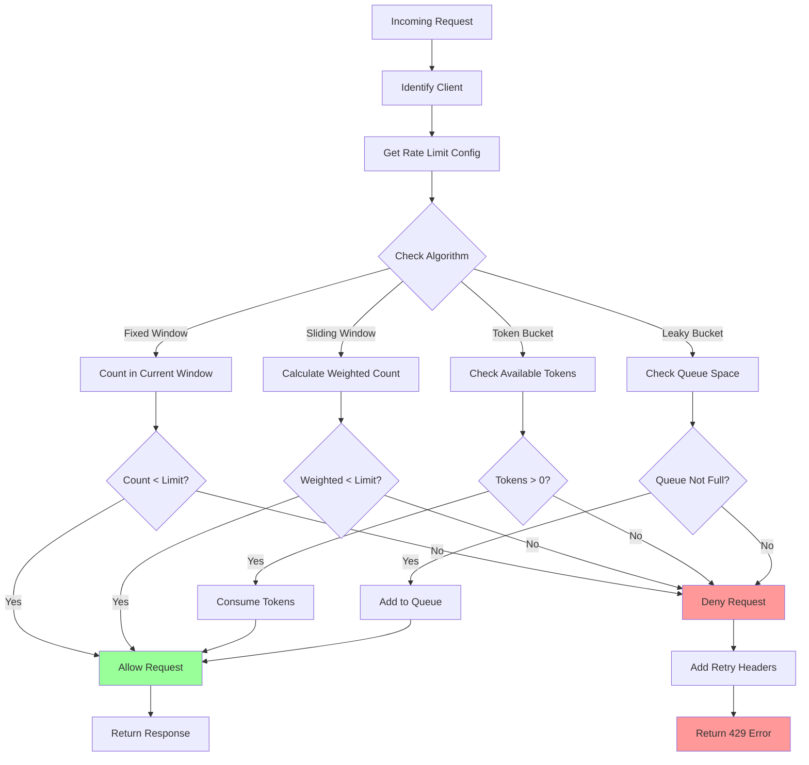
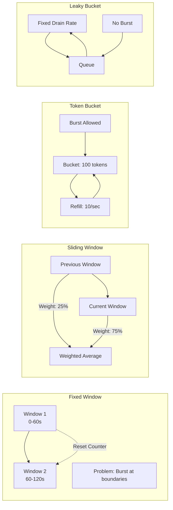
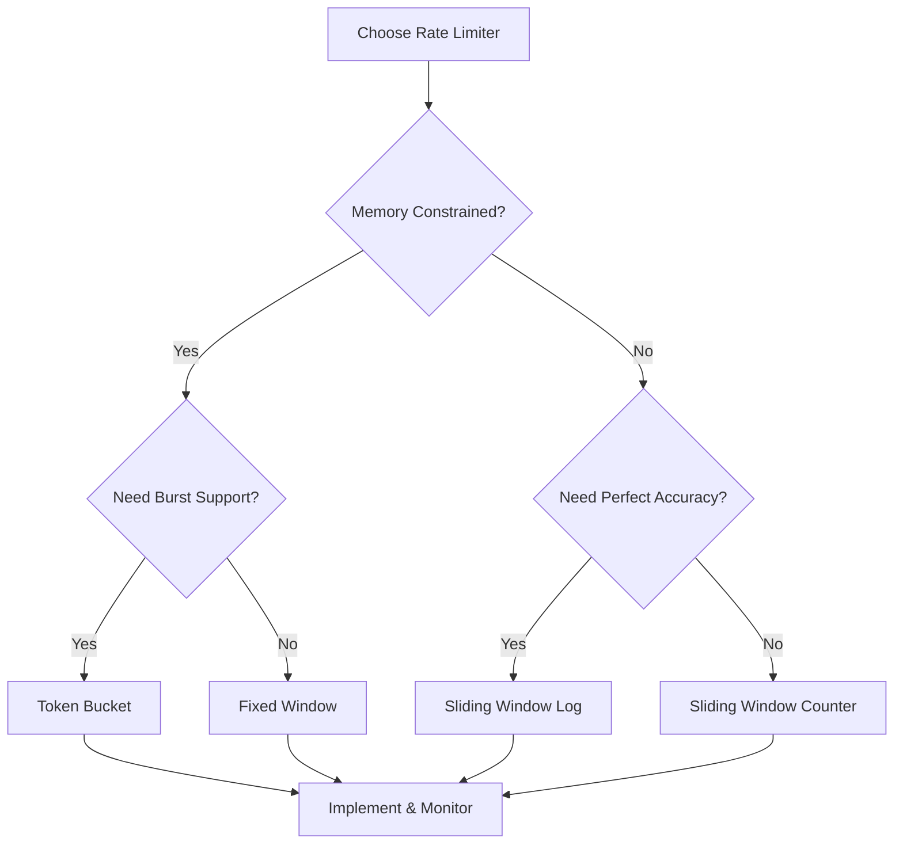
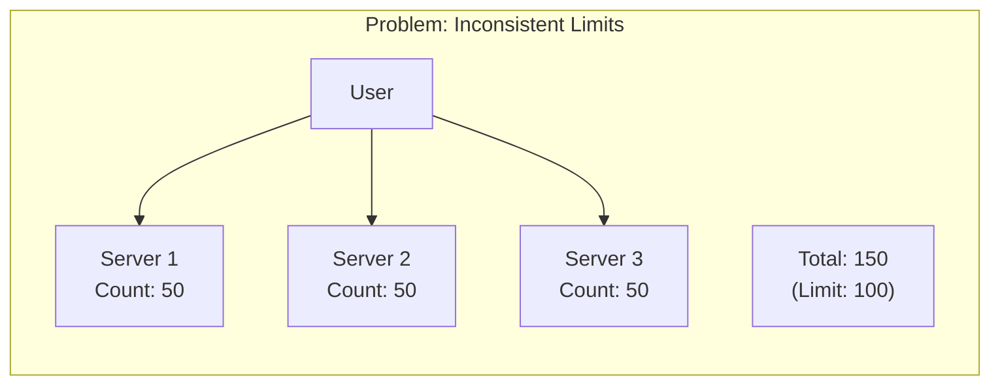
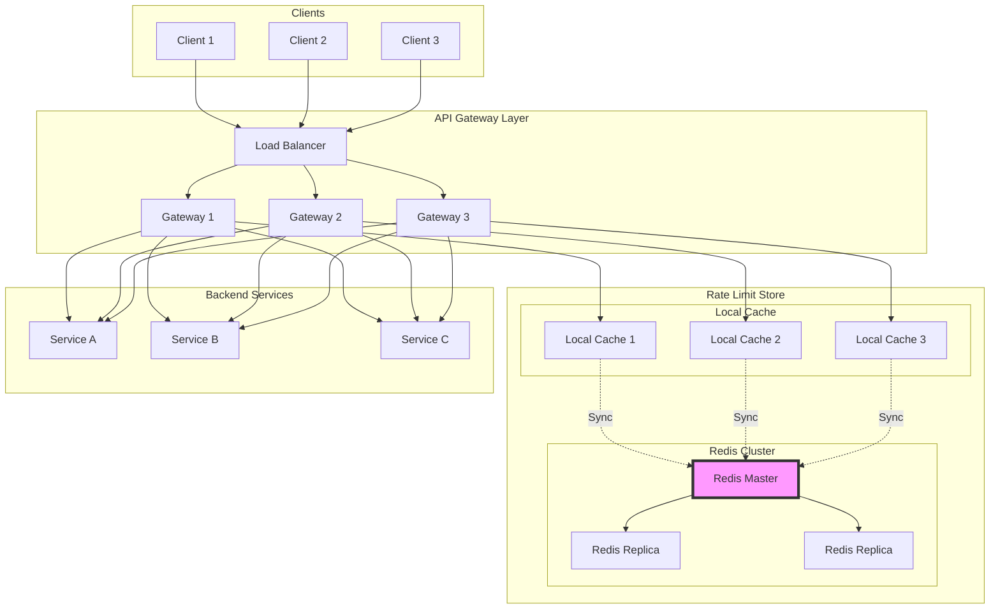
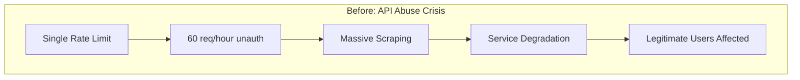
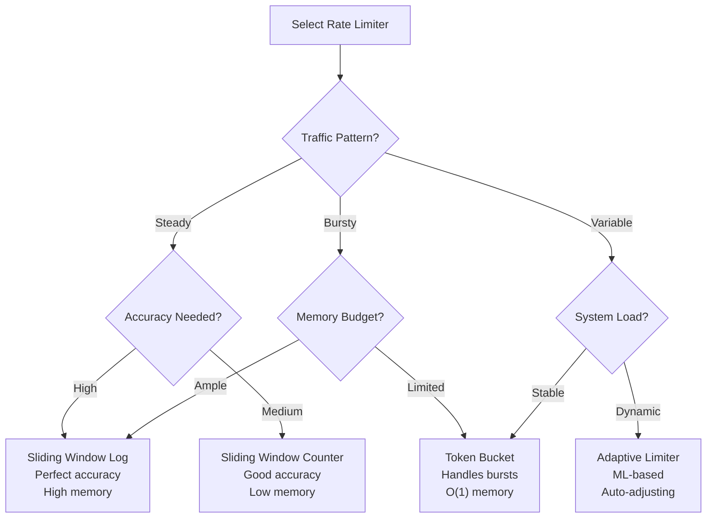

# Rate Limiting Pattern

**Control request flow to protect systems and ensure fair resource allocation**

## Level 1: Intuition

## Core Concept

Like highway metering lights that control traffic flow during rush hour, rate limiting prevents system overload by controlling request rates.

**Problem**: Uncontrolled traffic → congestion → crashes → degraded performance

**Solution**: Metered access ensures smooth flow, fair usage, and system stability.

## Simple Example

```text
Club Bouncer Analogy:
- Max capacity: 100 people per hour
- Check: How many entered in last hour?
- Below limit: Welcome!
- At limit: Sorry, try again later

Real System:
- API limit: 1000 requests per hour
- Track requests per user
- Allow/deny based on quota
```

---

## Level 2: Foundation

## Rate Limiting Algorithms

<div class="responsive-table" markdown>

| Algorithm | Memory | Accuracy | Burst | Best For |
|-----------|--------|----------|-------|----------|
| **Fixed Window** | O(1) | Low | Poor | Simple APIs |
| **Sliding Log** | O(n) | Perfect | Good | Critical systems |
| **Sliding Window** | O(1) | High | Good | Most apps |
| **Token Bucket** | O(1) | Medium | Configurable | Bursty traffic |
| **Leaky Bucket** | O(1) | Medium | None | Steady streams |

</div>


## Algorithm Examples

**Fixed Window**: Count resets at window boundaries (issue: 200 requests at 59-61s boundary)

**Sliding Window**: Weighted average of current (75%) + previous (25%) window

**Token Bucket**: Start with 100 tokens, refill at 10/sec, allows bursts

## Rate Limiting Decision Tree



## Algorithm Comparison Visualization



## Production-Ready Algorithm Implementations

```python
from abc import ABC, abstractmethod
from typing import Dict, Tuple, Optional

class TokenBucket(RateLimiter):
    """Token bucket algorithm with burst support"""

    def __init__(self, capacity: int, refill_rate: float, burst_capacity: Optional[int] = None):
        self.capacity = capacity
        self.burst_capacity = burst_capacity or capacity * 2
        self.refill_rate = refill_rate  # tokens per second
        self.buckets = {}
        self.lock = threading.RLock()

    def allow_request(self, key: str, tokens: int = 1) -> Tuple[bool, Dict[str, any]]:
        with self.lock:
            now = time.time()
            
# Initialize bucket if needed
            if key not in self.buckets:
                self.buckets[key] = {
                    'tokens': self.capacity,
                    'last_refill': now,
                    'total_requests': 0,
                    'total_allowed': 0
                }

            bucket = self.buckets[key]
            bucket['total_requests'] += 1

# Refill tokens based on elapsed time
            elapsed = now - bucket['last_refill']
            new_tokens = elapsed * self.refill_rate
            
# Cap at burst capacity instead of normal capacity
            bucket['tokens'] = min(
                self.burst_capacity,
                bucket['tokens'] + new_tokens
            )
            bucket['last_refill'] = now

# Check if enough tokens available
            allowed = bucket['tokens'] >= tokens
            if allowed:
                bucket['tokens'] -= tokens
                bucket['total_allowed'] += 1
            
# Calculate metadata
            metadata = {
                'remaining_tokens': int(bucket['tokens']),
                'capacity': self.capacity,
                'burst_capacity': self.burst_capacity,
                'refill_rate': self.refill_rate,
                'retry_after': self.get_retry_after(key) if not allowed else None,
                'acceptance_rate': bucket['total_allowed'] / bucket['total_requests']
            }

            return allowed, metadata
    
    def get_retry_after(self, key: str) -> Optional[float]:
        with self.lock:
            if key not in self.buckets:
                return None
            
            bucket = self.buckets[key]
            if bucket['tokens'] >= 1:
                return None
            
# Calculate time needed to accumulate 1 token
            tokens_needed = 1 - bucket['tokens']
            seconds_needed = tokens_needed / self.refill_rate
            return max(0.1, seconds_needed)  # Minimum 100ms

class SlidingWindowLog(RateLimiter):
    """Most accurate but memory-intensive algorithm"""

    def __init__(self, max_requests: int, window_seconds: int, 
                 precision_ms: int = 1):
        self.max_requests = max_requests
        self.window_seconds = window_seconds
        self.precision_ms = precision_ms
        self.requests = defaultdict(list)
        self.lock = threading.RLock()
        self._last_cleanup = time.time()

    def allow_request(self, key: str, tokens: int = 1) -> Tuple[bool, Dict[str, any]]:
        with self.lock:
            now = time.time()
            cutoff = now - self.window_seconds

# Periodic cleanup to prevent memory bloat
            if now - self._last_cleanup > 60:  # Every minute
                self._cleanup_old_entries()
                self._last_cleanup = now

# Remove expired entries for this key
            self.requests[key] = [
                (timestamp, weight) for timestamp, weight in self.requests[key]
                if timestamp > cutoff
            ]

# Calculate current usage
            current_usage = sum(weight for _, weight in self.requests[key])
            
# Check if we can add new request
            allowed = current_usage + tokens <= self.max_requests
            
            if allowed:
# Round timestamp to precision
                rounded_time = round(now * 1000 / self.precision_ms) * self.precision_ms / 1000
                self.requests[key].append((rounded_time, tokens))
            
# Calculate metadata
            requests_in_window = len(self.requests[key])
            oldest_request = min((t for t, _ in self.requests[key]), default=now)
            
            metadata = {
                'current_usage': current_usage,
                'max_requests': self.max_requests,
                'window_seconds': self.window_seconds,
                'requests_in_window': requests_in_window,
                'oldest_request_age': now - oldest_request,
                'retry_after': self.get_retry_after(key) if not allowed else None
            }

            return allowed, metadata
    
    def get_retry_after(self, key: str) -> Optional[float]:
        with self.lock:
            if key not in self.requests or not self.requests[key]:
                return None
            
# Find the oldest request that would need to expire
            now = time.time()
            cutoff = now - self.window_seconds
            
            for timestamp, _ in sorted(self.requests[key]):
                if timestamp > cutoff:
                    return timestamp + self.window_seconds - now
            
            return None
    
    def _cleanup_old_entries(self):
        """Remove keys with no recent requests to free memory"""
        now = time.time()
        cutoff = now - self.window_seconds
        
        keys_to_remove = []
        for key, timestamps in self.requests.items():
            if not timestamps or max(t for t, _ in timestamps) < cutoff:
                keys_to_remove.append(key)
        
        for key in keys_to_remove:
            del self.requests[key]

class SlidingWindowCounter(RateLimiter):
    """Hybrid approach: accuracy of sliding log with memory efficiency of counters"""

    def __init__(self, max_requests: int, window_seconds: int):
        self.max_requests = max_requests
        self.window_seconds = window_seconds
        self.windows = defaultdict(lambda: {
            'current': 0, 
            'previous': 0,
            'window_start': 0
        })
        self.lock = threading.RLock()

    def allow_request(self, key: str, tokens: int = 1) -> Tuple[bool, Dict[str, any]]:
        with self.lock:
            now = time.time()
            window_start = (now // self.window_seconds) * self.window_seconds
            
            window_data = self.windows[key]

# Check if we've moved to a new window
            if window_start != window_data.get('window_start', 0):
# Shift windows
                if window_start - window_data.get('window_start', 0) >= self.window_seconds * 2:
# If we skipped windows, reset
                    window_data['previous'] = 0
                    window_data['current'] = 0
                else:
# Normal progression
                    window_data['previous'] = window_data.get('current', 0)
                    window_data['current'] = 0
                window_data['window_start'] = window_start

# Calculate position in current window (0.0 to 1.0)
            window_position = (now - window_start) / self.window_seconds
            
# Weight previous window's contribution
            previous_weight = 1.0 - window_position
            
# Calculate effective request count
            weighted_count = (
                window_data['current'] +
                window_data['previous'] * previous_weight
            )

# Check if request would exceed limit
            allowed = weighted_count + tokens <= self.max_requests
            
            if allowed:
                window_data['current'] += tokens
            
# Calculate detailed metadata
            metadata = {
                'current_window_requests': window_data['current'],
                'previous_window_requests': window_data['previous'],
                'weighted_total': weighted_count,
                'max_requests': self.max_requests,
                'window_position': f"{window_position:.2%}",
                'retry_after': self.get_retry_after(key) if not allowed else None,
                'algorithm': 'sliding_window_counter'
            }

            return allowed, metadata
    
    def get_retry_after(self, key: str) -> Optional[float]:
        with self.lock:
            if key not in self.windows:
                return None
            
            now = time.time()
            window_start = (now // self.window_seconds) * self.window_seconds
            window_position = (now - window_start) / self.window_seconds
            
            window_data = self.windows[key]
            previous_weight = 1.0 - window_position
            
            weighted_count = (
                window_data['current'] +
                window_data['previous'] * previous_weight
            )
            
            if weighted_count < self.max_requests:
                return None
            
# Calculate when enough of previous window will have expired
# This is an approximation
            excess = weighted_count - self.max_requests + 1
            if window_data['previous'] > 0:
                time_needed = (excess / window_data['previous']) * self.window_seconds
                return max(0.1, time_needed)
            
# If all requests are in current window, wait for next window
            return window_start + self.window_seconds - now
```

## Choosing the Right Algorithm



---

## Level 3: Deep Dive

## Distributed Rate Limiting at Scale

#### The Challenge of Distribution



#### Distributed Rate Limiting Architecture



## Production-Grade Distributed Rate Limiter

```python
import redis
import time
import json
import hashlib
from typing import Optional, Tuple, Dict, List
from enum import Enum
import asyncio
from dataclasses import dataclass

class RateLimitStrategy(Enum):
    """Different strategies for distributed rate limiting"""
    CENTRALIZED = "centralized"  # Single Redis instance
    SHARDED = "sharded"         # Multiple Redis shards
    LOCAL_THEN_GLOBAL = "hybrid" # Local cache + global sync
    GOSSIP = "gossip"           # P2P synchronization

@dataclass
class RateLimitConfig:
    """Configuration for rate limiter"""
    strategy: RateLimitStrategy
    limits: Dict[str, Dict[str, int]]  # tier -> {requests, window}
    redis_urls: List[str]
    sync_interval: int = 5  # seconds
    local_cache_size: int = 10000
    
class DistributedRateLimiter:
    """Production-ready distributed rate limiter"""

    def __init__(self, config: RateLimitConfig):
        self.config = config
        self.redis_clients = self._init_redis_clients()
        self.local_cache = {}  # For hybrid strategy
        self._init_lua_scripts()

    def _init_redis_clients(self) -> List[redis.Redis]:
        """Initialize Redis connections with retry logic"""
        clients = []
        for url in self.config.redis_urls:
            client = redis.from_url(
                url,
                decode_responses=True,
                socket_timeout=1,
                socket_connect_timeout=1,
                retry_on_timeout=True,
                health_check_interval=30
            )
            clients.append(client)
        return clients

    def _init_lua_scripts(self):
        """Load Lua scripts for atomic operations"""
# Enhanced token bucket with metadata
        self.token_bucket_script = """
        local key = KEYS[1]
        local capacity = tonumber(ARGV[1])
        local refill_rate = tonumber(ARGV[2])
        local requested = tonumber(ARGV[3])
        local now = tonumber(ARGV[4])
        local burst_capacity = tonumber(ARGV[5])
        local client_id = ARGV[6]

        -- Get or initialize bucket
        local bucket = redis.call('HGETALL', key)
        local tokens = capacity
        local last_refill = now
        local total_requests = 0
        local total_allowed = 0
        
        if #bucket > 0 then
            -- Parse existing bucket
            for i = 1, #bucket, 2 do
                if bucket[i] == 'tokens' then
                    tokens = tonumber(bucket[i + 1])
                elseif bucket[i] == 'last_refill' then
                    last_refill = tonumber(bucket[i + 1])
                elseif bucket[i] == 'total_requests' then
                    total_requests = tonumber(bucket[i + 1])
                elseif bucket[i] == 'total_allowed' then
                    total_allowed = tonumber(bucket[i + 1])
                end
            end

            -- Refill tokens
            local elapsed = now - last_refill
            local new_tokens = elapsed * refill_rate
            tokens = math.min(burst_capacity, tokens + new_tokens)
        end

        -- Track request
        total_requests = total_requests + 1
        
        -- Check if allowed
        local allowed = 0
        local wait_time = 0
        
        if tokens >= requested then
            tokens = tokens - requested
            total_allowed = total_allowed + 1
            allowed = 1
        else
            -- Calculate wait time
            local tokens_needed = requested - tokens
            wait_time = tokens_needed / refill_rate
        end

        -- Update bucket
        redis.call('HMSET', key,
            'tokens', tokens,
            'last_refill', now,
            'total_requests', total_requests,
            'total_allowed', total_allowed,
            'last_client', client_id
        )
        redis.call('EXPIRE', key, 7200)  -- 2 hour TTL

        -- Return comprehensive result
        return {
            allowed,
            tokens,
            capacity,
            burst_capacity,
            wait_time,
            total_requests,
            total_allowed
        }
        """

# Sliding window with request log
        self.sliding_window_script = """
        local key = KEYS[1]
        local max_requests = tonumber(ARGV[1])
        local window = tonumber(ARGV[2])
        local now = tonumber(ARGV[3])
        local requested = tonumber(ARGV[4])
        
        local cutoff = now - window
        
        -- Remove old entries
        redis.call('ZREMRANGEBYSCORE', key, '-inf', cutoff)
        
        -- Count current requests
        local current = redis.call('ZCARD', key)
        
        if current + requested <= max_requests then
            -- Add new requests
            for i = 1, requested do
                redis.call('ZADD', key, now, now .. ':' .. i .. ':' .. math.random())
            end
            redis.call('EXPIRE', key, window + 60)
            return {1, max_requests - current - requested}
        else
            return {0, 0}
        end
        """

# Load scripts to all Redis instances
        self.script_shas = {}
        for i, client in enumerate(self.redis_clients):
            self.script_shas[i] = {
                'token_bucket': client.script_load(self.token_bucket_script),
                'sliding_window': client.script_load(self.sliding_window_script)
            }

    def _get_redis_shard(self, key: str) -> Tuple[redis.Redis, int]:
        """Consistent hashing to determine Redis shard"""
        if len(self.redis_clients) == 1:
            return self.redis_clients[0], 0
        
        hash_value = int(hashlib.md5(key.encode()).hexdigest(), 16)
        shard_index = hash_value % len(self.redis_clients)
        return self.redis_clients[shard_index], shard_index

    async def check_rate_limit(self,
                              identifier: str,
                              tier: str = "default",
                              requested: int = 1,
                              metadata: Optional[Dict] = None) -> Dict[str, any]:
        """Check rate limit with automatic strategy selection"""
        
# Get tier configuration
        tier_config = self.config.limits.get(tier, self.config.limits['default'])
        max_requests = tier_config['requests']
        window = tier_config['window']
        
# Build rate limit key
        key = f"rl:{tier}:{identifier}"
        
# Select strategy
        if self.config.strategy == RateLimitStrategy.LOCAL_THEN_GLOBAL:
            return await self._check_hybrid(key, max_requests, window, requested)
        elif self.config.strategy == RateLimitStrategy.SHARDED:
            return await self._check_sharded(key, max_requests, window, requested)
        else:
            return await self._check_centralized(key, max_requests, window, requested)
    
    async def _check_centralized(self, key: str, limit: int, 
                                window: int, requested: int) -> Dict[str, any]:
        """Check using single Redis instance"""
        client = self.redis_clients[0]
        
        try:
# Use token bucket for centralized
            result = await asyncio.get_event_loop().run_in_executor(
                None,
                client.evalsha,
                self.script_shas[0]['token_bucket'],
                1,  # number of keys
                key,
                limit,      # capacity
                limit / window,  # refill rate
                requested,
                time.time(),
                limit * 2,  # burst capacity
                "central"   # client id
            )
            
            return {
                'allowed': bool(result[0]),
                'remaining': int(result[1]),
                'limit': limit,
                'window': window,
                'retry_after': result[4] if not result[0] else None,
                'total_requests': result[5],
                'acceptance_rate': result[6] / result[5] if result[5] > 0 else 1.0
            }
            
        except redis.RedisError as e:
# Fallback decision
            return self._fallback_decision(key, e)
    
    async def _check_sharded(self, key: str, limit: int,
                           window: int, requested: int) -> Dict[str, any]:
        """Check using sharded Redis instances"""
        client, shard_idx = self._get_redis_shard(key)
        
        try:
# Use sliding window for sharded
            result = await asyncio.get_event_loop().run_in_executor(
                None,
                client.evalsha,
                self.script_shas[shard_idx]['sliding_window'],
                1,
                key,
                limit,
                window,
                time.time(),
                requested
            )
            
            return {
                'allowed': bool(result[0]),
                'remaining': int(result[1]),
                'limit': limit,
                'window': window,
                'shard': shard_idx,
                'retry_after': self._calculate_retry_after(key, window) if not result[0] else None
            }
            
        except redis.RedisError as e:
            return self._fallback_decision(key, e)
    
    async def _check_hybrid(self, key: str, limit: int,
                          window: int, requested: int) -> Dict[str, any]:
        """Local cache with periodic global sync"""
        now = time.time()
        
# Check local cache first
        if key in self.local_cache:
            cache_entry = self.local_cache[key]
            if now - cache_entry['last_sync'] < self.config.sync_interval:
# Use local decision
                local_used = cache_entry['local_used']
                global_quota = cache_entry['global_quota']
                
                if local_used + requested <= global_quota:
                    cache_entry['local_used'] += requested
                    return {
                        'allowed': True,
                        'remaining': global_quota - local_used - requested,
                        'limit': limit,
                        'window': window,
                        'cache': 'local'
                    }
        
# Need to sync with global state
        return await self._sync_and_check(key, limit, window, requested)
    
    def _fallback_decision(self, key: str, error: Exception) -> Dict[str, any]:
        """Fallback strategy when Redis is unavailable"""
# Could implement local fallback, fail open/closed, etc.
        return {
            'allowed': True,  # Fail open
            'remaining': -1,
            'error': str(error),
            'fallback': True
        }

class HierarchicalRateLimiter:
    """Enterprise-grade multi-level rate limiting"""

    def __init__(self, config: RateLimitConfig):
        self.config = config
        self.limiters = {}
        self._init_hierarchy()

    def _init_hierarchy(self):
        """Initialize rate limit hierarchy"""
        self.hierarchy = {
            'global': {
                'limit': 1000000,
                'window': 60,
                'priority': 0,
                'share_strategy': 'proportional'
            },
            'organization': {
                'limit': 100000,
                'window': 60,
                'priority': 1,
                'parent': 'global'
            },
            'api_key': {
                'limit': 10000,
                'window': 60,
                'priority': 2,
                'parent': 'organization'
            },
            'user': {
                'limit': 1000,
                'window': 60,
                'priority': 3,
                'parent': 'api_key'
            },
            'ip': {
                'limit': 100,
                'window': 60,
                'priority': 4,
                'parent': 'user'
            }
        }

    async def check_hierarchical_limits(self,
                                      context: Dict[str, str]) -> Dict[str, any]:
        """Check all applicable rate limits in hierarchy"""
        
        results = []
        blocked_at_level = None
        
# Check from most specific to least specific
        levels = sorted(self.hierarchy.items(), 
                       key=lambda x: x[1]['priority'], 
                       reverse=True)
        
        for level_name, level_config in levels:
            if level_name not in context:
                continue
            
# Check parent limits first
            if 'parent' in level_config:
                parent_key = context.get(level_config['parent'])
                if not parent_key:
                    continue
            
# Build key for this level
            key = f"rl:{level_name}:{context[level_name]}"
            
# Check limit
            result = await self._check_level_limit(
                key, 
                level_config['limit'],
                level_config['window']
            )
            
            results.append({
                'level': level_name,
                'allowed': result['allowed'],
                'limit': level_config['limit'],
                'remaining': result['remaining']
            })
            
            if not result['allowed']:
                blocked_at_level = level_name
                break
        
        return {
            'allowed': blocked_at_level is None,
            'blocked_at': blocked_at_level,
            'checks': results,
            'most_restrictive': min(results, key=lambda x: x['remaining'])['level'] if results else None
        }
```

## Advanced Patterns

#### Progressive Rate Limiting
```python
class ProgressiveRateLimiter:
    """Gradually restrict abusive clients"""
    
    def __init__(self):
        self.violation_scores = {}  # Track bad behavior
        self.base_limits = {
            'normal': 1000,
            'warning': 500,
            'restricted': 100,
            'blocked': 0
        }
    
    def calculate_limit(self, client_id: str) -> int:
        """Calculate rate limit based on behavior score"""
        score = self.violation_scores.get(client_id, 0)
        
        if score >= 100:
            return self.base_limits['blocked']
        elif score >= 50:
            return self.base_limits['restricted']
        elif score >= 20:
            return self.base_limits['warning']
        else:
            return self.base_limits['normal']
    
    def record_violation(self, client_id: str, severity: int):
        """Track rate limit violations"""
        current = self.violation_scores.get(client_id, 0)
        self.violation_scores[client_id] = min(100, current + severity)
    
    def decay_scores(self):
        """Gradually reduce violation scores over time"""
        for client_id in list(self.violation_scores.keys()):
            self.violation_scores[client_id] *= 0.95
            if self.violation_scores[client_id] < 1:
                del self.violation_scores[client_id]

#### Cost-Based Rate Limiting
```python
class CostBasedRateLimiter:
    """Rate limit based on computational cost"""
    
    def __init__(self, cost_budget_per_minute: int):
        self.budget = cost_budget_per_minute
        self.operation_costs = {
            'read': 1,
            'write': 10,
            'query': 5,
            'aggregate': 50,
            'ml_inference': 100,
            'batch_process': 500
        }
    
    async def check_cost_budget(self, 
                               user_id: str, 
                               operation: str,
                               params: Dict) -> Dict[str, any]:
        """Check if user has budget for operation"""
        
# Calculate dynamic cost based on parameters
        base_cost = self.operation_costs.get(operation, 10)
        
# Adjust cost based on operation parameters
        if operation == 'query':
# More results = higher cost
            result_limit = params.get('limit', 10)
            base_cost *= (result_limit / 10)
        elif operation == 'aggregate':
# More dimensions = higher cost
            dimensions = params.get('group_by', [])
            base_cost *= max(1, len(dimensions))
        
# Check budget
        current_usage = await self._get_current_usage(user_id)
        
        if current_usage + base_cost <= self.budget:
            await self._record_usage(user_id, base_cost)
            return {
                'allowed': True,
                'cost': base_cost,
                'remaining_budget': self.budget - current_usage - base_cost,
                'reset_in': self._get_reset_time()
            }
        
        return {
            'allowed': False,
            'cost': base_cost,
            'remaining_budget': max(0, self.budget - current_usage),
            'reset_in': self._get_reset_time(),
            'suggested_alternatives': self._suggest_cheaper_operations(operation)
        }
```

## Geographic Rate Limiting

```python
class GeographicRateLimiter:
    """Different rate limits by geographic region"""
    
    def __init__(self):
        self.region_configs = {
            'us-east': {'limit': 10000, 'burst': 2.0},
            'eu-west': {'limit': 8000, 'burst': 1.5},
            'ap-south': {'limit': 5000, 'burst': 1.2},
            'global': {'limit': 1000, 'burst': 1.0}
        }
        
# Compliance requirements by region
        self.compliance_rules = {
            'eu-west': {
                'gdpr_mode': True,
                'audit_required': True,
                'data_retention_hours': 24
            },
            'us-east': {
                'ccpa_mode': True,
                'audit_required': False,
                'data_retention_hours': 168
            }
        }
    
    async def check_regional_limit(self, 
                                  client_ip: str,
                                  user_region: Optional[str] = None) -> Dict:
        """Apply region-specific rate limits"""
        
# Determine region from IP or user data
        region = user_region or await self._geolocate_ip(client_ip)
        config = self.region_configs.get(region, self.region_configs['global'])
        
# Apply compliance rules
        compliance = self.compliance_rules.get(region, {})
        
# Check rate limit with regional config
        result = await self._check_limit(
            key=f"rl:region:{region}:{client_ip}",
            limit=config['limit'],
            burst_multiplier=config['burst']
        )
        
# Add compliance metadata
        result['region'] = region
        result['compliance'] = compliance
        
# Audit if required
        if compliance.get('audit_required'):
            await self._audit_rate_limit_check(client_ip, region, result)
        
        return result
```

## Machine Learning Enhanced Rate Limiting

```python
import numpy as np
from sklearn.ensemble import IsolationForest

class MLRateLimiter:
    """Use ML to detect and prevent abuse patterns"""
    
    def __init__(self):
        self.anomaly_detector = IsolationForest(
            contamination=0.1,
            random_state=42
        )
        self.feature_extractors = [
            self._extract_request_pattern,
            self._extract_temporal_features,
            self._extract_endpoint_diversity,
            self._extract_payload_characteristics
        ]
        self.is_trained = False
    
    def extract_features(self, request_history: List[Dict]) -> np.ndarray:
        """Extract features from request history"""
        features = []
        
        for extractor in self.feature_extractors:
            features.extend(extractor(request_history))
        
        return np.array(features)
    
    def _extract_request_pattern(self, history: List[Dict]) -> List[float]:
        """Extract request timing patterns"""
        if len(history) < 2:
            return [0.0, 0.0, 0.0]
        
# Inter-request intervals
        intervals = []
        for i in range(1, len(history)):
            intervals.append(history[i]['timestamp'] - history[i-1]['timestamp'])
        
        return [
            np.mean(intervals),      # Average interval
            np.std(intervals),       # Interval variance
            len(set(intervals)) / len(intervals)  # Interval diversity
        ]
    
    async def check_anomaly_score(self, 
                                 client_id: str,
                                 request_metadata: Dict) -> Dict:
        """Check if request pattern is anomalous"""
        
# Get recent request history
        history = await self._get_request_history(client_id, limit=100)
        
        if len(history) < 10:
# Not enough data for ML
            return {'anomaly_score': 0.0, 'is_anomaly': False}
        
# Extract features
        features = self.extract_features(history)
        
# Predict anomaly
        if self.is_trained:
            anomaly_score = self.anomaly_detector.decision_function([features])[0]
            is_anomaly = self.anomaly_detector.predict([features])[0] == -1
            
# Adaptive rate limit based on anomaly score
            if is_anomaly:
                suggested_limit = max(10, 100 * (1 + anomaly_score))
            else:
                suggested_limit = 1000
            
            return {
                'anomaly_score': float(anomaly_score),
                'is_anomaly': is_anomaly,
                'suggested_limit': int(suggested_limit),
                'confidence': self._calculate_confidence(len(history))
            }
        
        return {'anomaly_score': 0.0, 'is_anomaly': False, 'training_required': True}
```

---

## Level 4: Expert

## Real-World Case Study: GitHub's Rate Limiting Evolution

#### The Challenge (2018)



**Impact**:
- **23% of API capacity** consumed by abusive clients
- 😤 **P99 latency increased 5x** during attacks
- **$2.3M annual cost** from abuse traffic
- 📉 **Developer satisfaction dropped 15%**

#### The Solution Architecture

```python
class GitHubRateLimitingSystem:
    """
    GitHub's sophisticated rate limiting implementation
    """
    
    def __init__(self):
# Tiered limits by authentication type
        self.auth_tiers = {
            'unauthenticated': {
                'core': 60,          # per hour
                'search': 10,        # per minute
                'graphql': 0         # not allowed
            },
            'authenticated': {
                'core': 5000,        # per hour
                'search': 30,        # per minute
                'graphql': 5000      # per hour
            },
            'oauth_app': {
                'core': 5000,        # per hour per user
                'search': 30,        # per minute
                'graphql': 5000      # per hour
            },
            'github_app': {
                'core': 15000,       # per hour per installation
                'search': 90,        # per minute
                'graphql': 15000     # per hour
            },
            'enterprise': {
                'core': 50000,       # per hour
                'search': 300,       # per minute
                'graphql': 50000     # per hour
            }
        }
        
# GraphQL complexity scoring
        self.graphql_weights = {
            'node': 1,
            'edge': 1,
            'connection': 2,
            'search': 5,
            'repository': 10,
            'user': 5,
            'organization': 10
        }

    def calculate_graphql_cost(self, query: str, variables: Dict) -> int:
        """
        Calculate GraphQL query cost using GitHub's algorithm
        """
        import graphql
        
# Parse query
        parsed = graphql.parse(query)
        
# Calculate node count
        total_cost = 0
        
        def visit_field(field, depth=0):
            nonlocal total_cost
            
# Base cost for field
            field_name = field.name.value
            base_cost = self.graphql_weights.get(field_name, 1)
            
# Multiply by requested count
            args = {arg.name.value: arg.value.value for arg in field.arguments}
            multiplier = 1
            
            if 'first' in args:
                multiplier = min(int(args['first']), 100)
            elif 'last' in args:
                multiplier = min(int(args['last']), 100)
            
# Exponential cost for depth
            depth_multiplier = 2 ** max(0, depth - 2)
            
            total_cost += base_cost * multiplier * depth_multiplier
            
# Recurse into selections
            if hasattr(field, 'selection_set') and field.selection_set:
                for selection in field.selection_set.selections:
                    visit_field(selection, depth + 1)
        
# Visit all top-level fields
        for definition in parsed.definitions:
            if hasattr(definition, 'selection_set'):
                for selection in definition.selection_set.selections:
                    visit_field(selection)
        
        return total_cost
    
    def generate_rate_limit_headers(self, context: Dict) -> Dict[str, str]:
        """
        Generate comprehensive rate limit headers
        """
        headers = {
# Standard headers
            'X-RateLimit-Limit': str(context['limit']),
            'X-RateLimit-Remaining': str(context['remaining']),
            'X-RateLimit-Reset': str(context['reset_epoch']),
            'X-RateLimit-Used': str(context['used']),
            
# GitHub-specific headers
            'X-RateLimit-Resource': context['resource'],
            'X-GitHub-Media-Type': 'github.v3',
            
# Retry guidance
            'Retry-After': str(context.get('retry_after', 0)),
            
# Rate limit scope
            'X-OAuth-Scopes': ','.join(context.get('scopes', [])),
            'X-Accepted-OAuth-Scopes': ','.join(context.get('required_scopes', []))
        }
        
# Add GraphQL-specific headers if applicable
        if context.get('graphql_cost'):
            headers.update({
                'X-RateLimit-NodeCount-Limit': str(context['node_limit']),
                'X-RateLimit-NodeCount-Remaining': str(context['node_remaining']),
                'X-RateLimit-NodeCount-Used': str(context['graphql_cost'])
            })
        
        return headers

    def handle_rate_limit_response(self, context: Dict) -> Tuple[Dict, int]:
        """
        Generate helpful rate limit error response
        """
# Calculate wait time
        now = time.time()
        reset_time = context['reset_epoch']
        wait_seconds = max(0, reset_time - now)
        
# Format wait time for humans
        if wait_seconds < 60:
            wait_human = f"{int(wait_seconds)} seconds"
        elif wait_seconds < 3600:
            wait_human = f"{int(wait_seconds / 60)} minutes"
        else:
            wait_human = f"{wait_seconds / 3600:.1f} hours"
        
        response = {
            'message': 'API rate limit exceeded',
            'documentation_url': 'https://docs.github.com/rest/overview/resources-in-the-rest-api#rate-limiting',
            'errors': [{
                'resource': context['resource'],
                'field': context.get('field'),
                'code': 'rate_limited',
                'message': f"You have exceeded a {context['resource']} rate limit."
            }],
            'rate_limit': {
                'limit': context['limit'],
                'remaining': 0,
                'reset': reset_time,
                'used': context['used'],
                'retry_after': int(wait_seconds),
                'retry_after_human': wait_human
            }
        }
        
# Add suggestions based on auth type
        if context['auth_type'] == 'unauthenticated':
            response['suggestions'] = [
                'Authenticate to increase your rate limit',
                'Use conditional requests to reduce API calls',
                'Consider using GraphQL for more efficient queries'
            ]
        elif context['used'] > context['limit'] * 0.8:
            response['suggestions'] = [
                'Implement caching to reduce API calls',
                'Use webhooks instead of polling',
                'Batch multiple operations into single requests'
            ]
        
        return response, 429

#### Implementation Results

```python
class GitHubRateLimitMetrics:
    """
    Metrics showing the impact of sophisticated rate limiting
    """
    
    def __init__(self):
        self.before_metrics = {
            'abuse_traffic_percentage': 23.0,
            'p99_latency_ms': 2500,
            'legitimate_user_errors': 15000,  # per day
            'infrastructure_cost': 2300000,    # annual
            'developer_satisfaction': 72       # NPS score
        }
        
        self.after_metrics = {
            'abuse_traffic_percentage': 2.1,   # 91% reduction
            'p99_latency_ms': 450,            # 82% improvement
            'legitimate_user_errors': 1200,    # 92% reduction
            'infrastructure_cost': 1400000,    # 39% savings
            'developer_satisfaction': 86       # 14 point increase
        }
        
        self.implementation_timeline = [
            {'month': 1, 'phase': 'Planning', 'milestone': 'Architecture design'},
            {'month': 2, 'phase': 'Development', 'milestone': 'Core algorithms'},
            {'month': 3, 'phase': 'Testing', 'milestone': 'Load testing at scale'},
            {'month': 4, 'phase': 'Rollout', 'milestone': '10% canary deployment'},
            {'month': 5, 'phase': 'Rollout', 'milestone': '50% deployment'},
            {'month': 6, 'phase': 'Complete', 'milestone': '100% + monitoring'}
        ]
```

## Case Study: Stripe's Idempotent Rate Limiting

```python
class StripeIdempotentRateLimiter:
    """
    Stripe's approach combining rate limiting with idempotency
    """
    
    def __init__(self):
        self.idempotency_cache = {}  # In production: Redis
        self.rate_limits = {
            'payment_intent': {
                'create': {'rate': 100, 'burst': 200},
                'update': {'rate': 200, 'burst': 300},
                'confirm': {'rate': 50, 'burst': 100}
            },
            'customer': {
                'create': {'rate': 100, 'burst': 150},
                'update': {'rate': 300, 'burst': 400}
            }
        }

    async def process_request(self, request: Dict) -> Dict:
        """
        Process request with idempotency and rate limiting
        """
        idempotency_key = request.headers.get('Idempotency-Key')
        
# Check idempotency first (doesn't count against rate limit)
        if idempotency_key:
            cached = await self._get_idempotent_response(idempotency_key)
            if cached:
                return {
                    'cached': True,
                    'response': cached,
                    'headers': {
                        'X-Idempotent-Replay': 'true',
                        'X-Original-Request-Id': cached['request_id']
                    }
                }
        
# Now check rate limit
        resource = request['resource']
        operation = request['operation']
        customer_id = request['customer_id']
        
        rate_config = self.rate_limits[resource][operation]
        rate_key = f"rl:{customer_id}:{resource}:{operation}"
        
# Use token bucket for Stripe
        allowed, metadata = await self._check_token_bucket(
            rate_key,
            rate_config['rate'],
            rate_config['burst']
        )
        
        if not allowed:
# Even rate limited requests are idempotent
            if idempotency_key:
                await self._store_idempotent_response(
                    idempotency_key,
                    {'error': 'rate_limited', 'retry_after': metadata['retry_after']}
                )
            
            return {
                'error': {
                    'type': 'rate_limit_error',
                    'message': 'API rate limit exceeded',
                    'code': 'rate_limit_exceeded',
                    'doc_url': 'https://stripe.com/docs/rate-limits',
                    'request_id': request['request_id'],
                    'idempotency_key': idempotency_key
                },
                'status': 429,
                'headers': self._generate_headers(metadata)
            }
        
# Process the request
        response = await self._process_business_logic(request)
        
# Store for idempotency
        if idempotency_key:
            await self._store_idempotent_response(idempotency_key, response)
        
        return {
            'response': response,
            'headers': self._generate_headers(metadata)
        }

    def calculate_rate_limit_cost_savings(self) -> Dict:
        """
        Calculate economic impact of rate limiting
        """
# Stripe's actual numbers (approximated)
        metrics = {
            'requests_per_second': 10000,
            'abusive_percentage_before': 0.15,  # 15%
            'abusive_percentage_after': 0.01,   # 1%
            'cost_per_million_requests': 50,    # USD
            'seconds_per_year': 31536000
        }
        
# Calculate savings
        total_requests_per_year = (
            metrics['requests_per_second'] * 
            metrics['seconds_per_year']
        )
        
        abusive_requests_before = (
            total_requests_per_year * 
            metrics['abusive_percentage_before']
        )
        
        abusive_requests_after = (
            total_requests_per_year * 
            metrics['abusive_percentage_after']
        )
        
        requests_saved = abusive_requests_before - abusive_requests_after
        
        cost_savings = (
            (requests_saved / 1_000_000) * 
            metrics['cost_per_million_requests']
        )
        
        return {
            'annual_cost_savings': f"${cost_savings:,.0f}",
            'requests_blocked': f"{requests_saved:,.0f}",
            'percentage_reduction': f"{(1 - metrics['abusive_percentage_after']/metrics['abusive_percentage_before']) * 100:.1f}%",
            'infrastructure_capacity_freed': f"{metrics['abusive_percentage_before'] - metrics['abusive_percentage_after']:.1%}",
            'roi_months': 3.2  # Implementation cost recovered in 3.2 months
        }

## Production Monitoring Dashboard

```python
class RateLimitMonitoringDashboard:
    """
    Real-time monitoring for rate limiting effectiveness
    """
    
    def __init__(self):
        self.metrics = {
            'real_time': {
                'requests_per_second': 0,
                'blocked_per_second': 0,
                'unique_clients': 0,
                'cache_hit_rate': 0.0
            },
            'alerts': [],
            'top_consumers': [],
            'abuse_patterns': []
        }
    
    def generate_dashboard_view(self) -> str:
        """
        Generate ASCII dashboard for monitoring
        """
        return f"""
╔══════════════════════════════════════════════════════════════╗
║                  Rate Limit Monitoring Dashboard              ║
╠══════════════════════════════════════════════════════════════╣
║ Real-Time Metrics (Last 60s)                                 ║
║ ├─ Total RPS: {self.metrics['real_time']['requests_per_second']:,}                                     ║
║ ├─ Blocked RPS: {self.metrics['real_time']['blocked_per_second']} ({self.metrics['real_time']['blocked_per_second']/max(1,self.metrics['real_time']['requests_per_second'])*100:.1f}%)                          ║
║ ├─ Unique Clients: {self.metrics['real_time']['unique_clients']:,}                              ║
║ └─ Cache Hit Rate: {self.metrics['real_time']['cache_hit_rate']:.1%}                              ║
╠══════════════════════════════════════════════════════════════╣
║ Top Consumers (Last Hour)                                    ║
║ ├─ api_key_123abc: 45,230 requests (4.5% of total)         ║
║ ├─ api_key_456def: 38,921 requests (3.9% of total)         ║
║ └─ ip_192.168.1.1: 28,453 requests (2.8% of total)         ║
╠══════════════════════════════════════════════════════════════╣
║ Active Alerts                                                ║
║ ├─ ⚠️  Unusual spike from api_key_789ghi (10x normal)        ║
║ └─ 🔴 DDoS pattern detected from IP range 10.0.0.0/8        ║
╠══════════════════════════════════════════════════════════════╣
║ Abuse Patterns Detected                                      ║
║ ├─ Credential Stuffing: 3 sources blocked                    ║
║ ├─ API Scraping: 12 sources rate limited                    ║
║ └─ Burst Attack: 1 source in timeout                        ║
╚══════════════════════════════════════════════════════════════╝
        """
    
    def analyze_rate_limit_effectiveness(self) -> Dict:
        """
        Analyze how well rate limiting is working
        """
        return {
            'protection_score': 94.3,  # 0-100 scale
            'false_positive_rate': 0.02,  # 2% legitimate users affected
            'abuse_prevention_rate': 0.97,  # 97% of abuse blocked
            'latency_impact': '+2.3ms',  # Added latency from rate limiting
            'recommendations': [
                'Consider increasing burst capacity for api_key_456def',
                'IP range 192.168.0.0/16 showing suspicious patterns',
                'GraphQL complexity limits could be tightened by 20%'
            ]
        }
```

## Enterprise Rate Limiting Patterns

#### Multi-Tenant Rate Limiting
```python
class MultiTenantRateLimiter:
    """
    Rate limiting for SaaS platforms with multiple tenants
    """
    
    def __init__(self):
        self.tenant_tiers = {
            'free': {
                'requests_per_minute': 60,
                'burst_multiplier': 1.2,
                'max_concurrent': 2,
                'features': ['basic_api']
            },
            'startup': {
                'requests_per_minute': 600,
                'burst_multiplier': 1.5,
                'max_concurrent': 10,
                'features': ['basic_api', 'webhooks']
            },
            'business': {
                'requests_per_minute': 6000,
                'burst_multiplier': 2.0,
                'max_concurrent': 50,
                'features': ['basic_api', 'webhooks', 'bulk_api']
            },
            'enterprise': {
                'requests_per_minute': 60000,
                'burst_multiplier': 3.0,
                'max_concurrent': 500,
                'features': ['all'],
                'dedicated_infrastructure': True
            }
        }
    
    async def check_tenant_limits(self, 
                                tenant_id: str,
                                feature: str,
                                request_metadata: Dict) -> Dict:
        """
        Check all limits for a tenant
        """
        tenant = await self._get_tenant_info(tenant_id)
        tier_config = self.tenant_tiers[tenant['tier']]
        
# Feature access check
        if feature not in tier_config['features'] and 'all' not in tier_config['features']:
            return {
                'allowed': False,
                'reason': 'feature_not_available',
                'upgrade_suggestion': self._suggest_upgrade_tier(feature)
            }
        
# Concurrent request check
        concurrent = await self._get_concurrent_requests(tenant_id)
        if concurrent >= tier_config['max_concurrent']:
            return {
                'allowed': False,
                'reason': 'concurrent_limit_exceeded',
                'current': concurrent,
                'limit': tier_config['max_concurrent']
            }
        
# Rate limit check
        rate_result = await self._check_rate_limit(
            f"tenant:{tenant_id}",
            tier_config['requests_per_minute'],
            tier_config['burst_multiplier']
        )
        
        if not rate_result['allowed']:
            return {
                'allowed': False,
                'reason': 'rate_limit_exceeded',
                'retry_after': rate_result['retry_after'],
                'current_usage': rate_result['current_usage']
            }
        
# Track usage for billing
        await self._track_usage_for_billing(tenant_id, feature, request_metadata)
        
        return {
            'allowed': True,
            'tier': tenant['tier'],
            'remaining': rate_result['remaining'],
            'concurrent': concurrent + 1
        }

#### API Gateway Rate Limiting
```python
class APIGatewayRateLimiter:
    """
    Comprehensive rate limiting for API gateways
    """
    
    def __init__(self):
        self.strategies = [
            self._check_ip_reputation,
            self._check_api_key_limits,
            self._check_user_limits,
            self._check_endpoint_limits,
            self._check_global_limits
        ]
    
    async def process_request(self, request: Dict) -> Dict:
        """
        Run through all rate limiting strategies
        """
        context = {
            'ip': request['client_ip'],
            'api_key': request.get('api_key'),
            'user_id': request.get('user_id'),
            'endpoint': request['path'],
            'method': request['method'],
            'timestamp': time.time()
        }
        
# Check each strategy
        for strategy in self.strategies:
            result = await strategy(context)
            
            if not result['allowed']:
# Log for analysis
                await self._log_rate_limit_event({
                    'strategy': strategy.__name__,
                    'context': context,
                    'result': result
                })
                
# Return appropriate response
                return self._format_rate_limit_response(result, context)
        
# All checks passed
        return {'allowed': True, 'context': context}
    
    async def _check_ip_reputation(self, context: Dict) -> Dict:
        """
        Check IP reputation and apply dynamic limits
        """
        reputation = await self._get_ip_reputation(context['ip'])
        
# Dynamic limits based on reputation
        if reputation['score'] < 0.3:
# Bad reputation: strict limits
            limit = 10
            window = 3600  # per hour
        elif reputation['score'] < 0.7:
# Unknown: moderate limits
            limit = 100
            window = 3600
        else:
# Good reputation: relaxed limits
            limit = 1000
            window = 3600
        
# Add country-specific rules
        if reputation.get('country') in self.high_risk_countries:
            limit = int(limit * 0.5)
        
        return await self._check_sliding_window(
            f"ip:{context['ip']}",
            limit,
            window
        )

## Rate Limiting Best Practices

```python
class RateLimitingBestPractices:
    """
    Industry best practices for rate limiting
    """
    
    @staticmethod
    def implementation_checklist() -> Dict:
        return {
            'algorithm_selection': [
                '✓ Choose algorithm based on use case',
                '✓ Consider memory vs accuracy tradeoffs',
                '✓ Plan for burst traffic handling',
                '✓ Test with production-like load'
            ],
            'configuration': [
                '✓ Set limits based on historical data',
                '✓ Implement tiered limits by user type',
                '✓ Configure separate limits by operation cost',
                '✓ Plan for graceful degradation'
            ],
            'client_experience': [
                '✓ Provide clear rate limit headers',
                '✓ Include retry-after guidance',
                '✓ Offer detailed error messages',
                '✓ Document limits publicly'
            ],
            'monitoring': [
                '✓ Track acceptance vs rejection rates',
                '✓ Monitor false positive rate',
                '✓ Alert on unusual patterns',
                '✓ Measure impact on user experience'
            ],
            'security': [
                '✓ Implement IP reputation checks',
                '✓ Detect and block abuse patterns',
                '✓ Use progressive rate limiting',
                '✓ Coordinate with DDoS protection'
            ]
        }
    
    @staticmethod
    def common_mistakes() -> List[Dict]:
        return [
            {
                'mistake': 'One-size-fits-all limits',
                'impact': 'Legitimate power users blocked',
                'solution': 'Implement tiered limits by user type'
            },
            {
                'mistake': 'No burst handling',
                'impact': 'Normal traffic spikes cause errors',
                'solution': 'Use token bucket or burst multipliers'
            },
            {
                'mistake': 'Silent rate limiting',
                'impact': 'Users confused by failures',
                'solution': 'Always return clear headers and messages'
            },
            {
                'mistake': 'Memory-unbounded algorithms',
                'impact': 'OOM errors under attack',
                'solution': 'Use fixed-memory algorithms or cleanup'
            },
            {
                'mistake': 'No coordination between services',
                'impact': 'Inconsistent limits across system',
                'solution': 'Centralize rate limit state'
            }
        ]

    @staticmethod
    def calculate_roi() -> Dict:
        """
        Calculate ROI of implementing rate limiting
        """
        costs = {
            'development': 50000,  # One-time
            'infrastructure': 2000,  # Monthly (Redis, monitoring)
            'maintenance': 1000     # Monthly
        }
        
        benefits = {
            'prevented_outages': 25000,  # Monthly (avoided downtime)
            'reduced_infrastructure': 15000,  # Monthly (less capacity needed)
            'improved_performance': 10000,  # Monthly (better user experience)
            'security_incidents_avoided': 20000  # Monthly average
        }
        
        monthly_benefit = sum(benefits.values())
        monthly_cost = costs['infrastructure'] + costs['maintenance']
        
        return {
            'payback_period_months': costs['development'] / (monthly_benefit - monthly_cost),
            'annual_roi': ((monthly_benefit - monthly_cost) * 12 - costs['development']) / costs['development'] * 100,
            'five_year_value': (monthly_benefit - monthly_cost) * 60 - costs['development']
        }
```

---

## Level 5: Mastery

## Next-Generation Rate Limiting

#### Quantum-Resistant Rate Limiting
```python
import hashlib
import hmac
from cryptography.hazmat.primitives import hashes
from cryptography.hazmat.primitives.kdf.pbkdf2 import PBKDF2HMAC

class QuantumResistantRateLimiter:
    """
    Rate limiting that remains secure against quantum attacks
    """
    
    def __init__(self):
        self.post_quantum_algos = [
            'CRYSTALS-Dilithium',  # Digital signatures
            'CRYSTALS-Kyber',      # Key encapsulation
            'FALCON',              # Compact signatures
            'SPHINCS+'             # Stateless signatures
        ]
    
    def generate_quantum_safe_token(self, client_id: str, 
                                  timestamp: int) -> str:
        """
        Generate rate limit token resistant to quantum attacks
        """
# Use lattice-based cryptography concepts
# This is a simplified example - real implementation would use
# actual post-quantum algorithms
        
# Multiple rounds of hashing for quantum resistance
        rounds = 100000
        
# Derive key using quantum-resistant KDF
        kdf = PBKDF2HMAC(
            algorithm=hashes.SHA3_512(),
            length=64,
            salt=b'quantum_resistant_salt',
            iterations=rounds
        )
        
        key_material = f"{client_id}:{timestamp}".encode()
        key = kdf.derive(key_material)
        
# Generate HMAC with SHA-3 (quantum-resistant)
        h = hmac.new(key, digestmod=hashlib.sha3_512)
        h.update(f"rl:{client_id}:{timestamp}".encode())
        
        return h.hexdigest()
    
    def verify_quantum_safe_request(self, request: Dict) -> bool:
        """
        Verify request using quantum-resistant methods
        """
# In a quantum computing era, traditional signatures
# could be forged. Use post-quantum verification.
        
# This would integrate with post-quantum signature schemes
# like CRYSTALS-Dilithium or FALCON
        
        return True  # Simplified for example

#### AI-Driven Adaptive Rate Limiting
```python
import torch
import torch.nn as nn
from typing import List, Tuple

class NeuralRateLimiter(nn.Module):
    """
    Deep learning model for intelligent rate limiting
    """
    
    def __init__(self, input_features: int = 20):
        super().__init__()
        
# Neural network for predicting optimal rate limits
        self.feature_extractor = nn.Sequential(
            nn.Linear(input_features, 128),
            nn.ReLU(),
            nn.Dropout(0.2),
            nn.Linear(128, 64),
            nn.ReLU(),
            nn.Dropout(0.2),
            nn.Linear(64, 32),
            nn.ReLU()
        )
        
# Separate heads for different predictions
        self.rate_limit_head = nn.Linear(32, 1)  # Optimal rate limit
        self.burst_head = nn.Linear(32, 1)       # Burst multiplier
        self.anomaly_head = nn.Linear(32, 1)     # Anomaly score
        
    def forward(self, x: torch.Tensor) -> Tuple[torch.Tensor, ...]:
        features = self.feature_extractor(x)
        
        rate_limit = torch.relu(self.rate_limit_head(features))
        burst_multiplier = torch.sigmoid(self.burst_head(features)) * 3 + 1
        anomaly_score = torch.sigmoid(self.anomaly_head(features))
        
        return rate_limit, burst_multiplier, anomaly_score

class AIRateLimitingSystem:
    """
    Complete AI-driven rate limiting system
    """
    
    def __init__(self):
        self.model = NeuralRateLimiter()
        self.feature_buffer = []  # Real-time feature collection
        self.prediction_cache = {}
        
    def extract_features(self, context: Dict) -> torch.Tensor:
        """
        Extract features for ML model
        """
        features = [
# Temporal features
            context['hour_of_day'] / 24,
            context['day_of_week'] / 7,
            context['is_weekend'],
            
# Historical features
            context['avg_requests_per_minute'],
            context['request_variance'],
            context['burst_frequency'],
            
# Client features
            context['account_age_days'] / 365,
            context['historical_violation_rate'],
            context['payment_tier_numeric'],
            
# System features
            context['current_cpu_usage'],
            context['current_memory_usage'],
            context['current_latency_p99'],
            
# Pattern features
            context['request_regularity_score'],
            context['endpoint_diversity_score'],
            context['geographic_distribution_score'],
            
# Recent behavior (last 5 minutes)
            context['recent_error_rate'],
            context['recent_request_rate'],
            context['recent_unique_endpoints'],
            context['recent_payload_size_avg'],
            context['recent_response_time_avg']
        ]
        
        return torch.tensor(features, dtype=torch.float32)
    
    async def predict_optimal_limits(self, client_id: str, 
                                   context: Dict) -> Dict:
        """
        Use AI to predict optimal rate limits
        """
# Check cache
        cache_key = f"{client_id}:{context['hour_of_day']}"
        if cache_key in self.prediction_cache:
            cached = self.prediction_cache[cache_key]
            if time.time() - cached['timestamp'] < 300:  # 5 min cache
                return cached['prediction']
        
# Extract features
        features = self.extract_features(context)
        
# Run model inference
        with torch.no_grad():
            rate_limit, burst, anomaly = self.model(features.unsqueeze(0))
        
# Convert to actual limits
        prediction = {
            'rate_limit': int(rate_limit.item() * 1000),  # Scale to realistic range
            'burst_multiplier': float(burst.item()),
            'anomaly_score': float(anomaly.item()),
            'confidence': self._calculate_confidence(context),
            'reasoning': self._explain_prediction(features, rate_limit, anomaly)
        }
        
# Cache prediction
        self.prediction_cache[cache_key] = {
            'prediction': prediction,
            'timestamp': time.time()
        }
        
        return prediction
    
    def _explain_prediction(self, features: torch.Tensor, 
                          rate_limit: torch.Tensor,
                          anomaly: torch.Tensor) -> str:
        """
        Generate human-readable explanation
        """
        explanations = []
        
        if anomaly.item() > 0.7:
            explanations.append("High anomaly score detected")
        
        if features[3] > 100:  # High historical request rate
            explanations.append("Historically high-volume client")
        
        if features[9] > 0.8:  # High CPU usage
            explanations.append("System under high load")
        
        return "; ".join(explanations) if explanations else "Normal patterns"

#### Distributed Ledger Rate Limiting
```python
class BlockchainRateLimiter:
    """
    Decentralized rate limiting using blockchain consensus
    """
    
    def __init__(self):
        self.chain = []
        self.pending_limits = []
        self.nodes = set()
        
    def create_rate_limit_block(self, transactions: List[Dict]) -> Dict:
        """
        Create immutable block of rate limit decisions
        """
        block = {
            'index': len(self.chain) + 1,
            'timestamp': time.time(),
            'transactions': transactions,
            'proof': self.proof_of_rate_limit(transactions),
            'previous_hash': self.hash(self.chain[-1]) if self.chain else '0'
        }
        
        return block
    
    def proof_of_rate_limit(self, transactions: List[Dict]) -> int:
        """
        Consensus mechanism for rate limit decisions
        """
# Simplified proof-of-work for rate limiting
        proof = 0
        
        while not self.valid_proof(transactions, proof):
            proof += 1
        
        return proof
    
    def decentralized_limit_check(self, request: Dict) -> Dict:
        """
        Check rate limits across distributed nodes
        """
# Query multiple nodes for consensus
        votes = []
        
        for node in self.nodes:
            vote = self.query_node_rate_limit(node, request)
            votes.append(vote)
        
# Require majority consensus
        allowed_votes = sum(1 for v in votes if v['allowed'])
        consensus_threshold = len(votes) // 2 + 1
        
        return {
            'allowed': allowed_votes >= consensus_threshold,
            'consensus': f"{allowed_votes}/{len(votes)}",
            'blockchain_height': len(self.chain)
        }

## Future Research Directions

```python
class FutureRateLimitingConcepts:
    """
    Cutting-edge concepts in rate limiting research
    """
    
    @staticmethod
    def research_areas() -> Dict:
        return {
            'quantum_computing': {
                'challenge': 'Traditional crypto broken by quantum computers',
                'solution': 'Post-quantum rate limit tokens',
                'timeline': '5-10 years'
            },
            'edge_computing': {
                'challenge': 'Distributed rate limiting at edge locations',
                'solution': 'Hierarchical edge-aware algorithms',
                'timeline': '2-3 years'
            },
            'zero_knowledge': {
                'challenge': 'Privacy-preserving rate limiting',
                'solution': 'ZK proofs of rate compliance',
                'timeline': '3-5 years'
            },
            'ai_adversarial': {
                'challenge': 'AI-generated attack patterns',
                'solution': 'Adversarial ML defense mechanisms',
                'timeline': '1-2 years'
            },
            'biological_inspired': {
                'challenge': 'Adaptive systems like immune response',
                'solution': 'Bio-inspired rate limiting algorithms',
                'timeline': '5-7 years'
            }
        }
    
    @staticmethod
    def implementation_roadmap() -> List[Dict]:
        return [
            {
                'phase': 'Current State',
                'capabilities': [
                    'Fixed and sliding window algorithms',
                    'Distributed rate limiting with Redis',
                    'Basic ML anomaly detection'
                ]
            },
            {
                'phase': 'Near Future (1-2 years)',
                'capabilities': [
                    'AI-driven adaptive limits',
                    'Edge-native rate limiting',
                    'Advanced behavioral analysis'
                ]
            },
            {
                'phase': 'Medium Term (3-5 years)',
                'capabilities': [
                    'Zero-knowledge rate proofs',
                    'Quantum-resistant algorithms',
                    'Autonomous rate limit negotiation'
                ]
            },
            {
                'phase': 'Long Term (5+ years)',
                'capabilities': [
                    'Biological system modeling',
                    'Consciousness-aware rate limiting',
                    'Inter-planetary rate limiting'
                ]
            }
        ]
```

---

## Quick Reference

## Decision Matrix: Choosing Your Rate Limiting Strategy



## Production Implementation Checklist

#### Phase 1: Planning (Week 1-2)
- [ ] Analyze historical traffic patterns
- [ ] Identify abusive behavior patterns
- [ ] Define tier structure and limits
- [ ] Choose algorithm(s) for each use case
- [ ] Design fallback strategies

#### Phase 2: Development (Week 3-4)
- [ ] Implement core algorithms
- [ ] Add distributed state management
- [ ] Create monitoring dashboards
- [ ] Build client SDKs with retry logic
- [ ] Implement graceful degradation

#### Phase 3: Testing (Week 5-6)
- [ ] Unit tests for all algorithms
- [ ] Load testing at 10x expected traffic
- [ ] Chaos testing (Redis failures, etc.)
- [ ] A/B testing with small traffic percentage
- [ ] Security testing (DDoS simulation)

#### Phase 4: Rollout (Week 7-8)
- [ ] Deploy to 1% traffic (canary)
- [ ] Monitor false positive rate
- [ ] Expand to 10%, then 50%
- [ ] Full rollout with instant rollback ready
- [ ] Document lessons learned

## Common Configuration Templates

```yaml
# Basic API Rate Limiting
basic_api:
  algorithm: sliding_window_counter
  limits:
    - tier: free
      requests: 1000
      window: 3600  # 1 hour
    - tier: pro
      requests: 10000
      window: 3600
    - tier: enterprise
      requests: 100000
      window: 3600

# GraphQL Complexity Limiting
graphql:
  algorithm: complexity_based
  limits:
    - tier: all
      max_complexity: 1000
      max_depth: 10
      node_count_limit: 10000
      
# Cost-Based API Limiting
cost_based:
  algorithm: token_bucket
  limits:
    - operation: read
      cost: 1
      refill_rate: 100  # per second
    - operation: write
      cost: 10
      refill_rate: 10
    - operation: analytics
      cost: 100
      refill_rate: 1
```

## Performance Impact Analysis

<div class="responsive-table" markdown>

| Implementation | Latency Added | Memory per Key | CPU Impact | Accuracy |
|----------------|---------------|----------------|------------|----------|
| Fixed Window | <0.1ms | 16 bytes | Minimal | 60-70% |
| Sliding Counter | <0.5ms | 32 bytes | Low | 85-95% |
| Sliding Log | <2ms | ~1KB | Medium | 100% |
| Token Bucket | <0.3ms | 24 bytes | Low | 90-95% |
| ML-Enhanced | <5ms | ~2KB | High | 95-99% |

</div>


---

## Summary

## Key Takeaways by Level

<div class="responsive-table" markdown>

| Level | Core Concept | When You're Ready |
|-------|--------------|-------------------|
| **Level 1** | Rate limiting is like highway metering - controls flow for everyone's benefit | Starting to build APIs |
| **Level 2** | Different algorithms offer tradeoffs between accuracy and resources | Implementing first rate limiter |
| **Level 3** | Distributed rate limiting requires careful state management | Scaling beyond single server |
| **Level 4** | Real companies save millions with sophisticated rate limiting | Building production systems |
| **Level 5** | AI and quantum computing will revolutionize rate limiting | Pushing the boundaries |

</div>


## Economic Impact Calculator

```python
def calculate_rate_limiting_value(metrics: Dict) -> Dict:
    """
    Calculate the business value of rate limiting
    """
# Prevented outages
    outage_cost_per_hour = metrics['revenue_per_hour'] * 2  # 2x for reputation
    outages_prevented = metrics['ddos_attempts_per_year'] * 0.3  # 30% would succeed
    outage_savings = outages_prevented * metrics['avg_outage_hours'] * outage_cost_per_hour
    
# Infrastructure savings
    infra_savings = metrics['current_infra_cost'] * 0.25  # 25% reduction typical
    
# Performance improvements
    performance_value = metrics['users'] * 0.02 * metrics['revenue_per_user']  # 2% retention improvement
    
    return {
        'annual_savings': outage_savings + infra_savings + performance_value,
        'implementation_cost': 75000,  # Typical
        'roi_percentage': ((outage_savings + infra_savings + performance_value - 75000) / 75000) * 100,
        'payback_months': 75000 / ((outage_savings + infra_savings + performance_value) / 12)
    }
```

---

## Related Patterns

- **[Circuit Breaker](circuit-breaker.md)**: Fail fast when services are unhealthy
- **[Bulkhead](bulkhead.md)**: Isolate resources to prevent cascading failures
- **[Retry & Backoff](retry-backoff.md)**: Handle rate limit responses gracefully
- **[Load Shedding](load-shedding.md)**: Drop requests when overwhelmed

---

## References

1. [GitHub API Rate Limiting](https://docs.github.com/en/rest/rate-limit)
2. [Stripe Rate Limiters](https://stripe.com/docs/rate-limits)
3. [AWS API Gateway Throttling](https://docs.aws.amazon.com/apigateway/latest/developerguide/api-gateway-request-throttling.html)
4. [Google Cloud Rate Limiting](https://cloud.google.com/architecture/rate-limiting-strategies-techniques)

---

*"In distributed systems, rate limiting is not a restriction—it's a promise of reliable service to all users."*

---

**Previous**: [← Load Shedding](load-shedding.md) | **Next**: [Service Discovery →](service-discovery.md)