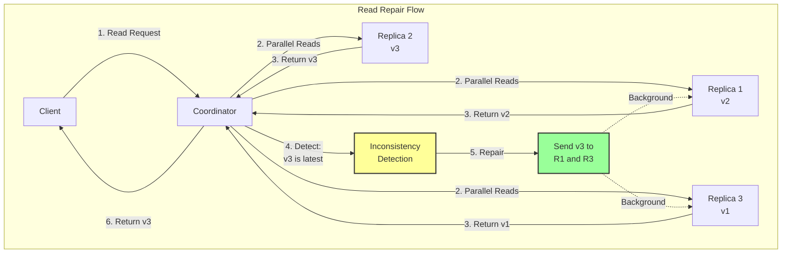
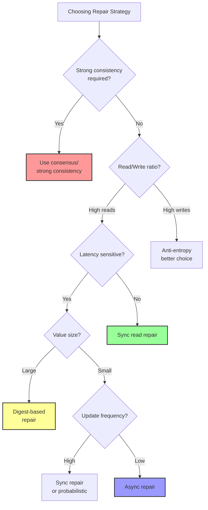

# Read Repair

[Home](/) > [Patterns](patterns) > [Data Patterns](patterns/#data-patterns) > Read Repair

**Healing inconsistencies one read at a time**

> *"The best time to fix a problem is when you discover it."*

!!! abstract "Pattern Overview"
    **Problem**: Replicas can become inconsistent due to failures, network partitions, or concurrent updates  
    **Solution**: Detect and repair inconsistencies opportunistically during read operations  
    **Trade-offs**: Additional read latency vs background repair overhead  
    **Used by**: Cassandra, Riak, DynamoDB, Voldemort

---

## Level 1: Intuition

### The Hospital Records Analogy

Imagine a hospital with patient records stored in multiple departments. When a doctor requests a patient's file:

1. **Fetch from Multiple Sources**: Nurses collect copies from different departments
2. **Compare Versions**: Check which department has the most recent update
3. **Fix Discrepancies**: Update outdated departments with the latest information
4. **Return Latest**: Give the doctor the most current version

This is exactly how read repair works in distributed systems!

### Read Repair vs Other Approaches

| Approach | When Repair Happens | Resource Usage | Consistency Speed |
|----------|-------------------|----------------|-------------------|
| **Read Repair** | During reads | On-demand | Variable |
| **Anti-Entropy** | Periodic background | Continuous | Predictable |
| **Hinted Handoff** | After temporary failure | During recovery | Fast for recent |
| **Write Repair** | During writes | Every write | Immediate |

### Visual Overview



---

## Level 2: Core Implementation

### Basic Read Repair Implementation

```python
import asyncio
import time
from typing import List, Tuple, Any, Dict, Optional
from dataclasses import dataclass
import logging

@dataclass
class VersionedData:
    """Data with version information"""
    value: Any
    version: int
    timestamp: float
    vector_clock: Dict[str, int] = None

class ReadRepairCoordinator:
    """Coordinates read repair across replicas"""
    
    def __init__(self, replicas: List[str], repair_chance: float = 0.1):
        self.replicas = replicas
        self.repair_chance = repair_chance  # Probability of background repair
        self.logger = logging.getLogger(__name__)
        
    async def read_with_repair(self, key: str, consistency_level: str = "QUORUM") -> Any:
        """Read with synchronous repair"""
        # Determine how many replicas to read from
        read_replicas = self._get_read_replicas(consistency_level)
        
        # Read from replicas in parallel
        responses = await self._read_from_replicas(key, read_replicas)
        
        if not responses:
            return None
            
        # Find the most recent version
        latest = self._resolve_conflicts(responses)
        
        # Identify outdated replicas
        outdated = self._find_outdated_replicas(responses, latest)
        
        if outdated:
            # Repair outdated replicas
            await self._repair_replicas(key, latest, outdated)
            
        return latest.value
    
    async def read_with_async_repair(self, key: str, consistency_level: str = "ONE") -> Any:
        """Read with asynchronous (background) repair"""
        # Quick read from minimum replicas
        read_replicas = self._get_read_replicas(consistency_level)
        responses = await self._read_from_replicas(key, read_replicas)
        
        if not responses:
            return None
            
        # Return quickly with first valid response
        latest = self._resolve_conflicts(responses)
        
        # Probabilistic background repair
        if self._should_repair():
            asyncio.create_task(self._background_repair(key, latest))
            
        return latest.value
    
    def _get_read_replicas(self, consistency_level: str) -> List[str]:
        """Determine which replicas to read from"""
        if consistency_level == "ONE":
            return [self.replicas[0]]  # Just primary
        elif consistency_level == "QUORUM":
            quorum_size = len(self.replicas) // 2 + 1
            return self.replicas[:quorum_size]
        elif consistency_level == "ALL":
            return self.replicas
        else:
            raise ValueError(f"Unknown consistency level: {consistency_level}")
    
    async def _read_from_replicas(self, key: str, replicas: List[str]) -> List[Tuple[str, VersionedData]]:
        """Read from multiple replicas in parallel"""
        tasks = []
        for replica in replicas:
            task = self._read_from_replica(replica, key)
            tasks.append((replica, task))
        
        responses = []
        for replica, task in tasks:
            try:
                data = await asyncio.wait_for(task, timeout=1.0)
                if data:
                    responses.append((replica, data))
            except asyncio.TimeoutError:
                self.logger.warning(f"Read timeout from replica {replica}")
            except Exception as e:
                self.logger.error(f"Read error from replica {replica}: {e}")
                
        return responses
    
    async def _read_from_replica(self, replica: str, key: str) -> Optional[VersionedData]:
        """Read from a single replica (mock implementation)"""
        # In real implementation, this would make network call
        await asyncio.sleep(0.01)  # Simulate network latency
        
        # Mock data with different versions
        if replica == "replica1":
            return VersionedData(value={"data": "old"}, version=1, timestamp=time.time() - 100)
        elif replica == "replica2":
            return VersionedData(value={"data": "latest"}, version=3, timestamp=time.time())
        elif replica == "replica3":
            return VersionedData(value={"data": "medium"}, version=2, timestamp=time.time() - 50)
        return None
    
    def _resolve_conflicts(self, responses: List[Tuple[str, VersionedData]]) -> VersionedData:
        """Resolve conflicts using version/timestamp"""
        if not responses:
            return None
            
        # Simple last-write-wins based on version
        latest = responses[0][1]
        for replica, data in responses[1:]:
            if data.version > latest.version:
                latest = data
            elif data.version == latest.version and data.timestamp > latest.timestamp:
                latest = data
                
        return latest
    
    def _find_outdated_replicas(self, responses: List[Tuple[str, VersionedData]], 
                                latest: VersionedData) -> List[str]:
        """Identify replicas with outdated data"""
        outdated = []
        for replica, data in responses:
            if data.version < latest.version:
                outdated.append(replica)
        return outdated
    
    async def _repair_replicas(self, key: str, latest: VersionedData, outdated_replicas: List[str]):
        """Repair outdated replicas"""
        repair_tasks = []
        for replica in outdated_replicas:
            task = self._write_to_replica(replica, key, latest)
            repair_tasks.append(task)
            
        # Wait for repairs to complete
        results = await asyncio.gather(*repair_tasks, return_exceptions=True)
        
        for replica, result in zip(outdated_replicas, results):
            if isinstance(result, Exception):
                self.logger.error(f"Failed to repair replica {replica}: {result}")
            else:
                self.logger.info(f"Successfully repaired replica {replica}")
    
    async def _write_to_replica(self, replica: str, key: str, data: VersionedData) -> bool:
        """Write to a single replica (mock implementation)"""
        await asyncio.sleep(0.01)  # Simulate network latency
        self.logger.info(f"Writing version {data.version} to {replica}")
        return True
    
    def _should_repair(self) -> bool:
        """Decide whether to perform background repair"""
        import random
        return random.random() < self.repair_chance
    
    async def _background_repair(self, key: str, known_latest: VersionedData):
        """Perform repair in background"""
        self.logger.info(f"Starting background repair for key {key}")
        
        # Read from all replicas
        all_responses = await self._read_from_replicas(key, self.replicas)
        
        # Find truly latest version (might have changed)
        latest = self._resolve_conflicts(all_responses)
        
        # Repair all outdated replicas
        outdated = self._find_outdated_replicas(all_responses, latest)
        if outdated:
            await self._repair_replicas(key, latest, outdated)
```

### Advanced Read Repair with Vector Clocks

```python
class VectorClock:
    """Simple vector clock implementation"""
    
    def __init__(self, node_id: str, clock: Dict[str, int] = None):
        self.node_id = node_id
        self.clock = clock or {}
        
    def increment(self):
        """Increment this node's clock"""
        self.clock[self.node_id] = self.clock.get(self.node_id, 0) + 1
        
    def update(self, other_clock: Dict[str, int]):
        """Update with another clock"""
        for node, count in other_clock.items():
            self.clock[node] = max(self.clock.get(node, 0), count)
            
    def happens_before(self, other: 'VectorClock') -> bool:
        """Check if this happens before other"""
        for node, count in self.clock.items():
            if count > other.clock.get(node, 0):
                return False
        return any(count < other.clock.get(node, 0) 
                  for node, count in other.clock.items())
    
    def concurrent_with(self, other: 'VectorClock') -> bool:
        """Check if concurrent with other"""
        return not self.happens_before(other) and not other.happens_before(self)

class CausalReadRepair(ReadRepairCoordinator):
    """Read repair with causal consistency using vector clocks"""
    
    def _resolve_conflicts(self, responses: List[Tuple[str, VersionedData]]) -> VersionedData:
        """Resolve conflicts using vector clocks"""
        if not responses:
            return None
            
        # Find all concurrent versions
        concurrent_versions = []
        
        for replica, data in responses:
            if not data.vector_clock:
                # Fallback to timestamp-based resolution
                return super()._resolve_conflicts(responses)
                
            vc = VectorClock(replica, data.vector_clock)
            
            # Check if this version is concurrent with others
            is_concurrent = True
            for other_replica, other_data in responses:
                if data == other_data:
                    continue
                    
                other_vc = VectorClock(other_replica, other_data.vector_clock)
                if vc.happens_before(other_vc):
                    is_concurrent = False
                    break
                    
            if is_concurrent:
                concurrent_versions.append((replica, data))
        
        if len(concurrent_versions) == 1:
            return concurrent_versions[0][1]
        elif len(concurrent_versions) > 1:
            # Multiple concurrent versions - need semantic resolution
            return self._semantic_merge(concurrent_versions)
        else:
            # Find the version that happens after all others
            for replica, data in responses:
                vc = VectorClock(replica, data.vector_clock)
                happens_after_all = True
                
                for other_replica, other_data in responses:
                    if data == other_data:
                        continue
                    other_vc = VectorClock(other_replica, other_data.vector_clock)
                    if not other_vc.happens_before(vc):
                        happens_after_all = False
                        break
                        
                if happens_after_all:
                    return data
                    
            # Shouldn't reach here, fallback to LWW
            return super()._resolve_conflicts(responses)
    
    def _semantic_merge(self, concurrent_versions: List[Tuple[str, VersionedData]]) -> VersionedData:
        """Merge concurrent versions semantically"""
        # Example: Shopping cart - union of all items
        merged_value = {}
        merged_vc = {}
        
        for replica, data in concurrent_versions:
            # Merge values (application-specific logic)
            if isinstance(data.value, dict):
                for key, value in data.value.items():
                    if key not in merged_value:
                        merged_value[key] = value
                    else:
                        # Application-specific merge
                        merged_value[key] = max(merged_value[key], value)
            
            # Merge vector clocks
            for node, count in data.vector_clock.items():
                merged_vc[node] = max(merged_vc.get(node, 0), count)
        
        # Create merged version
        return VersionedData(
            value=merged_value,
            version=max(v.version for _, v in concurrent_versions),
            timestamp=max(v.timestamp for _, v in concurrent_versions),
            vector_clock=merged_vc
        )
```

---

## Level 3: Production Patterns

### Quorum-Based Read Repair

```python
class QuorumReadRepair:
    """Production-grade read repair with quorum consensus"""
    
    def __init__(self, replicas: List[str], replication_factor: int = 3):
        self.replicas = replicas
        self.replication_factor = replication_factor
        self.metrics = ReadRepairMetrics()
        
    async def read_with_consistency(self, key: str, consistency_level: str) -> Any:
        """Read with specified consistency level"""
        start_time = time.time()
        
        try:
            # Calculate required replicas
            required_replicas = self._calculate_required_replicas(consistency_level)
            
            # Read from replicas
            responses = await self._read_with_timeout(key, required_replicas)
            
            # Check if we have enough responses
            if len(responses) < required_replicas:
                raise InsufficientReplicasException(
                    f"Got {len(responses)} responses, need {required_replicas}"
                )
            
            # Resolve and repair
            result = await self._resolve_and_repair(key, responses, consistency_level)
            
            # Record metrics
            self.metrics.record_read(
                consistency_level=consistency_level,
                duration=time.time() - start_time,
                repairs_needed=result.repairs_performed
            )
            
            return result.value
            
        except Exception as e:
            self.metrics.record_error(consistency_level, type(e).__name__)
            raise
    
    def _calculate_required_replicas(self, consistency_level: str) -> int:
        """Calculate number of required replicas"""
        if consistency_level == "ONE":
            return 1
        elif consistency_level == "TWO":
            return 2
        elif consistency_level == "THREE":
            return 3
        elif consistency_level == "QUORUM":
            return self.replication_factor // 2 + 1
        elif consistency_level == "LOCAL_QUORUM":
            local_replicas = self._count_local_replicas()
            return local_replicas // 2 + 1
        elif consistency_level == "EACH_QUORUM":
            # Quorum in each datacenter
            return self._calculate_each_quorum()
        elif consistency_level == "ALL":
            return self.replication_factor
        else:
            raise ValueError(f"Unknown consistency level: {consistency_level}")
    
    async def _read_with_timeout(self, key: str, required: int) -> List[Tuple[str, VersionedData]]:
        """Read from replicas with timeout handling"""
        # Start with required replicas
        primary_replicas = self._get_preferred_replicas(key)[:required]
        
        # Add extra for read repair
        read_repair_replicas = self._get_preferred_replicas(key)[required:required + 2]
        
        all_replicas = primary_replicas + read_repair_replicas
        
        # Parallel reads with staggered timeouts
        responses = []
        pending_tasks = []
        
        for i, replica in enumerate(all_replicas):
            timeout = 0.5 if i < required else 1.0  # Longer timeout for repair reads
            task = asyncio.create_task(self._read_with_individual_timeout(replica, key, timeout))
            pending_tasks.append((replica, task))
        
        # Collect responses as they arrive
        while pending_tasks and len(responses) < required + len(read_repair_replicas):
            done, pending = await asyncio.wait(
                [task for _, task in pending_tasks],
                return_when=asyncio.FIRST_COMPLETED,
                timeout=0.1
            )
            
            for task in done:
                for replica, t in pending_tasks:
                    if t == task:
                        try:
                            result = await task
                            if result:
                                responses.append((replica, result))
                        except Exception as e:
                            self.logger.warning(f"Read failed from {replica}: {e}")
                        pending_tasks.remove((replica, t))
                        break
            
            # Check if we have enough responses
            if len(responses) >= required:
                # Cancel remaining tasks if we have enough
                for _, task in pending_tasks:
                    task.cancel()
                break
        
        return responses

class ReadRepairMetrics:
    """Metrics collection for read repair"""
    
    def __init__(self):
        self.read_latencies = defaultdict(list)
        self.repair_counts = defaultdict(int)
        self.error_counts = defaultdict(int)
        
    def record_read(self, consistency_level: str, duration: float, repairs_needed: int):
        """Record successful read metrics"""
        self.read_latencies[consistency_level].append(duration)
        if repairs_needed > 0:
            self.repair_counts[consistency_level] += 1
            
    def record_error(self, consistency_level: str, error_type: str):
        """Record read error"""
        self.error_counts[f"{consistency_level}:{error_type}"] += 1
        
    def get_stats(self) -> Dict:
        """Get current statistics"""
        stats = {}
        
        for level, latencies in self.read_latencies.items():
            if latencies:
                stats[f"{level}_avg_latency"] = sum(latencies) / len(latencies)
                stats[f"{level}_p99_latency"] = sorted(latencies)[int(len(latencies) * 0.99)]
                
        stats["repair_counts"] = dict(self.repair_counts)
        stats["error_counts"] = dict(self.error_counts)
        
        return stats
```

### Digest-Based Read Repair

```python
import hashlib

class DigestReadRepair:
    """Efficient read repair using digests to minimize data transfer"""
    
    def __init__(self, replicas: List[str]):
        self.replicas = replicas
        
    async def read_with_digest_repair(self, key: str) -> Any:
        """Read using digest comparison for efficiency"""
        # Phase 1: Get digests from all replicas
        digest_responses = await self._get_digests(key)
        
        if not digest_responses:
            return None
            
        # Check if all digests match
        unique_digests = set(d.digest for _, d in digest_responses)
        
        if len(unique_digests) == 1:
            # All replicas agree, just read from one
            replica = digest_responses[0][0]
            return await self._read_full_data(replica, key)
        
        # Phase 2: Digests differ, need full data
        # Group replicas by digest
        digest_groups = defaultdict(list)
        for replica, digest_data in digest_responses:
            digest_groups[digest_data.digest].append((replica, digest_data))
        
        # Read full data from one replica per unique digest
        full_data_responses = []
        for digest, replicas in digest_groups.items():
            # Pick first replica from each group
            replica = replicas[0][0]
            data = await self._read_full_data(replica, key)
            if data:
                full_data_responses.append((replica, data))
        
        # Resolve conflicts
        if not full_data_responses:
            return None
            
        latest = self._resolve_conflicts([d for _, d in full_data_responses])
        
        # Phase 3: Repair replicas with wrong digest
        latest_digest = self._compute_digest(latest)
        repair_tasks = []
        
        for replica, digest_data in digest_responses:
            if digest_data.digest != latest_digest:
                task = self._repair_replica(replica, key, latest)
                repair_tasks.append(task)
        
        if repair_tasks:
            await asyncio.gather(*repair_tasks, return_exceptions=True)
            
        return latest.value
    
    async def _get_digests(self, key: str) -> List[Tuple[str, DigestData]]:
        """Get digests from all replicas"""
        tasks = []
        for replica in self.replicas:
            task = self._get_digest_from_replica(replica, key)
            tasks.append((replica, task))
            
        responses = []
        for replica, task in tasks:
            try:
                digest_data = await asyncio.wait_for(task, timeout=0.5)
                if digest_data:
                    responses.append((replica, digest_data))
            except:
                pass
                
        return responses
    
    def _compute_digest(self, data: VersionedData) -> str:
        """Compute digest for data"""
        hasher = hashlib.sha256()
        hasher.update(str(data.value).encode())
        hasher.update(str(data.version).encode())
        hasher.update(str(data.timestamp).encode())
        return hasher.hexdigest()

@dataclass
class DigestData:
    """Digest with metadata"""
    digest: str
    version: int
    timestamp: float
    size: int
```

---

## Level 4: Advanced Techniques

### Adaptive Read Repair

```python
class AdaptiveReadRepair:
    """Dynamically adjust repair strategy based on system conditions"""
    
    def __init__(self, replicas: List[str]):
        self.replicas = replicas
        self.stats = RepairStatistics()
        self.config = AdaptiveConfig()
        
    async def read_with_adaptive_repair(self, key: str) -> Any:
        """Read with dynamically chosen repair strategy"""
        # Analyze current system state
        strategy = self._choose_repair_strategy(key)
        
        if strategy == "NONE":
            # No repair, just read from one
            return await self._read_no_repair(key)
        elif strategy == "ASYNC":
            # Asynchronous background repair
            return await self._read_async_repair(key)
        elif strategy == "SYNC":
            # Synchronous repair before returning
            return await self._read_sync_repair(key)
        elif strategy == "DIGEST":
            # Digest-based repair for large values
            return await self._read_digest_repair(key)
            
    def _choose_repair_strategy(self, key: str) -> str:
        """Choose repair strategy based on metrics"""
        # Get key characteristics
        key_stats = self.stats.get_key_stats(key)
        
        # High update frequency - likely to be inconsistent
        if key_stats.update_rate > self.config.high_update_threshold:
            return "SYNC"
            
        # Large value size - use digest
        if key_stats.avg_size > self.config.large_value_threshold:
            return "DIGEST"
            
        # Low read frequency - async is fine
        if key_stats.read_rate < self.config.low_read_threshold:
            return "ASYNC"
            
        # Recent repairs failed - skip repair
        if key_stats.recent_repair_failures > self.config.failure_threshold:
            return "NONE"
            
        # Default to async
        return "ASYNC"

class RepairStatistics:
    """Track statistics for adaptive behavior"""
    
    def __init__(self):
        self.key_stats = defaultdict(KeyStatistics)
        self.global_stats = GlobalStatistics()
        
    def record_read(self, key: str, size: int, repair_performed: bool, 
                   repair_success: bool = True):
        """Record read operation statistics"""
        stats = self.key_stats[key]
        stats.read_count += 1
        stats.total_size += size
        stats.last_read_time = time.time()
        
        if repair_performed:
            stats.repair_count += 1
            if not repair_success:
                stats.recent_repair_failures += 1
            else:
                stats.recent_repair_failures = 0
                
        # Update rates
        stats.update_read_rate()
        
    def get_key_stats(self, key: str) -> 'KeyStatistics':
        """Get statistics for a key"""
        return self.key_stats.get(key, KeyStatistics())

@dataclass
class KeyStatistics:
    """Statistics for a single key"""
    read_count: int = 0
    repair_count: int = 0
    total_size: int = 0
    last_read_time: float = 0
    recent_repair_failures: int = 0
    read_rate: float = 0.0
    update_rate: float = 0.0
    
    @property
    def avg_size(self) -> float:
        return self.total_size / max(1, self.read_count)
        
    def update_read_rate(self):
        """Update read rate using exponential decay"""
        if self.last_read_time > 0:
            time_since_last = time.time() - self.last_read_time
            # Exponential moving average
            self.read_rate = 0.9 * self.read_rate + 0.1 * (1.0 / max(0.1, time_since_last))
```

### Read Repair with Merkle Trees

```python
class MerkleTreeReadRepair:
    """Efficient read repair using Merkle trees for large datasets"""
    
    def __init__(self, replicas: List[str]):
        self.replicas = replicas
        self.merkle_cache = {}
        
    async def repair_range(self, start_key: str, end_key: str):
        """Repair a range of keys efficiently"""
        # Get Merkle trees from all replicas
        trees = await self._get_merkle_trees(start_key, end_key)
        
        if len(trees) < 2:
            return  # Need at least 2 replicas
            
        # Compare trees pairwise
        primary_replica, primary_tree = trees[0]
        
        for replica, tree in trees[1:]:
            # Find differing ranges
            diff_ranges = self._compare_merkle_trees(primary_tree, tree)
            
            if diff_ranges:
                # Repair only the differing ranges
                await self._repair_ranges(primary_replica, replica, diff_ranges)
                
    def _compare_merkle_trees(self, tree1: 'MerkleTree', tree2: 'MerkleTree') -> List[Tuple[str, str]]:
        """Compare two Merkle trees and find differing ranges"""
        diff_ranges = []
        
        def compare_nodes(node1, node2, range_start, range_end):
            if node1.hash == node2.hash:
                return  # Subtrees are identical
                
            if node1.is_leaf() or node2.is_leaf():
                # Found a difference at leaf level
                diff_ranges.append((range_start, range_end))
                return
                
            # Recurse into children
            mid_key = self._find_mid_key(range_start, range_end)
            
            if node1.left and node2.left:
                compare_nodes(node1.left, node2.left, range_start, mid_key)
            if node1.right and node2.right:
                compare_nodes(node1.right, node2.right, mid_key, range_end)
                
        compare_nodes(tree1.root, tree2.root, tree1.start_key, tree1.end_key)
        return diff_ranges
        
    async def _repair_ranges(self, source_replica: str, target_replica: str, 
                           ranges: List[Tuple[str, str]]):
        """Repair specific key ranges"""
        for start_key, end_key in ranges:
            # Read all key-values in range from source
            data = await self._read_range(source_replica, start_key, end_key)
            
            # Write to target
            await self._write_range(target_replica, data)

class MerkleTree:
    """Merkle tree for efficient comparison"""
    
    def __init__(self, start_key: str, end_key: str):
        self.start_key = start_key
        self.end_key = end_key
        self.root = None
        
    def build_from_data(self, key_value_pairs: List[Tuple[str, Any]]):
        """Build Merkle tree from key-value pairs"""
        # Sort by key
        sorted_pairs = sorted(key_value_pairs, key=lambda x: x[0])
        
        # Build tree bottom-up
        self.root = self._build_tree(sorted_pairs, self.start_key, self.end_key)
        
    def _build_tree(self, pairs: List[Tuple[str, Any]], start: str, end: str) -> 'MerkleNode':
        """Recursively build tree"""
        if len(pairs) <= self.LEAF_SIZE:
            # Create leaf node
            return MerkleLeaf(pairs)
            
        # Split pairs
        mid_idx = len(pairs) // 2
        mid_key = pairs[mid_idx][0]
        
        # Build children
        left_child = self._build_tree(pairs[:mid_idx], start, mid_key)
        right_child = self._build_tree(pairs[mid_idx:], mid_key, end)
        
        # Create internal node
        return MerkleInternal(left_child, right_child)
```

---

## Level 5: Real-World Applications

### Cassandra's Read Repair Implementation

```python
class CassandraStyleReadRepair:
    """Read repair implementation similar to Apache Cassandra"""
    
    def __init__(self, cluster_config: 'ClusterConfig'):
        self.config = cluster_config
        self.consistency_levels = {
            'ANY': 0,
            'ONE': 1,
            'TWO': 2,
            'THREE': 3,
            'QUORUM': lambda rf: rf // 2 + 1,
            'LOCAL_QUORUM': lambda rf: self._local_quorum(rf),
            'EACH_QUORUM': lambda rf: self._each_quorum(rf),
            'ALL': lambda rf: rf
        }
        self.read_repair_chance = 0.1  # 10% by default
        self.dclocal_read_repair_chance = 0.0  # Disabled by default
        
    async def execute_read(self, keyspace: str, table: str, key: str, 
                          consistency_level: str = 'QUORUM') -> Any:
        """Execute read with Cassandra-style read repair"""
        # Get table metadata
        table_meta = self.config.get_table_metadata(keyspace, table)
        rf = table_meta.replication_factor
        
        # Calculate required responses
        required = self._calculate_required_responses(consistency_level, rf)
        
        # Get endpoints (replicas) for the key
        endpoints = self._get_endpoints(keyspace, table, key)
        
        # Separate into local and remote endpoints
        local_endpoints = [e for e in endpoints if e.is_local()]
        remote_endpoints = [e for e in endpoints if not e.is_local()]
        
        # Read from endpoints
        responses = await self._read_from_endpoints(
            key, local_endpoints + remote_endpoints, required
        )
        
        if len(responses) < required:
            raise ReadTimeoutException(
                f"Required {required} responses but got {len(responses)}"
            )
        
        # Resolve data
        resolved_data = self._resolve_responses(responses)
        
        # Decide on read repair
        if self._should_read_repair(local_endpoints, remote_endpoints):
            # Perform read repair
            asyncio.create_task(
                self._background_read_repair(key, endpoints, resolved_data)
            )
        
        return resolved_data
    
    def _should_read_repair(self, local_endpoints: List, remote_endpoints: List) -> bool:
        """Decide whether to perform read repair"""
        import random
        
        # Check DC-local read repair chance
        if local_endpoints and random.random() < self.dclocal_read_repair_chance:
            return True
            
        # Check global read repair chance
        if random.random() < self.read_repair_chance:
            return True
            
        return False
    
    async def _background_read_repair(self, key: str, endpoints: List, 
                                    resolved_data: Any):
        """Perform read repair in background"""
        try:
            # Read from all endpoints
            all_responses = await self._read_from_all_endpoints(key, endpoints)
            
            # Find endpoints with outdated data
            outdated = []
            for endpoint, response in all_responses:
                if not self._data_matches(response, resolved_data):
                    outdated.append(endpoint)
            
            # Repair outdated endpoints
            if outdated:
                await self._repair_endpoints(key, resolved_data, outdated)
                
                # Update metrics
                self.metrics.increment('read_repair.performed')
                self.metrics.record('read_repair.endpoints_repaired', len(outdated))
                
        except Exception as e:
            self.logger.error(f"Background read repair failed: {e}")
            self.metrics.increment('read_repair.failed')
    
    def _resolve_responses(self, responses: List[Tuple['Endpoint', Any]]) -> Any:
        """Resolve responses using timestamp and data comparison"""
        if not responses:
            return None
            
        # Group by data content
        data_groups = defaultdict(list)
        for endpoint, data in responses:
            data_hash = self._compute_data_hash(data)
            data_groups[data_hash].append((endpoint, data))
        
        # If all agree, return the data
        if len(data_groups) == 1:
            return responses[0][1]
        
        # Find most recent by timestamp
        latest_timestamp = -1
        latest_data = None
        
        for data_hash, group in data_groups.items():
            for endpoint, data in group:
                if data.timestamp > latest_timestamp:
                    latest_timestamp = data.timestamp
                    latest_data = data
                    
        return latest_data

class DigestMismatchException(Exception):
    """Raised when digest read shows inconsistency"""
    pass

class ReadTimeoutException(Exception):
    """Raised when insufficient replicas respond"""
    pass
```

### Performance Comparison

| Strategy | Read Latency | Repair Overhead | Network Usage | Best For |
|----------|-------------|-----------------|---------------|----------|
| **No Repair** | Lowest | None | Minimal | Read-once data |
| **Sync Repair** | Highest | High | High | Critical data |
| **Async Repair** | Low | Medium | Medium | General use |
| **Digest Repair** | Medium | Low | Low | Large values |
| **Probabilistic** | Low | Low | Low | High volume |

### Monitoring Read Repair

```python
class ReadRepairMonitor:
    """Monitor read repair effectiveness"""
    
    def __init__(self):
        self.metrics = {
            'reads_total': Counter(),
            'repairs_initiated': Counter(),
            'repairs_completed': Counter(),
            'repairs_failed': Counter(),
            'inconsistencies_found': Counter(),
            'repair_latency': Histogram(),
            'data_divergence_time': Histogram()
        }
        
    def record_read(self, consistency_level: str, repair_performed: bool):
        """Record a read operation"""
        self.metrics['reads_total'].labels(
            consistency_level=consistency_level
        ).inc()
        
        if repair_performed:
            self.metrics['repairs_initiated'].labels(
                consistency_level=consistency_level
            ).inc()
            
    def record_inconsistency(self, replicas_differ: int, total_replicas: int):
        """Record found inconsistency"""
        self.metrics['inconsistencies_found'].labels(
            severity=self._classify_severity(replicas_differ, total_replicas)
        ).inc()
        
    def record_repair_complete(self, duration: float, repaired_count: int):
        """Record completed repair"""
        self.metrics['repairs_completed'].inc()
        self.metrics['repair_latency'].observe(duration)
        
    def _classify_severity(self, differ: int, total: int) -> str:
        """Classify inconsistency severity"""
        ratio = differ / total
        if ratio < 0.1:
            return "low"
        elif ratio < 0.3:
            return "medium"
        else:
            return "high"
            
    def get_dashboard_metrics(self) -> Dict:
        """Get metrics for monitoring dashboard"""
        return {
            'read_repair_ratio': self._calculate_repair_ratio(),
            'inconsistency_rate': self._calculate_inconsistency_rate(),
            'average_repair_latency': self._get_average_repair_latency(),
            'repair_success_rate': self._calculate_success_rate()
        }
```

---

## Decision Framework

### When to Use Read Repair



### Read Repair Configuration Guide

| Parameter | Range | Default | Considerations |
|-----------|-------|---------|----------------|
| **read_repair_chance** | 0.0-1.0 | 0.1 | Higher = more consistent, more overhead |
| **dclocal_read_repair_chance** | 0.0-1.0 | 0.0 | For multi-DC deployments |
| **sync_repair_threshold** | 1-N | N/2+1 | Minimum replicas for sync repair |
| **digest_size_threshold** | Bytes | 1MB | Use digest for larger values |
| **repair_timeout** | ms | 1000 | Timeout for repair operations |
| **max_concurrent_repairs** | 1-100 | 10 | Limit repair parallelism |

---

## Common Pitfalls & Solutions

| Pitfall | Impact | Solution |
|---------|--------|----------|
| **Always sync repair** | High read latency | Use probabilistic or async |
| **No repair monitoring** | Hidden inconsistencies | Track repair metrics |
| **Repair storms** | System overload | Rate limit repairs |
| **Ignoring failures** | Permanent inconsistency | Implement retry with backoff |
| **Wrong consistency level** | Unnecessary repairs | Match to data requirements |

---

## Implementation Checklist

- [ ] Choose appropriate repair strategy (sync/async/digest/probabilistic)
- [ ] Implement version comparison (timestamp/version/vector clock)
- [ ] Add conflict resolution logic
- [ ] Set up repair probability/frequency
- [ ] Implement timeout handling
- [ ] Add metrics collection
- [ ] Configure for multi-datacenter if needed
- [ ] Test under various failure scenarios
- [ ] Monitor repair effectiveness
- [ ] Document consistency guarantees

---

## Related Patterns

### Core Concepts
- [Eventual Consistency](eventual-consistency.md) - The consistency model read repair supports
- [Vector Clocks](vector-clocks.md) - For detecting concurrent updates
- [Quorum Consensus](consensus.md) - Often used with read repair

### Complementary Patterns
- [Anti-Entropy](anti-entropy.md) - Background repair mechanism
- [Hinted Handoff](hinted-handoff.md) - Temporary failure handling
- [Merkle Trees](merkle-trees.md) - Efficient difference detection

### Case Studies
- [Cassandra Architecture](../case-studies/cassandra.md) - Production read repair implementation
- [DynamoDB Internals](../case-studies/amazon-dynamo.md) - Probabilistic read repair
- [Riak](../case-studies/riak.md) - Read repair with vector clocks

---

## 🎓 Key Takeaways

1. **Read repair detects and fixes inconsistencies** during normal read operations
2. **Multiple strategies exist** - choose based on your consistency/latency trade-offs
3. **Probabilistic repair reduces overhead** while maintaining eventual consistency
4. **Digest-based repair is efficient** for large values
5. **Monitoring is critical** to ensure repair effectiveness

---

*"Read repair turns every read into an opportunity for consistency."*