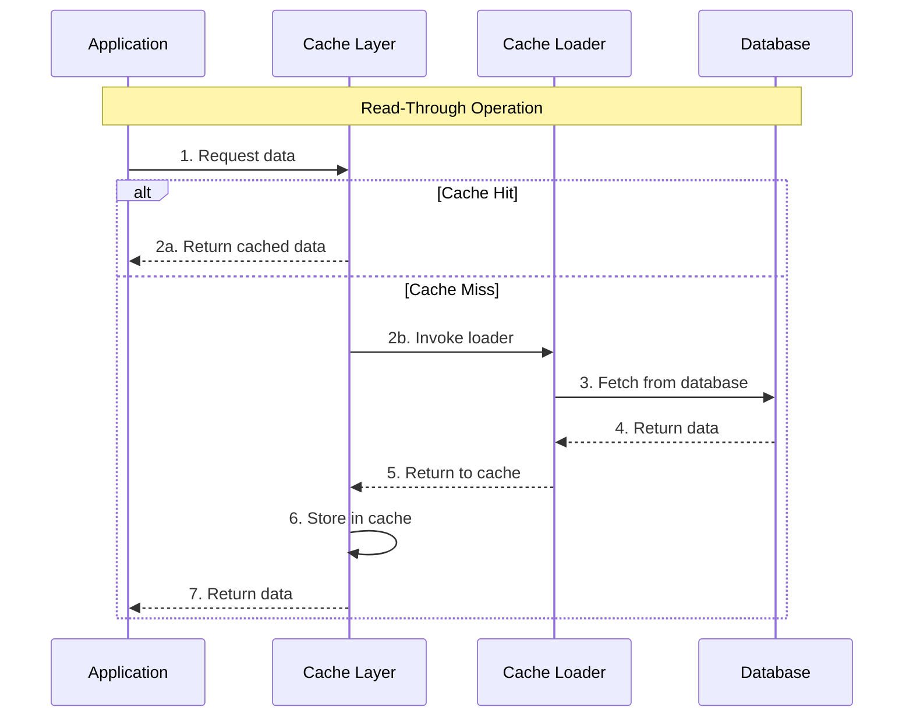
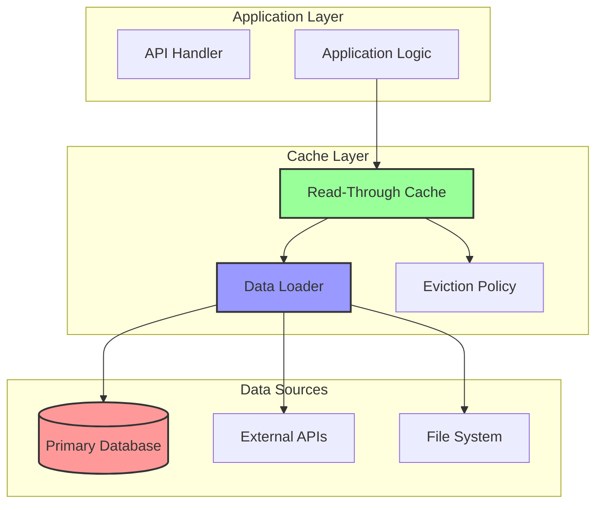
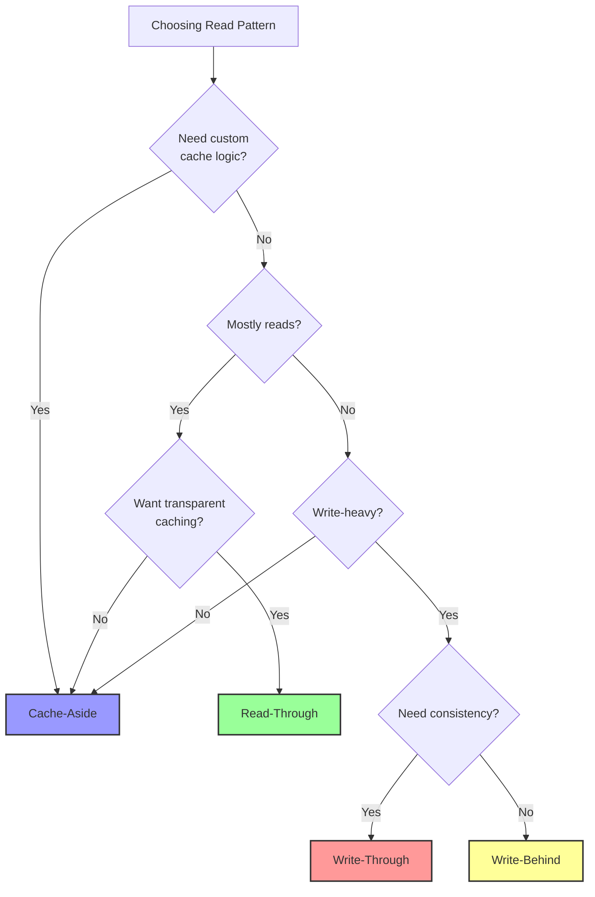

# Read-Through Cache Pattern

**The cache that fetches for you - Transparent data loading for seamless performance**

> *"The best cache is the one you don't have to think about." - Developer Productivity Maxim*

---

## Level 1: Intuition

### The Smart Assistant Analogy

Read-through caching is like having a smart assistant who:
1. When you ask for information, they check their notes first
2. If they don't have it, they automatically research it for you
3. They write down the answer for next time
4. You never have to tell them to look it up - they just know
5. From your perspective, you always get an answer with one simple request

### Visual Pattern Flow



### Key Characteristics

!!! tip
    **Read-Through Pattern**
    - **Transparency**: Application doesn't manage cache loading
    - **Simplicity**: Single point of data access
    - **Consistency**: Loader ensures consistent data format
    - **Automatic**: Cache population happens transparently
    - **Use Case**: Reference data, configuration, catalogs

---

## Level 2: Deep Dive

### Implementation Architecture



### Complete Implementation Example

```python
import redis
import asyncio
from typing import Optional, Any, Callable, Dict, List
from datetime import datetime, timedelta
import logging
from abc import ABC, abstractmethod
from functools import wraps

class DataLoader(ABC):
    """Abstract base class for data loaders"""
    
    @abstractmethod
    async def load(self, key: str) -> Optional[Any]:
        """Load data for given key"""
        pass
    
    @abstractmethod
    async def load_many(self, keys: List[str]) -> Dict[str, Any]:
        """Batch load multiple keys"""
        pass

class ReadThroughCache:
    """
    Production-ready Read-Through Cache implementation with:
    - Transparent data loading
    - Batch loading support
    - Configurable TTL and refresh
    - Multiple loader support
    """
    
    def __init__(
        self, 
        redis_client: redis.Redis,
        default_ttl: int = 3600,
        enable_refresh: bool = True,
        refresh_threshold: float = 0.8
    ):
        self.cache = redis_client
        self.default_ttl = default_ttl
        self.enable_refresh = enable_refresh
        self.refresh_threshold = refresh_threshold
        self.loaders: Dict[str, DataLoader] = {}
        self.logger = logging.getLogger(__name__)
        self.metrics = CacheMetrics()
        
    def register_loader(self, namespace: str, loader: DataLoader):
        """Register a data loader for a namespace"""
        self.loaders[namespace] = loader
        self.logger.info(f"Registered loader for namespace: {namespace}")
    
    async def get(
        self, 
        key: str, 
        namespace: str = "default",
        ttl: Optional[int] = None
    ) -> Optional[Any]:
        """
        Get value with read-through semantics
        """
        start_time = datetime.now()
        full_key = f"{namespace}:{key}"
        
        try:
# Check cache
            cached_data = await self._get_from_cache(full_key)
            
            if cached_data is not None:
                self.metrics.record_hit(full_key)
                
# Check if refresh needed
                if self.enable_refresh:
                    await self._check_and_refresh(full_key, namespace, key, ttl)
                
                return cached_data['value']
            
# Cache miss - load through
            self.metrics.record_miss(full_key)
            
# Get appropriate loader
            loader = self.loaders.get(namespace)
            if not loader:
                raise ValueError(f"No loader registered for namespace: {namespace}")
            
# Load data
            value = await self._load_with_protection(
                loader, key, full_key, ttl or self.default_ttl
            )
            
# Record metrics
            duration = (datetime.now() - start_time).total_seconds()
            self.metrics.record_read_through(full_key, duration, value is not None)
            
            return value
            
        except Exception as e:
            self.logger.error(f"Read-through failed for key {full_key}: {e}")
            self.metrics.record_error(full_key, "read_through")
            raise
    
    async def get_many(
        self,
        keys: List[str],
        namespace: str = "default",
        ttl: Optional[int] = None
    ) -> Dict[str, Any]:
        """
        Batch get with read-through
        """
        results = {}
        missing_keys = []
        full_key_map = {f"{namespace}:{k}": k for k in keys}
        
# Check cache for all keys
        pipe = self.cache.pipeline()
        for key in keys:
            pipe.get(f"{namespace}:{key}")
        
        cached_values = await pipe.execute()
        
# Process cached values
        for key, cached in zip(keys, cached_values):
            if cached:
                data = self._deserialize(cached)
                results[key] = data['value']
                self.metrics.record_hit(f"{namespace}:{key}")
            else:
                missing_keys.append(key)
                self.metrics.record_miss(f"{namespace}:{key}")
        
# Load missing keys
        if missing_keys:
            loader = self.loaders.get(namespace)
            if not loader:
                raise ValueError(f"No loader registered for namespace: {namespace}")
            
# Batch load
            loaded_data = await loader.load_many(missing_keys)
            
# Cache loaded data
            pipe = self.cache.pipeline()
            for key, value in loaded_data.items():
                if value is not None:
                    full_key = f"{namespace}:{key}"
                    cache_data = {
                        'value': value,
                        'created_at': datetime.now().isoformat(),
                        'ttl': ttl or self.default_ttl
                    }
                    pipe.setex(
                        full_key,
                        ttl or self.default_ttl,
                        self._serialize(cache_data)
                    )
                    results[key] = value
            
            await pipe.execute()
        
        return results
    
    async def invalidate(self, key: str, namespace: str = "default") -> bool:
        """Invalidate cache entry"""
        full_key = f"{namespace}:{key}"
        deleted = await self.cache.delete(full_key)
        self.metrics.record_invalidation(full_key)
        return deleted > 0
    
    async def _load_with_protection(
        self,
        loader: DataLoader,
        key: str,
        full_key: str,
        ttl: int
    ) -> Optional[Any]:
        """
        Load with stampede protection
        """
        lock_key = f"lock:{full_key}"
        lock_acquired = False
        
        try:
# Try to acquire lock
            lock_acquired = await self.cache.set(
                lock_key, "1", nx=True, ex=30
            )
            
            if lock_acquired:
# We have the lock, load data
                value = await loader.load(key)
                
                if value is not None:
# Cache the loaded value
                    cache_data = {
                        'value': value,
                        'created_at': datetime.now().isoformat(),
                        'ttl': ttl
                    }
                    await self.cache.setex(
                        full_key, ttl, self._serialize(cache_data)
                    )
                
                return value
            else:
# Someone else is loading, wait for result
                for _ in range(50):  # 5 seconds max
                    await asyncio.sleep(0.1)
                    cached = await self._get_from_cache(full_key)
                    if cached:
                        return cached['value']
                
# Timeout - try loading anyway
                return await loader.load(key)
                
        finally:
            if lock_acquired:
                await self.cache.delete(lock_key)
    
    async def _check_and_refresh(
        self,
        full_key: str,
        namespace: str,
        key: str,
        ttl: Optional[int]
    ):
        """
        Check if refresh is needed and trigger background refresh
        """
        remaining_ttl = await self.cache.ttl(full_key)
        original_ttl = ttl or self.default_ttl
        
        if remaining_ttl > 0 and remaining_ttl < (original_ttl * self.refresh_threshold):
# Trigger background refresh
            asyncio.create_task(
                self._background_refresh(full_key, namespace, key, original_ttl)
            )
    
    async def _background_refresh(
        self,
        full_key: str,
        namespace: str,
        key: str,
        ttl: int
    ):
        """
        Refresh cache entry in background
        """
        try:
            loader = self.loaders.get(namespace)
            if loader:
                value = await loader.load(key)
                if value is not None:
                    cache_data = {
                        'value': value,
                        'created_at': datetime.now().isoformat(),
                        'ttl': ttl
                    }
                    await self.cache.setex(
                        full_key, ttl, self._serialize(cache_data)
                    )
                    self.logger.debug(f"Background refresh completed for {full_key}")
        except Exception as e:
            self.logger.warning(f"Background refresh failed for {full_key}: {e}")

# Example Data Loaders
class DatabaseLoader(DataLoader):
    """Load data from database"""
    
    def __init__(self, db_connection):
        self.db = db_connection
    
    async def load(self, key: str) -> Optional[Any]:
        """Load single item from database"""
        query = "SELECT * FROM items WHERE id = $1"
        result = await self.db.fetch_one(query, [key])
        return dict(result) if result else None
    
    async def load_many(self, keys: List[str]) -> Dict[str, Any]:
        """Batch load from database"""
        query = "SELECT * FROM items WHERE id = ANY($1)"
        results = await self.db.fetch_all(query, [keys])
        
        return {
            row['id']: dict(row) for row in results
        }

class CompositeLoader(DataLoader):
    """Load data from multiple sources with fallback"""
    
    def __init__(self, primary_loader: DataLoader, fallback_loader: DataLoader):
        self.primary = primary_loader
        self.fallback = fallback_loader
    
    async def load(self, key: str) -> Optional[Any]:
        """Try primary, fallback to secondary"""
        try:
            result = await self.primary.load(key)
            if result is not None:
                return result
        except Exception as e:
            logging.warning(f"Primary loader failed: {e}")
        
# Try fallback
        return await self.fallback.load(key)
    
    async def load_many(self, keys: List[str]) -> Dict[str, Any]:
        """Batch load with fallback"""
        results = {}
        
        try:
            results = await self.primary.load_many(keys)
        except Exception as e:
            logging.warning(f"Primary batch load failed: {e}")
        
# Find missing keys
        missing = [k for k in keys if k not in results]
        
        if missing:
            fallback_results = await self.fallback.load_many(missing)
            results.update(fallback_results)
        
        return results

# Decorator for easy read-through caching
def read_through_cache(
    cache_instance: ReadThroughCache,
    namespace: str,
    ttl: Optional[int] = None,
    key_func: Optional[Callable] = None
):
    """Decorator for read-through caching"""
    
    def decorator(func):
# Create a custom loader for this function
        class FunctionLoader(DataLoader):
            async def load(self, key: str) -> Optional[Any]:
# Parse key back to arguments if needed
                if key_func:
                    args = key_func(key, reverse=True)
                    return await func(*args)
                else:
                    return await func(key)
            
            async def load_many(self, keys: List[str]) -> Dict[str, Any]:
# Simple implementation - could be optimized
                results = {}
                for key in keys:
                    results[key] = await self.load(key)
                return results
        
# Register loader
        loader = FunctionLoader()
        cache_instance.register_loader(namespace, loader)
        
        @wraps(func)
        async def wrapper(*args, **kwargs):
# Generate cache key
            if key_func:
                key = key_func(*args, **kwargs)
            else:
                key = str(args[0]) if args else str(kwargs)
            
            return await cache_instance.get(key, namespace, ttl)
        
        return wrapper
    
    return decorator

# Usage example
class ProductService:
    def __init__(self, read_through_cache: ReadThroughCache, db):
        self.cache = read_through_cache
        self.db = db
        
# Register loaders
        self.cache.register_loader('product', DatabaseLoader(db))
        self.cache.register_loader('category', DatabaseLoader(db))
    
    async def get_product(self, product_id: str) -> Optional[Dict]:
        """Get product with automatic caching"""
        return await self.cache.get(product_id, namespace='product')
    
    async def get_products(self, product_ids: List[str]) -> Dict[str, Dict]:
        """Batch get products"""
        return await self.cache.get_many(product_ids, namespace='product')
    
    @read_through_cache(cache, namespace='expensive_calculation', ttl=3600)
    async def calculate_recommendation(self, user_id: str) -> List[str]:
        """Expensive calculation cached transparently"""
# Complex recommendation logic
        recommendations = await self._run_ml_model(user_id)
        return recommendations
```

### Advanced Features

```python
class AdvancedReadThroughCache(ReadThroughCache):
    """Extended read-through with advanced features"""
    
    async def get_with_metadata(
        self,
        key: str,
        namespace: str = "default",
        include_metadata: bool = True
    ) -> Dict[str, Any]:
        """
        Get value with cache metadata
        """
        full_key = f"{namespace}:{key}"
        cached_data = await self._get_from_cache(full_key)
        
        if cached_data:
            result = {'value': cached_data['value']}
            
            if include_metadata:
                result['metadata'] = {
                    'cached_at': cached_data.get('created_at'),
                    'ttl': cached_data.get('ttl'),
                    'remaining_ttl': await self.cache.ttl(full_key),
                    'cache_key': full_key
                }
            
            return result
        
# Load through
        value = await self.get(key, namespace)
        
        return {
            'value': value,
            'metadata': {
                'cached_at': datetime.now().isoformat(),
                'loaded_from': 'source',
                'cache_key': full_key
            }
        }
    
    async def get_or_set(
        self,
        key: str,
        default_func: Callable,
        namespace: str = "default",
        ttl: Optional[int] = None
    ) -> Any:
        """
        Get with default function if not found
        """
        value = await self.get(key, namespace, ttl)
        
        if value is None:
# Generate default
            value = await default_func()
            
# Cache it
            if value is not None:
                full_key = f"{namespace}:{key}"
                cache_data = {
                    'value': value,
                    'created_at': datetime.now().isoformat(),
                    'ttl': ttl or self.default_ttl
                }
                await self.cache.setex(
                    full_key,
                    ttl or self.default_ttl,
                    self._serialize(cache_data)
                )
        
        return value
    
    async def touch(self, key: str, namespace: str = "default") -> bool:
        """
        Refresh TTL without loading
        """
        full_key = f"{namespace}:{key}"
        cached_data = await self._get_from_cache(full_key)
        
        if cached_data:
            ttl = cached_data.get('ttl', self.default_ttl)
            return await self.cache.expire(full_key, ttl)
        
        return False
```

---

## Level 3: Production Patterns

### Performance Optimization

<div class="law-box">

**Read-Through Performance Guidelines**

1. **Loader Optimization**
   - Implement efficient batch loading
   - Use connection pooling in loaders
   - Cache loader instances

2. **Refresh Strategy**
   - Use probabilistic early expiration
   - Implement smart refresh based on access patterns
   - Avoid thundering herd with jittered refresh

3. **Monitoring**
   - Track loader performance
   - Monitor cache hit rates by namespace
   - Alert on loader failures

</div>

### Common Pitfalls and Solutions

```python
class ReadThroughPitfalls:
    """Common issues and their solutions"""
    
# PITFALL 1: Slow Loaders
    async def timeout_protection(self, loader: DataLoader, key: str, timeout: int = 5):
        """Protect against slow loaders"""
        try:
            return await asyncio.wait_for(
                loader.load(key),
                timeout=timeout
            )
        except asyncio.TimeoutError:
            self.logger.error(f"Loader timeout for key: {key}")
            self.metrics.record_timeout(key)
            return None
    
# PITFALL 2: Cascading Failures
    async def circuit_breaker_loader(self, loader: DataLoader):
        """Wrap loader with circuit breaker"""
        class CircuitBreakerLoader(DataLoader):
            def __init__(self, wrapped_loader):
                self.loader = wrapped_loader
                self.failure_count = 0
                self.circuit_open = False
                self.last_failure_time = None
            
            async def load(self, key: str):
                if self.circuit_open:
# Check if we should retry
                    if (datetime.now() - self.last_failure_time).seconds > 60:
                        self.circuit_open = False
                    else:
                        raise Exception("Circuit breaker open")
                
                try:
                    result = await self.loader.load(key)
                    self.failure_count = 0
                    return result
                except Exception as e:
                    self.failure_count += 1
                    self.last_failure_time = datetime.now()
                    
                    if self.failure_count >= 5:
                        self.circuit_open = True
                    
                    raise
        
        return CircuitBreakerLoader(loader)
    
# PITFALL 3: Inefficient Batch Loading
    async def optimize_batch_loading(self, keys: List[str], loader: DataLoader):
        """Optimize batch loading with chunking"""
        chunk_size = 100
        results = {}
        
# Process in chunks
        for i in range(0, len(keys), chunk_size):
            chunk = keys[i:i + chunk_size]
            
# Parallel load chunks
            chunk_results = await loader.load_many(chunk)
            results.update(chunk_results)
        
        return results
```

### Monitoring and Observability

```python
class ReadThroughMonitoring:
    """Production monitoring for read-through pattern"""
    
    def __init__(self, metrics_client):
        self.metrics = metrics_client
    
    def track_loader_performance(
        self,
        namespace: str,
        operation: str,
        duration: float,
        success: bool,
        keys_count: int = 1
    ):
        """Track loader performance metrics"""
        tags = [
            f'namespace:{namespace}',
            f'operation:{operation}',
            f'success:{success}'
        ]
        
        self.metrics.histogram(
            'read_through.loader.duration',
            duration,
            tags=tags
        )
        
        self.metrics.increment(
            'read_through.loader.calls',
            value=keys_count,
            tags=tags
        )
    
    def health_check(self) -> Dict[str, Any]:
        """Read-through health metrics"""
        return {
            'hit_rate': self.calculate_hit_rate(),
            'loader_latency_p99': self.get_loader_latency_p99(),
            'loader_error_rate': self.get_loader_error_rate(),
            'refresh_rate': self.get_refresh_rate(),
            'namespaces': self.get_namespace_stats()
        }
```

---

## Comparison with Other Patterns

### Read-Through vs Other Caching Patterns

<div class="responsive-table" markdown>

| Aspect | Read-Through | Cache-Aside | Write-Through | Write-Behind |
|--------|--------------|-------------|---------------|--------------|
| **Read Simplicity** | Excellent | Good | Good | Good |
| **Write Handling** | N/A | Manual | Automatic | Automatic |
| **Transparency** | High | Low | Medium | Medium |
| **Flexibility** | Low | High | Medium | Medium |
| **Complexity** | Low | Medium | Medium | High |
| **Use Case** | Read-heavy | General | Write-heavy | Analytics |

</div>


### Decision Framework



---

## Best Practices

!!! quote
    **Read-Through Golden Rules**

    1. **Design Loaders Carefully**
       - Keep loaders stateless and reusable
       - Implement efficient batch loading
       - Handle partial failures gracefully

    2. **Set Appropriate TTLs**
       - Consider data volatility
       - Use different TTLs for different namespaces
       - Implement TTL hierarchies

    3. **Monitor Loader Health**
       - Track loader latencies
       - Alert on high error rates
       - Monitor cache effectiveness

    4. **Plan for Failures**
       - Implement timeouts on loaders
       - Use circuit breakers for external services
       - Provide fallback mechanisms

### Real-World Example: Configuration Service

```python
class ConfigurationService:
    """Real-world read-through for configuration management"""
    
    def __init__(self, read_through_cache: ReadThroughCache):
        self.cache = read_through_cache
        
# Register specialized loaders
        self.cache.register_loader(
            'app_config',
            ConfigDatabaseLoader(primary_db)
        )
        
        self.cache.register_loader(
            'feature_flags',
            FeatureFlagLoader(feature_flag_service)
        )
        
        self.cache.register_loader(
            'secrets',
            SecretLoader(vault_client, encryption_key)
        )
    
    async def get_app_config(self, app_name: str) -> Dict:
        """Get application configuration"""
        config = await self.cache.get(
            app_name,
            namespace='app_config',
            ttl=300  # 5 minutes
        )
        
# Apply overrides
        if config:
            config = await self._apply_environment_overrides(config)
        
        return config
    
    async def get_feature_flag(self, flag_name: str, context: Dict) -> bool:
        """Get feature flag with context-aware caching"""
# Create context-specific key
        context_key = self._create_context_key(flag_name, context)
        
        flag_data = await self.cache.get(
            context_key,
            namespace='feature_flags',
            ttl=60  # 1 minute for flags
        )
        
        if flag_data:
            return self._evaluate_flag(flag_data, context)
        
        return False
    
    async def get_secret(self, secret_name: str) -> Optional[str]:
        """Get secret with automatic rotation handling"""
        secret_data = await self.cache.get_with_metadata(
            secret_name,
            namespace='secrets'
        )
        
        if secret_data and secret_data.get('metadata'):
# Check if secret needs rotation
            cached_at = datetime.fromisoformat(
                secret_data['metadata']['cached_at']
            )
            if (datetime.now() - cached_at).days > 30:
# Trigger rotation
                await self._trigger_secret_rotation(secret_name)
        
        return secret_data.get('value') if secret_data else None
    
    async def bulk_get_configs(self, app_names: List[str]) -> Dict[str, Dict]:
        """Efficiently get multiple configurations"""
        configs = await self.cache.get_many(
            app_names,
            namespace='app_config',
            ttl=300
        )
        
# Apply overrides to all
        for app_name, config in configs.items():
            if config:
                configs[app_name] = await self._apply_environment_overrides(
                    config
                )
        
        return configs

# Specialized loaders
class ConfigDatabaseLoader(DataLoader):
    """Load configuration from database with validation"""
    
    async def load(self, key: str) -> Optional[Dict]:
        config = await self.db.fetch_one(
            "SELECT * FROM app_configs WHERE app_name = $1",
            [key]
        )
        
        if config:
# Validate configuration
            validated = self._validate_config(dict(config))
            return validated
        
        return None
    
    def _validate_config(self, config: Dict) -> Dict:
        """Validate and sanitize configuration"""
# Remove sensitive fields
        config.pop('internal_notes', None)
        
# Validate required fields
        required = ['app_name', 'environment', 'version']
        for field in required:
            if field not in config:
                raise ValueError(f"Missing required field: {field}")
        
        return config

class FeatureFlagLoader(DataLoader):
    """Load feature flags with evaluation rules"""
    
    async def load(self, key: str) -> Optional[Dict]:
# Parse context from key
        flag_name, context_hash = key.split(':')
        
        flag_data = await self.flag_service.get_flag(flag_name)
        
        if flag_data:
            return {
                'name': flag_name,
                'enabled': flag_data['enabled'],
                'rules': flag_data.get('rules', []),
                'percentage': flag_data.get('percentage', 100)
            }
        
        return None
```

---

## 🔗 Related Patterns

- **[Caching Strategies](caching-strategies.md)**: Overview of all caching patterns
- **[Cache-Aside](cache-aside.md)**: Application-managed caching
- **[Write-Through Cache](write-through-cache.md)**: Synchronous write caching
- **[Write-Behind Cache](write-behind-cache.md)**: Asynchronous write caching
- **[Lazy Loading](cache-aside.md)**: Related lazy initialization pattern

---

## 📚 References

1. [Hazelcast - Read-Through Caching](https://docs.hazelcast.com/hazelcast/latest/data-structures/map#read-through)
2. [Oracle Coherence - Read-Through Caching](https://docs.oracle.com/en/middleware/standalone/coherence/14.1.1.0/develop-applications/read-through-caching.html)
3. [Spring Cache - Read-Through Pattern](https://docs.spring.io/spring-framework/docs/current/reference/html/integration.html#cache)
4. [EhCache - Read-Through Configuration](https://www.ehcache.org/documentation/3.10/caching-patterns.html#read-through)

---

**Previous**: [← Write-Behind Cache](write-behind-cache.md) | **Next**: [CQRS Pattern →](cqrs.md)