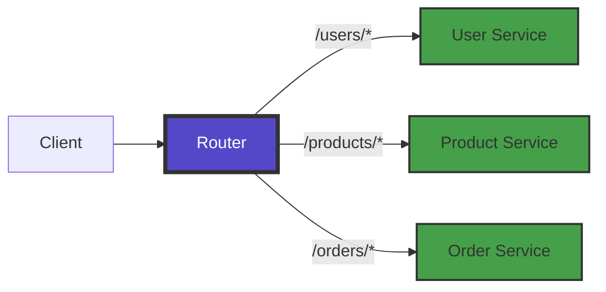
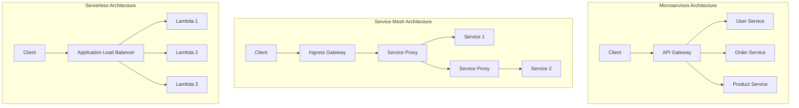

# Request Routing Pattern

**Intelligently directing requests to the right service instances**

> *"The art of distributed systems is not just handling requests, but knowing where to send them."*

---

## Level 1: Intuition

### Core Concept

Request routing is the pattern of directing incoming requests to appropriate service instances based on various criteria such as request content, headers, paths, or client characteristics. It's the traffic controller of distributed systems.

### Basic Implementation

```python
from typing import Dict, List, Optional, Callable
import re
from urllib.parse import urlparse
import hashlib

class SimpleRouter:
    def __init__(self):
        self.routes = []  # List of (matcher, handler) tuples
        
    def add_route(self, pattern: str, handler: Callable):
        """Add a route with pattern matching"""
        self.routes.append((re.compile(pattern), handler))
    
    def route(self, path: str) -> Optional[Callable]:
        """Find handler for given path"""
        for pattern, handler in self.routes:
            if pattern.match(path):
                return handler
        return None

# Usage example
router = SimpleRouter()
router.add_route(r'^/api/users/.*', user_service_handler)
router.add_route(r'^/api/products/.*', product_service_handler)
router.add_route(r'^/api/orders/.*', order_service_handler)

# Route a request
handler = router.route('/api/users/123')
if handler:
    response = handler(request)
```

### Visual Representation



---

## Level 2: Implementation

### Types of Request Routing

#### 1. Path-Based Routing

```python
class PathBasedRouter:
    def __init__(self):
        self.path_map = {}
        self.prefix_routes = []
        
    def add_exact_route(self, path: str, service: str):
        """Exact path matching"""
        self.path_map[path] = service
    
    def add_prefix_route(self, prefix: str, service: str):
        """Prefix-based matching"""
        self.prefix_routes.append((prefix, service))
# Sort by length (longest first) for proper matching
        self.prefix_routes.sort(key=lambda x: len(x[0]), reverse=True)
    
    def route(self, request_path: str) -> Optional[str]:
        """Route based on path"""
# Check exact match first
        if request_path in self.path_map:
            return self.path_map[request_path]
        
# Check prefix matches
        for prefix, service in self.prefix_routes:
            if request_path.startswith(prefix):
                return service
        
        return None

# Example usage
router = PathBasedRouter()
router.add_exact_route('/health', 'health-service')
router.add_prefix_route('/api/v1/users', 'user-service-v1')
router.add_prefix_route('/api/v2/users', 'user-service-v2')
router.add_prefix_route('/api', 'api-gateway')
```

#### 2. Header-Based Routing

```python
class HeaderBasedRouter:
    def __init__(self):
        self.header_rules = []
    
    def add_header_rule(self, header_name: str, 
                       header_value: Optional[str], 
                       service: str,
                       match_type: str = 'exact'):
        """Add routing rule based on headers"""
        self.header_rules.append({
            'header': header_name,
            'value': header_value,
            'service': service,
            'match_type': match_type
        })
    
    def route(self, headers: Dict[str, str]) -> Optional[str]:
        """Route based on headers"""
        for rule in self.header_rules:
            header_value = headers.get(rule['header'])
            
            if header_value is None:
                continue
                
            if rule['match_type'] == 'exact':
                if header_value == rule['value']:
                    return rule['service']
            elif rule['match_type'] == 'contains':
                if rule['value'] in header_value:
                    return rule['service']
            elif rule['match_type'] == 'regex':
                if re.match(rule['value'], header_value):
                    return rule['service']
        
        return None

# Example: Route based on API version header
router = HeaderBasedRouter()
router.add_header_rule('X-API-Version', '1.0', 'service-v1')
router.add_header_rule('X-API-Version', '2.0', 'service-v2')
router.add_header_rule('X-Client-Type', 'mobile', 'mobile-backend')
router.add_header_rule('X-Client-Type', 'web', 'web-backend')
```

#### 3. Content-Based Routing

```python
import json
from typing import Any

class ContentBasedRouter:
    def __init__(self):
        self.content_rules = []
    
    def add_json_field_rule(self, field_path: str, 
                           expected_value: Any, 
                           service: str):
        """Route based on JSON field values"""
        self.content_rules.append({
            'type': 'json_field',
            'path': field_path.split('.'),
            'value': expected_value,
            'service': service
        })
    
    def route(self, content_type: str, body: str) -> Optional[str]:
        """Route based on request body content"""
        if content_type == 'application/json':
            try:
                data = json.loads(body)
                return self._route_json(data)
            except json.JSONDecodeError:
                return None
        return None
    
    def _route_json(self, data: dict) -> Optional[str]:
        """Route based on JSON content"""
        for rule in self.content_rules:
            if rule['type'] == 'json_field':
                value = self._get_nested_value(data, rule['path'])
                if value == rule['value']:
                    return rule['service']
        return None
    
    def _get_nested_value(self, data: dict, path: List[str]) -> Any:
        """Get nested value from dictionary"""
        current = data
        for key in path:
            if isinstance(current, dict) and key in current:
                current = current[key]
            else:
                return None
        return current

# Example: Route based on request type in JSON
router = ContentBasedRouter()
router.add_json_field_rule('request_type', 'create_order', 'order-service')
router.add_json_field_rule('request_type', 'update_user', 'user-service')
router.add_json_field_rule('data.priority', 'high', 'priority-service')
```

### Advanced Routing Strategies

#### 1. Weighted Routing (Canary Deployments)

```python
import random
from collections import defaultdict

class WeightedRouter:
    def __init__(self):
        self.service_weights = defaultdict(list)
    
    def add_weighted_service(self, route: str, 
                           service: str, 
                           weight: int):
        """Add service with weight for canary deployments"""
        self.service_weights[route].extend([service] * weight)
    
    def route(self, route: str) -> Optional[str]:
        """Route based on weights (for canary deployments)"""
        if route in self.service_weights:
            services = self.service_weights[route]
            return random.choice(services)
        return None
    
    def get_distribution(self, route: str) -> Dict[str, float]:
        """Get actual distribution percentages"""
        if route not in self.service_weights:
            return {}
        
        services = self.service_weights[route]
        total = len(services)
        counts = defaultdict(int)
        
        for service in services:
            counts[service] += 1
        
        return {
            service: (count / total) * 100 
            for service, count in counts.items()
        }

# Example: 90% to stable, 10% to canary
router = WeightedRouter()
router.add_weighted_service('/api/users', 'user-service-stable', 90)
router.add_weighted_service('/api/users', 'user-service-canary', 10)

print(f"Distribution: {router.get_distribution('/api/users')}")
# Output: Distribution: {'user-service-stable': 90.0, 'user-service-canary': 10.0}
```

#### 2. Consistent Hash Routing

```python
import hashlib
from bisect import bisect_left
from typing import List, Tuple

class ConsistentHashRouter:
    def __init__(self, virtual_nodes: int = 150):
        self.virtual_nodes = virtual_nodes
        self.ring = {}  # hash -> service
        self.sorted_keys = []
        
    def _hash(self, key: str) -> int:
        """Generate hash for a key"""
        return int(hashlib.md5(key.encode()).hexdigest(), 16)
    
    def add_service(self, service: str):
        """Add service to the hash ring"""
        for i in range(self.virtual_nodes):
            virtual_key = f"{service}:{i}"
            hash_value = self._hash(virtual_key)
            self.ring[hash_value] = service
        
        self._update_sorted_keys()
    
    def remove_service(self, service: str):
        """Remove service from the hash ring"""
        to_remove = []
        for hash_value, svc in self.ring.items():
            if svc == service:
                to_remove.append(hash_value)
        
        for hash_value in to_remove:
            del self.ring[hash_value]
        
        self._update_sorted_keys()
    
    def _update_sorted_keys(self):
        """Update sorted list of hash values"""
        self.sorted_keys = sorted(self.ring.keys())
    
    def route(self, key: str) -> Optional[str]:
        """Route based on consistent hashing"""
        if not self.ring:
            return None
        
        hash_value = self._hash(key)
        
# Find the first node with hash >= key hash
        idx = bisect_left(self.sorted_keys, hash_value)
        
# Wrap around if necessary
        if idx == len(self.sorted_keys):
            idx = 0
        
        return self.ring[self.sorted_keys[idx]]

# Example usage
router = ConsistentHashRouter()
router.add_service('service-1')
router.add_service('service-2')
router.add_service('service-3')

# Requests for same user always go to same service
print(router.route('user-123'))  # Consistently routes to same service
print(router.route('user-456'))  # May route to different service
```

#### 3. Geo-Based Routing

```python
from dataclasses import dataclass
from typing import Tuple
import math

@dataclass
class ServiceLocation:
    service: str
    latitude: float
    longitude: float
    region: str

class GeoBasedRouter:
    def __init__(self):
        self.services = []
    
    def add_service(self, service: str, lat: float, 
                   lon: float, region: str):
        """Add service with geographic location"""
        self.services.append(ServiceLocation(service, lat, lon, region))
    
    def _calculate_distance(self, lat1: float, lon1: float, 
                          lat2: float, lon2: float) -> float:
        """Calculate distance between two points (simplified)"""
# Haversine formula for distance
        R = 6371  # Earth's radius in km
        
        lat1_rad = math.radians(lat1)
        lat2_rad = math.radians(lat2)
        delta_lat = math.radians(lat2 - lat1)
        delta_lon = math.radians(lon2 - lon1)
        
        a = (math.sin(delta_lat/2)**2 + 
             math.cos(lat1_rad) * math.cos(lat2_rad) * 
             math.sin(delta_lon/2)**2)
        c = 2 * math.atan2(math.sqrt(a), math.sqrt(1-a))
        
        return R * c
    
    def route_by_location(self, client_lat: float, 
                         client_lon: float) -> Optional[str]:
        """Route to nearest service"""
        if not self.services:
            return None
        
        nearest = min(
            self.services,
            key=lambda s: self._calculate_distance(
                client_lat, client_lon, s.latitude, s.longitude
            )
        )
        
        return nearest.service
    
    def route_by_region(self, client_region: str) -> Optional[str]:
        """Route to service in same region"""
        for service in self.services:
            if service.region == client_region:
                return service.service
        
# Fallback to any service
        return self.services[0].service if self.services else None

# Example usage
router = GeoBasedRouter()
router.add_service('us-east-1', 40.7128, -74.0060, 'us-east')  # NYC
router.add_service('us-west-1', 37.7749, -122.4194, 'us-west')  # SF
router.add_service('eu-west-1', 51.5074, -0.1278, 'eu-west')   # London

# Route based on client location
client_service = router.route_by_location(41.8781, -87.6298)  # Chicago
print(f"Routed to: {client_service}")  # Should route to us-east-1
```

### API Gateway Integration

```python
from dataclasses import dataclass
from typing import Dict, List, Optional, Any
import time
import logging
from enum import Enum

class RouteType(Enum):
    PATH = "path"
    HEADER = "header"
    CONTENT = "content"
    WEIGHTED = "weighted"
    GEO = "geo"

@dataclass
class Route:
    id: str
    route_type: RouteType
    pattern: str
    target_service: str
    weight: Optional[int] = None
    metadata: Optional[Dict[str, Any]] = None

class APIGateway:
    def __init__(self):
        self.routes: List[Route] = []
        self.middleware = []
        self.metrics = defaultdict(int)
        self.circuit_breakers = {}
        
    def add_route(self, route: Route):
        """Add a route to the gateway"""
        self.routes.append(route)
# Sort routes by specificity (more specific first)
        self.routes.sort(key=lambda r: len(r.pattern), reverse=True)
    
    def add_middleware(self, middleware_func):
        """Add middleware for request processing"""
        self.middleware.append(middleware_func)
    
    def process_request(self, request: dict) -> dict:
        """Process incoming request through gateway"""
        start_time = time.time()
        
# Apply middleware
        for mw in self.middleware:
            request = mw(request)
            if request.get('blocked'):
                return {'status': 403, 'body': 'Request blocked'}
        
# Find matching route
        service = self._find_route(request)
        if not service:
            self.metrics['route_not_found'] += 1
            return {'status': 404, 'body': 'Route not found'}
        
# Check circuit breaker
        if self._is_circuit_open(service):
            self.metrics['circuit_breaker_open'] += 1
            return {'status': 503, 'body': 'Service unavailable'}
        
# Forward request
        try:
            response = self._forward_request(service, request)
            self.metrics[f'{service}_success'] += 1
            return response
        except Exception as e:
            self.metrics[f'{service}_error'] += 1
            self._record_failure(service)
            logging.error(f"Error forwarding to {service}: {e}")
            return {'status': 500, 'body': 'Internal server error'}
        finally:
# Record latency
            latency = time.time() - start_time
            self.metrics[f'{service}_latency_sum'] += latency
            self.metrics[f'{service}_request_count'] += 1
    
    def _find_route(self, request: dict) -> Optional[str]:
        """Find matching route for request"""
        for route in self.routes:
            if route.route_type == RouteType.PATH:
                if request['path'].startswith(route.pattern):
                    return route.target_service
            elif route.route_type == RouteType.HEADER:
                header_name, header_value = route.pattern.split('=')
                if request.get('headers', {}).get(header_name) == header_value:
                    return route.target_service
        return None
    
    def _is_circuit_open(self, service: str) -> bool:
        """Check if circuit breaker is open for service"""
        cb = self.circuit_breakers.get(service)
        if not cb:
            return False
        return cb['state'] == 'open' and time.time() < cb['reset_time']
    
    def _record_failure(self, service: str):
        """Record failure for circuit breaker"""
        if service not in self.circuit_breakers:
            self.circuit_breakers[service] = {
                'failures': 0,
                'state': 'closed',
                'reset_time': 0
            }
        
        cb = self.circuit_breakers[service]
        cb['failures'] += 1
        
# Open circuit after 5 failures
        if cb['failures'] >= 5:
            cb['state'] = 'open'
            cb['reset_time'] = time.time() + 30  # 30 second timeout
            logging.warning(f"Circuit breaker opened for {service}")
    
    def _forward_request(self, service: str, request: dict) -> dict:
        """Forward request to target service (simplified)"""
# In real implementation, this would make HTTP request
# to the actual service
        return {
            'status': 200,
            'body': f"Response from {service}",
            'headers': {'X-Routed-To': service}
        }

# Example usage with middleware
def auth_middleware(request):
    """Authentication middleware"""
    if 'Authorization' not in request.get('headers', {}):
        request['blocked'] = True
    return request

def rate_limit_middleware(request):
    """Rate limiting middleware"""
# Simplified rate limiting logic
    client_ip = request.get('client_ip')
# Check rate limits...
    return request

# Setup gateway
gateway = APIGateway()
gateway.add_middleware(auth_middleware)
gateway.add_middleware(rate_limit_middleware)

# Add routes
gateway.add_route(Route('r1', RouteType.PATH, '/api/users', 'user-service'))
gateway.add_route(Route('r2', RouteType.PATH, '/api/orders', 'order-service'))
gateway.add_route(Route('r3', RouteType.HEADER, 'X-API-Version=2', 'api-v2'))

# Process request
request = {
    'path': '/api/users/123',
    'method': 'GET',
    'headers': {'Authorization': 'Bearer token'},
    'client_ip': '192.168.1.1'
}
response = gateway.process_request(request)
```

---

## 🎓 Level 3: Advanced Patterns

### Dynamic Routing with Service Mesh

```python
class ServiceMeshRouter:
    """Advanced routing with service mesh capabilities"""
    
    def __init__(self):
        self.services = {}
        self.traffic_policies = {}
        self.retry_policies = {}
        self.timeout_policies = {}
        
    def register_service(self, service_name: str, 
                        instances: List[Dict[str, Any]]):
        """Register service instances"""
        self.services[service_name] = instances
    
    def set_traffic_policy(self, service_name: str, policy: dict):
        """Set traffic management policy"""
        self.traffic_policies[service_name] = policy
    
    def route_with_policy(self, service_name: str, 
                         request: dict) -> Optional[dict]:
        """Route with advanced policies"""
        if service_name not in self.services:
            return None
        
        policy = self.traffic_policies.get(service_name, {})
        
# Apply traffic splitting
        if 'split' in policy:
            return self._apply_traffic_split(service_name, policy['split'])
        
# Apply fault injection (for testing)
        if 'fault' in policy:
            if random.random() < policy['fault']['percentage']:
                if policy['fault']['type'] == 'delay':
                    time.sleep(policy['fault']['duration'])
                elif policy['fault']['type'] == 'abort':
                    return {'error': 'Fault injection abort'}
        
# Apply outlier detection
        healthy_instances = self._get_healthy_instances(service_name)
        if not healthy_instances:
            return None
        
# Route to healthy instance
        return random.choice(healthy_instances)
    
    def _apply_traffic_split(self, service_name: str, 
                           splits: List[dict]) -> dict:
        """Apply percentage-based traffic splitting"""
        rand_val = random.random() * 100
        cumulative = 0
        
        for split in splits:
            cumulative += split['percentage']
            if rand_val <= cumulative:
# Route to specific version
                instances = [
                    i for i in self.services[service_name]
                    if i.get('version') == split['version']
                ]
                if instances:
                    return random.choice(instances)
        
        return None
    
    def _get_healthy_instances(self, service_name: str) -> List[dict]:
        """Get healthy instances with outlier detection"""
        instances = self.services.get(service_name, [])
        healthy = []
        
        for instance in instances:
# Check health based on recent metrics
            failure_rate = instance.get('failure_rate', 0)
            latency_p99 = instance.get('latency_p99', 0)
            
# Outlier detection thresholds
            if failure_rate < 0.5 and latency_p99 < 1000:  # ms
                healthy.append(instance)
        
        return healthy

# Example configuration
mesh_router = ServiceMeshRouter()

# Register service instances
mesh_router.register_service('product-service', [
    {'id': 'prod-1', 'version': 'v1', 'address': '10.0.1.1'},
    {'id': 'prod-2', 'version': 'v1', 'address': '10.0.1.2'},
    {'id': 'prod-3', 'version': 'v2', 'address': '10.0.1.3'}
])

# Set traffic policy for canary deployment
mesh_router.set_traffic_policy('product-service', {
    'split': [
        {'version': 'v1', 'percentage': 90},
        {'version': 'v2', 'percentage': 10}
    ]
})

# Set fault injection for testing
mesh_router.set_traffic_policy('product-service', {
    'fault': {
        'type': 'delay',
        'percentage': 0.1,  # 10% of requests
        'duration': 5       # 5 second delay
    }
})
```

### Smart Routing with Machine Learning

```python
import numpy as np
from sklearn.ensemble import RandomForestClassifier
from collections import deque

class MLRouter:
    """Machine learning based intelligent routing"""
    
    def __init__(self, history_size: int = 1000):
        self.history = deque(maxlen=history_size)
        self.model = RandomForestClassifier(n_estimators=10)
        self.is_trained = False
        
    def record_request(self, features: dict, 
                      service: str, 
                      success: bool, 
                      latency: float):
        """Record request outcome for learning"""
        self.history.append({
            'features': features,
            'service': service,
            'success': success,
            'latency': latency
        })
        
# Retrain periodically
        if len(self.history) >= 100 and len(self.history) % 50 == 0:
            self._train_model()
    
    def _train_model(self):
        """Train ML model on historical data"""
        if len(self.history) < 100:
            return
        
# Prepare training data
        X = []
        y = []
        
        for record in self.history:
            features = [
                record['features'].get('request_size', 0),
                record['features'].get('client_region', 0),
                record['features'].get('time_of_day', 0),
                record['features'].get('day_of_week', 0)
            ]
            X.append(features)
            
# Label: 1 if successful and fast, 0 otherwise
            label = 1 if record['success'] and record['latency'] < 100 else 0
            y.append(label)
        
        self.model.fit(X, y)
        self.is_trained = True
    
    def predict_best_service(self, features: dict, 
                           available_services: List[str]) -> str:
        """Predict best service for request"""
        if not self.is_trained or not available_services:
            return random.choice(available_services)
        
# Score each service
        scores = {}
        for service in available_services:
            X = [[
                features.get('request_size', 0),
                features.get('client_region', 0),
                features.get('time_of_day', 0),
                features.get('day_of_week', 0)
            ]]
            
# Predict success probability
            prob = self.model.predict_proba(X)[0][1]
            scores[service] = prob
        
# Return service with highest score
        return max(scores, key=scores.get)

# Example usage
ml_router = MLRouter()

# Simulate historical data
for _ in range(200):
    features = {
        'request_size': np.random.randint(1, 1000),
        'client_region': np.random.randint(0, 3),
        'time_of_day': np.random.randint(0, 24),
        'day_of_week': np.random.randint(0, 7)
    }
    service = random.choice(['service-a', 'service-b', 'service-c'])
    success = random.random() > 0.1
    latency = np.random.exponential(50) if success else 1000
    
    ml_router.record_request(features, service, success, latency)

# Make intelligent routing decision
request_features = {
    'request_size': 500,
    'client_region': 1,
    'time_of_day': 14,
    'day_of_week': 2
}
best_service = ml_router.predict_best_service(
    request_features, 
    ['service-a', 'service-b', 'service-c']
)
print(f"ML Router recommends: {best_service}")
```

---

## Real-World Applications

### 1. Kong API Gateway Configuration

```python
# Example Kong route configuration
kong_routes = {
    "services": [{
        "name": "user-service",
        "url": "http://user-service:8080"
    }],
    "routes": [{
        "name": "user-routes",
        "service": {"name": "user-service"},
        "paths": ["/api/users"],
        "methods": ["GET", "POST", "PUT", "DELETE"],
        "strip_path": True
    }],
    "plugins": [{
        "name": "rate-limiting",
        "service": {"name": "user-service"},
        "config": {
            "minute": 100,
            "policy": "local"
        }
    }]
}
```

### 2. AWS Application Load Balancer Rules

```python
# ALB routing rules configuration
alb_rules = [
    {
        "priority": 1,
        "conditions": [{
            "field": "path-pattern",
            "values": ["/api/users/*"]
        }],
        "actions": [{
            "type": "forward",
            "target_group_arn": "arn:aws:elasticloadbalancing:region:account:targetgroup/user-service"
        }]
    },
    {
        "priority": 2,
        "conditions": [{
            "field": "http-header",
            "httpHeaderConfig": {
                "httpHeaderName": "X-API-Version",
                "values": ["v2"]
            }
        }],
        "actions": [{
            "type": "forward",
            "target_group_arn": "arn:aws:elasticloadbalancing:region:account:targetgroup/api-v2"
        }]
    }
]
```

### 3. Nginx Configuration

```nginx
# Nginx routing configuration
upstream user_service {
    server user-service-1:8080 weight=9;
    server user-service-2:8080 weight=1;  # Canary: 10% traffic
}

upstream order_service {
    server order-service:8080;
}

server {
    listen 80;
    
# Path-based routing
    location /api/users {
        proxy_pass http://user_service;
        proxy_set_header Host $host;
        proxy_set_header X-Real-IP $remote_addr;
    }
    
    location /api/orders {
        proxy_pass http://order_service;
    }
    
# Header-based routing
    location /api {
        if ($http_x_api_version = "2") {
            proxy_pass http://api-v2;
        }
        proxy_pass http://api-v1;
    }
}
```

---

## Performance Considerations

### 1. Route Matching Performance

```python
class OptimizedRouter:
    """High-performance routing implementation"""
    
    def __init__(self):
# Use trie for efficient prefix matching
        self.route_trie = {}
# Cache for frequently accessed routes
        self.cache = {}
        self.cache_hits = 0
        self.cache_misses = 0
        
    def add_route(self, path: str, handler: Callable):
        """Add route to trie structure"""
        node = self.route_trie
        for part in path.split('/'):
            if part:
                if part not in node:
                    node[part] = {}
                node = node[part]
        node['_handler'] = handler
    
    def route(self, path: str) -> Optional[Callable]:
        """Route with caching"""
# Check cache first
        if path in self.cache:
            self.cache_hits += 1
            return self.cache[path]
        
        self.cache_misses += 1
        
# Traverse trie
        handler = self._trie_lookup(path)
        
# Cache result
        if handler:
            self.cache[path] = handler
# Limit cache size
            if len(self.cache) > 10000:
# Remove oldest entries (simple LRU)
                for key in list(self.cache.keys())[:1000]:
                    del self.cache[key]
        
        return handler
    
    def _trie_lookup(self, path: str) -> Optional[Callable]:
        """Lookup in trie structure"""
        node = self.route_trie
        parts = [p for p in path.split('/') if p]
        
        for part in parts:
            if part in node:
                node = node[part]
            elif '*' in node:  # Wildcard matching
                node = node['*']
            else:
                return None
        
        return node.get('_handler')
    
    def get_stats(self) -> dict:
        """Get routing performance stats"""
        total = self.cache_hits + self.cache_misses
        hit_rate = self.cache_hits / total if total > 0 else 0
        
        return {
            'cache_hits': self.cache_hits,
            'cache_misses': self.cache_misses,
            'hit_rate': hit_rate,
            'cache_size': len(self.cache)
        }
```

### 2. Connection Pooling

```python
class ConnectionPoolRouter:
    """Router with connection pooling"""
    
    def __init__(self, pool_size: int = 10):
        self.pools = {}  # service -> connection pool
        self.pool_size = pool_size
        
    def get_connection(self, service: str):
        """Get connection from pool"""
        if service not in self.pools:
            self.pools[service] = self._create_pool(service)
        
        pool = self.pools[service]
        
# Find available connection
        for conn in pool:
            if not conn['in_use']:
                conn['in_use'] = True
                conn['last_used'] = time.time()
                return conn['connection']
        
# All connections busy, wait or create new one
        if len(pool) < self.pool_size:
            conn = self._create_connection(service)
            pool.append({
                'connection': conn,
                'in_use': True,
                'last_used': time.time()
            })
            return conn
        
# Wait for available connection
        return self._wait_for_connection(service)
    
    def release_connection(self, service: str, connection):
        """Return connection to pool"""
        if service in self.pools:
            for conn in self.pools[service]:
                if conn['connection'] == connection:
                    conn['in_use'] = False
                    break
    
    def _create_pool(self, service: str) -> List[dict]:
        """Create initial connection pool"""
        pool = []
        for _ in range(min(3, self.pool_size)):  # Start with 3 connections
            conn = self._create_connection(service)
            pool.append({
                'connection': conn,
                'in_use': False,
                'last_used': time.time()
            })
        return pool
    
    def _create_connection(self, service: str):
        """Create new connection to service"""
# Simplified - in reality would create HTTP/gRPC connection
        return {'service': service, 'id': str(uuid.uuid4())}
```

---

## 🏛 Architecture Patterns

### Request Routing in Different Architectures



### Integration with Service Discovery

```python
class DiscoveryAwareRouter:
    """Router integrated with service discovery"""
    
    def __init__(self, discovery_client):
        self.discovery = discovery_client
        self.service_cache = {}
        self.cache_ttl = 60  # seconds
        
    def route(self, service_name: str, request: dict) -> Optional[str]:
        """Route to discovered service instance"""
        instances = self._get_service_instances(service_name)
        
        if not instances:
            return None
        
# Apply routing strategy
        if request.get('sticky_session'):
# Route based on session ID
            session_id = request.get('session_id', '')
            index = hash(session_id) % len(instances)
            return instances[index]
        else:
# Round-robin or random
            return random.choice(instances)
    
    def _get_service_instances(self, service_name: str) -> List[str]:
        """Get service instances with caching"""
        cache_key = service_name
        cached = self.service_cache.get(cache_key)
        
        if cached and time.time() - cached['timestamp'] < self.cache_ttl:
            return cached['instances']
        
# Fetch from discovery service
        instances = self.discovery.get_instances(service_name)
        
# Update cache
        self.service_cache[cache_key] = {
            'instances': instances,
            'timestamp': time.time()
        }
        
        return instances
```

---

## 🤝 Related Patterns

1. **[Load Balancing](load-balancing.md)**: Request routing often works with load balancing
2. **[Service Discovery](service-discovery.md)**: Finding services to route to
3. **[Circuit Breaker](circuit-breaker.md)**: Handling failures in routing
4. **[API Gateway](api-gateway.md)**: Common implementation of request routing
5. **Service Mesh (Coming Soon)**: Advanced routing capabilities

---

## 📚 References

1. "Building Microservices" by Sam Newman
2. "Site Reliability Engineering" by Google
3. [Envoy Proxy Documentation](https://www.envoyproxy.io/docs/envoy/latest/)
4. [AWS Application Load Balancer](https://docs.aws.amazon.com/elasticloadbalancing/latest/application/)
5. [NGINX Plus Router](https://www.nginx.com/products/nginx/)

---

*Remember: Good request routing is invisible when it works, but catastrophic when it doesn't. Design for clarity, monitor extensively, and always have a fallback plan.*