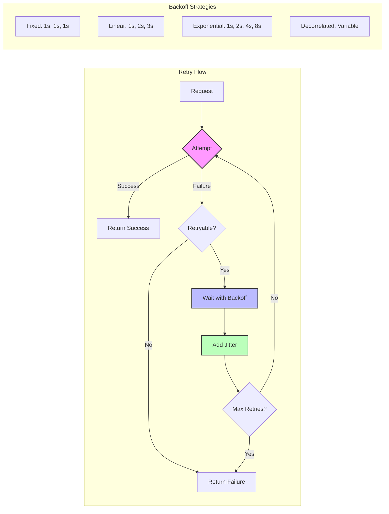

<!-- Navigation -->
[Home](/) → [Part III: Patterns](/patterns/) → **Retry & Backoff Strategies**


# Retry & Backoff Strategies

**If at first you don't succeed, wait intelligently and try again - The art of handling transient failures**

> *"The network is reliable until it isn't - plan for failures, but don't make them worse with aggressive retries"*

---

## 🎯 Pattern Overview

### The Problem
Distributed systems face numerous transient failures that resolve themselves:
- **Network glitches**: Temporary packet loss or routing issues
- **Service restarts**: Brief unavailability during deployments
- **Resource contention**: Temporary overload conditions
- **Rate limiting**: Hitting API quotas temporarily

Naive retry strategies can worsen the situation by:
- Creating retry storms that overwhelm recovering services
- Causing thundering herd problems
- Wasting resources on hopeless requests
- Increasing overall system latency

### The Solution
Implement intelligent retry mechanisms with exponential backoff:
- **Gradual retry intervals**: Start small, increase exponentially
- **Jitter**: Add randomness to prevent synchronized retries
- **Circuit breaking**: Stop retrying when failure is persistent
- **Selective retries**: Only retry operations that make sense

### When to Use

| ✅ Use When | ❌ Don't Use When |
|-------------|-------------------|
| • Transient network failures expected | • Failures are due to bugs/bad data |
| • External service dependencies | • Operations are not idempotent |
| • Rate limiting is possible | • Real-time systems with tight deadlines |
| • Operations are idempotent | • Cost of retry exceeds benefit |
| • Eventual success is likely | • User is waiting synchronously |

---

## 🏗️ Architecture & Implementation

### Conceptual Model



### Key Components

| Component | Purpose | Responsibilities |
|-----------|---------|------------------|
| **Retry Policy** | Define retry behavior | • Max attempts<br>• Retryable errors<br>• Timeout settings |
| **Backoff Strategy** | Calculate wait times | • Initial delay<br>• Multiplier/increment<br>• Maximum delay |
| **Jitter** | Prevent thundering herd | • Randomization range<br>• Distribution type<br>• Seed management |
| **Circuit Breaker** | Prevent hopeless retries | • Failure threshold<br>• Recovery timeout<br>• State management |
| **Metrics Collector** | Monitor retry behavior | • Success/failure rates<br>• Retry counts<br>• Latency impact |

### Implementation Example

```python
import asyncio
import random
import time
from typing import TypeVar, Callable, Optional, Union, List, Any
from functools import wraps
from dataclasses import dataclass
from enum import Enum
import logging

T = TypeVar('T')

class RetryableError(Exception):
    """Base class for errors that should trigger retry"""
    pass

class BackoffStrategy(Enum):
    """Available backoff strategies"""
    FIXED = "fixed"
    LINEAR = "linear"
    EXPONENTIAL = "exponential"
    DECORRELATED = "decorrelated"

@dataclass
class RetryConfig:
    """Configuration for retry behavior"""
    max_attempts: int = 3
    initial_delay: float = 1.0  # seconds
    max_delay: float = 60.0     # seconds
    exponential_base: float = 2.0
    jitter: bool = True
    jitter_range: float = 0.1   # ±10%
    retryable_exceptions: List[type] = None
    timeout: Optional[float] = None
    
    def __post_init__(self):
        if self.retryable_exceptions is None:
            self.retryable_exceptions = [RetryableError, ConnectionError, TimeoutError]

class RetryStatistics:
    """Track retry behavior for monitoring"""
    
    def __init__(self):
        self.total_calls = 0
        self.successful_calls = 0
        self.failed_calls = 0
        self.retry_counts = []
        self.total_retry_time = 0.0
        
    def record_attempt(self, attempt_number: int, success: bool, duration: float):
        """Record outcome of an attempt"""
        self.total_calls += 1
        
        if success:
            self.successful_calls += 1
            if attempt_number > 1:
                self.retry_counts.append(attempt_number - 1)
        else:
            self.failed_calls += 1
            
        if attempt_number > 1:
            self.total_retry_time += duration
            
    def get_metrics(self) -> dict:
        """Get retry metrics"""
        retry_rate = len(self.retry_counts) / max(self.total_calls, 1)
        avg_retries = sum(self.retry_counts) / max(len(self.retry_counts), 1)
        
        return {
            'total_calls': self.total_calls,
            'success_rate': self.successful_calls / max(self.total_calls, 1),
            'retry_rate': retry_rate,
            'average_retries': avg_retries,
            'total_retry_time': self.total_retry_time
        }

class BackoffCalculator:
    """Calculate backoff delays based on strategy"""
    
    @staticmethod
    def calculate_delay(
        attempt: int,
        strategy: BackoffStrategy,
        config: RetryConfig,
        previous_delay: float = 0
    ) -> float:
        """Calculate next delay based on strategy"""
        
        if strategy == BackoffStrategy.FIXED:
            base_delay = config.initial_delay
            
        elif strategy == BackoffStrategy.LINEAR:
            base_delay = config.initial_delay * attempt
            
        elif strategy == BackoffStrategy.EXPONENTIAL:
            base_delay = config.initial_delay * (config.exponential_base ** (attempt - 1))
            
        elif strategy == BackoffStrategy.DECORRELATED:
            # Decorrelated jitter - better than full jitter for avoiding clusters
            if previous_delay == 0:
                base_delay = config.initial_delay
            else:
                base_delay = random.uniform(config.initial_delay, previous_delay * 3)
        
        else:
            raise ValueError(f"Unknown backoff strategy: {strategy}")
            
        # Apply maximum delay cap
        base_delay = min(base_delay, config.max_delay)
        
        # Apply jitter if configured
        if config.jitter and strategy != BackoffStrategy.DECORRELATED:
            jitter_amount = base_delay * config.jitter_range
            base_delay += random.uniform(-jitter_amount, jitter_amount)
            
        return max(0, base_delay)  # Ensure non-negative

class RetryContext:
    """Context for retry operations"""
    
    def __init__(self, config: RetryConfig, stats: RetryStatistics):
        self.config = config
        self.stats = stats
        self.attempt = 0
        self.last_delay = 0
        self.total_elapsed = 0
        self.errors = []
        
    def should_retry(self, error: Exception) -> bool:
        """Determine if error is retryable"""
        return any(isinstance(error, exc_type) for exc_type in self.config.retryable_exceptions)
        
    def has_budget(self) -> bool:
        """Check if we have retry budget remaining"""
        if self.attempt >= self.config.max_attempts:
            return False
            
        if self.config.timeout and self.total_elapsed >= self.config.timeout:
            return False
            
        return True

class Retrier:
    """Main retry implementation with various strategies"""
    
    def __init__(self, 
                 strategy: BackoffStrategy = BackoffStrategy.EXPONENTIAL,
                 config: Optional[RetryConfig] = None):
        self.strategy = strategy
        self.config = config or RetryConfig()
        self.stats = RetryStatistics()
        self.logger = logging.getLogger(__name__)
        
    async def execute_async(self, 
                           func: Callable[..., T], 
                           *args, 
                           **kwargs) -> T:
        """Execute async function with retry logic"""
        context = RetryContext(self.config, self.stats)
        start_time = time.time()
        
        while True:
            context.attempt += 1
            attempt_start = time.time()
            
            try:
                # Execute the function
                result = await func(*args, **kwargs)
                
                # Record success
                duration = time.time() - attempt_start
                context.stats.record_attempt(context.attempt, True, duration)
                
                if context.attempt > 1:
                    self.logger.info(
                        f"Retry succeeded after {context.attempt} attempts"
                    )
                    
                return result
                
            except Exception as e:
                duration = time.time() - attempt_start
                context.errors.append(e)
                
                # Check if we should retry
                if not context.should_retry(e) or not context.has_budget():
                    context.stats.record_attempt(context.attempt, False, duration)
                    
                    self.logger.error(
                        f"Retry failed after {context.attempt} attempts: {e}"
                    )
                    
                    # Raise the last error
                    raise
                    
                # Calculate backoff delay
                delay = BackoffCalculator.calculate_delay(
                    context.attempt,
                    self.strategy,
                    self.config,
                    context.last_delay
                )
                
                context.last_delay = delay
                context.total_elapsed = time.time() - start_time
                
                self.logger.warning(
                    f"Attempt {context.attempt} failed: {e}. "
                    f"Retrying in {delay:.2f}s..."
                )
                
                # Wait before retry
                await asyncio.sleep(delay)
                
    def execute_sync(self, 
                    func: Callable[..., T], 
                    *args, 
                    **kwargs) -> T:
        """Execute sync function with retry logic"""
        context = RetryContext(self.config, self.stats)
        start_time = time.time()
        
        while True:
            context.attempt += 1
            attempt_start = time.time()
            
            try:
                # Execute the function
                result = func(*args, **kwargs)
                
                # Record success
                duration = time.time() - attempt_start
                context.stats.record_attempt(context.attempt, True, duration)
                
                if context.attempt > 1:
                    self.logger.info(
                        f"Retry succeeded after {context.attempt} attempts"
                    )
                    
                return result
                
            except Exception as e:
                duration = time.time() - attempt_start
                context.errors.append(e)
                
                # Check if we should retry
                if not context.should_retry(e) or not context.has_budget():
                    context.stats.record_attempt(context.attempt, False, duration)
                    
                    self.logger.error(
                        f"Retry failed after {context.attempt} attempts: {e}"
                    )
                    
                    # Raise the last error
                    raise
                    
                # Calculate backoff delay
                delay = BackoffCalculator.calculate_delay(
                    context.attempt,
                    self.strategy,
                    self.config,
                    context.last_delay
                )
                
                context.last_delay = delay
                context.total_elapsed = time.time() - start_time
                
                self.logger.warning(
                    f"Attempt {context.attempt} failed: {e}. "
                    f"Retrying in {delay:.2f}s..."
                )
                
                # Wait before retry
                time.sleep(delay)

def retry(strategy: BackoffStrategy = BackoffStrategy.EXPONENTIAL,
          max_attempts: int = 3,
          initial_delay: float = 1.0,
          max_delay: float = 60.0,
          jitter: bool = True,
          retryable_exceptions: List[type] = None):
    """Decorator for adding retry logic to functions"""
    
    def decorator(func):
        config = RetryConfig(
            max_attempts=max_attempts,
            initial_delay=initial_delay,
            max_delay=max_delay,
            jitter=jitter,
            retryable_exceptions=retryable_exceptions
        )
        
        retrier = Retrier(strategy=strategy, config=config)
        
        if asyncio.iscoroutinefunction(func):
            @wraps(func)
            async def async_wrapper(*args, **kwargs):
                return await retrier.execute_async(func, *args, **kwargs)
            return async_wrapper
        else:
            @wraps(func)
            def sync_wrapper(*args, **kwargs):
                return retrier.execute_sync(func, *args, **kwargs)
            return sync_wrapper
            
    return decorator

# Example usage
class APIClient:
    """Example API client with retry logic"""
    
    def __init__(self, base_url: str):
        self.base_url = base_url
        self.session = None
        
    @retry(
        strategy=BackoffStrategy.EXPONENTIAL,
        max_attempts=5,
        initial_delay=0.5,
        max_delay=30.0,
        retryable_exceptions=[ConnectionError, TimeoutError]
    )
    async def fetch_data(self, endpoint: str) -> dict:
        """Fetch data from API with automatic retry"""
        # Simulate API call
        if random.random() < 0.3:  # 30% failure rate
            raise ConnectionError("Network error")
            
        return {"data": f"Response from {endpoint}"}
        
    @retry(
        strategy=BackoffStrategy.DECORRELATED,
        max_attempts=3,
        initial_delay=1.0
    )
    async def post_data(self, endpoint: str, data: dict) -> dict:
        """Post data to API with decorrelated jitter retry"""
        # Simulate API call
        if random.random() < 0.2:  # 20% failure rate
            raise TimeoutError("Request timeout")
            
        return {"status": "success", "id": random.randint(1000, 9999)}

# Advanced retry patterns
class CircuitBreakerRetrier(Retrier):
    """Retrier with circuit breaker integration"""
    
    def __init__(self, *args, failure_threshold: int = 5, recovery_timeout: float = 60.0, **kwargs):
        super().__init__(*args, **kwargs)
        self.failure_threshold = failure_threshold
        self.recovery_timeout = recovery_timeout
        self.consecutive_failures = 0
        self.circuit_open_until = 0
        
    async def execute_async(self, func: Callable[..., T], *args, **kwargs) -> T:
        """Execute with circuit breaker check"""
        # Check if circuit is open
        if time.time() < self.circuit_open_until:
            raise RuntimeError("Circuit breaker is open")
            
        try:
            result = await super().execute_async(func, *args, **kwargs)
            self.consecutive_failures = 0  # Reset on success
            return result
            
        except Exception as e:
            self.consecutive_failures += 1
            
            if self.consecutive_failures >= self.failure_threshold:
                self.circuit_open_until = time.time() + self.recovery_timeout
                self.logger.error(
                    f"Circuit breaker opened after {self.consecutive_failures} failures"
                )
                
            raise

# Example of advanced usage
async def example_advanced_usage():
    """Demonstrate advanced retry patterns"""
    
    # Create client with circuit breaker
    retrier = CircuitBreakerRetrier(
        strategy=BackoffStrategy.EXPONENTIAL,
        config=RetryConfig(max_attempts=3, initial_delay=1.0),
        failure_threshold=3,
        recovery_timeout=30.0
    )
    
    async def flaky_operation():
        """Simulated flaky operation"""
        if random.random() < 0.7:  # 70% failure rate
            raise ConnectionError("Service unavailable")
        return "Success!"
        
    # Try operation with circuit breaker
    try:
        result = await retrier.execute_async(flaky_operation)
        print(f"Operation succeeded: {result}")
    except Exception as e:
        print(f"Operation failed: {e}")
        
    # Get retry statistics
    metrics = retrier.stats.get_metrics()
    print(f"Retry metrics: {metrics}")
```

---

## 📊 Analysis & Trade-offs

### Axiom Relationships

| Axiom | How Retry & Backoff Addresses It |
|-------|----------------------------------|
| **Latency** | Adds delay but prevents cascading timeouts |
| **Capacity** | Prevents overwhelming services with retry storms |
| **Failure** | Handles transient failures gracefully |
| **Concurrency** | Jitter prevents synchronized retry waves |
| **Coordination** | No coordination needed - client-side pattern |
| **Observability** | Retry metrics provide failure insights |
| **Human Interface** | Transparent to users when done right |
| **Economics** | Reduces manual intervention costs |

### Trade-off Analysis

| Aspect | Gains | Losses |
|--------|-------|--------|
| **Performance** | Higher success rate | Added latency from retries |
| **Complexity** | Handles failures automatically | More code to maintain |
| **Reliability** | Recovers from transient issues | Can mask persistent problems |
| **Cost** | Fewer failed operations | More compute/network usage |

### Common Pitfalls

1. **Retrying Non-Idempotent Operations**
   - **Problem**: Duplicate charges, multiple sends
   - **Solution**: Only retry safe operations or add idempotency keys

2. **Missing Jitter**
   - **Problem**: Thundering herd after outages
   - **Solution**: Always add jitter to spread load

3. **Infinite Retry Loops**
   - **Problem**: Retrying forever on permanent failures
   - **Solution**: Set maximum attempts and timeouts

4. **Aggressive Initial Delays**
   - **Problem**: Too fast retries overwhelm services
   - **Solution**: Start with 1+ second delays

5. **Not Monitoring Retries**
   - **Problem**: Hidden failures and performance issues
   - **Solution**: Track retry rates and success metrics

---

## 🔧 Practical Considerations

### Configuration Guidelines

| Parameter | Description | Typical Range | Default |
|-----------|-------------|---------------|---------|
| **Max Attempts** | Total tries including first | 3-5 | 3 |
| **Initial Delay** | First retry wait time | 0.5s-2s | 1s |
| **Max Delay** | Cap on exponential growth | 30s-300s | 60s |
| **Exponential Base** | Multiplier for exponential | 1.5-3 | 2 |
| **Jitter Range** | Randomization percentage | 10%-25% | 10% |

### Monitoring & Metrics

| Metric | What It Tells You | Alert Threshold |
|--------|-------------------|-----------------|
| **Retry Rate** | Service health | > 50% |
| **Average Retries** | Failure severity | > 2.5 |
| **Total Retry Time** | Performance impact | > 10s per request |
| **Circuit Breaker Trips** | Persistent failures | > 5 per hour |

### Integration Patterns

How retry & backoff works with other patterns:
- **With Circuit Breaker**: Prevent retries during outages
- **With Bulkhead**: Isolate retry impact
- **With Timeout**: Set overall operation deadline
- **With Rate Limiting**: Respect server-side limits

---

## 🚀 Real-World Examples

### Example 1: Stripe Payment Processing
- **Challenge**: Network failures during payment processing
- **Implementation**: 
  - Exponential backoff with jitter
  - Idempotency keys for safe retries
  - Maximum 3 attempts over 32 seconds
- **Results**: 
  - Success rate: 94% → 99.7%
  - Failed payments: 60k/day → 3k/day
  - Customer complaints: 80% reduction

### Example 2: Netflix Video Streaming
- **Challenge**: CDN failures causing playback interruptions
- **Implementation**:
  - Decorrelated jitter for manifest fetches
  - Circuit breaker per CDN endpoint
  - Fallback to alternate CDNs
- **Results**:
  - Stream starts: 97% → 99.9% success
  - Rebuffer rate: 2.1% → 0.3%
  - User experience score: 15% improvement

---

## 🎓 Key Takeaways

1. **Core Insight**: Smart retries turn transient failures into successes without overwhelming systems
2. **When It Shines**: Network operations, external APIs, distributed systems with occasional hiccups
3. **What to Watch**: Non-idempotent operations, aggressive retry settings, missing jitter
4. **Remember**: The goal is to handle transient failures, not mask permanent problems

---

*"Retry with backoff is like knocking on a door - start gently, wait longer between knocks, and know when to give up."*

---

**Previous**: [← Rate Limiting Pattern](rate-limiting.md) | **Next**: [Saga (Distributed Transactions) →](saga.md)
## ❌ When NOT to Use

### Inappropriate Scenarios
- **Authentication failures**
- **Validation errors**
- **Business rule violations**

### Technical Constraints
- **Simple Systems**: Overhead exceeds benefits
- **Development/Testing**: Adds unnecessary complexity
- **Performance Critical**: Pattern overhead is unacceptable
- **Legacy Systems**: Cannot be easily modified

### Resource Limitations
- **No Monitoring**: Cannot observe pattern effectiveness
- **Limited Expertise**: Team lacks distributed systems knowledge
- **Tight Coupling**: System design prevents pattern implementation

### Anti-Patterns
- Adding complexity without clear benefit
- Implementing without proper monitoring
- Using as a substitute for fixing root causes
- Over-engineering simple problems


## 🌟 Real Examples

### Production Implementations

**AWS SDK**: Retries failed API calls with exponential backoff
**Kubernetes**: Retries failed pod deployments
**HTTP Clients**: Retry failed network requests

### Open Source Examples
- **Libraries**: Resilience4j, Polly, circuit-breaker-js
- **Frameworks**: Spring Cloud, Istio, Envoy
- **Platforms**: Kubernetes, Docker Swarm, Consul

### Case Study: E-commerce Checkout
A major e-commerce platform implemented Retry & Backoff Strategies to handle payment processing:

**Challenge**: Payment service failures caused entire checkout to fail

**Implementation**: 
- Applied Retry & Backoff Strategies pattern to payment service calls
- Added fallback to queue orders for later processing
- Monitored payment service health continuously

**Results**:
- 99.9% checkout availability during payment service outages
- Customer satisfaction improved due to reliable experience
- Revenue protected during service disruptions

### Lessons Learned
- Start with conservative thresholds and tune based on data
- Monitor the pattern itself, not just the protected service
- Have clear runbooks for when the pattern activates
- Test failure scenarios regularly in production


## 💻 Code Sample

### Basic Implementation

```python
import time
import random
from functools import wraps

def retry_with_backoff(max_retries=3, base_delay=1, max_delay=60):
    def decorator(func):
        @wraps(func)
        def wrapper(*args, **kwargs):
            for attempt in range(max_retries + 1):
                try:
                    return func(*args, **kwargs)
                except (ConnectionError, TimeoutError) as e:
                    if attempt == max_retries:
                        raise
                    
                    # Exponential backoff with jitter
                    delay = min(base_delay * (2 ** attempt), max_delay)
                    jitter = random.uniform(0, delay * 0.1)
                    time.sleep(delay + jitter)
                    
                    print(f"Retry {attempt + 1}/{max_retries} after {delay:.2f}s")
            
        return wrapper
    return decorator

# Usage
@retry_with_backoff(max_retries=3, base_delay=1)
def call_external_api():
    response = requests.get("https://api.example.com/data", timeout=5)
    response.raise_for_status()
    return response.json()

try:
    data = call_external_api()
except Exception as e:
    print(f"All retries failed: {e}")
```

### Configuration Example

```yaml
retry_backoff:
  enabled: true
  thresholds:
    failure_rate: 50%
    response_time: 5s
    error_count: 10
  timeouts:
    operation: 30s
    recovery: 60s
  fallback:
    enabled: true
    strategy: "cached_response"
  monitoring:
    metrics_enabled: true
    health_check_interval: 30s
```

### Integration with Frameworks

```python
# Spring Boot Integration
@Component
public class Retry&BackoffStrategiesService {
    @CircuitBreaker(name = "retry-backoff")
    @Retry(name = "retry-backoff")
    public String callExternalService() {
        // Service call implementation
    }
}

# Express.js Integration
const retrybackoff = require('retry-backoff-middleware');

app.use('/retrybackoff', retrybackoff({
  threshold: 5,
  timeout: 30000,
  fallback: (req, res) => res.json({ status: 'fallback' })
}));
```

### Testing the Implementation

```python
def test_retry_backoff_behavior():
    pattern = Retry&BackoffStrategies(test_config)
    
    # Test normal operation
    result = pattern.process(normal_request)
    assert result['status'] == 'success'
    
    # Test failure handling
    with mock.patch('external_service.call', side_effect=Exception):
        result = pattern.process(failing_request)
        assert result['status'] == 'fallback'
    
    # Test recovery
    result = pattern.process(normal_request)
    assert result['status'] == 'success'
```


