# Retry & Backoff Strategies

!!! success "🏆 Gold Standard Pattern"
    **Transient Failure Handler** • AWS, Google Cloud, Azure standard
    
    Retry with backoff is essential for handling transient failures in distributed systems. Built into every major cloud SDK, it's the first line of defense against temporary network issues and service hiccups.
    
    **Key Success Metrics:**
    - AWS: Every SDK includes intelligent retry
    - Google: Billions of requests auto-recovered
    - Azure: Global infrastructure resilience

**Intelligent failure recovery with exponential backoff, jitter, and adaptive policies**

## Level 1: Intuition

### Core Concept

Like a professional waiter who knows when to check on orders (not constantly pestering the chef), smart retry strategies space out attempts to avoid overwhelming failing systems.

<div class="axiom-box">
<h4>⚛️ Law 1: Correlated Failure</h4>

Retry storms are a perfect example of correlated failure. When one service fails, thousands of clients simultaneously retry, creating a thundering herd that prevents recovery. This is why naive retries actually amplify failures instead of fixing them.

**Key Insight**: Exponential backoff with jitter breaks the correlation by spacing retry attempts across time, allowing the failing service to recover naturally.
</div>

**Problem**: Naive retries create "retry storms" that make failures worse.

**Solution**: 
- **Exponential Backoff**: Wait 1s, 2s, 4s, 8s...
- **Jitter**: Add randomness to prevent synchronized retries
- **Limits**: Know when to give up
- **Circuit Breaking**: Stop retrying when clearly futile

### Simple Example


---

## Level 2: Foundation

### Retry Strategies

=== "Fixed Interval"

    ```python
    # Fixed interval retry - simple but can overwhelm
    def fixed_retry(attempt: int, base_delay: float = 1.0) -> float:
        return base_delay  # Always wait the same amount
    
    # Example: 1s, 1s, 1s, 1s
    for attempt in range(1, 5):
        delay = fixed_retry(attempt)
        print(f"Attempt {attempt}: wait {delay}s")
    ```
    
    **When to Use**:
    - Predictable, short-duration outages
    - Low concurrency scenarios
    - Simple retry requirements
    
    **Avoid When**:
    - High traffic services (causes retry storms)
    - Unknown failure duration
    - Multiple clients retrying simultaneously

=== "Linear Backoff"

    ```python
    # Linear backoff - gradual increase
    def linear_retry(attempt: int, base_delay: float = 1.0) -> float:
        return base_delay * attempt
    
    # Example: 1s, 2s, 3s, 4s
    for attempt in range(1, 5):
        delay = linear_retry(attempt)
        print(f"Attempt {attempt}: wait {delay}s")
    ```
    
    **When to Use**:
    - Gradual service recovery expected
    - Medium concurrency environments
    - Resource-constrained targets
    
    **Avoid When**:
    - Very high concurrency
    - Exponential failure growth
    - Need for rapid recovery

=== "Exponential Backoff"

    ```python
    # Exponential backoff - industry standard
    def exponential_retry(attempt: int, base_delay: float = 1.0, 
                         base: float = 2.0, max_delay: float = 60.0) -> float:
        delay = min(base_delay * (base ** (attempt - 1)), max_delay)
        return delay
    
    # Example: 1s, 2s, 4s, 8s, 16s... (capped at 60s)
    for attempt in range(1, 8):
        delay = exponential_retry(attempt)
        print(f"Attempt {attempt}: wait {delay}s")
    ```
    
    **When to Use**:
    - Unknown recovery time
    - External API calls
    - Default choice for most scenarios
    
    **Avoid When**:
    - Need predictable retry intervals
    - Very short outages expected
    - Real-time systems with strict deadlines

=== "Decorrelated Jitter"

    ```python
    # AWS-recommended decorrelated jitter
    import random
    
    def decorrelated_retry(attempt: int, previous_delay: float = 0, 
                          base_delay: float = 1.0, max_delay: float = 60.0) -> float:
        if attempt == 1:
            return base_delay
        
        # Random between base and 3x previous delay
        temp = random.uniform(base_delay, previous_delay * 3)
        return min(temp, max_delay)
    
    # Example: 1s, 0.5-3s, 0.5-9s, 0.5-27s (varies)
    delay = 0
    for attempt in range(1, 5):
        delay = decorrelated_retry(attempt, delay)
        print(f"Attempt {attempt}: wait {delay:.1f}s")
    ```
    
    **When to Use**:
    - Very high concurrency (1000s of clients)
    - AWS services
    - Avoiding thundering herd
    
    **Why It Works**:
    - Spreads retry load naturally
    - Self-balancing under load
    - Proven at scale

=== "Adaptive Retry"

    ```python
    # ML-based adaptive retry
    class AdaptiveRetry:
        def __init__(self):
            self.success_history = []
            self.base_delay = 1.0
            
        def calculate_delay(self, attempt: int, recent_success_rate: float,
                           system_load: float) -> float:
            # Adjust based on success rate
            if recent_success_rate < 0.3:
                multiplier = 3.0  # Back off aggressively
            elif recent_success_rate < 0.7:
                multiplier = 1.5  # Moderate backoff
            else:
                multiplier = 0.8  # Speed up retries
            
            # Adjust for system load
            load_factor = 1 + system_load  # 1.0 - 2.0
            
            delay = self.base_delay * (2 ** (attempt - 1)) * multiplier * load_factor
            return min(delay, 120.0)  # Cap at 2 minutes
    
    # Example usage
    retry = AdaptiveRetry()
    for attempt in range(1, 5):
        # Simulate varying conditions
        success_rate = 0.4 if attempt < 3 else 0.8
        load = 0.7 if attempt < 3 else 0.3
        
        delay = retry.calculate_delay(attempt, success_rate, load)
        print(f"Attempt {attempt}: wait {delay:.1f}s (SR: {success_rate}, Load: {load})")
    ```
    
    **When to Use**:
    - Dynamic systems with varying load
    - Learning from retry patterns
    - Optimizing retry efficiency
    
    **Implementation Tips**:
    - Track success rates over time windows
    - Monitor system metrics
    - Use circuit breakers for protection


### Timing Patterns

```mermaid
graph TB
    subgraph "Retry Timing Patterns"
        subgraph "Fixed Backoff"
            F1[Attempt 1] -->|1s| F2[Attempt 2]
            F2 -->|1s| F3[Attempt 3]
            F3 -->|1s| F4[Attempt 4]
        end
        
        subgraph "Exponential Backoff"
            E1[Attempt 1] -->|1s| E2[Attempt 2]
            E2 -->|2s| E3[Attempt 3]
            E3 -->|4s| E4[Attempt 4]
            E4 -->|8s| E5[Attempt 5]
        end
        
        subgraph "With Jitter (±20%)"
            J1[Attempt 1] -->|0.8-1.2s| J2[Attempt 2]
            J2 -->|1.6-2.4s| J3[Attempt 3]
            J3 -->|3.2-4.8s| J4[Attempt 4]
        end
    end
```



### Backoff Formulas

- **Exponential**: `min(initial × base^attempt, max_delay)`
- **Full Jitter**: `random(0, min(cap, base × 2^attempt))`
- **Decorrelated**: `min(cap, random(base, previous_delay × 3))`

### The Thundering Herd Problem


### Production-Ready Implementation

```python
import asyncio
import random
import time
import logging
from typing import TypeVar, Callable, Optional, Union, List, Dict, Any, Tuple
from functools import wraps
from dataclasses import dataclass, field
from enum import Enum
from abc import ABC, abstractmethod
import threading
import json

T = TypeVar('T')

class RetryableError(Exception):
    """Base class for errors that should trigger retry"""
    pass

class BackoffStrategy(Enum):
    """Available backoff strategies"""
    FIXED = "fixed"
    LINEAR = "linear"
    EXPONENTIAL = "exponential"
    DECORRELATED = "decorrelated"
    FIBONACCI = "fibonacci"
    POLYNOMIAL = "polynomial"

@dataclass
class RetryConfig:
    """Comprehensive configuration for retry behavior"""
    max_attempts: int = 3
    initial_delay: float = 1.0  # seconds
    max_delay: float = 60.0     # seconds
    exponential_base: float = 2.0
    jitter: bool = True
    jitter_range: float = 0.1   # ±10%
    retryable_exceptions: List[type] = field(default_factory=list)
    non_retryable_exceptions: List[type] = field(default_factory=list)
    timeout: Optional[float] = None
    retry_on_status_codes: List[int] = field(default_factory=lambda: [429, 502, 503, 504])
    backoff_strategy: BackoffStrategy = BackoffStrategy.EXPONENTIAL
    
# Advanced configuration
    circuit_breaker_enabled: bool = False
    circuit_breaker_threshold: int = 5
    circuit_breaker_timeout: float = 60.0
    
# Adaptive retry configuration
    adaptive_retry_enabled: bool = False
    success_rate_threshold: float = 0.5
    
    def __post_init__(self):
        if not self.retryable_exceptions:
            self.retryable_exceptions = [
                RetryableError, ConnectionError, TimeoutError,
                asyncio.TimeoutError, OSError
            ]
        if not self.non_retryable_exceptions:
            self.non_retryable_exceptions = [
                ValueError, TypeError, KeyError, AttributeError
            ]

class RetryStatistics:
    """Track retry behavior for monitoring"""

    def __init__(self):
        self.total_calls = 0
        self.successful_calls = 0
        self.failed_calls = 0
        self.retry_counts = []
        self.total_retry_time = 0.0

    def record_attempt(self, attempt_number: int, success: bool, duration: float):
        """Record outcome of an attempt"""
        self.total_calls += 1

        if success:
            self.successful_calls += 1
            if attempt_number > 1:
                self.retry_counts.append(attempt_number - 1)
        else:
            self.failed_calls += 1

        if attempt_number > 1:
            self.total_retry_time += duration

    def get_metrics(self) -> dict:
        """Get retry metrics"""
        retry_rate = len(self.retry_counts) / max(self.total_calls, 1)
        avg_retries = sum(self.retry_counts) / max(len(self.retry_counts), 1)

        return {
            'total_calls': self.total_calls,
            'success_rate': self.successful_calls / max(self.total_calls, 1),
            'retry_rate': retry_rate,
            'average_retries': avg_retries,
            'total_retry_time': self.total_retry_time
        }

class BackoffCalculator:
    """Advanced backoff delay calculator with multiple strategies"""
    
    def __init__(self):
        self._fibonacci_cache = {0: 0, 1: 1}
    
    def calculate_delay(
        self,
        attempt: int,
        strategy: BackoffStrategy,
        config: RetryConfig,
        previous_delay: float = 0,
        context: Optional[Dict] = None
    ) -> float:
        """Calculate next delay with advanced strategies"""
        
        if strategy == BackoffStrategy.FIXED:
            base_delay = config.initial_delay
            
        elif strategy == BackoffStrategy.LINEAR:
            base_delay = config.initial_delay * attempt
            
        elif strategy == BackoffStrategy.EXPONENTIAL:
# Standard exponential backoff
            base_delay = config.initial_delay * (config.exponential_base ** (attempt - 1))
            
        elif strategy == BackoffStrategy.DECORRELATED:
# AWS-recommended decorrelated jitter
            if previous_delay == 0:
                base_delay = config.initial_delay
            else:
                base_delay = random.uniform(config.initial_delay, previous_delay * 3)
                
        elif strategy == BackoffStrategy.FIBONACCI:
# Fibonacci sequence backoff for gradual increase
            fib_value = self._fibonacci(attempt)
            base_delay = config.initial_delay * fib_value
            
        elif strategy == BackoffStrategy.POLYNOMIAL:
# Polynomial growth for specific patterns
            base_delay = config.initial_delay * (attempt ** 1.5)
            
        else:
            raise ValueError(f"Unknown backoff strategy: {strategy}")
        
# Apply maximum delay cap
        base_delay = min(base_delay, config.max_delay)
        
# Apply jitter strategies
        if config.jitter and strategy != BackoffStrategy.DECORRELATED:
            base_delay = self._apply_jitter(base_delay, config, context)
        
# Apply adaptive adjustments if enabled
        if config.adaptive_retry_enabled and context:
            base_delay = self._apply_adaptive_adjustment(base_delay, context)
        
        return max(0, base_delay)
    
    def _fibonacci(self, n: int) -> int:
        """Calculate Fibonacci number with memoization"""
        if n in self._fibonacci_cache:
            return self._fibonacci_cache[n]
        
        self._fibonacci_cache[n] = self._fibonacci(n-1) + self._fibonacci(n-2)
        return self._fibonacci_cache[n]
    
    def _apply_jitter(self, delay: float, config: RetryConfig, 
                     context: Optional[Dict]) -> float:
        """Apply various jitter strategies"""
        if context and context.get('jitter_type') == 'full':
# Full jitter: random between 0 and delay
            return random.uniform(0, delay)
        elif context and context.get('jitter_type') == 'equal':
# Equal jitter: half fixed, half random
            return delay / 2 + random.uniform(0, delay / 2)
        else:
# Default: proportional jitter
            jitter_amount = delay * config.jitter_range
            return delay + random.uniform(-jitter_amount, jitter_amount)
    
    def _apply_adaptive_adjustment(self, delay: float, context: Dict) -> float:
        """Adjust delay based on system conditions"""
        success_rate = context.get('success_rate', 1.0)
        load_factor = context.get('system_load', 0.5)
        
# Increase delay if success rate is low or system load is high
        if success_rate < 0.3:
            delay *= 2.0
        elif success_rate < 0.5:
            delay *= 1.5
        
        if load_factor > 0.8:
            delay *= 1.5
        elif load_factor > 0.9:
            delay *= 2.0
        
        return delay

class RetryContext:
    """Context for retry operations"""

    def __init__(self, config: RetryConfig, stats: RetryStatistics):
        self.config = config
        self.stats = stats
        self.attempt = 0
        self.last_delay = 0
        self.total_elapsed = 0
        self.errors = []

    def should_retry(self, error: Exception) -> bool:
        """Determine if error is retryable"""
        return any(isinstance(error, exc_type) for exc_type in self.config.retryable_exceptions)

    def has_budget(self) -> bool:
        """Check if we have retry budget remaining"""
        if self.attempt >= self.config.max_attempts:
            return False

        if self.config.timeout and self.total_elapsed >= self.config.timeout:
            return False

        return True

class Retrier:
    """Enterprise-grade retry implementation with advanced features"""
    
    def __init__(self,
                 strategy: BackoffStrategy = BackoffStrategy.EXPONENTIAL,
                 config: Optional[RetryConfig] = None,
                 name: str = "default"):
        self.strategy = strategy
        self.config = config or RetryConfig()
        self.stats = RetryStatistics()
        self.logger = logging.getLogger(f"{__name__}.{name}")
        self.name = name
        self.calculator = BackoffCalculator()
        
# Circuit breaker state
        self.circuit_state = "closed"  # closed, open, half-open
        self.consecutive_failures = 0
        self.circuit_opened_at = None
        self.half_open_successes = 0
        
# Adaptive retry state
        self.recent_attempts = []  # Track recent success/failure
        self.adaptive_multiplier = 1.0

    async def execute_async(self,
                           func: Callable[..., T],
                           *args,
                           **kwargs) -> T:
        """Execute async function with advanced retry logic"""
        
# Check circuit breaker first
        self._check_circuit_breaker()
        
        context = RetryContext(self.config, self.stats)
        start_time = time.time()
        
        while True:
            context.attempt += 1
            attempt_start = time.time()
            
            try:
# Add timeout if configured
                if self.config.timeout:
                    remaining_time = self.config.timeout - (time.time() - start_time)
                    if remaining_time <= 0:
                        raise asyncio.TimeoutError("Retry timeout exceeded")
                    
                    result = await asyncio.wait_for(
                        func(*args, **kwargs),
                        timeout=remaining_time
                    )
                else:
                    result = await func(*args, **kwargs)
                
# Record success
                duration = time.time() - attempt_start
                context.stats.record_attempt(context.attempt, True, duration)
                self._record_success()
                
                if context.attempt > 1:
                    self.logger.info(
                        f"Retry succeeded after {context.attempt} attempts "
                        f"(total time: {time.time() - start_time:.2f}s)"
                    )
                
                return result
                
            except Exception as e:
                duration = time.time() - attempt_start
                context.errors.append(e)
                
# Check if error is retryable
                if not self._should_retry(e, context):
                    context.stats.record_attempt(context.attempt, False, duration)
                    self._record_failure()
                    
                    self.logger.error(
                        f"Non-retryable error after {context.attempt} attempts: "
                        f"{type(e).__name__}: {e}"
                    )
                    raise
                
# Check if we have budget
                if not context.has_budget():
                    context.stats.record_attempt(context.attempt, False, duration)
                    self._record_failure()
                    
                    self.logger.error(
                        f"Retry budget exhausted after {context.attempt} attempts. "
                        f"Total elapsed: {time.time() - start_time:.2f}s"
                    )
                    
# Create a composite exception with all errors
                    raise self._create_retry_exception(context.errors)
                
# Calculate backoff delay with context
                retry_context = {
                    'success_rate': self._calculate_recent_success_rate(),
                    'system_load': self._estimate_system_load(),
                    'jitter_type': 'equal' if context.attempt > 2 else 'proportional'
                }
                
                delay = self.calculator.calculate_delay(
                    context.attempt,
                    self.strategy,
                    self.config,
                    context.last_delay,
                    retry_context
                )
                
                context.last_delay = delay
                context.total_elapsed = time.time() - start_time
                
                self.logger.warning(
                    f"Attempt {context.attempt}/{self.config.max_attempts} failed: "
                    f"{type(e).__name__}: {e}. Retrying in {delay:.2f}s..."
                )
                
# Wait before retry with cancellation support
                try:
                    await asyncio.sleep(delay)
                except asyncio.CancelledError:
                    self.logger.info("Retry cancelled during backoff")
                    raise

    def execute_sync(self,
                    func: Callable[..., T],
                    *args,
                    **kwargs) -> T:
        """Execute sync function with retry logic"""
        context = RetryContext(self.config, self.stats)
        start_time = time.time()

        while True:
            context.attempt += 1
            attempt_start = time.time()

            try:
# Execute the function
                result = func(*args, **kwargs)

# Record success
                duration = time.time() - attempt_start
                context.stats.record_attempt(context.attempt, True, duration)

                if context.attempt > 1:
                    self.logger.info(
                        f"Retry succeeded after {context.attempt} attempts"
                    )

                return result

            except Exception as e:
                duration = time.time() - attempt_start
                context.errors.append(e)

# Check if we should retry
                if not context.should_retry(e) or not context.has_budget():
                    context.stats.record_attempt(context.attempt, False, duration)

                    self.logger.error(
                        f"Retry failed after {context.attempt} attempts: {e}"
                    )

# Raise the last error
                    raise

# Calculate backoff delay
                delay = BackoffCalculator.calculate_delay(
                    context.attempt,
                    self.strategy,
                    self.config,
                    context.last_delay
                )

                context.last_delay = delay
                context.total_elapsed = time.time() - start_time

                self.logger.warning(
                    f"Attempt {context.attempt} failed: {e}. "
                    f"Retrying in {delay:.2f}s..."
                )

# Wait before retry
                time.sleep(delay)

def retry(strategy: BackoffStrategy = BackoffStrategy.EXPONENTIAL,
          max_attempts: int = 3,
          initial_delay: float = 1.0,
          max_delay: float = 60.0,
          jitter: bool = True,
          retryable_exceptions: List[type] = None):
    """Decorator for adding retry logic to functions"""

    def decorator(func):
        config = RetryConfig(
            max_attempts=max_attempts,
            initial_delay=initial_delay,
            max_delay=max_delay,
            jitter=jitter,
            retryable_exceptions=retryable_exceptions
        )

        retrier = Retrier(strategy=strategy, config=config)

        if asyncio.iscoroutinefunction(func):
            @wraps(func)
            async def async_wrapper(*args, **kwargs):
                return await retrier.execute_async(func, *args, **kwargs)
            return async_wrapper
        else:
            @wraps(func)
            def sync_wrapper(*args, **kwargs):
                return retrier.execute_sync(func, *args, **kwargs)
            return sync_wrapper

    return decorator

# Example usage
class APIClient:
    """Example API client with retry logic"""

    def __init__(self, base_url: str):
        self.base_url = base_url
        self.session = None

    @retry(
        strategy=BackoffStrategy.EXPONENTIAL,
        max_attempts=5,
        initial_delay=0.5,
        max_delay=30.0,
        retryable_exceptions=[ConnectionError, TimeoutError]
    )
    async def fetch_data(self, endpoint: str) -> dict:
        """Fetch data from API with automatic retry"""
# Simulate API call
        if random.random() < 0.3:  # 30% failure rate
            raise ConnectionError("Network error")

        return {"data": f"Response from {endpoint}"}

    @retry(
        strategy=BackoffStrategy.DECORRELATED,
        max_attempts=3,
        initial_delay=1.0
    )
    async def post_data(self, endpoint: str, data: dict) -> dict:
        """Post data to API with decorrelated jitter retry"""
# Simulate API call
        if random.random() < 0.2:  # 20% failure rate
            raise TimeoutError("Request timeout")

        return {"status": "success", "id": random.randint(1000, 9999)}

# Advanced retry patterns
class CircuitBreakerRetrier(Retrier):
    """Retrier with circuit breaker integration"""

    def __init__(self, *args, failure_threshold: int = 5, recovery_timeout: float = 60.0, **kwargs):
        super().__init__(*args, **kwargs)
        self.failure_threshold = failure_threshold
        self.recovery_timeout = recovery_timeout
        self.consecutive_failures = 0
        self.circuit_open_until = 0

    async def execute_async(self, func: Callable[..., T], *args, **kwargs) -> T:
        """Execute with circuit breaker check"""
# Check if circuit is open
        if time.time() < self.circuit_open_until:
            raise RuntimeError("Circuit breaker is open")

        try:
            result = await super().execute_async(func, *args, **kwargs)
            self.consecutive_failures = 0  # Reset on success
            return result

        except Exception as e:
            self.consecutive_failures += 1

            if self.consecutive_failures >= self.failure_threshold:
                self.circuit_open_until = time.time() + self.recovery_timeout
                self.logger.error(
                    f"Circuit breaker opened after {self.consecutive_failures} failures"
                )

            raise

# Example of advanced usage
async def example_advanced_usage():
    """Demonstrate advanced retry patterns"""

# Create client with circuit breaker
    retrier = CircuitBreakerRetrier(
        strategy=BackoffStrategy.EXPONENTIAL,
        config=RetryConfig(max_attempts=3, initial_delay=1.0),
        failure_threshold=3,
        recovery_timeout=30.0
    )

    async def flaky_operation():
        """Simulated flaky operation"""
        if random.random() < 0.7:  # 70% failure rate
            raise ConnectionError("Service unavailable")
        return "Success!"

# Try operation with circuit breaker
    try:
        result = await retrier.execute_async(flaky_operation)
        print(f"Operation succeeded: {result}")
    except Exception as e:
        print(f"Operation failed: {e}")

# Get retry statistics
    metrics = retrier.stats.get_metrics()
    print(f"Retry metrics: {metrics}")
```

---

## Level 3: Deep Dive

### Advanced Retry Patterns

#### Hedged Requests Pattern


**Hedged Request Benefits**:
- **Reduced P99 latency**: Tail latency cut by 50%+
- **Automatic failover**: Built-in redundancy
- **Cost**: Only ~5% extra load for major gains
- 🏢 **Used by**: Google, Amazon, Facebook

#### Adaptive Retry with Machine Learning
```python
import numpy as np
from sklearn.linear_model import LogisticRegression

class MLRetrier:
    """
    Use ML to predict optimal retry strategy
    """
    
    def __init__(self):
        self.model = LogisticRegression()
        self.feature_history = []
        self.outcome_history = []
        self.is_trained = False
    
    def extract_features(self, context: Dict) -> np.ndarray:
        """
        Extract features for ML prediction
        """
        return np.array([
            context['hour_of_day'] / 24,
            context['day_of_week'] / 7,
            context['error_type_hash'] / 1000,
            context['service_load'],
            context['recent_success_rate'],
            context['response_time_p99'] / 1000,
            context['retry_attempt'] / 10
        ])
    
    def should_retry_ml(self, error: Exception, context: Dict) -> bool:
        """
        Use ML to decide if retry is likely to succeed
        """
        if not self.is_trained and len(self.feature_history) < 100:
# Not enough data, use default logic
            return isinstance(error, (ConnectionError, TimeoutError))
        
        if not self.is_trained and len(self.feature_history) >= 100:
# Train the model
            self._train_model()
        
# Extract features
        features = self.extract_features(context)
        
# Predict success probability
        success_prob = self.model.predict_proba([features])[0][1]
        
# Record for future training
        self.feature_history.append(features)
        
# Retry if success probability > threshold
        threshold = 0.3  # Retry if >30% chance of success
        
        self.logger.info(
            f"ML prediction: {success_prob:.2%} chance of success"
        )
        
        return success_prob > threshold
    
    def record_outcome(self, success: bool):
        """
        Record the outcome for training
        """
        if len(self.feature_history) > len(self.outcome_history):
            self.outcome_history.append(1 if success else 0)
    
    def _train_model(self):
        """
        Train the ML model on historical data
        """
        X = np.array(self.feature_history)
        y = np.array(self.outcome_history)
        
        self.model.fit(X, y)
        self.is_trained = True
        
        accuracy = self.model.score(X, y)
        self.logger.info(f"ML model trained with accuracy: {accuracy:.2%}")

#### Retry Budget Pattern


**Budget Configuration**:
| Service Type | Budget % | Window | Reasoning |
|--------------|----------|--------|------------|
| **User-facing API** | 10% | 1 min | Quick recovery needed |
| **Background Jobs** | 20% | 5 min | Can tolerate more retries |
| **Critical Path** | 5% | 30s | Minimize overhead |
| **Batch Processing** | 30% | 10 min | Resilience priority |


### Circuit Breaker Integration

```python
class CircuitBreakerRetrier(Retrier):
    """
    Advanced retrier with circuit breaker pattern
    """
    
    def __init__(self, *args, **kwargs):
        super().__init__(*args, **kwargs)
        self.failure_threshold = kwargs.get('failure_threshold', 5)
        self.recovery_timeout = kwargs.get('recovery_timeout', 60.0)
        self.half_open_max_requests = kwargs.get('half_open_max_requests', 3)
        
# Circuit state
        self.circuit_state = "closed"
        self.consecutive_failures = 0
        self.circuit_opened_at = None
        self.half_open_requests = 0
        self.half_open_successes = 0
    
    def _check_circuit_state(self) -> str:
        """
        Determine current circuit state
        """
        if self.circuit_state == "open":
# Check if recovery timeout has passed
            if time.time() - self.circuit_opened_at > self.recovery_timeout:
                self.circuit_state = "half-open"
                self.half_open_requests = 0
                self.half_open_successes = 0
                self.logger.info("Circuit breaker entering half-open state")
        
        return self.circuit_state
    
    def _check_circuit_breaker(self):
        """
        Check if circuit breaker allows the request
        """
        state = self._check_circuit_state()
        
        if state == "open":
            remaining = self.recovery_timeout - (time.time() - self.circuit_opened_at)
            raise RuntimeError(
                f"Circuit breaker is open. Retry in {remaining:.1f}s"
            )
        
        if state == "half-open":
            if self.half_open_requests >= self.half_open_max_requests:
# Evaluate half-open results
                success_rate = (
                    self.half_open_successes / self.half_open_requests
                    if self.half_open_requests > 0 else 0
                )
                
                if success_rate >= 0.6:  # 60% success threshold
                    self.circuit_state = "closed"
                    self.consecutive_failures = 0
                    self.logger.info(
                        f"Circuit breaker closed after {success_rate:.0%} "
                        f"success rate in half-open"
                    )
                else:
                    self.circuit_state = "open"
                    self.circuit_opened_at = time.time()
                    self.logger.warning(
                        f"Circuit breaker reopened after {success_rate:.0%} "
                        f"success rate in half-open"
                    )
                    raise RuntimeError("Circuit breaker reopened")
    
    def _record_success(self):
        """
        Record successful request
        """
        self.consecutive_failures = 0
        
        if self.circuit_state == "half-open":
            self.half_open_requests += 1
            self.half_open_successes += 1
    
    def _record_failure(self):
        """
        Record failed request
        """
        self.consecutive_failures += 1
        
        if self.circuit_state == "half-open":
            self.half_open_requests += 1
        
# Check if we should open the circuit
        if self.consecutive_failures >= self.failure_threshold:
            self.circuit_state = "open"
            self.circuit_opened_at = time.time()
            self.logger.error(
                f"Circuit breaker opened after {self.consecutive_failures} "
                f"consecutive failures"
            )
```

### Real-World Implementation Patterns

<div class="failure-vignette">
<h4>💥 The Slack Retry Storm Outage (2020)</h4>

**What Happened**: Slack experienced a 4-hour global outage when a database failover triggered a massive retry storm

**Root Cause**: 
- Database primary failed during peak hours (10 AM PT)
- Client connections immediately started retrying without backoff
- 50,000+ client connections retried every 100ms
- This created 500,000 requests/second against the failing database
- Secondary database couldn't promote due to retry load

**Impact**: 
- 4+ hours of global service disruption
- 12+ million users affected
- Estimated $18M in lost productivity
- Stock price dropped 4% in after-hours trading

**Lessons Learned**:
- All retry logic must include exponential backoff
- Circuit breakers are essential at database layer
- Load shedding during failover prevents retry amplification
- Client SDKs need intelligent retry built-in, not left to users
</div>

<div class="decision-box">
<h4>🎯 Choosing Your Retry Strategy</h4>

**For External APIs:**
- Exponential backoff with decorrelated jitter
- 3-5 max attempts with 30-60s total timeout
- Respect HTTP 429 Retry-After headers

**For Database Operations:**
- Linear backoff for transient connection issues
- Exponential for deadlocks and timeouts  
- No retries for constraint violations

**For Microservice Calls:**
- Adaptive retry based on recent success rates
- Circuit breaker integration mandatory
- Hedged requests for p99 latency optimization

**For Background Jobs:**
- Exponential with longer delays (minutes/hours)
- Higher attempt limits (10-20)
- Dead letter queues for permanent failures

**Key Decision Factors:**
- Failure type (transient vs permanent)
- Criticality (user-facing vs background)
- Cost of failure vs cost of retry overhead
- Downstream system capacity
</div>

#### AWS SDK Retry Strategy
```python
class AWSRetryStrategy:
    """
    Implements AWS SDK's adaptive retry strategy
    """
    
    def __init__(self):
        self.token_bucket = TokenBucket(capacity=500, refill_rate=5)
        self.throttle_detector = ThrottleDetector()
    
    def calculate_delay(self, attempt: int, error: Exception) -> float:
        """
        AWS's sophisticated delay calculation
        """
# Base delay with exponential backoff
        base = 0.1  # 100ms
        max_backoff = 20.0  # 20 seconds
        
# Check if throttling error
        if self.throttle_detector.is_throttling_error(error):
# Use larger base for throttling
            base = 0.5
        
# Calculate exponential delay
        delay = min(base * (2 ** attempt), max_backoff)
        
# Apply full jitter
        delay = random.uniform(0, delay)
        
# Consume from token bucket
        if not self.token_bucket.consume(1):
# No tokens available, add penalty
            delay += 1.0
        
        return delay

#### Google Cloud Exponential Backoff
```python
class GoogleCloudRetry:
    """
    Google's recommended retry implementation
    """
    
    def __init__(self):
        self.initial_interval = 1.0
        self.randomization_factor = 0.5
        self.multiplier = 1.5
        self.max_interval = 60.0
        self.max_elapsed_time = 900.0  # 15 minutes
    
    def next_interval(self, current_interval: float) -> float:
        """
        Calculate next retry interval
        """
# Apply multiplier
        next_interval = current_interval * self.multiplier
        
# Apply randomization
        delta = self.randomization_factor * next_interval
        min_interval = next_interval - delta
        max_interval = next_interval + delta
        
# Random value in range
        randomized = random.uniform(min_interval, max_interval)
        
# Apply cap
        return min(randomized, self.max_interval)

---

## Level 4: Expert

### Real-World Case Study: Netflix's Hystrix

#### The Challenge (2011)


**Impact**:
- **Single service failure** took down entire Netflix
- **$1M+ per hour** in lost revenue during outages
- 😤 **Customer complaints** flooded social media
- 📉 **Stock price impact** from reliability concerns

#### The Solution: Hystrix Library

```java
public class NetflixRetryCommand extends HystrixCommand<MovieList> {
    private final String userId;
    private final MovieService movieService;
    
    public NetflixRetryCommand(String userId) {
        super(Setter
            .withGroupKey(HystrixCommandGroupKey.Factory.asKey("MovieService"))
            .andCommandPropertiesDefaults(
                HystrixCommandProperties.Setter()
                    .withExecutionTimeoutInMilliseconds(1000)
                    .withCircuitBreakerRequestVolumeThreshold(20)
                    .withCircuitBreakerErrorThresholdPercentage(50)
                    .withCircuitBreakerSleepWindowInMilliseconds(5000)
            )
            .andThreadPoolPropertiesDefaults(
                HystrixThreadPoolProperties.Setter()
                    .withCoreSize(10)
                    .withMaxQueueSize(100)
            )
        );
        this.userId = userId;
        this.movieService = MovieService.getInstance();
    }
    
    @Override
    protected MovieList run() throws Exception {
        // Primary execution path with automatic retry
        return movieService.getRecommendations(userId);
    }
    
    @Override
    protected MovieList getFallback() {
        // Fallback to cached or default recommendations
        return MovieCache.getCachedRecommendations(userId);
    }
}
```

#### Implementation Details

```python
class NetflixRetryStrategy:
    """
    Netflix's production retry strategy implementation
    """
    
    def __init__(self):
        self.retry_configs = {
            'critical': {
                'max_attempts': 3,
                'initial_delay': 0.1,
                'max_delay': 1.0,
                'timeout': 3.0,
                'circuit_breaker': True
            },
            'standard': {
                'max_attempts': 3,
                'initial_delay': 0.5,
                'max_delay': 5.0,
                'timeout': 10.0,
                'circuit_breaker': True
            },
            'background': {
                'max_attempts': 5,
                'initial_delay': 1.0,
                'max_delay': 30.0,
                'timeout': 60.0,
                'circuit_breaker': False
            }
        }
        
# Track success rates per service
        self.service_health = defaultdict(lambda: {
            'success_count': 0,
            'failure_count': 0,
            'last_success': None,
            'consecutive_failures': 0
        })
    
    def should_retry(self, service: str, error: Exception, 
                    attempt: int, priority: str) -> bool:
        """
        Sophisticated retry decision logic
        """
        config = self.retry_configs[priority]
        
# Don't retry if circuit is open
        if self.is_circuit_open(service):
            return False
        
# Check attempt budget
        if attempt >= config['max_attempts']:
            return False
        
# Analyze error type
        if isinstance(error, (ValueError, AuthenticationError)):
            return False  # Don't retry client errors
        
        if isinstance(error, ThrottlingException):
# Use longer delays for throttling
            return True
        
# Check service health trends
        health = self.service_health[service]
        failure_rate = health['failure_count'] / max(
            health['success_count'] + health['failure_count'], 1
        )
        
# Don't retry if service is clearly broken
        if failure_rate > 0.9 and health['failure_count'] > 10:
            return False
        
        return True
    
    def calculate_delay(self, service: str, attempt: int, 
                       error: Exception, priority: str) -> float:
        """
        Calculate retry delay with service-specific adjustments
        """
        config = self.retry_configs[priority]
        
# Base exponential backoff
        base_delay = min(
            config['initial_delay'] * (2 ** (attempt - 1)),
            config['max_delay']
        )
        
# Adjust for error type
        if isinstance(error, ThrottlingException):
# Respect rate limit headers if available
            if hasattr(error, 'retry_after'):
                return float(error.retry_after)
# Otherwise use longer delay
            base_delay *= 2.0
        
# Adjust based on service health
        health = self.service_health[service]
        if health['consecutive_failures'] > 5:
# Service is struggling, back off more
            base_delay *= 1.5
        
# Apply decorrelated jitter
        return random.uniform(base_delay * 0.5, base_delay * 1.5)

#### Results

```python
class NetflixRetryMetrics:
    """
    Actual impact metrics from Netflix's retry implementation
    """
    
    def __init__(self):
        self.before_metrics = {
            'availability': 0.985,  # 98.5%
            'cascade_failures_per_day': 3.2,
            'mttr_minutes': 47,
            'customer_impact_score': 8.2,  # out of 10 (bad)
            'revenue_loss_per_incident': 2_100_000  # USD
        }
        
        self.after_metrics = {
            'availability': 0.9995,  # 99.95%
            'cascade_failures_per_day': 0.1,
            'mttr_minutes': 4,
            'customer_impact_score': 0.3,
            'revenue_loss_per_incident': 15_000
        }
        
        self.improvements = {
            'availability_gain': '32x fewer outages',
            'mttr_reduction': '91.5% faster recovery',
            'revenue_protection': '$98M annually',
            'customer_satisfaction': '+8.7 NPS points',
            'engineer_oncall_pages': '76% reduction'
        }
```

### Case Study: Stripe's Idempotent Retries

```python
class StripeIdempotentRetry:
    """
    Stripe's approach to safe payment retries
    """
    
    def __init__(self):
        self.idempotency_cache = {}  # Redis in production
        self.retry_config = {
            'max_attempts': 3,
            'initial_delay': 0.5,
            'max_delay': 5.0,
            'retryable_errors': [
                NetworkError,
                GatewayTimeout,
                ServiceUnavailable
            ]
        }
    
    async def create_payment_intent(self, 
                                  amount: int,
                                  currency: str,
                                  idempotency_key: str) -> Dict:
        """
        Create payment with idempotent retry
        """
# Check cache first
        if idempotency_key in self.idempotency_cache:
            cached = self.idempotency_cache[idempotency_key]
            
# Return cached success
            if cached['status'] == 'success':
                return cached['response']
            
# Don't retry recent failures
            if time.time() - cached['timestamp'] < 60:
                raise cached['error']
        
# Perform retryable operation
        retrier = Retrier(
            strategy=BackoffStrategy.EXPONENTIAL,
            config=RetryConfig(**self.retry_config)
        )
        
        try:
            result = await retrier.execute_async(
                self._create_payment_internal,
                amount,
                currency,
                idempotency_key
            )
            
# Cache success
            self.idempotency_cache[idempotency_key] = {
                'status': 'success',
                'response': result,
                'timestamp': time.time()
            }
            
            return result
            
        except Exception as e:
# Cache failure
            self.idempotency_cache[idempotency_key] = {
                'status': 'failure',
                'error': e,
                'timestamp': time.time()
            }
            raise
    
    async def _create_payment_internal(self, 
                                     amount: int,
                                     currency: str,
                                     idempotency_key: str) -> Dict:
        """
        Actual payment creation logic
        """
# This would call Stripe's payment processor
# Simulated here for example
        if random.random() < 0.1:  # 10% failure rate
            raise NetworkError("Connection timeout")
        
        return {
            'id': f'pi_{random.randint(1000000, 9999999)}',
            'amount': amount,
            'currency': currency,
            'status': 'succeeded',
            'idempotency_key': idempotency_key
        }

# Real-world usage at Stripe
class StripeProductionMetrics:
    """
    Actual metrics from Stripe's retry implementation
    """
    
    def __init__(self):
        self.metrics = {
            'daily_payment_volume': 8_900_000_000,  # $8.9B
            'retry_success_rate': 0.94,  # 94% of retries succeed
            'prevented_failures_per_day': 847_000,
            'revenue_recovered_daily': 4_200_000,  # $4.2M
            'duplicate_charges_prevented': 1_200,  # Per day
            'customer_complaints_reduction': 0.89  # 89% fewer
        }
```

### Production Monitoring Dashboard

```python
class RetryMonitoringDashboard:
    """
    Real-time retry monitoring used in production
    """
    
    def generate_dashboard(self) -> str:
        return """
╔════════════════════════════════════════════════════════════╗
║                 Retry Pattern Monitoring                  ║
╠════════════════════════════════════════════════════════════╣
║ Overall Health                                           ║
║ ├─ Success Rate: 94.3% ✅                                ║
║ ├─ Retry Rate: 12.4% ⚠️                                  ║
║ ├─ Circuit Breakers: 2 OPEN 🔴                          ║
║ └─ Avg Retry Latency: +347ms                           ║
╠════════════════════════════════════════════════════════════╣
║ Service-Level Metrics                                    ║
║ ├─ Payment Service: 2.3% retry rate ✅                  ║
║ ├─ User Service: 8.7% retry rate ✅                     ║
║ ├─ Email Service: 34.2% retry rate ⚠️                   ║
║ └─ Analytics Service: 67.8% retry rate 🔴              ║
╠════════════════════════════════════════════════════════════╣
║ Retry Distribution (Last Hour)                           ║
║ ├─ Attempt 1: 87.6% success                             ║
║ ├─ Attempt 2: 71.2% success                             ║
║ ├─ Attempt 3: 45.3% success                             ║
║ └─ Exhausted: 12.4% of requests                        ║
╠════════════════════════════════════════════════════════════╣
║ Cost Analysis                                            ║
║ ├─ Prevented Failures: 42,847 requests                  ║
║ ├─ Extra Compute Cost: $1,247                           ║
║ ├─ Revenue Protected: $128,541                          ║
║ └─ ROI: 10,209% 🚀                                      ║
╚════════════════════════════════════════════════════════════╝
        """
```

---

## Level 5: Mastery

### Theoretical Foundations

#### The Mathematics of Optimal Retry

```python
import numpy as np
from scipy.optimize import minimize
from scipy.stats import expon

class OptimalRetryCalculator:
    """
    Calculate mathematically optimal retry parameters
    """
    
    def calculate_optimal_strategy(self,
                                 failure_probability: float,
                                 recovery_time_distribution: Dict,
                                 cost_per_attempt: float,
                                 value_of_success: float,
                                 deadline: float) -> Dict:
        """
        Use dynamic programming to find optimal retry policy
        """
# Model recovery time as exponential distribution
        recovery_rate = 1.0 / recovery_time_distribution['mean']
        
        def expected_value(attempts: int, delays: List[float]) -> float:
            """
            Calculate expected value of retry strategy
            """
            total_time = sum(delays[:attempts])
            if total_time > deadline:
                return -cost_per_attempt * attempts
            
# Probability of success by attempt n
            p_success = 0
            for i in range(attempts):
                delay = delays[i] if i < len(delays) else delays[-1]
# Probability system recovers during delay
                p_recover = 1 - np.exp(-recovery_rate * delay)
                p_attempt_success = p_recover * (1 - failure_probability)
                p_success += p_attempt_success * ((1 - p_success))
            
            expected_reward = p_success * value_of_success
            expected_cost = cost_per_attempt * attempts
            
            return expected_reward - expected_cost
        
# Optimize retry count and delays
        best_value = -float('inf')
        best_strategy = None
        
        for n_attempts in range(1, 10):
# Optimize delays for this number of attempts
            initial_delays = [1.0] * n_attempts
            
            result = minimize(
                lambda delays: -expected_value(n_attempts, delays),
                initial_delays,
                bounds=[(0.1, deadline/n_attempts)] * n_attempts,
                method='L-BFGS-B'
            )
            
            if -result.fun > best_value:
                best_value = -result.fun
                best_strategy = {
                    'attempts': n_attempts,
                    'delays': result.x.tolist(),
                    'expected_value': best_value
                }
        
        return best_strategy

#### Adaptive Retry with Reinforcement Learning

```python
import torch
import torch.nn as nn
import torch.optim as optim

class RetryPolicyNetwork(nn.Module):
    """
    Deep RL network for learning optimal retry policies
    """
    
    def __init__(self, state_dim: int = 10, action_dim: int = 4):
        super().__init__()
        
        self.feature_extractor = nn.Sequential(
            nn.Linear(state_dim, 128),
            nn.ReLU(),
            nn.Dropout(0.1),
            nn.Linear(128, 64),
            nn.ReLU(),
            nn.Dropout(0.1),
            nn.Linear(64, 32),
            nn.ReLU()
        )
        
# Actor: outputs retry action (retry/no-retry, delay)
        self.actor = nn.Sequential(
            nn.Linear(32, 16),
            nn.ReLU(),
            nn.Linear(16, action_dim),
            nn.Softmax(dim=-1)
        )
        
# Critic: estimates value of state
        self.critic = nn.Sequential(
            nn.Linear(32, 16),
            nn.ReLU(),
            nn.Linear(16, 1)
        )
    
    def forward(self, state: torch.Tensor) -> Tuple[torch.Tensor, torch.Tensor]:
        features = self.feature_extractor(state)
        action_probs = self.actor(features)
        state_value = self.critic(features)
        return action_probs, state_value

class AdaptiveRetryAgent:
    """
    RL agent that learns optimal retry strategies
    """
    
    def __init__(self):
        self.policy_net = RetryPolicyNetwork()
        self.optimizer = optim.Adam(self.policy_net.parameters(), lr=0.001)
        self.memory = []  # Experience replay buffer
        
# Action space: [no_retry, retry_0.5s, retry_1s, retry_2s, retry_4s]
        self.action_delays = [0, 0.5, 1.0, 2.0, 4.0]
    
    def get_state_vector(self, context: Dict) -> torch.Tensor:
        """
        Convert retry context to state vector
        """
        return torch.tensor([
            context['attempt_number'] / 10,
            context['time_elapsed'] / 60,
            context['error_type_encoded'] / 100,
            context['service_health_score'],
            context['current_load'],
            context['time_of_day'] / 24,
            context['day_of_week'] / 7,
            context['recent_success_rate'],
            context['consecutive_failures'] / 10,
            context['time_since_last_success'] / 300
        ], dtype=torch.float32)
    
    def select_action(self, state: torch.Tensor) -> Tuple[int, float]:
        """
        Select retry action using learned policy
        """
        with torch.no_grad():
            action_probs, _ = self.policy_net(state)
            
# Sample action from probability distribution
            action = torch.multinomial(action_probs, 1).item()
            
            return action, self.action_delays[action]
    
    def learn_from_experience(self, batch_size: int = 32):
        """
        Update policy based on collected experiences
        """
        if len(self.memory) < batch_size:
            return
        
# Sample batch from memory
        batch = random.sample(self.memory, batch_size)
        
        states = torch.stack([exp['state'] for exp in batch])
        actions = torch.tensor([exp['action'] for exp in batch])
        rewards = torch.tensor([exp['reward'] for exp in batch])
        next_states = torch.stack([exp['next_state'] for exp in batch])
        
# Calculate loss
        action_probs, state_values = self.policy_net(states)
        _, next_state_values = self.policy_net(next_states)
        
# Advantage = reward + gamma * V(s') - V(s)
        advantages = rewards + 0.99 * next_state_values.squeeze() - state_values.squeeze()
        
# Policy gradient loss
        action_log_probs = torch.log(action_probs.gather(1, actions.unsqueeze(1)))
        policy_loss = -(action_log_probs.squeeze() * advantages.detach()).mean()
        
# Value loss
        value_loss = advantages.pow(2).mean()
        
# Total loss
        loss = policy_loss + 0.5 * value_loss
        
# Update network
        self.optimizer.zero_grad()
        loss.backward()
        self.optimizer.step()

### Future Directions

#### Quantum-Inspired Retry Algorithms

```python
class QuantumRetryStrategy:
    """
    Quantum-inspired superposition of retry states
    """
    
    def __init__(self):
        self.quantum_states = []
        self.collapse_threshold = 0.7
    
    def create_superposition(self, retry_options: List[Dict]) -> Dict:
        """
        Create quantum superposition of retry strategies
        """
# In quantum computing future, this would use actual qubits
# For now, we simulate probabilistic superposition
        
        superposition = {
            'states': [],
            'amplitudes': []
        }
        
# Normalize probabilities
        total_weight = sum(opt['weight'] for opt in retry_options)
        
        for option in retry_options:
            amplitude = np.sqrt(option['weight'] / total_weight)
            superposition['states'].append(option)
            superposition['amplitudes'].append(amplitude)
        
        return superposition
    
    def measure_strategy(self, superposition: Dict) -> Dict:
        """
        Collapse superposition to single strategy
        """
# Quantum measurement collapses to single state
        probabilities = [amp**2 for amp in superposition['amplitudes']]
        
        chosen_idx = np.random.choice(
            len(superposition['states']),
            p=probabilities
        )
        
        return superposition['states'][chosen_idx]

#### Biological-Inspired Retry Systems

```python
class ImmuneSystemRetry:
    """
    Retry strategy inspired by adaptive immune response
    """
    
    def __init__(self):
        self.antibodies = {}  # Error pattern memory
        self.t_cells = {}     # Active retry strategies
        self.memory_cells = {}  # Long-term pattern memory
    
    def detect_pathogen(self, error: Exception) -> str:
        """
        Identify error pattern like immune system identifies pathogens
        """
        error_signature = self._compute_error_signature(error)
        
# Check if we've seen this before
        if error_signature in self.memory_cells:
# Quick secondary response
            return self.memory_cells[error_signature]
        
# Primary response - slower but adaptive
        return self._generate_primary_response(error_signature)
    
    def _compute_error_signature(self, error: Exception) -> str:
        """
        Create unique signature for error pattern
        """
        features = [
            type(error).__name__,
            str(error)[:50],
            error.__traceback__.tb_lineno if hasattr(error, '__traceback__') else 0
        ]
        
        return hashlib.sha256('|'.join(map(str, features)).encode()).hexdigest()[:16]
    
    def adapt_response(self, error_signature: str, outcome: bool):
        """
        Learn from retry outcome like immune memory
        """
        if outcome:  # Success
# Create memory cell for fast future response
            self.memory_cells[error_signature] = {
                'strategy': self.t_cells.get(error_signature),
                'success_count': self.memory_cells.get(error_signature, {}).get('success_count', 0) + 1,
                'last_seen': time.time()
            }
        else:
# Mutate strategy for better response
            self._evolve_strategy(error_signature)

### Economic Impact Analysis

```python
class RetryEconomicsCalculator:
    """
    Calculate comprehensive economic impact of retry strategies
    """
    
    def calculate_total_impact(self, metrics: Dict) -> Dict:
        """
        Full economic analysis of retry implementation
        """
# Direct costs
        retry_compute_cost = (
            metrics['total_retries_per_day'] * 
            metrics['avg_retry_duration_seconds'] * 
            metrics['cost_per_compute_second']
        )
        
        retry_network_cost = (
            metrics['total_retries_per_day'] * 
            metrics['avg_request_size_mb'] * 
            metrics['cost_per_gb'] / 1024
        )
        
# Direct benefits
        prevented_failures = (
            metrics['retry_success_rate'] * 
            metrics['total_retries_per_day']
        )
        
        revenue_protected = (
            prevented_failures * 
            metrics['avg_transaction_value'] * 
            metrics['conversion_rate']
        )
        
# Indirect benefits
        customer_lifetime_value_impact = (
            prevented_failures * 
            metrics['churn_reduction_per_failure'] * 
            metrics['customer_lifetime_value']
        )
        
        support_cost_savings = (
            prevented_failures * 
            metrics['support_ticket_probability'] * 
            metrics['cost_per_support_ticket']
        )
        
        engineering_time_savings = (
            metrics['reduced_incidents_per_month'] * 
            metrics['avg_incident_hours'] * 
            metrics['engineering_hourly_cost']
        )
        
# Total impact
        total_cost = retry_compute_cost + retry_network_cost
        total_benefit = (
            revenue_protected + 
            customer_lifetime_value_impact + 
            support_cost_savings + 
            engineering_time_savings
        )
        
        return {
            'daily_cost': total_cost,
            'daily_benefit': total_benefit,
            'daily_net_impact': total_benefit - total_cost,
            'annual_roi': ((total_benefit - total_cost) * 365) / (total_cost * 365) * 100,
            'payback_period_days': metrics['implementation_cost'] / (total_benefit - total_cost),
            'five_year_value': (total_benefit - total_cost) * 365 * 5 - metrics['implementation_cost']
        }

# Real-world example
stripe_metrics = {
    'total_retries_per_day': 8_470_000,
    'retry_success_rate': 0.94,
    'avg_transaction_value': 127.50,
    'conversion_rate': 0.023,
    'cost_per_compute_second': 0.00001,
    'avg_retry_duration_seconds': 0.15,
    'implementation_cost': 185_000
}

calculator = RetryEconomicsCalculator()
impact = calculator.calculate_total_impact(stripe_metrics)
print(f"Stripe's retry ROI: {impact['annual_roi']:.0f}% annually")
print(f"Five-year value: ${impact['five_year_value']:,.0f}")
```

---

## Quick Reference

### Decision Matrix: When to Use Retry Strategies


### Configuration Cheat Sheet

| Use Case | Strategy | Initial Delay | Max Attempts | Jitter | Circuit Breaker |
|----------|----------|---------------|--------------|--------|------------------|
| **Payment Processing** | Exponential | 0.5s | 3 | Full | Yes |
| **Database Query** | Linear | 0.1s | 3 | Equal | No |
| **External API** | Exponential | 1s | 5 | Decorrelated | Yes |
| **Microservice Call** | Adaptive | 0.2s | 4 | Full | Yes |
| **Background Job** | Exponential | 2s | 10 | Equal | No |
| **Real-time Data** | None/Hedge | 0.05s | 1-2 | N/A | No |


### Common Error Patterns

```yaml
# Retryable Errors
retryable:
  - ConnectionError
  - TimeoutError  
  - ServiceUnavailable (503)
  - GatewayTimeout (504)
  - TooManyRequests (429)
  - RequestTimeout (408)
  - NetworkUnreachable

# Non-Retryable Errors
non_retryable:
  - BadRequest (400)
  - Unauthorized (401)
  - Forbidden (403)
  - NotFound (404)
  - ValidationError
  - BusinessLogicError
  - InsufficientFunds
```

### Implementation Checklist

#### Basic Implementation
- [ ] Identify retryable vs non-retryable errors
- [ ] Implement exponential backoff
- [ ] Add jitter to prevent thundering herd
- [ ] Set reasonable max attempts (3-5)
- [ ] Add timeout for total retry duration

#### Production-Ready
- [ ] Integrate circuit breaker
- [ ] Add comprehensive logging
- [ ] Implement retry metrics
- [ ] Configure per-service policies  
- [ ] Add idempotency support
- [ ] Test retry storms scenarios

#### Advanced Implementation
- [ ] Implement adaptive retry
- [ ] Add retry budget management
- [ ] Use hedged requests for p99
- [ ] ML-based retry decisions
- [ ] Distributed retry coordination
- [ ] Economic impact tracking

---

## Summary

### Key Takeaways by Level

| Level | Core Concept | When You're Ready |
|-------|--------------|-------------------|
| **Level 1** | Retries are like a professional waiter - wait appropriately between checks | Building any network-connected app |
| **Level 2** | Different backoff strategies suit different failure patterns | Implementing production services |
| **Level 3** | Advanced patterns like hedging and adaptive retry improve resilience | Scaling to millions of requests |
| **Level 4** | Real companies save millions with sophisticated retry strategies | Building mission-critical systems |
| **Level 5** | ML and quantum-inspired approaches represent the future | Pushing retry boundaries |


### Economic Impact Summary

```python
def calculate_retry_value(your_metrics: Dict) -> Dict:
    """
    Quick calculator for retry pattern value
    """
    prevented_failures_daily = (
        your_metrics['requests_per_day'] * 
        your_metrics['transient_failure_rate'] * 
        0.94  # Typical retry success rate
    )
    
    daily_value = (
        prevented_failures_daily * 
        your_metrics['value_per_request']
    )
    
    return {
        'daily_revenue_protected': daily_value,
        'annual_revenue_protected': daily_value * 365,
        'implementation_roi_days': 50000 / daily_value  # Typical implementation cost
    }
```

### Best Practices Summary

<div class="truth-box">
<h4>💡 Hard-Won Insights from Production</h4>

**The 80/20 Rule of Retries:**
- 80% of retry success comes from the first retry after exponential backoff
- 20% of requests benefit from subsequent retries - but they're critical for reliability

**Jitter Is Non-Negotiable:**
- Even 5% jitter prevents thundering herds at scale
- Full jitter (0 to max delay) is better than proportional jitter
- Real production lesson: "We prevented a $2M outage with 3 lines of jitter code"

**Success Rate Paradox:**
- 95% retry success rate might be too low (retry budget exceeded)
- 99.9% retry success rate might indicate over-conservative timeouts

**The Retry Debugging Challenge:**
> "The hardest distributed systems bugs happen when retries work 99.9% of the time but create subtle cascading failures in the 0.1% case"

**Economic Reality:**
- Adding retries costs ~3% in compute overhead
- Not adding retries costs ~300% in incident response when things fail
</div>

1. **Always use jitter** - Even 10% randomization prevents thundering herds
2. **Start conservatively** - Begin with 3 attempts and 1s initial delay
3. **Monitor everything** - Track retry rates, success rates, and added latency
4. **Respect rate limits** - Parse Retry-After headers
5. **Make it configurable** - Different services need different strategies
6. **Test failure scenarios** - Regularly verify retry behavior
7. **Document retry behavior** - Make it clear to API consumers

---

## Related Patterns

- **[Circuit Breaker](circuit-breaker.md)**: Stop retrying when services are down
- **[Bulkhead](bulkhead.md)**: Isolate retry impact
- **[Timeout](timeout.md)**: Bound total operation time
- **[Rate Limiting](rate-limiting.md)**: Respect server-side limits
- **[Saga](saga.md)**: Retry distributed transactions

## Related Laws & Pillars

### Fundamental Laws
This pattern directly addresses:

- **[Law 1: Correlated Failure ⛓️](../part1-axioms/law1-failure/)**: Prevents retry storms from causing cascade failures
- **[Law 2: Asynchronous Reality ⏱️](../part1-axioms/law2-asynchrony/)**: Handles network delays and timeouts gracefully
- **[Law 3: Emergent Chaos 🌪️](../part1-axioms/law3-emergence/)**: Jitter prevents synchronized retry storms
- **[Law 7: Economic Reality 💰](../part1-axioms/law7-economics/)**: Balances retry costs vs success probability

### Foundational Pillars
Retry & Backoff implements:

- **[Pillar 1: Distribution of Work 💪](../part2-pillars/work/)**: Distributes retry load over time
- **[Pillar 4: Distribution of Control 🎮](../part2-pillars/control/)**: Each service controls its own retry policy
- **[Pillar 5: Distribution of Intelligence 🤖](../part2-pillars/intelligence/)**: Adaptive retry strategies learn from failure patterns

---

## References

1. [AWS Architecture Blog: Exponential Backoff and Jitter](https://aws.amazon.com/blogs/architecture/exponential-backoff-and-jitter/)
2. [Google Cloud: Retry Best Practices](https://cloud.google.com/storage/docs/retry-strategy)
3. [Netflix Hystrix Documentation](https://github.com/Netflix/Hystrix/wiki)
4. [Stripe: Idempotent Requests](https://stripe.com/docs/api/idempotent_requests)

---

*"In distributed systems, the question is not if failures will occur, but when. Retry patterns transform inevitable failures into temporary inconveniences."*

---

**Previous**: [← Rate Limiting](rate-limiting.md) | **Next**: [Bulkhead Pattern →](bulkhead.md)
## ❌ When NOT to Use

### Inappropriate Scenarios
- **Authentication failures**
- **Validation errors**
- **Business rule violations**

### Technical Constraints
- **Simple Systems**: Overhead exceeds benefits
- **Development/Testing**: Adds unnecessary complexity
- **Performance Critical**: Pattern overhead is unacceptable
- **Legacy Systems**: Cannot be easily modified

### Resource Limitations
- **No Monitoring**: Cannot observe pattern effectiveness
- **Limited Expertise**: Team lacks distributed systems knowledge
- **Tight Coupling**: System design prevents pattern implementation

### Anti-Patterns
- Adding complexity without clear benefit
- Implementing without proper monitoring
- Using as a substitute for fixing root causes
- Over-engineering simple problems

## Real Examples

### Production Implementations

**AWS SDK**: Retries failed API calls with exponential backoff
**Kubernetes**: Retries failed pod deployments
**HTTP Clients**: Retry failed network requests

### Open Source Examples
- **Libraries**: Resilience4j, Polly, circuit-breaker-js
- **Frameworks**: Spring Cloud, Istio, Envoy
- **Platforms**: Kubernetes, Docker Swarm, Consul

### Case Study: E-commerce Checkout
A major e-commerce platform implemented Retry & Backoff Strategies to handle payment processing:

**Challenge**: Payment service failures caused entire checkout to fail

**Implementation**:
- Applied Retry & Backoff Strategies pattern to payment service calls
- Added fallback to queue orders for later processing
- Monitored payment service health continuously

**Results**:
- 99.9% checkout availability during payment service outages
- Customer satisfaction improved due to reliable experience
- Revenue protected during service disruptions

### Lessons Learned
- Start with conservative thresholds and tune based on data
- Monitor the pattern itself, not just the protected service
- Have clear runbooks for when the pattern activates
- Test failure scenarios regularly in production

## Code Sample

### Basic Implementation

```python
import time
import random
from functools import wraps

def retry_with_backoff(max_retries=3, base_delay=1, max_delay=60):
    def decorator(func):
        @wraps(func)
        def wrapper(*args, **kwargs):
            for attempt in range(max_retries + 1):
                try:
                    return func(*args, **kwargs)
                except (ConnectionError, TimeoutError) as e:
                    if attempt == max_retries:
                        raise

# Exponential backoff with jitter
                    delay = min(base_delay * (2 ** attempt), max_delay)
                    jitter = random.uniform(0, delay * 0.1)
                    time.sleep(delay + jitter)

                    print(f"Retry {attempt + 1}/{max_retries} after {delay:.2f}s")

        return wrapper
    return decorator

# Usage
@retry_with_backoff(max_retries=3, base_delay=1)
def call_external_api():
    response = requests.get("https://api.example.com/data", timeout=5)
    response.raise_for_status()
    return response.json()

try:
    data = call_external_api()
except Exception as e:
    print(f"All retries failed: {e}")
```

### Configuration Example

```yaml
retry_backoff:
  enabled: true
  thresholds:
    failure_rate: 50%
    response_time: 5s
    error_count: 10
  timeouts:
    operation: 30s
    recovery: 60s
  fallback:
    enabled: true
    strategy: "cached_response"
  monitoring:
    metrics_enabled: true
    health_check_interval: 30s
```

### Integration with Frameworks

```python
# Spring Boot Integration
@Component
public class Retry&BackoffStrategiesService {
    @CircuitBreaker(name = "retry-backoff")
    @Retry(name = "retry-backoff")
    public String callExternalService() {
        // Service call implementation
    }
}

# Express.js Integration
const retrybackoff = require('retry-backoff-middleware');

app.use('/retrybackoff', retrybackoff({
  threshold: 5,
  timeout: 30000,
  fallback: (req, res) => res.json({ status: 'fallback' })
}));
```

### Testing the Implementation

```python
def test_retry_backoff_behavior():
    pattern = Retry&BackoffStrategies(test_config)

# Test normal operation
    result = pattern.process(normal_request)
    assert result['status'] == 'success'

# Test failure handling
    with mock.patch('external_service.call', side_effect=Exception):
        result = pattern.process(failing_request)
        assert result['status'] == 'fallback'

# Test recovery
    result = pattern.process(normal_request)
    assert result['status'] == 'success'
```