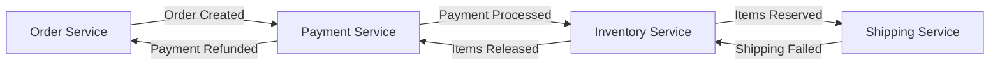
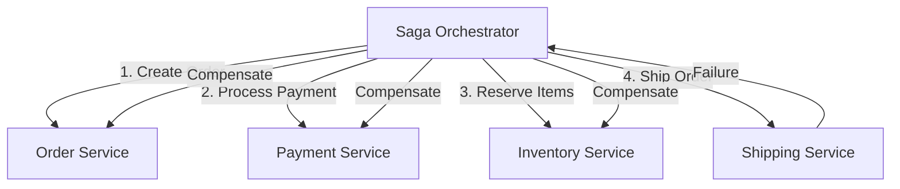

# Saga Pattern (Enhanced)

!!! danger "🥉 Bronze Tier Pattern"
    **Over-Engineered Variant** • Consider simpler alternatives
    
    An overly complex variant of the Saga pattern. While it adds advanced features, modern workflow engines like Temporal or Cadence provide better solutions for complex distributed workflows. Use the basic Saga pattern for most use cases.

<span class="path-icon">🔄</span>
 <span class="path-name">Senior Engineer Path</span>
 <span class="path-progress">8/15</span>
 <div class="mini-progress">
</div>

!!! info
 <h4>📚 Before You Begin</h4>
 <p>Make sure you understand these concepts:</p>
 <ul>
 <li><a href="/patterns/two-phase-commit/">Two-Phase Commit</a> - Traditional distributed transactions</li>
 <li><a href="/patterns/event-sourcing">Event Sourcing</a> - Event-driven state management</li>
 <li><a href="/part2-pillars/state/index.md">State Distribution</a> - Managing distributed state</li>
 </ul>

## The Essential Question

**How can we maintain data consistency across multiple services when ACID transactions can't span service boundaries?**

---

## Level 1: Intuition (5 minutes)

### The Story

Vacation booking requires: flight, hotel, car, payment. Traditional agents handled all at once - fail anywhere, cancel everything.

But with separate companies per booking, you can't "rollback" United when Hertz fails. You must explicitly cancel each success.

Saga pattern: sequence of local transactions with compensating actions.

### Visual Metaphor

```
Traditional Transaction: Saga Pattern:

┌─────────────────┐ Step 1: Book Flight ✓
│ BEGIN │ ↓
│ Book Flight │ Step 2: Book Hotel ✓
│ Book Hotel │ ↓
│ Book Car │ Step 3: Book Car ✗
│ Charge Card │ ↓
│ COMMIT/ROLLBACK │ Compensate: Cancel Hotel
└─────────────────┘ ↓
 Compensate: Cancel Flight
All or Nothing Each step + compensation
```

### The Trade-off

!!! abstract "Saga vs ACID Transaction"
    | Aspect | ACID Transaction | Saga Pattern |
    |--------|-----------------|--------------|
    | Consistency | Strong | Eventual |
    | Isolation | Full | None |
    | Latency | High | Lower |
    | Scalability | Limited | High |
    | Complexity | Simple | Complex |

---

## Level 2: Deep Understanding (10 minutes)

### Core Concepts

A saga is a sequence of local transactions where:
1. Each transaction updates data within a single service
2. Each transaction publishes events/messages triggering next transaction
3. If a transaction fails, compensating transactions undo prior changes

### Two Saga Types

#### 1. Choreography: Event-Driven


**Pros**: Loose coupling, simple services
**Cons**: Hard to understand flow, circular dependencies

#### 2. Orchestration: Command-Driven


**Pros**: Centralized logic, easy monitoring
**Cons**: Single point of failure, orchestrator complexity

### Compensation Strategies

| Strategy | Description | Use When |
|----------|-------------|----------|
| **Backward Recovery** | Undo in reverse order | Always possible to compensate |
| **Forward Recovery** | Retry or alternative path | Compensation expensive/impossible |
| **Mixed** | Some forward, some backward | Complex workflows |

---

## Level 3: Implementation (15 minutes)

### Basic Orchestrator Implementation

```python
from enum import Enum
from typing import List, Dict, Callable, Any
import asyncio
import logging

class SagaState(Enum):
    PENDING = "PENDING"
    RUNNING = "RUNNING"
    COMPENSATING = "COMPENSATING"
    COMPLETED = "COMPLETED"
    FAILED = "FAILED"

class SagaStep:
    def __init__(self, 
                 name: str,
                 action: Callable,
                 compensation: Callable,
                 timeout: int = 30):
        self.name = name
        self.action = action
        self.compensation = compensation
        self.timeout = timeout

class Saga:
    def __init__(self, saga_id: str, steps: List[SagaStep]):
        self.saga_id = saga_id
        self.steps = steps
        self.state = SagaState.PENDING
        self.completed_steps = []
        self.context = {}  # Shared data between steps
        
    async def execute(self) -> Dict[str, Any]:
        """Execute the saga with automatic compensation on failure"""
        self.state = SagaState.RUNNING
        
        try:
            # Forward execution
            for step in self.steps:
                logging.info(f"Saga {self.saga_id}: Executing {step.name}")
                
                try:
                    # Execute with timeout
                    result = await asyncio.wait_for(
                        step.action(self.context),
                        timeout=step.timeout
                    )
                    
                    self.completed_steps.append(step)
                    self.context[step.name] = result
                    
                except Exception as e:
                    logging.error(f"Saga {self.saga_id}: {step.name} failed: {e}")
                    await self._compensate()
                    raise
                    
            self.state = SagaState.COMPLETED
            return {"status": "completed", "results": self.context}
            
        except Exception as e:
            self.state = SagaState.FAILED
            return {"status": "failed", "error": str(e)}
    
    async def _compensate(self):
        """Run compensation for completed steps in reverse order"""
        self.state = SagaState.COMPENSATING
        
        for step in reversed(self.completed_steps):
            try:
                logging.info(f"Saga {self.saga_id}: Compensating {step.name}")
                await step.compensation(self.context)
            except Exception as e:
                # Log but continue compensation
                logging.error(f"Compensation failed for {step.name}: {e}")
```

### Real-World Example: E-Commerce Order

```python
class OrderSaga:
    def __init__(self, order_id: str, user_id: str, items: List[Dict]):
        self.saga = Saga(
            saga_id=f"order-{order_id}",
            steps=[
                SagaStep(
                    name="reserve_inventory",
                    action=self.reserve_inventory,
                    compensation=self.release_inventory
                ),
                SagaStep(
                    name="process_payment",
                    action=self.process_payment,
                    compensation=self.refund_payment
                ),
                SagaStep(
                    name="create_shipment",
                    action=self.create_shipment,
                    compensation=self.cancel_shipment
                ),
                SagaStep(
                    name="send_confirmation",
                    action=self.send_confirmation,
                    compensation=self.send_cancellation
                )
            ]
        )
        self.order_id = order_id
        self.user_id = user_id
        self.items = items
    
    async def reserve_inventory(self, context: Dict) -> Dict:
        # Call inventory service
        reservations = []
        for item in self.items:
            response = await inventory_service.reserve(
                item_id=item['id'],
                quantity=item['quantity']
            )
            reservations.append(response['reservation_id'])
        
        return {"reservation_ids": reservations}
    
    async def release_inventory(self, context: Dict):
        # Compensate by releasing reservations
        for reservation_id in context['reserve_inventory']['reservation_ids']:
            await inventory_service.release(reservation_id)
    
    async def process_payment(self, context: Dict) -> Dict:
        # Calculate total and charge
        total = sum(item['price'] * item['quantity'] for item in self.items)
        
        charge = await payment_service.charge(
            user_id=self.user_id,
            amount=total,
            order_id=self.order_id
        )
        
        return {"charge_id": charge['id'], "amount": total}
    
    async def refund_payment(self, context: Dict):
        # Refund the charge
        charge_id = context['process_payment']['charge_id']
        await payment_service.refund(charge_id)
    
    # ... other methods ...
```

### State Persistence for Reliability

```python
class PersistentSagaOrchestrator:
    def __init__(self, state_store: StateStore):
        self.state_store = state_store
        
    async def execute_saga(self, saga: Saga) -> Dict:
        # Save initial state
        await self.state_store.save_saga_state(saga)
        
        try:
            # Execute each step with state persistence
            for i, step in enumerate(saga.steps):
                result = await step.action(saga.context)
                
                # Persist progress after each step
                saga.completed_steps.append(step)
                saga.context[step.name] = result
                await self.state_store.save_saga_state(saga)
                
            saga.state = SagaState.COMPLETED
            await self.state_store.save_saga_state(saga)
            
        except Exception as e:
            # Load latest state and compensate
            saga = await self.state_store.load_saga_state(saga.saga_id)
            await self._compensate_with_persistence(saga)
            
    async def recover_incomplete_sagas(self):
        """Recover sagas that crashed mid-execution"""
        incomplete = await self.state_store.find_incomplete_sagas()
        
        for saga_state in incomplete:
            saga = self._reconstruct_saga(saga_state)
            
            if saga.state == SagaState.RUNNING:
                # Continue from last successful step
                await self._resume_saga(saga)
            elif saga.state == SagaState.COMPENSATING:
                # Continue compensation
                await self._compensate_with_persistence(saga)
```

---

## Common Pitfalls and Solutions

!!! warning "Pitfall: Non-Idempotent Operations"
    **Problem**: Retrying a step causes duplicate effects (double charging, double shipping)
    
    **Solution**: 
    ```python
    async def idempotent_payment(self, context: Dict) -> Dict:
        # Use idempotency key
        idempotency_key = f"{self.order_id}-payment"
        
        existing = await payment_service.get_by_idempotency_key(idempotency_key)
        if existing:
            return existing
            
        return await payment_service.charge(
            idempotency_key=idempotency_key,
            # ... other params
        )
    ```

!!! danger "Pitfall: Compensation Failures"
    **Problem**: What if compensation itself fails?
    
    **Solution**:
    - Implement retry with exponential backoff
    - Alert humans for manual intervention
    - Design compensations to be eventually successful
    - Use dead letter queues for failed compensations

!!! error "Pitfall: Partial State Visibility"
    **Problem**: Other services see intermediate states during saga execution
    
    **Solution**:
    - Use "pending" states during execution
    - Implement read-your-writes consistency
    - Consider using event sourcing for full history

## Design Patterns for Sagas

### 1. Semantic Lock Pattern
Prevent concurrent modifications during saga execution:

```python
class SemanticLock:
    async def acquire_for_saga(self, resource_id: str, saga_id: str, ttl: int):
        """Acquire a lock that auto-expires"""
        success = await redis.set(
            f"lock:{resource_id}",
            saga_id,
            nx=True,  # Only set if not exists
            ex=ttl    # Expiry time
        )
        if not success:
            raise ResourceLocked(f"Resource {resource_id} is locked")
```

### 2. Pivot Transaction Pattern
Identify the point of no return in your saga:

```python
class OrderSagaWithPivot(OrderSaga):
    def __init__(self, *args, **kwargs):
        super().__init__(*args, **kwargs)
        # Payment is our pivot - after this, we prefer forward recovery
        self.pivot_step = "process_payment"
        
    async def execute_with_pivot(self):
        try:
            await self.saga.execute()
        except Exception as e:
            if self._past_pivot():
                # Try forward recovery instead of full compensation
                await self._forward_recovery()
            else:
                # Normal compensation
                await self.saga._compensate()
```

### 3. Saga Log Pattern
Maintain an append-only log of all saga events:

```python
@dataclass
class SagaEvent:
    saga_id: str
    timestamp: datetime
    event_type: str  # STARTED, STEP_COMPLETED, STEP_FAILED, etc.
    step_name: Optional[str]
    data: Dict[str, Any]

class SagaLog:
    async def append(self, event: SagaEvent):
        await self.event_store.append(event)
        
    async def replay(self, saga_id: str) -> Saga:
        """Reconstruct saga state from events"""
        events = await self.event_store.get_events(saga_id)
        return self._reconstruct_from_events(events)
```

## Monitoring and Operations

### Key Metrics

| Metric | Description | Alert Threshold |
|--------|-------------|-----------------|
| `saga_duration_seconds` | Time to complete saga | > 95th percentile |
| `saga_failure_rate` | Percentage of failed sagas | > 1% |
| `compensation_rate` | How often compensation runs | > 5% |
| `step_duration_seconds` | Time per step | > SLA per step |
| `incomplete_saga_count` | Stuck sagas | > 0 for > 1 hour |

### Operational Dashboard

```python
class SagaMonitor:
    def get_saga_status(self, saga_id: str) -> Dict:
        return {
            "saga_id": saga_id,
            "current_state": self.get_state(saga_id),
            "completed_steps": self.get_completed_steps(saga_id),
            "duration_so_far": self.get_duration(saga_id),
            "last_error": self.get_last_error(saga_id),
            "compensation_attempts": self.get_compensation_count(saga_id)
        }
    
    def get_system_health(self) -> Dict:
        return {
            "active_sagas": self.count_active_sagas(),
            "success_rate_1h": self.calculate_success_rate(hours=1),
            "avg_duration_1h": self.calculate_avg_duration(hours=1),
            "stuck_sagas": self.find_stuck_sagas(threshold_minutes=30)
        }
```

## Testing Strategies

### 1. Chaos Testing
```python
class ChaosSagaTest:
    async def test_random_failures(self):
        """Inject random failures at each step"""
        for failure_step in range(len(saga.steps)):
            with patch_step_to_fail(failure_step):
                result = await saga.execute()
                
                # Verify compensation ran correctly
                assert result["status"] == "failed"
                assert all_compensations_executed()
                assert no_side_effects_remain()
```

### 2. Compensation Testing
```python
async def test_compensation_idempotency():
    """Ensure compensations can be safely retried"""
    saga = create_test_saga()
    
    # Execute partially
    await execute_steps(saga, count=2)
    
    # Run compensation multiple times
    for _ in range(3):
        await saga._compensate()
        
    # Verify state is correct
    assert system_state_is_clean()
```

## Real-World Examples

<a href="/case-studies/uber-trip-saga/" class="related-item">
 <span class="item-icon">🚗</span>
 <span class="item-title">Uber Trip Coordination</span>
 <span class="item-type">case-study</span>
 </a>
 <a href="/case-studies/airbnb-booking/" class="related-item">
 <span class="item-icon">🏠</span>
 <span class="item-title">Airbnb Booking Flow</span>
 <span class="item-type">case-study</span>
 </a>
 <a href="/patterns/event-sourcing" class="related-item">
 <span class="item-icon">📝</span>
 <span class="item-title">Event Sourcing</span>
 <span class="item-type">pattern</span>
 </a>
 <a href="/patterns/outbox" class="related-item">
 <span class="item-icon">📤</span>
 <span class="item-title">Outbox Pattern</span>
 <span class="item-type">pattern</span>
 </a>

## Next Steps

<div class="step-card level-beginner">
 <span class="level-badge">Beginner</span>
 <h4><a href="/tutorials/saga-basics/">Implement Basic Saga</a></h4>
 <p>Build a simple two-step saga with compensation logic.</p>
 
 <span class="level-badge">Intermediate</span>
 <h4><a href="/tutorials/saga-orchestrator/">Build Saga Orchestrator</a></h4>
 <p>Create a reusable orchestrator with state persistence.</p>
 
 <span class="level-badge">Advanced</span>
 <h4><a href="/tutorials/saga-production/">Production Saga Framework</a></h4>
 <p>Implement a complete saga framework with monitoring and recovery.</p>
</div>

## Key Takeaways

!!! success "Essential Points"
    1. **Sagas trade ACID for scalability** - Accept eventual consistency
    2. **Design for failure** - Every action needs compensation
    3. **Idempotency is critical** - Steps will be retried
    4. **Monitor everything** - Sagas are complex to debug
    5. **Test compensations thoroughly** - They're your safety net

---

<div class="progress-bar">
 <div class="progress-fill">
 </div>
 Progress: 8 of 15 communication patterns completed
</div>