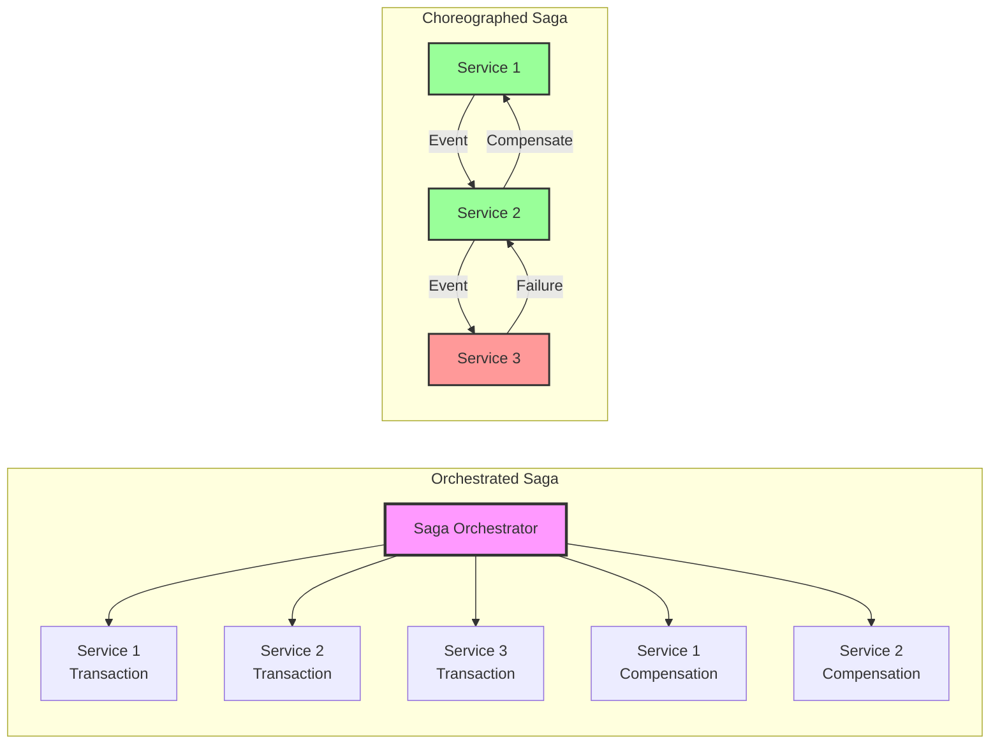
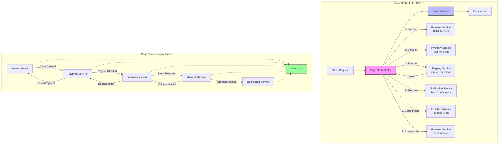
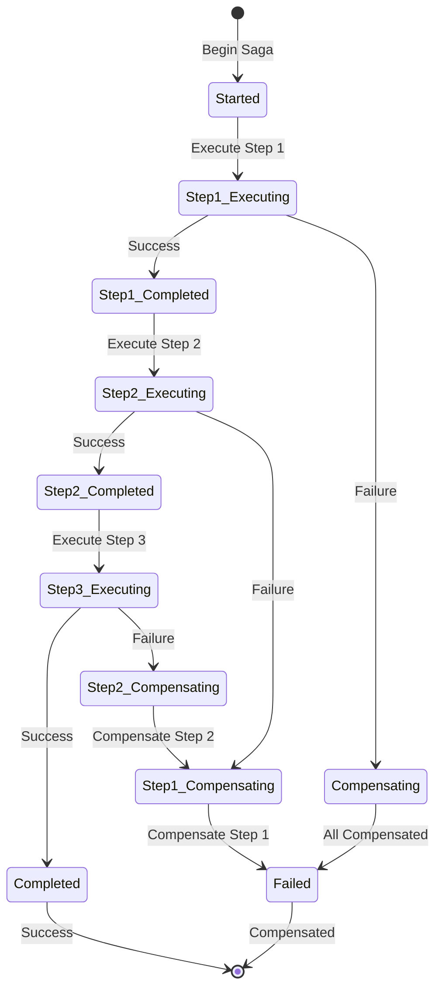
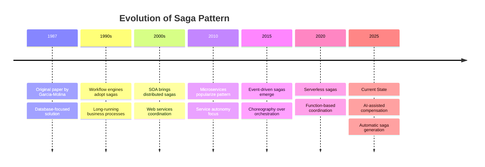
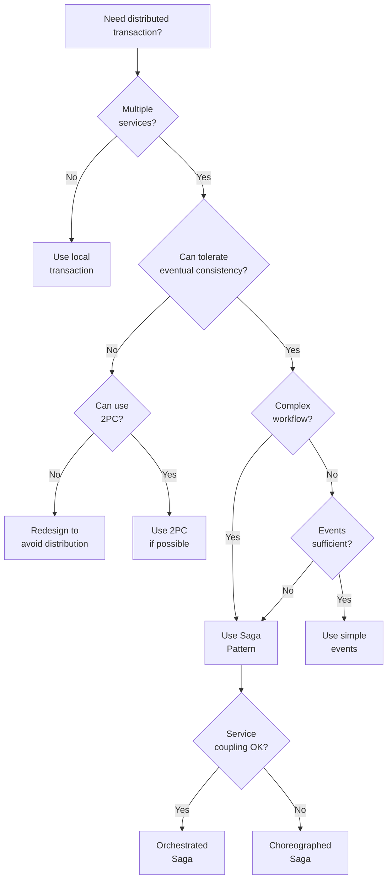

# Saga Pattern

<div class="navigation-breadcrumb">
<a href="/">Home</a> > <a href="/patterns/">Patterns</a> > Saga Pattern
</div>

> "A distributed system is one in which the failure of a computer you didn't even know existed can render your own computer unusable"
> — Leslie Lamport

## The Essential Question

**How can we maintain data consistency across multiple services when ACID transactions can't span service boundaries?**

---

## Level 1: Intuition (5 minutes)

### The Story

Imagine planning a vacation trip. You need to:
1. Book a flight
2. Reserve a hotel
3. Rent a car
4. Charge your credit card

In the old days, a travel agent would do all of this in one sitting - if any step failed, they'd cancel everything and start over.

But what if each booking is handled by a different company? You can't just "rollback" a flight booking at United when Hertz runs out of cars. Instead, you need to explicitly cancel each successful booking if later steps fail.

This is the Saga pattern - a sequence of local transactions where each step can be undone if needed.

### Visual Metaphor

```
Traditional Transaction:          Saga Pattern:

┌─────────────────┐              Step 1: Book Flight ✓
│ BEGIN           │              ↓
│  Book Flight    │              Step 2: Book Hotel ✓
│  Book Hotel     │              ↓
│  Book Car       │              Step 3: Book Car ✗
│  Charge Card    │              ↓
│ COMMIT/ROLLBACK │              Compensate: Cancel Hotel
└─────────────────┘              ↓
                                Compensate: Cancel Flight
All or Nothing                   Each step + compensation
```

### In One Sentence

**Saga Pattern**: Manage distributed transactions as a sequence of local transactions, each with a compensating action to undo it if later steps fail.

### Real-World Parallel

Sagas are like dominoes that can be stood back up - you line them up and knock them down in sequence, but if something goes wrong, you can carefully stand each fallen domino back up in reverse order.

---

## Level 2: Foundation (10 minutes)

### The Problem Space

<div class="failure-vignette">
<h4>🔥 When Saga Wasn't Used: The Ticketmaster Disaster</h4>
During a major concert sale, Ticketmaster's system charged thousands of credit cards but failed to reserve the seats due to a downstream service failure. Without a saga to compensate:
- 50,000+ customers charged for tickets they didn't get
- 3-week manual refund process
- $5M in processing fees and penalties
- Major reputation damage and lawsuits
</div>

### Core Concept

The Saga pattern breaks a distributed transaction into a sequence of local transactions, where:

1. **Local Transactions**: Each service performs its own ACID transaction
2. **Compensating Transactions**: Each step has an undo operation
3. **Saga Coordination**: Either orchestrated centrally or choreographed via events
4. **Eventually Consistent**: The system reaches consistency through the saga
5. **Failure Recovery**: Compensations run in reverse order on failure

### Basic Architecture



### Key Benefits

1. **Distributed Consistency**: Maintain consistency without distributed locks
2. **Service Autonomy**: Each service manages its own data
3. **Failure Recovery**: Automatic compensation on failures
4. **Long-Running Processes**: Support for workflows that take time

### Trade-offs

| Aspect | Gain | Cost |
|--------|------|------|
| Consistency | Eventual consistency | No immediate consistency |
| Complexity | Service independence | Compensation logic |
| Debugging | Clear transaction flow | Distributed tracing needed |
| Testing | Isolated service tests | Complex integration tests |

---

## Level 3: Deep Dive (20 minutes)

### Detailed Architecture



### Implementation Patterns

#### Basic Implementation

```python
from abc import ABC, abstractmethod
from enum import Enum
from typing import Dict, List, Any, Optional
from dataclasses import dataclass
import uuid
import asyncio
import logging

# Saga Step Definition
class StepStatus(Enum):
    PENDING = "pending"
    EXECUTING = "executing"
    COMPLETED = "completed"
    COMPENSATING = "compensating"
    COMPENSATED = "compensated"
    FAILED = "failed"

@dataclass
class SagaContext:
    """Shared context across saga steps"""
    saga_id: str
    initial_request: Dict[str, Any]
    step_results: Dict[str, Any] = None
    
    def __post_init__(self):
        if self.step_results is None:
            self.step_results = {}

class SagaStep(ABC):
    """Base class for saga steps"""
    
    def __init__(self, name: str):
        self.name = name
        self.status = StepStatus.PENDING
        
    @abstractmethod
    async def execute(self, context: SagaContext) -> Any:
        """Execute the forward transaction"""
        pass
        
    @abstractmethod
    async def compensate(self, context: SagaContext) -> None:
        """Compensate (undo) the transaction"""
        pass
        
    def can_compensate(self) -> bool:
        """Check if this step can be compensated"""
        return self.status == StepStatus.COMPLETED

# Example Saga Steps
class CreateOrderStep(SagaStep):
    def __init__(self, order_service):
        super().__init__("create_order")
        self.order_service = order_service
        
    async def execute(self, context: SagaContext) -> str:
        self.status = StepStatus.EXECUTING
        try:
            order = await self.order_service.create_order(
                customer_id=context.initial_request['customer_id'],
                items=context.initial_request['items']
            )
            context.step_results['order_id'] = order.id
            self.status = StepStatus.COMPLETED
            return order.id
        except Exception as e:
            self.status = StepStatus.FAILED
            raise
            
    async def compensate(self, context: SagaContext) -> None:
        if 'order_id' in context.step_results:
            self.status = StepStatus.COMPENSATING
            await self.order_service.cancel_order(
                context.step_results['order_id']
            )
            self.status = StepStatus.COMPENSATED

class ProcessPaymentStep(SagaStep):
    def __init__(self, payment_service):
        super().__init__("process_payment")
        self.payment_service = payment_service
        
    async def execute(self, context: SagaContext) -> str:
        self.status = StepStatus.EXECUTING
        try:
            payment = await self.payment_service.charge(
                amount=context.initial_request['total_amount'],
                payment_method=context.initial_request['payment_method'],
                idempotency_key=f"{context.saga_id}-payment"
            )
            context.step_results['payment_id'] = payment.id
            self.status = StepStatus.COMPLETED
            return payment.id
        except Exception as e:
            self.status = StepStatus.FAILED
            raise
            
    async def compensate(self, context: SagaContext) -> None:
        if 'payment_id' in context.step_results:
            self.status = StepStatus.COMPENSATING
            await self.payment_service.refund(
                payment_id=context.step_results['payment_id'],
                reason="Saga compensation"
            )
            self.status = StepStatus.COMPENSATED

# Saga Orchestrator
class SagaOrchestrator:
    """Orchestrates saga execution with automatic compensation"""
    
    def __init__(self, saga_id: Optional[str] = None):
        self.saga_id = saga_id or str(uuid.uuid4())
        self.steps: List[SagaStep] = []
        self.completed_steps: List[SagaStep] = []
        self.status = "initialized"
        self.logger = logging.getLogger(__name__)
        
    def add_step(self, step: SagaStep) -> 'SagaOrchestrator':
        """Add a step to the saga"""
        self.steps.append(step)
        return self
        
    async def execute(self, initial_request: Dict[str, Any]) -> SagaContext:
        """Execute the saga with automatic compensation on failure"""
        context = SagaContext(
            saga_id=self.saga_id,
            initial_request=initial_request
        )
        
        self.status = "running"
        self.logger.info(f"Starting saga {self.saga_id}")
        
        try:
            # Execute steps in sequence
            for step in self.steps:
                self.logger.info(f"Executing step: {step.name}")
                
                result = await step.execute(context)
                self.completed_steps.append(step)
                
                # Persist saga state after each step
                await self._persist_state(context)
                
                self.logger.info(f"Step {step.name} completed: {result}")
                
            self.status = "completed"
            self.logger.info(f"Saga {self.saga_id} completed successfully")
            return context
            
        except Exception as e:
            self.logger.error(f"Saga {self.saga_id} failed at step {step.name}: {e}")
            self.status = "compensating"
            
            # Run compensations in reverse order
            await self._run_compensations(context)
            
            self.status = "failed"
            raise SagaFailedException(
                f"Saga {self.saga_id} failed and was compensated"
            ) from e
            
    async def _run_compensations(self, context: SagaContext):
        """Run compensation for completed steps in reverse order"""
        for step in reversed(self.completed_steps):
            if step.can_compensate():
                try:
                    self.logger.info(f"Compensating step: {step.name}")
                    await step.compensate(context)
                    await self._persist_state(context)
                except Exception as e:
                    self.logger.error(
                        f"Compensation failed for {step.name}: {e}"
                    )
                    # Continue compensating other steps
                    
    async def _persist_state(self, context: SagaContext):
        """Persist saga state for recovery"""
        # In production, save to database
        # This enables saga recovery after crashes
        pass
```

#### Production-Ready Implementation

```python
import asyncio
from typing import Dict, List, Optional, Any
from datetime import datetime, timedelta
import json
from dataclasses import dataclass, asdict

# Saga Persistence for Recovery
class SagaRepository:
    """Persist saga state for crash recovery"""
    
    def __init__(self, db_pool):
        self.db_pool = db_pool
        
    async def save_saga(self, saga_id: str, state: Dict[str, Any]):
        async with self.db_pool.acquire() as conn:
            await conn.execute("""
                INSERT INTO sagas (id, state, updated_at)
                VALUES ($1, $2, $3)
                ON CONFLICT (id) DO UPDATE
                SET state = $2, updated_at = $3
            """, saga_id, json.dumps(state), datetime.utcnow())
            
    async def load_saga(self, saga_id: str) -> Optional[Dict[str, Any]]:
        async with self.db_pool.acquire() as conn:
            row = await conn.fetchone(
                "SELECT state FROM sagas WHERE id = $1",
                saga_id
            )
            return json.loads(row['state']) if row else None
            
    async def delete_saga(self, saga_id: str):
        async with self.db_pool.acquire() as conn:
            await conn.execute(
                "DELETE FROM sagas WHERE id = $1",
                saga_id
            )

# Event-Driven Choreography
@dataclass
class SagaEvent:
    saga_id: str
    step_name: str
    status: str
    payload: Dict[str, Any]
    timestamp: datetime = None
    
    def __post_init__(self):
        if self.timestamp is None:
            self.timestamp = datetime.utcnow()

class ChoreographedSaga:
    """Event-driven saga implementation"""
    
    def __init__(self, event_bus, saga_repository):
        self.event_bus = event_bus
        self.saga_repository = saga_repository
        self.active_sagas: Dict[str, Dict] = {}
        
        # Subscribe to events
        self._subscribe_to_events()
        
    def _subscribe_to_events(self):
        """Subscribe to all saga-related events"""
        self.event_bus.subscribe('OrderCreated', self.handle_order_created)
        self.event_bus.subscribe('PaymentProcessed', self.handle_payment_processed)
        self.event_bus.subscribe('InventoryReserved', self.handle_inventory_reserved)
        self.event_bus.subscribe('ShipmentCreated', self.handle_shipment_created)
        
        # Failure events
        self.event_bus.subscribe('PaymentFailed', self.handle_payment_failed)
        self.event_bus.subscribe('InventoryFailed', self.handle_inventory_failed)
        self.event_bus.subscribe('ShipmentFailed', self.handle_shipment_failed)
        
    async def handle_order_created(self, event: SagaEvent):
        """Start saga when order is created"""
        saga_id = event.saga_id
        
        # Initialize saga state
        self.active_sagas[saga_id] = {
            'status': 'processing_payment',
            'order': event.payload,
            'completed_steps': ['order_created']
        }
        
        await self.saga_repository.save_saga(saga_id, self.active_sagas[saga_id])
        
        # Trigger next step
        await self.event_bus.publish(SagaEvent(
            saga_id=saga_id,
            step_name='process_payment',
            status='started',
            payload={
                'amount': event.payload['total_amount'],
                'payment_method': event.payload['payment_method']
            }
        ))
        
    async def handle_payment_processed(self, event: SagaEvent):
        """Handle successful payment"""
        saga_id = event.saga_id
        saga = self.active_sagas.get(saga_id)
        
        if not saga:
            saga = await self.saga_repository.load_saga(saga_id)
            if not saga:
                return
                
        saga['payment'] = event.payload
        saga['completed_steps'].append('payment_processed')
        saga['status'] = 'reserving_inventory'
        
        await self.saga_repository.save_saga(saga_id, saga)
        
        # Next step
        await self.event_bus.publish(SagaEvent(
            saga_id=saga_id,
            step_name='reserve_inventory',
            status='started',
            payload={
                'items': saga['order']['items']
            }
        ))
        
    async def handle_inventory_failed(self, event: SagaEvent):
        """Handle inventory reservation failure - start compensation"""
        saga_id = event.saga_id
        saga = self.active_sagas.get(saga_id)
        
        if not saga:
            saga = await self.saga_repository.load_saga(saga_id)
            if not saga:
                return
                
        saga['status'] = 'compensating'
        saga['failure_reason'] = event.payload.get('reason')
        
        # Start compensation based on completed steps
        if 'payment_processed' in saga['completed_steps']:
            await self.event_bus.publish(SagaEvent(
                saga_id=saga_id,
                step_name='refund_payment',
                status='started',
                payload={
                    'payment_id': saga['payment']['payment_id']
                }
            ))
            
        if 'order_created' in saga['completed_steps']:
            await self.event_bus.publish(SagaEvent(
                saga_id=saga_id,
                step_name='cancel_order',
                status='started',
                payload={
                    'order_id': saga['order']['order_id']
                }
            ))

# Saga Monitoring and Timeouts
class SagaMonitor:
    """Monitor saga execution and handle timeouts"""
    
    def __init__(self, saga_repository, event_bus, timeout_minutes=30):
        self.saga_repository = saga_repository
        self.event_bus = event_bus
        self.timeout_minutes = timeout_minutes
        
    async def check_stuck_sagas(self):
        """Periodically check for stuck sagas"""
        while True:
            try:
                stuck_sagas = await self._find_stuck_sagas()
                
                for saga_id, saga_state in stuck_sagas:
                    await self._handle_stuck_saga(saga_id, saga_state)
                    
            except Exception as e:
                logging.error(f"Error checking stuck sagas: {e}")
                
            await asyncio.sleep(60)  # Check every minute
            
    async def _find_stuck_sagas(self) -> List[tuple]:
        """Find sagas that haven't progressed"""
        cutoff_time = datetime.utcnow() - timedelta(minutes=self.timeout_minutes)
        
        async with self.saga_repository.db_pool.acquire() as conn:
            rows = await conn.fetch("""
                SELECT id, state 
                FROM sagas 
                WHERE updated_at < $1 
                AND state->>'status' NOT IN ('completed', 'failed')
            """, cutoff_time)
            
            return [(row['id'], json.loads(row['state'])) for row in rows]
            
    async def _handle_stuck_saga(self, saga_id: str, saga_state: Dict):
        """Handle a saga that's stuck"""
        logging.warning(f"Saga {saga_id} is stuck in state: {saga_state['status']}")
        
        # Trigger timeout compensation
        await self.event_bus.publish(SagaEvent(
            saga_id=saga_id,
            step_name='saga_timeout',
            status='failed',
            payload={
                'reason': 'Saga execution timeout',
                'last_status': saga_state['status']
            }
        ))

# Saga with Distributed Locking
class DistributedSagaLock:
    """Ensure only one instance processes a saga"""
    
    def __init__(self, redis_client):
        self.redis = redis_client
        self.lock_timeout = 300  # 5 minutes
        
    async def acquire_lock(self, saga_id: str) -> bool:
        """Try to acquire exclusive lock for saga"""
        lock_key = f"saga_lock:{saga_id}"
        lock_value = str(uuid.uuid4())
        
        acquired = await self.redis.set(
            lock_key, 
            lock_value,
            nx=True,  # Only set if not exists
            ex=self.lock_timeout
        )
        
        if acquired:
            # Store lock value for safe release
            return lock_value
        return None
        
    async def release_lock(self, saga_id: str, lock_value: str):
        """Safely release lock if we own it"""
        lock_key = f"saga_lock:{saga_id}"
        
        # Lua script for atomic check and delete
        lua_script = """
        if redis.call("get", KEYS[1]) == ARGV[1] then
            return redis.call("del", KEYS[1])
        else
            return 0
        end
        """
        
        await self.redis.eval(lua_script, 1, lock_key, lock_value)
```

### State Management

Sagas manage state through explicit state machines:



### Common Variations

1. **Orchestrated Saga**
   - Use case: Complex workflows with branching logic
   - Trade-off: Central point of failure but easier debugging

2. **Choreographed Saga**
   - Use case: Loosely coupled services
   - Trade-off: No central coordinator but harder to monitor

3. **Hybrid Saga**
   - Use case: Mix of orchestration and choreography
   - Trade-off: Flexibility but increased complexity

### Integration Points

- **With Event Sourcing**: Saga events become part of event stream
- **With CQRS**: Saga updates command side, queries read side
- **With Outbox Pattern**: Ensure reliable event publishing
- **With Circuit Breaker**: Protect saga steps from failures

---

## Level 4: Expert Practitioner (30 minutes)

### Advanced Techniques

#### Saga Composition

```python
class CompositeSaga:
    """Compose sagas from smaller sagas"""
    
    def __init__(self):
        self.sub_sagas: List[SagaOrchestrator] = []
        
    def add_sub_saga(self, saga: SagaOrchestrator):
        self.sub_sagas.append(saga)
        return self
        
    async def execute(self, context: Dict[str, Any]):
        """Execute sub-sagas with proper isolation"""
        completed_sagas = []
        
        try:
            for sub_saga in self.sub_sagas:
                # Each sub-saga gets its own context
                sub_context = self._create_sub_context(context, sub_saga)
                
                result = await sub_saga.execute(sub_context)
                completed_sagas.append((sub_saga, result))
                
                # Update parent context
                self._merge_results(context, result)
                
        except Exception as e:
            # Compensate completed sub-sagas
            for saga, result in reversed(completed_sagas):
                await saga._run_compensations(result)
            raise

# Parallel Saga Execution
class ParallelSagaOrchestrator(SagaOrchestrator):
    """Execute independent saga steps in parallel"""
    
    def __init__(self, saga_id: Optional[str] = None):
        super().__init__(saga_id)
        self.parallel_groups: List[List[SagaStep]] = []
        
    def add_parallel_group(self, steps: List[SagaStep]):
        """Add steps that can execute in parallel"""
        self.parallel_groups.append(steps)
        return self
        
    async def execute(self, initial_request: Dict[str, Any]) -> SagaContext:
        """Execute with parallel step groups"""
        context = SagaContext(
            saga_id=self.saga_id,
            initial_request=initial_request
        )
        
        try:
            for group in self.parallel_groups:
                # Execute steps in parallel
                tasks = [
                    self._execute_step(step, context) 
                    for step in group
                ]
                
                results = await asyncio.gather(*tasks)
                
                # All succeeded, mark as completed
                self.completed_steps.extend(group)
                
        except Exception as e:
            # Compensate in parallel too
            await self._run_parallel_compensations(context)
            raise
```

#### Saga Testing Framework

```python
class SagaTestFramework:
    """Comprehensive testing for sagas"""
    
    def __init__(self):
        self.mocked_services = {}
        self.execution_log = []
        
    async def test_happy_path(self, saga: SagaOrchestrator):
        """Test successful execution"""
        # Mock all services to succeed
        self._setup_success_mocks()
        
        context = await saga.execute(self._get_test_request())
        
        # Verify all steps executed
        assert all(
            step.status == StepStatus.COMPLETED 
            for step in saga.steps
        )
        
        return context
        
    async def test_compensation_at_step(self, 
                                       saga: SagaOrchestrator,
                                       failing_step: int):
        """Test compensation when specific step fails"""
        # Setup mocks
        for i, step in enumerate(saga.steps):
            if i < failing_step:
                self._mock_step_success(step)
            elif i == failing_step:
                self._mock_step_failure(step)
                
        # Execute and expect failure
        with pytest.raises(SagaFailedException):
            await saga.execute(self._get_test_request())
            
        # Verify compensations
        for i in range(failing_step):
            step = saga.steps[i]
            assert step.status == StepStatus.COMPENSATED
            
    async def test_idempotency(self, saga: SagaOrchestrator):
        """Test saga can be safely retried"""
        request = self._get_test_request()
        
        # First execution
        context1 = await saga.execute(request)
        
        # Retry with same request
        saga2 = self._rebuild_saga()
        context2 = await saga2.execute(request)
        
        # Results should be identical
        assert context1.step_results == context2.step_results
```

### Performance Optimization

<div class="decision-box">
<h4>🎯 Performance Tuning Checklist</h4>

- [ ] **Parallel Execution**: Run independent steps concurrently
- [ ] **Async I/O**: Use async/await throughout
- [ ] **Connection Pooling**: Reuse database connections
- [ ] **Batch Operations**: Group related operations
- [ ] **Caching**: Cache read-only data during saga
- [ ] **Timeout Tuning**: Set appropriate step timeouts
- [ ] **Circuit Breakers**: Fail fast on unavailable services
- [ ] **Monitoring**: Track saga execution times
</div>

### Monitoring & Observability

Key metrics to track:

```yaml
metrics:
  # Saga Execution Metrics
  - name: saga_duration
    description: Total saga execution time
    alert_threshold: p99 > 30s
    
  - name: saga_success_rate
    description: Percentage of successful sagas
    alert_threshold: < 95%
    
  - name: compensation_rate
    description: Percentage of sagas requiring compensation
    alert_threshold: > 10%
    
  # Step Metrics
  - name: step_duration
    description: Individual step execution time
    alert_threshold: p99 > 5s
    
  - name: step_failure_rate
    description: Step failure rate by type
    alert_threshold: > 5%
    
  # Compensation Metrics
  - name: compensation_success_rate
    description: Successful compensation percentage
    alert_threshold: < 99%
    
  - name: stuck_sagas
    description: Sagas not progressing
    alert_threshold: > 10
    
  # Resource Metrics
  - name: concurrent_sagas
    description: Number of active sagas
    alert_threshold: > 1000
```

### Common Pitfalls

<div class="failure-vignette">
<h4>⚠️ Pitfall: Non-Idempotent Steps</h4>
A team implemented saga steps that weren't idempotent. When network issues caused retries, customers were charged multiple times and inventory was double-decremented.

**Solution**: Every saga step must be idempotent. Use idempotency keys and check for duplicate operations.
</div>

<div class="failure-vignette">
<h4>⚠️ Pitfall: Missing Compensation Logic</h4>
A saga implementation had steps with no compensation logic. When failures occurred, the system was left in an inconsistent state requiring manual intervention.

**Solution**: Every forward transaction must have a compensating transaction. Test all compensation paths.
</div>

### Production Checklist

- [ ] **Idempotency** implemented for all steps
- [ ] **Compensation logic** for every forward transaction
- [ ] **Timeout handling** for long-running steps
- [ ] **State persistence** for crash recovery
- [ ] **Monitoring** for saga execution and compensation
- [ ] **Testing** of all failure scenarios
- [ ] **Documentation** of saga flows and compensations
- [ ] **Alerting** for stuck or failed sagas

---

## Level 5: Mastery (45 minutes)

### Case Study: Uber's Trip Booking Saga

<div class="truth-box">
<h4>🏢 Real-World Implementation</h4>

**Company**: Uber  
**Scale**: 
- 25M+ daily trips
- 100+ microservices involved
- Sub-second response required
- 99.99% consistency requirement

**Challenge**: Coordinate a trip across driver matching, fare calculation, payment authorization, and trip tracking services while handling failures gracefully.

**Saga Implementation**:

**Steps**:
1. Find and reserve driver
2. Calculate fare estimate
3. Authorize payment
4. Create trip record
5. Notify driver and rider
6. Start location tracking

**Architecture**:
```
Rider App → API Gateway → Trip Saga Orchestrator
                                   ↓
                          ┌────────┴────────┐
                          │                 │
                    Driver Service    Payment Service
                          │                 │
                    Fare Service      Notification Service
                          │                 │
                    Trip Service      Tracking Service
```

**Key Decisions**:
1. **Hybrid Approach**: Orchestration for trip creation, choreography for updates
2. **Optimistic Locking**: Reserve driver optimistically, compensate if needed
3. **Partial Completion**: Allow trip to start even if non-critical steps fail
4. **Saga Sharding**: Distribute saga execution by geographic region

**Results**:
- Trip creation latency: < 500ms p99
- Successful completion: 99.7%
- Compensation rate: 2.3%
- Zero inconsistency incidents in 2 years

**Lessons Learned**:
1. **Design for partial failure** - Not all steps are equally critical
2. **Compensation isn't always reverse** - Sometimes move forward differently
3. **Monitor compensation paths** - They reveal system issues
4. **Saga observability is crucial** - Distributed tracing for every saga
</div>

### Economic Analysis

#### Cost Model

```python
def calculate_saga_roi(
    transactions_per_day: int,
    services_involved: int,
    failure_rate: float,
    manual_resolution_cost: float
) -> dict:
    """Calculate ROI for implementing Saga pattern"""
    
    # Cost without saga (distributed transactions or manual)
    distributed_tx_overhead = 0.5  # 50% performance overhead
    manual_resolutions = transactions_per_day * failure_rate
    
    without_saga_costs = {
        'performance_cost': transactions_per_day * 0.001 * distributed_tx_overhead,
        'manual_resolution': manual_resolutions * manual_resolution_cost,
        'downtime_cost': failure_rate * 10000,  # Downtime impact
        'development_complexity': services_involved * 5000
    }
    
    # Cost with saga
    saga_compensation_rate = failure_rate * 0.1  # 90% auto-recovery
    
    with_saga_costs = {
        'implementation': services_involved * 8000,
        'saga_overhead': transactions_per_day * 0.0001,
        'compensation_cost': transactions_per_day * saga_compensation_rate * 0.1,
        'monitoring': 2000  # Monthly monitoring cost
    }
    
    # Benefits
    monthly_savings = (
        sum(without_saga_costs.values()) - 
        sum(with_saga_costs.values())
    )
    
    return {
        'monthly_savings': monthly_savings,
        'payback_months': with_saga_costs['implementation'] / monthly_savings,
        'reliability_improvement': (1 - saga_compensation_rate) * 100,
        'recommended': services_involved >= 3 and failure_rate > 0.01
    }

# Example calculation
roi = calculate_saga_roi(
    transactions_per_day=100_000,
    services_involved=5,
    failure_rate=0.05,  # 5% failure rate
    manual_resolution_cost=10  # $10 per manual fix
)
print(f"ROI: ${roi['monthly_savings']:,.0f}/month, "
      f"Payback: {roi['payback_months']:.1f} months")
```

#### When It Pays Off

- **Break-even point**: 3+ services with 1%+ failure rate
- **High ROI scenarios**:
  - E-commerce checkouts
  - Financial transactions
  - Booking systems
  - Order fulfillment
- **Low ROI scenarios**:
  - Simple CRUD operations
  - Read-only workflows
  - Single service transactions

### Pattern Evolution



### Axiom Connections

<div class="axiom-box">
<h4>🔗 Fundamental Axioms</h4>

This pattern directly addresses:

1. **Coordination Axiom**: Manages distributed consensus without locks
2. **Failure Axiom**: Explicit handling of partial failures
3. **Concurrency Axiom**: Handles concurrent saga executions
4. **Observability Axiom**: Full audit trail of all steps
5. **Economics Axiom**: Balances consistency costs with business needs
</div>

### Future Directions

**Emerging Trends**:

1. **ML-Driven Compensation**: AI determines optimal compensation strategy
2. **Predictive Saga Routing**: ML predicts likely failures and adjusts flow
3. **Blockchain Sagas**: Immutable saga execution logs
4. **Edge Sagas**: Distributed saga execution at edge locations

**What's Next**:
- Automatic saga generation from business requirements
- Self-healing sagas that adapt to failures
- Cross-cloud saga orchestration
- Real-time saga optimization based on conditions

---

## Quick Reference

### Decision Matrix



### Command Cheat Sheet

```bash
# Saga Management
saga start <type> <request>          # Start new saga
saga status <saga-id>                # Check saga status
saga retry <saga-id>                 # Retry failed saga
saga compensate <saga-id>            # Force compensation

# Monitoring
saga list --status=running           # List active sagas
saga list --stuck --timeout=30m      # Find stuck sagas
saga metrics --period=1h             # Saga metrics

# Testing
saga test <definition> --happy-path  # Test success path
saga test <definition> --fail-at=3   # Test failure at step 3
saga test <definition> --chaos       # Random failure testing

# Debugging
saga trace <saga-id>                 # Show execution trace
saga events <saga-id>                # List all events
saga replay <saga-id>                # Replay saga execution
```

### Configuration Template

```yaml
# Production Saga configuration
saga:
  orchestrator:
    type: "centralized"  # or distributed
    persistence: "postgresql"
    state_timeout: 30m
    
  execution:
    max_retries: 3
    retry_delay: "exponential"
    parallel_steps: true
    max_concurrent: 100
    
  compensation:
    strategy: "immediate"  # or batched
    timeout: 5m
    max_attempts: 3
    
  monitoring:
    trace_sampling: 0.1
    metrics_interval: 10s
    stuck_check_interval: 1m
    
  steps:
    default_timeout: 30s
    circuit_breaker:
      enabled: true
      failure_threshold: 5
      timeout: 30s
      
  events:
    bus: "kafka"  # or rabbitmq, redis
    retention: 7d
    compression: true
    
  recovery:
    enabled: true
    checkpoint_interval: "after_each_step"
    recovery_workers: 5
```

---

## Related Resources

### Patterns
- [Event Sourcing](/patterns/event-sourcing/) - Natural event log for sagas
- [CQRS](/patterns/cqrs/) - Separate saga execution from queries
- [Outbox Pattern](/patterns/outbox/) - Reliable event publishing
- [Circuit Breaker](/patterns/circuit-breaker/) - Protect saga steps

### Axioms
- [Coordination Axiom](/part1-axioms/coordination/) - Why distributed consensus is hard
- [Failure Axiom](/part1-axioms/failure/) - Handling partial failures
- [Concurrency Axiom](/part1-axioms/concurrency/) - Managing parallel execution

### Further Reading
- [Original Sagas Paper (1987)](https://www.cs.cornell.edu/andru/cs711/2002fa/reading/sagas.pdf) - Garcia-Molina & Salem
- [Microservices.io Saga Pattern](https://microservices.io/patterns/data/saga.html) - Chris Richardson
- [Saga Orchestration vs Choreography](https://blog.couchbase.com/saga-pattern-implement-business-transactions-using-microservices/) - Comparison
- [Building Sagas with AWS Step Functions](https://aws.amazon.com/step-functions/use-cases/#saga) - Serverless sagas

### Tools & Libraries
- **Java**: Axon Framework, Eventuate Tram
- **C#/.NET**: MassTransit, NServiceBus
- **Python**: Faust, Celery with Saga support
- **Node.js**: Moleculer, Node-Saga
- **Go**: Temporal, Cadence
- **Orchestrators**: AWS Step Functions, Azure Durable Functions, Camunda

---

<div class="navigation-links">
<div class="prev-link">
<a href="/patterns/event-sourcing/">← Previous: Event Sourcing</a>
</div>
<div class="next-link">
<a href="/patterns/service-mesh/">Next: Service Mesh →</a>
</div>
</div>