# Saga Pattern


<!-- Navigation -->
[Home](../introduction/index.md) → [Part III: Patterns](index.md) → **Saga Pattern**

<div class="navigation-breadcrumb">
<a href="/">Home</a> > <a href="/patterns/">Patterns</a> > Saga Pattern
</div>

> "A distributed system is one in which the failure of a computer you didn't even know existed can render your own computer unusable"
> — Leslie Lamport

## The Essential Question

**How can we maintain data consistency across multiple services when ACID transactions can't span service boundaries?**

---

## Level 1: Intuition (5 minutes)

### The Story

Vacation booking requires: flight, hotel, car, payment. Traditional agents handled all at once - fail anywhere, cancel everything.

But with separate companies per booking, you can't "rollback" United when Hertz fails. You must explicitly cancel each success.

Saga pattern: sequence of local transactions with compensating actions.

### Visual Metaphor

```
Traditional Transaction:          Saga Pattern:

┌─────────────────┐              Step 1: Book Flight ✓
│ BEGIN           │              ↓
│  Book Flight    │              Step 2: Book Hotel ✓
│  Book Hotel     │              ↓
│  Book Car       │              Step 3: Book Car ✗
│  Charge Card    │              ↓
│ COMMIT/ROLLBACK │              Compensate: Cancel Hotel
└─────────────────┘              ↓
                                Compensate: Cancel Flight
All or Nothing                   Each step + compensation
```

### In One Sentence

**Saga Pattern**: Distributed transactions as local transaction sequences with compensating actions.

### Real-World Parallel

Like reversible dominoes - knock them down in sequence, but can stand them back up in reverse if needed.

---

## Level 2: Foundation (10 minutes)

### The Problem Space

<div class="failure-vignette">
<h4>🔥 Without Saga: Ticketmaster Disaster</h4>
Concert sale: Charged cards but seat reservation failed.
- 50K+ charged without tickets
- 3-week manual refunds
- $5M fees/penalties
- Major reputation damage
</div>

### Core Concept

Saga pattern essentials:

1. **Local Transactions**: Each service's ACID transaction
2. **Compensating Transactions**: Undo operations
3. **Coordination**: Orchestrated or choreographed
4. **Eventually Consistent**: Via saga completion
5. **Failure Recovery**: Reverse compensations

### Basic Architecture

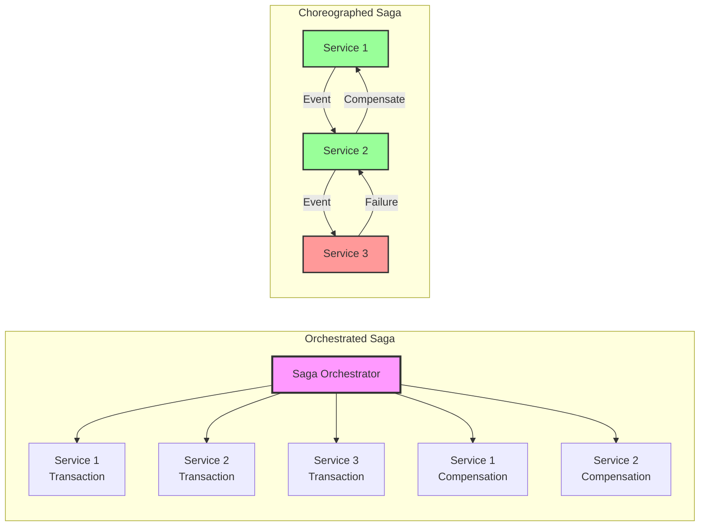

### Key Benefits

1. **Consistency**: Without distributed locks
2. **Autonomy**: Service-owned data
3. **Recovery**: Automatic compensation
4. **Long-Running**: Extended workflows

### Trade-offs

| Aspect | Gain | Cost |
|--------|------|------|
| Consistency | Eventual consistency | No immediate consistency |
| Complexity | Service independence | Compensation logic |
| Debugging | Clear transaction flow | Distributed tracing needed |
| Testing | Isolated service tests | Complex integration tests |

---

## Level 3: Deep Dive (20 minutes)

### Detailed Architecture

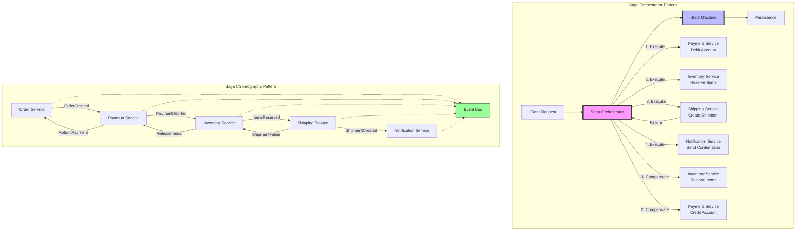

### Implementation Patterns

#### Saga Execution Flow

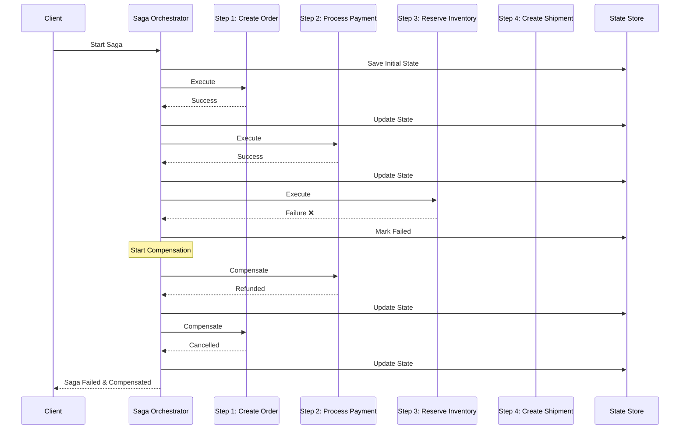

#### Core Components

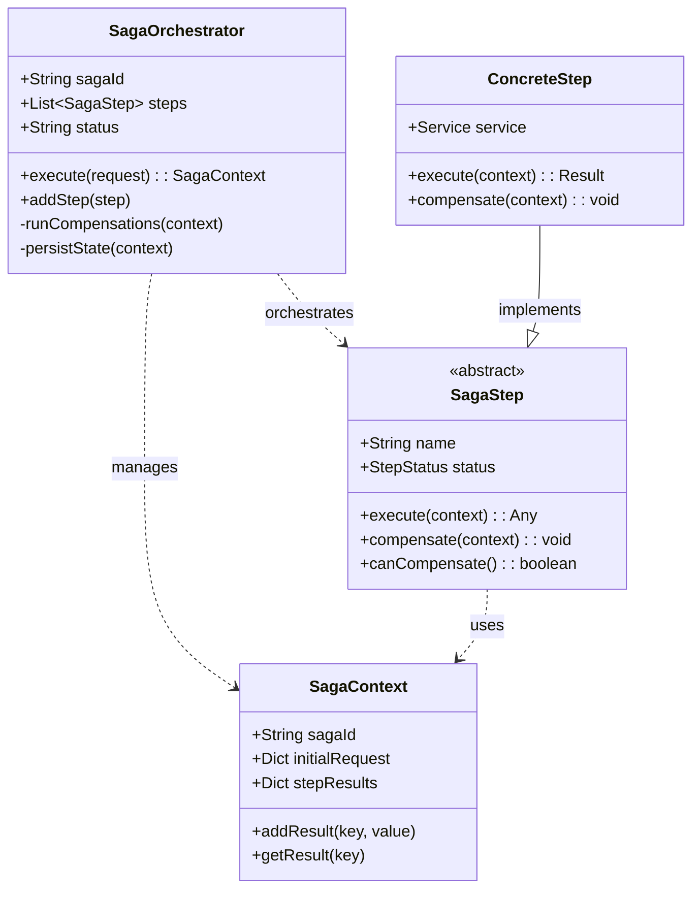

#### Step Status Transitions

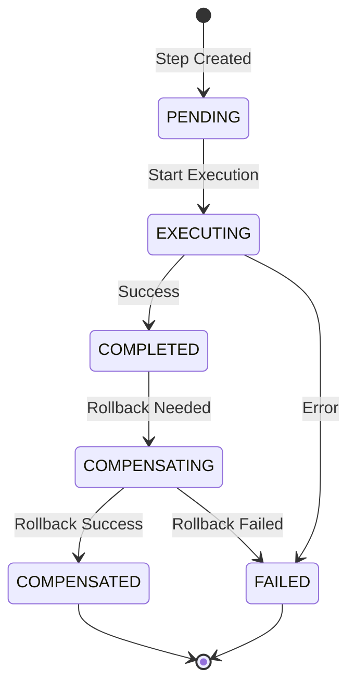

#### Example: E-commerce Order Saga

```python
# Concise example of saga step implementation
class ProcessPaymentStep(SagaStep):
    async def execute(self, context):
        payment = await self.payment_service.charge(
            amount=context.initial_request['amount'],
            idempotency_key=f"{context.saga_id}-payment"
        )
        context.step_results['payment_id'] = payment.id
        return payment.id
        
    async def compensate(self, context):
        if payment_id := context.step_results.get('payment_id'):
            await self.payment_service.refund(payment_id)
```

#### Saga Patterns Comparison

| Pattern | Coordination | State Management | Complexity | Use Case |
|---------|--------------|------------------|------------|-----------|
| **Orchestration** | Central coordinator | Orchestrator manages | Medium | Clear workflows |
| **Choreography** | Event-driven | Distributed | High | Loosely coupled |
| **Hybrid** | Mixed approach | Both patterns | Very High | Complex systems |

#### Production Architecture

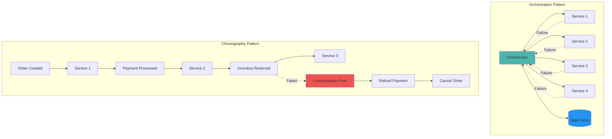

#### Saga State Persistence

```sql
-- Saga state table for recovery
CREATE TABLE sagas (
    id UUID PRIMARY KEY,
    status VARCHAR(50) NOT NULL,
    state JSONB NOT NULL,
    created_at TIMESTAMP NOT NULL,
    updated_at TIMESTAMP NOT NULL,
    completed_at TIMESTAMP,
    INDEX idx_status (status),
    INDEX idx_updated_at (updated_at)
);

-- Saga step history for audit
CREATE TABLE saga_steps (
    saga_id UUID NOT NULL,
    step_name VARCHAR(100) NOT NULL,
    status VARCHAR(50) NOT NULL,
    started_at TIMESTAMP NOT NULL,
    completed_at TIMESTAMP,
    error_message TEXT,
    compensation_at TIMESTAMP,
    PRIMARY KEY (saga_id, step_name),
    FOREIGN KEY (saga_id) REFERENCES sagas(id)
);
```

#### Event-Driven Choreography Flow

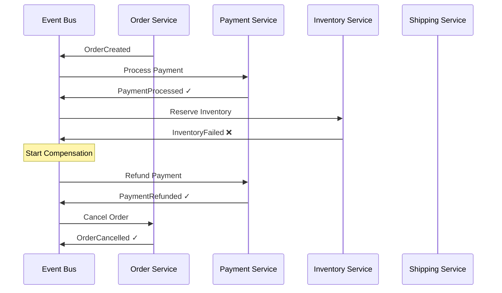

#### Monitoring & Recovery

| Component | Purpose | Implementation |
|-----------|---------|----------------|
| **State Persistence** | Crash recovery | Save state after each step |
| **Timeout Detection** | Handle stuck sagas | Background monitor with configurable timeout |
| **Distributed Lock** | Prevent duplicate processing | Redis/Zookeeper with TTL |
| **Idempotency** | Safe retries | Unique keys per operation |
| **Event Ordering** | Consistent flow | Message queue with ordering guarantees |

```python
# Example: Idempotent payment processing
class PaymentService:
    async def charge(self, amount, idempotency_key):
        # Check if already processed
        existing = await self.db.get_payment(idempotency_key)
        if existing:
            return existing
            
        # Process payment
        payment = await self._process_payment(amount)
        await self.db.save_payment(idempotency_key, payment)
        return payment
```

### State Management

Sagas manage state through explicit state machines:

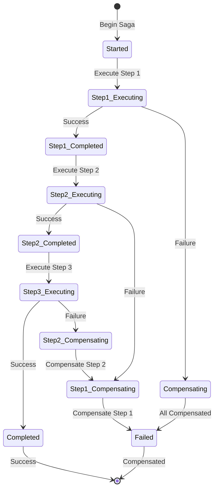

### Common Variations

1. **Orchestrated**: Complex workflows → Central failure point, easier debug
2. **Choreographed**: Loose coupling → No central point, harder monitoring
3. **Hybrid**: Mixed approach → Flexible but complex

### Integration Points

- **Event Sourcing**: Saga events in stream
- **CQRS**: Commands via saga, queries from read side
- **Outbox**: Reliable event publishing
- **Circuit Breaker**: Protect saga steps

---

## Level 4: Expert Practitioner (30 minutes)

### Advanced Techniques

#### Saga Composition

```python
class CompositeSaga:
    """Compose sagas from smaller sagas"""
    
    def __init__(self):
        self.sub_sagas: List[SagaOrchestrator] = []
        
    def add_sub_saga(self, saga: SagaOrchestrator):
        self.sub_sagas.append(saga)
        return self
        
    async def execute(self, context: Dict[str, Any]):
        """Execute sub-sagas with proper isolation"""
        completed_sagas = []
        
        try:
            for sub_saga in self.sub_sagas:
                # Each sub-saga gets its own context
                sub_context = self._create_sub_context(context, sub_saga)
                
                result = await sub_saga.execute(sub_context)
                completed_sagas.append((sub_saga, result))
                
                # Update parent context
                self._merge_results(context, result)
                
        except Exception as e:
            # Compensate completed sub-sagas
            for saga, result in reversed(completed_sagas):
                await saga._run_compensations(result)
            raise

# Parallel Saga Execution
class ParallelSagaOrchestrator(SagaOrchestrator):
    """Execute independent saga steps in parallel"""
    
    def __init__(self, saga_id: Optional[str] = None):
        super().__init__(saga_id)
        self.parallel_groups: List[List[SagaStep]] = []
        
    def add_parallel_group(self, steps: List[SagaStep]):
        """Add steps that can execute in parallel"""
        self.parallel_groups.append(steps)
        return self
        
    async def execute(self, initial_request: Dict[str, Any]) -> SagaContext:
        """Execute with parallel step groups"""
        context = SagaContext(
            saga_id=self.saga_id,
            initial_request=initial_request
        )
        
        try:
            for group in self.parallel_groups:
                # Execute steps in parallel
                tasks = [
                    self._execute_step(step, context) 
                    for step in group
                ]
                
                results = await asyncio.gather(*tasks)
                
                # All succeeded, mark as completed
                self.completed_steps.extend(group)
                
        except Exception as e:
            # Compensate in parallel too
            await self._run_parallel_compensations(context)
            raise
```

#### Saga Testing Framework

```python
class SagaTestFramework:
    """Comprehensive testing for sagas"""
    
    def __init__(self):
        self.mocked_services = {}
        self.execution_log = []
        
    async def test_happy_path(self, saga: SagaOrchestrator):
        """Test successful execution"""
        # Mock all services to succeed
        self._setup_success_mocks()
        
        context = await saga.execute(self._get_test_request())
        
        # Verify all steps executed
        assert all(
            step.status == StepStatus.COMPLETED 
            for step in saga.steps
        )
        
        return context
        
    async def test_compensation_at_step(self, 
                                       saga: SagaOrchestrator,
                                       failing_step: int):
        """Test compensation when specific step fails"""
        # Setup mocks
        for i, step in enumerate(saga.steps):
            if i < failing_step:
                self._mock_step_success(step)
            elif i == failing_step:
                self._mock_step_failure(step)
                
        # Execute and expect failure
        with pytest.raises(SagaFailedException):
            await saga.execute(self._get_test_request())
            
        # Verify compensations
        for i in range(failing_step):
            step = saga.steps[i]
            assert step.status == StepStatus.COMPENSATED
            
    async def test_idempotency(self, saga: SagaOrchestrator):
        """Test saga can be safely retried"""
        request = self._get_test_request()
        
        # First execution
        context1 = await saga.execute(request)
        
        # Retry with same request
        saga2 = self._rebuild_saga()
        context2 = await saga2.execute(request)
        
        # Results should be identical
        assert context1.step_results == context2.step_results
```

### Performance Optimization

<div class="decision-box">
<h4>🎯 Performance Tuning Checklist</h4>

- [ ] **Parallel Execution**: Run independent steps concurrently
- [ ] **Async I/O**: Use async/await throughout
- [ ] **Connection Pooling**: Reuse database connections
- [ ] **Batch Operations**: Group related operations
- [ ] **Caching**: Cache read-only data during saga
- [ ] **Timeout Tuning**: Set appropriate step timeouts
- [ ] **Circuit Breakers**: Fail fast on unavailable services
- [ ] **Monitoring**: Track saga execution times
</div>

### Monitoring & Observability

Key metrics to track:

```yaml
metrics:
  # Saga Execution Metrics
  - name: saga_duration
    description: Total saga execution time
    alert_threshold: p99 > 30s
    
  - name: saga_success_rate
    description: Percentage of successful sagas
    alert_threshold: < 95%
    
  - name: compensation_rate
    description: Percentage of sagas requiring compensation
    alert_threshold: > 10%
    
  # Step Metrics
  - name: step_duration
    description: Individual step execution time
    alert_threshold: p99 > 5s
    
  - name: step_failure_rate
    description: Step failure rate by type
    alert_threshold: > 5%
    
  # Compensation Metrics
  - name: compensation_success_rate
    description: Successful compensation percentage
    alert_threshold: < 99%
    
  - name: stuck_sagas
    description: Sagas not progressing
    alert_threshold: > 10
    
  # Resource Metrics
  - name: concurrent_sagas
    description: Number of active sagas
    alert_threshold: > 1000
```

### Common Pitfalls

<div class="failure-vignette">
<h4>⚠️ Pitfall: Non-Idempotent Steps</h4>
Network retries → Multiple charges, double inventory decrements.

**Solution**: Idempotent steps with keys and duplicate checks.
</div>

<div class="failure-vignette">
<h4>⚠️ Pitfall: Missing Compensation Logic</h4>
No compensation → Inconsistent state → Manual fixes.

**Solution**: Every forward transaction needs compensation. Test all paths.
</div>

### Production Checklist

- [ ] **Idempotency** implemented for all steps
- [ ] **Compensation logic** for every forward transaction
- [ ] **Timeout handling** for long-running steps
- [ ] **State persistence** for crash recovery
- [ ] **Monitoring** for saga execution and compensation
- [ ] **Testing** of all failure scenarios
- [ ] **Documentation** of saga flows and compensations
- [ ] **Alerting** for stuck or failed sagas

---

## Level 5: Mastery (45 minutes)

### Case Study: Uber's Trip Booking Saga

<div class="truth-box">
<h4>🏢 Real-World Implementation</h4>

**Company**: Uber  
**Scale**: 25M+ trips/day, 100+ services, sub-second response, 99.99% consistency

**Challenge**: Coordinate driver matching, fare, payment, tracking with graceful failures.

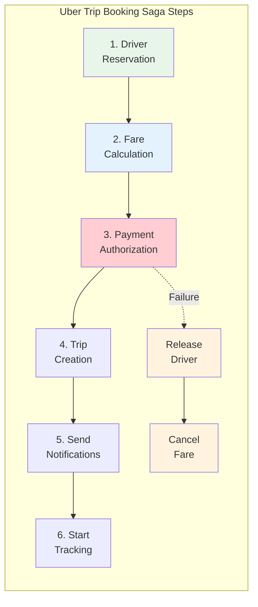

**Architecture**:

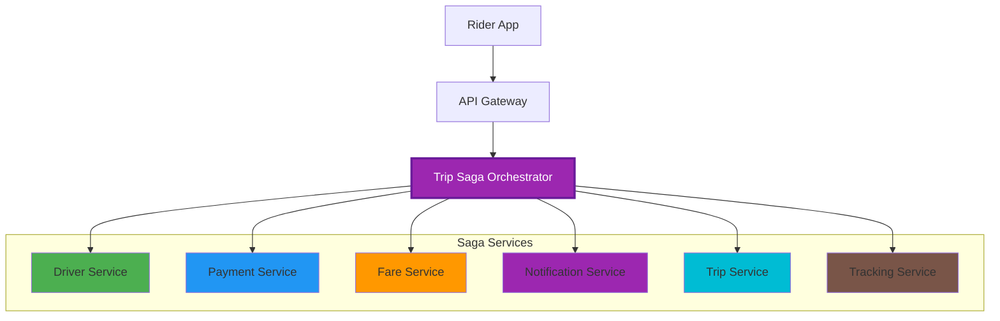

**Architecture Decisions**:

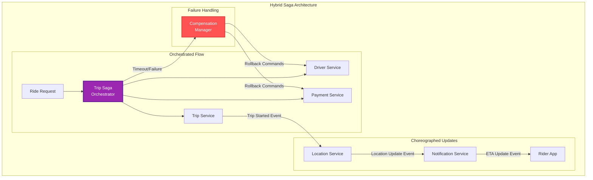

1. **Hybrid Approach**: Orchestration for trip creation (consistency critical), choreography for real-time updates (scalability critical)
2. **Optimistic Locking**: Reserve driver optimistically, compensate if needed (reduces latency)
3. **Partial Completion**: Non-critical steps (notifications) can fail without full rollback
4. **Geographic Sharding**: Each region runs independent saga orchestrators

**Results**: <500ms latency, 99.7% success, 2.3% compensations, zero inconsistencies

**Lessons**:
1. Design for partial failure
2. Compensation isn't always reverse
3. Monitor compensation paths
4. Saga observability crucial
</div>

### Economic Analysis

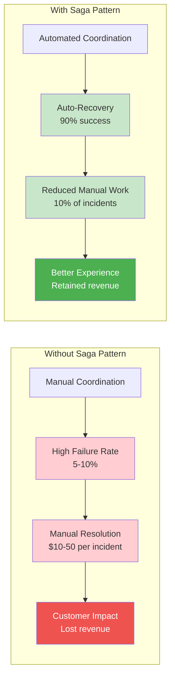

#### Cost Model

```python
def calculate_saga_roi(
    transactions_per_day: int,
    services_involved: int,
    failure_rate: float,
    manual_resolution_cost: float
) -> dict:
    """Calculate ROI for implementing Saga pattern"""
    
    # Cost without saga (distributed transactions or manual)
    distributed_tx_overhead = 0.5  # 50% performance overhead
    manual_resolutions = transactions_per_day * failure_rate
    
    without_saga_costs = {
        'performance_cost': transactions_per_day * 0.001 * distributed_tx_overhead,
        'manual_resolution': manual_resolutions * manual_resolution_cost,
        'downtime_cost': failure_rate * 10000,  # Downtime impact
        'development_complexity': services_involved * 5000
    }
    
    # Cost with saga
    saga_compensation_rate = failure_rate * 0.1  # 90% auto-recovery
    
    with_saga_costs = {
        'implementation': services_involved * 8000,
        'saga_overhead': transactions_per_day * 0.0001,
        'compensation_cost': transactions_per_day * saga_compensation_rate * 0.1,
        'monitoring': 2000  # Monthly monitoring cost
    }
    
    # Benefits
    monthly_savings = (
        sum(without_saga_costs.values()) - 
        sum(with_saga_costs.values())
    )
    
    return {
        'monthly_savings': monthly_savings,
        'payback_months': with_saga_costs['implementation'] / monthly_savings,
        'reliability_improvement': (1 - saga_compensation_rate) * 100,
        'recommended': services_involved >= 3 and failure_rate > 0.01
    }

# Example calculation
roi = calculate_saga_roi(
    transactions_per_day=100_000,
    services_involved=5,
    failure_rate=0.05,  # 5% failure rate
    manual_resolution_cost=10  # $10 per manual fix
)
print(f"ROI: ${roi['monthly_savings']:,.0f}/month, "
      f"Payback: {roi['payback_months']:.1f} months")
```

#### When It Pays Off

- **Break-even**: 3+ services, 1%+ failure rate
- **High ROI**: E-commerce checkout, financial transactions, bookings, fulfillment
- **Low ROI**: Simple CRUD, read-only, single service

### Pattern Evolution

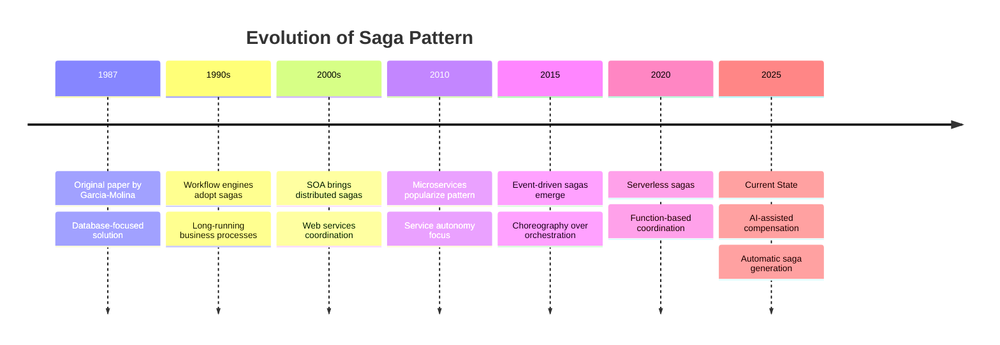

### Law Connections

<div class="law-box">
<h4>🔗 Fundamental Laws</h4>

This pattern directly addresses:

1. **[Law 4 (Multidimensional Optimization ⚖️)](../part1-axioms/law4-tradeoffs/index.md)**: Manages distributed consensus without locks
2. **[Law 1 (Correlated Failure ⛓️)](../part1-axioms/law1-failure/index.md)**: Explicit handling of partial failures
3. **[Law 3 (Emergent Chaos 🌪️)](../part1-axioms/law3-emergence/index.md)**: Handles concurrent saga executions
4. **[Law 5 (Distributed Knowledge 🧠)](../part1-axioms/law5-epistemology/index.md)**: Full audit trail of all steps
5. **[Law 7 (Economic Reality 💰)](../part1-axioms/law7-economics/index.md)**: Balances consistency costs with business needs
</div>

### Future Directions

**Emerging Trends**:

1. **ML-Driven Compensation**: AI determines optimal compensation strategy
2. **Predictive Saga Routing**: ML predicts likely failures and adjusts flow
3. **Blockchain Sagas**: Immutable saga execution logs
4. **Edge Sagas**: Distributed saga execution at edge locations

**What's Next**:
- Automatic saga generation from business requirements
- Self-healing sagas that adapt to failures
- Cross-cloud saga orchestration
- Real-time saga optimization based on conditions

---

## Quick Reference

### Decision Matrix

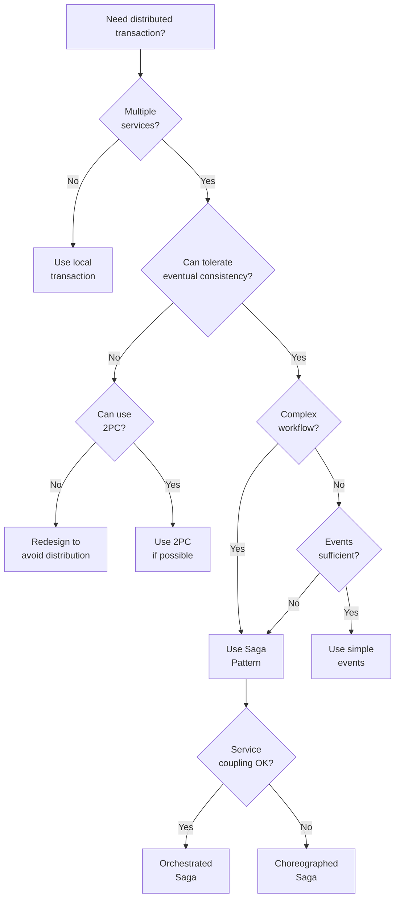

### Command Cheat Sheet

```bash
# Saga Management
saga start <type> <request>          # Start new saga
saga status <saga-id>                # Check saga status
saga retry <saga-id>                 # Retry failed saga
saga compensate <saga-id>            # Force compensation

# Monitoring
saga list --status=running           # List active sagas
saga list --stuck --timeout=30m      # Find stuck sagas
saga metrics --period=1h             # Saga metrics

# Testing
saga test <definition> --happy-path  # Test success path
saga test <definition> --fail-at=3   # Test failure at step 3
saga test <definition> --chaos       # Random failure testing

# Debugging
saga trace <saga-id>                 # Show execution trace
saga events <saga-id>                # List all events
saga replay <saga-id>                # Replay saga execution
```

### Configuration Template

```yaml
# Production Saga configuration
saga:
  orchestrator:
    type: "centralized"  # or distributed
    persistence: "postgresql"
    state_timeout: 30m
    
  execution:
    max_retries: 3
    retry_delay: "exponential"
    parallel_steps: true
    max_concurrent: 100
    
  compensation:
    strategy: "immediate"  # or batched
    timeout: 5m
    max_attempts: 3
    
  monitoring:
    trace_sampling: 0.1
    metrics_interval: 10s
    stuck_check_interval: 1m
    
  steps:
    default_timeout: 30s
    circuit_breaker:
      enabled: true
      failure_threshold: 5
      timeout: 30s
      
  events:
    bus: "kafka"  # or rabbitmq, redis
    retention: 7d
    compression: true
    
  recovery:
    enabled: true
    checkpoint_interval: "after_each_step"
    recovery_workers: 5
```

---

## Related Resources

### Patterns
- [Event Sourcing](../patterns/event-sourcing.md) - Natural event log for sagas
- [CQRS](../patterns/cqrs.md) - Separate saga execution from queries
- [Outbox Pattern](../patterns/outbox.md) - Reliable event publishing
- [Circuit Breaker](../patterns/circuit-breaker.md) - Protect saga steps

### Laws
- [Law 4 (Multidimensional Optimization ⚖️)](../part1-axioms/law4-tradeoffs/index.md) - Why distributed consensus is hard
- [Law 1 (Correlated Failure ⛓️)](../part1-axioms/law1-failure/index.md) - Handling partial failures
- [Law 3 (Emergent Chaos 🌪️)](../part1-axioms/law3-emergence/index.md) - Managing parallel execution

### Further Reading
- [Original Sagas Paper (1987)](https://www.cs.cornell.edu/andru/cs711/2002fa/reading/sagas.pdf) - Garcia-Molina & Salem
- [Microservices.io Saga Pattern](https://microservices.io/patterns/data/saga.html) - Chris Richardson
- [Saga Orchestration vs Choreography](https://blog.couchbase.com/saga-pattern-implement-business-transactions-using-microservices/) - Comparison
- [Building Sagas with AWS Step Functions](https://aws.amazon.com/step-functions/use-cases/#saga) - Serverless sagas

### Tools & Libraries
- **Java**: Axon Framework, Eventuate Tram
- **C#/.NET**: MassTransit, NServiceBus
- **Python**: Faust, Celery with Saga support
- **Node.js**: Moleculer, Node-Saga
- **Go**: Temporal, Cadence
- **Orchestrators**: AWS Step Functions, Azure Durable Functions, Camunda

---

<div class="navigation-links">
<div class="prev-link">
<a href="/patterns/event-sourcing">← Previous: Event Sourcing</a>
</div>
<div class="next-link">
<a href="/patterns/service-mesh">Next: Service Mesh →</a>
</div>
</div>