# Saga Pattern

!!! success "🏆 Gold Standard Pattern"
    **Distributed Transaction Management** • Uber, Airbnb, Booking.com proven
    
    Saga pattern is the de facto solution for managing distributed transactions across microservices. It enables business processes to span multiple services while maintaining consistency through compensations.
    
    **Key Success Metrics:**
    - Uber: 20M+ daily distributed transactions
    - Airbnb: 2M+ bookings coordinated daily
    - Booking.com: 1.5M+ room nights processed

[Home](/) > [Patterns](../patterns/) > [Core Patterns](../patterns/index.md#core-patterns) > Saga

## The Essential Question

**How can we maintain data consistency across multiple services when ACID transactions can't span service boundaries?**

!!! abstract "Pattern Overview"
    **Problem**: Distributed transactions across microservices (no 2PC)  
    **Solution**: Chain of local transactions with compensating actions  
    **Trade-offs**: Eventual consistency for scalability, complexity for reliability  
    **Used by**: Uber (trip bookings), Amazon (order processing), Booking.com (reservations)

---

## Level 1: Intuition (5 minutes)

### The Story

<div class="axiom-box">
<h4>🔬 Law 2: Asynchronous Reality</h4>

Sagas embrace the asynchronous nature of distributed systems. Unlike ACID transactions that try to create a synchronous illusion, sagas accept that operations happen at different times across different services.

**Key Insight**: You can't have atomic commits across network boundaries. The best you can do is coordinate eventual consistency through compensations.
</div>

Vacation booking requires: flight, hotel, car, payment. Traditional agents handled all at once - fail anywhere, cancel everything.

But with separate companies per booking, you can't "rollback" United when Hertz fails. You must explicitly cancel each success.

Saga pattern: sequence of local transactions with compensating actions.

### The $45M Problem That Created Sagas

!!! failure "Expedia's 2012 Nightmare"
    **What Happened**: Payment processed but hotel booking failed  
    **Impact**: 120,000 customers charged without reservations  
    **Recovery**: 6 weeks of manual reconciliation  
    **Cost**: $45M in refunds, credits, and reputation damage  
    **Root Cause**: No distributed transaction coordination

### Visual Comparison: ACID vs Saga

```mermaid
graph LR
    subgraph "ACID Transaction (Can't Scale)"
        A[BEGIN] --> B[Book Flight]
        B --> C[Book Hotel]
        C --> D[Book Car]
        D --> E[Charge Card]
        E --> F[COMMIT/ROLLBACK]
        
        style A fill:#4CAF50
        style F fill:#4CAF50
    end
    
    subgraph "Saga Pattern (Scales Infinitely)"
        S1[Book Flight ✓] -->|Success| S2[Book Hotel ✓]
        S2 -->|Success| S3[Book Car ✗]
        S3 -->|Failure| C1[Cancel Hotel]
        C1 -->|Compensate| C2[Cancel Flight]
        
        style S1 fill:#81C784
        style S2 fill:#81C784
        style S3 fill:#EF5350
        style C1 fill:#FFB74D
        style C2 fill:#FFB74D
    end
```



### In One Sentence

**Saga Pattern**: Distributed transactions as local transaction sequences with compensating actions.

### Real-World Parallel

Like reversible dominoes - knock them down in sequence, but can stand them back up in reverse if needed.

---

## Level 2: Foundation (10 minutes)

### The Problem Space

### Production Failure Modes & Solutions

| Failure Type | Without Saga | With Saga | Real Example |
|--------------|--------------|-----------|---------------|
| **Partial Failure** | Inconsistent state | Automatic compensation | Uber: Trip cancelled mid-booking |
| **Timeout** | Hung transactions | Progress tracking | Amazon: Payment timeout handled |
| **Crash** | Lost transaction | State persistence | Netflix: Billing recovery |
| **Network Partition** | Split brain | Idempotent steps | Booking.com: Multi-region saga |

### Core Concept

Saga pattern essentials:

1. **Local Transactions**: Each service's ACID transaction
2. **Compensating Transactions**: Undo operations
3. **Coordination**: Orchestrated or choreographed
4. **Eventually Consistent**: Via saga completion
5. **Failure Recovery**: Reverse compensations

### Basic Architecture


### Key Benefits

1. **Consistency**: Without distributed locks
2. **Autonomy**: Service-owned data
3. **Recovery**: Automatic compensation
4. **Long-Running**: Extended workflows

### Critical Trade-off Analysis

| Aspect | Traditional 2PC | Saga Pattern | Production Impact |
|--------|----------------|--------------|-------------------|
| **Consistency** | Strong (ACID) | Eventual | Users may see temporary inconsistencies |
| **Availability** | Low (blocking) | High (non-blocking) | 99.99% vs 99.9% uptime |
| **Latency** | High (2N RTT) | Low (N RTT) | 500ms vs 100ms P99 |
| **Scalability** | Limited (~10 nodes) | Unlimited | 100 TPS vs 100K TPS |
| **Failure Recovery** | Automatic rollback | Manual compensation | More code but more control |


---

## Level 3: Deep Dive (20 minutes)

### Detailed Architecture


### Implementation Patterns

<div class="decision-box">
<h4>🎯 Orchestration vs Choreography Decision</h4>

**Choose Orchestration When:**
- Central visibility required
- Complex conditional logic
- Need to monitor/debug easily
- Few services involved (<10)
- Clear business process owner

**Choose Choreography When:**
- Services are autonomous
- Simple linear flows
- High scalability needed
- Many services (>10)
- Decoupled architecture priority

**Hybrid Approach:**
- Use orchestration for critical business flows
- Use choreography for notifications/analytics
- Start with orchestration, evolve to choreography
- Consider team boundaries and ownership
</div>

#### Saga Execution Flow


#### Core Components

<div class="truth-box">
<h4>💡 The Saga Compensation Truth</h4>

Not all operations can be perfectly compensated. There are three types of transactions in sagas:

1. **Compensatable**: Can be undone (e.g., reserve inventory → release inventory)
2. **Pivot**: The go/no-go decision point (e.g., payment authorization)
3. **Retriable**: Must eventually succeed (e.g., send email notification)

**Key Insight**: Design your saga so the pivot transaction comes after all compensatable transactions but before any retriable ones. This minimizes the compensation complexity.
</div>


#### Step Status Transitions


#### Example: E-commerce Order Saga

=== "Step Implementation"

    ```python
    # Saga step implementation
    class ProcessPaymentStep(SagaStep):
        async def execute(self, context):
            payment = await self.payment_service.charge(
                amount=context.initial_request['amount'],
                idempotency_key=f"{context.saga_id}-payment"
            )
            context.step_results['payment_id'] = payment.id
            return payment.id
        
        async def compensate(self, context):
            if payment_id := context.step_results.get('payment_id'):
                await self.payment_service.refund(payment_id)
    ```

=== "Full Saga Flow"

    ```python
    class OrderSagaOrchestrator:
        def __init__(self):
            self.steps = [
                ValidateOrderStep(),
                ProcessPaymentStep(),
                ReserveInventoryStep(),
                CreateShipmentStep(),
                SendNotificationStep()
            ]
            
        async def execute_order(self, order_request):
            context = SagaContext(saga_id=generate_id())
            completed_steps = []
            
            try:
                for step in self.steps:
                    result = await step.execute(context)
                    completed_steps.append(step)
                    context.add_result(step.name, result)
                    
                return OrderResult.success(context.saga_id)
                
            except Exception as e:
                # Compensate in reverse order
                for step in reversed(completed_steps):
                    try:
                        await step.compensate(context)
                    except Exception as comp_err:
                        logger.error(f"Compensation failed: {comp_err}")
                        
                return OrderResult.failure(str(e))
    ```

=== "Event-Driven Version"

    ```python
    @dataclass
    class OrderSagaEvents:
        OrderValidated = "order.validated"
        PaymentProcessed = "payment.processed"
        PaymentFailed = "payment.failed"
        InventoryReserved = "inventory.reserved"
        InventoryFailed = "inventory.failed"
        
    class OrderSagaHandler:
        def __init__(self, event_bus):
            self.event_bus = event_bus
            self.register_handlers()
            
        def register_handlers(self):
            self.event_bus.on(OrderSagaEvents.OrderValidated, 
                             self.handle_order_validated)
            self.event_bus.on(OrderSagaEvents.PaymentFailed,
                             self.handle_payment_failed)
            # ... more handlers
            
        async def handle_order_validated(self, event):
            # Trigger payment processing
            await self.event_bus.emit("payment.process", {
                "saga_id": event.saga_id,
                "amount": event.order_total
            })
            
        async def handle_payment_failed(self, event):
            # Start compensation flow
            await self.event_bus.emit("order.cancel", {
                "saga_id": event.saga_id,
                "reason": "payment_failed"
            })
    ```

#### Saga Patterns Comparison

=== "Orchestration Pattern"

    ```mermaid
    graph TB
        subgraph "Orchestration Pattern"
            O[Saga Orchestrator] --> S1[Order Service]
            O --> S2[Payment Service]
            O --> S3[Inventory Service]
            O --> S4[Shipping Service]
            
            S1 -.->|Response| O
            S2 -.->|Response| O
            S3 -.->|Response| O
            S4 -.->|Response| O
        end
        
        style O fill:#9c27b0,stroke:#6a1b9a,stroke-width:3px
    ```
    
    **Characteristics**:
    - Central coordinator manages workflow
    - Orchestrator tracks saga state
    - Direct command/response pattern
    - Easier to understand and debug
    
    **When to Use**:
    - Well-defined business processes
    - Need for centralized monitoring
    - Complex compensations
    - Teams new to distributed systems

=== "Choreography Pattern"

    ```mermaid
    graph LR
        subgraph "Choreography Pattern"
            OS[Order Service] -->|OrderCreated| EB[Event Bus]
            EB -->|OrderCreated| PS[Payment Service]
            PS -->|PaymentProcessed| EB
            EB -->|PaymentProcessed| IS[Inventory Service]
            IS -->|ItemsReserved| EB
            EB -->|ItemsReserved| SS[Shipping Service]
        end
        
        style EB fill:#4caf50,stroke:#2e7d32,stroke-width:3px
    ```
    
    **Characteristics**:
    - Services communicate via events
    - No central coordinator
    - Each service manages its state
    - More resilient to failures
    
    **When to Use**:
    - Loosely coupled services
    - High scalability requirements
    - Independent service teams
    - Event-driven architecture

=== "Hybrid Pattern"

    ```mermaid
    graph TB
        subgraph "Hybrid Pattern"
            subgraph "Orchestrated Core"
                O[Order Orchestrator] --> OS[Order Service]
                O --> PS[Payment Service]
            end
            
            subgraph "Choreographed Extensions"
                PS -->|PaymentComplete| EB[Event Bus]
                EB --> NS[Notification Service]
                EB --> AS[Analytics Service]
                EB --> LS[Loyalty Service]
            end
        end
        
        style O fill:#9c27b0
        style EB fill:#4caf50
    ```
    
    **Characteristics**:
    - Critical path orchestrated
    - Optional services choreographed
    - Balance of control and flexibility
    - Complex but powerful
    
    **When to Use**:
    - Mixed criticality requirements
    - Evolving system architecture
    - Multiple team structures
    - Gradual migration scenarios


#### Production Architecture


### Production Implementation: Uber's Trip Booking Saga

!!! success "Uber's Scale"
    **Transactions**: 15M+ trips/day  
    **Services Involved**: 8-12 per trip  
    **Saga Duration**: 30s - 5min  
    **Compensation Rate**: 3-5% of trips

#### State Persistence Strategy

```sql
-- Actual schema from Uber's saga implementation
CREATE TABLE trip_sagas (
    saga_id UUID PRIMARY KEY,
    trip_id UUID NOT NULL,
    status VARCHAR(50) NOT NULL, -- RUNNING, COMPLETED, COMPENSATING, FAILED
    current_step INTEGER NOT NULL,
    saga_data JSONB NOT NULL, -- Entire saga context
    created_at TIMESTAMP DEFAULT NOW(),
    updated_at TIMESTAMP DEFAULT NOW(),
    expires_at TIMESTAMP NOT NULL, -- Timeout handling
    
    -- Performance indexes
    INDEX idx_status_expires (status, expires_at) WHERE status = 'RUNNING',
    INDEX idx_trip_id (trip_id)
);

-- Step execution log for recovery and debugging
CREATE TABLE saga_execution_log (
    id BIGSERIAL PRIMARY KEY,
    saga_id UUID NOT NULL,
    step_name VARCHAR(100) NOT NULL,
    service_name VARCHAR(100) NOT NULL,
    status VARCHAR(50) NOT NULL,
    request_payload JSONB,
    response_payload JSONB,
    error_details JSONB,
    idempotency_key VARCHAR(255) UNIQUE,
    started_at TIMESTAMP DEFAULT NOW(),
    completed_at TIMESTAMP,
    
    FOREIGN KEY (saga_id) REFERENCES trip_sagas(saga_id)
);
```

#### Event-Driven Choreography Flow


#### Critical Production Components

| Component | Why It's Critical | Production Implementation | Failure Impact |
|-----------|-------------------|---------------------------|----------------|
| **State Persistence** | Survives crashes/restarts | Write-through to Cassandra with 3x replication | Lost transactions |
| **Timeout Manager** | Prevents zombie sagas | Distributed timer wheel, 30s default timeout | Hung bookings |
| **Idempotency** | Prevents double charges | UUID + step hash, 24hr cache | Double billing |
| **Compensation Queue** | Reliable rollback | Priority queue, exponential backoff | Inconsistent state |
| **Monitoring** | Early failure detection | Real-time dashboard, P99 < 100ms alerts | Customer impact |


#### Production Code: Idempotent Operations

```python
class IdempotentPaymentService:
    """
    Production pattern from Stripe's implementation
    Handles 100M+ payments/day with exactly-once guarantee
    """
    
    async def charge(self, request: PaymentRequest) -> PaymentResult:
        # Generate deterministic idempotency key
        idempotency_key = f"{request.trip_id}:{request.step}:{request.amount}"
        
        # Check cache first (Redis, 100ms timeout)
        cached = await self.cache.get(idempotency_key)
        if cached:
            return PaymentResult.from_cache(cached)
        
        # Check persistent store (Cassandra)
        existing = await self.db.get_payment(idempotency_key)
        if existing:
            # Update cache for next time
            await self.cache.set(idempotency_key, existing, ttl=3600)
            return PaymentResult.from_db(existing)
        
        # Acquire distributed lock to prevent race conditions
        lock = await self.lock_manager.acquire(
            key=f"payment_lock:{idempotency_key}",
            ttl=30  # seconds
        )
        
        if not lock:
            # Another instance is processing
            await asyncio.sleep(0.1)
            return await self.charge(request)  # Retry
        
        try:
            # Process payment with external provider
            result = await self._process_with_stripe(request)
            
            # Store result atomically
            await self.db.save_payment(idempotency_key, result)
            await self.cache.set(idempotency_key, result, ttl=3600)
            
            return result
            
        finally:
            await lock.release()
```

### State Management

Sagas manage state through explicit state machines:


### Common Variations

=== "Simple Orchestration"

    ```python
    class SimpleSagaOrchestrator:
        def execute_order_saga(self, order):
            saga_id = generate_saga_id()
            
            try:
                # Linear execution with compensations
                payment = self.payment_service.charge(order.amount)
                self.saga_log.record(saga_id, 'payment', payment.id)
                
                inventory = self.inventory_service.reserve(order.items)
                self.saga_log.record(saga_id, 'inventory', inventory.id)
                
                shipment = self.shipping_service.create(order)
                self.saga_log.record(saga_id, 'shipment', shipment.id)
                
                return SagaResult.success(order.id)
                
            except Exception as e:
                # Compensate in reverse order
                self.compensate_saga(saga_id)
                return SagaResult.failure(str(e))
    ```
    
    **Pros**: Simple to implement, clear flow, easy debugging
    **Cons**: Single point of failure, scaling limitations

=== "Event Choreography"

    ```javascript
    // Event-driven saga implementation
    class OrderService {
        async handleCreateOrder(order) {
            // Create order and emit event
            const orderId = await this.repository.create(order);
            
            await this.eventBus.publish('OrderCreated', {
                orderId,
                amount: order.total,
                items: order.items,
                sagaId: generateSagaId()
            });
        }
        
        async handlePaymentFailed(event) {
            // React to failure event
            await this.repository.updateStatus(event.orderId, 'cancelled');
            
            await this.eventBus.publish('OrderCancelled', {
                orderId: event.orderId,
                reason: 'payment_failed'
            });
        }
    }
    ```
    
    **Pros**: Decoupled services, high scalability, resilient
    **Cons**: Complex monitoring, harder to understand flow

=== "Routing Slip Pattern"

    ```csharp
    // Routing slip carries its own execution plan
    public class RoutingSlip
    {
        public Guid Id { get; set; }
        public List<Activity> Activities { get; set; }
        public Dictionary<string, object> Variables { get; set; }
        public Stack<CompensationLog> CompensationLogs { get; set; }
        
        public async Task<RoutingSlipResult> Execute()
        {
            foreach (var activity in Activities)
            {
                try
                {
                    var result = await activity.Execute(Variables);
                    
                    // Log for compensation
                    CompensationLogs.Push(new CompensationLog
                    {
                        ActivityName = activity.Name,
                        CompensationData = result.CompensationData
                    });
                    
                    // Update variables
                    Variables.Merge(result.OutputVariables);
                }
                catch (Exception ex)
                {
                    // Execute compensations
                    await Compensate();
                    throw;
                }
            }
            
            return RoutingSlipResult.Completed(Variables);
        }
    }
    ```
    
    **Pros**: Self-contained execution, portable, flexible routing
    **Cons**: Complex state management, versioning challenges

### Integration Points

- **Event Sourcing**: Saga events in stream
- **CQRS**: Commands via saga, queries from read side
- **Outbox**: Reliable event publishing
- **Circuit Breaker**: Protect saga steps

---

## Level 4: Expert Practitioner (30 minutes)

### Advanced Techniques

#### Saga Composition

```python
class CompositeSaga:
 """Compose sagas from smaller sagas"""
 
 def __init__(self):
 self.sub_sagas: List[SagaOrchestrator] = []
 
 def add_sub_saga(self, saga: SagaOrchestrator):
 self.sub_sagas.append(saga)
 return self
 
 async def execute(self, context: Dict[str, Any]):
 """Execute sub-sagas with proper isolation"""
 completed_sagas = []
 
 try:
 for sub_saga in self.sub_sagas:
# Each sub-saga gets its own context
 sub_context = self._create_sub_context(context, sub_saga)
 
 result = await sub_saga.execute(sub_context)
 completed_sagas.append((sub_saga, result))
 
# Update parent context
 self._merge_results(context, result)
 
 except Exception as e:
# Compensate completed sub-sagas
 for saga, result in reversed(completed_sagas):
 await saga._run_compensations(result)
 raise

# Parallel Saga Execution
class ParallelSagaOrchestrator(SagaOrchestrator):
 """Execute independent saga steps in parallel"""
 
 def __init__(self, saga_id: Optional[str] = None):
 super().__init__(saga_id)
 self.parallel_groups: List[List[SagaStep]] = []
 
 def add_parallel_group(self, steps: List[SagaStep]):
 """Add steps that can execute in parallel"""
 self.parallel_groups.append(steps)
 return self
 
 async def execute(self, initial_request: Dict[str, Any]) -> SagaContext:
 """Execute with parallel step groups"""
 context = SagaContext(
 saga_id=self.saga_id,
 initial_request=initial_request
 )
 
 try:
 for group in self.parallel_groups:
# Execute steps in parallel
 tasks = [
 self._execute_step(step, context) 
 for step in group
 ]
 
 results = await asyncio.gather(*tasks)
 
# All succeeded, mark as completed
 self.completed_steps.extend(group)
 
 except Exception as e:
# Compensate in parallel too
 await self._run_parallel_compensations(context)
 raise
```

#### Saga Testing Framework

```python
class SagaTestFramework:
 """Comprehensive testing for sagas"""
 
 def __init__(self):
 self.mocked_services = {}
 self.execution_log = []
 
 async def test_happy_path(self, saga: SagaOrchestrator):
 """Test successful execution"""
# Mock all services to succeed
 self._setup_success_mocks()
 
 context = await saga.execute(self._get_test_request())
 
# Verify all steps executed
 assert all(
 step.status == StepStatus.COMPLETED 
 for step in saga.steps
 )
 
 return context
 
 async def test_compensation_at_step(self, 
 saga: SagaOrchestrator,
 failing_step: int):
 """Test compensation when specific step fails"""
# Setup mocks
 for i, step in enumerate(saga.steps):
 if i < failing_step:
 self._mock_step_success(step)
 elif i == failing_step:
 self._mock_step_failure(step)
 
# Execute and expect failure
 with pytest.raises(SagaFailedException):
 await saga.execute(self._get_test_request())
 
# Verify compensations
 for i in range(failing_step):
 step = saga.steps[i]
 assert step.status == StepStatus.COMPENSATED
 
 async def test_idempotency(self, saga: SagaOrchestrator):
 """Test saga can be safely retried"""
 request = self._get_test_request()
 
# First execution
 context1 = await saga.execute(request)
 
# Retry with same request
 saga2 = self._rebuild_saga()
 context2 = await saga2.execute(request)
 
# Results should be identical
 assert context1.step_results == context2.step_results
```

### Performance Optimization

!!! tip "🎯 Performance Tuning Checklist"
 
 - [ ] **Parallel Execution**: Run independent steps concurrently
 - [ ] **Async I/O**: Use async/await throughout
 - [ ] **Connection Pooling**: Reuse database connections
 - [ ] **Batch Operations**: Group related operations
 - [ ] **Caching**: Cache read-only data during saga
 - [ ] **Timeout Tuning**: Set appropriate step timeouts
 - [ ] **Circuit Breakers**: Fail fast on unavailable services
 - [ ] **Monitoring**: Track saga execution times

### Monitoring & Observability

Key metrics to track:

```yaml
metrics:
# Saga Execution Metrics
 - name: saga_duration
 description: Total saga execution time
 alert_threshold: p99 > 30s
 
 - name: saga_success_rate
 description: Percentage of successful sagas
 alert_threshold: < 95%
 
 - name: compensation_rate
 description: Percentage of sagas requiring compensation
 alert_threshold: > 10%
 
# Step Metrics
 - name: step_duration
 description: Individual step execution time
 alert_threshold: p99 > 5s
 
 - name: step_failure_rate
 description: Step failure rate by type
 alert_threshold: > 5%
 
# Compensation Metrics
 - name: compensation_success_rate
 description: Successful compensation percentage
 alert_threshold: < 99%
 
 - name: stuck_sagas
 description: Sagas not progressing
 alert_threshold: > 10
 
# Resource Metrics
 - name: concurrent_sagas
 description: Number of active sagas
 alert_threshold: > 1000
```

### Common Pitfalls

!!! warning "⚠️ Pitfall: Non-Idempotent Steps"
 Network retries → Multiple charges, double inventory decrements.
 
 **Solution**: Idempotent steps with keys and duplicate checks.

!!! warning "⚠️ Pitfall: Missing Compensation Logic"
 No compensation → Inconsistent state → Manual fixes.
 
 **Solution**: Every forward transaction needs compensation. Test all paths.

### Production Checklist

- [ ] **Idempotency** implemented for all steps
- [ ] **Compensation logic** for every forward transaction
- [ ] **Timeout handling** for long-running steps
- [ ] **State persistence** for crash recovery
- [ ] **Monitoring** for saga execution and compensation
- [ ] **Testing** of all failure scenarios
- [ ] **Documentation** of saga flows and compensations
- [ ] **Alerting** for stuck or failed sagas

---

## Level 5: Mastery (45 minutes)

### Case Study: Uber's Trip Booking Saga

!!! info "🏢 Real-World Implementation"
 **Company**: Uber 
 **Scale**: 25M+ trips/day, 100+ services, sub-second response, 99.99% consistency
 
 **Challenge**: Coordinate driver matching, fare, payment, tracking with graceful failures.


**Architecture**:


**Architecture Decisions**:


1. **Hybrid Approach**: Orchestration for trip creation (consistency critical), choreography for real-time updates (scalability critical)
2. **Optimistic Locking**: Reserve driver optimistically, compensate if needed (reduces latency)
3. **Partial Completion**: Non-critical steps (notifications) can fail without full rollback
4. **Geographic Sharding**: Each region runs independent saga orchestrators

 **Results**: <500ms latency, 99.7% success, 2.3% compensations, zero inconsistencies
 
 **Lessons**:
 
 1. Design for partial failure
 2. Compensation isn't always reverse
 3. Monitor compensation paths
 4. Saga observability crucial

### Economic Analysis


#### Cost Model

```python
def calculate_saga_roi(
 transactions_per_day: int,
 services_involved: int,
 failure_rate: float,
 manual_resolution_cost: float
) -> dict:
 """Calculate ROI for implementing Saga pattern"""
 
# Cost without saga (distributed transactions or manual)
 distributed_tx_overhead = 0.5 # 50% performance overhead
 manual_resolutions = transactions_per_day * failure_rate
 
 without_saga_costs = {
 'performance_cost': transactions_per_day * 0.001 * distributed_tx_overhead,
 'manual_resolution': manual_resolutions * manual_resolution_cost,
 'downtime_cost': failure_rate * 10000, # Downtime impact
 'development_complexity': services_involved * 5000
 }
 
# Cost with saga
 saga_compensation_rate = failure_rate * 0.1 # 90% auto-recovery
 
 with_saga_costs = {
 'implementation': services_involved * 8000,
 'saga_overhead': transactions_per_day * 0.0001,
 'compensation_cost': transactions_per_day * saga_compensation_rate * 0.1,
 'monitoring': 2000 # Monthly monitoring cost
 }
 
# Benefits
 monthly_savings = (
 sum(without_saga_costs.values()) - 
 sum(with_saga_costs.values())
 )
 
 return {
 'monthly_savings': monthly_savings,
 'payback_months': with_saga_costs['implementation'] / monthly_savings,
 'reliability_improvement': (1 - saga_compensation_rate) * 100,
 'recommended': services_involved >= 3 and failure_rate > 0.01
 }

# Example calculation
roi = calculate_saga_roi(
 transactions_per_day=100_000,
 services_involved=5,
 failure_rate=0.05, # 5% failure rate
 manual_resolution_cost=10 # $10 per manual fix
)
print(f"ROI: ${roi['monthly_savings']:,.0f}/month, "
 f"Payback: {roi['payback_months']:.1f} months")
```

#### When It Pays Off

- **Break-even**: 3+ services, 1%+ failure rate
- **High ROI**: E-commerce checkout, financial transactions, bookings, fulfillment
- **Low ROI**: Simple CRUD, read-only, single service

### Pattern Evolution


## Related Laws & Pillars

### Fundamental Laws
This pattern directly addresses:

- **[Law 1: Correlated Failure ⛓️](part1-axioms/law1-failure/index)**: Handles partial failures with compensations
- **[Law 2: Asynchronous Reality ⏱️](part1-axioms/law2-asynchrony/)**: Embraces async coordination
- **[Law 3: Emergent Chaos 🌪️](part1-axioms/law3-emergence/index)**: Manages concurrent saga executions
- **[Law 4: Multidimensional Optimization ⚖️](part1-axioms/law4-tradeoffs/index)**: Trades consistency for availability
- **[Law 5: Distributed Knowledge 🧠](part1-axioms/law5-epistemology/index)**: Full audit trail of all steps
- **[Law 7: Economic Reality 💰](part1-axioms/law7-economics/index)**: Balances consistency costs with business needs

### Foundational Pillars
Saga implements:

- **[Pillar 1: Distribution of Work 💪](part2-pillars/work/index)**: Distributes transaction steps across services
- **[Pillar 2: Distribution of State 🗃️](part2-pillars/state/index)**: Each service manages its own state
- **[Pillar 3: Distribution of Truth 🔍](part2-pillars/truth/index)**: Eventual consistency model
- **[Pillar 4: Distribution of Control 🎮](part2-pillars/control/index)**: Orchestrated or choreographed coordination

### Future Directions

**Emerging Trends**:

1. **ML-Driven Compensation**: AI determines optimal compensation strategy
2. **Predictive Saga Routing**: ML predicts likely failures and adjusts flow
3. **Blockchain Sagas**: Immutable saga execution logs
4. **Edge Sagas**: Distributed saga execution at edge locations

**What's Next**:
- Automatic saga generation from business requirements
- Self-healing sagas that adapt to failures
- Cross-cloud saga orchestration
- Real-time saga optimization based on conditions

---

## Quick Reference

### Decision Matrix


### Command Cheat Sheet

```bash
# Saga Management
saga start <type> <request> # Start new saga
saga status <saga-id> # Check saga status
saga retry <saga-id> # Retry failed saga
saga compensate <saga-id> # Force compensation

# Monitoring
saga list --status=running # List active sagas
saga list --stuck --timeout=30m # Find stuck sagas
saga metrics --period=1h # Saga metrics

# Testing
saga test <definition> --happy-path # Test success path
saga test <definition> --fail-at=3 # Test failure at step 3
saga test <definition> --chaos # Random failure testing

# Debugging
saga trace <saga-id> # Show execution trace
saga events <saga-id> # List all events
saga replay <saga-id> # Replay saga execution
```

## When to Use Sagas: Decision Framework

### Use Saga Pattern When:

| Condition | Why | Example |
|-----------|-----|----------|
| **Multiple services involved** | Can't use local transactions | Order processing across payment, inventory, shipping |
| **Long-running processes** | Minutes to hours | Travel booking, loan approval |
| **High availability required** | Can't afford blocking | E-commerce during Black Friday |
| **Services owned by different teams** | Can't coordinate deploys | Marketplace with independent sellers |
| **Need audit trail** | Regulatory compliance | Financial transactions, healthcare |

### DON'T Use Saga When:

| Condition | Why | Alternative |
|-----------|-----|-------------|
| **Single service transaction** | Unnecessary complexity | Use local ACID transaction |
| **Strong consistency required** | Sagas are eventually consistent | Use 2PC if you must |
| **Simple CRUD operations** | Overkill | Direct database operations |
| **Synchronous user waiting** | Too slow for UI | Use optimistic UI + background processing |

### Saga vs Alternative Patterns

| Requirement | Saga | 2PC | Event Sourcing | Outbox |
|-------------|------|-----|----------------|--------|
| **Consistency** | Eventual | Strong | Eventual | Eventual |
| **Performance** | High | Low | High | Medium |
| **Complexity** | Medium | Low | High | Low |
| **Scalability** | Unlimited | ~10 nodes | Unlimited | High |
| **Failure Recovery** | Compensations | Automatic | Event replay | Message retry |

### Configuration Template

```yaml
# Production Saga configuration
saga:
 orchestrator:
 type: "centralized" # or distributed
 persistence: "postgresql"
 state_timeout: 30m
 
 execution:
 max_retries: 3
 retry_delay: "exponential"
 parallel_steps: true
 max_concurrent: 100
 
 compensation:
 strategy: "immediate" # or batched
 timeout: 5m
 max_attempts: 3
 
 monitoring:
 trace_sampling: 0.1
 metrics_interval: 10s
 stuck_check_interval: 1m
 
 steps:
 default_timeout: 30s
 circuit_breaker:
 enabled: true

## Related Topics

### Foundation Concepts
- [CAP Theorem](quantitative/cap-theorem) - Why distributed transactions are hard
- [Two-Phase Commit](../patterns/archive/two-phase-commit.md) - Traditional distributed transactions
- [Event Sourcing](../patterns/event-sourcing.md) - Alternative consistency approach
- [ACID vs BASE](concepts/acid-base/) - Consistency model trade-offs

### Implementation Patterns
- [Outbox Pattern](../patterns/outbox.md) - Reliable event publishing
- [Idempotency](../patterns/idempotent-receiver.md) - Safe retries in sagas
- [Circuit Breaker](../patterns/circuit-breaker.md) - Handling service failures
- [Compensation](../patterns/saga.md#compensation) - Undoing operations

### Related Architectures
- [Microservices](architectures/microservices/) - Where sagas are essential
- [Event-Driven Architecture](architectures/event-driven/) - Choreographed sagas
- [CQRS](../patterns/cqrs.md) - Often used with sagas

### Production Case Studies
- [Uber Trip Bookings](case-studies/uber-trips/) - 15M sagas/day
- [Amazon Orders](case-studies/amazon-orders/) - Saga at massive scale
- [Booking.com Reservations](case-studies/booking-reservations/) - Multi-region sagas
- [Netflix Billing](case-studies/netflix-billing/) - Financial sagas

### Operational Excellence
- [Distributed Tracing](operations/distributed-tracing/) - Debugging sagas
- [Saga Monitoring](operations/saga-monitoring/) - Production observability
- [Chaos Engineering](operations/chaos-engineering/) - Testing saga failures
 failure_threshold: 5
 timeout: 30s
 
 events:
 bus: "kafka" # or rabbitmq, redis
 retention: 7d
 compression: true
 
 recovery:
 enabled: true
 checkpoint_interval: "after_each_step"
 recovery_workers: 5
```

---

## Related Patterns

### Alternative Transaction Patterns
- **[Two-Phase Commit](../patterns/archive/two-phase-commit.md)**: Strong consistency alternative
- **[Event Sourcing](../patterns/event-sourcing.md)**: Natural event log for sagas
- **[Consensus](../patterns/consensus.md)**: For when strong consistency is required

### Supporting Patterns
- **[Outbox Pattern](../patterns/outbox.md)**: Reliable event publishing for choreography
- **[Idempotent Receiver](../patterns/idempotent-receiver.md)**: Essential for safe retries
- **[Circuit Breaker](../patterns/circuit-breaker.md)**: Protect saga steps from failures
- **[Retry with Backoff](../patterns/retry-backoff.md)**: Handle transient failures

### Implementation Patterns
- **[CQRS](../patterns/cqrs.md)**: Separate saga execution from queries
- **[Event-Driven Architecture](../patterns/event-driven.md)**: Natural fit for choreography
- **[Write-Ahead Log](../patterns/wal.md)**: Saga state persistence
- **[Message Queue](../patterns/distributed-queue.md)**: Async communication between steps

## Excellence Framework Integration

### Implementation Guides
- **[Saga Pattern Implementation Guide](../excellence/implementation-guides/saga-implementation.md)**: Step-by-step saga implementation
- **[Distributed Transaction Patterns](../excellence/implementation-guides/distributed-transactions.md)**: Comprehensive transaction strategies
- **[Compensation Design Guide](../excellence/implementation-guides/compensation-patterns.md)**: Designing effective compensations

### Pattern Combinations
<div class="grid cards" markdown>

- :material-puzzle:{ .lg .middle } **With Event Sourcing**
    
    ---
    
    Natural fit for saga state management:
    - Events track saga progress
    - Easy compensation replay
    - [View Integration Guide](../excellence/combinations/saga-event-sourcing.md)

- :material-puzzle:{ .lg .middle } **With Circuit Breaker**
    
    ---
    
    Protect saga steps from failures:
    - Circuit breakers on each step
    - Fail fast with compensations
    - [View Integration Guide](../excellence/combinations/saga-circuit-breaker.md)

</div>

## Case Studies

<div class="grid cards" markdown>

- :material-file-document:{ .lg .middle } **PayPal: Distributed Payment Transactions**
    
    ---
    
    Orchestrating complex payment flows across multiple systems with compensating transactions and saga patterns.
    
    [:material-arrow-right: Read Case Study](../case-studies/paypal-payments.md)

- :material-file-document:{ .lg .middle } **Hotel Reservation: Saga Implementation**
    
    ---
    
    Real-world choreography saga for booking rooms, payments, and notifications with failure compensation.
    
    [:material-arrow-right: Read Case Study](../case-studies/hotel-reservation.md)

- :material-file-document:{ .lg .middle } **Digital Wallet: Financial Saga Patterns**
    
    ---
    
    Implementing distributed transactions for wallet operations with eventual consistency and compensation logic.
    
    [:material-arrow-right: Read Case Study](../case-studies/digital-wallet-enhanced.md)

</div>

### Further Reading
- [Original Sagas Paper (1987)](https://www.cs.cornell.edu/andru/cs711/2002fa/reading/sagas.pdf) - Garcia-Molina & Salem
- [Microservices.io Saga Pattern](https://microservices.io/patterns/data/saga.html) - Chris Richardson
- [Saga Orchestration vs Choreography](https://blog.couchbase.com/saga-pattern-implement-business-transactions-using-microservices/) - Comparison
- [Building Sagas with AWS Step Functions](https://aws.amazon.com/step-functions/use-cases/#saga) - Serverless sagas

### Tools & Libraries
- **Java**: Axon Framework, Eventuate Tram
- **C#/.NET**: MassTransit, NServiceBus
- **Python**: Faust, Celery with Saga support
- **Node.js**: Moleculer, Node-Saga
- **Go**: Temporal, Cadence
- **Orchestrators**: AWS Step Functions, Azure Durable Functions, Camunda

---

<div class="page-nav" markdown>
[:material-arrow-left: Event Sourcing](../patterns/event-sourcing.md) | 
[:material-arrow-up: Patterns](../patterns/) | 
[:material-arrow-right: Service Mesh](../patterns/service-mesh.md)
</div>