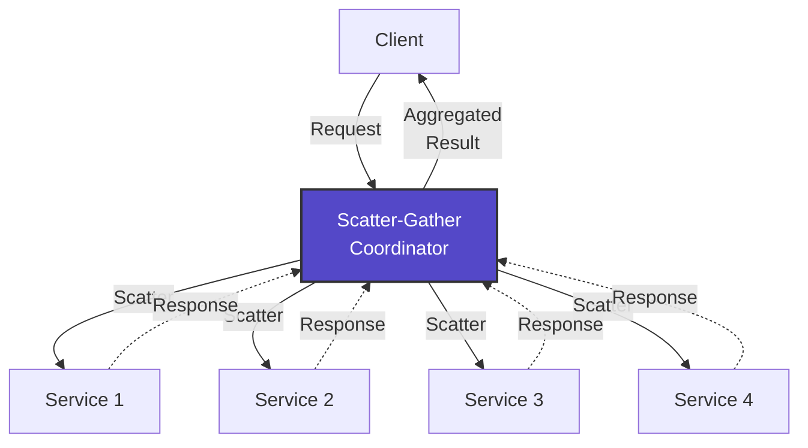
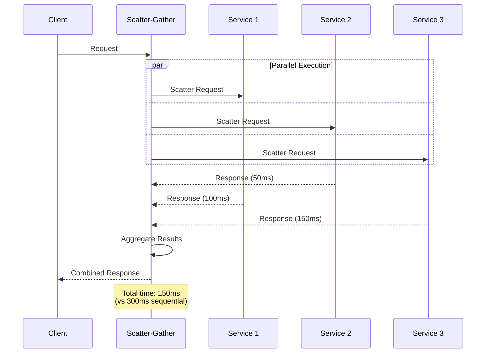
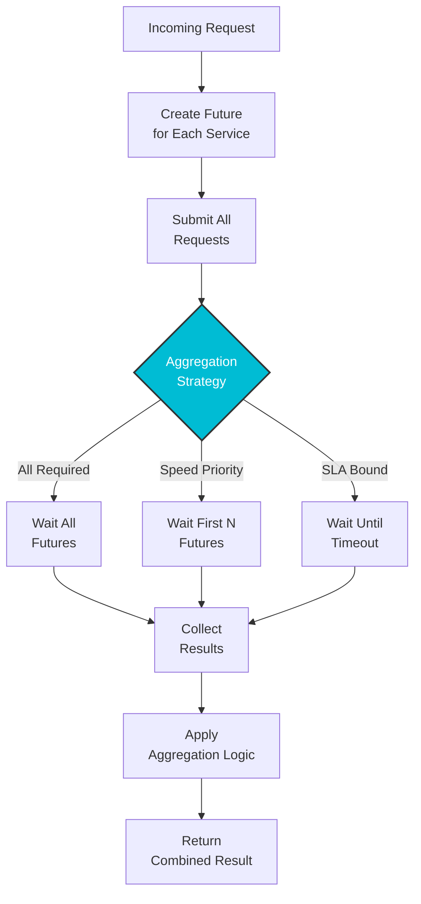
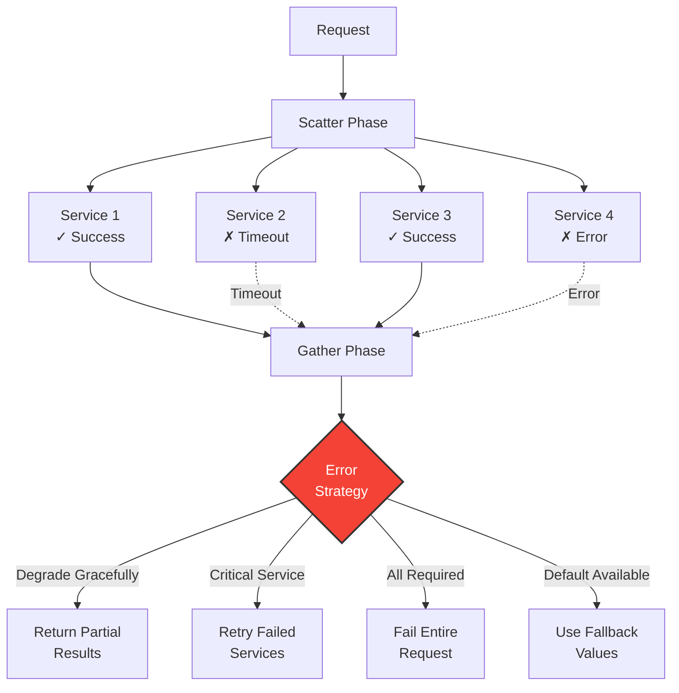
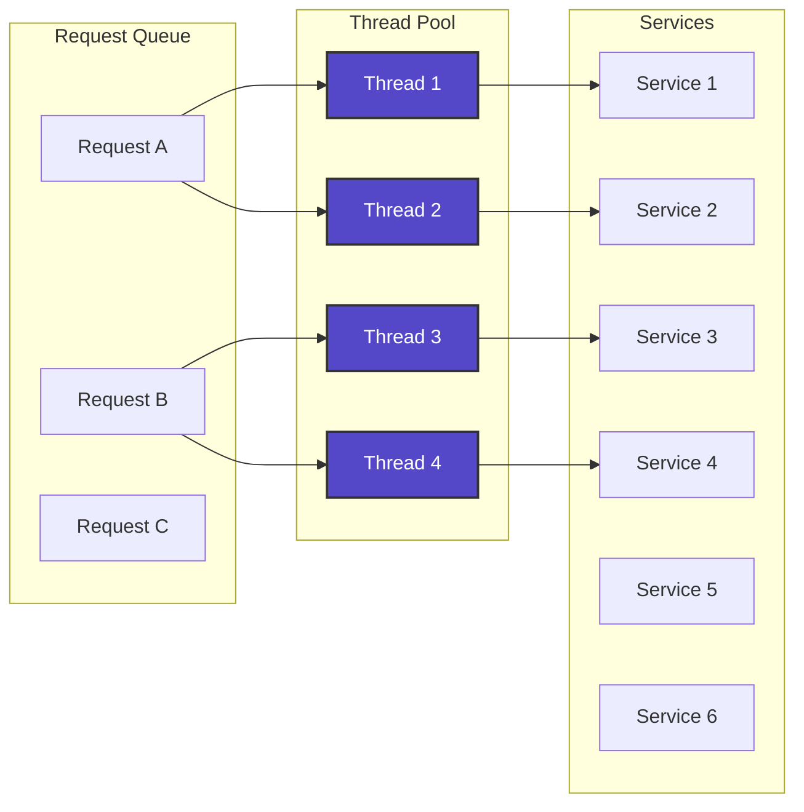
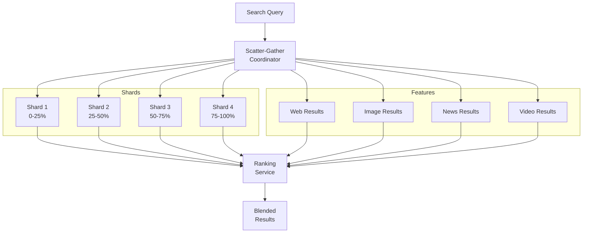
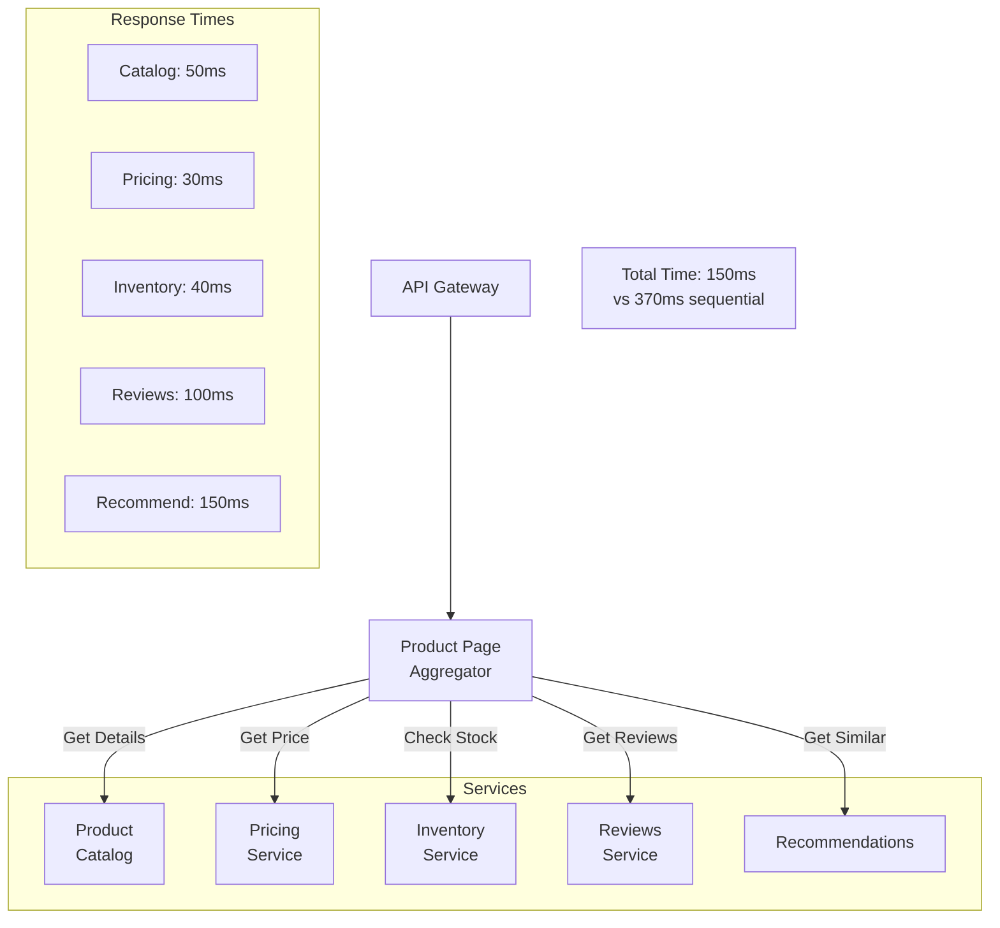

# Scatter-Gather

!!! success "Problem → Solution"
    **Problem**: Need to query multiple services and aggregate results efficiently  
    **Solution**: Distribute requests in parallel, then gather and combine responses

## Architecture

## Request Flow Patterns

## Aggregation Strategies

| Strategy | Description | Use Case | Pros | Cons |
|----------|-------------|----------|------|------|
| **All Responses** | Wait for all services | Complete data required | Full result set | Slowest service bottleneck |
| **First-N** | Return after N responses | Speed critical | Fast response | Potentially incomplete |
| **Quorum** | Majority agreement | Consensus needed | Balance speed/accuracy | Complex for ties |
| **Timeout-Based** | Best effort within time | SLA constrained | Predictable latency | May miss responses |
| **Quality-Based** | Sufficient quality threshold | Search/recommendations | Adaptive performance | Quality metrics needed |

## Implementation Patterns

### Futures-Based Approach

### Error Handling Strategies

## Performance Optimization

### Parallel Execution Benefits

| Scenario | Sequential Time | Scatter-Gather Time | Improvement |
|----------|----------------|---------------------|-------------|
| 4 services × 100ms | 400ms | 100ms | 4× faster |
| 10 services × 50ms | 500ms | 50ms | 10× faster |
| Mixed latencies (50,100,150,200ms) | 500ms | 200ms | 2.5× faster |

### Resource Pool Management

## Real-World Examples

### Search Engine Architecture

### Microservices Aggregation

## Comparison with Related Patterns

| Pattern | Scatter-Gather | Map-Reduce | Fork-Join | Pub-Sub |
|---------|---------------|------------|-----------|---------|
| **Purpose** | Query aggregation | Data processing | Divide & conquer | Event distribution |
| **Communication** | Request-response | Batch processing | Recursive splitting | Fire-and-forget |
| **Result Handling** | Real-time aggregation | Staged reduction | Recursive merge | Independent handlers |
| **Latency** | Low (parallel) | High (batch) | Medium | N/A |
| **Use Case** | Service queries | Big data | Computation | Events |

## Implementation Considerations

!!! warning "Common Pitfalls"
    - **Thread exhaustion**: Limit concurrent requests
    - **Timeout cascades**: Set appropriate timeouts
    - **Memory pressure**: Stream large results
    - **Partial failures**: Define clear degradation strategy

!!! tip "Best Practices"
    - Use circuit breakers for each downstream service
    - Implement request deduplication
    - Cache aggregated results when appropriate
    - Monitor individual service latencies
    - Set service-specific timeouts

## When to Use

✅ **Use Scatter-Gather when:**
- Multiple independent data sources
- Parallel processing improves latency
- Partial results are acceptable
- Services have similar response times

❌ **Avoid when:**
- Sequential dependencies exist
- Single source of truth required
- Overhead exceeds parallelization benefits
- Strong consistency needed

## Related Patterns

- [**Circuit Breaker**](circuit-breaker.md) - Protect against service failures
- [**Load Balancing**](load-balancing.md) - Distribute scatter requests
- [**Saga**](saga.md) - Coordinate distributed transactions
- [**API Gateway**](api-gateway.md) - Common implementation location