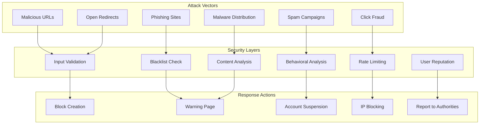
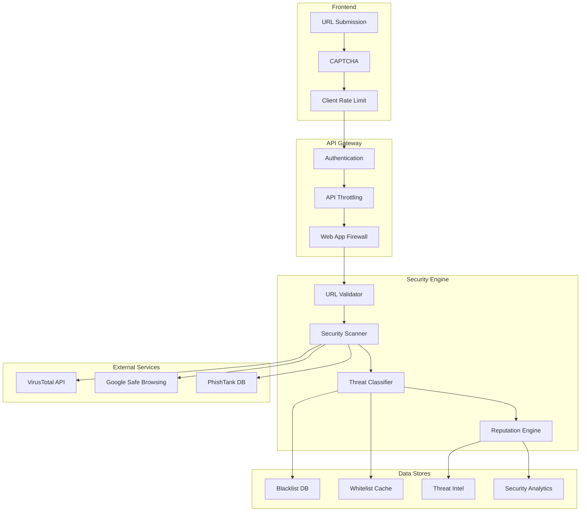

# URL Shortener Security Pattern

**Protect users from malicious links while maintaining performance and usability**

## Level 1: Intuition

## Core Concept

URL shorteners are like unmarked packages - you don't know what's inside until you open them. Security patterns ensure packages are safe before delivery.

**Problem**: Short URLs hide destinations → phishing/malware risks → user harm

**Solution**: Multi-layer security checks with real-time threat detection and abuse prevention.

## Simple Example

```text
Real-world Analogy:
Airport Security for URLs:
1. Check-in: Validate URL format
2. X-ray scan: Analyze destination  
3. Security screening: Check blacklists
4. Random checks: Periodic rescanning
5. No-fly list: Block bad actors

Digital Implementation:
1. Input validation
2. Destination analysis
3. Reputation checking
4. Continuous monitoring
5. User/IP blocking
```

---

## Level 2: Foundation

## Threat Model



## Security Check Pipeline

<div class="responsive-table" markdown>

| Stage | Check Type | Action | Performance Impact |
|-------|-----------|--------|-------------------|
| **1. Pre-creation** | Format validation | Reject invalid | Minimal |
| **2. Blacklist** | Known bad URLs/domains | Block immediately | Low (Bloom filter) |
| **3. Real-time** | Live site analysis | Scan & classify | Medium |
| **4. Post-creation** | Continuous monitoring | Update status | Async/batched |
| **5. Click-time** | Fresh check | Warn if changed | Low (cached) |

</div>


## Common Attack Patterns

1. **Phishing**: Legitimate-looking URLs to steal credentials
2. **Malware**: Drive-by downloads, exploit kits
3. **Spam**: Mass distribution of unwanted content
4. **SEO Poisoning**: Manipulating search rankings
5. **Click Fraud**: Automated clicking for ad revenue

---

## Level 3: Implementation

## Security Architecture



## Core Security Implementation

```python
import re
import hashlib
import asyncio
from typing import Dict, List, Optional, Tuple
from urllib.parse import urlparse, unquote
import dns.resolver
import requests
from datetime import datetime, timedelta

class URLSecurityEngine:
    """
    Comprehensive security engine for URL shortener
    """
    
    def __init__(self, config: dict):
        self.config = config
        self.blacklist = URLBlacklist()
        self.whitelist = URLWhitelist()
        self.reputation = ReputationEngine()
        self.scanner = SecurityScanner()
        self.rate_limiter = RateLimiter()
        
    async def validate_url(self, url: str, user_id: str) -> SecurityResult:
        """
        Complete security validation pipeline
        """
# Stage 1: Input validation
        validation = self._validate_format(url)
        if not validation.is_valid:
            return SecurityResult(
                allowed=False,
                reason=validation.reason,
                risk_level='blocked'
            )
            
# Stage 2: Rate limiting
        if not await self.rate_limiter.check_limit(user_id):
            return SecurityResult(
                allowed=False,
                reason='Rate limit exceeded',
                risk_level='rate_limited'
            )
            
# Stage 3: Quick checks (blacklist, whitelist)
        quick_check = await self._quick_security_check(url)
        if quick_check:
            return quick_check
            
# Stage 4: Deep analysis
        analysis = await self.scanner.analyze_url(url)
        
# Stage 5: Classification
        risk_assessment = self.classifier.assess_risk(analysis)
        
# Stage 6: Decision
        return self._make_security_decision(url, risk_assessment, user_id)
        
    def _validate_format(self, url: str) -> ValidationResult:
        """
        Validate URL format and structure
        """
# Check basic format
        if not url or len(url) > 2048:
            return ValidationResult(False, "Invalid URL length")
            
# Parse URL
        try:
            parsed = urlparse(url)
        except:
            return ValidationResult(False, "Malformed URL")
            
# Check scheme
        if parsed.scheme not in ['http', 'https']:
            return ValidationResult(False, f"Invalid scheme: {parsed.scheme}")
            
# Check for suspicious patterns
        suspicious_patterns = [
            r'@',  # Username in URL
            r'\\x[0-9a-fA-F]{2}',  # Hex encoding
            r'%00',  # Null byte
            r'\.\./',  # Directory traversal
            r'javascript:',  # JS protocol
            r'data:',  # Data URLs
        ]
        
        decoded_url = unquote(url)
        for pattern in suspicious_patterns:
            if re.search(pattern, decoded_url, re.IGNORECASE):
                return ValidationResult(False, f"Suspicious pattern: {pattern}")
                
# Check for homograph attacks
        if self._has_homograph_attack(parsed.netloc):
            return ValidationResult(False, "Possible homograph attack")
            
# Check for URL shortener chains
        if self._is_shortener_chain(parsed.netloc):
            return ValidationResult(False, "URL shortener chain detected")
            
        return ValidationResult(True, "Valid format")
        
    def _has_homograph_attack(self, domain: str) -> bool:
        """
        Detect IDN homograph attacks
        """
# Check for mixed scripts
        scripts = set()
        for char in domain:
            if char.isalpha():
# Simplified script detection
                if ord(char) < 128:
                    scripts.add('latin')
                elif 0x0400 <= ord(char) <= 0x04FF:
                    scripts.add('cyrillic')
                elif 0x0370 <= ord(char) <= 0x03FF:
                    scripts.add('greek')
                    
        return len(scripts) > 1
        
    async def _quick_security_check(self, url: str) -> Optional[SecurityResult]:
        """
        Fast security checks using cached data
        """
        parsed = urlparse(url)
        domain = parsed.netloc.lower()
        
# Check whitelist first (trusted domains)
        if await self.whitelist.contains(domain):
            return SecurityResult(
                allowed=True,
                reason='Whitelisted domain',
                risk_level='safe'
            )
            
# Check blacklist
        if await self.blacklist.contains(url) or await self.blacklist.contains(domain):
            return SecurityResult(
                allowed=False,
                reason='Blacklisted URL/domain',
                risk_level='malicious'
            )
            
# Check URL hash against known threats
        url_hash = hashlib.sha256(url.encode()).hexdigest()
        if await self.blacklist.contains_hash(url_hash):
            return SecurityResult(
                allowed=False,
                reason='Known malicious URL',
                risk_level='malicious'
            )
            
        return None  # Continue to deep analysis


class SecurityScanner:
    """
    Deep security analysis of URLs
    """
    
    def __init__(self):
        self.session = requests.Session()
        self.session.headers.update({
            'User-Agent': 'URLShortenerSecurityBot/1.0'
        })
        
    async def analyze_url(self, url: str) -> SecurityAnalysis:
        """
        Comprehensive URL analysis
        """
        analysis = SecurityAnalysis(url=url)
        
# DNS analysis
        dns_result = await self._analyze_dns(url)
        analysis.dns = dns_result
        
# Content analysis
        content_result = await self._analyze_content(url)
        analysis.content = content_result
        
# SSL/TLS analysis
        ssl_result = await self._analyze_ssl(url)
        analysis.ssl = ssl_result
        
# External reputation checks
        reputation_result = await self._check_external_reputation(url)
        analysis.reputation = reputation_result
        
# Calculate overall risk score
        analysis.risk_score = self._calculate_risk_score(analysis)
        
        return analysis
        
    async def _analyze_dns(self, url: str) -> DNSAnalysis:
        """
        Analyze DNS configuration
        """
        parsed = urlparse(url)
        domain = parsed.netloc
        
        result = DNSAnalysis()
        
        try:
# Check DNS resolution
            answers = dns.resolver.resolve(domain, 'A')
            result.resolves = True
            result.ip_addresses = [str(rdata) for rdata in answers]
            
# Check if newly registered
            try:
                whois_info = await self._get_whois_info(domain)
                domain_age = (datetime.now() - whois_info['creation_date']).days
                result.domain_age = domain_age
                result.is_new = domain_age < 30  # Less than 30 days
            except:
                result.is_new = True  # Assume new if can't determine
                
# Check for fast flux
            result.is_fast_flux = await self._detect_fast_flux(domain)
            
        except dns.resolver.NXDOMAIN:
            result.resolves = False
            result.risk_indicators.append('Domain does not exist')
            
        return result
        
    async def _analyze_content(self, url: str) -> ContentAnalysis:
        """
        Analyze page content for threats
        """
        result = ContentAnalysis()
        
        try:
# Fetch with timeout and size limit
            response = await asyncio.to_thread(
                self.session.get,
                url,
                timeout=5,
                allow_redirects=True,
                stream=True
            )
            
# Check redirects
            if len(response.history) > 0:
                result.redirects = [
                    {'url': r.url, 'status': r.status_code}
                    for r in response.history
                ]
                
# Check for suspicious redirect patterns
                if len(response.history) > 3:
                    result.risk_indicators.append('Excessive redirects')
                    
# Check for open redirect
                final_domain = urlparse(response.url).netloc
                if self._is_suspicious_redirect(url, response.url):
                    result.risk_indicators.append('Suspicious redirect')
                    
# Analyze content (first 1MB)
            content = b''
            for chunk in response.iter_content(chunk_size=1024):
                content += chunk
                if len(content) > 1024 * 1024:  # 1MB limit
                    break
                    
# Check for malicious patterns
            content_text = content.decode('utf-8', errors='ignore')
            
# Phishing indicators
            phishing_patterns = [
                r'<input[^>]*type=["\']password["\']',  # Password field
                r'verify your account',
                r'suspended your account',
                r'click here immediately',
                r'limited time offer'
            ]
            
            for pattern in phishing_patterns:
                if re.search(pattern, content_text, re.IGNORECASE):
                    result.phishing_score += 0.2
                    
# Malware indicators
            malware_patterns = [
                r'<iframe[^>]*src=["\'][^"^\']*\.(exe|zip|rar)',
                r'document\.write\(unescape',
                r'eval\(String\.fromCharCode',
                r'<script[^>]*src=["\']data:'
            ]
            
            for pattern in malware_patterns:
                if re.search(pattern, content_text, re.IGNORECASE):
                    result.malware_score += 0.3
                    
        except requests.RequestException as e:
            result.accessible = False
            result.error = str(e)
            
        return result
        
    async def _check_external_reputation(self, url: str) -> ReputationResult:
        """
        Check URL against external reputation services
        """
        result = ReputationResult()
        
# Check Google Safe Browsing
        safe_browsing = await self._check_google_safe_browsing(url)
        if safe_browsing['is_malicious']:
            result.is_malicious = True
            result.threat_types.extend(safe_browsing['threats'])
            
# Check VirusTotal
        virustotal = await self._check_virustotal(url)
        if virustotal['detections'] > 0:
            result.is_malicious = True
            result.detection_ratio = virustotal['detection_ratio']
            
# Check PhishTank
        phishtank = await self._check_phishtank(url)
        if phishtank['is_phish']:
            result.is_malicious = True
            result.threat_types.append('phishing')
            
        return result


class ReputationEngine:
    """
    Track and manage user/IP reputation
    """
    
    def __init__(self):
        self.user_scores = {}
        self.ip_scores = {}
        self.behavior_tracker = BehaviorTracker()
        
    async def check_reputation(self, user_id: str, ip_address: str) -> ReputationScore:
        """
        Calculate composite reputation score
        """
# Get user reputation
        user_score = self.user_scores.get(user_id, 100)  # Start at 100
        
# Get IP reputation
        ip_score = self.ip_scores.get(ip_address, 100)
        
# Check behavior patterns
        behavior_score = await self.behavior_tracker.get_score(user_id)
        
# Weighted average
        composite_score = (
            user_score * 0.5 +
            ip_score * 0.3 +
            behavior_score * 0.2
        )
        
        return ReputationScore(
            score=composite_score,
            user_score=user_score,
            ip_score=ip_score,
            behavior_score=behavior_score,
            risk_level=self._score_to_risk_level(composite_score)
        )
        
    async def update_reputation(
        self,
        user_id: str,
        ip_address: str,
        event: ReputationEvent
    ):
        """
        Update reputation based on events
        """
# Define score impacts
        score_impacts = {
            'malicious_url_submitted': -20,
            'phishing_attempt': -30,
            'spam_detected': -10,
            'rate_limit_exceeded': -5,
            'clean_url_submitted': +1,
            'reported_by_users': -15,
            'false_positive': +10
        }
        
        impact = score_impacts.get(event.type, 0)
        
# Update user score
        if user_id in self.user_scores:
            self.user_scores[user_id] = max(0, min(100, 
                self.user_scores[user_id] + impact
            ))
        else:
            self.user_scores[user_id] = 100 + impact
            
# Update IP score
        if ip_address in self.ip_scores:
            self.ip_scores[ip_address] = max(0, min(100,
                self.ip_scores[ip_address] + impact
            ))
        else:
            self.ip_scores[ip_address] = 100 + impact
            
# Track behavior
        await self.behavior_tracker.record_event(user_id, event)
        
# Check for automatic blocking
        if self.user_scores[user_id] < 20 or self.ip_scores[ip_address] < 20:
            await self._trigger_blocking(user_id, ip_address)


class BehaviorTracker:
    """
    Track user behavior patterns for anomaly detection
    """
    
    def __init__(self):
        self.user_patterns = {}
        self.anomaly_detector = AnomalyDetector()
        
    async def analyze_submission_pattern(
        self,
        user_id: str,
        url: str,
        timestamp: datetime
    ) -> BehaviorAnalysis:
        """
        Analyze URL submission patterns
        """
        if user_id not in self.user_patterns:
            self.user_patterns[user_id] = UserPattern()
            
        pattern = self.user_patterns[user_id]
        pattern.submissions.append({
            'url': url,
            'timestamp': timestamp,
            'domain': urlparse(url).netloc
        })
        
# Keep only recent history (last 24 hours)
        cutoff = datetime.now() - timedelta(hours=24)
        pattern.submissions = [
            s for s in pattern.submissions
            if s['timestamp'] > cutoff
        ]
        
# Analyze patterns
        analysis = BehaviorAnalysis()
        
# Check submission rate
        if len(pattern.submissions) > 100:  # More than 100 in 24h
            analysis.is_suspicious = True
            analysis.reasons.append('High submission rate')
            
# Check domain diversity
        domains = set(s['domain'] for s in pattern.submissions)
        if len(domains) == 1 and len(pattern.submissions) > 10:
            analysis.is_suspicious = True
            analysis.reasons.append('Single domain pattern')
            
# Check for URL patterns
        if self._has_sequential_pattern(pattern.submissions):
            analysis.is_suspicious = True
            analysis.reasons.append('Sequential URL pattern')
            
# Check time patterns
        if self._has_automated_timing(pattern.submissions):
            analysis.is_suspicious = True
            analysis.reasons.append('Automated timing pattern')
            
        return analysis
        
    def _has_sequential_pattern(self, submissions: List[dict]) -> bool:
        """
        Detect sequential URL patterns (e.g., site.com/1, site.com/2)
        """
        if len(submissions) < 5:
            return False
            
# Extract URL paths
        paths = [urlparse(s['url']).path for s in submissions[-10:]]
        
# Check for numeric sequences
        numbers = []
        for path in paths:
            match = re.search(r'(\d+)', path)
            if match:
                numbers.append(int(match.group(1)))
                
        if len(numbers) >= 5:
# Check if sequential
            diffs = [numbers[i+1] - numbers[i] for i in range(len(numbers)-1)]
            if all(d == diffs[0] for d in diffs):  # Constant difference
                return True
                
        return False
        
    def _has_automated_timing(self, submissions: List[dict]) -> bool:
        """
        Detect automated submission patterns
        """
        if len(submissions) < 10:
            return False
            
# Calculate time intervals
        times = [s['timestamp'] for s in submissions[-10:]]
        intervals = [
            (times[i+1] - times[i]).total_seconds()
            for i in range(len(times)-1)
        ]
        
# Check for regular intervals (within 10% variance)
        avg_interval = sum(intervals) / len(intervals)
        variance = sum((i - avg_interval)**2 for i in intervals) / len(intervals)
        
# Low variance suggests automation
        return variance < (avg_interval * 0.1)**2
```

## Advanced Security Features

```typescript
// Real-time threat detection and response
class ThreatDetectionSystem {
  private mlClassifier: MLThreatClassifier;
  private threatIntel: ThreatIntelligenceAPI;
  private sandboxAnalyzer: SandboxAnalyzer;
  
  async detectThreats(url: string): Promise<ThreatAssessment> {
    // Parallel analysis for speed
    const [mlResult, intelResult, sandboxResult] = await Promise.all([
      this.mlClassifier.classify(url),
      this.threatIntel.lookup(url),
      this.sandboxAnalyzer.analyze(url)
    ]);
    
    // Combine results
    return this.combineThreatAssessments(mlResult, intelResult, sandboxResult);
  }
  
  private combineThreatAssessments(
    ml: MLClassification,
    intel: ThreatIntelResult,
    sandbox: SandboxResult
  ): ThreatAssessment {
    // Weight different signals
    const weights = {
      ml: 0.3,
      intel: 0.4,
      sandbox: 0.3
    };
    
    const overallScore = 
      ml.confidence * weights.ml +
      intel.threatScore * weights.intel +
      sandbox.riskScore * weights.sandbox;
      
    return {
      threatLevel: this.scoreToThreatLevel(overallScore),
      confidence: (ml.confidence + intel.confidence + sandbox.confidence) / 3,
      threats: [...ml.threats, ...intel.threats, ...sandbox.threats],
      recommendation: this.getRecommendation(overallScore)
    };
  }
}

// Click-time security verification
class ClickTimeProtection {
  private cache: SecurityCache;
  private validator: SecurityValidator;
  
  async verifyClick(
    shortUrl: string,
    userId: string,
    context: ClickContext
  ): Promise<ClickDecision> {
    // Get destination URL
    const destination = await this.getDestination(shortUrl);
    
    // Check cache for recent validation
    const cached = await this.cache.get(destination.url);
    if (cached && !this.isStale(cached)) {
      return this.makeDecision(cached, context);
    }
    
    // Fresh security check
    const validation = await this.validator.validate(destination.url);
    await this.cache.set(destination.url, validation, 3600); // 1 hour
    
    // Make decision based on risk and context
    return this.makeDecision(validation, context);
  }
  
  private makeDecision(
    validation: ValidationResult,
    context: ClickContext
  ): ClickDecision {
    // Always block high-risk
    if (validation.riskLevel === 'high') {
      return {
        action: 'block',
        reason: 'Malicious content detected',
        showWarning: true
      };
    }
    
    // Warning for medium risk
    if (validation.riskLevel === 'medium') {
      return {
        action: 'warning',
        reason: 'Potentially unsafe content',
        warnings: validation.warnings,
        allowBypass: true
      };
    }
    
    // Consider user preferences
    if (context.userPreferences.strictMode && validation.riskLevel !== 'low') {
      return {
        action: 'warning',
        reason: 'Strict mode enabled',
        allowBypass: true
      };
    }
    
    // Allow low risk
    return {
      action: 'allow',
      trackingId: this.generateTrackingId()
    };
  }
}
```

---

## Level 4: Deep Dive

## Machine Learning for Threat Detection

```python
import numpy as np
from sklearn.ensemble import RandomForestClassifier
import tensorflow as tf

class MLThreatDetector:
    """
    Machine learning model for URL threat detection
    """
    
    def __init__(self):
        self.feature_extractor = URLFeatureExtractor()
        self.model = self._load_model()
        self.threshold = 0.7
        
    def extract_features(self, url: str) -> np.ndarray:
        """
        Extract ML features from URL
        """
        features = []
        
# URL structure features
        parsed = urlparse(url)
        features.extend([
            len(url),                          # URL length
            url.count('.'),                    # Dot count
            url.count('-'),                    # Dash count
            url.count('_'),                    # Underscore count
            url.count('/'),                    # Slash count
            url.count('?'),                    # Query params
            url.count('='),                    # Param values
            1 if '@' in url else 0,            # Has @ symbol
            1 if '~' in url else 0,            # Has tilde
            len(parsed.netloc),                # Domain length
            self._count_digits(parsed.netloc), # Digits in domain
            self._entropy(url),                # URL entropy
            1 if parsed.port else 0,           # Non-standard port
        ])
        
# Domain features
        domain_parts = parsed.netloc.split('.')
        features.extend([
            len(domain_parts),                 # Subdomain levels
            len(domain_parts[0]) if domain_parts else 0,  # First part length
            self._is_ip_address(parsed.netloc),           # Is IP address
            self._has_punycode(parsed.netloc),            # Has punycode
        ])
        
# Content features (if available)
        content_features = self._extract_content_features(url)
        features.extend(content_features)
        
        return np.array(features)
        
    def _entropy(self, string: str) -> float:
        """Calculate Shannon entropy"""
        if not string:
            return 0
            
        prob = [string.count(c) / len(string) for c in set(string)]
        return -sum(p * np.log2(p) for p in prob if p > 0)
        
    def predict_threat(self, url: str) -> ThreatPrediction:
        """
        Predict if URL is malicious
        """
# Extract features
        features = self.extract_features(url)
        
# Get prediction
        prediction = self.model.predict_proba([features])[0]
        threat_probability = prediction[1]  # Probability of being malicious
        
# Classify threat type if malicious
        threat_type = None
        if threat_probability > self.threshold:
            threat_type = self._classify_threat_type(features)
            
        return ThreatPrediction(
            is_threat=threat_probability > self.threshold,
            confidence=float(max(prediction)),
            threat_probability=float(threat_probability),
            threat_type=threat_type,
            feature_importance=self._get_feature_importance(features)
        )
        
    def _classify_threat_type(self, features: np.ndarray) -> str:
        """
        Classify specific threat type
        """
# Use secondary classifier for threat type
        threat_types = ['phishing', 'malware', 'spam', 'scam']
        type_predictions = self.type_classifier.predict_proba([features])[0]
        
        max_idx = np.argmax(type_predictions)
        if type_predictions[max_idx] > 0.5:
            return threat_types[max_idx]
        return 'unknown'
```

## Distributed Blacklist with Bloom Filters

```python
import mmh3
from bitarray import bitarray
import redis

class DistributedBloomFilter:
    """
    Space-efficient distributed blacklist
    """
    
    def __init__(self, redis_client: redis.Redis, capacity: int = 10000000, error_rate: float = 0.001):
        self.redis = redis_client
        self.capacity = capacity
        self.error_rate = error_rate
        
# Calculate optimal parameters
        self.size = self._optimal_size(capacity, error_rate)
        self.hash_count = self._optimal_hash_count(self.size, capacity)
        
        self.key_prefix = "bloom:blacklist:"
        
    def add(self, item: str) -> None:
        """
        Add item to blacklist
        """
        for i in range(self.hash_count):
# Use different hash seeds
            hash_val = mmh3.hash(item, i) % self.size
            bit_key = f"{self.key_prefix}{hash_val // 8}"
            bit_offset = hash_val % 8
            
# Set bit in Redis
            self.redis.setbit(bit_key, bit_offset, 1)
            
    def contains(self, item: str) -> bool:
        """
        Check if item might be in blacklist
        """
        for i in range(self.hash_count):
            hash_val = mmh3.hash(item, i) % self.size
            bit_key = f"{self.key_prefix}{hash_val // 8}"
            bit_offset = hash_val % 8
            
# Check bit in Redis
            if not self.redis.getbit(bit_key, bit_offset):
                return False  # Definitely not in set
                
        return True  # Possibly in set
        
    def _optimal_size(self, n: int, p: float) -> int:
        """Calculate optimal bit array size"""
        return int(-n * np.log(p) / (np.log(2) ** 2))
        
    def _optimal_hash_count(self, m: int, n: int) -> int:
        """Calculate optimal number of hash functions"""
        return int((m / n) * np.log(2))
        
    async def bulk_check(self, items: List[str]) -> Dict[str, bool]:
        """
        Efficiently check multiple items
        """
        pipeline = self.redis.pipeline()
        bit_checks = []
        
# Queue all bit checks
        for item in items:
            item_checks = []
            for i in range(self.hash_count):
                hash_val = mmh3.hash(item, i) % self.size
                bit_key = f"{self.key_prefix}{hash_val // 8}"
                bit_offset = hash_val % 8
                
                pipeline.getbit(bit_key, bit_offset)
                item_checks.append((item, i))
            bit_checks.extend(item_checks)
            
# Execute pipeline
        results = pipeline.execute()
        
# Process results
        item_results = {}
        result_idx = 0
        
        for item in items:
            possibly_exists = True
            for i in range(self.hash_count):
                if not results[result_idx]:
                    possibly_exists = False
                    break
                result_idx += 1
                
            item_results[item] = possibly_exists
            
        return item_results
```

## Anti-Abuse Protection

```typescript
// Sophisticated rate limiting with abuse detection
class AntiAbuseSystem {
  private rateLimiter: AdaptiveRateLimiter;
  private patternDetector: AbusePatternDetector;
  private responseStrategy: ResponseStrategy;
  
  async checkRequest(
    userId: string,
    request: URLCreationRequest
  ): Promise<AbuseCheckResult> {
    // Check rate limits
    const rateCheck = await this.rateLimiter.check(userId);
    if (!rateCheck.allowed) {
      return {
        allowed: false,
        reason: 'rate_limit',
        retryAfter: rateCheck.retryAfter,
        suggestion: 'Please slow down your requests'
      };
    }
    
    // Detect abuse patterns
    const patterns = await this.patternDetector.analyze(userId, request);
    if (patterns.isAbusive) {
      // Adaptive response based on severity
      const response = this.responseStrategy.determineResponse(
        patterns.severity,
        patterns.type
      );
      
      return {
        allowed: false,
        reason: patterns.type,
        action: response.action,
        challenge: response.requiresCaptcha ? this.generateChallenge() : null
      };
    }
    
    // Track for future analysis
    await this.patternDetector.record(userId, request);
    
    return { allowed: true };
  }
}

class AdaptiveRateLimiter {
  private limits: Map<string, RateLimit>;
  
  async check(userId: string): Promise<RateLimitResult> {
    const userLimit = await this.getUserLimit(userId);
    const window = this.getWindow(userLimit.windowType);
    
    // Get current usage
    const usage = await this.redis.incr(
      `rate:${userId}:${window.id}`
    );
    
    // Set expiry on first request
    if (usage === 1) {
      await this.redis.expire(
        `rate:${userId}:${window.id}`,
        window.duration
      );
    }
    
    // Check limit
    if (usage > userLimit.limit) {
      // Calculate backoff
      const backoff = this.calculateBackoff(
        usage - userLimit.limit,
        userLimit
      );
      
      return {
        allowed: false,
        current: usage,
        limit: userLimit.limit,
        retryAfter: backoff
      };
    }
    
    return {
      allowed: true,
      current: usage,
      limit: userLimit.limit,
      remaining: userLimit.limit - usage
    };
  }
  
  private async getUserLimit(userId: string): Promise<RateLimit> {
    // Get user tier and reputation
    const [tier, reputation] = await Promise.all([
      this.getUserTier(userId),
      this.getReputation(userId)
    ]);
    
    // Base limits by tier
    const baseLimits = {
      free: { limit: 100, window: '1h' },
      basic: { limit: 1000, window: '1h' },
      premium: { limit: 10000, window: '1h' },
      enterprise: { limit: 100000, window: '1h' }
    };
    
    const base = baseLimits[tier];
    
    // Adjust based on reputation
    const reputationMultiplier = this.getReputationMultiplier(reputation);
    
    return {
      limit: Math.floor(base.limit * reputationMultiplier),
      windowType: base.window,
      adaptive: true
    };
  }
}
```

---

## Level 5: Production

## High-Performance Security Pipeline

```python
class ProductionSecurityPipeline:
    """
    Production-ready security pipeline with caching and optimization
    """
    
    def __init__(self, config: dict):
        self.config = config
        self.cache = MultiLevelCache()
        self.batch_processor = BatchSecurityProcessor()
        self.metrics = SecurityMetrics()
        
    async def process_url(
        self,
        url: str,
        user_context: UserContext
    ) -> SecurityDecision:
        """
        Process URL through optimized security pipeline
        """
        start_time = time.time()
        
# Check cache first
        cache_key = self._generate_cache_key(url)
        cached_result = await self.cache.get(cache_key)
        
        if cached_result and not self._is_stale(cached_result):
            self.metrics.record('cache_hit', 1)
            return cached_result['decision']
            
# Parallel security checks
        checks = await asyncio.gather(
            self._check_format(url),
            self._check_blacklist(url),
            self._check_reputation(user_context),
            self._check_rate_limit(user_context),
            return_exceptions=True
        )
        
# Process results
        for idx, check in enumerate(checks):
            if isinstance(check, Exception):
                self.metrics.record('check_error', 1, {'check': idx})
# Fail closed on errors
                return SecurityDecision(
                    allowed=False,
                    reason='Security check failed',
                    error=str(check)
                )
                
            if not check.passed:
                decision = SecurityDecision(
                    allowed=False,
                    reason=check.reason,
                    check_failed=check.name
                )
                
# Cache negative results for short time
                await self.cache.set(
                    cache_key,
                    {'decision': decision},
                    ttl=300  # 5 minutes
                )
                
                return decision
                
# Deep analysis for URLs that pass initial checks
        if self._needs_deep_analysis(url, user_context):
            analysis_result = await self.batch_processor.queue_for_analysis(
                url,
                user_context
            )
            
            if analysis_result.risk_score > 0.7:
                return SecurityDecision(
                    allowed=False,
                    reason='High risk detected',
                    risk_score=analysis_result.risk_score
                )
                
# Allow and cache positive result
        decision = SecurityDecision(
            allowed=True,
            risk_score=0.1,  # Low risk
            processing_time=time.time() - start_time
        )
        
        await self.cache.set(
            cache_key,
            {'decision': decision, 'timestamp': time.time()},
            ttl=3600  # 1 hour
        )
        
        self.metrics.record(
            'processing_time',
            time.time() - start_time,
            {'result': 'allowed'}
        )
        
        return decision


class BatchSecurityProcessor:
    """
    Batch process security checks for efficiency
    """
    
    def __init__(self, batch_size: int = 100, batch_timeout: float = 0.1):
        self.batch_size = batch_size
        self.batch_timeout = batch_timeout
        self.pending_queue = asyncio.Queue()
        self.results = {}
        self.processor_task = asyncio.create_task(self._process_batches())
        
    async def queue_for_analysis(
        self,
        url: str,
        context: UserContext
    ) -> AnalysisResult:
        """
        Queue URL for batch analysis
        """
        request_id = str(uuid.uuid4())
        future = asyncio.Future()
        
        await self.pending_queue.put({
            'id': request_id,
            'url': url,
            'context': context,
            'future': future
        })
        
        return await future
        
    async def _process_batches(self):
        """
        Process URLs in batches for efficiency
        """
        while True:
            batch = []
            deadline = time.time() + self.batch_timeout
            
# Collect batch
            while len(batch) < self.batch_size and time.time() < deadline:
                try:
                    timeout = max(0, deadline - time.time())
                    item = await asyncio.wait_for(
                        self.pending_queue.get(),
                        timeout=timeout
                    )
                    batch.append(item)
                except asyncio.TimeoutError:
                    break
                    
            if batch:
# Process batch
                try:
                    results = await self._analyze_batch(batch)
                    
# Deliver results
                    for item, result in zip(batch, results):
                        item['future'].set_result(result)
                except Exception as e:
# Fail all items in batch
                    for item in batch:
                        item['future'].set_exception(e)
```

## Security Monitoring Dashboard

```python
class SecurityMonitoringSystem:
    """
    Real-time security monitoring and alerting
    """
    
    def __init__(self):
        self.metrics = MetricsCollector()
        self.alerts = AlertManager()
        self.dashboard = DashboardManager()
        
    def collect_security_metrics(self):
        """
        Collect comprehensive security metrics
        """
# Threat metrics
        self.metrics.gauge(
            'security.threats.detected',
            self.count_detected_threats(),
            tags=['type']
        )
        
        self.metrics.counter(
            'security.urls.blocked',
            tags=['reason']
        )
        
# Performance metrics
        self.metrics.histogram(
            'security.check.latency',
            tags=['check_type']
        )
        
# User behavior
        self.metrics.gauge(
            'security.suspicious.users',
            self.count_suspicious_users()
        )
        
# System health
        self.metrics.gauge(
            'security.blacklist.size',
            self.get_blacklist_size()
        )
        
    async def monitor_threats(self):
        """
        Continuous threat monitoring
        """
        while True:
# Check threat levels
            current_threats = await self.analyze_current_threats()
            
# Alert on significant changes
            if current_threats.phishing_rate > 0.05:  # 5% phishing
                await self.alerts.send(
                    level='warning',
                    title='High phishing activity detected',
                    details={
                        'rate': current_threats.phishing_rate,
                        'urls': current_threats.recent_phishing_urls
                    }
                )
                
            if current_threats.new_campaigns:
                await self.alerts.send(
                    level='critical',
                    title='New malicious campaign detected',
                    details=current_threats.new_campaigns
                )
                
# Update dashboard
            await self.dashboard.update(
                'security_overview',
                {
                    'total_urls': current_threats.total_processed,
                    'threats_blocked': current_threats.blocked_count,
                    'threat_rate': current_threats.threat_rate,
                    'top_threats': current_threats.top_threat_types,
                    'trending': current_threats.trending_domains
                }
            )
            
            await asyncio.sleep(60)  # Check every minute
```

## Testing Security Implementation

```python
import pytest

class TestURLSecurity:
    @pytest.mark.asyncio
    async def test_malicious_url_detection(self):
        """Test detection of various malicious URLs"""
        security = URLSecurityEngine(config={})
        
        malicious_urls = [
            "http://phishing-site.com/paypal/login",
            "https://bit.ly/../../../etc/passwd",
            "http://malware-download.com/virus.exe",
            "https://xn--80ak6aa92e.com/",  # Punycode
            "http://google.com@attacker.com/",
            "javascript:alert('XSS')"
        ]
        
        for url in malicious_urls:
            result = await security.validate_url(url, "test_user")
            assert not result.allowed, f"Failed to block: {url}"
            
    @pytest.mark.asyncio
    async def test_rate_limiting(self):
        """Test rate limiting effectiveness"""
        security = URLSecurityEngine(config={'rate_limit': 10})
        
# Submit 10 URLs (should work)
        for i in range(10):
            result = await security.validate_url(
                f"https://example.com/{i}",
                "test_user"
            )
            assert result.allowed
            
# 11th should fail
        result = await security.validate_url(
            "https://example.com/11",
            "test_user"
        )
        assert not result.allowed
        assert result.reason == "Rate limit exceeded"
        
    @pytest.mark.asyncio
    async def test_behavior_detection(self):
        """Test automated behavior detection"""
        tracker = BehaviorTracker()
        
# Simulate automated pattern
        base_time = datetime.now()
        for i in range(10):
            await tracker.analyze_submission_pattern(
                "bot_user",
                f"https://target.com/page{i}",
                base_time + timedelta(seconds=i*5)  # Exact 5s intervals
            )
            
        analysis = await tracker.get_analysis("bot_user")
        assert analysis.is_suspicious
        assert "Automated timing pattern" in analysis.reasons
```

## Common Security Mistakes to Avoid

### 1. Insufficient Validation
```python
# BAD: Weak validation
def validate_url_bad(url):
    return url.startswith('http')

# GOOD: Comprehensive validation
def validate_url_good(url):
    try:
        parsed = urlparse(url)
# Check scheme
        if parsed.scheme not in ['http', 'https']:
            return False
# Check for suspicious patterns
        if '@' in url or '..' in url:
            return False
# Validate domain
        if not is_valid_domain(parsed.netloc):
            return False
        return True
    except:
        return False
```

### 2. Trusting Client Input
```typescript
// BAD: Trust client-provided safety score
app.post('/shorten', (req, res) => {
  const { url, safetyScore } = req.body;
  if (safetyScore > 0.5) {
    // Create short URL
  }
});

// GOOD: Server-side validation only
app.post('/shorten', async (req, res) => {
  const { url } = req.body;
  const safetyScore = await securityEngine.analyze(url);
  if (safetyScore > threshold) {
    // Create short URL
  }
});
```

## Real-World Case Studies

### Bitly Security Evolution
- **2011**: Basic blacklist checking
- **2015**: Added real-time malware scanning
- **2018**: Machine learning for threat detection
- **2020**: Behavioral analysis for abuse prevention

### Twitter's t.co Protection
- **Challenge**: Billions of URLs, real-time requirements
- **Solution**: Multi-tier caching with async deep scanning
- **Innovation**: Crowdsourced threat reporting

### Google's Safe Browsing Integration
- **Scale**: 4 billion URLs checked daily
- **Approach**: Distributed bloom filters + API
- **Accuracy**: 99.95% malicious URL detection

## Key Takeaways

### Do's ✅
- Implement multi-layer security checks
- Use machine learning for pattern detection
- Cache security decisions appropriately
- Monitor and adapt to new threats
- Fail closed on security errors
- Provide clear user warnings

### Don'ts ❌
- Trust user-provided safety claims
- Skip validation for "trusted" users
- Use simple blacklists only
- Ignore behavioral patterns
- Cache security decisions too long
- Block without explanation

### Critical Success Factors
1. **Performance**: Security checks must be fast
2. **Accuracy**: Minimize false positives/negatives
3. **Adaptability**: Evolve with new threats
4. **Transparency**: Clear communication with users
5. **Scalability**: Handle growth without degradation

## Related Patterns
- [Rate Limiting](rate-limiting.md) - Control request flow
- [Bloom Filter](bloom-filter.md) - Efficient blacklist checking
- [Circuit Breaker](circuit-breaker.md) - Handle external service failures
- [Zero Trust Security] (Pattern: Zero Trust - Coming Soon) - Never trust, always verify

## References
- [OWASP URL Shortener Security](https://owasp.org/www-community/vulnerabilities/URL_Shortener_Abuse) - Security guidelines
- [Google Safe Browsing](https://developers.google.com/safe-browsing) - API documentation
- [VirusTotal API](https://developers.virustotal.com/reference) - Malware scanning
- [Stanford Web Security](https://crypto.stanford.edu/cs155/) - Academic research