# Segmented Log Pattern

!!! abstract "Pattern Overview"
    **🎯 Purpose**: Make infinite logs manageable through segmentation
    **📁 Analogy**: Like organizing papers into dated folders instead of one huge pile
    **💾 Benefit**: Enable log cleanup without losing recent data
    **⚡ Used By**: Kafka, RocksDB, Cassandra, most databases

## The Problem: Logs Grow Forever

### Without Segmentation: The Growing Monster

```mermaid
graph LR
    subgraph "❌ Single Log File Problems"
        LOG[Massive Log File<br/>100GB and growing] 
        
        P1[🔴 Can't delete old data]
        P2[🔴 Slow to open/scan]
        P3[🔴 Corruption affects all]
        P4[🔴 No parallel access]
        
        LOG --> P1 & P2 & P3 & P4
    end
```



### With Segmentation: Manageable Chunks

```mermaid
graph TB
    subgraph "✅ Segmented Log Solution"
        S1[Segment 1<br/>0-999<br/>✅ Closed] 
        S2[Segment 2<br/>1000-1999<br/>✅ Closed]
        S3[Segment 3<br/>2000-2999<br/>✅ Closed]
        S4[Active Segment<br/>3000-current<br/>📝 Writing]
        
        S1 -->|Can delete| TRASH[🗑️]
        S2 -->|Can compress| ZIP[🗜️]
        S3 -->|Can archive| COLD[❄️]
    end
```



## How Segmented Logs Work

### Core Concepts

| Component | Purpose | Example |
|-----------|---------|---------|
| **Segment** | Fixed-size log chunk | 1GB file or 1M entries |
| **Active Segment** | Currently accepting writes | `log-000042.log` |
| **Closed Segment** | Read-only, immutable | `log-000001.log` to `log-000041.log` |
| **Index** | Fast offset lookup | `log-000042.index` |
| **Rotation** | Switch to new segment | When size/time/count exceeded |

### Visual Architecture


## Implementation Patterns

### Basic Segmented Log Structure

```python
class SegmentedLog:
    def __init__(self, base_dir, segment_size=1_000_000_000):  # 1GB
        self.base_dir = base_dir
        self.segment_size = segment_size
        self.segments = []
        self.active_segment = None
        self._load_segments()
    
    def append(self, data):
        if self._should_rotate():
            self._rotate_segment()
        
        offset = self.active_segment.append(data)
        return offset
    
    def read(self, offset):
        segment = self._find_segment(offset)
        return segment.read(offset)
    
    def _should_rotate(self):
        return (self.active_segment.size >= self.segment_size or
                self.active_segment.age >= self.max_segment_age)

class Segment:
    def __init__(self, base_offset, file_path):
        self.base_offset = base_offset
        self.file_path = file_path
        self.index = SegmentIndex(f"{file_path}.index")
        self.file = open(file_path, 'ab+')
        self.size = 0
        
    def append(self, data):
        offset = self.base_offset + self.size
        position = self.file.tell()
        
        # Write to log
        entry = LogEntry(offset, data)
        self.file.write(entry.serialize())
        
        # Update index periodically
        if offset % 1000 == 0:
            self.index.add(offset, position)
        
        self.size += len(data)
        return offset
```

### Segment Rotation Strategies

| Strategy | Trigger | Use Case | Example |
|----------|---------|----------|---------|
| **Size-based** | Segment reaches size limit | General purpose | 1GB segments |
| **Time-based** | Time period expires | Time-series data | Daily segments |
| **Count-based** | Entry count reached | Fixed-size entries | 1M entries/segment |
| **Hybrid** | Any condition met | Flexible | 1GB OR 24 hours |

## Kafka's Segmented Log Implementation

### Kafka Segment Structure

```
/kafka-logs/
├── topic-partition-0/
│   ├── 00000000000000000000.index    # Offset index
│   ├── 00000000000000000000.log      # Data file
│   ├── 00000000000000000000.timeindex # Timestamp index
│   ├── 00000000000012345678.index    # Next segment
│   ├── 00000000000012345678.log      
│   └── 00000000000012345678.timeindex
```

### Configuration Example

```properties
# Kafka segment configuration
log.segment.bytes=1073741824          # 1GB segments
log.roll.hours=168                    # Roll weekly
log.retention.hours=168               # Keep 1 week
log.retention.bytes=107374182400      # Keep 100GB max
log.cleanup.policy=delete             # Delete old segments
segment.index.bytes=10485760          # 10MB index
```

## Performance Characteristics

### Operation Complexity

| Operation | Single Log | Segmented Log | Improvement |
|-----------|------------|---------------|-------------|
| **Append** | O(1) | O(1) | Same |
| **Read Recent** | O(1) | O(1) | Same |
| **Read by Offset** | O(log n) | O(log segments) | Much faster |
| **Delete Old Data** | O(n) - rewrite all | O(1) - delete file | Huge win |
| **Corruption Recovery** | Lose everything | Lose one segment | Fault isolation |

### Storage Efficiency


## Advanced Features

### 1. Segment Compaction


### 2. Tiered Storage

| Tier | Storage Type | Access Pattern | Cost | Retention |
|------|--------------|----------------|------|-----------|
| **Hot** | NVMe SSD | Random, frequent | $$$$ | 1 day |
| **Warm** | SSD | Sequential, occasional | $$$ | 1 week |
| **Cool** | HDD | Sequential, rare | $$ | 1 month |
| **Cold** | Object Storage | Archive only | $ | 1 year |

### 3. Parallel Segment Access

```python
class ParallelSegmentReader:
    def scan_time_range(self, start_time, end_time):
        # Find relevant segments
        segments = self.find_segments_in_range(start_time, end_time)
        
        # Read segments in parallel
        with ThreadPoolExecutor(max_workers=10) as executor:
            futures = []
            for segment in segments:
                future = executor.submit(
                    self._scan_segment, segment, start_time, end_time
                )
                futures.append(future)
            
            # Merge results
            results = []
            for future in futures:
                results.extend(future.result())
                
        return sorted(results, key=lambda x: x.timestamp)
```

## Common Pitfalls

### ❌ Anti-Patterns

| Mistake | Problem | Solution |
|---------|---------|----------|
| **Too small segments** | Many files, overhead | Larger segments (1GB+) |
| **Too large segments** | Slow operations | Smaller segments (<10GB) |
| **No index files** | Slow random access | Build offset/time indexes |
| **Synchronous rotation** | Write stalls | Background rotation |
| **No compression** | Wasted space | Compress closed segments |

### ✅ Best Practices

1. **Pre-allocate segments** to avoid fragmentation
2. **Use memory-mapped files** for better performance  
3. **Build multiple indexes** (offset, timestamp, key)
4. **Implement segment caching** for hot data
5. **Monitor segment count** to prevent inode exhaustion

## Real-World Examples

### Example 1: Apache Kafka

```java
// Kafka's log segment
class LogSegment {
    private final FileRecords log;
    private final OffsetIndex offsetIndex;
    private final TimeIndex timeIndex;
    private final long baseOffset;
    
    public void append(Records records) {
        long position = log.sizeInBytes();
        log.append(records);
        
        // Update indexes
        for (Record record : records) {
            if (shouldIndexRecord(record)) {
                offsetIndex.append(record.offset(), position);
                timeIndex.append(record.timestamp(), record.offset());
            }
        }
    }
}
```

### Example 2: RocksDB/LevelDB

```
/rocksdb/
├── 000003.log     # Current memtable WAL
├── 000001.sst     # Immutable sorted segment
├── 000002.sst     # Immutable sorted segment  
├── CURRENT        # Points to current manifest
├── MANIFEST-001   # Segment metadata
└── LOG            # Info log
```

## Design Decisions

### Segment Size Selection

| Workload | Recommended Size | Rationale |
|----------|------------------|-----------|
| **High-throughput streaming** | 1-2 GB | Balance rotation overhead |
| **Time-series metrics** | 100-500 MB | Align with time windows |
| **Event sourcing** | 500 MB - 1 GB | Snapshot boundaries |
| **Message queue** | 1 GB | Standard practice |

### Index Granularity

```
Sparse Index: Every Nth entry (Kafka default: every 4KB)
Dense Index: Every entry (more space, faster lookup)

Trade-off: Index Size vs Lookup Speed
- Sparse: 0.1% overhead, binary search within block
- Dense: 10-20% overhead, direct lookup
```

## Integration Checklist

- [ ] Define segment size based on workload
- [ ] Implement rotation triggers (size/time/count)
- [ ] Build offset index for random access
- [ ] Add timestamp index for time-based queries
- [ ] Implement retention policy
- [ ] Plan compaction strategy
- [ ] Set up tiered storage
- [ ] Monitor segment metrics
- [ ] Test corruption handling
- [ ] Document operational procedures

## Related Patterns

| Pattern | Relationship | Use Together For |
|---------|--------------|------------------|
| **[Write-Ahead Log](/patterns/write-ahead-log/)** | Foundation | Durability + segmentation |
| **[Log Compaction](/patterns/log-compaction/)** | Optimization | Space efficiency |
| **[Snapshot](/patterns/snapshot/)** | Complement | Faster recovery |
| **[Leader-Follower](/patterns/leader-follower/)** | Replication | Segment replication |

## References

- **[Law 1: Correlated Failure](/part1-axioms/law1-failure/)** - Segment isolation limits failure impact
- **[Law 7: Economic Reality](/part1-axioms/law7-economics/)** - Tiered storage optimizes cost
- **[Pillar 2: State](/part2-pillars/state/)** - Managing distributed logs
- **[Apache Kafka Design](https://kafka.apache.org/documentation/#design)** - Real implementation