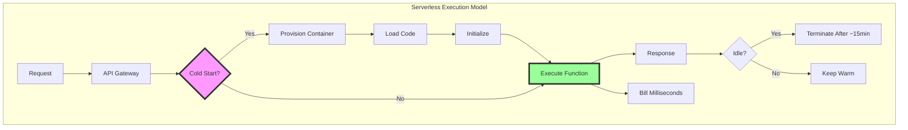
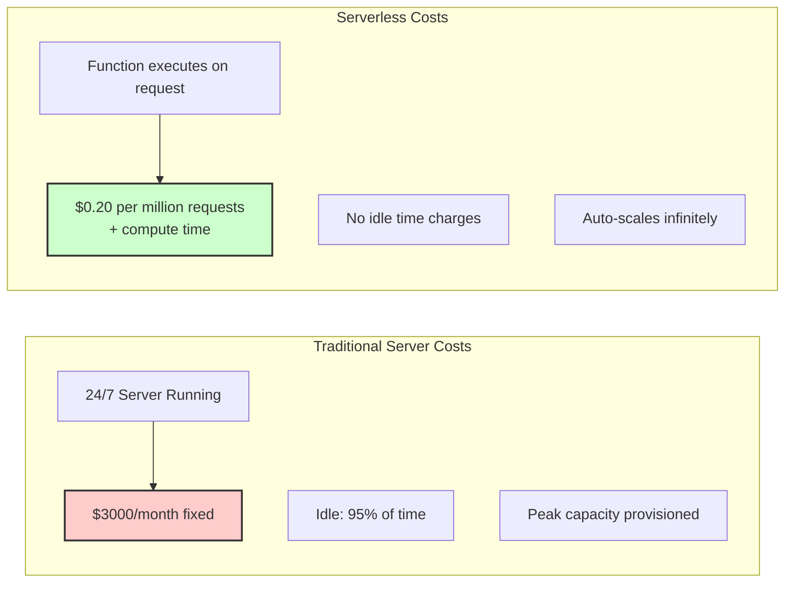
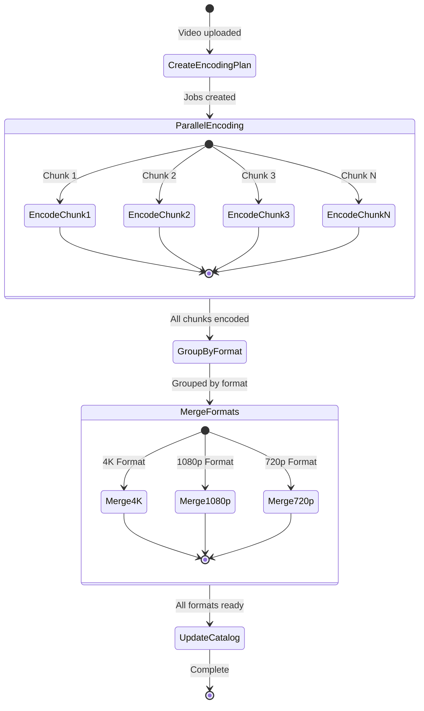
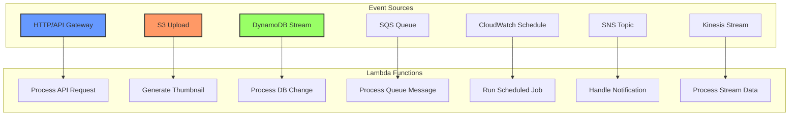

<!-- Navigation -->
[Home](../introduction/index.md) → [Part III: Patterns](index.md) → **Serverless/FaaS**

# Serverless/FaaS (Function-as-a-Service)

**The cloud's promise fulfilled: infinite scale, zero servers, pay-per-millisecond**

> *"Serverless is about running code, not managing infrastructure. It's the difference between owning a power plant and plugging into the grid."*

---

## 🎯 Level 1: Intuition

### The Restaurant Kitchen Analogy

```
Traditional Server (Restaurant):          Serverless (Food Truck Rally):

🏢 Own Kitchen                           🚚 Food Trucks
- Fixed costs (rent, staff)             - Appear on demand
- Always running                         - Pay per meal
- Limited by kitchen size                - Scale with crowd
- You manage everything                  - Just cook

Your Server:                             Serverless:
- Monthly rental: $1000                  - Per request: $0.0000002
- Idle time: 95%                        - Idle time: 0%
- Scale: Buy more servers               - Scale: Automatic
- Ops team: Required                    - Ops team: Not needed
```

```
Traditional Architecture:                 Serverless Architecture:

     Load Balancer                             API Gateway
         ↓                                         ↓
    ┌────────────┐                           ╔═══════════╗
    │  Server 1  │ ← Always On               ║ Function  ║ ← Invoked
    │  Server 2  │ ← Paying                  ║ Container ║ ← On-demand
    │  Server 3  │ ← For Idle                ╚═══════════╝ ← Auto-scales
    └────────────┘                                         ← Pay per ms

Cost: $3000/month                        Cost: $0.20 per million requests
Scale: Manual                             Scale: 0 → 1000000 automatically
```

### Real-World Examples

| Company | Use Case | Impact |
|---------|----------|---------|
| **Netflix** | Video encoding | 0 → 1000s encoders in seconds |
| **iRobot** | 100% serverless backend | 90% cost reduction |
| **Coca-Cola** | Vending machine payments | Pay only when someone buys |
| **FINRA** | 500 billion validations/day | 50% cost savings |
| **The Seattle Times** | Image resizing | From $1500/month to $15/month |

### Basic Implementation

```python
# AWS Lambda function - the simplest serverless
def lambda_handler(event, context):
    """
    This function only exists when called
    Billed by millisecond of execution
    """
    
    name = event.get('name', 'World')
    greeting = f"Hello, {name}!"
    
    if 'premium' in event:
        greeting += " 🌟 Welcome, premium user!"
    
    return {
        'statusCode': 200,
        'body': json.dumps({
            'message': greeting,
            'executionTime': context.get_remaining_time_in_millis(),
            'requestId': context.request_id
        })
    }

# Example: Image thumbnail service
def create_thumbnail(event, context):
    """Automatically scales with S3 uploads"""
    
    bucket = event['Records'][0]['s3']['bucket']['name']
    key = event['Records'][0]['s3']['object']['key']
    
    s3 = boto3.client('s3')
    image = s3.get_object(Bucket=bucket, Key=key)
    
    img = Image.open(image['Body'])
    img.thumbnail((128, 128))
    
    thumbnail_key = f"thumbnails/{key}"
    img.save(f"/tmp/{thumbnail_key}")
    s3.upload_file(f"/tmp/{thumbnail_key}", bucket, thumbnail_key)
    
    return {'statusCode': 200, 'body': 'Thumbnail created'}

# Deploy: serverless deploy
# Pricing: 0 uploads = $0, 1M uploads = ~$20
```

---

## 🏗️ Level 2: Foundation

### Core Concepts



### Serverless Cost Comparison



### Serverless Patterns

#### 1. Request-Response Pattern

```python
class ServerlessAPI:
    """RESTful API without servers"""
    
    def __init__(self):
        self.routes = {}
        self.middleware = []
        
    def route(self, path: str, method: str = 'GET'):
        """Decorator for route registration"""
        def decorator(func):
            self.routes[f"{method} {path}"] = func
            return func
        return decorator
    
    def use(self, middleware):
        """Add middleware"""
        self.middleware.append(middleware)
        
    def handle(self, event, context):
        """Main Lambda handler"""
        
        # Extract HTTP info
        method = event['httpMethod']
        path = event['path']
        route_key = f"{method} {path}"
        
        # Run middleware
        for mw in self.middleware:
            event = mw(event, context)
            if event is None:
                return {'statusCode': 401, 'body': 'Unauthorized'}
        
        # Find and execute handler
        if route_key in self.routes:
            try:
                result = self.routes[route_key](event, context)
                return {
                    'statusCode': 200,
                    'headers': {
                        'Content-Type': 'application/json',
                        'X-Request-Id': context.request_id
                    },
                    'body': json.dumps(result)
                }
            except Exception as e:
                return {
                    'statusCode': 500,
                    'body': json.dumps({'error': str(e)})
                }
        
        return {'statusCode': 404, 'body': 'Not Found'}

# Usage
api = ServerlessAPI()

@api.route('/users', 'GET')
def list_users(event, context):
    # This only runs when someone calls GET /users
    # No server running 24/7
    return {'users': fetch_users_from_db()}

@api.route('/users', 'POST')
def create_user(event, context):
    user_data = json.loads(event['body'])
    user = create_user_in_db(user_data)
    return {'user': user}

# Deploy as Lambda handler
lambda_handler = api.handle
```

#### 2. Event-Driven Pattern

```python
class EventDrivenProcessor:
    """Process events from various sources"""
    
    def __init__(self):
        self.handlers = {}
        
    def on(self, event_source: str):
        """Register event handler"""
        def decorator(func):
            self.handlers[event_source] = func
            return func
        return decorator
    
    def process(self, event, context):
        """Route events to handlers"""
        
        # Identify event source
        if 'Records' in event:
            record = event['Records'][0]
            
            if 's3' in record:
                return self.handlers['s3'](event, context)
            elif 'Sns' in record:
                return self.handlers['sns'](event, context)
            elif 'eventSource' in record:
                source = record['eventSource']
                if source == 'aws:dynamodb':
                    return self.handlers['dynamodb'](event, context)
                elif source == 'aws:sqs':
                    return self.handlers['sqs'](event, context)
        
        # API Gateway event
        if 'httpMethod' in event:
            return self.handlers['http'](event, context)
        
        # CloudWatch scheduled event
        if 'source' in event and event['source'] == 'aws.events':
            return self.handlers['schedule'](event, context)

# Usage
processor = EventDrivenProcessor()

@processor.on('s3')
def handle_file_upload(event, context):
    """Triggered by S3 uploads"""
    for record in event['Records']:
        bucket = record['s3']['bucket']['name']
        key = record['s3']['object']['key']
        
        # Process file (resize image, scan virus, etc.)
        process_file(bucket, key)
    
    return {'processed': len(event['Records'])}

@processor.on('dynamodb')
def handle_db_change(event, context):
    """Triggered by DynamoDB streams"""
    for record in event['Records']:
        if record['eventName'] == 'INSERT':
            # New item added
            send_welcome_email(record['dynamodb']['NewImage'])
        elif record['eventName'] == 'MODIFY':
            # Item updated
            sync_to_elasticsearch(record['dynamodb']['NewImage'])

@processor.on('schedule')
def handle_cron(event, context):
    """Runs on schedule (cron)"""
    # Only pay when it runs!
    cleanup_old_data()
    send_daily_reports()
```

#### 3. Stream Processing Pattern

```python
class StreamProcessor:
    """Process streaming data serverlessly"""
    
    def __init__(self, checkpoint_table: str):
        self.checkpoint_table = checkpoint_table
        self.dynamodb = boto3.resource('dynamodb')
        
    def process_kinesis_stream(self, event, context):
        """Process Kinesis data records"""
        
        batch_failures = []
        
        for record in event['Records']:
            try:
                # Decode data
                data = json.loads(
                    base64.b64decode(record['kinesis']['data']).decode('utf-8')
                )
                
                # Process based on data type
                if data['type'] == 'click':
                    self.process_click(data)
                elif data['type'] == 'purchase':
                    self.process_purchase(data)
                
                # Checkpoint progress
                self.save_checkpoint(
                    record['kinesis']['sequenceNumber'],
                    record['eventSourceARN']
                )
                
            except Exception as e:
                # Report batch item failure
                batch_failures.append({
                    'itemIdentifier': record['kinesis']['sequenceNumber']
                })
                
        return {'batchItemFailures': batch_failures}
    
    def process_click(self, click_data: dict):
        """Process click events"""
        # Update real-time analytics
        self.update_metrics('clicks', click_data)
        
        # Trigger personalization
        if click_data.get('user_id'):
            self.update_user_profile(click_data)
    
    def save_checkpoint(self, sequence: str, stream: str):
        """Save processing checkpoint"""
        table = self.dynamodb.Table(self.checkpoint_table)
        table.put_item(Item={
            'stream': stream,
            'sequence': sequence,
            'timestamp': int(time.time())
        })
```

### Cold Start Optimization

```python
class ColdStartOptimizer:
    """Minimize cold start impact"""
    
    # Global scope - reused across invocations
    _connections = {}
    _initialized = False
    _models = {}
    
    @classmethod
    def get_connection(cls, name: str, factory: callable):
        """Connection pooling across invocations"""
        if name not in cls._connections:
            print(f"Cold start: Creating {name} connection")
            cls._connections[name] = factory()
        return cls._connections[name]
    
    @classmethod
    def initialize_once(cls, init_func: callable):
        """Run expensive initialization once"""
        if not cls._initialized:
            print("Cold start: Running initialization")
            init_func()
            cls._initialized = True
    
    @classmethod
    def lazy_load_model(cls, model_name: str, loader: callable):
        """Lazy load ML models"""
        if model_name not in cls._models:
            print(f"Cold start: Loading model {model_name}")
            cls._models[model_name] = loader()
        return cls._models[model_name]

# Optimized handler
def optimized_handler(event, context):
    # Reuse database connection
    db = ColdStartOptimizer.get_connection(
        'postgres',
        lambda: psycopg2.connect(os.environ['DATABASE_URL'])
    )
    
    # Initialize once
    ColdStartOptimizer.initialize_once(lambda: {
        # Warm up libraries
        import numpy as np
        import pandas as pd
        # Pre-compile regex
        globals()['email_regex'] = re.compile(r'^[\w\.-]+@[\w\.-]+\.\w+$')
    })
    
    # Lazy load model
    if 'predict' in event:
        model = ColdStartOptimizer.lazy_load_model(
            'sentiment',
            lambda: joblib.load('/opt/models/sentiment.pkl')
        )
        prediction = model.predict([event['text']])
        return {'sentiment': prediction[0]}
    
    # Regular processing with warm resources
    return process_request(event, db)
```

---

## 🔧 Level 3: Deep Dive

### Advanced Patterns

#### Step Functions Orchestration

```python
class ServerlessWorkflow:
    """Complex workflows with Step Functions"""
    
    def __init__(self, name: str):
        self.name = name
        self.definition = {
            'Comment': f'{name} serverless workflow',
            'StartAt': None,
            'States': {}
        }
    
    def add_lambda_task(self, name: str, function_arn: str, 
                       next_state: str = None, retry: list = None):
        """Add Lambda function task"""
        
        task = {
            'Type': 'Task',
            'Resource': function_arn,
            'End': next_state is None
        }
        
        if next_state:
            task['Next'] = next_state
            
        if retry:
            task['Retry'] = retry
        else:
            # Default retry configuration
            task['Retry'] = [{
                'ErrorEquals': ['States.TaskFailed'],
                'IntervalSeconds': 2,
                'MaxAttempts': 3,
                'BackoffRate': 2.0
            }]
        
        self.definition['States'][name] = task
        
        if not self.definition['StartAt']:
            self.definition['StartAt'] = name
    
    def add_parallel(self, name: str, branches: list, next_state: str = None):
        """Add parallel execution"""
        
        self.definition['States'][name] = {
            'Type': 'Parallel',
            'Branches': branches,
            'End': next_state is None
        }
        
        if next_state:
            self.definition['States'][name]['Next'] = next_state
    
    def add_map(self, name: str, items_path: str, iterator: dict, 
                max_concurrency: int = 40):
        """Add map state for array processing"""
        
        self.definition['States'][name] = {
            'Type': 'Map',
            'ItemsPath': items_path,
            'Iterator': iterator,
            'MaxConcurrency': max_concurrency
        }
    
    def add_choice(self, name: str, choices: list, default: str):
        """Add conditional branching"""
        
        self.definition['States'][name] = {
            'Type': 'Choice',
            'Choices': choices,
            'Default': default
        }

# Example: Order processing workflow
def create_order_workflow():
    workflow = ServerlessWorkflow('OrderProcessing')
    
    # Step 1: Validate order
    workflow.add_lambda_task(
        'ValidateOrder',
        'arn:aws:lambda:region:account:function:validate-order',
        next_state='CheckInventory'
    )
    
    # Step 2: Check inventory (parallel checks)
    workflow.add_parallel('CheckInventory', [
        {
            'StartAt': 'CheckWarehouse1',
            'States': {
                'CheckWarehouse1': {
                    'Type': 'Task',
                    'Resource': 'arn:aws:lambda:region:account:function:check-warehouse',
                    'Parameters': {'warehouse': 'us-east-1'},
                    'End': True
                }
            }
        },
        {
            'StartAt': 'CheckWarehouse2',
            'States': {
                'CheckWarehouse2': {
                    'Type': 'Task',
                    'Resource': 'arn:aws:lambda:region:account:function:check-warehouse',
                    'Parameters': {'warehouse': 'us-west-2'},
                    'End': True
                }
            }
        }
    ], next_state='ProcessPayment')
    
    # Step 3: Process payment with choice
    workflow.add_lambda_task(
        'ProcessPayment',
        'arn:aws:lambda:region:account:function:process-payment',
        next_state='PaymentChoice'
    )
    
    workflow.add_choice('PaymentChoice', [
        {
            'Variable': '$.payment.status',
            'StringEquals': 'APPROVED',
            'Next': 'FulfillOrder'
        },
        {
            'Variable': '$.payment.status',
            'StringEquals': 'DECLINED',
            'Next': 'HandleDecline'
        }
    ], default='HandleError')
    
    # Success path
    workflow.add_lambda_task(
        'FulfillOrder',
        'arn:aws:lambda:region:account:function:fulfill-order'
    )
    
    # Failure paths
    workflow.add_lambda_task(
        'HandleDecline',
        'arn:aws:lambda:region:account:function:handle-decline'
    )
    
    workflow.add_lambda_task(
        'HandleError',
        'arn:aws:lambda:region:account:function:handle-error'
    )
    
    return workflow
```

#### Serverless Event Sourcing

```python
class ServerlessEventStore:
    """Event sourcing with DynamoDB and Lambda"""
    
    def __init__(self, table_name: str):
        self.table_name = table_name
        self.dynamodb = boto3.resource('dynamodb')
        self.table = self.dynamodb.Table(table_name)
        
    def append_event(self, aggregate_id: str, event_type: str, 
                    event_data: dict, version: int):
        """Append event to stream"""
        
        event = {
            'aggregate_id': aggregate_id,
            'version': version,
            'event_type': event_type,
            'event_data': event_data,
            'timestamp': int(time.time() * 1000),
            'event_id': str(uuid4())
        }
        
        try:
            # Conditional put for optimistic concurrency
            self.table.put_item(
                Item=event,
                ConditionExpression='attribute_not_exists(aggregate_id) AND attribute_not_exists(version)'
            )
        except ClientError as e:
            if e.response['Error']['Code'] == 'ConditionalCheckFailedException':
                raise ConcurrencyError('Version conflict')
            raise
        
        # Trigger projections via DynamoDB Streams
        return event
    
    def get_events(self, aggregate_id: str, from_version: int = 0):
        """Retrieve events for aggregate"""
        
        response = self.table.query(
            KeyConditionExpression='aggregate_id = :id AND version > :v',
            ExpressionAttributeValues={
                ':id': aggregate_id,
                ':v': from_version
            }
        )
        
        return response['Items']

class ProjectionHandler:
    """Handle event projections serverlessly"""
    
    def __init__(self):
        self.projections = {}
        
    def register(self, event_type: str, handler: callable):
        """Register projection handler"""
        self.projections[event_type] = handler
        
    def handle_stream(self, event, context):
        """Process DynamoDB stream records"""
        
        for record in event['Records']:
            if record['eventName'] != 'INSERT':
                continue
                
            # New event added
            event_data = record['dynamodb']['NewImage']
            event_type = event_data['event_type']['S']
            
            if event_type in self.projections:
                # Unmarshal DynamoDB format
                clean_event = {
                    'aggregate_id': event_data['aggregate_id']['S'],
                    'version': int(event_data['version']['N']),
                    'event_type': event_type,
                    'event_data': json.loads(event_data['event_data']['S']),
                    'timestamp': int(event_data['timestamp']['N'])
                }
                
                # Update projection
                self.projections[event_type](clean_event)

# Example projections
projections = ProjectionHandler()

@projections.register('OrderCreated')
def project_order_created(event):
    # Update read model in DynamoDB
    table = boto3.resource('dynamodb').Table('OrderProjections')
    table.put_item(Item={
        'order_id': event['aggregate_id'],
        'status': 'CREATED',
        'created_at': event['timestamp'],
        **event['event_data']
    })

@projections.register('PaymentProcessed')
def project_payment(event):
    # Update order status
    table = boto3.resource('dynamodb').Table('OrderProjections')
    table.update_item(
        Key={'order_id': event['aggregate_id']},
        UpdateExpression='SET #status = :status, payment = :payment',
        ExpressionAttributeNames={'#status': 'status'},
        ExpressionAttributeValues={
            ':status': 'PAID',
            ':payment': event['event_data']
        }
    )
```

#### Serverless WebSockets

```python
class ServerlessWebSocket:
    """Real-time communication with API Gateway WebSockets"""
    
    def __init__(self, connections_table: str):
        self.connections_table = connections_table
        self.dynamodb = boto3.resource('dynamodb')
        self.table = self.dynamodb.Table(connections_table)
        
    def handle_connect(self, event, context):
        """Handle new WebSocket connection"""
        
        connection_id = event['requestContext']['connectionId']
        
        # Store connection
        self.table.put_item(Item={
            'connection_id': connection_id,
            'connected_at': int(time.time()),
            'user_id': event.get('queryStringParameters', {}).get('user_id')
        })
        
        return {'statusCode': 200}
    
    def handle_disconnect(self, event, context):
        """Handle WebSocket disconnection"""
        
        connection_id = event['requestContext']['connectionId']
        
        # Remove connection
        self.table.delete_item(Key={'connection_id': connection_id})
        
        return {'statusCode': 200}
    
    def handle_message(self, event, context):
        """Handle WebSocket message"""
        
        connection_id = event['requestContext']['connectionId']
        message = json.loads(event['body'])
        
        # Process message based on type
        if message['type'] == 'broadcast':
            return self.broadcast_message(
                message['data'],
                exclude=connection_id
            )
        elif message['type'] == 'direct':
            return self.send_to_user(
                message['user_id'],
                message['data']
            )
        
        return {'statusCode': 200}
    
    def broadcast_message(self, data: dict, exclude: str = None):
        """Broadcast to all connections"""
        
        # Get all connections
        connections = self.table.scan()['Items']
        
        # Send to each connection
        api_client = boto3.client('apigatewaymanagementapi',
            endpoint_url=f"https://{event['requestContext']['domainName']}/{event['requestContext']['stage']}"
        )
        
        failed_connections = []
        
        for connection in connections:
            if connection['connection_id'] == exclude:
                continue
                
            try:
                api_client.post_to_connection(
                    ConnectionId=connection['connection_id'],
                    Data=json.dumps(data).encode('utf-8')
                )
            except ClientError as e:
                if e.response['Error']['Code'] == 'GoneException':
                    # Connection no longer exists
                    failed_connections.append(connection['connection_id'])
        
        # Clean up failed connections
        for conn_id in failed_connections:
            self.table.delete_item(Key={'connection_id': conn_id})
        
        return {'statusCode': 200}
```

---

## 🚀 Level 4: Expert

### Production Case Study: Netflix's Serverless Encoding

Netflix processes millions of hours of video content using serverless architecture, scaling from 0 to thousands of encoding functions in seconds.

```python
class NetflixVideoEncoding:
    """
    Netflix's serverless video processing pipeline
    - Processes 1M+ hours of content
    - Scales to 10,000+ concurrent encoders
    - Cost reduction of 90% vs EC2
    """
    
    def __init__(self):
        self.s3 = boto3.client('s3')
        self.lambda_client = boto3.client('lambda')
        self.step_functions = boto3.client('stepfunctions')
        
    def handle_new_video(self, event, context):
        """
        Triggered by S3 upload of source video
        """
        
        # Extract video metadata
        bucket = event['Records'][0]['s3']['bucket']['name']
        key = event['Records'][0]['s3']['object']['key']
        
        # Analyze video characteristics
        video_info = self.analyze_video(bucket, key)
        
        # Determine encoding requirements
        encoding_jobs = self.create_encoding_plan(video_info)
        
        # Start Step Functions workflow
        execution = self.step_functions.start_execution(
            stateMachineArn=os.environ['ENCODING_WORKFLOW_ARN'],
            input=json.dumps({
                'source_bucket': bucket,
                'source_key': key,
                'video_info': video_info,
                'encoding_jobs': encoding_jobs
            })
        )
        
        return {
            'statusCode': 200,
            'body': json.dumps({
                'execution_arn': execution['executionArn'],
                'job_count': len(encoding_jobs)
            })
        }
    
    def create_encoding_plan(self, video_info: dict) -> list:
        """
        Create optimal encoding plan based on content
        """
        
        jobs = []
        
        # Determine required formats
        formats = self.get_required_formats(video_info)
        
        # Split video into chunks for parallel processing
        chunk_duration = 10  # seconds
        total_duration = video_info['duration']
        chunks = math.ceil(total_duration / chunk_duration)
        
        for format_config in formats:
            for chunk_idx in range(chunks):
                jobs.append({
                    'job_id': f"{format_config['name']}_{chunk_idx}",
                    'format': format_config,
                    'start_time': chunk_idx * chunk_duration,
                    'duration': min(chunk_duration, total_duration - chunk_idx * chunk_duration),
                    'chunk_index': chunk_idx,
                    'total_chunks': chunks
                })
        
        return jobs
    
    def encode_chunk(self, event, context):
        """
        Individual encoding function
        Runs in parallel for each chunk
        """
        
        job = event['job']
        
        # Download chunk from S3
        input_path = f"/tmp/input_{job['job_id']}.mp4"
        self.download_chunk(
            event['source_bucket'],
            event['source_key'],
            input_path,
            job['start_time'],
            job['duration']
        )
        
        # Encode using FFmpeg layer
        output_path = f"/tmp/output_{job['job_id']}.mp4"
        self.run_ffmpeg_encoding(
            input_path,
            output_path,
            job['format']
        )
        
        # Upload encoded chunk
        output_key = f"encoded/{event['execution_id']}/{job['job_id']}.mp4"
        self.s3.upload_file(
            output_path,
            event['output_bucket'],
            output_key
        )
        
        # Clean up
        os.remove(input_path)
        os.remove(output_path)
        
        return {
            'job_id': job['job_id'],
            'output_key': output_key,
            'chunk_index': job['chunk_index'],
            'encoding_time': context.get_remaining_time_in_millis()
        }
    
    def merge_chunks(self, event, context):
        """
        Merge encoded chunks into final output
        """
        
        chunks = sorted(event['chunks'], key=lambda x: x['chunk_index'])
        format_name = event['format']['name']
        
        # Create concat file
        concat_file = f"/tmp/concat_{format_name}.txt"
        with open(concat_file, 'w') as f:
            for chunk in chunks:
                # Download chunk
                local_path = f"/tmp/chunk_{chunk['chunk_index']}.mp4"
                self.s3.download_file(
                    event['output_bucket'],
                    chunk['output_key'],
                    local_path
                )
                f.write(f"file '{local_path}'\n")
        
        # Merge with FFmpeg
        output_path = f"/tmp/final_{format_name}.mp4"
        subprocess.run([
            'ffmpeg', '-f', 'concat', '-safe', '0',
            '-i', concat_file, '-c', 'copy', output_path
        ], check=True)
        
        # Upload final output
        final_key = f"final/{event['video_id']}/{format_name}.mp4"
        self.s3.upload_file(
            output_path,
            event['output_bucket'],
            final_key
        )
        
        # Cleanup chunks
        for chunk in chunks:
            self.s3.delete_object(
                Bucket=event['output_bucket'],
                Key=chunk['output_key']
            )
        
        return {
            'format': format_name,
            'output_key': final_key,
            'total_chunks': len(chunks)
        }

# Encoding workflow definition
def create_encoding_workflow():
    return {
        "Comment": "Netflix-style video encoding workflow",
        "StartAt": "CreateEncodingPlan",
        "States": {
            "CreateEncodingPlan": {
                "Type": "Task",
                "Resource": "arn:aws:lambda:function:create-encoding-plan",
                "Next": "ParallelEncoding"
            },
            "ParallelEncoding": {
                "Type": "Map",
                "ItemsPath": "$.encoding_jobs",
                "MaxConcurrency": 1000,  # Process up to 1000 chunks in parallel!
                "Iterator": {
                    "StartAt": "EncodeChunk",
                    "States": {
                        "EncodeChunk": {
                            "Type": "Task",
                            "Resource": "arn:aws:lambda:function:encode-chunk",
                            "Retry": [{
                                "ErrorEquals": ["States.TaskFailed"],
                                "IntervalSeconds": 2,
                                "MaxAttempts": 3,
                                "BackoffRate": 2.0
                            }],
                            "End": True
                        }
                    }
                },
                "Next": "GroupByFormat"
            },
            "GroupByFormat": {
                "Type": "Task",
                "Resource": "arn:aws:lambda:function:group-by-format",
                "Next": "MergeFormats"
            },
            "MergeFormats": {
                "Type": "Map",
                "ItemsPath": "$.formats",
                "Iterator": {
                    "StartAt": "MergeChunks",
                    "States": {
                        "MergeChunks": {
                            "Type": "Task",
                            "Resource": "arn:aws:lambda:function:merge-chunks",
                            "End": True
                        }
                    }
                },
                "Next": "UpdateCatalog"
            },
            "UpdateCatalog": {
                "Type": "Task",
                "Resource": "arn:aws:lambda:function:update-catalog",
                "End": True
            }
        }
    }
```

### Step Functions Workflow Visualization



### Performance Optimization

```python
class ServerlessPerformance:
    """Advanced performance optimization techniques"""
    
    @staticmethod
    def optimize_package_size():
        """Minimize deployment package"""
        
        return {
            'use_layers': {
                'numpy_layer': 'arn:aws:lambda:region:account:layer:numpy:1',
                'pandas_layer': 'arn:aws:lambda:region:account:layer:pandas:1',
                'shared_code': 'arn:aws:lambda:region:account:layer:shared:1'
            },
            'exclude_files': [
                '*.pyc', '__pycache__', '.git', 'tests/',
                'docs/', '*.md', '.env'
            ],
            'tree_shaking': True,
            'minify_code': True
        }
    
    @staticmethod
    def implement_caching():
        """Multi-level caching strategy"""
        
        class ServerlessCache:
            def __init__(self):
                # In-memory cache (survives warm starts)
                self._memory_cache = {}
                
                # ElastiCache for cross-function cache
                self.redis = redis.Redis(
                    host=os.environ['REDIS_HOST'],
                    decode_responses=True
                )
                
                # S3 for large objects
                self.s3 = boto3.client('s3')
                self.cache_bucket = os.environ['CACHE_BUCKET']
            
            def get(self, key: str, cache_level: str = 'all'):
                """Get from cache with fallback"""
                
                # Level 1: Memory
                if cache_level in ['memory', 'all']:
                    if key in self._memory_cache:
                        return self._memory_cache[key]
                
                # Level 2: Redis
                if cache_level in ['redis', 'all']:
                    value = self.redis.get(key)
                    if value:
                        self._memory_cache[key] = value
                        return value
                
                # Level 3: S3
                if cache_level in ['s3', 'all']:
                    try:
                        response = self.s3.get_object(
                            Bucket=self.cache_bucket,
                            Key=f"cache/{key}"
                        )
                        value = response['Body'].read().decode('utf-8')
                        
                        # Backfill other caches
                        self._memory_cache[key] = value
                        self.redis.setex(key, 3600, value)
                        
                        return value
                    except:
                        pass
                
                return None
            
            def set(self, key: str, value: any, ttl: int = 3600):
                """Set in all cache levels"""
                
                # Memory
                self._memory_cache[key] = value
                
                # Redis
                self.redis.setex(key, ttl, value)
                
                # S3 for large values
                if len(str(value)) > 1024:  # 1KB threshold
                    self.s3.put_object(
                        Bucket=self.cache_bucket,
                        Key=f"cache/{key}",
                        Body=str(value).encode('utf-8'),
                        Metadata={'ttl': str(ttl)}
                    )
        
        return ServerlessCache()
    
    @staticmethod
    def async_initialization():
        """Initialize resources asynchronously"""
        
        class AsyncInitializer:
            def __init__(self):
                self._futures = {}
                self._executor = concurrent.futures.ThreadPoolExecutor(max_workers=5)
            
            def initialize_async(self, name: str, init_func: callable):
                """Start initialization in background"""
                if name not in self._futures:
                    self._futures[name] = self._executor.submit(init_func)
            
            def get_resource(self, name: str):
                """Get resource, waiting if necessary"""
                if name in self._futures:
                    return self._futures[name].result()
                return None
        
        # Usage
        initializer = AsyncInitializer()
        
        # Start loading in parallel during cold start
        initializer.initialize_async('db', lambda: psycopg2.connect(DB_URL))
        initializer.initialize_async('ml_model', lambda: joblib.load(MODEL_PATH))
        initializer.initialize_async('config', lambda: load_config_from_s3())
        
        def handler(event, context):
            # Resources load in parallel, retrieved when needed
            db = initializer.get_resource('db')
            model = initializer.get_resource('ml_model')
            config = initializer.get_resource('config')
            
            return process_request(event, db, model, config)
```

---

## 🎯 Level 5: Mastery

### Theoretical Foundations

#### Serverless Economics

```python
class ServerlessEconomics:
    """
    Mathematical models for serverless cost optimization
    """
    
    def calculate_breakeven_point(self, 
                                 server_cost_monthly: float,
                                 lambda_cost_per_million: float = 0.20,
                                 lambda_memory_gb: float = 0.5) -> dict:
        """
        Calculate when serverless becomes cheaper than servers
        
        Cost_server = Fixed monthly cost
        Cost_lambda = Requests * Duration * Memory * Price
        """
        
        # Lambda pricing model
        # $0.20 per 1M requests
        # $0.0000166667 per GB-second
        
        request_cost = lambda_cost_per_million / 1_000_000
        compute_cost_per_ms = (lambda_memory_gb * 0.0000166667) / 1000
        
        # Server assumptions
        server_requests_per_second = 1000  # Typical server capacity
        server_uptime_seconds = 30 * 24 * 3600  # Monthly seconds
        
        # Breakeven calculation
        # server_cost = lambda_requests * request_cost + lambda_compute_time * compute_cost
        
        # Assuming average execution time
        avg_execution_times = [10, 50, 100, 500, 1000]  # ms
        
        breakeven_points = {}
        
        for exec_time in avg_execution_times:
            # Total lambda cost = request cost + compute cost
            lambda_cost_per_request = request_cost + (exec_time * compute_cost_per_ms)
            
            # Breakeven requests per month
            breakeven_requests = server_cost_monthly / lambda_cost_per_request
            
            # Convert to requests per second
            breakeven_rps = breakeven_requests / server_uptime_seconds
            
            # Utilization at breakeven
            utilization = (breakeven_rps / server_requests_per_second) * 100
            
            breakeven_points[f'{exec_time}ms'] = {
                'requests_per_month': int(breakeven_requests),
                'requests_per_second': round(breakeven_rps, 2),
                'server_utilization_percent': round(utilization, 2),
                'monthly_cost': server_cost_monthly
            }
        
        return breakeven_points
    
    def optimize_memory_allocation(self, 
                                  execution_profiles: list,
                                  memory_sizes: list = None) -> dict:
        """
        Find optimal memory allocation for cost/performance
        
        In Lambda: More memory = More CPU = Faster execution
        But: More memory = Higher cost per ms
        
        Optimize: min(memory_cost * execution_time)
        """
        
        if not memory_sizes:
            memory_sizes = [128, 256, 512, 1024, 1536, 2048, 3008]
        
        results = []
        
        for memory in memory_sizes:
            # CPU scales linearly with memory
            cpu_multiplier = memory / 1769  # 1769MB = 1 vCPU
            
            # Estimate execution time (inverse relationship)
            base_time = execution_profiles[0]['duration_ms']
            estimated_time = base_time / cpu_multiplier
            
            # Calculate cost
            gb_seconds = (memory / 1024) * (estimated_time / 1000)
            compute_cost = gb_seconds * 0.0000166667
            request_cost = 0.0000002  # $0.20 per million
            total_cost = compute_cost + request_cost
            
            results.append({
                'memory_mb': memory,
                'estimated_duration_ms': round(estimated_time, 2),
                'cost_per_invocation': round(total_cost * 1000, 6),  # in millicents
                'cost_performance_ratio': round(total_cost * estimated_time, 8)
            })
        
        # Find optimal configuration
        optimal = min(results, key=lambda x: x['cost_performance_ratio'])
        
        return {
            'configurations': results,
            'optimal': optimal,
            'savings_vs_max_memory': round(
                (results[-1]['cost_per_invocation'] - optimal['cost_per_invocation']) / 
                results[-1]['cost_per_invocation'] * 100, 2
            )
        }
```

#### Queueing Theory for Serverless

```python
class ServerlessQueueingTheory:
    """
    Apply queueing theory to serverless systems
    """
    
    def model_cold_starts(self,
                         arrival_rate: float,  # requests/second
                         cold_start_time: float,  # seconds
                         warm_duration: float = 900) -> dict:  # 15 minutes
        """
        Model cold start impact using M/M/∞ queue
        
        In serverless, containers are created on demand (infinite servers)
        but with startup delay (cold start)
        """
        
        # Average number of warm containers (Little's Law)
        # L = λ * W
        avg_warm_containers = arrival_rate * warm_duration
        
        # Probability of cold start
        # Using Poisson distribution for container lifecycle
        import math
        
        # Inter-arrival time between requests to same container
        inter_arrival_time = 1 / arrival_rate if avg_warm_containers < 1 else avg_warm_containers / arrival_rate
        
        # Probability container is still warm
        p_warm = 1 - math.exp(-warm_duration / inter_arrival_time)
        p_cold = 1 - p_warm
        
        # Average latency
        avg_latency = p_cold * cold_start_time
        
        # Percentile calculations
        percentiles = {}
        for p in [50, 90, 95, 99]:
            if p/100 <= p_warm:
                percentiles[f'p{p}'] = 0  # Warm start
            else:
                percentiles[f'p{p}'] = cold_start_time  # Cold start
        
        return {
            'avg_warm_containers': round(avg_warm_containers, 2),
            'cold_start_probability': round(p_cold * 100, 2),
            'avg_additional_latency_ms': round(avg_latency * 1000, 2),
            'percentiles_ms': {k: v * 1000 for k, v in percentiles.items()},
            'recommendation': self.get_cold_start_recommendation(p_cold, arrival_rate)
        }
    
    def get_cold_start_recommendation(self, p_cold: float, arrival_rate: float) -> str:
        """Recommend cold start mitigation strategy"""
        
        if p_cold > 0.1:  # >10% cold starts
            if arrival_rate > 10:
                return "Use provisioned concurrency for predictable performance"
            else:
                return "Implement warming strategy with scheduled pings"
        elif p_cold > 0.01:  # 1-10% cold starts
            return "Optimize package size and use lighter runtime"
        else:
            return "Cold starts are negligible for your traffic pattern"
```

### Future Directions

#### Edge Functions

```python
class EdgeServerless:
    """
    Next generation: Serverless at the edge
    <10ms latency globally
    """
    
    def __init__(self):
        self.edge_locations = 200  # Global POPs
        self.max_latency_ms = 10
        
    def deploy_edge_function(self, function_code: str) -> dict:
        """
        Deploy function to all edge locations
        """
        
        # Compile to WebAssembly for portability
        wasm_module = self.compile_to_wasm(function_code)
        
        # Deploy globally
        deployment = {
            'function_id': str(uuid4()),
            'locations': [],
            'routing': 'anycast'  # Automatic nearest edge
        }
        
        for location in self.get_edge_locations():
            result = self.deploy_to_edge(location, wasm_module)
            deployment['locations'].append({
                'location': location,
                'status': result['status'],
                'latency_to_users_ms': result['latency']
            })
        
        return deployment
    
    def handle_edge_request(self, request: dict) -> dict:
        """
        Process at nearest edge location
        """
        
        # Determine user location
        user_location = self.geolocate_ip(request['ip'])
        
        # Find nearest edge
        nearest_edge = self.find_nearest_edge(user_location)
        
        # Execute with microsecond billing
        start_time = time.perf_counter_ns()
        
        result = self.execute_wasm(
            nearest_edge,
            request['function_id'],
            request['payload']
        )
        
        execution_time_us = (time.perf_counter_ns() - start_time) / 1000
        
        return {
            'result': result,
            'edge_location': nearest_edge,
            'execution_time_us': execution_time_us,
            'cost': execution_time_us * 0.0000001  # $0.10 per billion microseconds
        }
```

#### Serverless Containers

```python
class ServerlessContainers:
    """
    Full container support in serverless
    Best of both worlds
    """
    
    def create_serverless_container(self, dockerfile: str) -> dict:
        """
        Package any application as serverless
        """
        
        # Build container
        image = self.build_container(dockerfile)
        
        # Optimize for serverless
        optimized = self.optimize_container(image, {
            'strip_unnecessary': True,
            'use_slim_base': True,
            'enable_snapstart': True,  # Pre-initialized state
            'max_image_size_mb': 10240  # 10GB limit
        })
        
        # Create serverless configuration
        return {
            'image_uri': optimized['uri'],
            'memory_mb': 10240,  # Up to 10GB
            'timeout_seconds': 900,  # 15 minutes
            'concurrent_executions': 1000,
            'provisioned_concurrency': {
                'enabled': True,
                'desired_concurrent_executions': 100
            }
        }
    
    def hybrid_deployment(self):
        """
        Seamless hybrid architecture
        """
        
        return {
            'routing_rules': [
                {
                    'pattern': '/api/auth/*',
                    'target': 'lambda',  # Serverless for variable load
                    'reason': 'Highly variable traffic'
                },
                {
                    'pattern': '/api/ml/inference',
                    'target': 'container',  # Container for GPU
                    'reason': 'Requires GPU acceleration'
                },
                {
                    'pattern': '/api/reports/*',
                    'target': 'batch',  # Batch for long-running
                    'reason': 'Exceeds 15-minute limit'
                }
            ]
        }
```

### Economic Impact

```python
class ServerlessROI:
    """Calculate ROI of serverless adoption"""
    
    def calculate_migration_roi(self, current_state: dict) -> dict:
        """
        Comprehensive ROI analysis
        """
        
        # Current costs
        current_monthly = (
            current_state['server_costs'] +
            current_state['ops_team_cost'] * 0.5 +  # 50% time on servers
            current_state['downtime_cost']
        )
        
        # Projected serverless costs
        serverless_monthly = (
            self.estimate_lambda_costs(current_state['requests_per_month']) +
            current_state['ops_team_cost'] * 0.1 +  # 90% reduction in ops
            current_state['downtime_cost'] * 0.1  # 90% reduction in downtime
        )
        
        # Migration costs
        migration_cost = (
            current_state['developer_count'] * 
            160 *  # hours per month
            3 *    # months to migrate
            150    # $/hour fully loaded
        )
        
        # Calculate ROI
        monthly_savings = current_monthly - serverless_monthly
        payback_months = migration_cost / monthly_savings
        five_year_roi = (monthly_savings * 60 - migration_cost) / migration_cost * 100
        
        return {
            'current_monthly_cost': current_monthly,
            'serverless_monthly_cost': serverless_monthly,
            'monthly_savings': monthly_savings,
            'annual_savings': monthly_savings * 12,
            'migration_cost': migration_cost,
            'payback_months': round(payback_months, 1),
            'five_year_roi_percent': round(five_year_roi, 1),
            'intangible_benefits': [
                'Infinite scalability',
                'Reduced operational burden',
                'Faster time to market',
                'Improved developer productivity',
                'Built-in high availability'
            ]
        }
```

---

## 📊 Quick Reference

### Decision Framework

| Factor | Use Serverless | Use Containers/VMs |
|--------|----------------|-------------------|
| **Traffic Pattern** | Variable/Spiky | Consistent/Predictable |
| **Execution Time** | <15 minutes | >15 minutes |
| **Scaling Needs** | 0 to millions | Predictable range |
| **Cost Priority** | Pay per use | Predictable costs |
| **Ops Resources** | Limited | Available |
| **State Requirements** | Stateless | Stateful |

### Serverless Event Sources



### Implementation Checklist

- [ ] Identify stateless workloads
- [ ] Design event-driven architecture  
- [ ] Minimize deployment package
- [ ] Implement connection pooling
- [ ] Plan cold start mitigation
- [ ] Set up distributed tracing
- [ ] Configure auto-scaling limits
- [ ] Design idempotent operations
- [ ] Implement error handling
- [ ] Set up monitoring/alerting
- [ ] Plan for vendor lock-in
- [ ] Document local testing

### Common Anti-Patterns

1. **Stateful operations** - Serverless is stateless
2. **Long-running tasks** - 15-minute limit
3. **Large deployments** - Slow cold starts
4. **Synchronous chains** - Use async patterns
5. **Ignoring cold starts** - Plan for them

---

## 🎓 Key Takeaways

1. **Serverless = NoOps** - Focus on code, not infrastructure
2. **Event-driven by design** - React to events, don't poll
3. **Granular scaling** - Each request scales independently
4. **Pay per use** - True utility computing
5. **Cold starts are real** - Design around them

---

*"The best server is no server. The best ops team is no ops team. The best infrastructure is the one you never see."*

---

**Previous**: [← Saga (Distributed Transactions)](saga.md) | **Next**: [Service Discovery Pattern →](service-discovery.md)