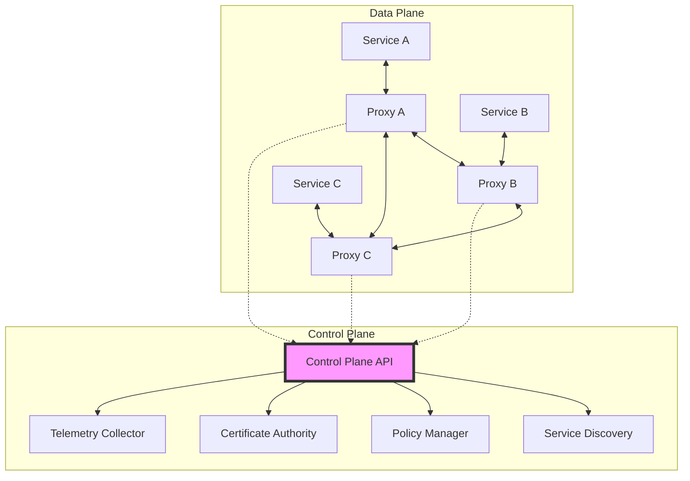

<!-- Navigation -->
[Home](../introduction/index.md) → [Part III: Patterns](index.md) → **Service Mesh**

# Service Mesh

**Infrastructure layer for managing service-to-service communication with built-in reliability, security, and observability**

> *"Service mesh is to microservices what TCP/IP is to the internet - the critical communication layer that makes everything else possible."*

---

## 🎯 Level 1: Intuition

### Core Concept

Service mesh provides a dedicated infrastructure layer that handles all service-to-service communication through intelligent proxies (sidecars) deployed alongside each service:

```
Without Service Mesh:                  With Service Mesh:

Service A ←→ Service B                Service A ← [Proxy] → [Proxy] → Service B
    ↓     ✕     ↑                              ↓         ↓
Service C ←→ Service D                         Control Plane
                                               
Each service handles:                  Proxies handle:
- Retries                             - Traffic management
- Load balancing                      - Security (mTLS)
- Authentication                      - Observability
- Monitoring                          - Resilience patterns
```

### Real-World Examples

| System | Scale | Implementation |
|--------|-------|----------------|
| **Netflix** | 1000+ services | Envoy proxy for all networking |
| **Uber** | 3000+ services | Unified service mesh |
| **Twitter** | Global scale | Linkerd standardization |
| **Airbnb** | 500+ services | Istio for consistency |

### Basic Implementation

```python
class ServiceProxy:
    """Sidecar proxy that intercepts all service traffic"""
    def intercept_request(self, target: str, request: dict) -> dict:
        # 1. Service discovery
        endpoint = self.control_plane.discover_service(target)
        
        # 2. Apply policies
        policy = self.control_plane.get_policy(self.service_name, target)
        
        # 3. Add security (mTLS)
        secure_request = self.add_security(request)
        
        # 4. Execute with resilience
        response = self.call_with_retry(
            endpoint, secure_request,
            retries=policy.get('retries', 3),
            timeout=policy.get('timeout', 5)
        )
        
        # 5. Record telemetry
        self.control_plane.record_metrics(
            source=self.service_name, target=target,
            latency=response.latency, status=response.status
        )
        
        return response

# Service focuses only on business logic
class OrderService:
    def __init__(self):
        self.proxy = ServiceProxy("order-service")
    
    def create_order(self, order_data: dict) -> dict:
        # Proxy handles all networking concerns
        inventory = self.proxy.intercept_request(
            "inventory-service",
            {"action": "reserve", "items": order_data['items']}
        )
        return {"order_id": "12345", "status": "completed"}
```

---

## 🏗️ Level 2: Foundation

### Architecture Components



| Component | Purpose | Key Functions |
|-----------|---------|---------------|
| **Sidecar Proxy** | Traffic interception | Route, secure, observe |
| **Control Plane** | Configuration management | Discovery, policy, certificates |
| **Service Registry** | Service tracking | Health, endpoints, versions |
| **Policy Engine** | Behavior definition | Traffic rules, security, resilience |

### Traffic Management

```python
class TrafficManagement:
    def configure_load_balancing(self, service: str, algorithm: str):
        algorithms = {
            'round_robin': RoundRobinLB(),
            'least_connections': LeastConnectionsLB(),
            'consistent_hash': ConsistentHashLB()
        }
        self.policies[service] = {'load_balancer': algorithms[algorithm]}
    
    def configure_retry_policy(self, service: str, config: dict):
        self.policies[service]['retry'] = {
            'attempts': config.get('attempts', 3),
            'timeout': config.get('timeout', 1000),
            'retry_on': config.get('retry_on', ['5xx', 'reset', 'timeout']),
            'backoff': {
                'type': config.get('backoff_type', 'exponential'),
                'base_interval': config.get('base_interval', 25)
            }
        }
    
    def configure_circuit_breaker(self, service: str, config: dict):
        self.policies[service]['circuit_breaker'] = {
            'consecutive_errors': config.get('consecutive_errors', 5),
            'interval': config.get('interval', 30),
            'base_ejection_time': config.get('base_ejection_time', 30)
        }

def deploy_canary(service: str, v1_weight: int, v2_weight: int) -> dict:
    """Configure canary deployment traffic split"""
    return {
        'apiVersion': 'networking.istio.io/v1beta1',
        'kind': 'VirtualService',
        'metadata': {'name': service},
        'spec': {
            'http': [{
                'route': [
                    {'destination': {'host': service, 'subset': 'v1'}, 'weight': v1_weight},
                    {'destination': {'host': service, 'subset': 'v2'}, 'weight': v2_weight}
                ]
            }]
        }
    }
```

### Security Implementation

```python
def enable_mtls(namespace: str = "default") -> dict:
    """Enable mutual TLS for all services"""
    return {
        'apiVersion': 'security.istio.io/v1beta1',
        'kind': 'PeerAuthentication',
        'metadata': {'name': 'default', 'namespace': namespace},
        'spec': {'mtls': {'mode': 'STRICT'}}
    }

def create_authorization_policy(service: str, rules: list) -> dict:
    """Fine-grained access control"""
    return {
        'apiVersion': 'security.istio.io/v1beta1',
        'kind': 'AuthorizationPolicy',
        'metadata': {'name': f'{service}-authz'},
        'spec': {
            'selector': {'matchLabels': {'app': service}},
            'rules': rules
        }
    }
```

---

## 🔧 Level 3: Deep Dive

### Advanced Traffic Management

#### A/B Testing

```python
def create_ab_test(service: str, control_route: str, experiment_route: str, header: str) -> dict:
    """Configure A/B test routing based on header"""
    return {
        'apiVersion': 'networking.istio.io/v1beta1',
        'kind': 'VirtualService',
        'metadata': {'name': f'{service}-ab-test'},
        'spec': {
            'http': [
                {
                    'match': [{'headers': {header: {'exact': 'experiment'}}}],
                    'route': [{'destination': {'host': service, 'subset': experiment_route}}]
                },
                {
                    'route': [{'destination': {'host': service, 'subset': control_route}}]
                }
            ]
        }
    }
```

#### Fault Injection

```python
def inject_fault(service: str, fault_type: str, percentage: float, value: any) -> dict:
    """Inject latency or errors for testing"""
    fault_config = {}
    if fault_type == 'delay':
        fault_config = {
            'delay': {
                'percentage': {'value': percentage},
                'fixedDelay': f"{value}ms"
            }
        }
    elif fault_type == 'abort':
        fault_config = {
            'abort': {
                'percentage': {'value': percentage},
                'httpStatus': value
            }
        }
    
    return {
        'apiVersion': 'networking.istio.io/v1beta1',
        'kind': 'VirtualService',
        'metadata': {'name': f'{service}-fault'},
        'spec': {
            'http': [{
                'fault': fault_config,
                'route': [{'destination': {'host': service}}]
            }]
        }
    }
```

### Observability

```python
def setup_golden_signals(service: str) -> dict:
    """Configure the four golden signals"""
    return {
        'latency': f'{service}_request_duration_seconds',
        'traffic': f'{service}_requests_total',
        'errors': f'{service}_errors_total',
        'saturation': f'{service}_concurrent_requests',
        'buckets': [0.005, 0.01, 0.025, 0.05, 0.1, 0.25, 0.5, 1, 2.5, 5, 10]
    }

def trace_request(request_id: str, spans: list) -> dict:
    """Analyze distributed trace"""
    return {
        'total_duration': max(s.end_time for s in spans) - min(s.start_time for s in spans),
        'service_count': len(set(s.service_name for s in spans)),
        'span_count': len(spans),
        'critical_path': identify_critical_path(spans)
    }
```

---

## 🚀 Level 4: Expert

### Production Case Study: Uber's Service Mesh

**Scale**: 3000+ microservices, 30M+ trips/day, 99.99% availability

```python
def zone_aware_routing() -> dict:
    """Configure zone-aware routing for low latency"""
    return {
        'trafficPolicy': {
            'outlierDetection': {
                'consecutiveErrors': 5,
                'interval': '30s',
                'baseEjectionTime': '30s'
            },
            'connectionPool': {
                'tcp': {'maxConnections': 100},
                'http': {
                    'http2MaxRequests': 1000,
                    'maxRequestsPerConnection': 2
                }
            },
            'loadBalancer': {
                'simple': 'ROUND_ROBIN',
                'localityLbSetting': {
                    'distribute': [
                        {'from': 'region1/zone1/*', 'to': {
                            'region1/zone1/*': 80,
                            'region1/zone2/*': 20
                        }}
                    ],
                    'failover': [{'from': 'region1', 'to': 'region2'}]
                }
            }
        }
    }

def high_volume_optimization(service: str) -> dict:
    """Optimize for 1M+ updates/second"""
    return {
        'batching': {
            'buffer_size': 100,
            'buffer_timeout_ms': 10,
            'max_batch_size_bytes': 65536
        },
        'sharding': {
            'strategy': 'consistent_hash',
            'hash_key': 'id',
            'virtual_nodes': 150
        },
        'replication': {
            'mode': 'async',
            'max_lag_ms': 1000
        }
    }
```

### Advanced Patterns

#### Multi-Cluster Mesh

```python
def setup_multi_cluster(clusters: list) -> dict:
    """Configure mesh across multiple clusters"""
    return {
        'apiVersion': 'install.istio.io/v1alpha1',
        'kind': 'IstioOperator',
        'spec': {
            'values': {
                'pilot': {
                    'env': {
                        'PILOT_ENABLE_WORKLOAD_ENTRY_AUTOREGISTRATION': True
                    }
                },
                'global': {
                    'meshID': 'mesh1',
                    'multiCluster': {
                        'clusterName': clusters[0]['name']
                    },
                    'network': clusters[0]['network']
                }
            }
        }
    }
```

### Performance Optimization

```python
def optimize_sidecar() -> dict:
    """Optimize sidecar performance"""
    return {
        'sidecarScope': {
            'egress': [{'hosts': ['./*', 'istio-system/*']}]
        },
        'proxyConfig': {
            'concurrency': 2,  # Match CPU cores
            'proxyStatsMatcher': {
                'inclusionRegexps': [
                    '.*outlier_detection.*',
                    '.*circuit_breakers.*',
                    '.*upstream_rq_retry.*'
                ]
            }
        }
    }

def smart_retry_policy() -> dict:
    """Configure intelligent retries"""
    return {
        'attempts': 3,
        'perTryTimeout': '20s',
        'retryOn': 'gateway-error,reset,retriable-4xx',
        'retryBackOff': {
            'baseInterval': '25ms',
            'maxInterval': '250ms'
        },
        'retryBudget': {
            'budgetPercent': 20,
            'minRetryConcurrency': 10
        }
    }
```

---

## 🎯 Level 5: Mastery

### Theoretical Foundations

#### CAP Theorem in Service Mesh

| Consistency Pattern | Use Case | Mechanism | Trade-off |
|-------------------|----------|-----------|----------|
| **Leader Election** | Config management | Raft consensus | Availability during election |
| **Service Discovery** | Endpoint updates | Gossip protocol | Temporary stale routes |
| **Tunable** | Per-service needs | Configurable levels | Complexity |

#### Partition Handling Strategies

- **Zone Isolation**: Continue within zone, fail cross-zone
- **Static Fallback**: Use last known good configuration  
- **Circuit Breaking**: Fast fail to prevent cascades
- **Read-Only Mode**: Allow reads, block writes

#### Performance Modeling

```python
def model_sidecar_latency(request_rate: float, service_time: float) -> dict:
    """Model service mesh overhead using M/M/1 queue"""
    proxy_overhead = 0.001  # 1ms
    utilization = request_rate * (service_time + proxy_overhead)
    
    if utilization >= 1:
        return {'error': 'System overloaded'}
    
    # Latency components (ms)
    components = {
        'serialization': 0.1,
        'policy_evaluation': 0.2,
        'routing_decision': 0.1,
        'tls_handshake': 1.0,  # amortized
        'queuing_delay': utilization / (1 - utilization) * service_time * 1000
    }
    
    return {
        'total_overhead_ms': sum(components.values()),
        'utilization': utilization,
        'breakdown': components
    }
```

### Future Directions

#### eBPF-Based Service Mesh

- **Kernel-level processing**: No sidecars needed
- **Latency**: 5-10μs overhead (vs 1-2ms for sidecars)
- **CPU overhead**: 1-2% (vs 10-20% for sidecars)
- **Capabilities**: L4 LB, connection pooling, observability

#### AI-Driven Optimization

- **Smart routing**: ML models predict optimal endpoints
- **Adaptive circuit breaking**: Anomaly detection adjusts thresholds
- **Traffic prediction**: Proactive scaling based on patterns
- **Auto-tuning**: Continuous optimization of mesh parameters

### Economic Impact

| Benefit | Typical Improvement | Annual Value |
|---------|-------------------|---------------|
| **Outage Reduction** | 70% fewer | $500K-$5M saved |
| **Developer Productivity** | 15% time saved | $300K-$3M saved |
| **Operational Efficiency** | 50% less ops work | $200K-$2M saved |
| **Time to Market** | 30% faster | Strategic value |

**Typical ROI**: 6-12 month payback, 300-500% 5-year ROI

---

## 📊 Quick Reference

### Decision Framework

| Question | Yes → Use Service Mesh | No → Alternative |
|----------|----------------------|-----------------|
| >10 microservices? | ✅ Essential for managing complexity | ⚠️ Libraries might suffice |
| Need mTLS everywhere? | ✅ Mesh provides transparently | ⚠️ API gateway for edge only |
| Complex traffic patterns? | ✅ A/B testing, canary, etc. | ⚠️ Load balancer features |
| Multi-cluster/region? | ✅ Mesh handles federation | ⚠️ Consider complexity |
| Strict observability needs? | ✅ Built-in distributed tracing | ⚠️ APM tools might work |

### Deployment Architecture

```
Data Plane:                          Control Plane:
┌─────────────────────────┐       ┌─────────────────────────┐
│ [Service] ←→ [Sidecar]  │←─────→│  Configuration API     │
│     ↓           ↓        │       │  Service Discovery     │
│ [Service] ←→ [Sidecar]  │←─────→│  Certificate Authority │
│     ↓           ↓        │       │  Policy Engine         │
│ [Service] ←→ [Sidecar]  │←─────→│  Telemetry Collector   │
└─────────────────────────┘       └─────────────────────────┘
```

### Implementation Checklist

- [ ] Choose mesh technology (Istio, Linkerd, Consul)
- [ ] Plan sidecar resources (0.1-0.5 CPU, 128-512MB per sidecar)
- [ ] Design service naming convention
- [ ] Set up observability (Prometheus, Grafana, Jaeger)
- [ ] Configure mTLS and certificate rotation
- [ ] Define traffic policies (start simple)
- [ ] Plan phased rollout (10% → 50% → 100%)
- [ ] Monitor key metrics (latency, errors, traffic)
- [ ] Train team and document procedures

---

## 🎓 Key Takeaways

1. **Service mesh is infrastructure** - Not application logic
2. **Consistency through proxies** - All traffic flows through sidecars
3. **Observability is built-in** - Traces, metrics, logs automatically
4. **Security by default** - mTLS, authorization policies
5. **Trade latency for features** - ~1ms overhead for massive benefits

---

*"The best service mesh is invisible to developers but invaluable to operations."*

---

**Previous**: [← Serverless/FaaS Pattern](serverless-faas.md) | **Next**: [Sharding Pattern →](sharding.md)