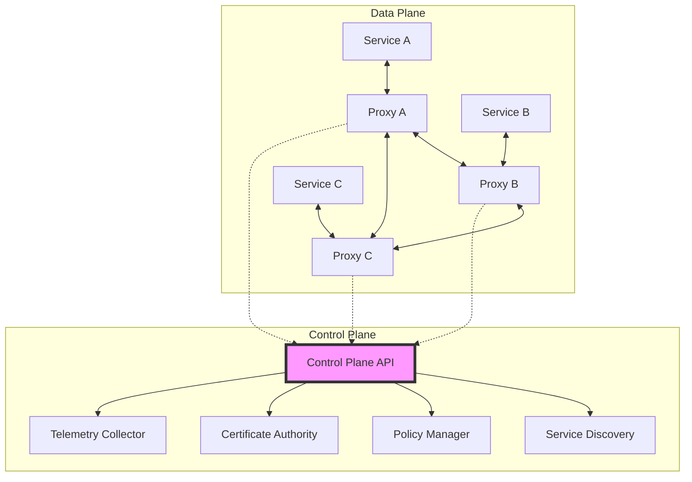

<!-- Navigation -->
[Home](../index.md) → [Part III: Patterns](index.md) → **Service Mesh**

# Service Mesh

**The invisible infrastructure layer that makes microservices actually work at scale**

> *"Service mesh is to microservices what TCP/IP is to the internet - the critical communication layer that makes everything else possible."*

---

## 🎯 Level 1: Intuition

### The City Infrastructure Analogy

Think of a service mesh like a modern city's infrastructure:

```
Traditional Approach (No Mesh):        With Service Mesh:

🏢 → 🏢 Direct roads                  🏢 ← Smart Grid → 🏢
Each building manages:                 City infrastructure provides:
- Its own power                       - ⚡ Centralized utilities
- Its own water                       - 🚦 Traffic management
- Its own security                    - 🚔 Unified security
- Its own communications              - 📊 City-wide monitoring

Result: Chaos & Duplication           Result: Efficient & Managed
```

### Visual Metaphor

```
Without Service Mesh:                  With Service Mesh:

Service A ←→ Service B                Service A ← [Proxy] → [Proxy] → Service B
    ↓     ✕     ↑                              ↓         ↓
Service C ←→ Service D                         Control Plane
                                               (Traffic rules,
Each service handles:                           Security policies,
- Retries                                      Observability)
- Load balancing
- Authentication                      Proxies handle everything,
- Monitoring                          Services focus on business logic
```

### Real-World Examples

| System | Without Mesh | With Mesh |
|--------|--------------|-----------|
| **Netflix** | Each service implements resilience | Envoy proxy handles all networking |
| **Uber** | Custom libraries in every service | Unified mesh for 3000+ services |
| **Twitter** | Finagle library dependencies | Linkerd mesh standardization |
| **Airbnb** | Service-specific networking code | Istio for consistent behavior |

### Basic Implementation

```python
# Simple service mesh proxy concept
class ServiceProxy:
    def __init__(self, service_name: str):
        self.service_name = service_name
        self.control_plane = ControlPlane()
        
    def intercept_request(self, target: str, request: dict) -> dict:
        """All network traffic goes through the proxy"""
        
        # 1. Service discovery
        endpoint = self.control_plane.discover_service(target)
        if not endpoint:
            return {"error": f"Service {target} not found"}
        
        # 2. Apply policies (retry, timeout, circuit breaker)
        policy = self.control_plane.get_policy(self.service_name, target)
        
        # 3. Security (mTLS)
        secure_request = self.add_security(request)
        
        # 4. Make the call with resilience
        response = self.call_with_retry(
            endpoint, 
            secure_request,
            retries=policy.get('retries', 3),
            timeout=policy.get('timeout', 5)
        )
        
        # 5. Collect telemetry
        self.control_plane.record_metrics(
            source=self.service_name,
            target=target,
            latency=response.latency,
            status=response.status
        )
        
        return response

# Your service just focuses on business logic
class OrderService:
    def __init__(self):
        self.proxy = ServiceProxy("order-service")
    
    def create_order(self, order_data: dict) -> dict:
        # Business logic only!
        validated_order = self.validate_order(order_data)
        
        # All networking handled by proxy
        inventory_response = self.proxy.intercept_request(
            "inventory-service",
            {"action": "reserve", "items": validated_order['items']}
        )
        
        if inventory_response['status'] == 'success':
            payment_response = self.proxy.intercept_request(
                "payment-service",
                {"action": "charge", "amount": validated_order['total']}
            )
            
        return {"order_id": "12345", "status": "completed"}
```

---

## 🏗️ Level 2: Foundation

### Core Architecture

#### Data Plane vs Control Plane



#### Key Components

| Component | Purpose | Responsibilities |
|-----------|---------|------------------|
| **Sidecar Proxy** | Intercept traffic | • Route requests<br>• Apply policies<br>• Collect metrics<br>• Handle TLS |
| **Control Plane** | Manage configuration | • Service discovery<br>• Policy distribution<br>• Certificate management<br>• Telemetry aggregation |
| **Service Registry** | Track services | • Health checking<br>• Endpoint management<br>• Version tracking |
| **Policy Engine** | Define behavior | • Traffic management<br>• Security rules<br>• Resilience patterns |

### Traffic Management Features

```python
class TrafficManagement:
    """Core traffic management capabilities"""
    
    def __init__(self):
        self.routes = []
        self.policies = {}
        
    def configure_load_balancing(self, service: str, algorithm: str):
        """Configure load balancing strategy"""
        algorithms = {
            'round_robin': RoundRobinLB(),
            'least_connections': LeastConnectionsLB(),
            'random': RandomLB(),
            'consistent_hash': ConsistentHashLB()
        }
        
        self.policies[service] = {
            'load_balancer': algorithms[algorithm]
        }
    
    def configure_retry_policy(self, service: str, config: dict):
        """Set retry behavior"""
        self.policies[service]['retry'] = {
            'attempts': config.get('attempts', 3),
            'timeout': config.get('timeout', 1000),
            'retry_on': config.get('retry_on', ['5xx', 'reset', 'timeout']),
            'backoff': {
                'type': config.get('backoff_type', 'exponential'),
                'base_interval': config.get('base_interval', 25),
                'max_interval': config.get('max_interval', 250)
            }
        }
    
    def configure_circuit_breaker(self, service: str, config: dict):
        """Set circuit breaker parameters"""
        self.policies[service]['circuit_breaker'] = {
            'consecutive_errors': config.get('consecutive_errors', 5),
            'interval': config.get('interval', 30),
            'base_ejection_time': config.get('base_ejection_time', 30),
            'max_ejection_percent': config.get('max_ejection_percent', 50)
        }

class CanaryDeployment:
    """Progressive traffic shifting"""
    
    def deploy_canary(self, service: str, versions: list):
        """
        versions = [
            {'name': 'v1', 'weight': 90},
            {'name': 'v2', 'weight': 10}
        ]
        """
        total_weight = sum(v['weight'] for v in versions)
        assert total_weight == 100, "Weights must sum to 100"
        
        # Create virtual service configuration
        return {
            'apiVersion': 'networking.istio.io/v1beta1',
            'kind': 'VirtualService',
            'metadata': {'name': service},
            'spec': {
                'http': [{
                    'match': [{'headers': {'end-user': {'exact': 'canary-tester'}}}],
                    'route': [{'destination': {'host': service, 'subset': 'v2'}}]
                }, {
                    'route': [
                        {
                            'destination': {'host': service, 'subset': v['name']},
                            'weight': v['weight']
                        } for v in versions
                    ]
                }]
            }
        }
```

### Security Implementation

```python
class ServiceMeshSecurity:
    """mTLS and authorization"""
    
    def __init__(self):
        self.ca = CertificateAuthority()
        self.policies = {}
        
    def enable_mtls(self, namespace: str = "default"):
        """Enable mutual TLS for all services"""
        return {
            'apiVersion': 'security.istio.io/v1beta1',
            'kind': 'PeerAuthentication',
            'metadata': {'name': 'default', 'namespace': namespace},
            'spec': {'mtls': {'mode': 'STRICT'}}
        }
    
    def create_authorization_policy(self, service: str, rules: list):
        """Fine-grained access control"""
        return {
            'apiVersion': 'security.istio.io/v1beta1',
            'kind': 'AuthorizationPolicy',
            'metadata': {'name': f'{service}-authz'},
            'spec': {
                'selector': {'matchLabels': {'app': service}},
                'rules': rules
            }
        }
    
    def rotate_certificates(self):
        """Automatic certificate rotation"""
        for service in self.get_all_services():
            current_cert = self.ca.get_certificate(service)
            
            if self.is_expiring_soon(current_cert):
                # Generate new certificate
                new_cert = self.ca.issue_certificate(service)
                
                # Distribute to proxies (zero downtime)
                self.distribute_certificate(service, new_cert)
                
                # Revoke old certificate after grace period
                self.schedule_revocation(current_cert, grace_period='1h')
```

---

## 🔧 Level 3: Deep Dive

### Advanced Traffic Management

#### A/B Testing Implementation

```python
class ABTestingMesh:
    """Sophisticated A/B testing through mesh"""
    
    def create_ab_test(self, config: dict):
        """
        config = {
            'service': 'recommendation-service',
            'variants': [
                {'name': 'control', 'algorithm': 'collaborative'},
                {'name': 'experiment', 'algorithm': 'neural'}
            ],
            'traffic_split': {
                'by_header': 'x-user-group',
                'rules': [
                    {'match': 'premium', 'route': 'experiment'},
                    {'match': 'regular', 'route': 'control'}
                ]
            },
            'metrics': ['latency_p99', 'conversion_rate', 'error_rate']
        }
        """
        
        # Create routing rules
        routing_config = self.generate_routing_config(config)
        
        # Set up metrics collection
        metrics_config = self.generate_metrics_config(config)
        
        # Deploy configurations
        self.control_plane.apply_config([routing_config, metrics_config])
        
        # Start monitoring
        return ABTest(
            test_id=str(uuid.uuid4()),
            config=config,
            start_time=datetime.now()
        )
    
    def analyze_ab_test(self, test_id: str) -> dict:
        """Analyze test results"""
        test = self.get_test(test_id)
        
        results = {}
        for variant in test.config['variants']:
            metrics = self.telemetry.query(
                service=test.config['service'],
                variant=variant['name'],
                start=test.start_time,
                end=datetime.now()
            )
            
            results[variant['name']] = {
                'requests': metrics['request_count'],
                'latency_p50': metrics['latency_p50'],
                'latency_p99': metrics['latency_p99'],
                'error_rate': metrics['errors'] / metrics['request_count'],
                'conversion_rate': self.calculate_conversion(variant['name'])
            }
        
        # Statistical significance
        results['statistical_analysis'] = self.calculate_significance(results)
        
        return results
```

#### Fault Injection for Chaos Engineering

```python
class FaultInjectionMesh:
    """Controlled failure injection"""
    
    def inject_latency(self, service: str, config: dict):
        """Inject latency for testing"""
        return {
            'apiVersion': 'networking.istio.io/v1beta1',
            'kind': 'VirtualService',
            'metadata': {'name': f'{service}-fault'},
            'spec': {
                'http': [{
                    'fault': {
                        'delay': {
                            'percentage': {'value': config['percentage']},
                            'fixedDelay': f"{config['delay_ms']}ms"
                        }
                    },
                    'route': [{'destination': {'host': service}}]
                }]
            }
        }
    
    def inject_errors(self, service: str, config: dict):
        """Inject HTTP errors"""
        return {
            'apiVersion': 'networking.istio.io/v1beta1',
            'kind': 'VirtualService',
            'metadata': {'name': f'{service}-errors'},
            'spec': {
                'http': [{
                    'fault': {
                        'abort': {
                            'percentage': {'value': config['percentage']},
                            'httpStatus': config['status_code']
                        }
                    },
                    'route': [{'destination': {'host': service}}]
                }]
            }
        }
    
    def network_partition(self, source: str, destination: str):
        """Simulate network partition"""
        return {
            'apiVersion': 'networking.istio.io/v1beta1',
            'kind': 'ServiceEntry',
            'metadata': {'name': f'block-{source}-to-{destination}'},
            'spec': {
                'hosts': [destination],
                'location': 'MESH_EXTERNAL',
                'resolution': 'NONE'  # Black hole traffic
            }
        }
```

### Observability Deep Dive

```python
class MeshObservability:
    """Comprehensive observability through mesh"""
    
    def __init__(self):
        self.metrics = MetricsCollector()
        self.traces = TracingSystem()
        self.logs = LogAggregator()
        
    def setup_golden_signals(self, service: str):
        """Monitor the four golden signals"""
        
        # 1. Latency
        self.metrics.create_histogram(
            name=f'{service}_request_duration',
            help='Request duration in seconds',
            buckets=[0.005, 0.01, 0.025, 0.05, 0.1, 0.25, 0.5, 1, 2.5, 5, 10]
        )
        
        # 2. Traffic
        self.metrics.create_counter(
            name=f'{service}_requests_total',
            help='Total requests',
            labels=['method', 'route', 'status']
        )
        
        # 3. Errors
        self.metrics.create_counter(
            name=f'{service}_errors_total',
            help='Total errors',
            labels=['method', 'route', 'error_type']
        )
        
        # 4. Saturation
        self.metrics.create_gauge(
            name=f'{service}_concurrent_requests',
            help='Number of concurrent requests'
        )
    
    def distributed_tracing(self, request_id: str):
        """Trace request through mesh"""
        
        # Collect all spans for request
        spans = self.traces.get_trace(request_id)
        
        # Build service graph
        service_graph = self.build_service_graph(spans)
        
        # Calculate critical path
        critical_path = self.find_critical_path(spans)
        
        # Identify bottlenecks
        bottlenecks = self.identify_bottlenecks(spans)
        
        return {
            'total_duration': self.calculate_total_duration(spans),
            'service_graph': service_graph,
            'critical_path': critical_path,
            'bottlenecks': bottlenecks,
            'span_count': len(spans)
        }
```

---

## 🚀 Level 4: Expert

### Production Case Study: Uber's Service Mesh Evolution

Uber manages 3000+ microservices handling 30M+ trips daily using a custom service mesh built on Envoy.

```python
class UberServiceMesh:
    """
    Uber's production service mesh handling:
    - 3000+ microservices
    - 30M+ trips/day
    - 99.99% availability requirement
    """
    
    def __init__(self):
        self.services = {}
        self.regional_meshes = {}
        self.global_control_plane = GlobalControlPlane()
        
    def handle_surge_pricing_calculation(self, location: dict, demand: float):
        """
        Critical path with strict latency requirements
        Must complete in < 100ms
        """
        
        # 1. Service discovery with locality preference
        pricing_service = self.discover_service(
            'surge-pricing-service',
            prefer_zone=location['zone'],
            fallback_to_region=True
        )
        
        # 2. Circuit breaker with aggressive timeouts
        with self.circuit_breaker(
            service=pricing_service,
            timeout_ms=50,
            retry_budget=0.1  # Only 10% retry budget
        ) as client:
            
            # 3. Request with deadline propagation
            response = client.calculate_surge(
                location=location,
                demand=demand,
                deadline=time.time() + 0.05  # 50ms deadline
            )
            
            # 4. Fallback to cached surge factor
            if not response or response.latency > 45:
                return self.get_cached_surge(location)
            
            return response.surge_factor
    
    def implement_zone_aware_routing(self):
        """Prefer local zone to reduce latency"""
        
        return {
            'trafficPolicy': {
                'outlierDetection': {
                    'consecutiveErrors': 5,
                    'interval': '30s',
                    'baseEjectionTime': '30s'
                },
                'connectionPool': {
                    'tcp': {'maxConnections': 100},
                    'http': {
                        'http2MaxRequests': 1000,
                        'maxRequestsPerConnection': 2
                    }
                },
                'loadBalancer': {
                    'simple': 'ROUND_ROBIN',
                    'localityLbSetting': {
                        'distribute': [
                            {'from': 'region1/zone1/*', 'to': {
                                'region1/zone1/*': 80,
                                'region1/zone2/*': 20
                            }},
                            {'from': 'region1/zone2/*', 'to': {
                                'region1/zone2/*': 80,
                                'region1/zone1/*': 20
                            }}
                        ],
                        'failover': [
                            {'from': 'region1', 'to': 'region2'}
                        ]
                    }
                }
            }
        }
    
    def handle_driver_location_updates(self):
        """
        High-volume updates: 1M+ updates/second globally
        Mesh optimizations for write-heavy workload
        """
        
        # Batch updates at proxy level
        batching_config = {
            'buffer_size': 100,
            'buffer_timeout_ms': 10,
            'max_batch_size_bytes': 64 * 1024  # 64KB
        }
        
        # Regional write sharding
        sharding_config = {
            'strategy': 'consistent_hash',
            'hash_key': 'driver_id',
            'virtual_nodes': 150
        }
        
        # Async replication to other regions
        replication_config = {
            'mode': 'async',
            'max_lag_ms': 1000,
            'conflict_resolution': 'last_write_wins'
        }
        
        return self.create_data_plane_config(
            service='location-service',
            batching=batching_config,
            sharding=sharding_config,
            replication=replication_config
        )
```

### Advanced Patterns

#### Multi-Cluster Mesh

```python
class MultiClusterMesh:
    """Mesh spanning multiple Kubernetes clusters"""
    
    def setup_multi_cluster(self, clusters: list):
        """
        clusters = [
            {'name': 'us-east-1', 'endpoint': '...', 'network': 'aws-vpc'},
            {'name': 'us-west-2', 'endpoint': '...', 'network': 'aws-vpc'},
            {'name': 'eu-west-1', 'endpoint': '...', 'network': 'aws-vpc'}
        ]
        """
        
        # 1. Establish trust between clusters
        root_ca = self.generate_root_ca()
        
        for cluster in clusters:
            # Install mesh with shared root CA
            self.install_mesh(
                cluster=cluster,
                root_ca=root_ca,
                cluster_id=cluster['name'],
                network=cluster['network']
            )
        
        # 2. Configure cross-cluster service discovery
        for cluster in clusters:
            self.enable_endpoint_discovery(
                cluster=cluster,
                remote_clusters=[c for c in clusters if c != cluster]
            )
        
        # 3. Set up intelligent routing
        self.configure_locality_routing(clusters)
        
        # 4. Enable cross-cluster load balancing
        self.setup_global_load_balancing(clusters)

class MeshFederation:
    """Federate multiple service meshes"""
    
    def federate_meshes(self, meshes: list):
        """Connect Istio, Linkerd, and Consul meshes"""
        
        federation_gateway = self.deploy_federation_gateway()
        
        for mesh in meshes:
            if mesh['type'] == 'istio':
                self.configure_istio_federation(mesh, federation_gateway)
            elif mesh['type'] == 'linkerd':
                self.configure_linkerd_federation(mesh, federation_gateway)
            elif mesh['type'] == 'consul':
                self.configure_consul_federation(mesh, federation_gateway)
```

### Performance Optimization

```python
class MeshPerformanceOptimization:
    """Optimize mesh for production scale"""
    
    def optimize_sidecar_performance(self):
        """Reduce sidecar resource usage"""
        
        return {
            # 1. Limit service visibility
            'sidecarScope': {
                'egress': [{
                    'hosts': ['./*', 'istio-system/*', 'istio-ingress/*']
                }]
            },
            
            # 2. Optimize Envoy configuration
            'proxyStatsMatcher': {
                'inclusionRegexps': [
                    '.*outlier_detection.*',
                    '.*circuit_breakers.*',
                    '.*upstream_rq_retry.*',
                    '.*upstream_rq_pending.*'
                ]
            },
            
            # 3. Tune concurrency
            'proxyConfig': {
                'concurrency': 2,  # Match CPU cores
                'proxyStatsMatcher': {
                    'inclusionRegexps': ['.*outlier_detection.*']
                }
            }
        }
    
    def implement_smart_retries(self):
        """Intelligent retry strategies"""
        
        return {
            'retryPolicy': {
                'attempts': 3,
                'perTryTimeout': '20s',
                'retryOn': 'gateway-error,reset,retriable-4xx',
                'retryRemoteLocalities': True,
                'retryBackOff': {
                    'baseInterval': '25ms',
                    'maxInterval': '250ms'
                },
                # Smart retry budgeting
                'retryBudget': {
                    'budgetPercent': 20,  # Max 20% additional load
                    'minRetryConcurrency': 10
                }
            }
        }
```

---

## 🎯 Level 5: Mastery

### Theoretical Foundations

#### CAP Theorem in Service Mesh

```python
class ServiceMeshCAP:
    """
    How service mesh handles CAP trade-offs
    """
    
    def consistency_patterns(self):
        """Mesh approaches to consistency"""
        
        return {
            # Strong consistency through leader election
            'leader_election': {
                'use_case': 'Configuration management',
                'mechanism': 'Raft consensus in control plane',
                'trade_off': 'Availability during leader election'
            },
            
            # Eventual consistency for service discovery
            'service_discovery': {
                'use_case': 'Endpoint updates',
                'mechanism': 'Gossip protocol propagation',
                'trade_off': 'Temporary routing to old endpoints'
            },
            
            # Tunable consistency for different use cases
            'tunable': {
                'use_case': 'Per-service requirements',
                'mechanism': 'Configurable consistency levels',
                'examples': {
                    'payments': 'strong',
                    'recommendations': 'eventual',
                    'analytics': 'weak'
                }
            }
        }
    
    def partition_handling(self):
        """Network partition strategies"""
        
        # Mesh behavior during partition
        strategies = {
            'zone_isolation': 'Continue within zone, fail cross-zone',
            'static_fallback': 'Use last known good configuration',
            'circuit_breaking': 'Fast fail to prevent cascades',
            'read_only_mode': 'Allow reads, block writes'
        }
        
        return self.implement_partition_strategy(strategies)
```

#### Performance Modeling

```python
import numpy as np
from scipy.stats import gamma

class MeshPerformanceModel:
    """
    Mathematical model of mesh performance
    Using queuing theory and Little's Law
    """
    
    def model_sidecar_latency(
        self,
        request_rate: float,  # requests/second
        service_time: float,  # seconds
        proxy_overhead: float = 0.001  # 1ms proxy overhead
    ) -> dict:
        """Model latency added by service mesh"""
        
        # M/M/1 queue for sidecar proxy
        utilization = request_rate * (service_time + proxy_overhead)
        
        if utilization >= 1:
            return {'error': 'System overloaded'}
        
        # Waiting time in queue (Little's Law)
        wait_time = utilization / (1 - utilization) * service_time
        
        # Total latency components
        components = {
            'serialization': 0.0001,  # 0.1ms
            'policy_evaluation': 0.0002,  # 0.2ms
            'routing_decision': 0.0001,  # 0.1ms
            'connection_pooling': 0.0001,  # 0.1ms
            'tls_handshake': 0.001,  # 1ms (amortized)
            'proxy_processing': proxy_overhead,
            'queuing_delay': wait_time
        }
        
        total_overhead = sum(components.values())
        
        return {
            'total_overhead_ms': total_overhead * 1000,
            'breakdown': {k: v * 1000 for k, v in components.items()},
            'utilization': utilization,
            'p99_latency_ms': self.calculate_p99(components) * 1000
        }
    
    def optimize_mesh_configuration(
        self,
        services: list,
        sla_requirements: dict
    ) -> dict:
        """Optimize mesh config for SLA requirements"""
        
        optimization = LinearProgramming()
        
        # Objective: Minimize total resource usage
        # Constraints: Meet SLA for each service
        
        for service in services:
            # Decision variables
            cpu_allocation = optimization.add_variable(
                f'{service}_cpu',
                lower_bound=0.1,
                upper_bound=2.0
            )
            
            memory_allocation = optimization.add_variable(
                f'{service}_memory',
                lower_bound=128,
                upper_bound=512
            )
            
            # Constraints
            optimization.add_constraint(
                f'{service}_latency',
                self.latency_model(cpu_allocation, memory_allocation) 
                <= sla_requirements[service]['latency_p99']
            )
        
        return optimization.solve()
```

### Future Directions

#### eBPF-Based Service Mesh

```python
class EBPFServiceMesh:
    """
    Next-generation kernel-level service mesh
    No sidecars, microsecond latency
    """
    
    def implement_ebpf_mesh(self):
        """In-kernel traffic management"""
        
        # Load eBPF programs
        programs = {
            'socket_filter': self.load_bpf_program('socket_filter.c'),
            'tc_ingress': self.load_bpf_program('tc_ingress.c'),
            'tc_egress': self.load_bpf_program('tc_egress.c'),
            'xdp': self.load_bpf_program('xdp_router.c')
        }
        
        # Attach to kernel hooks
        self.attach_to_cgroup(programs['socket_filter'])
        self.attach_to_tc(programs['tc_ingress'], 'ingress')
        self.attach_to_tc(programs['tc_egress'], 'egress')
        
        # Shared maps for configuration
        config_map = self.create_bpf_map(
            'config',
            key_type='u32',
            value_type='struct service_config',
            max_entries=10000
        )
        
        return {
            'latency_overhead': '5-10μs',  # Microseconds!
            'cpu_overhead': '1-2%',
            'memory_overhead': '10MB',
            'capabilities': [
                'L4 load balancing',
                'Connection pooling',
                'Circuit breaking',
                'Observability'
            ]
        }
```

#### AI-Driven Mesh Optimization

```python
class AIServiceMesh:
    """Machine learning for mesh optimization"""
    
    def train_routing_model(self, historical_data: pd.DataFrame):
        """Learn optimal routing patterns"""
        
        features = [
            'time_of_day',
            'service_latency_p50',
            'service_latency_p99',
            'error_rate',
            'cpu_usage',
            'pending_requests',
            'region',
            'instance_type'
        ]
        
        # Train model to predict best endpoint
        model = GradientBoostingRegressor()
        model.fit(
            historical_data[features],
            historical_data['request_success_time']
        )
        
        return model
    
    def adaptive_circuit_breaking(self):
        """ML-based circuit breaker tuning"""
        
        # Collect failure patterns
        failure_patterns = self.analyze_failures()
        
        # Train anomaly detection model
        anomaly_model = IsolationForest()
        anomaly_model.fit(failure_patterns)
        
        # Real-time adjustment
        def adjust_circuit_breaker(service: str, metrics: dict):
            if anomaly_model.predict([metrics]) == -1:
                # Anomaly detected, tighten thresholds
                return {
                    'consecutive_errors': 3,  # Reduced from 5
                    'interval': '10s',  # Reduced from 30s
                    'min_requests': 10
                }
            else:
                # Normal operation
                return {
                    'consecutive_errors': 5,
                    'interval': '30s',
                    'min_requests': 20
                }
```

### Economic Impact

```python
class ServiceMeshEconomics:
    """ROI analysis for service mesh adoption"""
    
    def calculate_roi(self, company_metrics: dict) -> dict:
        # Cost savings from reduced outages
        outage_reduction = 0.7  # 70% reduction
        outage_cost_saved = (
            company_metrics['outages_per_year'] * 
            outage_reduction * 
            company_metrics['cost_per_outage']
        )
        
        # Developer productivity gains
        dev_time_saved = (
            company_metrics['developers'] * 
            40 * 52 * 0.15 *  # 15% time saved
            company_metrics['dev_hourly_rate']
        )
        
        # Operational efficiency
        ops_reduction = 0.5  # 50% less ops work
        ops_cost_saved = (
            company_metrics['ops_team_size'] * 
            ops_reduction * 
            company_metrics['ops_annual_salary']
        )
        
        # Implementation costs
        implementation_cost = (
            company_metrics['services'] * 5000 +  # Per-service cost
            200000  # Fixed platform cost
        )
        
        annual_savings = (
            outage_cost_saved + 
            dev_time_saved + 
            ops_cost_saved
        )
        
        return {
            'annual_savings': annual_savings,
            'implementation_cost': implementation_cost,
            'payback_months': implementation_cost / (annual_savings / 12),
            'five_year_roi': (annual_savings * 5 - implementation_cost) / implementation_cost * 100
        }
```

---

## 📊 Quick Reference

### Decision Framework

| Question | Yes → Use Service Mesh | No → Alternative |
|----------|----------------------|-----------------|
| >10 microservices? | ✅ Essential for managing complexity | ⚠️ Libraries might suffice |
| Need mTLS everywhere? | ✅ Mesh provides transparently | ⚠️ API gateway for edge only |
| Complex traffic patterns? | ✅ A/B testing, canary, etc. | ⚠️ Load balancer features |
| Multi-cluster/region? | ✅ Mesh handles federation | ⚠️ Consider complexity |
| Strict observability needs? | ✅ Built-in distributed tracing | ⚠️ APM tools might work |

### Implementation Checklist

- [ ] Choose mesh technology (Istio, Linkerd, Consul)
- [ ] Plan sidecar resource allocation
- [ ] Design service naming convention
- [ ] Set up observability pipeline
- [ ] Configure mTLS and certificates
- [ ] Define traffic management policies
- [ ] Plan gradual rollout strategy
- [ ] Set up monitoring and alerts
- [ ] Train team on mesh concepts
- [ ] Document troubleshooting procedures

### Common Anti-Patterns

1. **Over-engineering** - Using mesh for <5 services
2. **Ignoring resource overhead** - Sidecars need CPU/memory
3. **Complex policies everywhere** - Start simple
4. **No observability strategy** - Mesh generates lots of data
5. **Big bang deployment** - Roll out gradually

---

## 🎓 Key Takeaways

1. **Service mesh is infrastructure** - Not application logic
2. **Consistency through proxies** - All traffic flows through sidecars
3. **Observability is built-in** - Traces, metrics, logs automatically
4. **Security by default** - mTLS, authorization policies
5. **Trade latency for features** - ~1ms overhead for massive benefits

---

*"The best service mesh is invisible to developers but invaluable to operations."*

---

**Previous**: [← Serverless/FaaS Pattern](serverless-faas.md) | **Next**: [Sharding Pattern →](sharding.md)