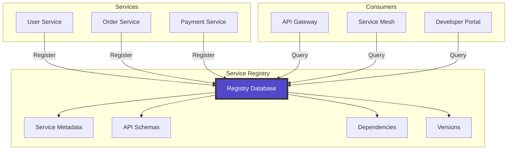
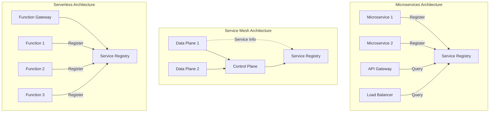

# Service Registry Pattern

**The authoritative source of truth for service metadata in distributed systems**

> *"A service without a registry is like a phone without a directory—technically functional, but practically unreachable."*

---

## 🎯 Level 1: Intuition

### Core Concept

A Service Registry is a centralized database that stores comprehensive metadata about services in a distributed system. Unlike Service Discovery (which focuses on finding running instances), the registry maintains the "contract" of each service—its schema, versions, dependencies, and operational metadata.

### Basic Implementation

```python
from typing import Dict, List, Optional, Any
from datetime import datetime
import json
from dataclasses import dataclass, asdict
from enum import Enum

class ServiceStatus(Enum):
    ACTIVE = "active"
    DEPRECATED = "deprecated"
    RETIRED = "retired"
    BETA = "beta"

@dataclass
class ServiceMetadata:
    name: str
    version: str
    status: ServiceStatus
    description: str
    owner_team: str
    api_schema: dict
    dependencies: List[str]
    endpoints: List[dict]
    documentation_url: str
    created_at: datetime
    updated_at: datetime

class SimpleServiceRegistry:
    def __init__(self):
        self.services = {}  # service_name -> versions -> metadata
        
    def register_service(self, metadata: ServiceMetadata):
        """Register a service with its metadata"""
        service_name = metadata.name
        version = metadata.version
        
        if service_name not in self.services:
            self.services[service_name] = {}
        
        self.services[service_name][version] = metadata
        print(f"Registered {service_name} v{version}")
    
    def get_service(self, name: str, version: str = None) -> Optional[ServiceMetadata]:
        """Get service metadata"""
        if name not in self.services:
            return None
        
        if version:
            return self.services[name].get(version)
        
        # Return latest version if not specified
        versions = sorted(self.services[name].keys(), reverse=True)
        return self.services[name][versions[0]] if versions else None
    
    def search_services(self, owner_team: str = None, 
                       status: ServiceStatus = None) -> List[ServiceMetadata]:
        """Search services by criteria"""
        results = []
        
        for service_versions in self.services.values():
            for metadata in service_versions.values():
                if owner_team and metadata.owner_team != owner_team:
                    continue
                if status and metadata.status != status:
                    continue
                results.append(metadata)
        
        return results

# Example usage
registry = SimpleServiceRegistry()

# Register a service
user_service = ServiceMetadata(
    name="user-service",
    version="2.1.0",
    status=ServiceStatus.ACTIVE,
    description="Manages user accounts and authentication",
    owner_team="platform-team",
    api_schema={
        "openapi": "3.0.0",
        "paths": {
            "/users": {"get": {}, "post": {}},
            "/users/{id}": {"get": {}, "put": {}, "delete": {}}
        }
    },
    dependencies=["auth-service", "notification-service"],
    endpoints=[
        {"method": "GET", "path": "/users", "description": "List users"},
        {"method": "POST", "path": "/users", "description": "Create user"}
    ],
    documentation_url="https://docs.company.com/user-service",
    created_at=datetime.now(),
    updated_at=datetime.now()
)

registry.register_service(user_service)
```

### Visual Representation



---

## 🔧 Level 2: Implementation

### Advanced Registry Features

#### 1. Schema Validation and Versioning

```python
import jsonschema
from typing import Dict, Any
import semver

class SchemaRegistry:
    def __init__(self):
        self.schemas = {}  # service -> version -> schema
        self.compatibility_rules = {}
        
    def register_schema(self, service: str, version: str, 
                       schema: dict, validate_compatibility: bool = True):
        """Register API schema with compatibility checking"""
        if service not in self.schemas:
            self.schemas[service] = {}
        
        # Validate schema format
        self._validate_schema_format(schema)
        
        # Check compatibility with previous versions
        if validate_compatibility and service in self.schemas:
            previous_versions = sorted(self.schemas[service].keys())
            if previous_versions:
                latest_version = previous_versions[-1]
                if not self._check_compatibility(
                    self.schemas[service][latest_version], 
                    schema
                ):
                    raise ValueError(f"Schema incompatible with v{latest_version}")
        
        self.schemas[service][version] = schema
        return True
    
    def _validate_schema_format(self, schema: dict):
        """Validate schema follows OpenAPI/JSON Schema format"""
        if 'openapi' in schema:
            # Validate OpenAPI schema
            required_fields = ['openapi', 'info', 'paths']
            for field in required_fields:
                if field not in schema:
                    raise ValueError(f"Missing required field: {field}")
        elif '$schema' in schema:
            # Validate JSON Schema
            jsonschema.Draft7Validator.check_schema(schema)
        else:
            raise ValueError("Unknown schema format")
    
    def _check_compatibility(self, old_schema: dict, new_schema: dict) -> bool:
        """Check backward compatibility between schemas"""
        # Check that all old endpoints still exist
        if 'paths' in old_schema and 'paths' in new_schema:
            old_paths = set(old_schema['paths'].keys())
            new_paths = set(new_schema['paths'].keys())
            
            # Removed paths break compatibility
            if old_paths - new_paths:
                return False
            
            # Check each path for compatibility
            for path in old_paths:
                old_methods = set(old_schema['paths'][path].keys())
                new_methods = set(new_schema['paths'][path].keys())
                
                # Removed methods break compatibility
                if old_methods - new_methods:
                    return False
        
        return True
    
    def get_schema_evolution(self, service: str) -> Dict[str, Any]:
        """Get schema evolution history"""
        if service not in self.schemas:
            return {}
        
        evolution = {}
        versions = sorted(self.schemas[service].keys())
        
        for i, version in enumerate(versions):
            schema = self.schemas[service][version]
            evolution[version] = {
                'endpoints': len(schema.get('paths', {})),
                'methods': sum(
                    len(methods) 
                    for methods in schema.get('paths', {}).values()
                )
            }
            
            if i > 0:
                prev_version = versions[i-1]
                prev_schema = self.schemas[service][prev_version]
                
                # Calculate changes
                old_paths = set(prev_schema.get('paths', {}).keys())
                new_paths = set(schema.get('paths', {}).keys())
                
                evolution[version]['added_endpoints'] = list(new_paths - old_paths)
                evolution[version]['removed_endpoints'] = list(old_paths - new_paths)
        
        return evolution

# Example usage
schema_registry = SchemaRegistry()

# Register schemas with versioning
v1_schema = {
    "openapi": "3.0.0",
    "info": {"title": "User API", "version": "1.0.0"},
    "paths": {
        "/users": {
            "get": {"summary": "List users"},
            "post": {"summary": "Create user"}
        }
    }
}

v2_schema = {
    "openapi": "3.0.0",
    "info": {"title": "User API", "version": "2.0.0"},
    "paths": {
        "/users": {
            "get": {"summary": "List users"},
            "post": {"summary": "Create user"}
        },
        "/users/{id}": {
            "get": {"summary": "Get user"},
            "put": {"summary": "Update user"}
        }
    }
}

schema_registry.register_schema("user-service", "1.0.0", v1_schema)
schema_registry.register_schema("user-service", "2.0.0", v2_schema)
```

#### 2. Dependency Management

```python
from typing import Set, Dict, List, Tuple
import networkx as nx

class DependencyRegistry:
    def __init__(self):
        self.dependency_graph = nx.DiGraph()
        self.service_contracts = {}
        
    def register_dependencies(self, service: str, version: str, 
                            dependencies: List[Tuple[str, str]]):
        """Register service dependencies"""
        service_id = f"{service}:{version}"
        
        # Add service node
        self.dependency_graph.add_node(service_id, 
                                     service=service, 
                                     version=version)
        
        # Add dependency edges
        for dep_service, dep_version in dependencies:
            dep_id = f"{dep_service}:{dep_version}"
            self.dependency_graph.add_edge(service_id, dep_id)
    
    def check_circular_dependencies(self) -> List[List[str]]:
        """Check for circular dependencies"""
        try:
            cycles = list(nx.simple_cycles(self.dependency_graph))
            return cycles
        except nx.NetworkXNoCycle:
            return []
    
    def get_dependency_tree(self, service: str, version: str) -> Dict:
        """Get full dependency tree for a service"""
        service_id = f"{service}:{version}"
        
        if service_id not in self.dependency_graph:
            return {}
        
        tree = {}
        
        def build_tree(node, visited=None):
            if visited is None:
                visited = set()
            
            if node in visited:
                return {"circular_reference": True}
            
            visited.add(node)
            result = {"service": node}
            
            dependencies = list(self.dependency_graph.successors(node))
            if dependencies:
                result["dependencies"] = {}
                for dep in dependencies:
                    result["dependencies"][dep] = build_tree(dep, visited.copy())
            
            return result
        
        return build_tree(service_id)
    
    def calculate_impact(self, service: str, version: str) -> Set[str]:
        """Calculate which services would be impacted by changes"""
        service_id = f"{service}:{version}"
        
        # Find all services that depend on this service
        impacted = set()
        
        for node in self.dependency_graph.nodes():
            if nx.has_path(self.dependency_graph, node, service_id):
                impacted.add(node)
        
        return impacted - {service_id}
    
    def validate_version_compatibility(self, service: str, 
                                     old_version: str, 
                                     new_version: str) -> Dict[str, Any]:
        """Validate version upgrade compatibility"""
        old_id = f"{service}:{old_version}"
        
        # Find all services depending on the old version
        dependents = [
            node for node in self.dependency_graph.predecessors(old_id)
        ]
        
        compatibility_report = {
            "service": service,
            "old_version": old_version,
            "new_version": new_version,
            "affected_services": dependents,
            "compatibility_checks": []
        }
        
        # Check semantic versioning rules
        old_v = semver.VersionInfo.parse(old_version)
        new_v = semver.VersionInfo.parse(new_version)
        
        if new_v.major > old_v.major:
            compatibility_report["breaking_change"] = True
            compatibility_report["compatibility_checks"].append({
                "rule": "major_version_change",
                "status": "incompatible",
                "message": "Major version change indicates breaking changes"
            })
        elif new_v.minor > old_v.minor:
            compatibility_report["breaking_change"] = False
            compatibility_report["compatibility_checks"].append({
                "rule": "minor_version_change",
                "status": "compatible",
                "message": "Minor version change should be backward compatible"
            })
        else:
            compatibility_report["breaking_change"] = False
            compatibility_report["compatibility_checks"].append({
                "rule": "patch_version_change",
                "status": "compatible",
                "message": "Patch version change is backward compatible"
            })
        
        return compatibility_report

# Example usage
dep_registry = DependencyRegistry()

# Register service dependencies
dep_registry.register_dependencies("api-gateway", "1.0.0", [
    ("user-service", "2.0.0"),
    ("order-service", "1.5.0")
])

dep_registry.register_dependencies("order-service", "1.5.0", [
    ("user-service", "2.0.0"),
    ("payment-service", "3.1.0"),
    ("inventory-service", "1.2.0")
])

dep_registry.register_dependencies("payment-service", "3.1.0", [
    ("user-service", "2.0.0")
])

# Check for circular dependencies
circles = dep_registry.check_circular_dependencies()
print(f"Circular dependencies: {circles}")

# Get dependency tree
tree = dep_registry.get_dependency_tree("api-gateway", "1.0.0")
print(f"Dependency tree: {json.dumps(tree, indent=2)}")

# Calculate impact of changes
impact = dep_registry.calculate_impact("user-service", "2.0.0")
print(f"Services impacted by user-service changes: {impact}")
```

#### 3. Service Lifecycle Management

```python
from datetime import datetime, timedelta
from typing import List, Dict, Optional
import enum

class ServiceLifecycleStage(enum.Enum):
    PROPOSED = "proposed"
    DEVELOPMENT = "development"
    BETA = "beta"
    STABLE = "stable"
    DEPRECATED = "deprecated"
    SUNSET = "sunset"
    RETIRED = "retired"

class LifecycleEvent:
    def __init__(self, event_type: str, timestamp: datetime, 
                 description: str, metadata: Dict = None):
        self.event_type = event_type
        self.timestamp = timestamp
        self.description = description
        self.metadata = metadata or {}

class ServiceLifecycleRegistry:
    def __init__(self):
        self.services = {}
        self.lifecycle_policies = {
            ServiceLifecycleStage.DEPRECATED: timedelta(days=90),
            ServiceLifecycleStage.SUNSET: timedelta(days=30)
        }
        
    def register_service_lifecycle(self, service: str, version: str, 
                                 stage: ServiceLifecycleStage):
        """Register service with lifecycle stage"""
        key = f"{service}:{version}"
        
        if key not in self.services:
            self.services[key] = {
                "service": service,
                "version": version,
                "current_stage": stage,
                "stage_history": [],
                "events": [],
                "created_at": datetime.now()
            }
        
        self._transition_stage(key, stage)
    
    def _transition_stage(self, key: str, new_stage: ServiceLifecycleStage):
        """Transition service to new lifecycle stage"""
        service_info = self.services[key]
        old_stage = service_info.get("current_stage")
        
        # Validate transition
        if not self._is_valid_transition(old_stage, new_stage):
            raise ValueError(f"Invalid transition from {old_stage} to {new_stage}")
        
        # Record transition
        service_info["stage_history"].append({
            "from_stage": old_stage,
            "to_stage": new_stage,
            "timestamp": datetime.now()
        })
        
        service_info["current_stage"] = new_stage
        
        # Set deprecation timeline
        if new_stage == ServiceLifecycleStage.DEPRECATED:
            sunset_date = datetime.now() + self.lifecycle_policies[new_stage]
            service_info["sunset_date"] = sunset_date
            
            event = LifecycleEvent(
                "deprecation_announced",
                datetime.now(),
                f"Service will be sunset on {sunset_date}",
                {"sunset_date": sunset_date.isoformat()}
            )
            service_info["events"].append(event)
    
    def _is_valid_transition(self, from_stage: Optional[ServiceLifecycleStage], 
                           to_stage: ServiceLifecycleStage) -> bool:
        """Check if lifecycle transition is valid"""
        valid_transitions = {
            None: [ServiceLifecycleStage.PROPOSED, ServiceLifecycleStage.DEVELOPMENT],
            ServiceLifecycleStage.PROPOSED: [ServiceLifecycleStage.DEVELOPMENT],
            ServiceLifecycleStage.DEVELOPMENT: [ServiceLifecycleStage.BETA],
            ServiceLifecycleStage.BETA: [ServiceLifecycleStage.STABLE],
            ServiceLifecycleStage.STABLE: [ServiceLifecycleStage.DEPRECATED],
            ServiceLifecycleStage.DEPRECATED: [ServiceLifecycleStage.SUNSET],
            ServiceLifecycleStage.SUNSET: [ServiceLifecycleStage.RETIRED]
        }
        
        return to_stage in valid_transitions.get(from_stage, [])
    
    def get_services_by_stage(self, stage: ServiceLifecycleStage) -> List[Dict]:
        """Get all services in a specific lifecycle stage"""
        results = []
        
        for key, info in self.services.items():
            if info["current_stage"] == stage:
                results.append({
                    "service": info["service"],
                    "version": info["version"],
                    "stage": stage.value,
                    "created_at": info["created_at"],
                    "sunset_date": info.get("sunset_date")
                })
        
        return results
    
    def get_deprecation_timeline(self) -> List[Dict]:
        """Get timeline of deprecated services"""
        timeline = []
        
        deprecated_services = self.get_services_by_stage(
            ServiceLifecycleStage.DEPRECATED
        )
        
        for service in deprecated_services:
            if service.get("sunset_date"):
                timeline.append({
                    "service": service["service"],
                    "version": service["version"],
                    "sunset_date": service["sunset_date"],
                    "days_remaining": (
                        service["sunset_date"] - datetime.now()
                    ).days
                })
        
        return sorted(timeline, key=lambda x: x["sunset_date"])
    
    def check_sunset_services(self) -> List[str]:
        """Check for services that should be sunset"""
        services_to_sunset = []
        
        for key, info in self.services.items():
            if (info["current_stage"] == ServiceLifecycleStage.DEPRECATED and
                info.get("sunset_date") and 
                datetime.now() >= info["sunset_date"]):
                services_to_sunset.append(key)
        
        return services_to_sunset

# Example usage
lifecycle_registry = ServiceLifecycleRegistry()

# Register services at different lifecycle stages
lifecycle_registry.register_service_lifecycle(
    "legacy-api", "1.0.0", ServiceLifecycleStage.STABLE
)
lifecycle_registry.register_service_lifecycle(
    "legacy-api", "1.0.0", ServiceLifecycleStage.DEPRECATED
)

lifecycle_registry.register_service_lifecycle(
    "new-api", "2.0.0", ServiceLifecycleStage.BETA
)

# Get deprecation timeline
timeline = lifecycle_registry.get_deprecation_timeline()
print("Deprecation Timeline:")
for item in timeline:
    print(f"  {item['service']}:{item['version']} - "
          f"Sunset in {item['days_remaining']} days")
```

### Registry Implementation Patterns

#### 1. Consul-Based Registry

```python
import consul
import json
from typing import Dict, List, Optional

class ConsulServiceRegistry:
    def __init__(self, host='localhost', port=8500):
        self.consul = consul.Consul(host=host, port=port)
        self.kv = self.consul.kv
        
    def register_service_metadata(self, service_name: str, 
                                version: str, 
                                metadata: Dict):
        """Register service metadata in Consul KV store"""
        key = f"services/{service_name}/{version}/metadata"
        value = json.dumps(metadata)
        
        # Store metadata
        self.kv.put(key, value)
        
        # Store version index
        version_key = f"services/{service_name}/versions"
        _, versions = self.kv.get(version_key)
        
        if versions:
            version_list = json.loads(versions['Value'])
            if version not in version_list:
                version_list.append(version)
        else:
            version_list = [version]
        
        self.kv.put(version_key, json.dumps(version_list))
        
        # Update latest version pointer
        latest_key = f"services/{service_name}/latest"
        self.kv.put(latest_key, version)
    
    def get_service_metadata(self, service_name: str, 
                           version: str = None) -> Optional[Dict]:
        """Get service metadata from Consul"""
        if not version:
            # Get latest version
            latest_key = f"services/{service_name}/latest"
            _, latest = self.kv.get(latest_key)
            if not latest:
                return None
            version = latest['Value'].decode('utf-8')
        
        key = f"services/{service_name}/{version}/metadata"
        _, data = self.kv.get(key)
        
        if data:
            return json.loads(data['Value'])
        return None
    
    def watch_service_changes(self, service_name: str, callback):
        """Watch for changes to service metadata"""
        key = f"services/{service_name}/"
        index = None
        
        while True:
            index, data = self.kv.get(key, index=index, recurse=True)
            if data:
                # Process changes
                changes = {}
                for item in data:
                    changes[item['Key']] = json.loads(item['Value'])
                callback(service_name, changes)
    
    def health_check_integration(self, service_name: str, version: str):
        """Integrate with Consul health checks"""
        # Register health check for service version
        check = {
            "id": f"{service_name}-{version}-health",
            "name": f"Health check for {service_name} v{version}",
            "http": f"http://localhost:8080/health",
            "interval": "10s",
            "timeout": "5s"
        }
        
        self.consul.agent.check.register(check)

# Example Consul configuration
consul_registry = ConsulServiceRegistry()

# Register service with metadata
metadata = {
    "name": "user-service",
    "version": "2.0.0",
    "description": "User management service",
    "endpoints": [
        {"path": "/users", "method": "GET"},
        {"path": "/users", "method": "POST"}
    ],
    "dependencies": ["auth-service:1.0.0"],
    "sla": {
        "availability": "99.9%",
        "response_time_p99": "200ms"
    }
}

consul_registry.register_service_metadata("user-service", "2.0.0", metadata)
```

#### 2. Eureka-Style Registry

```python
import time
from typing import Dict, List, Optional
from threading import Thread, Lock
import requests

class EurekaServiceRegistry:
    def __init__(self, eureka_url: str = "http://localhost:8761"):
        self.eureka_url = eureka_url
        self.local_cache = {}
        self.cache_lock = Lock()
        self.heartbeat_interval = 30  # seconds
        self.heartbeat_threads = {}
        
    def register(self, app_name: str, instance_id: str, 
                metadata: Dict, vip_address: str = None):
        """Register service instance with Eureka"""
        instance = {
            "instance": {
                "instanceId": instance_id,
                "app": app_name.upper(),
                "vipAddress": vip_address or app_name.lower(),
                "status": "UP",
                "metadata": metadata,
                "dataCenterInfo": {
                    "name": "MyOwn"
                },
                "leaseInfo": {
                    "renewalIntervalInSecs": self.heartbeat_interval,
                    "durationInSecs": 90
                }
            }
        }
        
        # Register with Eureka
        url = f"{self.eureka_url}/eureka/apps/{app_name}"
        response = requests.post(url, json=instance)
        
        if response.status_code == 204:
            # Start heartbeat thread
            self._start_heartbeat(app_name, instance_id)
            
            # Update local cache
            with self.cache_lock:
                if app_name not in self.local_cache:
                    self.local_cache[app_name] = {}
                self.local_cache[app_name][instance_id] = metadata
            
            return True
        return False
    
    def _start_heartbeat(self, app_name: str, instance_id: str):
        """Start heartbeat thread for instance"""
        def heartbeat():
            while True:
                try:
                    url = f"{self.eureka_url}/eureka/apps/{app_name}/{instance_id}"
                    requests.put(url)
                except Exception as e:
                    print(f"Heartbeat failed: {e}")
                
                time.sleep(self.heartbeat_interval)
        
        thread = Thread(target=heartbeat, daemon=True)
        thread.start()
        self.heartbeat_threads[f"{app_name}:{instance_id}"] = thread
    
    def get_instances(self, app_name: str) -> List[Dict]:
        """Get all instances of an application"""
        url = f"{self.eureka_url}/eureka/apps/{app_name}"
        
        try:
            response = requests.get(url, headers={"Accept": "application/json"})
            if response.status_code == 200:
                data = response.json()
                instances = data.get("application", {}).get("instance", [])
                
                # Update local cache
                with self.cache_lock:
                    self.local_cache[app_name] = {
                        inst["instanceId"]: inst.get("metadata", {})
                        for inst in instances
                    }
                
                return instances
        except Exception as e:
            print(f"Failed to get instances: {e}")
            
        # Return from cache if available
        return list(self.local_cache.get(app_name, {}).values())
    
    def deregister(self, app_name: str, instance_id: str):
        """Deregister service instance"""
        url = f"{self.eureka_url}/eureka/apps/{app_name}/{instance_id}"
        
        try:
            response = requests.delete(url)
            if response.status_code == 200:
                # Stop heartbeat
                thread_key = f"{app_name}:{instance_id}"
                if thread_key in self.heartbeat_threads:
                    # Note: In production, use proper thread termination
                    del self.heartbeat_threads[thread_key]
                
                # Remove from cache
                with self.cache_lock:
                    if app_name in self.local_cache:
                        self.local_cache[app_name].pop(instance_id, None)
                
                return True
        except Exception as e:
            print(f"Failed to deregister: {e}")
        
        return False

# Example usage
eureka = EurekaServiceRegistry()

# Register service instance
metadata = {
    "version": "2.0.0",
    "protocols": ["http", "grpc"],
    "healthCheckUrl": "http://localhost:8080/health",
    "secureHealthCheckUrl": "https://localhost:8443/health"
}

eureka.register(
    app_name="USER-SERVICE",
    instance_id="user-service-001",
    metadata=metadata,
    vip_address="user-service"
)
```

---

## 🎓 Level 3: Advanced Patterns

### Multi-Registry Federation

```python
from abc import ABC, abstractmethod
from typing import Dict, List, Optional, Any
import threading

class RegistryAdapter(ABC):
    @abstractmethod
    def get_service(self, name: str, version: str) -> Optional[Dict]:
        pass
    
    @abstractmethod
    def register_service(self, metadata: Dict) -> bool:
        pass
    
    @abstractmethod
    def search_services(self, criteria: Dict) -> List[Dict]:
        pass

class FederatedServiceRegistry:
    """Federate multiple registries into a single interface"""
    
    def __init__(self):
        self.registries: Dict[str, RegistryAdapter] = {}
        self.primary_registry: Optional[str] = None
        self.cache = {}
        self.cache_ttl = 300  # 5 minutes
        
    def add_registry(self, name: str, adapter: RegistryAdapter, 
                    is_primary: bool = False):
        """Add a registry to the federation"""
        self.registries[name] = adapter
        if is_primary:
            self.primary_registry = name
    
    def get_service(self, name: str, version: str = None) -> Optional[Dict]:
        """Get service from federated registries"""
        cache_key = f"{name}:{version or 'latest'}"
        
        # Check cache
        if cache_key in self.cache:
            cached = self.cache[cache_key]
            if time.time() - cached['timestamp'] < self.cache_ttl:
                return cached['data']
        
        # Try primary registry first
        if self.primary_registry:
            result = self.registries[self.primary_registry].get_service(
                name, version
            )
            if result:
                self._update_cache(cache_key, result)
                return result
        
        # Try other registries
        for reg_name, registry in self.registries.items():
            if reg_name != self.primary_registry:
                result = registry.get_service(name, version)
                if result:
                    self._update_cache(cache_key, result)
                    return result
        
        return None
    
    def register_service(self, metadata: Dict, 
                        target_registries: List[str] = None) -> Dict[str, bool]:
        """Register service to multiple registries"""
        if not target_registries:
            target_registries = list(self.registries.keys())
        
        results = {}
        threads = []
        
        def register_to_registry(reg_name: str, registry: RegistryAdapter):
            try:
                success = registry.register_service(metadata)
                results[reg_name] = success
            except Exception as e:
                print(f"Failed to register to {reg_name}: {e}")
                results[reg_name] = False
        
        # Register in parallel
        for reg_name in target_registries:
            if reg_name in self.registries:
                thread = threading.Thread(
                    target=register_to_registry,
                    args=(reg_name, self.registries[reg_name])
                )
                threads.append(thread)
                thread.start()
        
        # Wait for all registrations
        for thread in threads:
            thread.join()
        
        return results
    
    def search_services(self, criteria: Dict) -> List[Dict]:
        """Search across all registries"""
        all_results = []
        seen_services = set()
        
        for registry in self.registries.values():
            results = registry.search_services(criteria)
            
            for result in results:
                # Deduplicate by service name and version
                service_key = f"{result.get('name')}:{result.get('version')}"
                if service_key not in seen_services:
                    seen_services.add(service_key)
                    all_results.append(result)
        
        return all_results
    
    def _update_cache(self, key: str, data: Any):
        """Update cache with timestamp"""
        self.cache[key] = {
            'data': data,
            'timestamp': time.time()
        }
    
    def sync_registries(self):
        """Synchronize data between registries"""
        # Get all services from primary registry
        if not self.primary_registry:
            return
        
        primary = self.registries[self.primary_registry]
        all_services = primary.search_services({})
        
        # Sync to other registries
        for reg_name, registry in self.registries.items():
            if reg_name != self.primary_registry:
                for service in all_services:
                    try:
                        registry.register_service(service)
                    except Exception as e:
                        print(f"Sync failed for {service['name']}: {e}")

# Example adapters
class ConsulAdapter(RegistryAdapter):
    def __init__(self, consul_client):
        self.consul = consul_client
    
    def get_service(self, name: str, version: str) -> Optional[Dict]:
        # Implementation for Consul
        pass
    
    def register_service(self, metadata: Dict) -> bool:
        # Implementation for Consul
        pass
    
    def search_services(self, criteria: Dict) -> List[Dict]:
        # Implementation for Consul
        pass

class EurekaAdapter(RegistryAdapter):
    def __init__(self, eureka_client):
        self.eureka = eureka_client
    
    def get_service(self, name: str, version: str) -> Optional[Dict]:
        # Implementation for Eureka
        pass
    
    def register_service(self, metadata: Dict) -> bool:
        # Implementation for Eureka
        pass
    
    def search_services(self, criteria: Dict) -> List[Dict]:
        # Implementation for Eureka
        pass

# Usage
federated = FederatedServiceRegistry()
federated.add_registry("consul", ConsulAdapter(consul_client), is_primary=True)
federated.add_registry("eureka", EurekaAdapter(eureka_client))

# Register to all registries
results = federated.register_service({
    "name": "api-gateway",
    "version": "3.0.0",
    "endpoints": ["/api/v3/*"]
})
```

### Contract Testing Integration

```python
from typing import Dict, List, Any
import subprocess
import tempfile
import json

class ContractRegistry:
    """Registry with contract testing capabilities"""
    
    def __init__(self):
        self.contracts = {}  # service -> version -> contracts
        self.contract_tests = {}
        
    def register_contract(self, provider: str, provider_version: str,
                         consumer: str, contract: Dict):
        """Register a service contract"""
        key = f"{provider}:{provider_version}"
        
        if key not in self.contracts:
            self.contracts[key] = []
        
        self.contracts[key].append({
            "consumer": consumer,
            "contract": contract,
            "validated": False
        })
    
    def validate_contract(self, provider: str, provider_version: str,
                         consumer: str) -> Dict[str, Any]:
        """Validate contract between consumer and provider"""
        key = f"{provider}:{provider_version}"
        
        # Find contract
        contract_entry = None
        for entry in self.contracts.get(key, []):
            if entry["consumer"] == consumer:
                contract_entry = entry
                break
        
        if not contract_entry:
            return {"valid": False, "error": "Contract not found"}
        
        # Generate Pact file for testing
        pact_content = self._generate_pact(
            provider, provider_version, 
            consumer, contract_entry["contract"]
        )
        
        # Run Pact verification
        with tempfile.NamedTemporaryFile(mode='w', suffix='.json') as f:
            json.dump(pact_content, f)
            f.flush()
            
            try:
                # Run pact verifier (simplified)
                result = subprocess.run([
                    "pact-verifier",
                    "--pact-url", f.name,
                    "--provider-base-url", f"http://{provider}:8080"
                ], capture_output=True, text=True)
                
                if result.returncode == 0:
                    contract_entry["validated"] = True
                    return {"valid": True, "output": result.stdout}
                else:
                    return {"valid": False, "error": result.stderr}
                    
            except Exception as e:
                return {"valid": False, "error": str(e)}
    
    def _generate_pact(self, provider: str, version: str,
                      consumer: str, contract: Dict) -> Dict:
        """Generate Pact format contract"""
        return {
            "consumer": {"name": consumer},
            "provider": {"name": provider},
            "metadata": {"pactSpecification": {"version": "2.0.0"}},
            "interactions": [
                {
                    "description": interaction["description"],
                    "request": interaction["request"],
                    "response": interaction["response"]
                }
                for interaction in contract.get("interactions", [])
            ]
        }
    
    def get_consumer_contracts(self, consumer: str) -> List[Dict]:
        """Get all contracts where service is a consumer"""
        consumer_contracts = []
        
        for key, contracts in self.contracts.items():
            provider, version = key.split(":")
            for contract in contracts:
                if contract["consumer"] == consumer:
                    consumer_contracts.append({
                        "provider": provider,
                        "provider_version": version,
                        "contract": contract["contract"],
                        "validated": contract["validated"]
                    })
        
        return consumer_contracts
    
    def check_compatibility_matrix(self) -> Dict[str, List[Dict]]:
        """Generate compatibility matrix for all services"""
        matrix = {}
        
        for key, contracts in self.contracts.items():
            provider, version = key.split(":")
            
            if provider not in matrix:
                matrix[provider] = []
            
            compatible_consumers = []
            incompatible_consumers = []
            
            for contract in contracts:
                if contract["validated"]:
                    compatible_consumers.append(contract["consumer"])
                else:
                    incompatible_consumers.append(contract["consumer"])
            
            matrix[provider].append({
                "version": version,
                "compatible_consumers": compatible_consumers,
                "incompatible_consumers": incompatible_consumers
            })
        
        return matrix

# Example usage
contract_registry = ContractRegistry()

# Register contract
contract = {
    "interactions": [
        {
            "description": "Get user by ID",
            "request": {
                "method": "GET",
                "path": "/users/123"
            },
            "response": {
                "status": 200,
                "body": {
                    "id": "123",
                    "name": "John Doe",
                    "email": "john@example.com"
                }
            }
        }
    ]
}

contract_registry.register_contract(
    "user-service", "2.0.0", 
    "order-service", contract
)

# Validate contract
validation_result = contract_registry.validate_contract(
    "user-service", "2.0.0", "order-service"
)
print(f"Contract validation: {validation_result}")
```

---

## 🔄 Real-World Applications

### 1. Netflix Eureka Integration

```python
# Example of Netflix-style service registry
class NetflixStyleRegistry:
    def __init__(self):
        self.instances = {}
        self.service_metadata = {}
        
    def register_with_metadata(self, service_name: str, instance: Dict):
        """Register service instance with Netflix-style metadata"""
        instance_id = instance['instanceId']
        
        # Netflix-specific metadata
        metadata = {
            "instanceId": instance_id,
            "app": service_name.upper(),
            "appGroupName": instance.get('appGroupName', 'DEFAULT'),
            "ipAddr": instance['ipAddr'],
            "port": {"$": instance['port'], "@enabled": "true"},
            "securePort": {"$": instance.get('securePort', 443), "@enabled": "true"},
            "vipAddress": service_name.lower(),
            "secureVipAddress": service_name.lower(),
            "status": "UP",
            "dataCenterInfo": {
                "@class": "com.netflix.appinfo.InstanceInfo$DefaultDataCenterInfo",
                "name": "MyOwn"
            },
            "metadata": {
                "management.port": str(instance.get('managementPort', 8081)),
                "jmx.port": str(instance.get('jmxPort', 7001))
            }
        }
        
        if service_name not in self.instances:
            self.instances[service_name] = {}
        
        self.instances[service_name][instance_id] = metadata
        return True

# Usage
netflix_registry = NetflixStyleRegistry()
netflix_registry.register_with_metadata("user-service", {
    "instanceId": "i-12345",
    "ipAddr": "10.0.1.10",
    "port": 8080,
    "managementPort": 8081
})
```

### 2. Kubernetes Service Registry

```python
# Kubernetes-style service registry using CRDs
class K8sServiceRegistry:
    def __init__(self):
        self.services = {}
        
    def register_k8s_service(self, manifest: Dict):
        """Register service using K8s-style manifest"""
        metadata = manifest.get('metadata', {})
        spec = manifest.get('spec', {})
        
        service_entry = {
            "apiVersion": "registry.io/v1",
            "kind": "ServiceEntry",
            "metadata": {
                "name": metadata.get('name'),
                "namespace": metadata.get('namespace', 'default'),
                "labels": metadata.get('labels', {}),
                "annotations": metadata.get('annotations', {})
            },
            "spec": {
                "version": spec.get('version'),
                "endpoints": spec.get('endpoints', []),
                "ports": spec.get('ports', []),
                "protocols": spec.get('protocols', ['http']),
                "healthCheck": spec.get('healthCheck', {
                    "path": "/health",
                    "interval": "10s",
                    "timeout": "5s"
                })
            }
        }
        
        key = f"{metadata['namespace']}/{metadata['name']}"
        self.services[key] = service_entry
        return True

# Usage
k8s_registry = K8sServiceRegistry()
k8s_registry.register_k8s_service({
    "metadata": {
        "name": "user-service",
        "namespace": "production",
        "labels": {
            "app": "user-service",
            "version": "v2"
        }
    },
    "spec": {
        "version": "2.0.0",
        "endpoints": [
            {"address": "10.0.1.10", "port": 8080},
            {"address": "10.0.1.11", "port": 8080}
        ],
        "ports": [
            {"name": "http", "port": 8080, "protocol": "TCP"}
        ]
    }
})
```

---

## ⚡ Performance Optimization

### Caching and Indexing

```python
import time
from typing import Dict, List, Any, Optional
import threading
import pickle

class OptimizedRegistry:
    def __init__(self):
        self.storage = {}  # Primary storage
        self.indexes = {
            'by_team': {},      # team -> services
            'by_status': {},    # status -> services
            'by_version': {},   # version -> services
            'by_dependency': {} # dependency -> dependent services
        }
        self.cache = {}
        self.cache_stats = {'hits': 0, 'misses': 0}
        self.write_lock = threading.RLock()
        
    def register_service(self, service: Dict) -> bool:
        """Register with automatic indexing"""
        with self.write_lock:
            key = f"{service['name']}:{service['version']}"
            
            # Store primary data
            self.storage[key] = service
            
            # Update indexes
            self._update_indexes(key, service)
            
            # Invalidate related caches
            self._invalidate_cache(service['name'])
            
            return True
    
    def _update_indexes(self, key: str, service: Dict):
        """Update all indexes"""
        # Team index
        team = service.get('team')
        if team:
            if team not in self.indexes['by_team']:
                self.indexes['by_team'][team] = set()
            self.indexes['by_team'][team].add(key)
        
        # Status index
        status = service.get('status')
        if status:
            if status not in self.indexes['by_status']:
                self.indexes['by_status'][status] = set()
            self.indexes['by_status'][status].add(key)
        
        # Version index
        version = service.get('version')
        if version:
            if version not in self.indexes['by_version']:
                self.indexes['by_version'][version] = set()
            self.indexes['by_version'][version].add(key)
        
        # Dependency index
        for dep in service.get('dependencies', []):
            if dep not in self.indexes['by_dependency']:
                self.indexes['by_dependency'][dep] = set()
            self.indexes['by_dependency'][dep].add(key)
    
    def search_by_team(self, team: str) -> List[Dict]:
        """Fast search using team index"""
        cache_key = f"team:{team}"
        
        # Check cache
        if cache_key in self.cache:
            self.cache_stats['hits'] += 1
            return self.cache[cache_key]
        
        self.cache_stats['misses'] += 1
        
        # Use index for fast lookup
        service_keys = self.indexes['by_team'].get(team, set())
        results = [
            self.storage[key] for key in service_keys 
            if key in self.storage
        ]
        
        # Cache results
        self.cache[cache_key] = results
        return results
    
    def find_dependents(self, service_name: str) -> List[Dict]:
        """Find all services depending on given service"""
        cache_key = f"dependents:{service_name}"
        
        if cache_key in self.cache:
            self.cache_stats['hits'] += 1
            return self.cache[cache_key]
        
        self.cache_stats['misses'] += 1
        
        # Use dependency index
        dependent_keys = self.indexes['by_dependency'].get(service_name, set())
        results = [
            self.storage[key] for key in dependent_keys 
            if key in self.storage
        ]
        
        self.cache[cache_key] = results
        return results
    
    def _invalidate_cache(self, service_name: str):
        """Invalidate related cache entries"""
        patterns = [
            f"team:*",
            f"dependents:{service_name}",
            f"service:{service_name}*"
        ]
        
        keys_to_remove = []
        for key in self.cache:
            for pattern in patterns:
                if self._matches_pattern(key, pattern):
                    keys_to_remove.append(key)
                    break
        
        for key in keys_to_remove:
            del self.cache[key]
    
    def _matches_pattern(self, key: str, pattern: str) -> bool:
        """Simple pattern matching"""
        if '*' in pattern:
            prefix = pattern.split('*')[0]
            return key.startswith(prefix)
        return key == pattern
    
    def get_cache_stats(self) -> Dict[str, Any]:
        """Get cache performance statistics"""
        total = self.cache_stats['hits'] + self.cache_stats['misses']
        hit_rate = self.cache_stats['hits'] / total if total > 0 else 0
        
        return {
            'hits': self.cache_stats['hits'],
            'misses': self.cache_stats['misses'],
            'hit_rate': hit_rate,
            'cache_size': len(self.cache),
            'index_sizes': {
                name: len(index) 
                for name, index in self.indexes.items()
            }
        }

# Usage example
optimized = OptimizedRegistry()

# Register services
for i in range(1000):
    optimized.register_service({
        'name': f'service-{i % 100}',
        'version': f'1.{i % 10}.0',
        'team': f'team-{i % 20}',
        'status': 'active' if i % 2 == 0 else 'beta',
        'dependencies': [f'service-{(i+1) % 100}', f'service-{(i+2) % 100}']
    })

# Fast searches using indexes
team_services = optimized.search_by_team('team-5')
print(f"Services owned by team-5: {len(team_services)}")

# Find dependency graph
dependents = optimized.find_dependents('service-10')
print(f"Services depending on service-10: {len(dependents)}")

# Check cache performance
stats = optimized.get_cache_stats()
print(f"Cache hit rate: {stats['hit_rate']:.2%}")
```

---

## 🏛️ Architecture Integration

### Service Registry in Different Architectures



---

## 🤝 Related Patterns

1. **[Service Discovery](service-discovery.md)**: Runtime instance location (registry stores the metadata)
2. **Request Routing (Coming Soon)**: Uses registry data for routing decisions
3. **[API Gateway](api-gateway.md)**: Consumes registry for service information
4. **Configuration Management (Coming Soon)**: Registry often stores configuration
5. **[Health Check](health-check.md)**: Registry tracks service health status

---

## 📚 References

1. "Building Microservices" by Sam Newman - Chapter on Service Discovery
2. "Microservices Patterns" by Chris Richardson
3. [HashiCorp Consul Documentation](https://www.consul.io/docs)
4. [Netflix Eureka Wiki](https://github.com/Netflix/eureka/wiki)
5. [Kubernetes Service Discovery](https://kubernetes.io/docs/concepts/services-networking/service/)

---

*Remember: A service registry is not just a directory—it's the foundation for service governance, versioning, and operational excellence in distributed systems.*