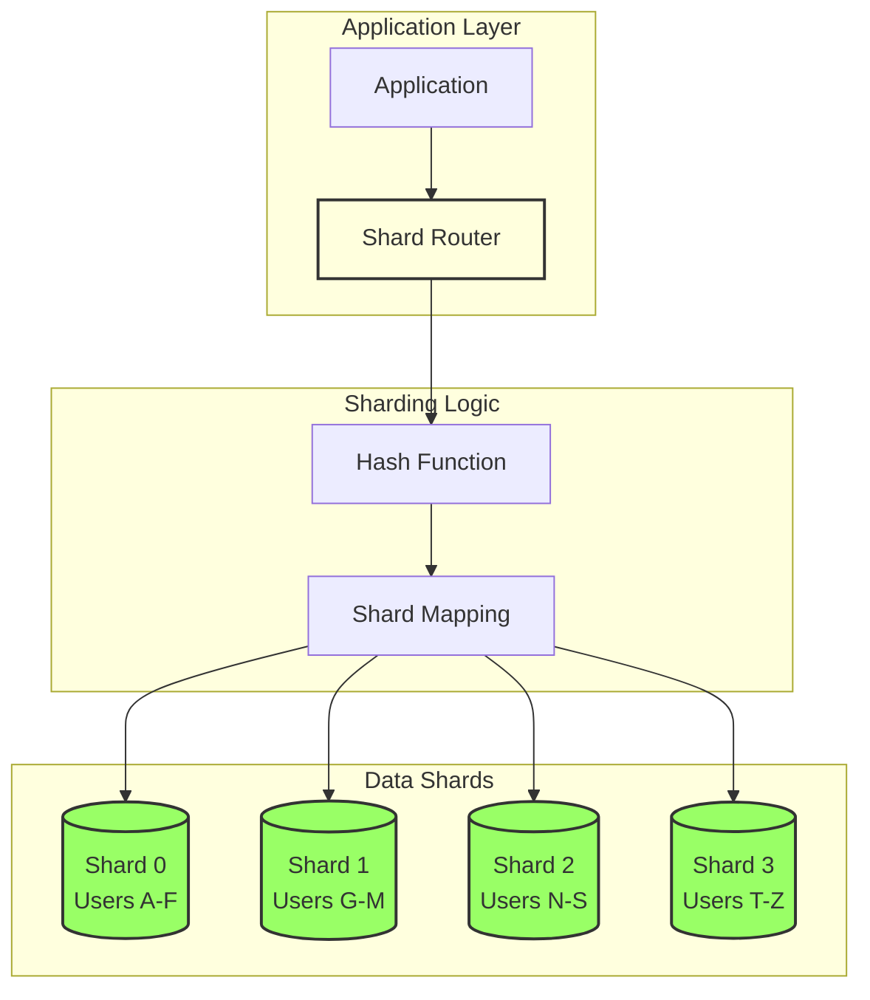
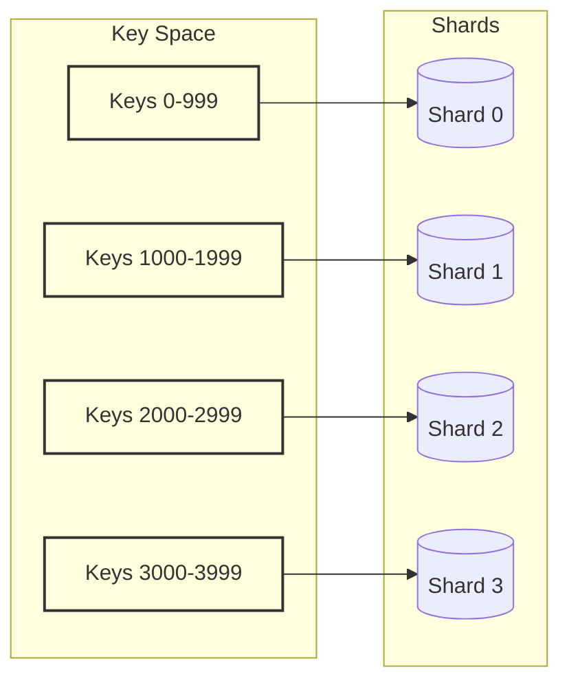
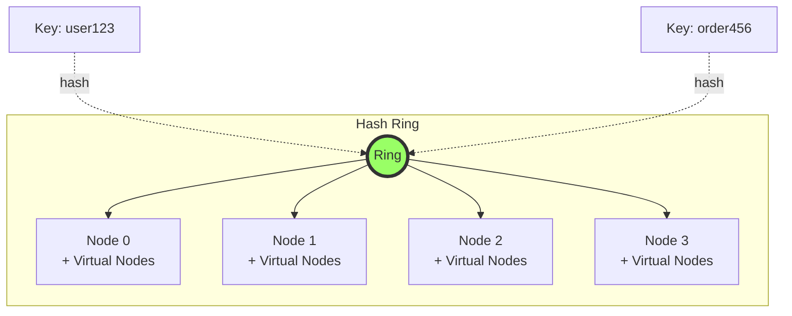
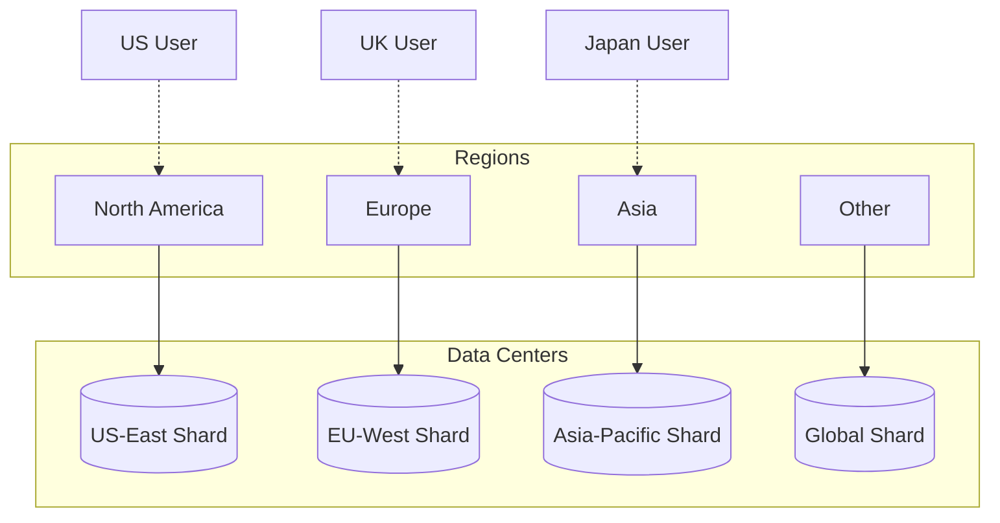
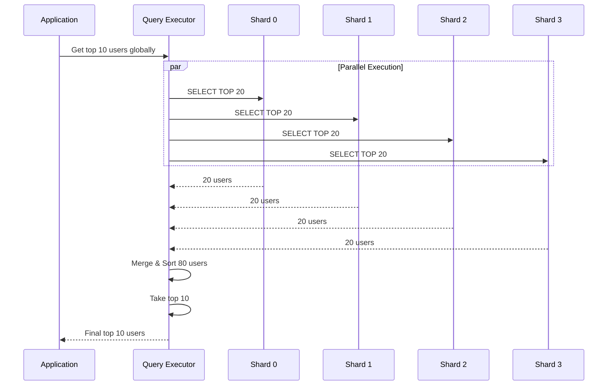
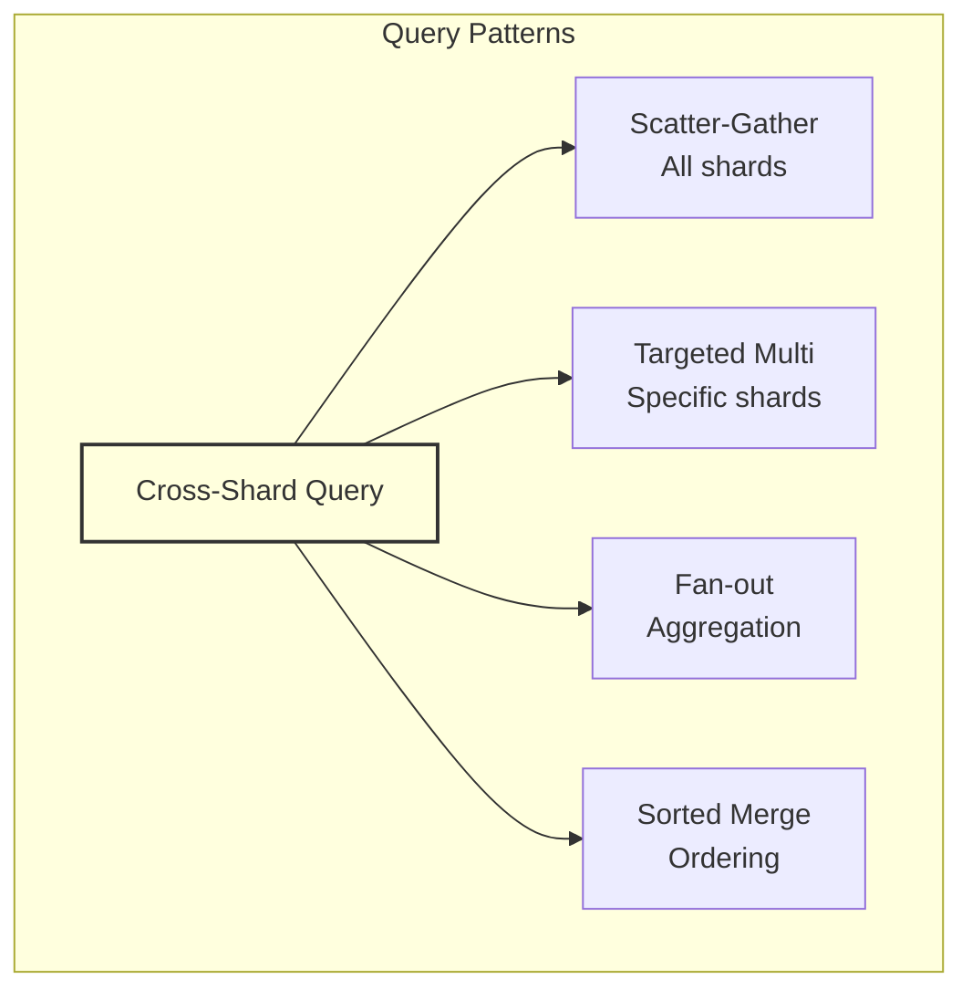

# Sharding (Data Partitioning)

**Divide and conquer at planetary scale**

> *"The only way to handle infinite data is to ensure no single place has to handle all of it."*

---

## Level 1: Intuition

### The Library Analogy

- **Single library**: Runs out of space, librarians overwhelmed
- **Sharded library**: Multiple buildings (A-F, G-M, N-Z)
- **Smart routing**: Card catalog directs to correct building
- **Parallel processing**: Multiple librarians work simultaneously

```
Unsharded:                    Sharded:
┌─────────────────┐          ┌──────┐ ┌──────┐ ┌──────┐
│   All Users     │          │Users │ │Users │ │Users │
│   (10M rows)    │    →     │ A-F  │ │ G-M  │ │ N-Z  │
└─────────────────┘          └──────┘ └──────┘ └──────┘
    Bottleneck!               Distributed Load!
```

### Sharding Architecture Overview



### Sharding Request Flow

```mermaid
flowchart LR
    REQ[Request: Get User 123] --> ROUTE{Router}
    ROUTE --> CALC[Calculate: hash(123) % 4 = 2]
    CALC --> SHARD[Connect to Shard 2]
    SHARD --> QUERY[Execute Query]
    QUERY --> RESULT[Return Data]
    
    style ROUTE fill:#ffd,stroke:#333,stroke-width:2px
    style SHARD fill:#9f6,stroke:#333,stroke-width:2px
```

---

## Level 2: Foundation

### Sharding Strategies Comparison

<div class="responsive-table" markdown>

| Strategy | How it Works | Pros | Cons | Use When |
|----------|-------------|------|------|----------|
| **Range-Based** | Partition by value range | Simple, ordered queries | Hotspots possible | Time-series data |
| **Hash-Based** | Hash function distribution | Even distribution | No range queries | User data |
| **Geographic** | Partition by location | Data locality | Complex queries | Global apps |
| **Directory-Based** | Lookup table for mapping | Flexible | Additional hop | Dynamic sharding |
| **Composite** | Multiple shard keys | Fine-grained control | Complex routing | Multi-tenant |

</div>


### Sharding Strategy Visualizations

#### Range-Based Sharding


#### Consistent Hash Ring


#### Geographic Sharding


### Sharding Strategy Comparison

<div class="responsive-table" markdown>

| Strategy | Distribution | Query Complexity | Rebalancing | Best For |
|----------|--------------|------------------|-------------|----------|
| **Range** | Can be uneven | Simple range queries | Hard | Sequential IDs |
| **Hash** | Even | No range queries | Hard | Random access |
| **Geographic** | By location | Region-aware | Natural | Global apps |
| **Composite** | Multi-dimensional | Complex | Flexible | Multi-tenant |
| **Directory** | Flexible | Extra lookup | Easy | Dynamic data |

</div>


### Cross-Shard Query Patterns



### Cross-Shard Query Types

<div class="responsive-table" markdown>

| Query Type | Pattern | Performance Impact | Example |
|------------|---------|-------------------|----------|
| **Scatter-Gather** | Query all shards | O(n) shards | Global search |
| **Targeted Multi-Shard** | Query subset | O(k) shards | Region-specific |
| **Fan-out Aggregation** | Parallel aggregates | Network bound | SUM, COUNT |
| **Sorted Merge** | Order across shards | Memory intensive | Top-K queries |
| **Two-Phase Query** | Locate then fetch | 2x latency | Secondary index |

</div>




---

## Level 3: Deep Dive

### Advanced Sharding Patterns

#### 1. Dynamic Resharding
```python
class DynamicResharding:
    """Handle shard splits and migrations"""
    
    def __init__(self, config_store):
        self.config_store = config_store
        self.migration_lock = asyncio.Lock()
        
    async def split_shard(
        self, 
        source_shard_id: int, 
        target_shard_ids: List[int]
    ):
        """Split one shard into multiple shards"""
        async with self.migration_lock:
# Phase 1: Prepare
            migration_id = self._create_migration_record(
                source_shard_id, target_shard_ids
            )
            
# Phase 2: Dual writes
            await self._enable_dual_writes(
                source_shard_id, target_shard_ids
            )
            
# Phase 3: Backfill historical data
            await self._backfill_data(
                source_shard_id, target_shard_ids, migration_id
            )
            
# Phase 4: Verify consistency
            consistent = await self._verify_consistency(
                source_shard_id, target_shard_ids
            )
            
            if not consistent:
                await self._rollback_migration(migration_id)
                raise Exception("Migration consistency check failed")
            
# Phase 5-7: Switch, disable, cleanup
            await self._switch_reads(target_shard_ids)
            await self._disable_shard(source_shard_id)
            await self._cleanup_old_shard(source_shard_id)
    
    async def _backfill_data(
        self, 
        source_id: int, 
        target_ids: List[int],
        migration_id: str
    ):
        """Migrate data from source to targets"""
        source_conn = self.get_shard_connection(source_id)
        cursor = source_conn.cursor('migration_cursor')
        cursor.execute("""
            SELECT * FROM users 
            WHERE NOT EXISTS (
                SELECT 1 FROM migration_log 
                WHERE migration_id = %s 
                AND record_id = users.id
            )
        """, (migration_id,))
        
        batch_size = 1000
        batch = []
        
        for row in cursor:
            target_id = self._get_target_shard(row['id'], target_ids)
            batch.append((target_id, row))
            
            if len(batch) >= batch_size:
                await self._write_batch(batch, migration_id)
                batch = []
        
        if batch:
            await self._write_batch(batch, migration_id)
    
    async def _write_batch(self, batch: List[tuple], migration_id: str):
        """Write batch of records to target shards"""
        
# Group by target shard
        by_shard = defaultdict(list)
        for target_id, row in batch:
            by_shard[target_id].append(row)
        
# Write to each shard in parallel
        tasks = []
        for target_id, rows in by_shard.items():
            task = self._write_to_shard(target_id, rows, migration_id)
            tasks.append(task)
        
        await asyncio.gather(*tasks)
```

#### 2. Shard-Aware Caching
```python
class ShardAwareCache:
    """Cache that understands sharding"""
    
    def __init__(self, shard_router, cache_backend):
        self.router = shard_router
        self.cache = cache_backend
        self.local_cache = {}  # L1 cache per shard
        
    async def get(self, key: str) -> Optional[Any]:
        """Get with shard-aware caching"""
        shard_id = self.router.get_shard_id(key)
        cache_key = f"shard:{shard_id}:key:{key}"
        
# Check L1 cache
        if cache_key in self.local_cache:
            return self.local_cache[cache_key]
        
# Check L2 cache
        value = await self.cache.get(cache_key)
        if value is not None:
            self.local_cache[cache_key] = value
            return value
        
# Cache miss - fetch from shard
        shard_conn = self.router.get_connection(key)
        value = await self._fetch_from_shard(shard_conn, key)
        
        if value is not None:
            await self.cache.set(cache_key, value, ttl=300)
            self.local_cache[cache_key] = value
        
        return value
    
    async def invalidate_shard(self, shard_id: int):
        """Invalidate all cache entries for a shard"""
        
# Clear L1 cache for this shard
        keys_to_remove = [
            k for k in self.local_cache 
            if k.startswith(f"shard:{shard_id}:")
        ]
        for key in keys_to_remove:
            del self.local_cache[key]
        
# Clear L2 cache
        await self.cache.delete_pattern(f"shard:{shard_id}:*")
```

#### 3. Global Secondary Indexes
```python
class GlobalSecondaryIndex:
    """Maintain global indexes across shards"""
    
    def __init__(self, index_name: str, shard_router):
        self.index_name = index_name
        self.router = shard_router
        self.index_shards = {}  # Separate shards for index
        
    async def update_index(
        self, 
        indexed_value: Any, 
        primary_key: str,
        shard_id: int
    ):
        """Update global secondary index"""
        
# Determine which index shard handles this value
        index_shard_id = self._get_index_shard(indexed_value)
        
# Store mapping: indexed_value -> (primary_key, data_shard_id)
        index_conn = self.get_index_connection(index_shard_id)
        
        await index_conn.execute("""
            INSERT INTO {index_name}_index 
                (indexed_value, primary_key, data_shard_id)
            VALUES (%s, %s, %s)
            ON CONFLICT (indexed_value, primary_key) 
            DO UPDATE SET data_shard_id = EXCLUDED.data_shard_id
        """.format(index_name=self.index_name), 
            (indexed_value, primary_key, shard_id)
        )
    
    async def query_by_index(
        self, 
        indexed_value: Any
    ) -> List[Dict]:
        """Query using global secondary index"""
        
# Step 1: Look up in index to find which shards have data
        index_shard_id = self._get_index_shard(indexed_value)
        index_conn = self.get_index_connection(index_shard_id)
        
        rows = await index_conn.fetch("""
            SELECT primary_key, data_shard_id
            FROM {index_name}_index
            WHERE indexed_value = %s
        """.format(index_name=self.index_name), (indexed_value,))
        
# Step 2: Group by data shard
        by_shard = defaultdict(list)
        for row in rows:
            by_shard[row['data_shard_id']].append(row['primary_key'])
        
# Step 3: Fetch from data shards in parallel
        tasks = []
        for shard_id, keys in by_shard.items():
            task = self._fetch_from_data_shard(shard_id, keys)
            tasks.append(task)
        
        results = await asyncio.gather(*tasks)
        
# Flatten results
        return [item for sublist in results for item in sublist]
```

---

## Level 4: Expert

### Production Case Study: Discord's Sharding Architecture

Discord handles billions of messages across millions of servers using sophisticated sharding.

```python
class DiscordShardingArchitecture:
    """
    Discord's approach to sharding at scale
    - 5M+ concurrent users
    - 15B+ messages per month
    - 100M+ servers (guilds)
    """
    
    def __init__(self):
        self.bucket_count = 4096  # Number of buckets
        self.buckets_per_shard = 32  # Buckets grouped into shards
        self.shard_count = self.bucket_count // self.buckets_per_shard
        self.hash_ring = ConsistentHashRing(self.bucket_count)
        self.shard_map = {}
        self.shard_metrics = defaultdict(lambda: {
            'qps': 0,
            'size_mb': 0,
            'latency_p99': 0
        })
    
    def get_message_location(self, channel_id: str, message_id: str) -> Dict:
        """
        Determine where to store/retrieve a message
        Discord uses Channel ID for bucket, Message ID (Snowflake) for time ordering
        """
        bucket_id = self.hash_ring.get_bucket(channel_id)
        shard_id = self.get_shard_for_bucket(bucket_id)
        timestamp = self.extract_timestamp(message_id)
        time_bucket = self.get_time_bucket(timestamp)
        
        return {
            'bucket_id': bucket_id,
            'shard_id': shard_id,
            'table': f"messages_{time_bucket}",
            'partition_key': channel_id,
            'clustering_key': message_id
        }
    
    def handle_hot_shard(self, shard_id: int):
        """Handle hot shards by splitting buckets"""
        metrics = self.shard_metrics[shard_id]
        
        if (metrics['qps'] > 10000 or 
            metrics['size_mb'] > 100000 or
            metrics['latency_p99'] > 100):
            
            hot_buckets = self.identify_hot_buckets(shard_id)
            migration_plan = self.create_migration_plan(hot_buckets)
            self.execute_bucket_migration(migration_plan)
    
    def create_migration_plan(self, hot_buckets: List[int]) -> Dict:
        """Create plan to redistribute hot buckets"""
        plan = {'migrations': [], 'new_shards': []}
        available_shards = self.find_shards_with_capacity()
        
        if len(available_shards) < len(hot_buckets):
            new_shard_count = len(hot_buckets) - len(available_shards)
            plan['new_shards'] = self.provision_new_shards(new_shard_count)
            available_shards.extend(plan['new_shards'])
        
        for i, bucket_id in enumerate(hot_buckets):
            target_shard = available_shards[i % len(available_shards)]
            plan['migrations'].append({
                'bucket_id': bucket_id,
                'source_shard': self.get_shard_for_bucket(bucket_id),
                'target_shard': target_shard,
                'estimated_size': self.estimate_bucket_size(bucket_id)
            })
        
        return plan
    
    async def query_channel_messages(
        self, 
        channel_id: str,
        before_id: Optional[str] = None,
        limit: int = 50
    ) -> List[Dict]:
        """Query messages for a channel with pagination"""
        location = self.get_message_location(channel_id, before_id or "0")
        
        query = """
            SELECT message_id, author_id, content, timestamp
            FROM {table}
            WHERE channel_id = %s
        """.format(table=location['table'])
        
        params = [channel_id]
        
        if before_id:
            query += " AND message_id < %s"
            params.append(before_id)
        
        query += " ORDER BY message_id DESC LIMIT %s"
        params.append(limit)
        
        shard_conn = self.get_shard_connection(location['shard_id'])
        results = await shard_conn.fetch(query, *params)
        
        return [dict(row) for row in results]
```

### Vitess: YouTube's Sharding Solution

```python
class VitessShardingManager:
    """
    Vitess - YouTube's horizontal sharding solution
    Handles billions of queries per day
    """
    
    def __init__(self):
        self.keyspace_schema = {}
        self.vindex_map = {}  # Vitess index for routing
        self.shard_topology = {}
        
    def define_sharding_scheme(self, table: str, config: Dict):
        """
        Define how a table should be sharded
        
        Vitess concepts:
        - Keyspace: Logical database
        - Shard: Physical partition
        - Vindex: Index for shard routing
        """
        
        self.keyspace_schema[table] = {
            'sharding_column': config['sharding_column'],
            'vindex_type': config['vindex_type'],
            'shard_count': config['shard_count']
        }
        
# Create vindex based on type
        if config['vindex_type'] == 'hash':
            self.vindex_map[table] = HashVindex(config['shard_count'])
        elif config['vindex_type'] == 'range':
            self.vindex_map[table] = RangeVindex(config['ranges'])
        elif config['vindex_type'] == 'lookup':
            self.vindex_map[table] = LookupVindex(config['lookup_table'])
    
    def route_query(self, query: str) -> List[Dict]:
        """
        Route query to appropriate shards
        
        Vitess query routing:
        1. Parse query to extract table and conditions
        2. Use vindex to determine target shards
        3. Execute on shards in parallel
        4. Merge results
        """
        
# Parse query
        parsed = self.parse_query(query)
        table = parsed['table']
        conditions = parsed['conditions']
        
# Determine target shards
        target_shards = self.get_target_shards(table, conditions)
        
# Scatter query to shards
        shard_queries = []
        for shard_id in target_shards:
            shard_query = self.rewrite_query_for_shard(query, shard_id)
            shard_queries.append((shard_id, shard_query))
        
# Execute in parallel
        results = self.execute_scatter_gather(shard_queries)
        
# Merge results based on query type
        if parsed['query_type'] == 'SELECT':
            return self.merge_select_results(results, parsed)
        elif parsed['query_type'] == 'AGGREGATE':
            return self.merge_aggregate_results(results, parsed)
    
    def handle_cross_shard_transaction(self, operations: List[Dict]):
        """
        Handle transactions spanning multiple shards
        
        Vitess uses 2PC (Two-Phase Commit):
        1. Prepare phase on all shards
        2. Commit phase if all prepared
        3. Rollback if any failed
        """
        
# Group operations by shard
        ops_by_shard = defaultdict(list)
        for op in operations:
            shard_id = self.get_shard_for_operation(op)
            ops_by_shard[shard_id].append(op)
        
# Start distributed transaction
        dtx_id = self.generate_dtx_id()
        
# Phase 1: Prepare
        prepare_results = {}
        for shard_id, shard_ops in ops_by_shard.items():
            try:
                prepared = self.prepare_on_shard(
                    shard_id, 
                    dtx_id, 
                    shard_ops
                )
                prepare_results[shard_id] = prepared
            except Exception as e:
# Prepare failed, abort
                self.abort_transaction(dtx_id, prepare_results)
                raise
        
# Phase 2: Commit
        for shard_id in prepare_results:
            self.commit_on_shard(shard_id, dtx_id)
        
        return {'transaction_id': dtx_id, 'status': 'committed'}
```

### Economic Impact Analysis

```python
class ShardingEconomicsAnalyzer:
    """Analyze economic impact of sharding strategies"""
    
    def analyze_sharding_roi(
        self,
        current_state: Dict,
        sharding_proposal: Dict
    ) -> Dict:
        """Calculate ROI of implementing sharding"""
        
# Current costs (single large database)
        current_costs = {
            'hardware': self._calculate_vertical_scaling_cost(
                current_state['data_size_tb'],
                current_state['qps']
            ),
            'licenses': current_state['db_licenses_annual'],
            'operations': current_state['dba_hours_weekly'] * 52 * 150,
            'downtime': current_state['downtime_hours_annual'] * 
                       current_state['revenue_per_hour']
        }
        
# Projected costs with sharding
        shard_count = sharding_proposal['shard_count']
        sharded_costs = {
            'hardware': self._calculate_horizontal_scaling_cost(
                current_state['data_size_tb'],
                current_state['qps'],
                shard_count
            ),
            'licenses': sharding_proposal['db_licenses_annual'],
            'operations': sharding_proposal['dba_hours_weekly'] * 52 * 150,
            'development': sharding_proposal['development_hours'] * 150,
            'migration': sharding_proposal['migration_hours'] * 150
        }
        
# Benefits
        benefits = {
            'improved_performance': self._calculate_performance_value(
                current_state['avg_latency_ms'],
                sharding_proposal['expected_latency_ms']
            ),
            'increased_capacity': self._calculate_capacity_value(
                current_state['max_qps'],
                sharding_proposal['max_qps']
            ),
            'reduced_downtime': (
                current_state['downtime_hours_annual'] - 
                sharding_proposal['expected_downtime_hours']
            ) * current_state['revenue_per_hour']
        }
        
# Calculate ROI
        annual_savings = (
            sum(current_costs.values()) - 
            sum(sharded_costs.values()) + 
            sum(benefits.values())
        )
        
        implementation_cost = (
            sharded_costs['development'] + 
            sharded_costs['migration']
        )
        
        return {
            'implementation_cost': implementation_cost,
            'annual_savings': annual_savings,
            'payback_months': implementation_cost / (annual_savings / 12),
            'five_year_roi': (annual_savings * 5 - implementation_cost) / 
                           implementation_cost * 100
        }
```

---

## Level 5: Mastery

### Theoretical Foundations

#### Optimal Shard Count Determination
```python
import numpy as np
from scipy.optimize import minimize_scalar

class OptimalShardingCalculator:
    """
    Calculate optimal shard count using queuing theory
    and cost optimization
    """
    
    def calculate_optimal_shards(
        self,
        total_data_size: float,  # TB
        query_rate: float,       # QPS
        growth_rate: float,      # Annual %
        constraints: Dict
    ) -> Dict:
        """
        Find optimal shard count balancing:
        - Query performance
        - Cost efficiency
        - Operational complexity
        """
        
        def cost_function(shard_count):
# Hardware cost (decreases with more shards due to smaller instances)
            hw_cost = self._hardware_cost(
                total_data_size / shard_count,
                query_rate / shard_count
            ) * shard_count
            
# Operational cost (increases with more shards)
            ops_cost = self._operational_cost(shard_count)
            
# Performance penalty (decreases with more shards)
            perf_penalty = self._performance_penalty(
                query_rate / shard_count,
                constraints['max_latency_ms']
            )
            
# Cross-shard query penalty (increases with more shards)
            cross_shard_penalty = self._cross_shard_penalty(
                shard_count,
                constraints['cross_shard_query_ratio']
            )
            
            return hw_cost + ops_cost + perf_penalty + cross_shard_penalty
        
# Find optimal shard count
        result = minimize_scalar(
            cost_function,
            bounds=(1, 100),
            method='bounded'
        )
        
        optimal_shards = int(result.x)
        
# Calculate characteristics at optimal point
        shard_size = total_data_size / optimal_shards
        shard_qps = query_rate / optimal_shards
        
# Project growth
        years_until_reshard = self._calculate_reshard_timeline(
            shard_size,
            shard_qps,
            growth_rate,
            constraints
        )
        
        return {
            'optimal_shard_count': optimal_shards,
            'shard_size_tb': shard_size,
            'shard_qps': shard_qps,
            'annual_cost': cost_function(optimal_shards),
            'years_until_reshard': years_until_reshard,
            'recommendations': self._generate_recommendations(
                optimal_shards,
                shard_size,
                shard_qps
            )
        }
    
    def _hardware_cost(self, size_tb: float, qps: float) -> float:
        """Estimate hardware cost for given size and QPS"""
# Based on cloud provider pricing
# Larger instances have worse $/GB ratio
        storage_cost = size_tb * 100 * (1 + 0.1 * np.log(size_tb))
        compute_cost = qps * 0.01 * (1 + 0.05 * np.log(qps))
        return storage_cost + compute_cost
    
    def _cross_shard_penalty(
        self, 
        shard_count: int, 
        cross_shard_ratio: float
    ) -> float:
        """Calculate penalty for cross-shard operations"""
# More shards = more cross-shard queries
# Penalty grows super-linearly
        return cross_shard_ratio * (shard_count ** 1.5) * 1000
```

### Advanced Sharding Algorithms

```python
class AdvancedShardingAlgorithms:
    """State-of-the-art sharding algorithms"""
    
    def jump_consistent_hash(self, key: int, num_buckets: int) -> int:
        """
        Google's Jump Consistent Hash
        - No memory overhead
        - Consistent bucket reassignment
        - O(ln n) time complexity
        """
        b = -1
        j = 0
        
        while j < num_buckets:
            b = j
            key = ((key * 2862933555777941757) + 1) & 0xffffffffffffffff
            j = int((b + 1) * (2**31 / ((key >> 33) + 1)))
        
        return b
    
    def maglev_hashing(self, backends: List[str], table_size: int = 65537):
        """
        Google's Maglev consistent hashing
        Used in their load balancers
        - Minimal disruption on changes
        - Even distribution
        - Fast lookup
        """
        
        def hash_1(x):
            return hash(x + "_1") % table_size
        
        def hash_2(x):
            return hash(x + "_2") % table_size
        
        n = len(backends)
        lookup = [-1] * table_size
        
# Build permutation for each backend
        permutations = []
        for backend in backends:
            offset = hash_1(backend)
            skip = hash_2(backend)
            
            permutation = []
            for j in range(table_size):
                permutation.append((offset + j * skip) % table_size)
            
            permutations.append(permutation)
        
# Build lookup table
        next_pos = [0] * n
        for i in range(table_size):
            for j in range(n):
                c = permutations[j][next_pos[j]]
                
                while lookup[c] != -1:
                    next_pos[j] += 1
                    c = permutations[j][next_pos[j]]
                
                lookup[c] = j
                next_pos[j] += 1
                break
        
        return lookup
    
    def bounded_load_consistent_hash(
        self, 
        key: str,
        nodes: List[str],
        load_factor: float = 1.25
    ) -> str:
        """
        Consistent hashing with bounded loads
        Ensures no node gets overloaded
        """
        
# Calculate capacity for each node
        avg_load = 1.0 / len(nodes)
        max_load = avg_load * load_factor
        
        node_loads = {node: 0.0 for node in nodes}
        
# Try nodes in consistent hash order
        for i in range(len(nodes)):
            node = self._consistent_hash_node(key, nodes, i)
            
            if node_loads[node] < max_load:
                node_loads[node] += 1.0 / len(nodes)
                return node
        
# Fallback to least loaded
        return min(node_loads.items(), key=lambda x: x[1])[0]
```

### Future Directions

1. **AI-Driven Sharding**
   - ML models predicting optimal shard placement
   - Automatic hot spot detection and mitigation
   - Predictive resharding before issues occur

2. **Quantum-Resistant Sharding**
   - Post-quantum cryptographic sharding
   - Quantum-safe consensus protocols
   - Entanglement-inspired shard coordination

3. **Edge-Native Sharding**
   - Geo-distributed sharding at edge
   - 5G network-aware shard placement
   - Latency-optimized routing

4. **Blockchain Sharding**
   - State sharding for blockchain scalability
   - Cross-shard atomic swaps
   - Sharded consensus mechanisms

---

## Quick Reference

### Sharding Strategy Selection

<div class="responsive-table" markdown>

| If you have... | Use this strategy | Key considerations |
|----------------|-------------------|-------------------|
| Numeric IDs | Range sharding | Watch for hotspots |
| Random keys | Hash sharding | No range queries |
| Geographic data | Location sharding | Data sovereignty |
| Time-series | Time-based sharding | Easy archival |
| Multi-tenant | Tenant sharding | Isolation guaranteed |
| Complex queries | Directory sharding | Additional hop |

</div>


### Implementation Checklist

- [ ] Choose sharding key wisely (can't change easily)
- [ ] Plan for resharding from day one
- [ ] Implement shard-aware connection pooling
- [ ] Build cross-shard query capabilities
- [ ] Add shard monitoring and metrics
- [ ] Create shard management tools
- [ ] Test shard failure scenarios
- [ ] Document shard topology
- [ ] Plan backup strategy per shard
- [ ] Consider compliance requirements

### Common Anti-Patterns

1. **Sharding Too Early**: Premature optimization
2. **Wrong Shard Key**: Causes hotspots or poor distribution
3. **No Resharding Plan**: Painted into corner
4. **Ignoring Cross-Shard Queries**: Performance surprises
5. **Forgetting About Joins**: Distributed joins are hard

---

## 🎓 Key Takeaways

1. **Shard key selection is critical** - It determines everything
2. **Plan for resharding** - Data grows, patterns change
3. **Monitor shard health** - Detect hotspots early
4. **Minimize cross-shard operations** - They're expensive
5. **Automate shard management** - Manual doesn't scale

---

*"The best sharding strategy is the one that lets you sleep at night while your data doubles."*

---

**Previous**: ← Service Mesh (Coming Soon) | **Next**: [Timeout Pattern →](timeout.md)