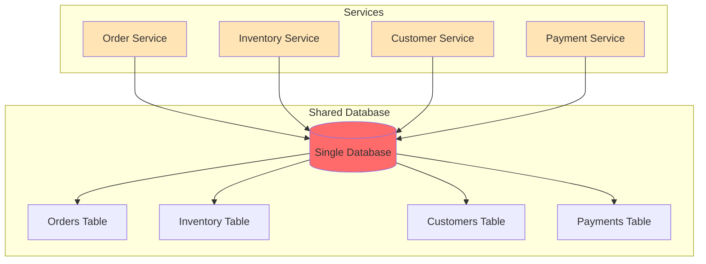
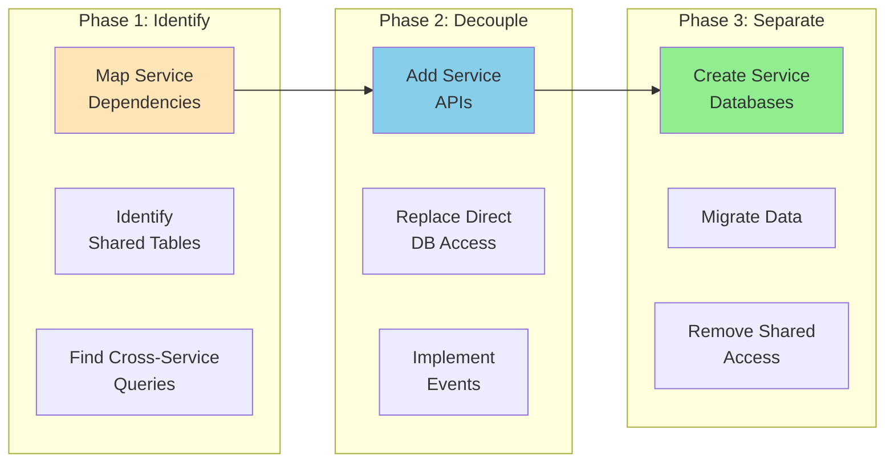

# Shared Database Pattern

!!! danger "🥉 Bronze Tier Pattern"
    **Legacy Pattern** • Consider modern alternatives
    
    While still in use in legacy systems, this pattern has been superseded by database-per-service and event-driven architectures. See migration guides for transitioning to modern approaches.

**The anti-pattern that refuses to die**

## Visual Architecture

## Why This Pattern is Problematic

| Problem | Impact | Modern Solution |
|---------|--------|-----------------|
| **Tight Coupling** | Services can't evolve independently | Database per service |
| **No Autonomy** | Teams block each other | API contracts |
| **Scaling Bottleneck** | All services hit same DB | Distributed data |
| **Schema Conflicts** | Version coordination nightmare | Service ownership |
| **Performance Issues** | Noisy neighbor problems | Isolated resources |
| **Testing Complexity** | Can't test in isolation | Service virtualization |

## Common Symptoms of Shared Database Problems

<h4>💥 The Deployment Coordination Dance</h4>

**What Happens**: 
- Team A needs to add a column
- Team B's code breaks with new column
- Team C is in the middle of a release
- All teams must coordinate deployment

**Result**: 3-week deployment cycles, midnight releases

**Better Approach**: Each service owns its data and schema

## Migration Strategy

## When Shared Database Might Be Acceptable

<h4>🎯 Limited Acceptable Use Cases</h4>

1. **Transitional State**
   - During monolith decomposition
   - Temporary measure with clear timeline

2. **Read-Only Analytics**
   - Shared read replicas for reporting
   - No write operations from services

3. **Legacy System Constraints**
   - When refactoring cost exceeds benefit
   - With clear isolation boundaries

**Even then**: Plan for eventual separation

## Modern Alternatives Comparison

| Pattern | Data Consistency | Autonomy | Complexity | Use When |
|---------|-----------------|----------|------------|----------|
| **Database per Service** | Eventual | High | Medium | Default for microservices |
| **Event Sourcing** | Eventual | High | High | Audit requirements |
| **CQRS** | Eventual | High | High | Complex queries |
| **API Gateway** | Request-time | Medium | Low | Simple data needs |
| **Data Mesh** | Federated | Very High | Very High | Large organizations |

## Anti-Pattern Indicators

- [ ] Multiple services directly query same tables
- [ ] Schema changes require multi-team coordination  
- [ ] "God tables" with 50+ columns
- [ ] Database becomes single point of failure
- [ ] Can't scale services independently
- [ ] Test data conflicts between teams
- [ ] Performance degradation affects all services
- [ ] Security boundaries are unclear

## Related Patterns

- [Database per Service](database-per-service.md) - The correct approach
- [Event-Driven](event-driven.md) - For data synchronization
- [API Gateway](api-gateway.md) - For data aggregation
- [CQRS](cqrs.md) - For query separation
- [Saga](saga.md) - For distributed transactions