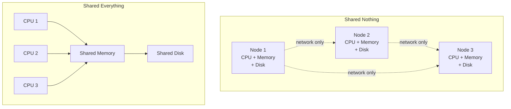
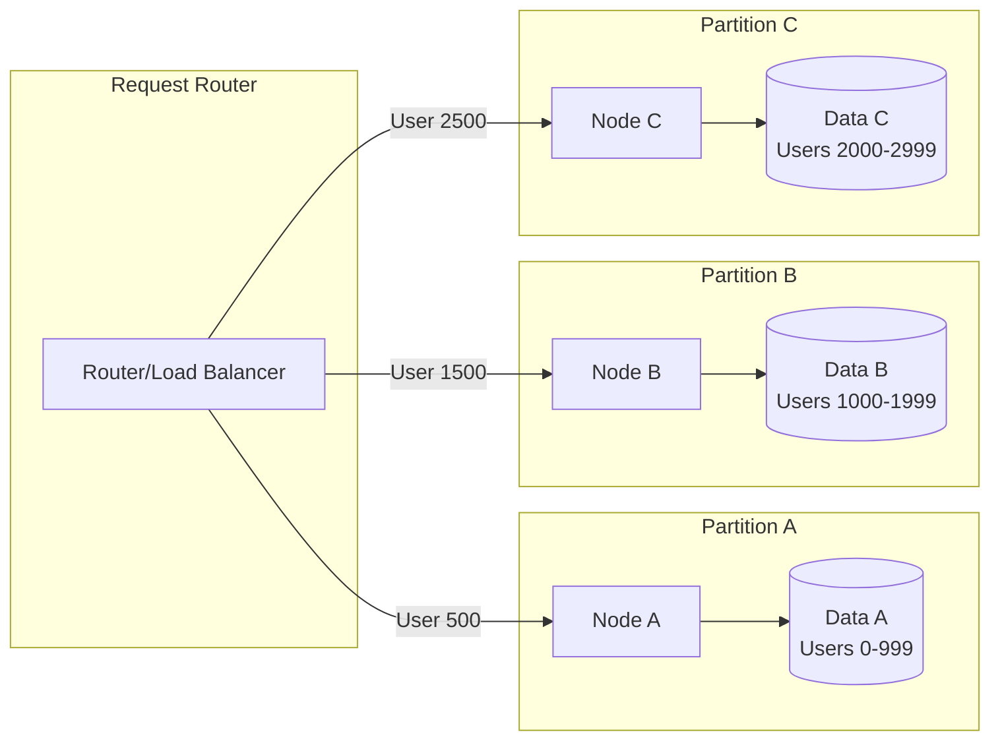
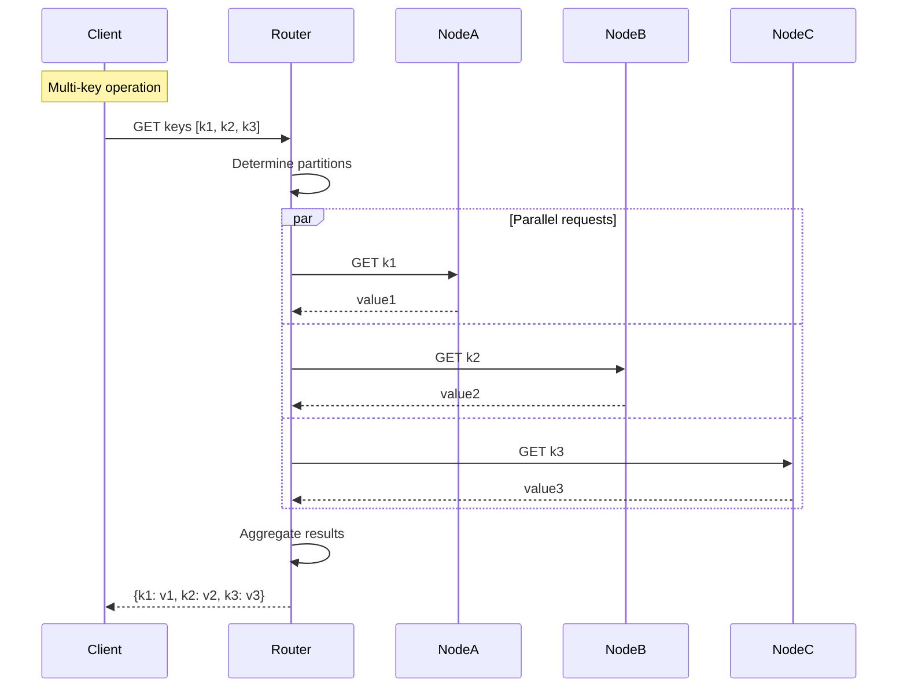
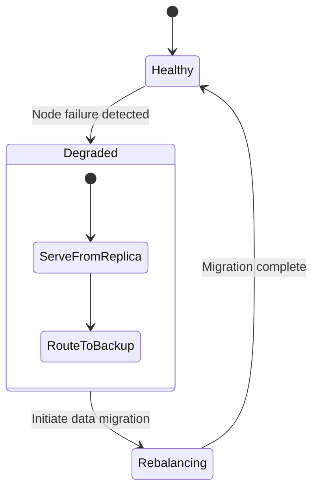
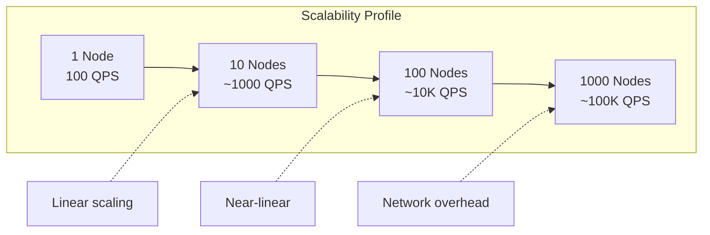

# Shared Nothing Architecture

## 🎯 The Essence

!!! tip "Core Concept"
    Each node in the system owns its data and compute exclusively - no shared memory, no shared disk, no shared anything. Communication happens only through the network.



## 🔍 Intuition: The Restaurant Kitchen Analogy

Imagine two restaurant kitchen designs:

**Shared Kitchen** (Traditional): All chefs share the same stove, refrigerator, and prep stations. They constantly bump into each other, wait for equipment, and coordinate access.

**Station Kitchen** (Shared Nothing): Each chef has their own complete station - stove, ingredients, tools. They work independently and only communicate to pass completed dishes.

The station kitchen scales linearly - add more chefs, get proportionally more output. The shared kitchen hits bottlenecks quickly.

## 📊 Architecture Comparison

| Aspect | Shared Nothing | Shared Memory | Shared Disk |
|--------|----------------|---------------|-------------|
| **Scalability** | Linear (near-perfect) | Limited by memory bus | Limited by disk I/O |
| **Fault Isolation** | Excellent | Poor | Moderate |
| **Complexity** | Higher (coordination) | Lower | Moderate |
| **Cost** | Higher (duplication) | Lower | Moderate |
| **Use Cases** | Web scale systems | HPC, Databases | Traditional databases |

## 🏗️ Implementation Patterns

### 1. Data Partitioning Strategy



### 2. Request Routing Implementation

```python
class SharedNothingRouter:
    def __init__(self, nodes: List[Node]):
        self.nodes = nodes
        self.partitions = self._calculate_partitions()
        
    def route_request(self, key: str) -> Node:
        """Route request to owning node"""
        partition = self._hash_to_partition(key)
        return self.nodes[partition]
        
    def _hash_to_partition(self, key: str) -> int:
        """Consistent hashing for partition assignment"""
        hash_value = hashlib.md5(key.encode()).hexdigest()
        return int(hash_value, 16) % len(self.nodes)

class Node:
    def __init__(self, node_id: int, data_path: str):
        self.id = node_id
        self.local_storage = LocalStorage(data_path)
        self.local_cache = LRUCache(capacity=10000)
        
    def handle_request(self, request: Request) -> Response:
        """Process request using only local resources"""
        # Check local cache first
        if cached := self.local_cache.get(request.key):
            return Response(cached, cache_hit=True)
            
        # Read from local storage
        data = self.local_storage.read(request.key)
        if not data:
            return Response(error="Key not found")
            
        # Update local cache
        self.local_cache.put(request.key, data)
        return Response(data)
```

### 3. Cross-Partition Operations



## 💥 Failure Modes & Mitigation

### 1. Node Failure Handling



### 2. Network Partition Handling

```python
class PartitionTolerantNode(Node):
    def __init__(self, node_id: int, replicas: List[Node]):
        super().__init__(node_id)
        self.replicas = replicas
        self.partition_detector = PartitionDetector()
        
    def handle_cross_partition_request(self, keys: List[str]):
        """Handle requests that span partitions"""
        results = {}
        failed_keys = []
        
        # Group keys by partition
        partition_map = self._group_by_partition(keys)
        
        # Execute in parallel with timeout
        with ThreadPoolExecutor(max_workers=10) as executor:
            futures = {}
            for partition, partition_keys in partition_map.items():
                node = self._get_node_for_partition(partition)
                future = executor.submit(
                    self._fetch_with_timeout,
                    node,
                    partition_keys,
                    timeout=5.0
                )
                futures[future] = partition_keys
                
            # Collect results
            for future in as_completed(futures, timeout=10):
                try:
                    partition_results = future.result()
                    results.update(partition_results)
                except TimeoutError:
                    failed_keys.extend(futures[future])
                except NetworkPartitionError:
                    # Attempt replica read
                    self._attempt_replica_read(futures[future], results)
                    
        return results, failed_keys
```

## 🎯 Design Decisions

| Decision Point | Options | Trade-offs |
|----------------|---------|------------|
| **Partition Strategy** | Range, Hash, Geographic | Balance vs Locality |
| **Replication** | None, Leader-Follower, Multi-Master | Availability vs Complexity |
| **Consistency** | Eventual, Strong per-partition | Performance vs Guarantees |
| **Routing** | Client-side, Proxy, Gossip | Latency vs Flexibility |

## 🚀 Performance Characteristics



## 🌍 Real-World Examples

### 1. **Amazon DynamoDB**
- Each node owns specific key ranges
- No shared state between nodes
- Achieves millions of requests/second

### 2. **Google Spanner**
- Sharded by key ranges
- Each shard is independent
- Cross-shard transactions via 2PC

### 3. **Cassandra**
- Ring-based architecture
- Each node owns token ranges
- Peer-to-peer, no single point of failure

## ⚖️ When to Use vs Avoid

### ✅ Use When:
- **Horizontal scalability** is critical
- **Workload is partitionable** by some key
- **Independence** between partitions
- **Fault isolation** is important

### ❌ Avoid When:
- **Complex joins** across data
- **Global transactions** required
- **Shared state** is fundamental
- **Small scale** (overhead not justified)

## 🔗 Related Patterns

- **[Sharding](sharding.md)**: Data partitioning strategy
- **[Consistent Hashing](consistent-hashing.md)**: Partition assignment
- **[Service Mesh](service-mesh.md)**: Inter-node communication
- **[Bulkhead](bulkhead.md)**: Fault isolation principle