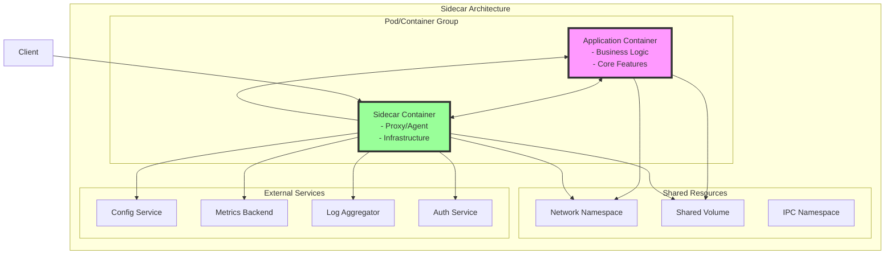
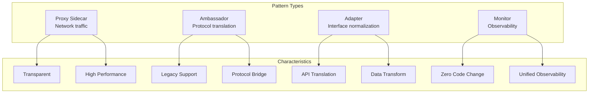

# Sidecar Pattern

**Your application's trusty companion: A co-pilot that handles the infrastructure complexity**

> *"The sidecar pattern is like having a personal assistant for your application—handling all the tedious infrastructure tasks while your app focuses on business logic."*

---

## Level 1: Intuition

### The Motorcycle Sidecar Analogy

```
Motorcycle Without Sidecar:              Motorcycle With Sidecar:

    🏍️                                      🏍️🛵
    Driver                                  Driver + Passenger
    - Carries everything                    - Driver focuses on driving
    - Limited capacity                      - Sidecar carries equipment
    - Complex to modify                     - Easy to swap sidecars
    - Single point of failure               - Modular design

Application Without Sidecar:             Application With Sidecar:

    📦 App                                  📦 App + 📦 Sidecar
    - All logic inside                      - Business logic | Infrastructure
    - Tightly coupled                       - Loosely coupled
    - Language-specific                     - Language-agnostic
    - Hard to update                        - Independent updates
```

```
Traditional Approach:                    Sidecar Pattern:

┌─────────────────────┐                 ┌──────────┐ ┌──────────┐
│    Application      │                 │   App    │ │ Sidecar  │
│ ┌─────────────────┐ │                 │          │ │          │
│ │ Business Logic  │ │                 │ Business │ │ Logging  │
│ ├─────────────────┤ │                 │  Logic   │ │ Metrics  │
│ │    Logging      │ │                 │   Only   │ │ Security │
│ ├─────────────────┤ │                 │          │ │ Config   │
│ │    Metrics      │ │                 └──────────┘ └──────────┘
│ ├─────────────────┤ │                      ↑            ↑
│ │   Security      │ │                      └────────────┘
│ ├─────────────────┤ │                    Shared Network/Storage
│ │ Configuration   │ │
│ └─────────────────┘ │                 Benefits:
└─────────────────────┘                 ✓ Separation of concerns
                                       ✓ Independent scaling
Problems:                              ✓ Language agnostic
✗ Bloated application                  ✓ Reusable components
✗ Language-specific libraries
✗ Tight coupling
```

### Real-World Examples

| Company | Sidecar Implementation | Purpose |
|---------|----------------------|----------|
| **Lyft** | Envoy proxy sidecar | Service mesh, load balancing |
| **Netflix** | Prana sidecar | Service discovery, health checks |
| **Microsoft** | Dapr sidecar | State management, pub/sub |
| **Google** | Istio sidecar | Traffic management, security |
| **Uber** | Jaeger agent sidecar | Distributed tracing |


### Basic Implementation

```python
# Main application (app.py)
from flask import Flask, request
import requests

app = Flask(__name__)

@app.route('/api/users/<user_id>')
def get_user(user_id):
    """
    Simple business logic - sidecar handles infrastructure
    """
# Business logic only
    user = fetch_user_from_db(user_id)
    
# Sidecar handles:
# - Authentication (already validated)
# - Rate limiting (already applied)
# - Metrics collection (automatic)
# - Distributed tracing (automatic)
# - Circuit breaking (transparent)
    
    return {'user': user}

# Sidecar proxy (envoy.yaml)
static_resources:
  listeners:
  - name: listener_0
    address:
      socket_address:
        address: 0.0.0.0
        port_value: 8080
    filter_chains:
    - filters:
      - name: envoy.filters.network.http_connection_manager
        typed_config:
          "@type": type.googleapis.com/envoy.extensions.filters.network.http_connection_manager.v3.HttpConnectionManager
          stat_prefix: ingress_http
          route_config:
            name: local_route
            virtual_hosts:
            - name: local_service
              domains: ["*"]
              routes:
              - match:
                  prefix: "/"
                route:
                  cluster: app_service
          http_filters:
# Authentication filter
          - name: envoy.filters.http.jwt_authn
            typed_config:
              "@type": type.googleapis.com/envoy.extensions.filters.http.jwt_authn.v3.JwtAuthentication
              providers:
                auth_provider:
                  issuer: "https://auth.example.com"
                  audiences:
                  - "api.example.com"
                  remote_jwks:
                    http_uri:
                      uri: "https://auth.example.com/.well-known/jwks.json"
          
# Rate limiting
          - name: envoy.filters.http.ratelimit
            typed_config:
              "@type": type.googleapis.com/envoy.extensions.filters.http.ratelimit.v3.RateLimit
              domain: production
              rate_limit_service:
                grpc_service:
                  envoy_grpc:
                    cluster_name: rate_limit_service
          
# Metrics collection
          - name: envoy.filters.http.prometheus_stats
            typed_config:
              "@type": type.googleapis.com/udpa.type.v1.TypedStruct
              type_url: type.googleapis.com/envoy.extensions.filters.http.prometheus_stats.v3alpha.PrometheusStats
          
# Router
          - name: envoy.filters.http.router

  clusters:
  - name: app_service
    connect_timeout: 0.25s
    type: LOGICAL_DNS
    lb_policy: ROUND_ROBIN
    load_assignment:
      cluster_name: app_service
      endpoints:
      - lb_endpoints:
        - endpoint:
            address:
              socket_address:
                address: localhost
                port_value: 5000

# Docker Compose deployment
version: '3.8'
services:
  app:
    image: myapp:latest
    ports:
      - "5000:5000"
    
  sidecar:
    image: envoyproxy/envoy:v1.22.0
    volumes:
      - ./envoy.yaml:/etc/envoy/envoy.yaml
    ports:
      - "8080:8080"  # External traffic comes here
    depends_on:
      - app
```

---

## Level 2: Foundation

### Core Concepts



### Common Sidecar Patterns

#### 1. Proxy Sidecar (Service Mesh)

```python
class ProxySidecar:
    """
    Handles all network traffic for the application
    """
    
    def __init__(self):
        self.circuit_breakers = {}
        self.rate_limiters = {}
        self.retry_policies = {}
        
    async def handle_request(self, request):
        """
        Intercept and enhance all requests
        """
        
# 1. Authentication
        if not await self._authenticate(request):
            return Response(status=401)
        
# 2. Rate limiting
        if not await self._check_rate_limit(request):
            return Response(status=429)
        
# 3. Circuit breaking
        if self._is_circuit_open(request.destination):
            return Response(status=503)
        
# 4. Load balancing
        endpoint = self._select_endpoint(request.destination)
        
# 5. Retry with backoff
        response = await self._execute_with_retry(endpoint, request)
        
# 6. Metrics and tracing
        self._record_metrics(request, response)
        
        return response
    
    async def _execute_with_retry(self, endpoint, request):
        """
        Intelligent retry logic
        """
        
        retry_policy = self.retry_policies.get(
            endpoint.service,
            {'max_attempts': 3, 'backoff': 'exponential'}
        )
        
        for attempt in range(retry_policy['max_attempts']):
            try:
                response = await self._forward_request(endpoint, request)
                
                if response.status < 500:
                    return response
                    
            except Exception as e:
                if attempt == retry_policy['max_attempts'] - 1:
                    raise
                
# Exponential backoff
                wait_time = (2 ** attempt) * 0.1
                await asyncio.sleep(wait_time)
        
        return Response(status=503)

# Kubernetes deployment with Envoy sidecar
apiVersion: v1
kind: Service
metadata:
  name: myapp-service
spec:
  selector:
    app: myapp
  ports:
  - port: 80
    targetPort: 8080

---
apiVersion: apps/v1
kind: Deployment
metadata:
  name: myapp
spec:
  replicas: 3
  selector:
    matchLabels:
      app: myapp
  template:
    metadata:
      labels:
        app: myapp
    spec:
      containers:
# Main application
      - name: app
        image: myapp:latest
        ports:
        - containerPort: 5000
        env:
        - name: PORT
          value: "5000"
      
# Envoy sidecar
      - name: envoy-sidecar
        image: envoyproxy/envoy:v1.22.0
        ports:
        - containerPort: 8080
        volumeMounts:
        - name: envoy-config
          mountPath: /etc/envoy
        command: ["/usr/local/bin/envoy"]
        args: ["-c", "/etc/envoy/envoy.yaml"]
      
      volumes:
      - name: envoy-config
        configMap:
          name: envoy-config
```

#### 2. Ambassador Sidecar (Legacy Integration)

```python
class AmbassadorSidecar:
    """
    Translates between modern and legacy protocols
    """
    
    def __init__(self):
        self.protocol_adapters = {
            'soap': SOAPAdapter(),
            'xml-rpc': XMLRPCAdapter(),
            'custom-binary': CustomBinaryAdapter()
        }
        
    async def handle_modern_request(self, request):
        """
        Convert REST/gRPC to legacy format
        """
        
# Parse modern request
        service_name = request.headers.get('X-Service')
        method = request.headers.get('X-Method')
        payload = await request.json()
        
# Determine legacy protocol
        legacy_service = self.service_registry.get(service_name)
        adapter = self.protocol_adapters[legacy_service.protocol]
        
# Transform request
        legacy_request = adapter.transform_request(method, payload)
        
# Call legacy service
        legacy_response = await self._call_legacy_service(
            legacy_service,
            legacy_request
        )
        
# Transform response
        modern_response = adapter.transform_response(legacy_response)
        
        return JSONResponse(modern_response)
    
    async def _call_legacy_service(self, service, request):
        """
        Handle legacy service communication
        """
        
        if service.protocol == 'soap':
# SOAP over HTTP
            headers = {
                'Content-Type': 'text/xml',
                'SOAPAction': request.action
            }
            response = await self.http_client.post(
                service.endpoint,
                data=request.envelope,
                headers=headers
            )
            return response.text
            
        elif service.protocol == 'custom-binary':
# Custom TCP protocol
            reader, writer = await asyncio.open_connection(
                service.host,
                service.port
            )
            
            writer.write(request.binary_data)
            await writer.drain()
            
            response = await reader.read(service.max_response_size)
            writer.close()
            
            return response

# Example: Modern app using legacy SOAP service via sidecar
class ModernApp:
    def __init__(self):
# Talk to sidecar instead of legacy service
        self.api_client = httpx.AsyncClient(
            base_url="http://localhost:8080"  # Sidecar
        )
    
    async def get_customer(self, customer_id: str):
        """
        Modern REST call, sidecar handles SOAP
        """
        
        response = await self.api_client.get(
            f"/customers/{customer_id}",
            headers={
                'X-Service': 'legacy-crm',
                'X-Method': 'GetCustomerById'
            }
        )
        
        return response.json()  # Clean JSON, not SOAP!
```

#### 3. Configuration Sidecar

```python
class ConfigurationSidecar:
    """
    Manages dynamic configuration for the application
    """
    
    def __init__(self):
        self.config_sources = {
            'consul': ConsulClient(),
            'etcd': EtcdClient(),
            'k8s': K8sConfigMapClient()
        }
        self.local_cache = {}
        self.watchers = {}
        
    async def start(self):
        """
        Initialize configuration watching
        """
        
# Load initial config
        await self._load_all_configs()
        
# Start watchers for changes
        for source_name, source in self.config_sources.items():
            self.watchers[source_name] = asyncio.create_task(
                self._watch_config_changes(source_name, source)
            )
        
# Serve config to application
        await self._start_config_server()
    
    async def _watch_config_changes(self, source_name, source):
        """
        Watch for configuration changes
        """
        
        async for change in source.watch():
# Update local cache
            self.local_cache[change.key] = change.value
            
# Notify application
            await self._notify_app(change)
            
# Hot reload if needed
            if change.requires_reload:
                await self._trigger_graceful_reload()
    
    async def _notify_app(self, change):
        """
        Notify application of config changes
        """
        
# Push notification
        if self.app_websocket:
            await self.app_websocket.send_json({
                'type': 'config_change',
                'key': change.key,
                'value': change.value,
                'timestamp': time.time()
            })
        
# Or use shared memory
        with self.shared_memory.get_lock():
            config_dict = self.shared_memory.get_dict()
            config_dict[change.key] = change.value
    
    async def serve_config_endpoint(self, request):
        """
        REST endpoint for config queries
        """
        
        if request.method == 'GET':
            key = request.path_params.get('key')
            
            if key:
                value = self.local_cache.get(key)
                if value is None:
# Fetch from source
                    value = await self._fetch_from_sources(key)
                
                return JSONResponse({'key': key, 'value': value})
            else:
# Return all config
                return JSONResponse(self.local_cache)
        
        elif request.method == 'POST':
# Allow local overrides (for testing)
            data = await request.json()
            self.local_cache[data['key']] = data['value']
            return JSONResponse({'status': 'updated'})

# Application using config sidecar
class Application:
    def __init__(self):
        self.config_client = ConfigSidecarClient('http://localhost:8081')
        self.config_cache = {}
        
    async def start(self):
# Subscribe to config changes
        async for update in self.config_client.subscribe():
            self.config_cache[update.key] = update.value
            
# React to specific changes
            if update.key == 'feature_flags':
                self._update_feature_flags(update.value)
            elif update.key == 'database_url':
                await self._reconnect_database(update.value)
    
    def get_config(self, key: str, default=None):
        """
        Get config with local caching
        """
        
        if key in self.config_cache:
            return self.config_cache[key]
        
# Fallback to sidecar
        try:
            value = self.config_client.get(key)
            self.config_cache[key] = value
            return value
        except:
            return default
```

#### 4. Logging and Monitoring Sidecar

```python
class ObservabilitySidecar:
    """
    Handles all observability concerns
    """
    
    def __init__(self):
        self.metrics_aggregator = MetricsAggregator()
        self.log_shipper = LogShipper()
        self.trace_collector = TraceCollector()
        
    async def start(self):
        """
        Start all observability components
        """
        
# Tail application logs
        asyncio.create_task(self._tail_logs())
        
# Scrape metrics endpoint
        asyncio.create_task(self._scrape_metrics())
        
# Collect traces
        asyncio.create_task(self._collect_traces())
        
# Health checking
        asyncio.create_task(self._monitor_health())
    
    async def _tail_logs(self):
        """
        Tail and ship application logs
        """
        
# Multiple log sources
        log_sources = [
            '/var/log/app/application.log',
            '/proc/1/fd/1',  # stdout
            '/proc/1/fd/2'   # stderr
        ]
        
        for source in log_sources:
            asyncio.create_task(self._process_log_source(source))
    
    async def _process_log_source(self, source):
        """
        Process individual log source
        """
        
        async with aiofiles.open(source, 'r') as f:
# Seek to end for tailing
            await f.seek(0, 2)
            
            while True:
                line = await f.readline()
                
                if line:
# Parse and enrich
                    log_entry = self._parse_log_line(line)
                    log_entry['source'] = source
                    log_entry['host'] = socket.gethostname()
                    log_entry['container_id'] = os.environ.get('CONTAINER_ID')
                    
# Ship to backend
                    await self.log_shipper.ship(log_entry)
                else:
                    await asyncio.sleep(0.1)
    
    def _parse_log_line(self, line: str):
        """
        Parse various log formats
        """
        
# Try JSON logs first
        try:
            return json.loads(line)
        except:
            pass
        
# Try common patterns
        patterns = [
# ISO timestamp pattern
            r'^(?P<timestamp>\d{4}-\d{2}-\d{2}T\d{2}:\d{2}:\d{2}.\d+Z?)\s+'
            r'(?P<level>\w+)\s+(?P<message>.*)',
            
# Apache/Nginx style
            r'^(?P<ip>\d+\.\d+\.\d+\.\d+).*?"(?P<method>\w+)\s+'
            r'(?P<path>.*?)\s+HTTP/[\d.]+"?\s+(?P<status>\d+)',
        ]
        
        for pattern in patterns:
            match = re.match(pattern, line)
            if match:
                return match.groupdict()
        
# Fallback
        return {'message': line.strip(), 'timestamp': datetime.now().isoformat()}
    
    async def _scrape_metrics(self):
        """
        Scrape Prometheus-style metrics
        """
        
        while True:
            try:
# Scrape application metrics endpoint
                response = await self.http_client.get('http://localhost:5000/metrics')
                metrics_text = response.text
                
# Parse Prometheus format
                metrics = self._parse_prometheus_metrics(metrics_text)
                
# Add system metrics
                metrics.extend(self._collect_system_metrics())
                
# Send to backend
                await self.metrics_aggregator.send(metrics)
                
            except Exception as e:
                logging.error(f"Metrics scrape failed: {e}")
            
            await asyncio.sleep(15)  # Scrape interval
    
    def _collect_system_metrics(self):
        """
        Collect system-level metrics
        """
        
        return [
            {
                'name': 'container_cpu_usage_seconds_total',
                'value': self._get_cpu_usage(),
                'labels': {'container': os.environ.get('CONTAINER_NAME')}
            },
            {
                'name': 'container_memory_usage_bytes',
                'value': self._get_memory_usage(),
                'labels': {'container': os.environ.get('CONTAINER_NAME')}
            },
            {
                'name': 'container_network_receive_bytes_total',
                'value': self._get_network_stats()['rx_bytes'],
                'labels': {'container': os.environ.get('CONTAINER_NAME')}
            }
        ]
```

### Sidecar Communication Patterns

```python
class SidecarCommunication:
    """
    Different ways sidecars communicate with applications
    """
    
    def __init__(self):
        self.comm_methods = {
            'localhost_proxy': self._setup_localhost_proxy,
            'unix_socket': self._setup_unix_socket,
            'shared_memory': self._setup_shared_memory,
            'file_based': self._setup_file_based
        }
    
    def _setup_localhost_proxy(self):
        """
        Most common: HTTP proxy on localhost
        """
        
# Sidecar listens on localhost:8080
# App connects to localhost:8080
# Sidecar forwards to actual services
        
        return {
            'app_config': {
                'service_endpoint': 'http://localhost:8080',
                'bypass_ssl': True
            },
            'sidecar_config': {
                'listen': '127.0.0.1:8080',
                'forward_to': 'actual-service.example.com'
            }
        }
    
    def _setup_unix_socket(self):
        """
        High-performance local communication
        """
        
# Create Unix domain socket
        socket_path = '/tmp/sidecar.sock'
        
# Sidecar server
        async def sidecar_server():
            server = await asyncio.start_unix_server(
                handle_connection,
                path=socket_path
            )
            await server.serve_forever()
        
# App client
        async def app_client():
            reader, writer = await asyncio.open_unix_connection(socket_path)
            writer.write(b'REQUEST')
            response = await reader.read(1024)
            return response
        
        return {
            'socket_path': socket_path,
            'performance': 'excellent',
            'limitations': 'local only'
        }
    
    def _setup_shared_memory(self):
        """
        Ultra-low latency communication
        """
        
# Create shared memory segment
        shm = shared_memory.SharedMemory(create=True, size=1024*1024)
        
# Sidecar writes
        def sidecar_write(data):
            shm.buf[:len(data)] = data.encode()
        
# App reads
        def app_read():
            return bytes(shm.buf).decode().rstrip('\x00')
        
        return {
            'shm_name': shm.name,
            'latency': 'microseconds',
            'use_case': 'high-frequency updates'
        }
```

---

## Level 3: Deep Dive

### Advanced Sidecar Patterns

#### Service Mesh Implementation with Istio

```python
class IstioSidecarImplementation:
    """
    Production service mesh with Istio/Envoy sidecars
    """
    
    def __init__(self):
        self.mesh_config = self._load_mesh_config()
        self.pilot_client = PilotClient()  # Istio control plane
        
    def generate_envoy_config(self, service_name: str):
        """
        Generate Envoy configuration for service
        """
        
        config = {
            'node': {
                'id': f'{service_name}-{uuid.uuid4()}',
                'cluster': service_name,
                'metadata': {
                    'WORKLOAD_NAME': service_name,
                    'NAMESPACE': os.environ.get('POD_NAMESPACE', 'default')
                }
            },
            'static_resources': {
                'listeners': self._generate_listeners(service_name),
                'clusters': self._generate_clusters(service_name)
            },
            'dynamic_resources': {
                'lds_config': self._pilot_lds_config(),
                'cds_config': self._pilot_cds_config(),
                'ads_config': self._pilot_ads_config()
            },
            'admin': {
                'address': {
                    'socket_address': {
                        'address': '127.0.0.1',
                        'port_value': 15000
                    }
                }
            }
        }
        
        return config
    
    def _generate_listeners(self, service_name: str):
        """
        Generate Envoy listeners with Istio filters
        """
        
        return [{
            'name': 'inbound',
            'address': {
                'socket_address': {
                    'address': '0.0.0.0',
                    'port_value': 15001
                }
            },
            'filter_chains': [{
                'filters': [
# mTLS termination
                    {
                        'name': 'envoy.filters.network.tls_inspector',
                        'typed_config': {
                            '@type': 'type.googleapis.com/envoy.extensions.filters.listener.tls_inspector.v3.TlsInspector'
                        }
                    },
# HTTP connection manager
                    {
                        'name': 'envoy.filters.network.http_connection_manager',
                        'typed_config': {
                            '@type': 'type.googleapis.com/envoy.extensions.filters.network.http_connection_manager.v3.HttpConnectionManager',
                            'stat_prefix': 'inbound_http',
                            'http_filters': [
# Istio authentication
                                {
                                    'name': 'istio_authn',
                                    'typed_config': {
                                        '@type': 'type.googleapis.com/udpa.type.v1.TypedStruct',
                                        'type_url': 'type.googleapis.com/istio.envoy.config.filter.http.authn.v2alpha1.FilterConfig'
                                    }
                                },
# Distributed tracing
                                {
                                    'name': 'envoy.filters.http.opentelemetry',
                                    'typed_config': {
                                        '@type': 'type.googleapis.com/envoy.extensions.filters.http.opentelemetry.v3.OpenTelemetry',
                                        'service_name': service_name,
                                        'grpc_service': {
                                            'envoy_grpc': {
                                                'cluster_name': 'opentelemetry-collector'
                                            }
                                        }
                                    }
                                },
# Circuit breaking
                                {
                                    'name': 'envoy.filters.http.circuit_breakers',
                                    'typed_config': {
                                        '@type': 'type.googleapis.com/udpa.type.v1.TypedStruct',
                                        'type_url': 'type.googleapis.com/envoy.extensions.filters.http.circuit_breakers.v3.CircuitBreakers',
                                        'thresholds': {
                                            'max_connections': 100,
                                            'max_pending_requests': 10,
                                            'max_requests': 100,
                                            'max_retries': 3
                                        }
                                    }
                                },
# Router
                                {
                                    'name': 'envoy.filters.http.router'
                                }
                            ],
                            'route_config': {
                                'name': 'inbound_route',
                                'virtual_hosts': [{
                                    'name': 'inbound',
                                    'domains': ['*'],
                                    'routes': [{
                                        'match': {'prefix': '/'},
                                        'route': {
                                            'cluster': 'inbound|9080||' + service_name,
                                            'timeout': '30s',
                                            'retry_policy': {
                                                'retry_on': '5xx,reset,connect-failure,refused-stream',
                                                'num_retries': 2,
                                                'retry_host_predicate': [{
                                                    'name': 'envoy.retry_host_predicates.previous_hosts'
                                                }]
                                            }
                                        }
                                    }]
                                }]
                            }
                        }
                    }
                ]
            }]
        }]
    
    def inject_sidecar(self, deployment_yaml: dict):
        """
        Inject Istio sidecar into Kubernetes deployment
        """
        
# Add Istio annotations
        if 'annotations' not in deployment_yaml['metadata']:
            deployment_yaml['metadata']['annotations'] = {}
        
        deployment_yaml['metadata']['annotations'].update({
            'sidecar.istio.io/inject': 'true',
            'sidecar.istio.io/proxyCPU': '100m',
            'sidecar.istio.io/proxyMemory': '128Mi',
            'sidecar.istio.io/proxyCPULimit': '200m',
            'sidecar.istio.io/proxyMemoryLimit': '256Mi'
        })
        
# Add init container for iptables
        pod_spec = deployment_yaml['spec']['template']['spec']
        
        if 'initContainers' not in pod_spec:
            pod_spec['initContainers'] = []
        
        pod_spec['initContainers'].append({
            'name': 'istio-init',
            'image': 'docker.io/istio/proxyv2:1.14.1',
            'command': ['istio-iptables'],
            'args': [
                '-p', '15001',  # Envoy port
                '-z', '15006',  # Inbound port
                '-u', '1337',   # Istio user
                '-m', 'REDIRECT',
                '-i', '*',
                '-x', '',
                '-b', '*',
                '-d', '15090,15021,15020'
            ],
            'securityContext': {
                'capabilities': {
                    'add': ['NET_ADMIN', 'NET_RAW']
                },
                'runAsUser': 0,
                'runAsNonRoot': False
            }
        })
        
# Add Envoy sidecar container
        if 'containers' not in pod_spec:
            pod_spec['containers'] = []
        
        pod_spec['containers'].append({
            'name': 'istio-proxy',
            'image': 'docker.io/istio/proxyv2:1.14.1',
            'args': [
                'proxy',
                'sidecar',
                '--domain', '$(POD_NAMESPACE).svc.cluster.local',
                '--configPath', '/etc/istio/proxy',
                '--serviceCluster', deployment_yaml['metadata']['name'],
                '--proxyLogLevel', 'warning',
                '--concurrency', '2'
            ],
            'env': [
                {
                    'name': 'POD_NAME',
                    'valueFrom': {
                        'fieldRef': {'fieldPath': 'metadata.name'}
                    }
                },
                {
                    'name': 'POD_NAMESPACE', 
                    'valueFrom': {
                        'fieldRef': {'fieldPath': 'metadata.namespace'}
                    }
                },
                {
                    'name': 'INSTANCE_IP',
                    'valueFrom': {
                        'fieldRef': {'fieldPath': 'status.podIP'}
                    }
                }
            ],
            'ports': [
                {'containerPort': 15090, 'protocol': 'TCP', 'name': 'http-envoy-prom'},
                {'containerPort': 15021, 'protocol': 'TCP', 'name': 'health'},
                {'containerPort': 15000, 'protocol': 'TCP', 'name': 'admin'}
            ],
            'resources': {
                'limits': {
                    'cpu': '200m',
                    'memory': '256Mi'
                },
                'requests': {
                    'cpu': '100m',
                    'memory': '128Mi'
                }
            },
            'securityContext': {
                'runAsUser': 1337,
                'runAsGroup': 1337
            },
            'volumeMounts': [
                {
                    'name': 'istio-envoy',
                    'mountPath': '/etc/istio/proxy'
                },
                {
                    'name': 'istio-certs',
                    'mountPath': '/etc/certs',
                    'readOnly': True
                }
            ]
        })
        
        return deployment_yaml

# Example: Complete service with Istio sidecars
class IstioEnabledService:
    """
    Service that leverages Istio sidecar features
    """
    
    def __init__(self):
        self.app = FastAPI()
        self.setup_routes()
        
    def setup_routes(self):
        @self.app.get("/api/orders/{order_id}")
        async def get_order(order_id: str, request: Request):
            """
            Business logic only - Istio handles:
            - mTLS between services
            - Authentication/Authorization
            - Rate limiting
            - Circuit breaking
            - Retry logic
            - Load balancing
            - Distributed tracing
            - Metrics collection
            """
            
# Extract tracing headers propagated by Istio
            trace_headers = {
                'x-request-id': request.headers.get('x-request-id'),
                'x-b3-traceid': request.headers.get('x-b3-traceid'),
                'x-b3-spanid': request.headers.get('x-b3-spanid'),
                'x-b3-parentspanid': request.headers.get('x-b3-parentspanid'),
                'x-b3-sampled': request.headers.get('x-b3-sampled')
            }
            
# Call downstream service - Istio handles everything
            async with httpx.AsyncClient() as client:
# Service discovery via Istio
                inventory_response = await client.get(
                    f"http://inventory-service/api/inventory/{order_id}",
                    headers=trace_headers  # Propagate tracing
                )
                
# Another service call
                pricing_response = await client.get(
                    f"http://pricing-service/api/price/{order_id}",
                    headers=trace_headers
                )
            
            return {
                'order_id': order_id,
                'inventory': inventory_response.json(),
                'pricing': pricing_response.json()
            }
```

#### Dapr Sidecar for Application Portability

```python
class DaprSidecarIntegration:
    """
    Microsoft Dapr - portable application runtime
    """
    
    def __init__(self):
        self.dapr_port = os.environ.get('DAPR_HTTP_PORT', '3500')
        self.app_port = os.environ.get('APP_PORT', '5000')
        self.dapr_url = f"http://localhost:{self.dapr_port}"
        
    async def invoke_service(self, app_id: str, method: str, data: dict = None):
        """
        Service invocation through Dapr
        """
        
        url = f"{self.dapr_url}/v1.0/invoke/{app_id}/method/{method}"
        
        async with httpx.AsyncClient() as client:
            response = await client.post(url, json=data)
            return response.json()
    
    async def get_state(self, store_name: str, key: str):
        """
        State management through Dapr
        """
        
        url = f"{self.dapr_url}/v1.0/state/{store_name}/{key}"
        
        async with httpx.AsyncClient() as client:
            response = await client.get(url)
            return response.json() if response.status_code == 200 else None
    
    async def save_state(self, store_name: str, key: str, value: dict):
        """
        Save state through Dapr
        """
        
        url = f"{self.dapr_url}/v1.0/state/{store_name}"
        
        state = [{
            'key': key,
            'value': value,
            'options': {
                'consistency': 'strong',
                'concurrency': 'last-write'
            }
        }]
        
        async with httpx.AsyncClient() as client:
            response = await client.post(url, json=state)
            return response.status_code == 204
    
    async def publish_event(self, pubsub_name: str, topic: str, event: dict):
        """
        Pub/sub through Dapr
        """
        
        url = f"{self.dapr_url}/v1.0/publish/{pubsub_name}/{topic}"
        
        async with httpx.AsyncClient() as client:
            response = await client.post(url, json=event)
            return response.status_code == 204
    
    async def get_secret(self, store_name: str, key: str):
        """
        Secret management through Dapr
        """
        
        url = f"{self.dapr_url}/v1.0/secrets/{store_name}/{key}"
        
        async with httpx.AsyncClient() as client:
            response = await client.get(url)
            return response.json() if response.status_code == 200 else None

# Example application using Dapr sidecar
class PortableApplication:
    """
    Application that works anywhere through Dapr
    """
    
    def __init__(self):
        self.dapr = DaprSidecarIntegration()
        self.app = FastAPI()
        
    @self.app.post("/orders")
    async def create_order(self, order: OrderModel):
        """
        Portable application logic using Dapr building blocks
        """
        
# 1. Save order state (works with Redis, Cosmos DB, DynamoDB, etc.)
        await self.dapr.save_state(
            store_name='statestore',
            key=f'order-{order.id}',
            value=order.dict()
        )
        
# 2. Publish event (works with Kafka, RabbitMQ, Azure Service Bus, etc.)
        await self.dapr.publish_event(
            pubsub_name='pubsub',
            topic='order-created',
            event={
                'order_id': order.id,
                'customer_id': order.customer_id,
                'total': order.total,
                'timestamp': datetime.now().isoformat()
            }
        )
        
# 3. Call inventory service (works with HTTP, gRPC)
        inventory_result = await self.dapr.invoke_service(
            app_id='inventory-service',
            method='reserve',
            data={
                'items': order.items
            }
        )
        
# 4. Get secret (works with K8s secrets, Azure Key Vault, AWS Secrets Manager)
        payment_key = await self.dapr.get_secret(
            store_name='secretstore',
            key='payment-api-key'
        )
        
# 5. Process payment
        payment_result = await self._process_payment(order, payment_key)
        
        return {
            'order_id': order.id,
            'status': 'created',
            'inventory': inventory_result,
            'payment': payment_result
        }
    
    @self.app.post("/dapr/subscribe")
    async def subscribe():
        """
        Tell Dapr what events to subscribe to
        """
        
        return [{
            'pubsubname': 'pubsub',
            'topic': 'inventory-updated',
            'route': '/inventory-handler'
        }]
    
    @self.app.post("/inventory-handler")
    async def handle_inventory_update(self, event: CloudEvent):
        """
        Handle events from Dapr
        """
        
# Process the event
        inventory_data = event.data
        
# Update local state
        await self.dapr.save_state(
            store_name='statestore',
            key=f'inventory-{inventory_data["product_id"]}',
            value=inventory_data
        )
        
        return {'success': True}

# Dapr configuration (components.yaml)
dapr_components = """
apiVersion: dapr.io/v1alpha1
kind: Component
metadata:
  name: statestore
spec:
  type: state.redis
  version: v1
  metadata:
  - name: redisHost
    value: redis:6379
---
apiVersion: dapr.io/v1alpha1
kind: Component
metadata:
  name: pubsub
spec:
  type: pubsub.kafka
  version: v1
  metadata:
  - name: brokers
    value: kafka:9092
---
apiVersion: dapr.io/v1alpha1
kind: Component
metadata:
  name: secretstore
spec:
  type: secretstores.kubernetes
  version: v1
"""
```

---

## Level 4: Expert

### Production Sidecar Case Studies

#### Netflix's Prana Sidecar

```python
class NetflixPranaSidecar:
    """
    Netflix's production sidecar for non-JVM services
    """
    
    def __init__(self):
        self.eureka_client = EurekaClient()
        self.ribbon_lb = RibbonLoadBalancer()
        self.hystrix = HystrixCircuitBreaker()
        
    async def start(self):
        """
        Initialize Prana sidecar
        """
        
# 1. Register with Eureka
        await self._register_with_eureka()
        
# 2. Start health check endpoint
        asyncio.create_task(self._health_check_server())
        
# 3. Start proxy server
        asyncio.create_task(self._proxy_server())
        
# 4. Start metrics collection
        asyncio.create_task(self._metrics_server())
    
    async def _register_with_eureka(self):
        """
        Service registration with Netflix Eureka
        """
        
        instance = {
            'instanceId': f"{self.app_name}:{self.hostname}:{self.port}",
            'hostName': self.hostname,
            'app': self.app_name.upper(),
            'ipAddr': self.ip_address,
            'status': 'UP',
            'port': {'$': self.port, '@enabled': 'true'},
            'securePort': {'$': 443, '@enabled': 'false'},
            'dataCenterInfo': {
                '@class': 'com.netflix.appinfo.InstanceInfo$DefaultDataCenterInfo',
                'name': 'MyOwn'
            },
            'healthCheckUrl': f'http://{self.hostname}:{self.admin_port}/health',
            'statusPageUrl': f'http://{self.hostname}:{self.admin_port}/info',
            'vipAddress': self.app_name.lower(),
            'lastUpdatedTimestamp': str(int(time.time() * 1000))
        }
        
# Register with Eureka
        await self.eureka_client.register(instance)
        
# Start heartbeat
        asyncio.create_task(self._eureka_heartbeat())
    
    async def _eureka_heartbeat(self):
        """
        Maintain registration with heartbeats
        """
        
        while True:
            try:
                await self.eureka_client.heartbeat(
                    self.app_name,
                    self.instance_id
                )
            except Exception as e:
                logging.error(f"Eureka heartbeat failed: {e}")
# Re-register if heartbeat fails
                await self._register_with_eureka()
            
            await asyncio.sleep(30)  # Netflix default
    
    async def _proxy_server(self):
        """
        HTTP proxy with Netflix stack integration
        """
        
        async def handle_request(request):
# Extract target service
            service_name = request.match_info.get('service')
            path = request.match_info.get('path')
            
# Get instances from Eureka via Ribbon
            instances = await self.ribbon_lb.get_instances(service_name)
            
            if not instances:
                return web.Response(status=503, text="No instances available")
            
# Hystrix circuit breaker
            async with self.hystrix.command(
                service_name,
                fallback=self._fallback_response
            ) as cmd:
# Ribbon load balancing
                instance = self.ribbon_lb.choose(instances)
                
# Forward request
                target_url = f"http://{instance.host}:{instance.port}/{path}"
                
                async with httpx.AsyncClient() as client:
# Copy headers
                    headers = dict(request.headers)
                    headers['X-Forwarded-For'] = request.remote
                    headers['X-Forwarded-Proto'] = request.scheme
                    
# Make request
                    response = await client.request(
                        method=request.method,
                        url=target_url,
                        headers=headers,
                        content=await request.read(),
                        timeout=cmd.timeout
                    )
                    
# Return response
                    return web.Response(
                        body=response.content,
                        status=response.status_code,
                        headers=dict(response.headers)
                    )
        
        app = web.Application()
        app.router.add_route('*', '/{service}/{path:.*}', handle_request)
        
        runner = web.AppRunner(app)
        await runner.setup()
        site = web.TCPSite(runner, '0.0.0.0', self.proxy_port)
        await site.start()
    
    def _fallback_response(self, service_name: str):
        """
        Hystrix fallback responses
        """
        
        fallbacks = {
            'recommendation-service': {
                'recommendations': [],
                'fallback': True
            },
            'user-service': {
                'user': {'id': 'unknown', 'name': 'Guest'},
                'fallback': True
            }
        }
        
        return web.json_response(
            fallbacks.get(service_name, {'error': 'Service unavailable'}),
            status=200  # Return 200 with fallback data
        )
    
    async def _metrics_server(self):
        """
        Expose Netflix metrics
        """
        
        async def metrics_handler(request):
            metrics = {
                'hystrix': self.hystrix.get_metrics(),
                'ribbon': self.ribbon_lb.get_metrics(),
                'eureka': {
                    'registered': self.eureka_client.is_registered(),
                    'last_heartbeat': self.last_heartbeat_time
                },
                'proxy': {
                    'requests_total': self.request_count,
                    'requests_failed': self.failed_count,
                    'latency_p99': self.latency_histogram.get_percentile(99)
                }
            }
            
            return web.json_response(metrics)
        
        app = web.Application()
        app.router.add_get('/metrics', metrics_handler)
        
        runner = web.AppRunner(app)
        await runner.setup()
        site = web.TCPSite(runner, '0.0.0.0', self.admin_port)
        await site.start()

# Application using Prana sidecar
class NonJVMService:
    """
    Python service using Netflix stack via Prana
    """
    
    def __init__(self):
# Talk to local Prana instead of Netflix services directly
        self.prana_client = httpx.AsyncClient(
            base_url="http://localhost:8078"  # Prana proxy port
        )
    
    async def call_service(self, service_name: str, path: str):
        """
        Call another service via Prana (with Eureka + Ribbon + Hystrix)
        """
        
        response = await self.prana_client.get(f"/{service_name}/{path}")
        return response.json()
    
    async def get_recommendations(self, user_id: str):
        """
        Example service call
        """
        
# Prana handles:
# - Service discovery (Eureka)
# - Load balancing (Ribbon)
# - Circuit breaking (Hystrix)
# - Metrics collection
        
        return await self.call_service(
            'recommendation-service',
            f'api/recommendations/{user_id}'
        )
```

#### Lyft's Envoy Mobile Sidecar

```python
class EnvoyMobileSidecar:
    """
    Lyft's approach to mobile networking via sidecar
    """
    
    def __init__(self):
        self.envoy_mobile = self._initialize_envoy_mobile()
        
    def _initialize_envoy_mobile(self):
        """
        Configure Envoy Mobile as in-process sidecar
        """
        
        config = """
        node:
          id: mobile-client
          cluster: mobile
        
        static_resources:
          listeners:
          - name: base_api_listener
            address:
              socket_address:
                protocol: TCP
                address: 0.0.0.0
                port_value: 10000
            filter_chains:
            - filters:
              - name: envoy.filters.network.http_connection_manager
                typed_config:
                  "@type": type.googleapis.com/envoy.extensions.filters.network.http_connection_manager.v3.HttpConnectionManager
                  stat_prefix: api_hcm
                  route_config:
                    name: api_router
                    virtual_hosts:
                    - name: api
                      domains: ["*"]
                      routes:
                      - match:
                          prefix: "/"
                        route:
                          cluster: lyft_production
                          timeout: 30s
                  http_filters:
# Gzip compression
                  - name: envoy.filters.http.decompressor
                    typed_config:
                      "@type": type.googleapis.com/envoy.extensions.filters.http.decompressor.v3.Decompressor
                      decompressor_library:
                        name: gzip
                        typed_config:
                          "@type": type.googleapis.com/envoy.extensions.compression.gzip.decompressor.v3.Gzip
                  
# Stats for mobile
                  - name: envoy.filters.http.mobile_stats
                    typed_config:
                      "@type": type.googleapis.com/envoymobile.extensions.filters.http.mobile_stats.MobileStats
                  
# Network condition detection
                  - name: envoy.filters.http.network_condition
                    typed_config:
                      "@type": type.googleapis.com/envoymobile.extensions.filters.http.network_condition.NetworkCondition
                  
# Adaptive concurrency for mobile
                  - name: envoy.filters.http.adaptive_concurrency
                    typed_config:
                      "@type": type.googleapis.com/envoy.extensions.filters.http.adaptive_concurrency.v3.AdaptiveConcurrency
                      gradient_controller_config:
                        sample_aggregate_percentile:
                          value: 90
                        concurrency_limit_params:
                          concurrency_update_interval: 0.1s
                  
                  - name: envoy.filters.http.router
          
          clusters:
          - name: lyft_production
            connect_timeout: 30s
            type: LOGICAL_DNS
            dns_lookup_family: V4_PREFERRED
            lb_policy: ROUND_ROBIN
            circuit_breakers:
              thresholds:
              - priority: DEFAULT
                max_connections: 50
                max_pending_requests: 50
                max_requests: 200
                max_retries: 2
            outlier_detection:
              consecutive_5xx: 5
              base_ejection_time: 30s
              max_ejection_percent: 50
            load_assignment:
              cluster_name: lyft_production
              endpoints:
              - lb_endpoints:
                - endpoint:
                    address:
                      socket_address:
                        address: api.lyft.com
                        port_value: 443
            transport_socket:
              name: envoy.transport_sockets.tls
              typed_config:
                "@type": type.googleapis.com/envoy.extensions.transport_sockets.tls.v3.UpstreamTlsContext
                sni: api.lyft.com
        """
        
        return EnvoyMobile(yaml.safe_load(config))
    
    class MobileNetworkOptimizer:
        """
        Mobile-specific network optimizations
        """
        
        def __init__(self, envoy_mobile):
            self.envoy = envoy_mobile
            self.network_monitor = NetworkMonitor()
            
        async def make_request(self, request: MobileRequest):
            """
            Optimized request handling for mobile
            """
            
# Detect network conditions
            network_type = self.network_monitor.get_network_type()
            signal_strength = self.network_monitor.get_signal_strength()
            
# Configure based on conditions
            if network_type == '2G' or signal_strength < -100:
# Poor network
                config = {
                    'timeout': 60,
                    'retries': 1,
                    'compression': 'aggressive',
                    'prefetch': False
                }
            elif network_type in ['3G', '4G'] and signal_strength > -85:
# Good network
                config = {
                    'timeout': 30,
                    'retries': 3,
                    'compression': 'standard',
                    'prefetch': True
                }
            else:
# WiFi or 5G
                config = {
                    'timeout': 15,
                    'retries': 3,
                    'compression': 'minimal',
                    'prefetch': True
                }
            
# Make request through Envoy Mobile
            response = await self.envoy.request(
                method=request.method,
                url=request.url,
                headers=self._add_mobile_headers(request),
                body=request.body,
                config=config
            )
            
# Handle offline/online transitions
            if response.failed and self.network_monitor.is_offline():
# Queue for retry when online
                await self.offline_queue.add(request)
                return OfflineResponse(request_queued=True)
            
            return response
        
        def _add_mobile_headers(self, request):
            """
            Add mobile-specific headers
            """
            
            headers = request.headers.copy()
            headers.update({
                'X-Client-Type': 'mobile',
                'X-App-Version': self.app_version,
                'X-OS-Version': self.os_version,
                'X-Network-Type': self.network_monitor.get_network_type(),
                'X-Battery-Level': str(self.get_battery_level()),
                'X-Location-Authorization': self.location_permission_status
            })
            
            return headers
        
        async def prefetch_critical_data(self):
            """
            Prefetch data when on good network
            """
            
            if self.network_monitor.get_network_type() == 'WiFi':
# Prefetch critical data
                critical_endpoints = [
                    '/api/user/profile',
                    '/api/ride/active',
                    '/api/payment/methods'
                ]
                
                for endpoint in critical_endpoints:
                    asyncio.create_task(
                        self._prefetch_endpoint(endpoint)
                    )
        
        async def _prefetch_endpoint(self, endpoint: str):
            """
            Prefetch and cache endpoint
            """
            
            response = await self.envoy.request(
                method='GET',
                url=f"{self.base_url}{endpoint}",
                headers={'X-Prefetch': 'true'}
            )
            
            if response.ok:
                await self.cache.set(
                    endpoint,
                    response.body,
                    ttl=300  # 5 minutes
                )
```

### Sidecar Performance Optimization

```python
class SidecarPerformanceOptimization:
    """
    Techniques for optimizing sidecar performance
    """
    
    def __init__(self):
        self.profiler = SidecarProfiler()
        self.optimizer = ResourceOptimizer()
        
    async def optimize_sidecar_resources(self):
        """
        Dynamic resource optimization
        """
        
# Profile current usage
        profile = await self.profiler.collect_profile()
        
# CPU optimization
        if profile.cpu_usage < 20 and profile.response_time_p99 < 10:
# Reduce CPU allocation
            await self.optimizer.adjust_cpu_limit(
                current=profile.cpu_limit,
                target=profile.cpu_limit * 0.8
            )
        elif profile.cpu_usage > 80:
# Increase CPU allocation
            await self.optimizer.adjust_cpu_limit(
                current=profile.cpu_limit,
                target=profile.cpu_limit * 1.5
            )
        
# Memory optimization
        if profile.memory_usage < profile.memory_limit * 0.3:
# Reduce memory
            await self.optimizer.adjust_memory_limit(
                current=profile.memory_limit,
                target=profile.memory_limit * 0.7
            )
        
# Connection pool optimization
        await self._optimize_connection_pools(profile)
    
    async def _optimize_connection_pools(self, profile):
        """
        Optimize connection pool sizes
        """
        
        for service, stats in profile.connection_pools.items():
            utilization = stats.active_connections / stats.pool_size
            
            if utilization < 0.3:
# Shrink pool
                new_size = max(5, int(stats.pool_size * 0.7))
            elif utilization > 0.8 and stats.wait_time_p99 > 100:
# Grow pool
                new_size = min(100, int(stats.pool_size * 1.5))
            else:
                continue
            
            await self.optimizer.adjust_pool_size(service, new_size)
    
    def minimize_sidecar_overhead(self):
        """
        Techniques to minimize sidecar overhead
        """
        
        optimizations = {
# Use Unix domain sockets instead of TCP
            'communication': {
                'type': 'unix_socket',
                'path': '/tmp/sidecar.sock',
                'overhead': '~0.1ms'
            },
            
# Shared memory for high-frequency data
            'shared_memory': {
                'config_cache': '/dev/shm/sidecar_config',
                'metrics_buffer': '/dev/shm/sidecar_metrics',
                'overhead': '~10μs'
            },
            
# Zero-copy techniques
            'zero_copy': {
                'sendfile': True,
                'splice': True,
                'overhead': 'minimal'
            },
            
# CPU affinity
            'cpu_affinity': {
                'app_cores': [0, 1],
                'sidecar_cores': [2, 3],
                'overhead': 'prevents context switches'
            },
            
# Memory-mapped files for large data
            'mmap': {
                'large_configs': True,
                'cache_data': True,
                'overhead': 'no serialization'
            }
        }
        
        return optimizations
```

---

## Level 5: Mastery

### Theoretical Foundations

#### Sidecar Design Principles

```python
class SidecarDesignPrinciples:
    """
    Core principles for sidecar architecture
    """
    
    def principle_1_single_concern(self):
        """
        Each sidecar should have a single, well-defined purpose
        """
        
# Good: Focused sidecars
        good_examples = {
            'envoy': 'Network proxy and load balancing',
            'jaeger-agent': 'Trace collection and batching',
            'fluentd': 'Log collection and forwarding',
            'prometheus-exporter': 'Metrics exposition'
        }
        
# Bad: Multi-purpose sidecar
        bad_example = {
            'kitchen-sink-sidecar': [
                'proxy',
                'logging',
                'monitoring',
                'configuration',
                'security',
                'caching'
            ]  # Too many responsibilities
        }
        
        return {
            'principle': 'Single Concern',
            'benefits': [
                'Easier to understand',
                'Independent updates',
                'Better resource allocation',
                'Clear ownership'
            ]
        }
    
    def principle_2_transparent_operation(self):
        """
        Sidecars should be transparent to application logic
        """
        
# Application code should not know about sidecar
        class Application:
            def make_request(self, url):
# Just make normal HTTP request
                return requests.get(url)  # Sidecar intercepts transparently
        
# Not this:
        class BadApplication:
            def make_request(self, url):
# Application knows about sidecar
                sidecar_url = f"http://localhost:8080/proxy?url={url}"
                return requests.get(sidecar_url)  # Tight coupling!
        
        return {
            'principle': 'Transparent Operation',
            'implementation': 'iptables rules, DNS hijacking, or lib injection'
        }
    
    def principle_3_failure_isolation(self):
        """
        Sidecar failure should not crash the application
        """
        
        failure_boundaries = {
            'process_isolation': {
                'separate_containers': True,
                'independent_lifecycle': True,
                'crash_domains': 'isolated'
            },
            'resource_isolation': {
                'cpu_limits': 'enforced',
                'memory_limits': 'enforced',
                'prevent_noisy_neighbor': True
            },
            'graceful_degradation': {
                'sidecar_down': 'app continues with reduced functionality',
                'app_down': 'sidecar cleans up and exits'
            }
        }
        
        return failure_boundaries
    
    def principle_4_language_agnostic(self):
        """
        Sidecars work with any programming language
        """
        
        return {
            'communication': 'Network protocols (HTTP, gRPC, TCP)',
            'configuration': 'Files, environment variables',
            'benefits': [
                'Polyglot microservices',
                'Legacy integration',
                'No library maintenance',
                'Consistent behavior'
            ]
        }
```

#### Mathematical Models for Sidecar Overhead

```python
class SidecarOverheadModel:
    """
    Mathematical models for sidecar performance impact
    """
    
    def latency_model(self, 
                     base_latency_ms: float,
                     sidecar_processing_ms: float,
                     network_hop_ms: float = 0.1) -> dict:
        """
        Model additional latency from sidecar
        
        Total_latency = Base_latency + 2 * Network_hop + Sidecar_processing
        """
        
# Without sidecar
        direct_latency = base_latency_ms
        
# With sidecar
        with_sidecar = base_latency_ms + (2 * network_hop_ms) + sidecar_processing_ms
        
# Overhead percentage
        overhead_pct = ((with_sidecar - direct_latency) / direct_latency) * 100
        
        return {
            'direct_latency_ms': direct_latency,
            'with_sidecar_ms': with_sidecar,
            'overhead_ms': with_sidecar - direct_latency,
            'overhead_percentage': overhead_pct,
            'acceptable': overhead_pct < 10  # Common threshold
        }
    
    def resource_model(self,
                      app_cpu_cores: float,
                      app_memory_gb: float,
                      num_sidecars: int) -> dict:
        """
        Model resource overhead from sidecars
        
        Total_resources = App_resources + Σ(Sidecar_resources)
        """
        
# Typical sidecar resources
        sidecar_profiles = {
            'envoy': {'cpu': 0.1, 'memory': 0.128},
            'jaeger': {'cpu': 0.05, 'memory': 0.064},
            'fluentd': {'cpu': 0.05, 'memory': 0.256}
        }
        
        total_sidecar_cpu = sum(p['cpu'] for p in sidecar_profiles.values())
        total_sidecar_memory = sum(p['memory'] for p in sidecar_profiles.values())
        
        return {
            'app_only': {
                'cpu': app_cpu_cores,
                'memory': app_memory_gb
            },
            'with_sidecars': {
                'cpu': app_cpu_cores + total_sidecar_cpu,
                'memory': app_memory_gb + total_sidecar_memory
            },
            'overhead': {
                'cpu_cores': total_sidecar_cpu,
                'memory_gb': total_sidecar_memory,
                'percentage': (total_sidecar_cpu / app_cpu_cores) * 100
            }
        }
    
    def scalability_model(self, 
                         pods_count: int,
                         sidecars_per_pod: int) -> dict:
        """
        Model scalability impact of sidecars
        
        Total_containers = Pods * (1 + Sidecars_per_pod)
        """
        
# Container overhead
        containers_without = pods_count
        containers_with = pods_count * (1 + sidecars_per_pod)
        
# Network connections
        connections_without = pods_count * 10  # Assume 10 connections per pod
        connections_with = containers_with * 10  # Each container has connections
        
# Resource multiplication
        resource_multiplier = containers_with / containers_without
        
        return {
            'container_count': {
                'without_sidecars': containers_without,
                'with_sidecars': containers_with,
                'multiplier': resource_multiplier
            },
            'network_impact': {
                'connections_without': connections_without,
                'connections_with': connections_with,
                'increase': connections_with - connections_without
            },
            'orchestrator_load': {
                'pod_count': pods_count,
                'container_count': containers_with,
                'scheduling_complexity': 'O(n²)' if sidecars_per_pod > 2 else 'O(n)'
            }
        }
```

### Future Directions

#### eBPF-based Sidecars

```python
class EBPFSidecar:
    """
    Next-generation kernel-level sidecars using eBPF
    """
    
    def __init__(self):
        self.bpf_programs = {}
        
    def load_network_program(self):
        """
        Load eBPF program for network interception
        """
        
        program = """
# include <linux/bpf.h>
# include <linux/if_ether.h>
# include <linux/ip.h>
# include <linux/tcp.h>
        
        SEC("tc/ingress")
        int handle_ingress(struct __sk_buff *skb) {
            // Parse packet headers
            void *data = (void *)(long)skb->data;
            void *data_end = (void *)(long)skb->data_end;
            
            struct ethhdr *eth = data;
            if ((void *)(eth + 1) > data_end)
                return TC_ACT_OK;
            
            // Only handle IP packets
            if (eth->h_proto != htons(ETH_P_IP))
                return TC_ACT_OK;
            
            struct iphdr *ip = (void *)(eth + 1);
            if ((void *)(ip + 1) > data_end)
                return TC_ACT_OK;
            
            // Implement sidecar logic in kernel
            // - Rate limiting
            // - Circuit breaking
            // - Load balancing
            // - Observability
            
            // Example: Rate limiting
            __u32 src_ip = ip->saddr;
            struct rate_limit_entry *entry;
            
            entry = bpf_map_lookup_elem(&rate_limit_map, &src_ip);
            if (entry) {
                __u64 now = bpf_ktime_get_ns();
                if (now - entry->last_seen < 1000000) { // 1ms
                    entry->count++;
                    if (entry->count > 100) {
                        // Drop packet - rate limit exceeded
                        return TC_ACT_SHOT;
                    }
                }
                entry->last_seen = now;
            }
            
            return TC_ACT_OK;
        }
        """
        
        return {
            'type': 'eBPF',
            'advantages': [
                'Zero latency overhead',
                'No context switches',
                'Kernel-level performance',
                'Transparent to application'
            ],
            'use_cases': [
                'High-frequency trading',
                'Telco applications',
                'Real-time systems'
            ]
        }
    
    def create_observability_sidecar(self):
        """
        eBPF-based observability without overhead
        """
        
        programs = {
            'http_latency': self._http_latency_program(),
            'tcp_retransmits': self._tcp_retransmit_program(),
            'syscall_latency': self._syscall_latency_program()
        }
        
        return programs
```

#### WASM-based Sidecars

```python
class WASMSidecar:
    """
    WebAssembly-based portable sidecars
    """
    
    def __init__(self):
        self.wasm_runtime = WasmRuntime()
        
    def load_wasm_filter(self, wasm_binary: bytes):
        """
        Load WASM module as sidecar filter
        """
        
# Example: Rate limiting filter in WASM
        filter_code = """
        (module
          (import "env" "log" (func $log (param i32 i32)))
          (import "env" "get_header" (func $get_header (param i32 i32) (result i32)))
          (import "env" "set_response" (func $set_response (param i32)))
          
          (memory 1)
          (data (i32.const 0) "rate_limit_exceeded")
          
          (func $on_request_headers (export "on_request_headers") (result i32)
            ;; Check rate limit
            (local $count i32)
            (local.set $count (call $check_rate_limit))
            
            (if (i32.gt_u (local.get $count) (i32.const 100))
              (then
                ;; Rate limit exceeded
                (call $set_response (i32.const 429))
                (return (i32.const 1)) ;; Stop processing
              )
            )
            
            (i32.const 0) ;; Continue processing
          )
        )
        """
        
        return {
            'type': 'WASM',
            'benefits': [
                'Language agnostic',
                'Sandboxed execution',
                'Hot-reloadable',
                'Platform independent'
            ],
            'performance': 'Near-native with JIT'
        }
```

---

## Quick Reference

### Sidecar Selection Matrix

| Use Case | Recommended Sidecar | Key Features |
|----------|-------------------|--------------|
| **Service Mesh** | Envoy/Istio | mTLS, load balancing, observability |
| **Legacy Integration** | Custom Ambassador | Protocol translation |
| **State Management** | Dapr | Portable state APIs |
| **Observability** | Jaeger/Fluentd | Tracing, logging |
| **Security** | OPA (Open Policy Agent) | Policy enforcement |
| **Configuration** | Consul Template | Dynamic config |


### Sidecar Patterns Comparison



### Implementation Checklist

- [ ] Identify cross-cutting concerns
- [ ] Choose appropriate sidecar pattern
- [ ] Design communication method
- [ ] Plan resource allocation
- [ ] Implement health checks
- [ ] Set up monitoring
- [ ] Configure failure handling
- [ ] Test performance impact
- [ ] Document configuration
- [ ] Plan rollout strategy

### Common Anti-Patterns

1. **Fat Sidecar** - Trying to do too much in one sidecar
2. **Tight Coupling** - Application depends on sidecar
3. **Resource Hog** - Sidecar uses more resources than app
4. **Chain of Sidecars** - Too many sidecars per pod
5. **Synchronous Dependencies** - Sidecar blocks app startup

---

## 🎓 Key Takeaways

1. **Separation of Concerns** - Infrastructure vs business logic
2. **Language Agnostic** - Works with any application
3. **Operational Consistency** - Same patterns everywhere
4. **Independent Evolution** - Update without changing app
5. **Platform Features** - Leverage without libraries

---

*"The best sidecar is invisible to the application but invaluable to operations."*

---

**Previous**: [← SAGA Pattern](saga.md) | **Next**: [Serverless/FaaS →](serverless-faas.md)