# Single-Socket Channel

**Multiplex multiple logical channels over one physical connection**

> *"Why open a thousand doors when one hallway with many rooms will do?"*

---

## Level 1: Intuition

### The Apartment Building Analogy

A single-socket channel is like an apartment building:
- **One entrance**: Single TCP connection (building entrance)
- **Many apartments**: Multiple logical channels (individual units)
- **Shared elevator**: Multiplexed data transport
- **Room numbers**: Channel IDs for routing
- **Intercom system**: Control messages

Instead of one connection per conversation, we share a single efficient transport.

### Visual Concept


### Multiplexing Flow


---

## Level 2: Foundation

### Core Benefits

| Benefit | Description | Impact |
|---------|-------------|--------|
| **Connection Efficiency** | One TCP handshake | 3x faster setup |
| **Resource Usage** | Single socket FD | 1000x fewer FDs |
| **Firewall Friendly** | One port/connection | Easier deployment |
| **Ordered Delivery** | TCP guarantees | Simpler protocol |
| **Head-of-line Control** | Per-channel flow | Better performance |

### Frame Structure


### Channel States

```mermaid
stateDiagram-v2
    [*] --> Closed: Initial
    
    Closed --> Opening: Open request
    Opening --> Open: Ack received
    Opening --> Closed: Timeout/Reject
    
    Open --> Open: Data transfer
    Open --> Closing: Close request
    
    Closing --> Closed: Close ack
    Closing --> Closed: Timeout
    
    note right of Open
        Active channel:
        • Send/receive data
        • Flow control
        • Keep-alive
    end note
```



---

## Level 3: Deep Dive

### Production Implementation

```python
import asyncio
import struct
import enum
from typing import Dict, Optional, Callable, Any, Tuple
from dataclasses import dataclass
from collections import defaultdict
import zlib

class FrameType(enum.IntEnum):
    """Frame types for multiplexing protocol"""
    OPEN_CHANNEL = 1
    CLOSE_CHANNEL = 2
    DATA = 3
    ACK = 4
    ERROR = 5
    PING = 6
    PONG = 7
    FLOW_CONTROL = 8

@dataclass
class Frame:
    """Wire protocol frame"""
    channel_id: int
    frame_type: FrameType
    flags: int
    payload: bytes
    
    HEADER_SIZE = 16  # Fixed header size
    MAGIC = b'SS'     # Single-Socket magic bytes
    
    def to_bytes(self) -> bytes:
        """Serialize frame to wire format"""
        header = struct.pack(
            '!2sIBBI',  # Magic(2) + Channel(4) + Type(1) + Flags(1) + Length(4)
            self.MAGIC,
            self.channel_id,
            self.frame_type,
            self.flags,
            len(self.payload)
        )
        
        # Add checksum
        checksum = zlib.crc32(header + self.payload)
        header_with_checksum = header + struct.pack('!I', checksum)
        
        return header_with_checksum + self.payload
    
    @classmethod
    def from_bytes(cls, data: bytes) -> 'Frame':
        """Deserialize frame from wire format"""
        if len(data) < cls.HEADER_SIZE:
            raise ValueError("Incomplete frame header")
        
        # Parse header
        magic, channel_id, frame_type, flags, length, checksum = struct.unpack(
            '!2sIBBII', data[:cls.HEADER_SIZE]
        )
        
        if magic != cls.MAGIC:
            raise ValueError(f"Invalid magic bytes: {magic}")
        
        # Verify we have complete frame
        if len(data) < cls.HEADER_SIZE + length:
            raise ValueError("Incomplete frame payload")
        
        # Extract payload
        payload = data[cls.HEADER_SIZE:cls.HEADER_SIZE + length]
        
        # Verify checksum
        expected_checksum = zlib.crc32(data[:12] + payload)
        if checksum != expected_checksum:
            raise ValueError("Frame checksum mismatch")
        
        return cls(
            channel_id=channel_id,
            frame_type=FrameType(frame_type),
            flags=flags,
            payload=payload
        )

class Channel:
    """Logical channel over single socket"""
    
    def __init__(
        self,
        channel_id: int,
        multiplexer: 'Multiplexer',
        on_data: Optional[Callable[[bytes], Any]] = None,
        on_close: Optional[Callable[[], Any]] = None
    ):
        self.channel_id = channel_id
        self.multiplexer = multiplexer
        self.on_data = on_data
        self.on_close = on_close
        
        # State
        self.is_open = False
        self.is_closing = False
        self.send_buffer = asyncio.Queue(maxsize=100)
        self.receive_buffer = asyncio.Queue(maxsize=100)
        
        # Flow control
        self.send_window = 65536  # 64KB initial window
        self.receive_window = 65536
        self.bytes_sent = 0
        self.bytes_received = 0
        
        # Metrics
        self.messages_sent = 0
        self.messages_received = 0
        self.created_at = asyncio.get_event_loop().time()
    
    async def send(self, data: bytes) -> bool:
        """Send data on this channel"""
        if not self.is_open or self.is_closing:
            return False
        
        # Check send window
        if len(data) > self.send_window:
            # Wait for window update
            # In production, implement proper flow control
            return False
        
        frame = Frame(
            channel_id=self.channel_id,
            frame_type=FrameType.DATA,
            flags=0,
            payload=data
        )
        
        await self.multiplexer.send_frame(frame)
        self.messages_sent += 1
        self.bytes_sent += len(data)
        self.send_window -= len(data)
        
        return True
    
    async def receive(self) -> Optional[bytes]:
        """Receive data from this channel"""
        if not self.is_open and self.receive_buffer.empty():
            return None
        
        try:
            data = await asyncio.wait_for(
                self.receive_buffer.get(),
                timeout=1.0
            )
            
            # Send flow control update if needed
            if self.receive_window < 32768:  # Half of initial
                await self._send_flow_control_update()
            
            return data
        except asyncio.TimeoutError:
            return None
    
    async def close(self):
        """Close this channel"""
        if self.is_closing:
            return
        
        self.is_closing = True
        
        # Send close frame
        frame = Frame(
            channel_id=self.channel_id,
            frame_type=FrameType.CLOSE_CHANNEL,
            flags=0,
            payload=b''
        )
        
        await self.multiplexer.send_frame(frame)
        
        # Wait for close ack or timeout
        await asyncio.sleep(1.0)
        
        # Clean up
        self.is_open = False
        if self.on_close:
            asyncio.create_task(self._run_callback(self.on_close))
    
    async def _handle_frame(self, frame: Frame):
        """Handle incoming frame for this channel"""
        if frame.frame_type == FrameType.DATA:
            # Add to receive buffer
            await self.receive_buffer.put(frame.payload)
            self.messages_received += 1
            self.bytes_received += len(frame.payload)
            self.receive_window -= len(frame.payload)
            
            # Notify handler
            if self.on_data:
                asyncio.create_task(
                    self._run_callback(self.on_data, frame.payload)
                )
        
        elif frame.frame_type == FrameType.CLOSE_CHANNEL:
            # Channel being closed by remote
            self.is_open = False
            self.is_closing = True
            
            # Send close ack
            ack_frame = Frame(
                channel_id=self.channel_id,
                frame_type=FrameType.ACK,
                flags=0,
                payload=b''
            )
            await self.multiplexer.send_frame(ack_frame)
            
            if self.on_close:
                asyncio.create_task(self._run_callback(self.on_close))
        
        elif frame.frame_type == FrameType.FLOW_CONTROL:
            # Update send window
            window_update = struct.unpack('!I', frame.payload)[0]
            self.send_window += window_update
    
    async def _send_flow_control_update(self):
        """Send flow control window update"""
        # Calculate window increment
        consumed = 65536 - self.receive_window
        if consumed > 32768:  # Update when half consumed
            frame = Frame(
                channel_id=self.channel_id,
                frame_type=FrameType.FLOW_CONTROL,
                flags=0,
                payload=struct.pack('!I', consumed)
            )
            await self.multiplexer.send_frame(frame)
            self.receive_window += consumed
    
    async def _run_callback(self, callback: Callable, *args):
        """Run callback safely"""
        try:
            if asyncio.iscoroutinefunction(callback):
                await callback(*args)
            else:
                callback(*args)
        except Exception as e:
            print(f"Channel {self.channel_id} callback error: {e}")

class Multiplexer:
    """Multiplexes channels over single socket"""
    
    def __init__(
        self,
        reader: asyncio.StreamReader,
        writer: asyncio.StreamWriter,
        is_server: bool = False
    ):
        self.reader = reader
        self.writer = writer
        self.is_server = is_server
        
        # Channels
        self.channels: Dict[int, Channel] = {}
        self.next_channel_id = 1 if not is_server else 2
        
        # Frame handling
        self.frame_handlers: Dict[FrameType, Callable] = {
            FrameType.OPEN_CHANNEL: self._handle_open_channel,
            FrameType.CLOSE_CHANNEL: self._handle_close_channel,
            FrameType.DATA: self._handle_data,
            FrameType.PING: self._handle_ping,
            FrameType.PONG: self._handle_pong,
        }
        
        # Connection state
        self.is_running = True
        self.last_ping_time = asyncio.get_event_loop().time()
        self.pending_pings: Dict[int, float] = {}
        
        # Metrics
        self.frames_sent = 0
        self.frames_received = 0
        self.bytes_sent = 0
        self.bytes_received = 0
        
        # Start background tasks
        self.read_task = asyncio.create_task(self._read_loop())
        self.ping_task = asyncio.create_task(self._ping_loop())
    
    async def open_channel(
        self,
        on_data: Optional[Callable[[bytes], Any]] = None,
        on_close: Optional[Callable[[], Any]] = None
    ) -> Channel:
        """Open a new channel"""
        channel_id = self._get_next_channel_id()
        
        # Create channel
        channel = Channel(
            channel_id=channel_id,
            multiplexer=self,
            on_data=on_data,
            on_close=on_close
        )
        
        self.channels[channel_id] = channel
        
        # Send open channel frame
        frame = Frame(
            channel_id=channel_id,
            frame_type=FrameType.OPEN_CHANNEL,
            flags=0,
            payload=b''
        )
        
        await self.send_frame(frame)
        
        # Wait for ack (simplified - in production use proper async waiting)
        await asyncio.sleep(0.1)
        channel.is_open = True
        
        return channel
    
    async def send_frame(self, frame: Frame):
        """Send frame over socket"""
        if not self.is_running:
            raise ConnectionError("Multiplexer is not running")
        
        data = frame.to_bytes()
        self.writer.write(data)
        await self.writer.drain()
        
        self.frames_sent += 1
        self.bytes_sent += len(data)
    
    async def close(self):
        """Close multiplexer and all channels"""
        self.is_running = False
        
        # Close all channels
        for channel in list(self.channels.values()):
            await channel.close()
        
        # Cancel background tasks
        self.read_task.cancel()
        self.ping_task.cancel()
        
        # Close socket
        self.writer.close()
        await self.writer.wait_closed()
    
    async def _read_loop(self):
        """Read frames from socket"""
        buffer = b''
        
        while self.is_running:
            try:
                # Read data
                data = await self.reader.read(4096)
                if not data:
                    break
                
                buffer += data
                self.bytes_received += len(data)
                
                # Parse frames
                while len(buffer) >= Frame.HEADER_SIZE:
                    # Peek at frame length
                    _, _, _, _, length, _ = struct.unpack(
                        '!2sIBBII', buffer[:Frame.HEADER_SIZE]
                    )
                    
                    frame_size = Frame.HEADER_SIZE + length
                    if len(buffer) < frame_size:
                        break  # Wait for more data
                    
                    # Extract and parse frame
                    frame_data = buffer[:frame_size]
                    buffer = buffer[frame_size:]
                    
                    try:
                        frame = Frame.from_bytes(frame_data)
                        self.frames_received += 1
                        
                        # Dispatch frame
                        await self._dispatch_frame(frame)
                    except Exception as e:
                        print(f"Frame parsing error: {e}")
            
            except asyncio.CancelledError:
                break
            except Exception as e:
                print(f"Read loop error: {e}")
                break
        
        # Connection lost
        self.is_running = False
    
    async def _dispatch_frame(self, frame: Frame):
        """Dispatch frame to appropriate handler"""
        # Check for channel-specific frames
        if frame.channel_id in self.channels:
            channel = self.channels[frame.channel_id]
            await channel._handle_frame(frame)
        else:
            # Global frame handlers
            handler = self.frame_handlers.get(frame.frame_type)
            if handler:
                await handler(frame)
    
    async def _handle_open_channel(self, frame: Frame):
        """Handle open channel request"""
        if self.is_server:
            # Server accepts channel
            channel = Channel(
                channel_id=frame.channel_id,
                multiplexer=self
            )
            self.channels[frame.channel_id] = channel
            channel.is_open = True
            
            # Send ack
            ack_frame = Frame(
                channel_id=frame.channel_id,
                frame_type=FrameType.ACK,
                flags=0,
                payload=b''
            )
            await self.send_frame(ack_frame)
    
    async def _handle_close_channel(self, frame: Frame):
        """Handle close channel request"""
        if frame.channel_id in self.channels:
            channel = self.channels[frame.channel_id]
            await channel._handle_frame(frame)
            del self.channels[frame.channel_id]
    
    async def _handle_data(self, frame: Frame):
        """Handle data frame"""
        if frame.channel_id in self.channels:
            channel = self.channels[frame.channel_id]
            await channel._handle_frame(frame)
    
    async def _handle_ping(self, frame: Frame):
        """Handle ping frame"""
        # Send pong
        pong_frame = Frame(
            channel_id=0,  # Control channel
            frame_type=FrameType.PONG,
            flags=0,
            payload=frame.payload  # Echo payload
        )
        await self.send_frame(pong_frame)
    
    async def _handle_pong(self, frame: Frame):
        """Handle pong frame"""
        # Calculate RTT
        if frame.payload:
            ping_id = struct.unpack('!I', frame.payload[:4])[0]
            if ping_id in self.pending_pings:
                rtt = asyncio.get_event_loop().time() - self.pending_pings[ping_id]
                del self.pending_pings[ping_id]
                # print(f"RTT: {rtt*1000:.1f}ms")
    
    async def _ping_loop(self):
        """Send periodic pings"""
        ping_id = 0
        
        while self.is_running:
            try:
                await asyncio.sleep(30)  # Ping every 30 seconds
                
                # Send ping
                ping_id += 1
                self.pending_pings[ping_id] = asyncio.get_event_loop().time()
                
                frame = Frame(
                    channel_id=0,
                    frame_type=FrameType.PING,
                    flags=0,
                    payload=struct.pack('!I', ping_id)
                )
                await self.send_frame(frame)
                
            except asyncio.CancelledError:
                break
            except Exception as e:
                print(f"Ping error: {e}")
    
    def _get_next_channel_id(self) -> int:
        """Get next available channel ID"""
        # Client uses odd IDs, server uses even IDs
        channel_id = self.next_channel_id
        self.next_channel_id += 2
        return channel_id
    
    def get_metrics(self) -> Dict[str, Any]:
        """Get multiplexer metrics"""
        return {
            'active_channels': len(self.channels),
            'frames_sent': self.frames_sent,
            'frames_received': self.frames_received,
            'bytes_sent': self.bytes_sent,
            'bytes_received': self.bytes_received,
            'uptime': asyncio.get_event_loop().time() - self.last_ping_time
        }

# Example usage
async def example_client():
    """Example client using single-socket channel"""
    
    # Connect to server
    reader, writer = await asyncio.open_connection('localhost', 8080)
    mux = Multiplexer(reader, writer, is_server=False)
    
    # Open multiple channels
    channels = []
    for i in range(10):
        async def on_data(data: bytes, ch_num=i):
            print(f"Channel {ch_num} received: {data.decode()}")
        
        channel = await mux.open_channel(on_data=on_data)
        channels.append(channel)
    
    # Send data on channels
    for i, channel in enumerate(channels):
        await channel.send(f"Hello from channel {i}".encode())
    
    # Receive responses
    await asyncio.sleep(2)
    
    # Close channels
    for channel in channels:
        await channel.close()
    
    # Close multiplexer
    await mux.close()
    
    print(f"Client metrics: {mux.get_metrics()}")

async def example_server():
    """Example server using single-socket channel"""
    
    async def handle_client(reader, writer):
        mux = Multiplexer(reader, writer, is_server=True)
        
        print("Client connected")
        
        try:
            # Wait for channels and echo data
            while mux.is_running:
                await asyncio.sleep(0.1)
                
                # Echo data on each channel
                for channel in list(mux.channels.values()):
                    data = await channel.receive()
                    if data:
                        response = f"Echo: {data.decode()}".encode()
                        await channel.send(response)
        
        except Exception as e:
            print(f"Server error: {e}")
        finally:
            await mux.close()
            print("Client disconnected")
    
    server = await asyncio.start_server(handle_client, 'localhost', 8080)
    print("Server listening on localhost:8080")
    
    async with server:
        await server.serve_forever()
```

### Protocol Comparison


---

## Level 4: Expert

### Advanced Features

#### 1. Priority Channels

```python
class PriorityMultiplexer(Multiplexer):
    """Multiplexer with channel priorities"""
    
    def __init__(self, *args, **kwargs):
        super().__init__(*args, **kwargs)
        self.channel_priorities: Dict[int, int] = {}
        self.send_queues: Dict[int, asyncio.Queue] = defaultdict(
            lambda: asyncio.Queue()
        )
        self.scheduler_task = asyncio.create_task(self._scheduler_loop())
    
    async def _scheduler_loop(self):
        """Schedule frames based on priority"""
        while self.is_running:
            # Weighted round-robin scheduling
            for priority in sorted(set(self.channel_priorities.values()), 
                                 reverse=True):
                channels = [
                    ch_id for ch_id, p in self.channel_priorities.items()
                    if p == priority
                ]
                
                # Send more frames for higher priority
                frames_to_send = priority
                
                for _ in range(frames_to_send):
                    for ch_id in channels:
                        if not self.send_queues[ch_id].empty():
                            frame = await self.send_queues[ch_id].get()
                            await super().send_frame(frame)
            
            await asyncio.sleep(0.001)  # Small delay
```

#### 2. Compression

```python
class CompressedChannel(Channel):
    """Channel with automatic compression"""
    
    def __init__(self, *args, compression_threshold: int = 100, **kwargs):
        super().__init__(*args, **kwargs)
        self.compression_threshold = compression_threshold
    
    async def send(self, data: bytes) -> bool:
        # Compress if beneficial
        if len(data) > self.compression_threshold:
            compressed = zlib.compress(data)
            if len(compressed) < len(data) * 0.9:  # 10% savings
                frame = Frame(
                    channel_id=self.channel_id,
                    frame_type=FrameType.DATA,
                    flags=0x01,  # Compressed flag
                    payload=compressed
                )
                return await self.multiplexer.send_frame(frame)
        
        return await super().send(data)
```

### Performance Optimization

| Optimization | Technique | Impact |
|--------------|-----------|--------|
| **Batching** | Coalesce small frames | 50% less syscalls |
| **Zero-copy** | sendfile() for large data | 2x throughput |
| **TCP tuning** | Adjust socket buffers | 30% latency reduction |
| **Frame caching** | Reuse frame objects | 20% less allocations |
| **Async I/O** | io_uring on Linux | 3x connection scale |

### Production Systems


---

## Level 5: Mastery

### Theoretical Limits

```python
def calculate_channel_limits(
    bandwidth: float,  # Mbps
    latency: float,    # ms
    frame_size: int,   # bytes
    channels: int      # number
) -> dict:
    """Calculate theoretical performance limits"""
    
    # Bandwidth delay product
    bdp = (bandwidth * 1_000_000 / 8) * (latency / 1000)
    
    # Maximum frames in flight
    max_frames = bdp / frame_size
    
    # Per-channel fair share
    per_channel_bandwidth = bandwidth / channels
    
    # Head-of-line blocking probability
    hol_probability = 1 - (1 - 0.01) ** channels  # 1% loss
    
    return {
        'bandwidth_delay_product': bdp,
        'max_frames_in_flight': max_frames,
        'per_channel_bandwidth': per_channel_bandwidth,
        'hol_blocking_probability': hol_probability,
        'optimal_frame_size': int(bdp / 100),  # 100 frames in flight
        'optimal_channels': int(bandwidth / 10)  # 10 Mbps per channel
    }
```

### Future Directions

1. **QUIC Integration**: Multiplexing without head-of-line blocking
2. **Hardware Offload**: NIC-level channel multiplexing
3. **ML Scheduling**: Learn optimal channel priorities
4. **Quantum Channels**: Quantum entangled socket pairs

---

## Quick Reference

### When to Use Single-Socket

| ✅ Use When | ❌ Don't Use When |
|-------------|-------------------|
| Many logical connections | Few connections |
| Long-lived connections | Short requests |
| Firewall restrictions | HTTP/2 available |
| Custom protocol control | Standard protocols OK |
| Ordered delivery needed | UDP acceptable |

### Implementation Checklist

- [ ] Define frame format
- [ ] Implement multiplexer/demultiplexer
- [ ] Add channel management
- [ ] Implement flow control
- [ ] Add keep-alive/ping
- [ ] Handle partial frames
- [ ] Test with packet loss
- [ ] Monitor channel metrics

### Common Pitfalls

1. **No flow control**: One channel floods others
2. **Head-of-line blocking**: TCP stalls all channels
3. **Large frames**: Poor multiplexing fairness
4. **No timeouts**: Dead channels accumulate
5. **Synchronous I/O**: Blocks all channels

---

## Related Laws & Pillars

### Fundamental Laws
This pattern directly addresses:

- **[Law 2: Asynchronous Reality ⏱️](part1-axioms/law2-asynchrony/)**: Multiplexed async I/O
- **[Law 4: Multidimensional Optimization ⚖️](part1-axioms/law4-tradeoffs/)**: Connection efficiency vs complexity
- **[Law 7: Economic Reality 💰](part1-axioms/law7-economics/index)**: Reduce connection costs

### Foundational Pillars
Single-Socket Channel implements:

- **[Pillar 1: Distribution of Work 🔨](part2-pillars/work/index)**: Channel-based work distribution
- **[Pillar 4: Distribution of Control 🎮](part2-pillars/control/index)**: Per-channel flow control

## Related Patterns

### Core Dependencies
- **[Connection Pooling](patterns/connection-pooling)**: Alternative approach
- **[Protocol Buffers](patterns/protobuf)**: Efficient serialization
- **[Framing](patterns/framing)**: Message boundaries

### Similar Concepts
- **[HTTP/2](patterns/http2)**: Standard multiplexing
- **[WebSockets](patterns/websockets)**: Bidirectional channels
- **[QUIC](patterns/quic)**: UDP-based multiplexing

### Supporting Patterns
- **[Circuit Breaker](patterns/circuit-breaker)**: Per-channel protection
- **[Backpressure](patterns/backpressure)**: Flow control
- **[Heartbeat](patterns/heartbeat)**: Keep-alive mechanism

---

*"One socket to rule them all, one socket to find them, one socket to bring them all, and in the multiplex bind them."*