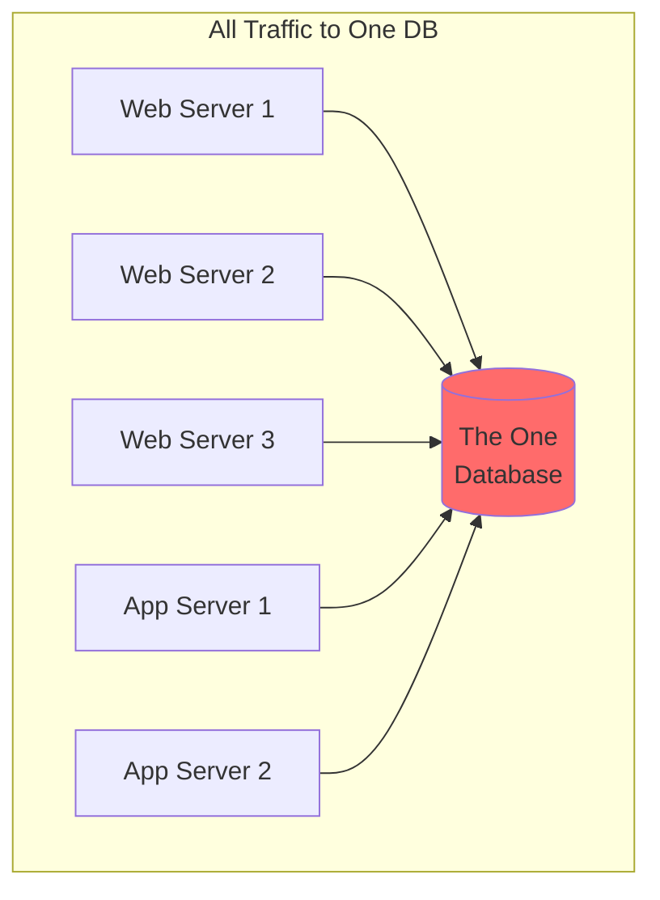
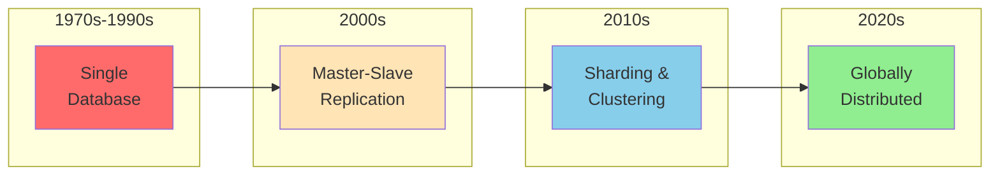
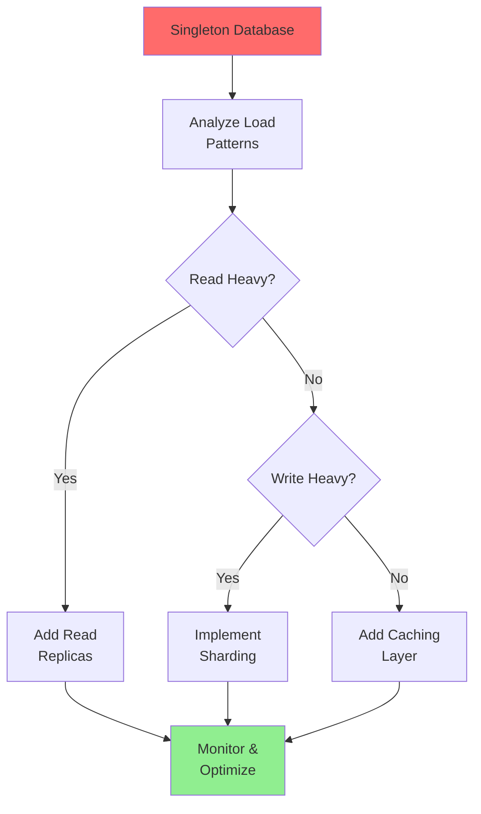
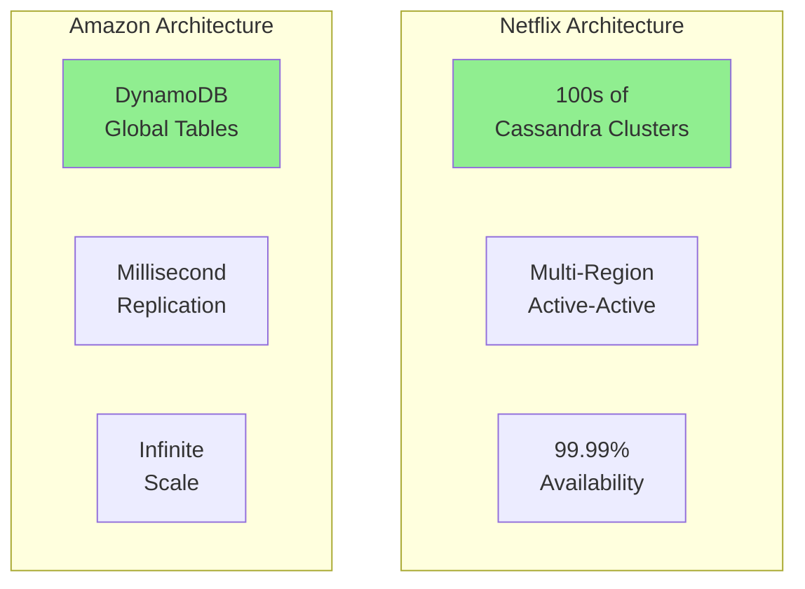
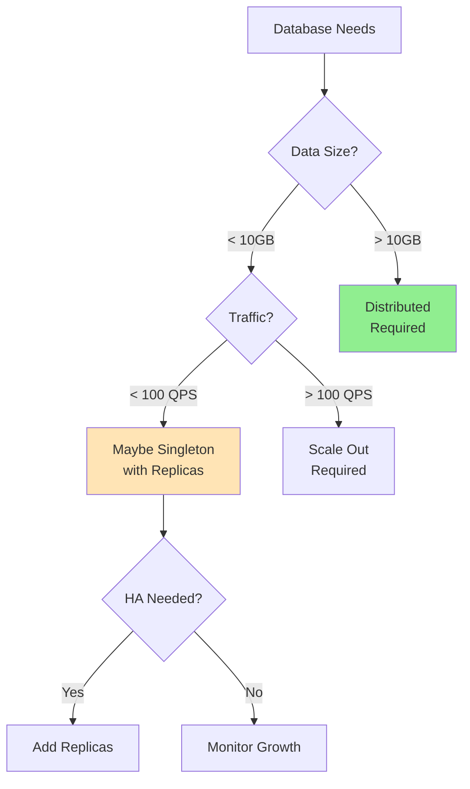
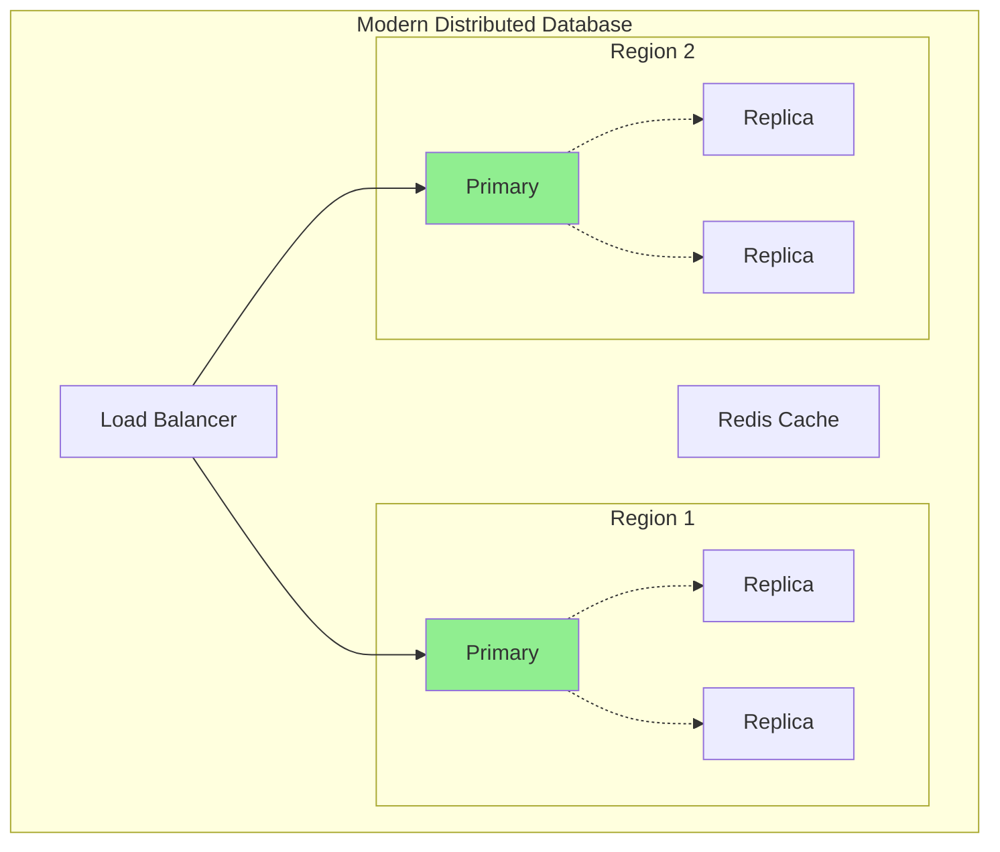

# Singleton Database Pattern

!!! danger "🥉 Bronze Tier Pattern"
    **Legacy Pattern** • Consider modern alternatives
    
    While still in use in legacy systems, this pattern has been superseded by distributed database architectures. See migration guides for transitioning to modern approaches.

**One database to rule them all (and in the darkness bind them)**

## Visual Architecture

## Why Singleton Database Fails at Scale

| Problem | Impact | Modern Solution |
|---------|--------|-----------------|
| **Single Point of Failure** | Entire system down | High availability clusters |
| **No Scale Out** | Vertical scaling only | Horizontal sharding |
| **Performance Ceiling** | Hardware limits | Distributed databases |
| **No Geo-Distribution** | High latency globally | Multi-region replicas |
| **Maintenance Downtime** | Service interruptions | Rolling updates |
| **Resource Contention** | Queries block each other | Read/write splitting |

## The Evolution of Database Architecture

## Classic Singleton Database Disasters

<h4>💥 The Black Friday Meltdown</h4>

**What Happens**: 
- E-commerce site with singleton database
- Black Friday traffic spike
- Database CPU hits 100%
- Connection pool exhausted
- Site completely down

**Result**: $10M in lost sales, 6-hour outage

**Prevention**: Read replicas, caching layer, database sharding

## Scaling Patterns Comparison

| Pattern | Availability | Scalability | Complexity | Cost |
|---------|-------------|-------------|------------|------|
| **Singleton DB** | Low | None | Low | Low initially |
| **Master-Slave** | Medium | Read only | Medium | Medium |
| **Multi-Master** | High | Read/Write | High | High |
| **Sharding** | High | Horizontal | Very High | Variable |
| **NewSQL** | Very High | Automatic | Medium | High |

## Migration Path from Singleton

## When Singleton Might Be Acceptable

<h4>🎯 Very Limited Use Cases</h4>

1. **Development Environment**
   - Local development
   - Integration testing
   - Proof of concepts

2. **Small Internal Tools**
   - Admin dashboards
   - Internal wikis
   - <100 users

3. **Embedded Systems**
   - IoT devices
   - Edge computing
   - Offline-first apps

**Warning**: Plan for growth from day one

## Real-World Scaling Examples

## Database Architecture Decision Framework

## Cost of Singleton Database at Scale

<h4>💰 The Vertical Scaling Trap</h4>

**Singleton Scaling Costs**:
- 2x capacity = 4x cost
- 4x capacity = 16x cost
- Hardware limits at ~$100k/server

**Distributed Scaling Costs**:
- 2x capacity = 2x cost
- Linear scaling
- Commodity hardware

**Example**: Twitter's move from MySQL singleton to distributed saved 75% on hardware

## Common Singleton Anti-Patterns

- [ ] All services connect to one database
- [ ] No connection pooling
- [ ] No read/write splitting
- [ ] Manual failover only
- [ ] No backup strategy
- [ ] Synchronous replication globally
- [ ] No query optimization
- [ ] Missing indexes ignored

## Modern Database Architecture

## Related Patterns

- [Database Sharding](sharding.md) - Horizontal partitioning
- [Read Replicas](read-repair.md) - Scale read operations
- [Multi-Region](multi-region.md) - Global distribution
- [Caching Strategies](caching-strategies.md) - Reduce database load
- [CQRS](cqrs.md) - Separate read/write models