# Split-Brain Detection & Resolution

## 🎯 The Essence

!!! danger "Core Problem"
    When network partitions occur, different parts of a distributed system may believe they are the authoritative segment, leading to data inconsistency and conflicting operations.

```mermaid
graph TB
    subgraph "Before Partition"
        N1[Node 1<br/>Leader] ---|Network| N2[Node 2]
        N1 ---|Network| N3[Node 3]
        N2 ---|Network| N3
        
        Client1[Client A] --> N1
        Client2[Client B] --> N2
    end
    
    subgraph "During Split-Brain"
        N1B[Node 1<br/>Leader?] -.-|❌ Partition| N2B[Node 2<br/>Leader?]
        N1B ---|OK| N3B[Node 3]
        
        C1[Client A] --> N1B
        C2[Client B] --> N2B
        
        Note1[Both sides think<br/>they're authoritative!]
    end
```



## 🔍 Intuition: The Island Nation Analogy

Imagine a country split by an earthquake into two islands. Each island:
- Has some government officials
- Can't communicate with the other island
- Must continue governing

**Without protocols**: Both islands elect new leaders, pass conflicting laws, chaos ensues.

**With protocols**: Pre-agreed rules determine which island maintains authority based on population (quorum), preventing conflicting decisions.

## 📊 Split-Brain Scenarios

| Scenario | Impact | Detection Method | Resolution |
|----------|--------|------------------|------------|
| **Network Partition** | Cluster splits | Heartbeat timeout | Quorum-based |
| **Asymmetric Failure** | Partial connectivity | Gossip divergence | Fencing |
| **Clock Skew** | Time-based conflicts | Vector clocks | Epoch numbers |
| **Byzantine Failure** | Malicious nodes | Consensus verification | BFT protocols |

## 🏗️ Detection Mechanisms

### 1. Quorum-Based Detection

```python
class QuorumBasedCluster:
    def __init__(self, nodes: List[Node], min_quorum: int = None):
        self.nodes = nodes
        self.min_quorum = min_quorum or (len(nodes) // 2 + 1)
        self.current_view = set(nodes)
        self.is_active = True
        
    def detect_split_brain(self) -> bool:
        """Detect if we're in minority partition"""
        reachable_nodes = self._probe_reachability()
        
        if len(reachable_nodes) < self.min_quorum:
            # We're in minority - potential split brain
            self.is_active = False
            return True
            
        # Check if another partition exists
        all_node_views = self._gather_node_views(reachable_nodes)
        return self._detect_conflicting_views(all_node_views)
        
    def _probe_reachability(self) -> Set[Node]:
        """Probe which nodes are reachable"""
        reachable = set()
        
        for node in self.nodes:
            try:
                response = node.ping(timeout=5.0)
                if response.status == "alive":
                    reachable.add(node)
            except TimeoutError:
                continue
                
        return reachable
        
    def _detect_conflicting_views(self, views: Dict[Node, Set[Node]]) -> bool:
        """Check if nodes have conflicting cluster views"""
        view_signatures = set()
        
        for node, view in views.items():
            signature = frozenset(view)
            view_signatures.add(signature)
            
        # Multiple views indicate split brain
        return len(view_signatures) > 1
```

### 2. Generation/Epoch Based Detection


```python
class EpochBasedLeader:
    def __init__(self, node_id: str, epoch_store: EpochStore):
        self.node_id = node_id
        self.epoch_store = epoch_store
        self.current_epoch = 0
        self.is_leader = False
        
    async def handle_partition_detected(self):
        """Handle potential split-brain scenario"""
        try:
            # Try to acquire new epoch
            new_epoch = await self.epoch_store.acquire_next_epoch(
                self.node_id,
                self.current_epoch
            )
            
            if new_epoch > self.current_epoch:
                # We got the epoch - remain active
                self.current_epoch = new_epoch
                self.is_leader = True
                await self._announce_new_epoch(new_epoch)
            else:
                # Another partition got it first
                self.is_leader = False
                await self._enter_follower_mode()
                
        except EpochAcquisitionError:
            # Can't reach epoch store - go inactive
            self.is_leader = False
            await self._enter_inactive_mode()
```

### 3. STONITH (Shoot The Other Node In The Head)

```python
class STONITHManager:
    """Forcefully fence nodes to prevent split-brain"""
    
    def __init__(self, fencing_devices: Dict[str, FencingDevice]):
        self.fencing_devices = fencing_devices
        self.fencing_history = []
        
    async def fence_node(self, node_id: str, reason: str):
        """Forcefully isolate a node"""
        device = self.fencing_devices.get(node_id)
        if not device:
            raise FencingError(f"No fencing device for {node_id}")
            
        # Multiple fencing methods for reliability
        methods = [
            self._network_fence,
            self._power_fence,
            self._storage_fence
        ]
        
        success = False
        for method in methods:
            try:
                await method(device)
                success = True
                break
            except FencingError:
                continue
                
        if success:
            self.fencing_history.append({
                'node': node_id,
                'timestamp': datetime.utcnow(),
                'reason': reason,
                'method': method.__name__
            })
            
            # Verify fencing worked
            if await self._verify_node_fenced(node_id):
                return True
                
        raise FencingError(f"Failed to fence {node_id}")
        
    async def _network_fence(self, device: FencingDevice):
        """Isolate node from network"""
        await device.disable_network_interfaces()
        
    async def _power_fence(self, device: FencingDevice):
        """Power off the node"""
        await device.power_off()
        
    async def _storage_fence(self, device: FencingDevice):
        """Revoke storage access"""
        await device.revoke_storage_access()
```

## 💥 Resolution Strategies

### 1. Static Quorum

```python
class StaticQuorumResolver:
    def __init__(self, total_nodes: int):
        self.total_nodes = total_nodes
        self.required_quorum = total_nodes // 2 + 1
        
    def resolve_partition(self, partition_nodes: Set[Node]) -> Decision:
        if len(partition_nodes) >= self.required_quorum:
            return Decision.REMAIN_ACTIVE
        else:
            return Decision.BECOME_INACTIVE
```

### 2. Dynamic Weighted Quorum

```python
class WeightedQuorumResolver:
    def __init__(self, node_weights: Dict[str, int]):
        self.node_weights = node_weights
        self.total_weight = sum(node_weights.values())
        self.required_weight = self.total_weight // 2 + 1
        
    def resolve_partition(self, partition_nodes: Set[Node]) -> Decision:
        partition_weight = sum(
            self.node_weights.get(node.id, 0) 
            for node in partition_nodes
        )
        
        if partition_weight >= self.required_weight:
            return Decision.REMAIN_ACTIVE
        else:
            return Decision.BECOME_INACTIVE
```

### 3. External Arbitrator


## 🎯 Design Patterns

| Pattern | Use Case | Pros | Cons |
|---------|----------|------|------|
| **Last Writer Wins** | Eventually consistent | Simple | Data loss possible |
| **Multi-Version** | Conflict detection | No data loss | Complex merging |
| **Operational Transform** | Collaborative editing | Automatic merging | Limited domains |
| **CRDT** | Automatic convergence | No coordination | Limited operations |

## 🌍 Real-World Examples

### 1. **MongoDB** - Replica Sets
- Uses majority quorum
- Automatic leader election
- Arbiter nodes for tie-breaking

### 2. **Elasticsearch** - Cluster State
- Minimum master nodes setting
- Prevents split-brain via quorum
- Discovery protocols

### 3. **Kafka** - Controller Election
- ZooKeeper-based arbitration
- Epoch numbers for fencing
- Min in-sync replicas

## ⚖️ When to Use vs Avoid

### ✅ Use When:
- **Data consistency** is critical
- **Multi-master** replication used
- **Network partitions** are possible
- **Automated failover** required

### ❌ Avoid When:
- **Eventually consistent** is acceptable
- **Manual intervention** preferred
- **Single datacenter** deployment
- **Read-only** workloads

## 🔗 Related Patterns

- **[Consensus](consensus.md)**: Agreement protocols
- **[Leader Election](leader-election.md)**: Choosing coordinators
- **[Fencing](distributed-lock.md)**: Preventing stale operations
- **[Vector Clocks](vector-clocks.md)**: Detecting conflicts
- **[Quorum](sharding.md)**: Majority decisions