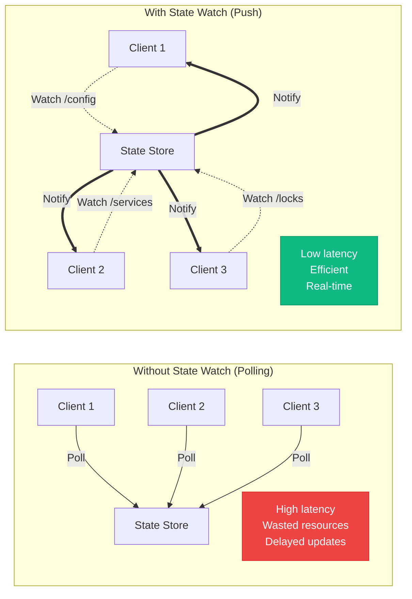
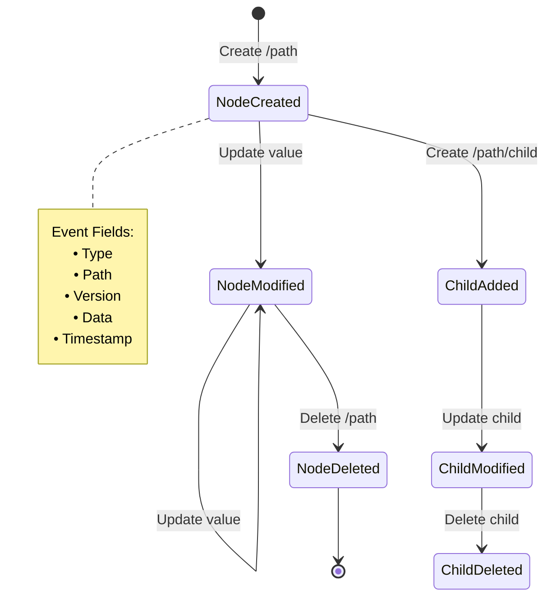
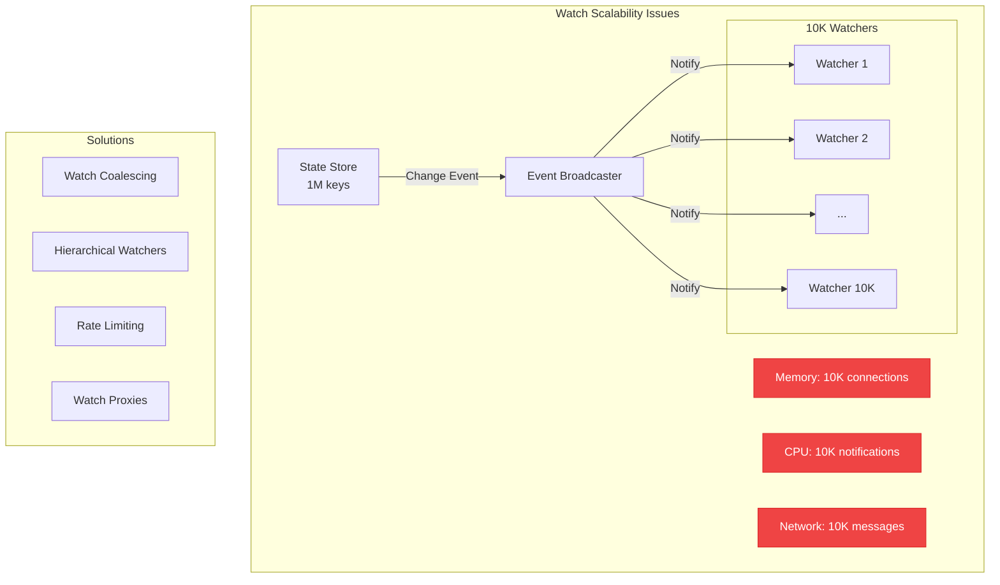
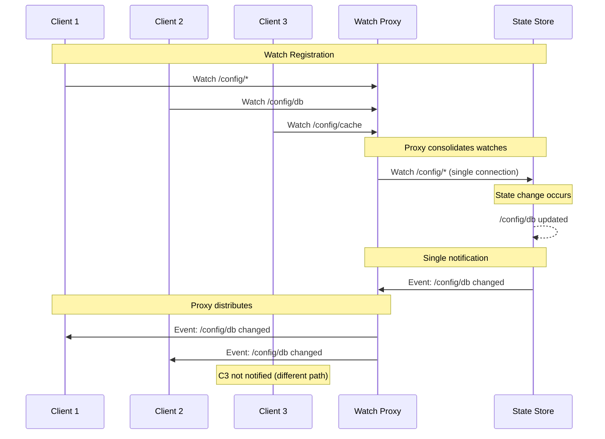

# State Watch (Change Notification) Pattern

**Distributed mechanism for monitoring state changes and notifying interested parties in real-time**

> *"In distributed systems, the most important events are the ones you're not watching for—until you are."*

---

## Level 1: Intuition

### Core Concept

State Watch enables clients to register interest in specific state changes and receive notifications when those changes occur, eliminating the need for constant polling:



### Real-World Analogies

| Analogy | Watch Mechanism | Notification |
|---------|----------------|--------------|
| **News Alerts** | Subscribe to topics | Push notifications |
| **Stock Trading** | Watch price thresholds | Instant alerts |
| **Security Cameras** | Motion detection | Alarm triggers |
| **Email Filters** | Inbox rules | New mail notification |

### Basic Implementation

```python
class SimpleStateWatch:
    def __init__(self):
        self.state = {}
        self.watches = defaultdict(list)  # path -> [callbacks]
        
    def set(self, path: str, value: Any):
        """Update state and notify watchers"""
        old_value = self.state.get(path)
        self.state[path] = value
        
        # Notify all watchers of this path
        if path in self.watches:
            event = WatchEvent(
                type='MODIFIED' if old_value else 'CREATED',
                path=path,
                old_value=old_value,
                new_value=value
            )
            
            for callback in self.watches[path]:
                callback(event)
    
    def watch(self, path: str, callback: Callable):
        """Register a watch on a path"""
        self.watches[path].append(callback)
        
        # Send initial value if exists
        if path in self.state:
            event = WatchEvent(
                type='INITIAL',
                path=path,
                old_value=None,
                new_value=self.state[path]
            )
            callback(event)
    
    def unwatch(self, path: str, callback: Callable):
        """Remove a watch"""
        if callback in self.watches[path]:
            self.watches[path].remove(callback)
```

---

## Level 2: Foundation

### Watch Models Comparison

| Model | Description | Pros | Cons |
|-------|-------------|------|------|
| **One-time Watch** | Fires once then auto-removes | Simple, no cleanup | Miss subsequent changes |
| **Persistent Watch** | Fires on every change | Complete visibility | Manual cleanup needed |
| **Recursive Watch** | Watches path and children | Comprehensive | Performance overhead |
| **Filtered Watch** | Only specific changes | Efficient | Complex setup |

### Watch Event Types



### Push vs Pull Architecture

```mermaid
flowchart TB
    subgraph "Pull-Based (Traditional)"
        Client1[Client] -->|1. Poll /config| Store1[State Store]
        Store1 -->|2. Return value| Client1
        Client1 -->|3. Sleep 5s| Timer1[Timer]
        Timer1 -->|4. Repeat| Client1
        
        Load1[High Load<br/>O(clients × frequency)]
    end
    
    subgraph "Push-Based (Watch)"
        Client2[Client] -->|1. Watch /config| Store2[State Store]
        Store2 -->|2. ACK + initial| Client2
        Update[Update] -->|3. Change /config| Store2
        Store2 ==>|4. Notify change| Client2
        
        Load2[Low Load<br/>O(changes)]
    end
    
    style Load1 fill:#ef4444,stroke:#dc2626,color:#fff
    style Load2 fill:#10b981,stroke:#059669,color:#fff
```

### ZooKeeper-Style Watches

```python
class ZKStyleWatch:
    def __init__(self):
        self.data = {}
        self.versions = {}
        self.watches = defaultdict(set)
        self.watch_types = defaultdict(dict)
        
    def create(self, path: str, data: bytes, ephemeral: bool = False):
        """Create node with version tracking"""
        if path in self.data:
            raise NodeExistsError(path)
            
        self.data[path] = data
        self.versions[path] = 0
        
        # Notify parent watchers
        parent = self._get_parent(path)
        self._fire_watches(parent, 'CHILD_ADDED', path)
        
    def set_data(self, path: str, data: bytes, version: int = -1):
        """Update with optimistic concurrency control"""
        if path not in self.data:
            raise NoNodeError(path)
            
        if version != -1 and self.versions[path] != version:
            raise BadVersionError(path, version, self.versions[path])
            
        old_data = self.data[path]
        self.data[path] = data
        self.versions[path] += 1
        
        # Fire data watches
        self._fire_watches(path, 'NODE_DATA_CHANGED', {
            'old_data': old_data,
            'new_data': data,
            'version': self.versions[path]
        })
        
    def get_data(self, path: str, watch: bool = False, 
                 watch_callback: Callable = None):
        """Get data with optional watch"""
        if path not in self.data:
            raise NoNodeError(path)
            
        if watch and watch_callback:
            self.watches[path].add(watch_callback)
            self.watch_types[path][watch_callback] = 'DATA'
            
        return self.data[path], self.versions[path]
        
    def get_children(self, path: str, watch: bool = False,
                     watch_callback: Callable = None):
        """Get children with optional watch"""
        children = [
            p.split('/')[-1] 
            for p in self.data.keys() 
            if self._get_parent(p) == path
        ]
        
        if watch and watch_callback:
            self.watches[path].add(watch_callback)
            self.watch_types[path][watch_callback] = 'CHILDREN'
            
        return children
        
    def _fire_watches(self, path: str, event_type: str, data: Any):
        """Fire all watches for a path (one-time semantics)"""
        if path in self.watches:
            callbacks = self.watches[path].copy()
            # Clear watches (one-time semantics)
            self.watches[path].clear()
            self.watch_types[path].clear()
            
            event = WatchEvent(
                type=event_type,
                path=path,
                data=data,
                timestamp=time.time()
            )
            
            for callback in callbacks:
                try:
                    callback(event)
                except Exception as e:
                    logger.error(f"Watch callback error: {e}")
```

### etcd Watch API

```python
class EtcdStyleWatch:
    def __init__(self):
        self.kv_store = {}
        self.revision = 0
        self.watch_streams = {}
        self.watch_id_counter = 0
        
    def put(self, key: str, value: str):
        """Put with revision tracking"""
        self.revision += 1
        old_value = self.kv_store.get(key)
        
        self.kv_store[key] = {
            'value': value,
            'revision': self.revision,
            'version': self.kv_store.get(key, {}).get('version', 0) + 1
        }
        
        # Notify watchers
        event = {
            'type': 'PUT',
            'key': key,
            'value': value,
            'revision': self.revision,
            'prev_value': old_value
        }
        
        self._notify_watchers(key, event)
        
    def watch(self, key: str, start_revision: int = None,
              prefix: bool = False, filters: List[str] = None):
        """Create a watch stream"""
        watch_id = self.watch_id_counter
        self.watch_id_counter += 1
        
        watch_stream = WatchStream(
            watch_id=watch_id,
            key=key,
            prefix=prefix,
            filters=filters or [],
            start_revision=start_revision or self.revision + 1
        )
        
        self.watch_streams[watch_id] = watch_stream
        
        # Send historical events if requested
        if start_revision and start_revision <= self.revision:
            self._send_historical_events(watch_stream)
            
        return watch_stream
        
    def _notify_watchers(self, key: str, event: dict):
        """Notify all matching watchers"""
        for watch_id, stream in self.watch_streams.items():
            if self._matches_watch(stream, key, event):
                stream.send_event(event)
                
    def _matches_watch(self, stream: WatchStream, key: str, event: dict):
        """Check if event matches watch criteria"""
        # Check key match
        if stream.prefix:
            if not key.startswith(stream.key):
                return False
        else:
            if key != stream.key:
                return False
                
        # Check filters
        for filter_type in stream.filters:
            if filter_type == 'NO_PUT' and event['type'] == 'PUT':
                return False
            elif filter_type == 'NO_DELETE' and event['type'] == 'DELETE':
                return False
                
        return True


class WatchStream:
    """Persistent watch stream with event queue"""
    def __init__(self, watch_id: int, key: str, **kwargs):
        self.watch_id = watch_id
        self.key = key
        self.prefix = kwargs.get('prefix', False)
        self.filters = kwargs.get('filters', [])
        self.start_revision = kwargs.get('start_revision', 0)
        self.event_queue = Queue()
        self.cancelled = False
        
    def send_event(self, event: dict):
        """Add event to stream"""
        if not self.cancelled:
            self.event_queue.put(event)
            
    def recv(self, timeout: float = None):
        """Receive next event"""
        try:
            return self.event_queue.get(timeout=timeout)
        except Empty:
            return None
            
    def cancel(self):
        """Cancel watch stream"""
        self.cancelled = True
```

---

## Level 3: Deep Dive

### Scalability Challenges



### Watch Coalescing

```python
class CoalescingWatchManager:
    """Coalesce multiple watches to reduce overhead"""
    def __init__(self, batch_interval: float = 0.1):
        self.watches = defaultdict(set)  # path -> set of clients
        self.pending_events = defaultdict(list)
        self.batch_interval = batch_interval
        self.executor = ThreadPoolExecutor(max_workers=10)
        
    def add_watch(self, client_id: str, path: str):
        """Add watch with automatic batching"""
        self.watches[path].add(client_id)
        
    def notify_change(self, path: str, event: dict):
        """Queue event for batch delivery"""
        self.pending_events[path].append(event)
        
        # Schedule batch delivery
        self.executor.submit(
            self._deliver_batch, 
            path, 
            self.batch_interval
        )
        
    def _deliver_batch(self, path: str, delay: float):
        """Deliver coalesced events"""
        time.sleep(delay)
        
        events = self.pending_events[path]
        if not events:
            return
            
        # Coalesce events
        coalesced = self._coalesce_events(events)
        self.pending_events[path] = []
        
        # Notify all watchers
        clients = self.watches.get(path, set())
        for client_id in clients:
            self._send_to_client(client_id, coalesced)
            
    def _coalesce_events(self, events: List[dict]) -> dict:
        """Merge multiple events into one"""
        if not events:
            return None
            
        # Take latest value, preserve all keys that changed
        return {
            'type': 'COALESCED',
            'count': len(events),
            'first_revision': events[0].get('revision'),
            'last_revision': events[-1].get('revision'),
            'final_value': events[-1].get('value'),
            'changed_keys': list(set(e.get('key') for e in events))
        }
```

### Hierarchical Watch Distribution

```python
class HierarchicalWatchTree:
    """Distribute watches across hierarchy for scalability"""
    def __init__(self):
        self.root = WatchNode('/')
        self.watch_index = {}  # watch_id -> node
        
    def add_watch(self, watch_id: str, path: str, recursive: bool = False):
        """Add watch to appropriate level"""
        node = self._find_or_create_node(path)
        
        if recursive:
            node.recursive_watches.add(watch_id)
        else:
            node.exact_watches.add(watch_id)
            
        self.watch_index[watch_id] = node
        
    def notify_change(self, path: str, event: dict):
        """Notify through hierarchy"""
        affected_watches = set()
        
        # Walk up the tree collecting watches
        parts = path.split('/')
        for i in range(len(parts), 0, -1):
            ancestor_path = '/'.join(parts[:i])
            node = self._find_node(ancestor_path)
            
            if node:
                # Exact matches at this level
                if ancestor_path == path:
                    affected_watches.update(node.exact_watches)
                    
                # Recursive watches from ancestors
                affected_watches.update(node.recursive_watches)
                
        return affected_watches
        
    def _find_or_create_node(self, path: str) -> 'WatchNode':
        """Navigate tree, creating nodes as needed"""
        current = self.root
        parts = path.split('/')[1:]  # Skip empty first element
        
        for part in parts:
            if part not in current.children:
                current.children[part] = WatchNode(part)
            current = current.children[part]
            
        return current


class WatchNode:
    def __init__(self, name: str):
        self.name = name
        self.exact_watches = set()
        self.recursive_watches = set()
        self.children = {}
```

### Watch Stream Multiplexing



---

## Level 4: Expert

### Production Implementation Patterns

#### Service Discovery via Watches

```python
class WatchBasedServiceDiscovery:
    """Service discovery using state watches"""
    def __init__(self, state_store: StateStore):
        self.store = state_store
        self.services = {}  # service -> instances
        self.callbacks = defaultdict(list)
        self._setup_watches()
        
    def _setup_watches(self):
        """Watch service registry paths"""
        # Watch for new services
        self.store.watch(
            '/services',
            recursive=True,
            callback=self._on_service_change
        )
        
    def _on_service_change(self, event: WatchEvent):
        """Handle service instance changes"""
        # Parse service and instance from path
        # /services/{service_name}/instances/{instance_id}
        parts = event.path.split('/')
        
        if len(parts) >= 5 and parts[3] == 'instances':
            service_name = parts[2]
            instance_id = parts[4]
            
            if event.type == 'CREATED' or event.type == 'MODIFIED':
                self._handle_instance_up(service_name, instance_id, event.data)
            elif event.type == 'DELETED':
                self._handle_instance_down(service_name, instance_id)
                
    def _handle_instance_up(self, service: str, instance: str, data: dict):
        """Add/update service instance"""
        if service not in self.services:
            self.services[service] = {}
            
        self.services[service][instance] = {
            'address': data.get('address'),
            'port': data.get('port'),
            'metadata': data.get('metadata', {}),
            'health': data.get('health', 'unknown'),
            'last_seen': time.time()
        }
        
        # Notify subscribers
        self._notify_subscribers(service, 'instance_added', instance)
        
    def discover(self, service: str, watch: bool = False) -> List[dict]:
        """Discover service instances with optional watch"""
        if watch:
            # Return current instances and watch for changes
            def watch_callback(instances):
                # User callback will receive updated instance list
                pass
            self.callbacks[service].append(watch_callback)
            
        return list(self.services.get(service, {}).values())
```

#### Configuration Hot-Reload

```python
class ConfigWatcher:
    """Watch configuration changes and hot-reload"""
    def __init__(self, config_store: ConfigStore):
        self.store = config_store
        self.config_cache = {}
        self.reload_callbacks = defaultdict(list)
        self.version_map = {}
        
    def watch_config(self, app_name: str, callback: Callable):
        """Watch configuration with automatic reload"""
        config_path = f'/config/{app_name}'
        
        # Load initial config
        config, version = self.store.get(config_path, watch=True)
        self.config_cache[app_name] = config
        self.version_map[app_name] = version
        
        # Set up watch
        self.store.watch(
            config_path,
            lambda event: self._on_config_change(app_name, event)
        )
        
        # Register reload callback
        self.reload_callbacks[app_name].append(callback)
        
        # Return initial config
        return config
        
    def _on_config_change(self, app_name: str, event: WatchEvent):
        """Handle configuration change"""
        if event.type != 'MODIFIED':
            return
            
        try:
            # Parse new config
            new_config = json.loads(event.data)
            old_config = self.config_cache.get(app_name, {})
            
            # Validate configuration
            if not self._validate_config(new_config):
                logger.error(f"Invalid config for {app_name}")
                return
                
            # Check what changed
            changes = self._diff_configs(old_config, new_config)
            
            # Update cache
            self.config_cache[app_name] = new_config
            self.version_map[app_name] = event.version
            
            # Notify callbacks with changes
            for callback in self.reload_callbacks[app_name]:
                try:
                    callback(new_config, changes)
                except Exception as e:
                    logger.error(f"Config reload callback failed: {e}")
                    
        except Exception as e:
            logger.error(f"Config change handling failed: {e}")
            
    def _diff_configs(self, old: dict, new: dict) -> dict:
        """Compute configuration differences"""
        changes = {
            'added': {},
            'modified': {},
            'removed': {}
        }
        
        # Find additions and modifications
        for key, value in new.items():
            if key not in old:
                changes['added'][key] = value
            elif old[key] != value:
                changes['modified'][key] = {
                    'old': old[key],
                    'new': value
                }
                
        # Find removals
        for key in old:
            if key not in new:
                changes['removed'][key] = old[key]
                
        return changes
```

#### Distributed Lock with Watch

```python
class WatchBasedDistributedLock:
    """Distributed lock using watches for efficiency"""
    def __init__(self, state_store: StateStore):
        self.store = state_store
        self.held_locks = {}  # lock_id -> lock_info
        
    def acquire(self, lock_path: str, client_id: str, 
                timeout: float = None) -> Optional[str]:
        """Acquire lock with watch-based waiting"""
        lock_id = str(uuid.uuid4())
        acquire_time = time.time()
        
        while True:
            # Try to create lock node
            try:
                self.store.create(
                    f"{lock_path}/lock",
                    data={
                        'owner': client_id,
                        'lock_id': lock_id,
                        'acquired_at': acquire_time
                    },
                    ephemeral=True  # Auto-cleanup on disconnect
                )
                
                self.held_locks[lock_id] = {
                    'path': lock_path,
                    'client': client_id
                }
                
                return lock_id
                
            except NodeExistsError:
                # Lock is held, watch for release
                if timeout and (time.time() - acquire_time) > timeout:
                    return None  # Timeout
                    
                # Set up watch and wait
                released = Event()
                
                def watch_callback(event):
                    if event.type == 'DELETED':
                        released.set()
                        
                try:
                    # Check if lock still exists and set watch
                    self.store.exists(
                        f"{lock_path}/lock",
                        watch=True,
                        watch_callback=watch_callback
                    )
                    
                    # Wait for deletion or timeout
                    wait_time = timeout - (time.time() - acquire_time) if timeout else None
                    if released.wait(wait_time):
                        continue  # Retry acquisition
                    else:
                        return None  # Timeout
                        
                except NoNodeError:
                    # Lock was released before we could watch
                    continue  # Retry immediately
```

### Advanced Watch Patterns

#### Watch with Backpressure

```python
class BackpressureWatchStream:
    """Watch stream with backpressure control"""
    def __init__(self, max_pending: int = 1000):
        self.max_pending = max_pending
        self.pending_events = Queue(maxsize=max_pending)
        self.dropped_events = 0
        self.backpressure_callbacks = []
        
    def send_event(self, event: dict) -> bool:
        """Send event with backpressure detection"""
        try:
            self.pending_events.put_nowait(event)
            return True
        except Full:
            self.dropped_events += 1
            self._trigger_backpressure()
            return False
            
    def _trigger_backpressure(self):
        """Notify about backpressure"""
        for callback in self.backpressure_callbacks:
            callback(self.dropped_events)
```

---

## Level 5: Mastery

### Theoretical Analysis

#### Watch Overhead Calculation

```python
def calculate_watch_overhead(
    num_watchers: int,
    num_keys: int,
    change_rate: float,  # changes per second
    watch_selectivity: float = 0.1  # fraction of watches triggered
) -> dict:
    """Calculate theoretical watch system overhead"""
    
    # Memory overhead
    watch_memory = num_watchers * 256  # 256 bytes per watch connection
    index_memory = num_watchers * num_keys * 8  # 8 bytes per index entry
    
    # Network overhead
    notification_rate = change_rate * num_watchers * watch_selectivity
    network_bandwidth = notification_rate * 512  # 512 bytes per notification
    
    # CPU overhead (comparisons)
    comparisons_per_change = num_watchers * math.log2(num_keys)
    cpu_overhead = change_rate * comparisons_per_change
    
    return {
        'memory_mb': (watch_memory + index_memory) / (1024 * 1024),
        'network_mbps': (network_bandwidth * 8) / (1024 * 1024),
        'cpu_operations_per_sec': cpu_overhead,
        'notification_latency_ms': 1 + (num_watchers * watch_selectivity) / 1000
    }
```

#### Watch vs Polling Trade-off

```mermaid
graph TB
    subgraph "Resource Usage Comparison"
        subgraph "Polling"
            P1[CPU: O(clients × frequency)]
            P2[Network: O(clients × frequency)]
            P3[Latency: frequency/2 average]
        end
        
        subgraph "Watching"
            W1[CPU: O(changes × watchers)]
            W2[Network: O(changes × affected)]
            W3[Latency: ~1ms]
        end
    end
    
    subgraph "Break-even Analysis"
        Formula[Changes/sec < Clients × Poll_frequency × Selectivity]
        Example[100 changes/s < 1000 clients × 1/s × 0.1 = Yes, use watches]
    end
```

### Future Directions

1. **Predictive Watches**: ML-based prediction of which watches will fire
2. **Quantum State Observation**: Quantum-safe distributed state observation
3. **Edge Watch Networks**: Hierarchical watch networks for edge computing
4. **Blockchain Event Logs**: Immutable watch event history

---

## Quick Reference

### Watch Pattern Selection

| Use Case | Pattern | Rationale |
|----------|---------|-----------|
| **Config Management** | Persistent watch | Long-lived, infrequent changes |
| **Service Discovery** | Recursive watch | Monitor service tree |
| **Leader Election** | One-time watch | Single event matters |
| **Distributed Lock** | Ephemeral watch | Auto-cleanup critical |
| **Cache Invalidation** | Filtered watch | Only specific changes |

### Implementation Checklist

- [ ] Choose watch type (one-time vs persistent)
- [ ] Define watch granularity (exact vs prefix/recursive)
- [ ] Implement connection management
- [ ] Handle watch event coalescing
- [ ] Add backpressure controls
- [ ] Plan for scale (watch proxies)
- [ ] Monitor watch overhead metrics
- [ ] Test disconnection scenarios
- [ ] Implement watch lease/timeout
- [ ] Document watch semantics

### Common Pitfalls

| Pitfall | Impact | Solution |
|---------|--------|----------|
| **Watch Storms** | System overload | Coalescing, rate limiting |
| **Leaked Watches** | Memory exhaustion | Automatic expiration |
| **Herd Effect** | Thundering herd | Randomized delays |
| **Watch Loops** | Infinite notifications | Loop detection |
| **Silent Failures** | Missed updates | Heartbeat verification |

---

## Related Patterns

- [Distributed Lock](distributed-lock.md) - Often uses watches for efficiency
- [Leader Election](leader-election.md) - Watches detect leader changes
- [Service Discovery](service-discovery.md) - Real-time service updates
- [Consensus](consensus.md) - Watch for consensus state changes
- [Event Sourcing](event-sourcing.md) - Alternative to state watching

---

*"In distributed systems, the observer affects the observed—design your watches accordingly."*