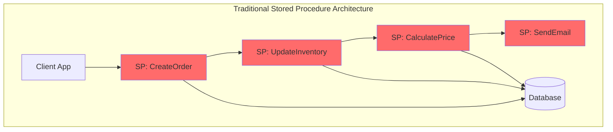
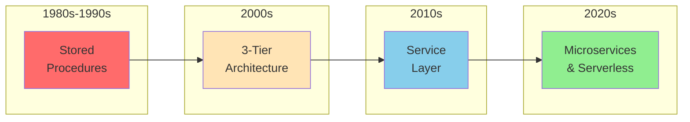
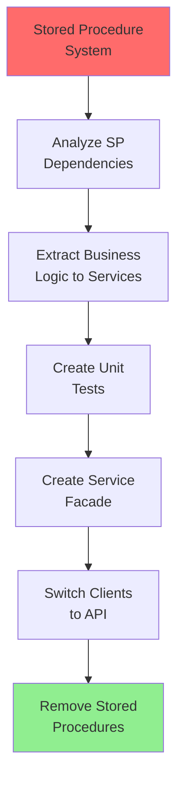
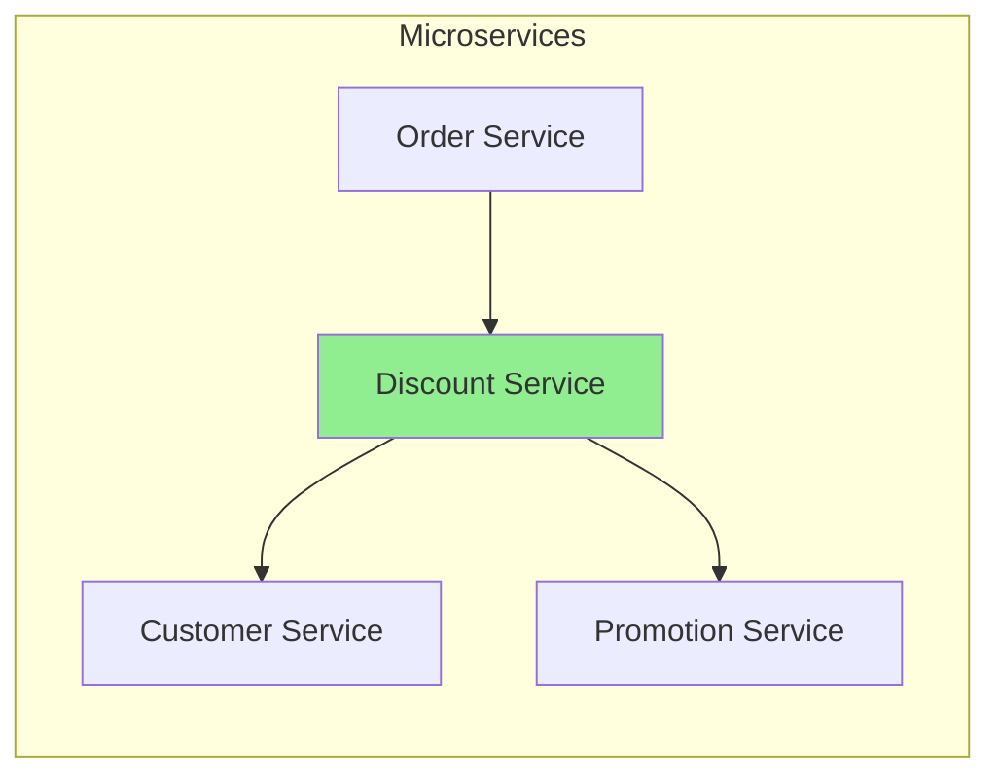

# Stored Procedures Pattern

!!! danger "🥉 Bronze Tier Pattern"
    **Legacy Pattern** • Consider modern alternatives
    
    While still in use in legacy systems, this pattern has been superseded by application-layer business logic and microservices. See migration guides for transitioning to modern approaches.

**When your database becomes your application server**

## Visual Architecture



## Why Stored Procedures Are Problematic

| Problem | Impact | Modern Solution |
|---------|--------|-----------------|
| **Vendor Lock-in** | Can't change databases | Portable application code |
| **Poor Testing** | No unit test frameworks | TDD with mock objects |
| **Version Control** | Database scripts chaos | Git with CI/CD |
| **No Debugging** | Limited tools | Modern IDEs and debuggers |
| **Scaling Issues** | Vertical only | Horizontal microservices |
| **Mixed Concerns** | Business logic in DB | Clean architecture |

## Evolution of Business Logic Placement



## Common Anti-Patterns with Stored Procedures

<div class="failure-vignette">
<h4>💥 The 5000-Line Stored Procedure</h4>

**What Happens**: 
- Started as simple data validation
- Grew to include business rules
- Added email sending
- Now calls web services
- Contains embedded HTML

**Result**: Unmaintainable, untestable nightmare

**Prevention**: Keep stored procedures data-focused only
</div>

## When Stored Procedures Might Be Acceptable

<div class="decision-box">
<h4>🎯 Limited Acceptable Use Cases</h4>

1. **Data-Intensive Operations**
   - Bulk ETL processes
   - Complex reporting queries
   - Data warehouse operations

2. **Performance-Critical Paths**
   - High-frequency trading
   - Real-time analytics
   - Where network latency matters

3. **Security Boundaries**
   - Database-level access control
   - Audit logging at DB level

**Rule**: Only data manipulation, never business logic
</div>

## Migration Strategy from Stored Procedures



## Modern Architecture Comparison

| Aspect | Stored Procedures | Application Services | Serverless Functions |
|--------|-------------------|---------------------|---------------------|
| **Scalability** | Vertical only | Horizontal | Infinite |
| **Testing** | Database required | Mocked/In-memory | Local emulation |
| **Version Control** | Complex | Git native | Git native |
| **Debugging** | Limited tools | Full IDE support | Cloud debugging |
| **Deployment** | Database downtime | Rolling updates | Instant |
| **Cost Model** | License-based | Instance-based | Per-execution |

## Stored Procedure Code Smells

- [ ] Business logic mixed with data access
- [ ] Calling external services from SP
- [ ] HTML/XML generation in procedures
- [ ] Complex IF/ELSE business rules
- [ ] Cross-database queries
- [ ] Cursor-based processing
- [ ] Dynamic SQL generation
- [ ] Error handling via return codes

## Extracting Business Logic Example

### Before (Stored Procedure):
```sql
CREATE PROCEDURE CalculateOrderDiscount
    @OrderID INT,
    @CustomerID INT
AS
BEGIN
    -- 500 lines of complex business rules
    -- Customer tier logic
    -- Seasonal promotions
    -- Product category rules
    -- Loyalty calculations
END
```

### After (Service):


## Performance Myths vs Reality

<div class="truth-box">
<h4>💡 "But Stored Procedures Are Faster!"</h4>

**The Myth**: SPs are always faster than application code

**The Reality**:
- Network round trips often negligible
- Application servers scale horizontally
- Caching layers eliminate DB hits
- Modern ORMs optimize queries
- Database becomes bottleneck at scale

**Benchmark**: Netflix processes 1M+ requests/sec without stored procedures
</div>

## Related Patterns

- [Domain-Driven Design](../excellence/guides/domain-driven-design.md) - Proper business logic placement
- [Microservices](../excellence/guides/microservices-architecture.md) - Service-based logic
- [API Gateway](api-gateway.md) - External interface layer
- [CQRS](cqrs.md) - Separate read/write models
- [Event Sourcing](event-sourcing.md) - Audit without stored procedures