# Strangler Fig Pattern

!!! info "The Botanical Metaphor"
    The strangler fig tree starts life as a seed deposited high in another tree. It sends roots down and vines up, gradually enveloping the host tree. Eventually, the host dies and decomposes, leaving the strangler fig standing independently—a perfect metaphor for legacy system replacement.

## Problem Statement

<h4>The Big Bang Disaster</h4>

A major bank attempted a complete system rewrite over 3 years. On cutover weekend:

<ul>
<li>40% of transactions failed silently</li>
<li>Customer data inconsistencies affected 2M accounts</li>
<li>Rollback took 72 hours of downtime</li>
<li>$50M in losses and regulatory fines</li>
</ul>

<strong>Root cause:</strong> Attempting to replace everything at once instead of incremental migration

## Solution Overview

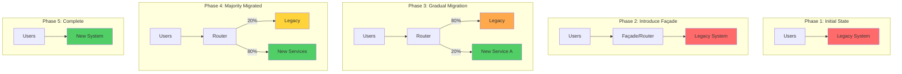

## Implementation Strategies

### 1. Edge Proxy Strategy

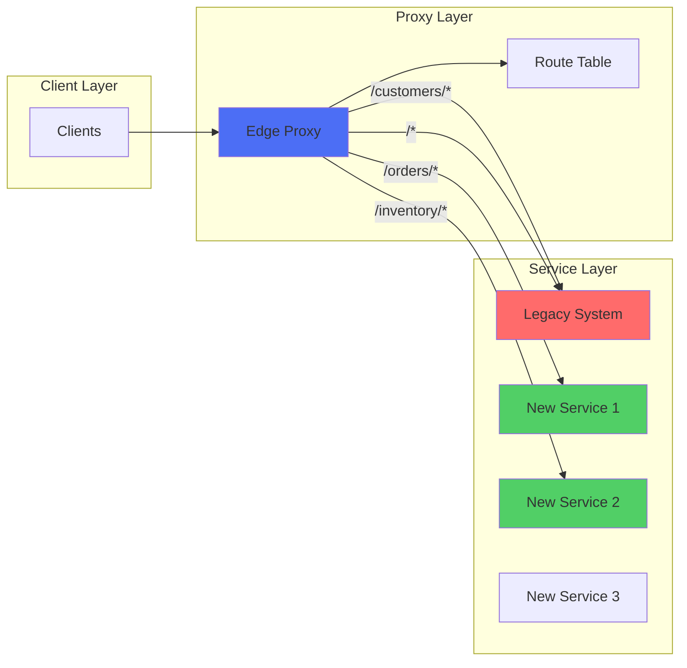

| Feature | Edge Proxy | Branch by Abstraction | Parallel Run |
|---------|------------|----------------------|--------------|
| **Deployment Risk** | Low | Medium | Low |
| **Rollback Speed** | Instant | Code Deploy | Instant |
| **Performance Impact** | +5-10ms latency | Minimal | 2x resource usage |
| **Code Complexity** | External | Internal refactoring | Comparison logic |
| **Best For** | API-based systems | Monolithic codebases | Critical systems |

### 2. Branch by Abstraction Strategy

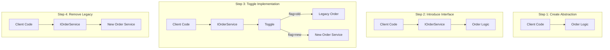

### 3. Parallel Run Strategy

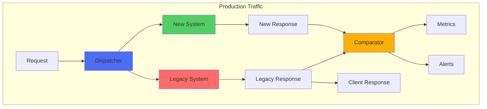

## Progressive Migration Patterns

### Database Strangling

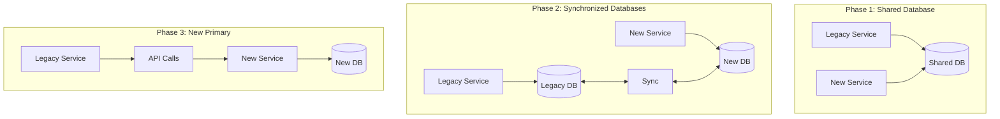

### Feature Toggle Evolution

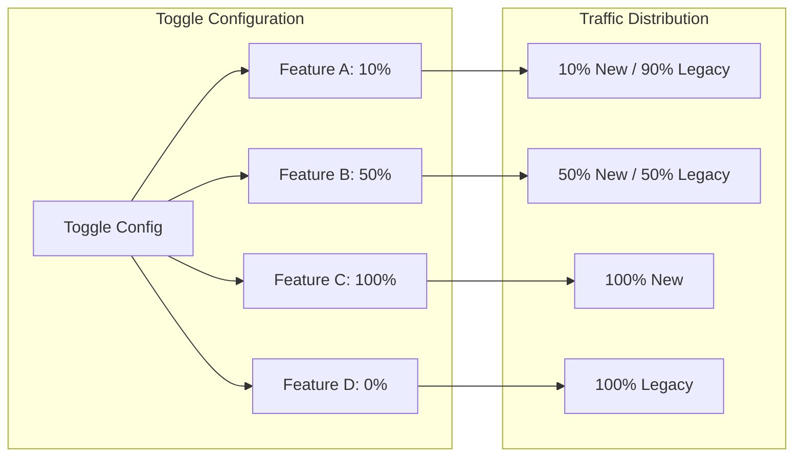

## Risk Mitigation Matrix

| Risk | Mitigation Strategy | Rollback Plan |
|------|-------------------|---------------|
| **Data Inconsistency** | Dual writes with reconciliation | Replay from event log |
| **Performance Degradation** | Shadow load testing | Route back to legacy |
| **Feature Parity Gap** | Parallel run comparison | Feature flags per endpoint |
| **Integration Failures** | Circuit breakers + fallbacks | Instant proxy reroute |
| **State Corruption** | Event sourcing + snapshots | Point-in-time recovery |

## Real-World Examples

### Example 1: Amazon Product Catalog Migration

<h4>Migration Strategy</h4>
<ul>
<li><strong>Duration:</strong> 18 months</li>
<li><strong>Approach:</strong> Category-by-category migration</li>
<li><strong>Key Success Factors:</strong>
  <ul>
  <li>Shadow traffic for 3 months per category</li>
  <li>Automated comparison of 100M+ requests daily</li>
  <li>Gradual traffic shift: 1% → 5% → 25% → 50% → 100%</li>
  </ul>
</li>
<li><strong>Result:</strong> Zero customer-facing incidents</li>
</ul>

### Example 2: Netflix Billing System Evolution

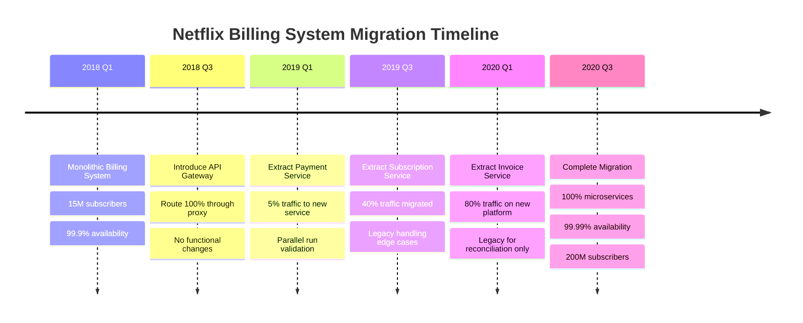

## Anti-Patterns to Avoid

### 1. The Incomplete Strangler

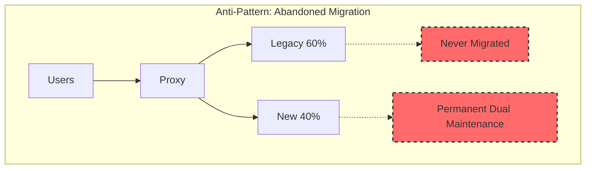

### 2. The Feature Disparity Trap

| Anti-Pattern | Symptoms | Solution |
|--------------|----------|----------|
| **Incomplete Feature Migration** | New system missing 20% features | Feature inventory before starting |
| **Data Model Mismatch** | Constant translation overhead | Gradual schema evolution |
| **Performance Regression** | New system 3x slower | Performance gates per migration |
| **Dependency Tangle** | Circular dependencies emerge | Clear bounded contexts |

## Integration with Other Patterns

### API Gateway Integration

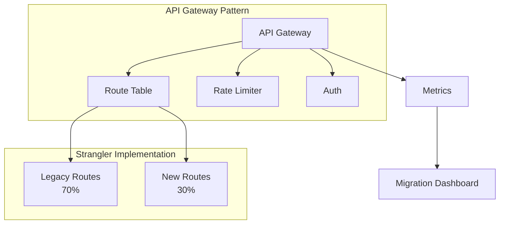

### Service Mesh Enhancement

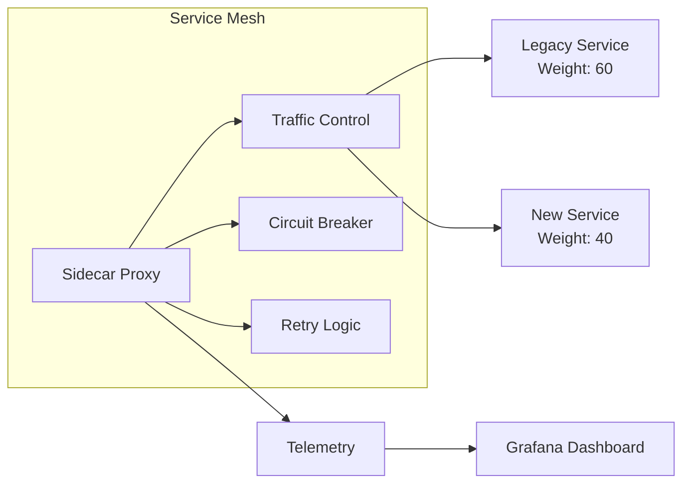

## Implementation Checklist

<h4>Pre-Migration Checklist</h4>
<ul>
<li>☐ Complete feature inventory of legacy system</li>
<li>☐ Identify all integration points and dependencies</li>
<li>☐ Design routing/proxy layer architecture</li>
<li>☐ Establish metrics for comparison</li>
<li>☐ Create rollback procedures for each phase</li>
<li>☐ Set up parallel run infrastructure</li>
<li>☐ Define success criteria per component</li>
</ul>

<h4>During Migration Checklist</h4>
<ul>
<li>☐ Monitor error rates continuously</li>
<li>☐ Compare outputs in parallel run</li>
<li>☐ Validate data consistency daily</li>
<li>☐ Track performance metrics</li>
<li>☐ Maintain feature parity documentation</li>
<li>☐ Regular stakeholder communication</li>
<li>☐ Gradual traffic shift (1% → 5% → 25% → 50% → 100%)</li>
</ul>

## Monitoring and Observability

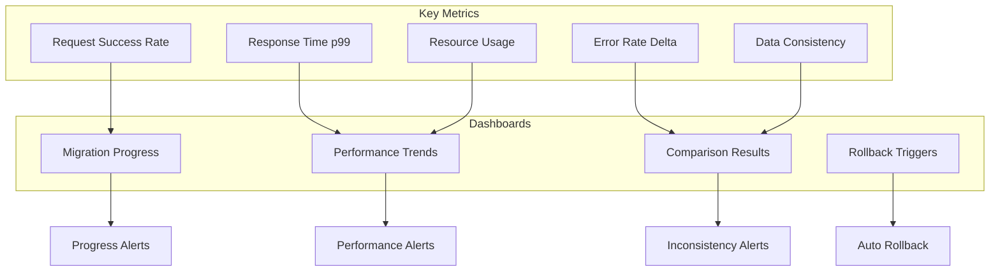

## Success Criteria

| Metric | Target | Measurement |
|--------|--------|-------------|
| **Error Rate** | < 0.01% increase | Compare legacy vs new |
| **Latency** | < 5% increase | p50, p95, p99 |
| **Consistency** | 99.999% match | Parallel run comparison |
| **Availability** | No degradation | Same SLA maintained |
| **Cost** | < 20% increase during migration | Include dual running |

## Related Patterns

- [API Gateway](api-gateway.md) - Front-door for routing during migration
- [Service Mesh](service-mesh.md) - Traffic management and observability
- [Anti-Corruption Layer](anti-corruption-layer.md) - Protect new services from legacy
- [Event Sourcing](event-sourcing.md) - Capture all changes for replay
- [Circuit Breaker](circuit-breaker.md) - Protect during partial failures

## References

- Martin Fowler's original [Strangler Fig Application](https://martinfowler.com/bliki/StranglerFigApplication.html)
- [Monolith to Microservices](https://www.oreilly.com/library/view/monolith-to-microservices/9781492047834/) by Sam Newman
- AWS [Strangler Fig Pattern Guide](https://docs.aws.amazon.com/prescriptive-guidance/latest/modernization-aspnet-web-services/fig-pattern.html)