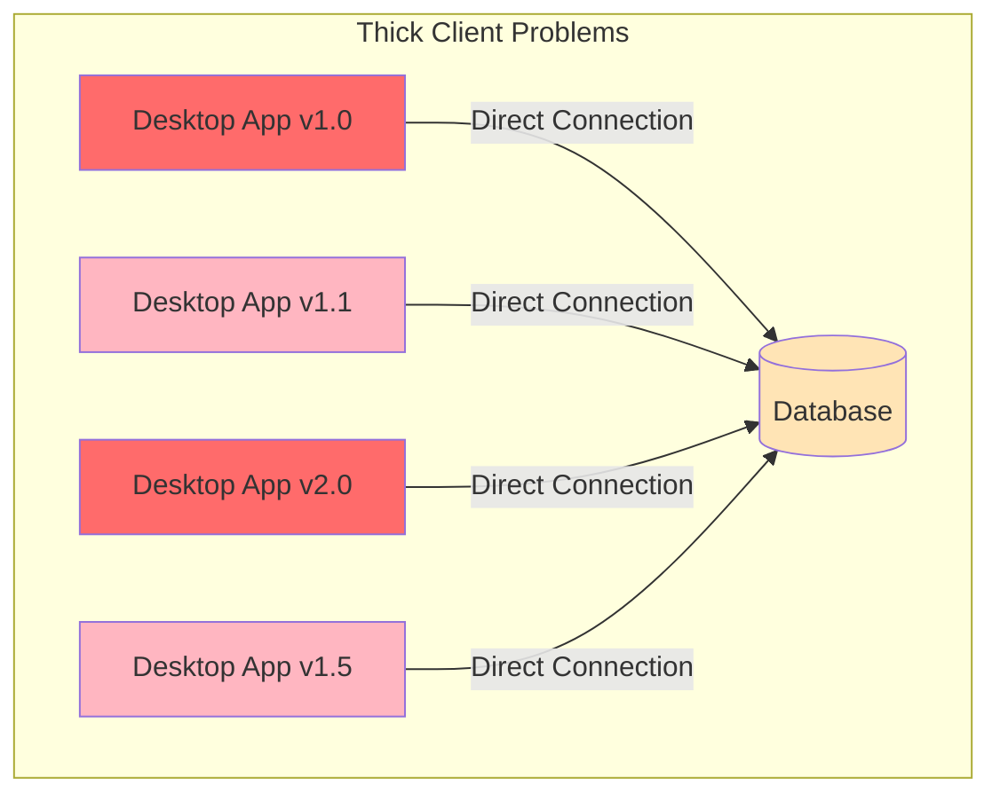
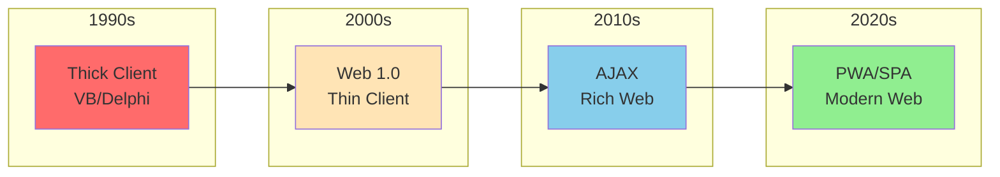
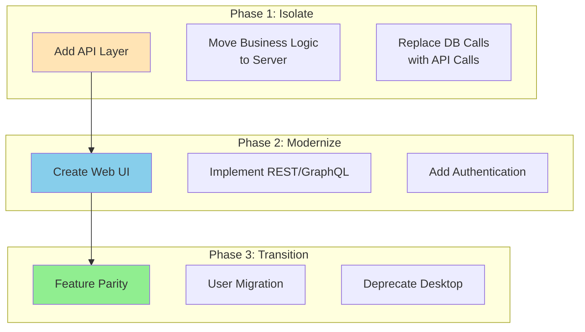
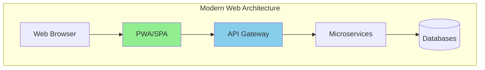

# Thick Client Pattern

!!! danger "🥉 Bronze Tier Pattern"
    **Legacy Pattern** • Consider modern alternatives
    
    While still in use in legacy desktop systems, this pattern has been superseded by web-based architectures and Progressive Web Apps. See migration guides for transitioning to modern approaches.

**When your application and database are too close for comfort**

## Visual Architecture

## Why Thick Clients Are Problematic

| Problem | Impact | Modern Solution |
|---------|--------|-----------------|
| **Deployment Hell** | Manual updates on every machine | Web auto-updates |
| **Version Chaos** | Multiple versions in production | Single web version |
| **Security Risk** | DB credentials on client | API authentication |
| **No Scalability** | Each client = DB connection | Connection pooling |
| **Platform Lock-in** | Windows/Mac/Linux versions | Browser-based |
| **Update Resistance** | Users refuse updates | Transparent updates |

## Evolution from Thick to Thin

## Classic Thick Client Disasters

<h4>💥 The Version Apocalypse</h4>

**What Happens**: 
- 500 users on 15 different versions
- Database schema updated for v2.0
- Users on v1.x can't connect
- IT must visit each desk to update
- Some users "need" the old version

**Result**: 6-month migration project, data corruption

**Prevention**: Web-based architecture with API versioning

## Thick vs Thin Client Comparison

| Aspect | Thick Client | Thin Client | Modern PWA |
|--------|--------------|-------------|------------|
| **Deployment** | Manual install | Browse to URL | Install from browser |
| **Updates** | User-controlled | Automatic | Service worker updates |
| **Offline** | Full capability | None | Cache-first strategy |
| **Performance** | Native speed | Network dependent | Near-native |
| **Security** | Client has DB access | API only | Token-based |
| **Platform** | OS-specific | Any browser | Any device |

## Migration Strategy

## When Thick Clients Might Be Acceptable

<h4>🎯 Limited Acceptable Use Cases</h4>

1. **Specialized Hardware**
   - CAD/CAM software
   - Medical imaging
   - Industrial control systems

2. **Extreme Performance**
   - Video editing
   - 3D rendering
   - Real-time trading

3. **Regulatory Requirements**
   - Air-gapped systems
   - On-premise only
   - Data sovereignty

**Even then**: Use service layer, not direct DB access

## Modern Architecture Patterns

## Security Implications

<h4>🔓 The Connection String Fiasco</h4>

**What Happens**:
- Connection string in app.config
- Users decompile the app
- Direct database access obtained
- SQL injection paradise
- Data breach inevitable

**Modern Approach**:
- OAuth 2.0 / JWT tokens
- API rate limiting
- Row-level security
- Audit logging

## Thick Client Anti-Patterns

- [ ] Embedded database connection strings
- [ ] Business logic in UI layer
- [ ] Direct table access from client
- [ ] Client-side data validation only
- [ ] Hardcoded server addresses
- [ ] No version compatibility checks
- [ ] Manual deployment processes
- [ ] Platform-specific implementations

## Cost Comparison

| Cost Factor | Thick Client | Modern Web App |
|-------------|--------------|----------------|
| **Development** | 3x (per platform) | 1x |
| **Deployment** | High (IT visits) | Near zero |
| **Maintenance** | Ongoing nightmare | Centralized |
| **Support** | Per version × platform | Single version |
| **Security** | Distributed risk | Centralized control |
| **Scaling** | Vertical only | Horizontal + CDN |

## Modern Alternatives Deep Dive

<h4>💡 Progressive Web Apps (PWA)</h4>

**Benefits over Thick Clients**:
- Install from browser
- Offline functionality
- Push notifications
- Auto-updates via service workers
- Cross-platform by default
- No app store needed

**Example**: Twitter PWA reduced load time by 70% vs native

## Related Patterns

- [API Gateway](api-gateway.md) - Central access point
- [Backends for Frontends](backends-for-frontends.md) - Client-specific APIs
- [Single Page Application](../excellence/guides/modern-distributed-systems-2025.md) - Modern web pattern
- [Progressive Web App](../excellence/guides/modern-distributed-systems-2025.md) - Offline-capable web
- [Micro Frontends](../excellence/guides/service-communication.md) - Modular UI architecture