# Timeout Pattern

!!! success "🏆 Gold Standard Pattern"
    **Fundamental Resilience Control** • Netflix, Amazon, Google proven
    
    The most basic yet critical resilience pattern. Timeouts prevent resource exhaustion and cascading failures by ensuring no operation waits indefinitely.

## Core Concept

```mermaid
flowchart LR
    subgraph "Without Timeout"
        R1[Request] --> W1[Wait...] --> W2[Wait...] --> W3[∞]
    end
    
    subgraph "With Timeout"
        R2[Request] --> T[Timer: 5s] --> E{Expired?}
        E -->|Yes| H[Handle Error]
        E -->|No| S[Success]
    end
    
    style W3 fill:#f99
    style S fill:#9f9
    style H fill:#ff9
```



## Timeout Types & Values

| Type | Purpose | Typical Value | Example |
|------|---------|---------------|---------|  
| **Connection** | TCP handshake | 1-5s | Database connect |
| **Read** | Response data | 5-30s | API response |
| **Write** | Request data | 5-10s | File upload |
| **Total** | End-to-end | 30-60s | Full transaction |
| **Idle** | Keep-alive | 60-300s | Connection pool |

## Timeout Strategies


## Cascading Timeouts


**Key Rule**: Child timeout < Parent timeout - Network overhead

## Implementation Patterns

### Basic Timeout

```python
import asyncio
from typing import TypeVar, Callable, Any

T = TypeVar('T')

async def with_timeout(
    operation: Callable[[], T], 
    seconds: float
) -> T:
    """Execute operation with timeout"""
    try:
        return await asyncio.wait_for(
            operation(), 
            timeout=seconds
        )
    except asyncio.TimeoutError:
        raise TimeoutError(f"Operation timed out after {seconds}s")
```

### Cascading Timeout Budget

```python
import time
from typing import Dict, Any

class TimeoutBudget:
    """Manage timeout budget across service calls"""
    
    def __init__(self, total_seconds: float):
        self.total = total_seconds
        self.start = time.time()
    
    def remaining(self) -> float:
        """Get remaining timeout budget"""
        elapsed = time.time() - self.start
        return max(0, self.total - elapsed)
    
    def allocate(self, requested: float) -> float:
        """Allocate timeout from budget"""
        return min(requested, self.remaining())

# Usage
budget = TimeoutBudget(total_seconds=30)
db_timeout = budget.allocate(10)  # Get up to 10s
api_timeout = budget.allocate(15) # Get remaining time
```

## Timeout Calculation

| Metric | Formula | Example |
|--------|---------|---------|  
| **Basic** | P99 latency × 2 | 500ms × 2 = 1s |
| **Conservative** | P999 latency × 1.5 | 2s × 1.5 = 3s |
| **Aggressive** | P95 latency × 1.2 | 300ms × 1.2 = 360ms |
| **Adaptive** | Recent P99 × (1 + jitter) | Dynamic adjustment |

## Production Patterns

### 1. Timeout with Retry

```python
async def reliable_call(
    operation: Callable,
    timeout: float = 5.0,
    retries: int = 3
) -> Any:
    """Call with timeout and exponential backoff retry"""
    for attempt in range(retries):
        try:
            return await with_timeout(operation, timeout)
        except TimeoutError:
            if attempt == retries - 1:
                raise
            await asyncio.sleep(2 ** attempt)  # Exponential backoff
```

### 2. Hedged Requests

```python
async def hedged_request(
    primary: Callable,
    backup: Callable,
    hedge_delay: float = 0.5
) -> Any:
    """Send backup request if primary is slow"""
    primary_task = asyncio.create_task(primary())
    
    # Wait briefly for primary
    try:
        return await asyncio.wait_for(primary_task, hedge_delay)
    except asyncio.TimeoutError:
        # Primary slow, race both
        backup_task = asyncio.create_task(backup())
        done, pending = await asyncio.wait(
            {primary_task, backup_task},
            return_when=asyncio.FIRST_COMPLETED
        )
        
        # Cancel loser
        for task in pending:
            task.cancel()
            
        return await done.pop()
```

## Monitoring & Alerts

| Metric | Alert Threshold | Action |
|--------|----------------|--------|
| **Timeout Rate** | > 1% | Investigate latency |
| **P99 vs Timeout** | > 80% | Increase timeout |
| **Timeout Storms** | > 10% in 1min | Circuit breaker |
| **Budget Exhaustion** | > 5% | Review hierarchy |

## Common Pitfalls

| Anti-Pattern | Problem | Solution |
|--------------|---------|----------|  
| **Infinite Timeout** | Resource leak | Always set limits |
| **One-Size-Fits-All** | Poor performance | Operation-specific values |
| **No Propagation** | Cascade failures | Pass deadline context |
| **Tight Timeouts** | False positives | P99 + buffer |
| **No Monitoring** | Silent failures | Track timeout metrics |

## Decision Framework


## Quick Reference

### Essential Timeouts
```yaml
# API Gateway
connection_timeout: 5s
request_timeout: 30s
idle_timeout: 60s

# Database
connect_timeout: 5s
query_timeout: 10s
transaction_timeout: 30s

# HTTP Client  
connect_timeout: 3s
read_timeout: 10s
total_timeout: 30s
```

### Implementation Checklist
- [ ] Set timeouts for ALL network operations
- [ ] Configure cascading timeout budgets  
- [ ] Monitor timeout rates and P99 latency
- [ ] Test timeout behavior under load
- [ ] Document timeout values and rationale
- [ ] Implement graceful degradation
- [ ] Add timeout context to logs
- [ ] Review and tune regularly

<div class="truth-box">
<h4>💡 Timeout Production Insights</h4>

**The 3-30-300 Rule:**
- 3 seconds: Maximum for user-facing operations
- 30 seconds: Maximum for background processes
- 300 seconds: Maximum for batch operations

**Timeout Hierarchy:**
```
Total Timeout (60s)
├── Connection Timeout (5s)
├── Request Write Timeout (10s)
└── Response Read Timeout (45s)
```

**Real-World Patterns:**
- 50% of timeout values are never tuned after initial setup
- 90% of timeout failures happen in the first 10% of the timeout period
- Timeout errors increase 10x during deployments
- Network timeouts should be 2-3x application timeouts

**Economic Impact:**
> "Every second of unnecessary timeout costs $1000 in engineer productivity. Every missing timeout costs $100,000 in outage recovery."

**Anti-Patterns to Avoid:**
1. **Infinite timeouts**: Resource exhaustion guaranteed
2. **Timeout = Retry**: Creates amplification attacks
3. **Same timeout everywhere**: Different operations need different limits
4. **No timeout monitoring**: Flying blind
</div>

## See Also

- [Circuit Breaker](circuit-breaker.md) - Prevent cascade failures
- [Retry & Backoff](retry-backoff.md) - Handle transient failures
- [Bulkhead](bulkhead.md) - Isolate resources
- [Timeout Advanced](timeout-advanced.md) - Production optimizations

---

## Advanced Topics

For production-grade timeout implementations including cascading timeouts, adaptive strategies, and chaos engineering, see [Timeout Advanced Topics](timeout-advanced.md).

---

## 🎓 Key Takeaways

1. **Timeouts are mandatory** - Every network call must have a timeout
2. **Cascade your timeouts** - Respect parent timeout constraints
3. **Monitor and adapt** - Use metrics to optimize timeout values
4. **Test timeout behavior** - Chaos engineering for timeout scenarios
5. **Consider economics** - Balance user experience with resource costs

---

*"The absence of a timeout is the presence of a bug waiting to happen."*

---

**Previous**: [← Retry & Backoff](retry-backoff.md) | **Next**: [Tunable Consistency →](tunable-consistency.md)