# Timeout Pattern

!!! success "🏆 Gold Standard Pattern"
    **Fundamental Resilience Control** • Netflix, Amazon, Google proven
    
    The most basic yet critical resilience pattern. Timeouts prevent resource exhaustion and cascading failures by ensuring no operation waits indefinitely.

## Core Concept

```mermaid
flowchart LR
    subgraph "Without Timeout"
        R1[Request] --> W1[Wait...] --> W2[Wait...] --> W3[∞]
    end
    
    subgraph "With Timeout"
        R2[Request] --> T[Timer: 5s] --> E{Expired?}
        E -->|Yes| H[Handle Error]
        E -->|No| S[Success]
    end
    
    style W3 fill:#f99
    style S fill:#9f9
    style H fill:#ff9
```



## Timeout Types & Values

| Type | Purpose | Typical Value | Example |
|------|---------|---------------|---------|  
| **Connection** | TCP handshake | 1-5s | Database connect |
| **Read** | Response data | 5-30s | API response |
| **Write** | Request data | 5-10s | File upload |
| **Total** | End-to-end | 30-60s | Full transaction |
| **Idle** | Keep-alive | 60-300s | Connection pool |

## Timeout Strategies


## Cascading Timeouts


**Key Rule**: Child timeout < Parent timeout - Network overhead

## Implementation Patterns

### Basic Timeout

```python
import asyncio
from typing import TypeVar, Callable, Any

T = TypeVar('T')

async def with_timeout(
    operation: Callable[[], T], 
    seconds: float
) -> T:
    """Execute operation with timeout"""
    try:
        return await asyncio.wait_for(
            operation(), 
            timeout=seconds
        )
    except asyncio.TimeoutError:
        raise TimeoutError(f"Operation timed out after {seconds}s")
```

### Cascading Timeout Budget

```python
import time
from typing import Dict, Any

class TimeoutBudget:
    """Manage timeout budget across service calls"""
    
    def __init__(self, total_seconds: float):
        self.total = total_seconds
        self.start = time.time()
    
    def remaining(self) -> float:
        """Get remaining timeout budget"""
        elapsed = time.time() - self.start
        return max(0, self.total - elapsed)
    
    def allocate(self, requested: float) -> float:
        """Allocate timeout from budget"""
        return min(requested, self.remaining())

# Usage
budget = TimeoutBudget(total_seconds=30)
db_timeout = budget.allocate(10)  # Get up to 10s
api_timeout = budget.allocate(15) # Get remaining time
```

## Timeout Calculation

| Metric | Formula | Example |
|--------|---------|---------|  
| **Basic** | P99 latency × 2 | 500ms × 2 = 1s |
| **Conservative** | P999 latency × 1.5 | 2s × 1.5 = 3s |
| **Aggressive** | P95 latency × 1.2 | 300ms × 1.2 = 360ms |
| **Adaptive** | Recent P99 × (1 + jitter) | Dynamic adjustment |

## Production Patterns

### 1. Timeout with Retry

```python
async def reliable_call(
    operation: Callable,
    timeout: float = 5.0,
    retries: int = 3
) -> Any:
    """Call with timeout and exponential backoff retry"""
    for attempt in range(retries):
        try:
            return await with_timeout(operation, timeout)
        except TimeoutError:
            if attempt == retries - 1:
                raise
            await asyncio.sleep(2 ** attempt)  # Exponential backoff
```

### 2. Hedged Requests

```python
async def hedged_request(
    primary: Callable,
    backup: Callable,
    hedge_delay: float = 0.5
) -> Any:
    """Send backup request if primary is slow"""
    primary_task = asyncio.create_task(primary())
    
    # Wait briefly for primary
    try:
        return await asyncio.wait_for(primary_task, hedge_delay)
    except asyncio.TimeoutError:
        # Primary slow, race both
        backup_task = asyncio.create_task(backup())
        done, pending = await asyncio.wait(
            {primary_task, backup_task},
            return_when=asyncio.FIRST_COMPLETED
        )
        
        # Cancel loser
        for task in pending:
            task.cancel()
            
        return await done.pop()
```

## Monitoring & Alerts

| Metric | Alert Threshold | Action |
|--------|----------------|--------|
| **Timeout Rate** | > 1% | Investigate latency |
| **P99 vs Timeout** | > 80% | Increase timeout |
| **Timeout Storms** | > 10% in 1min | Circuit breaker |
| **Budget Exhaustion** | > 5% | Review hierarchy |

## Common Pitfalls

| Anti-Pattern | Problem | Solution |
|--------------|---------|----------|  
| **Infinite Timeout** | Resource leak | Always set limits |
| **One-Size-Fits-All** | Poor performance | Operation-specific values |
| **No Propagation** | Cascade failures | Pass deadline context |
| **Tight Timeouts** | False positives | P99 + buffer |
| **No Monitoring** | Silent failures | Track timeout metrics |

## Decision Framework


## Quick Reference

### Essential Timeouts
```yaml
# API Gateway
connection_timeout: 5s
request_timeout: 30s
idle_timeout: 60s

# Database
connect_timeout: 5s
query_timeout: 10s
transaction_timeout: 30s

# HTTP Client  
connect_timeout: 3s
read_timeout: 10s
total_timeout: 30s
```

### Implementation Checklist
- [ ] Set timeouts for ALL network operations
- [ ] Configure cascading timeout budgets  
- [ ] Monitor timeout rates and P99 latency
- [ ] Test timeout behavior under load
- [ ] Document timeout values and rationale
- [ ] Implement graceful degradation
- [ ] Add timeout context to logs
- [ ] Review and tune regularly

## See Also

- [Circuit Breaker](circuit-breaker.md) - Prevent cascade failures
- [Retry & Backoff](retry-backoff.md) - Handle transient failures
- [Bulkhead](bulkhead.md) - Isolate resources
- [Timeout Advanced](timeout-advanced.md) - Production optimizations

---

## Level 3: Deep Dive

### Advanced Timeout Patterns

#### 1. Cascading Timeouts
```python
import asyncio
from typing import Any, Dict, Optional
import time

class CascadingTimeout:
    """Ensures child operations respect parent timeout constraints"""
    
    def __init__(self, total_timeout: float):
        self.total_timeout = total_timeout
        self.start_time = time.time()
        self.operations_log = []
    
    def get_remaining_timeout(self) -> float:
        """Calculate remaining time in the timeout budget"""
        elapsed = time.time() - self.start_time
        remaining = self.total_timeout - elapsed
        return max(0, remaining)
    
    def create_child_timeout(self, requested_timeout: float) -> float:
        """Create child timeout that respects parent constraint"""
        remaining = self.get_remaining_timeout()
        actual_timeout = min(requested_timeout, remaining)
        
        self.operations_log.append({
            'requested': requested_timeout,
            'granted': actual_timeout,
            'remaining_budget': remaining
        })
        
        return actual_timeout
    
    async def execute_with_timeout(
        self, 
        operation: Callable, 
        timeout: float,
        operation_name: str
    ) -> Any:
        """Execute operation within timeout budget"""
        
        child_timeout = self.create_child_timeout(timeout)
        
        if child_timeout <= 0:
            raise TimeoutError(f"No time left for {operation_name}")
        
        start = time.time()
        try:
            result = await asyncio.wait_for(
                operation(), 
                timeout=child_timeout
            )
            elapsed = time.time() - start
            self.operations_log.append({
                'operation': operation_name,
                'elapsed': elapsed,
                'status': 'success'
            })
            return result
            
        except asyncio.TimeoutError:
            elapsed = time.time() - start
            self.operations_log.append({
                'operation': operation_name,
                'elapsed': elapsed,
                'status': 'timeout'
            })
            raise

# Example: E-commerce checkout with cascading timeouts
async def checkout_with_cascading_timeout(order_id: str):
# Total checkout must complete in 30 seconds
    cascade = CascadingTimeout(total_timeout=30.0)
    
    try:
# Validate inventory (max 5s)
        inventory = await cascade.execute_with_timeout(
            lambda: validate_inventory(order_id),
            timeout=5.0,
            operation_name="inventory_check"
        )
        
# Process payment (max 10s, but respects remaining time)
        payment = await cascade.execute_with_timeout(
            lambda: process_payment(order_id),
            timeout=10.0,
            operation_name="payment_processing"
        )
        
# Update inventory (max 5s)
        await cascade.execute_with_timeout(
            lambda: update_inventory(order_id),
            timeout=5.0,
            operation_name="inventory_update"
        )
        
# Send confirmation (max 3s)
        await cascade.execute_with_timeout(
            lambda: send_confirmation(order_id),
            timeout=3.0,
            operation_name="send_confirmation"
        )
        
        return {"status": "success", "order_id": order_id}
        
    except TimeoutError as e:
# Log which operation failed
        print(f"Checkout failed: {e}")
        print(f"Operations log: {cascade.operations_log}")
# Implement compensation logic here
        raise
```

#### 2. Adaptive Timeouts
```python
from collections import deque
import statistics
import time

class AdaptiveTimeout:
    """Automatically adjusts timeouts based on observed performance"""
    
    def __init__(
        self, 
        initial_timeout: float = 5.0,
        window_size: int = 100,
        adjustment_factor: float = 0.1
    ):
        self.current_timeout = initial_timeout
        self.window_size = window_size
        self.observations = deque(maxlen=window_size)
        self.adjustment_factor = adjustment_factor
        self.min_timeout = 1.0
        self.max_timeout = 60.0
        
    def record_observation(self, duration: float, success: bool):
        """Record the duration and outcome of an operation"""
        self.observations.append({
            'duration': duration,
            'success': success,
            'timestamp': time.time()
        })
        
# Adjust timeout every N observations
        if len(self.observations) == self.window_size:
            self._adjust_timeout()
    
    def _adjust_timeout(self):
        """Adjust timeout based on recent observations"""
        successful_durations = [
            obs['duration'] for obs in self.observations 
            if obs['success']
        ]
        
        if not successful_durations:
# All operations failed, increase timeout
            self.current_timeout *= (1 + self.adjustment_factor)
        else:
# Calculate P95 of successful operations
            p95 = statistics.quantiles(successful_durations, n=20)[18]  # 95th percentile
            
# Set timeout to P95 + 50% buffer
            new_timeout = p95 * 1.5
            
# Smooth adjustment to avoid drastic changes
            self.current_timeout = (
                0.7 * self.current_timeout + 
                0.3 * new_timeout
            )
        
# Apply bounds
        self.current_timeout = max(
            self.min_timeout, 
            min(self.current_timeout, self.max_timeout)
        )
    
    async def execute_with_adaptive_timeout(
        self, 
        operation: Callable
    ) -> Any:
        """Execute operation with adaptive timeout"""
        start_time = time.time()
        
        try:
            result = await asyncio.wait_for(
                operation(), 
                timeout=self.current_timeout
            )
            duration = time.time() - start_time
            self.record_observation(duration, success=True)
            return result
            
        except asyncio.TimeoutError:
            duration = time.time() - start_time
            self.record_observation(duration, success=False)
            raise TimeoutError(
                f"Operation timed out after {self.current_timeout:.2f}s "
                f"(adaptive timeout)"
            )
    
    def get_stats(self) -> Dict[str, float]:
        """Get current timeout statistics"""
        if not self.observations:
            return {
                'current_timeout': self.current_timeout,
                'observations': 0
            }
        
        durations = [obs['duration'] for obs in self.observations]
        success_rate = sum(
            1 for obs in self.observations if obs['success']
        ) / len(self.observations)
        
        return {
            'current_timeout': self.current_timeout,
            'observations': len(self.observations),
            'success_rate': success_rate,
            'avg_duration': statistics.mean(durations),
            'p50_duration': statistics.median(durations),
            'p95_duration': statistics.quantiles(durations, n=20)[18]
        }
```

#### 3. Hedged Requests with Timeout
```python
async def hedged_request_with_timeout(
    primary_service: str,
    backup_service: str,
    request_data: Dict,
    primary_timeout: float = 2.0,
    hedge_delay: float = 0.5,
    total_timeout: float = 5.0
) -> Any:
    """
    Send request to primary service, hedge with backup if slow
    """
    
    async def call_service(service_url: str) -> Dict:
        async with aiohttp.ClientSession() as session:
            async with session.post(service_url, json=request_data) as resp:
                return await resp.json()
    
# Start primary request
    primary_task = asyncio.create_task(
        call_service(primary_service)
    )
    
    try:
# Wait for hedge delay
        result = await asyncio.wait_for(
            primary_task, 
            timeout=hedge_delay
        )
        return {'result': result, 'source': 'primary', 'hedged': False}
        
    except asyncio.TimeoutError:
# Primary is slow, start backup
        backup_task = asyncio.create_task(
            call_service(backup_service)
        )
        
# Race both requests
        pending = {primary_task, backup_task}
        
        while pending:
            done, pending = await asyncio.wait(
                pending,
                timeout=total_timeout,
                return_when=asyncio.FIRST_COMPLETED
            )
            
            if done:
# Get first successful result
                winner = done.pop()
                result = await winner
                
# Cancel the other request
                for task in pending:
                    task.cancel()
                
                source = 'primary' if winner == primary_task else 'backup'
                return {
                    'result': result, 
                    'source': source, 
                    'hedged': True
                }
        
# Both timed out
        raise TimeoutError(
            f"Both services timed out after {total_timeout}s"
        )
```

---

## Level 4: Expert

### Production Case Study: Stripe's Payment Processing Timeouts

Stripe processes billions of payment requests with sophisticated timeout strategies to ensure reliability while maintaining low latency.

```python
class StripeTimeoutStrategy:
    """
    Stripe's multi-layered timeout approach for payment processing
    """
    
    def __init__(self):
# Different timeouts for different payment methods
        self.timeout_config = {
            'card': {
                'tokenization': 5.0,      # Creating card token
                'payment_intent': 10.0,   # Creating payment intent
                'confirmation': 20.0,     # Confirming payment
                '3ds_auth': 180.0,       # 3D Secure authentication
                'total': 30.0            # Total operation
            },
            'bank_transfer': {
                'validation': 3.0,
                'initiation': 15.0,
                'webhook_wait': 300.0,    # Async confirmation
                'total': 60.0
            },
            'wallet': {  # Apple Pay, Google Pay
                'token_exchange': 2.0,
                'processing': 5.0,
                'total': 10.0
            }
        }
        
# Circuit breaker integration
        self.circuit_breakers = {}
        
# Timeout telemetry
        self.timeout_metrics = defaultdict(lambda: {
            'total': 0,
            'timeouts': 0,
            'durations': []
        })
    
    async def process_payment(
        self,
        payment_method: str,
        amount: int,
        currency: str,
        customer_id: str,
        metadata: Dict
    ) -> Dict:
        """
        Process payment with method-specific timeout strategy
        """
        
        if payment_method not in self.timeout_config:
            raise ValueError(f"Unknown payment method: {payment_method}")
        
        config = self.timeout_config[payment_method]
        start_time = time.time()
        
# Create timeout cascade
        cascade = CascadingTimeout(config['total'])
        
        try:
# Step 1: Validate and tokenize payment method
            token = await cascade.execute_with_timeout(
                lambda: self._tokenize_payment_method(
                    payment_method, customer_id
                ),
                timeout=config.get('tokenization', 5.0),
                operation_name='tokenization'
            )
            
# Step 2: Create payment intent
            intent = await cascade.execute_with_timeout(
                lambda: self._create_payment_intent(
                    amount, currency, token, metadata
                ),
                timeout=config.get('payment_intent', 10.0),
                operation_name='payment_intent'
            )
            
# Step 3: Process payment based on method
            if payment_method == 'card':
                result = await self._process_card_payment(
                    intent, cascade, config
                )
            elif payment_method == 'bank_transfer':
                result = await self._process_bank_transfer(
                    intent, cascade, config
                )
            else:  # wallet payments
                result = await self._process_wallet_payment(
                    intent, cascade, config
                )
            
# Record success
            self._record_metrics(
                payment_method, 
                time.time() - start_time, 
                success=True
            )
            
            return result
            
        except asyncio.TimeoutError as e:
# Record timeout
            self._record_metrics(
                payment_method, 
                time.time() - start_time, 
                success=False
            )
            
# Attempt recovery
            return await self._handle_timeout_recovery(
                payment_method, intent, cascade.operations_log
            )
    
    async def _process_card_payment(
        self, 
        intent: Dict, 
        cascade: CascadingTimeout,
        config: Dict
    ) -> Dict:
        """Process card payment with 3DS handling"""
        
# Check if 3DS required
        if intent.get('requires_action'):
# Allow more time for 3DS
            auth_result = await cascade.execute_with_timeout(
                lambda: self._handle_3ds_authentication(intent),
                timeout=config['3ds_auth'],
                operation_name='3ds_authentication'
            )
            
            if not auth_result['authenticated']:
                raise PaymentError("3DS authentication failed")
        
# Confirm payment
        confirmation = await cascade.execute_with_timeout(
            lambda: self._confirm_payment(intent),
            timeout=config['confirmation'],
            operation_name='confirmation'
        )
        
        return {
            'status': 'succeeded',
            'payment_intent_id': intent['id'],
            'confirmation': confirmation
        }
    
    async def _handle_timeout_recovery(
        self, 
        payment_method: str,
        intent: Optional[Dict],
        operations_log: List[Dict]
    ) -> Dict:
        """Implement timeout recovery strategies"""
        
# Check which operation timed out
        last_operation = operations_log[-1] if operations_log else None
        
        if not intent:
# Failed before creating intent
            return {
                'status': 'failed',
                'error': 'timeout_before_intent',
                'recoverable': True
            }
        
# Check payment status asynchronously
        try:
            status = await self._check_payment_status(
                intent['id'], 
                timeout=5.0
            )
            
            if status['status'] == 'succeeded':
# Payment actually succeeded
                return {
                    'status': 'succeeded',
                    'payment_intent_id': intent['id'],
                    'recovered': True
                }
            
        except:
            pass
        
# Mark for manual review
        await self._queue_for_reconciliation(intent, operations_log)
        
        return {
            'status': 'requires_reconciliation',
            'payment_intent_id': intent['id'],
            'timeout_operation': last_operation.get('operation')
        }
    
    def _record_metrics(
        self, 
        payment_method: str, 
        duration: float, 
        success: bool
    ):
        """Record timeout metrics for monitoring"""
        
        metrics = self.timeout_metrics[payment_method]
        metrics['total'] += 1
        
        if not success:
            metrics['timeouts'] += 1
        
        metrics['durations'].append(duration)
        
# Keep only recent durations
        if len(metrics['durations']) > 1000:
            metrics['durations'] = metrics['durations'][-1000:]
        
# Alert if timeout rate exceeds threshold
        timeout_rate = metrics['timeouts'] / metrics['total']
        if timeout_rate > 0.01:  # 1% timeout rate
            self._trigger_timeout_alert(payment_method, timeout_rate)
```

### Real-World Monitoring Dashboard

```python
class TimeoutMonitoringDashboard:
    """Production timeout monitoring system"""
    
    def __init__(self):
        self.metrics_store = TimeSeriesMetricsStore()
        self.alerting = AlertingSystem()
        
    def record_timeout_event(
        self,
        service: str,
        operation: str,
        timeout_value: float,
        actual_duration: float,
        timed_out: bool,
        context: Dict
    ):
        """Record timeout event for analysis"""
        
        event = {
            'timestamp': time.time(),
            'service': service,
            'operation': operation,
            'timeout_value': timeout_value,
            'actual_duration': actual_duration,
            'timed_out': timed_out,
            'context': context
        }
        
# Store metrics
        self.metrics_store.record(event)
        
# Real-time analysis
        self._analyze_timeout_patterns(service, operation)
        
    def _analyze_timeout_patterns(self, service: str, operation: str):
        """Detect timeout anomalies and patterns"""
        
        recent_events = self.metrics_store.get_recent(
            service=service,
            operation=operation,
            window_minutes=5
        )
        
        if not recent_events:
            return
        
# Calculate timeout rate
        timeout_rate = sum(
            1 for e in recent_events if e['timed_out']
        ) / len(recent_events)
        
# Check for timeout storms
        if timeout_rate > 0.1:  # 10% timeouts
            self.alerting.trigger({
                'severity': 'critical',
                'service': service,
                'operation': operation,
                'message': f'High timeout rate: {timeout_rate:.1%}',
                'runbook': 'https://runbooks.internal/timeout-storm'
            })
        
# Analyze timeout values vs actual durations
        timeout_values = [e['timeout_value'] for e in recent_events]
        actual_durations = [
            e['actual_duration'] for e in recent_events 
            if not e['timed_out']
        ]
        
        if actual_durations:
            p99_duration = np.percentile(actual_durations, 99)
            min_timeout = min(timeout_values)
            
            if p99_duration > min_timeout * 0.8:
# Timeouts are too aggressive
                self.alerting.suggest({
                    'service': service,
                    'operation': operation,
                    'suggestion': 'increase_timeout',
                    'current_timeout': min_timeout,
                    'recommended_timeout': p99_duration * 1.5
                })
```

### Economic Impact Analysis

```python
class TimeoutEconomicAnalyzer:
    """Analyze economic impact of timeout configurations"""
    
    def __init__(self):
        self.cost_model = {
            'server_time_per_second': 0.001,      # $0.001/sec
            'timeout_user_impact': 10.0,          # $10 lost per timeout
            'retry_cost': 0.01,                   # $0.01 per retry
            'engineer_hour': 150.0                # $150/hour for investigation
        }
    
    def analyze_timeout_economics(
        self,
        current_timeout: float,
        request_distribution: List[float],
        daily_volume: int
    ) -> Dict[str, Any]:
        """Calculate economic impact of timeout settings"""
        
# Calculate timeout rate
        timeout_count = sum(
            1 for duration in request_distribution 
            if duration > current_timeout
        )
        timeout_rate = timeout_count / len(request_distribution)
        
# Daily costs
        daily_timeouts = daily_volume * timeout_rate
        
# Direct costs
        timeout_cost = daily_timeouts * self.cost_model['timeout_user_impact']
        retry_cost = daily_timeouts * 0.5 * self.cost_model['retry_cost']  # 50% retry
        
# Indirect costs (engineering time for investigation)
        investigation_hours = daily_timeouts / 1000  # 1 hour per 1000 timeouts
        investigation_cost = investigation_hours * self.cost_model['engineer_hour']
        
# Server resource savings from timeouts
        avg_saved_time = np.mean([
            current_timeout - d for d in request_distribution 
            if d > current_timeout
        ])
        daily_saved_seconds = daily_timeouts * avg_saved_time
        resource_savings = daily_saved_seconds * self.cost_model['server_time_per_second']
        
# Total impact
        total_cost = timeout_cost + retry_cost + investigation_cost - resource_savings
        annual_cost = total_cost * 365
        
# Optimization suggestions
        optimal_timeout = self._find_optimal_timeout(
            request_distribution, 
            daily_volume
        )
        
        return {
            'current_timeout': current_timeout,
            'timeout_rate': timeout_rate,
            'daily_costs': {
                'timeout_impact': timeout_cost,
                'retry_cost': retry_cost,
                'investigation': investigation_cost,
                'resource_savings': -resource_savings,
                'total': total_cost
            },
            'annual_cost': annual_cost,
            'optimal_timeout': optimal_timeout,
            'potential_savings': self._calculate_savings(
                current_timeout, 
                optimal_timeout,
                request_distribution,
                daily_volume
            )
        }
```

---

## Level 5: Mastery

### Theoretical Foundations

#### Timeout Optimization Theory
```python
import scipy.optimize as opt
from scipy import stats

class TheoreticalTimeoutOptimizer:
    """
    Mathematical optimization of timeout values based on:
    - Queueing theory
    - Cost functions
    - Service level objectives
    """
    
    def __init__(self):
        self.slo_target = 0.999  # 99.9% success rate
        
    def optimal_timeout_calculation(
        self,
        arrival_rate: float,  # λ requests/second
        service_rate: float,  # μ completions/second
        cost_wait: float,     # Cost per second of waiting
        cost_timeout: float,  # Cost of timeout event
        variance: float       # Service time variance
    ) -> float:
        """
        Calculate theoretically optimal timeout using M/G/1 queue model
        """
        
# Traffic intensity
        rho = arrival_rate / service_rate
        
        if rho >= 1:
            raise ValueError("System is unstable (ρ >= 1)")
        
# Expected service time
        expected_service = 1 / service_rate
        
# Variance coefficient
        cv_squared = variance / (expected_service ** 2)
        
# Pollaczek-Khinchin formula for wait time
        expected_wait = (rho / (2 * (1 - rho))) * expected_service * (1 + cv_squared)
        
# Total expected response time
        expected_response = expected_wait + expected_service
        
# Cost function to minimize
        def cost_function(timeout):
# Probability of timeout (assuming exponential tail)
            p_timeout = np.exp(-timeout / expected_response)
            
# Expected wait cost
            wait_cost = min(timeout, expected_response) * cost_wait
            
# Expected timeout cost
            timeout_cost = p_timeout * cost_timeout
            
            return wait_cost + timeout_cost
        
# Find optimal timeout
        result = opt.minimize_scalar(
            cost_function,
            bounds=(expected_service, expected_response * 10),
            method='bounded'
        )
        
        return result.x
    
    def adaptive_timeout_with_learning(
        self,
        observations: np.array,
        context_features: np.array
    ) -> float:
        """
        Use machine learning to predict optimal timeout based on context
        """
        
        from sklearn.ensemble import GradientBoostingRegressor
        
# Feature engineering
        features = self._engineer_features(context_features)
        
# Train model on historical data
        model = GradientBoostingRegressor(
            n_estimators=100,
            learning_rate=0.1,
            max_depth=5
        )
        
# Target: optimal timeout for each observation
        targets = self._calculate_optimal_timeouts(observations)
        
        model.fit(features, targets)
        
# Predict timeout for current context
        current_features = self._engineer_features(
            np.array([context_features[-1]])
        )
        
        predicted_timeout = model.predict(current_features)[0]
        
# Add safety margin based on prediction uncertainty
        if hasattr(model, 'predict_std'):
            std = model.predict_std(current_features)[0]
            predicted_timeout += 2 * std  # 95% confidence
        
        return predicted_timeout
```

### Chaos Engineering for Timeouts

```python
class TimeoutChaosExperiments:
    """Test system resilience to timeout failures"""
    
    def __init__(self, system):
        self.system = system
        self.experiments = []
        
    async def run_timeout_chaos_suite(self):
        """Run comprehensive timeout chaos experiments"""
        
        experiments = [
            self.random_timeout_injection,
            self.cascading_timeout_failure,
            self.timeout_storm_simulation,
            self.asymmetric_timeout_test,
            self.timeout_oscillation_test
        ]
        
        results = []
        
        for experiment in experiments:
            print(f"Running {experiment.__name__}...")
            result = await experiment()
            results.append(result)
            
# Allow system to recover
            await asyncio.sleep(30)
        
        return self._analyze_results(results)
    
    async def random_timeout_injection(self) -> Dict:
        """Randomly inject timeouts at various system layers"""
        
        start_metrics = await self.system.get_metrics()
        
# Inject timeouts for 5 minutes
        injection_task = asyncio.create_task(
            self._inject_random_timeouts(duration=300)
        )
        
# Monitor system behavior
        observations = []
        for _ in range(60):  # 5 minutes
            await asyncio.sleep(5)
            metrics = await self.system.get_metrics()
            observations.append(metrics)
        
        await injection_task
        
        return {
            'experiment': 'random_timeout_injection',
            'impact': self._calculate_impact(start_metrics, observations),
            'recovery_time': self._measure_recovery_time(observations)
        }
    
    async def cascading_timeout_failure(self) -> Dict:
        """Test cascading timeout failures through the system"""
        
# Configure aggressive timeouts at edge
        original_timeouts = await self.system.get_timeout_config()
        
        await self.system.set_timeout_config({
            'edge': 1.0,  # 1 second (very aggressive)
            'service': 5.0,
            'database': 10.0
        })
        
# Generate load
        load_task = asyncio.create_task(
            self._generate_steady_load(qps=100, duration=60)
        )
        
# Observe cascade effects
        cascade_metrics = await self._observe_cascade_effects()
        
# Restore original timeouts
        await self.system.set_timeout_config(original_timeouts)
        
        await load_task
        
        return {
            'experiment': 'cascading_timeout_failure',
            'cascade_depth': cascade_metrics['max_depth'],
            'amplification_factor': cascade_metrics['amplification'],
            'recovery_pattern': cascade_metrics['recovery']
        }
```

### Future Directions

1. **AI-Driven Timeout Prediction**
   - Real-time ML models predicting optimal timeouts
   - Context-aware timeout adjustment
   - Anomaly detection for timeout patterns

2. **Quantum-Inspired Timeout Strategies**
   - Superposition of timeout states
   - Entangled timeout dependencies
   - Quantum annealing for optimization

3. **Edge Computing Timeouts**
   - Distributed timeout negotiation
   - Locality-aware timeout values
   - Mobile network adaptation

4. **Service Mesh Integration**
   - Automatic timeout propagation
   - Smart retry with timeout awareness
   - Global timeout optimization

---

## Quick Reference

### Decision Framework

| If your system has... | Use this timeout strategy | Typical values |
|----------------------|--------------------------|----------------|
| User-facing APIs | Aggressive timeouts | 1-5 seconds |
| Background jobs | Relaxed timeouts | Minutes-hours |
| External dependencies | Conservative + hedging | 10-30 seconds |
| Microservices | Cascading timeouts | Hierarchical |
| Variable load | Adaptive timeouts | Dynamic |
| Critical paths | Multi-level timeouts | Failover ready |


### Implementation Checklist

- [ ] Define timeout hierarchy for all service calls
- [ ] Implement cascading timeout budgets
- [ ] Add timeout metrics and monitoring
- [ ] Configure different timeouts per operation type
- [ ] Test timeout behavior under load
- [ ] Implement graceful degradation on timeout
- [ ] Document timeout values and rationale
- [ ] Set up alerts for timeout anomalies
- [ ] Regular timeout value optimization
- [ ] Chaos testing for timeout resilience

### Common Anti-Patterns

1. **Infinite Timeouts**: Never use infinite timeouts in production
2. **One-Size-Fits-All**: Different operations need different timeouts
3. **Ignoring Network Time**: Remember network round-trip time
4. **No Timeout Propagation**: Child calls exceed parent timeouts
5. **Timeout Without Retry**: Consider retry strategies with timeouts

---

## 🎓 Key Takeaways

1. **Timeouts are mandatory** - Every network call must have a timeout
2. **Cascade your timeouts** - Respect parent timeout constraints
3. **Monitor and adapt** - Use metrics to optimize timeout values
4. **Test timeout behavior** - Chaos engineering for timeout scenarios
5. **Consider economics** - Balance user experience with resource costs

---

*"The absence of a timeout is the presence of a bug waiting to happen."*

---

**Previous**: [← Retry & Backoff](retry-backoff.md) | **Next**: [Tunable Consistency →](tunable-consistency.md)