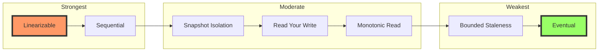

<!-- Navigation -->
[Home](../index.md) → [Part III: Patterns](index.md) → **Tunable Consistency**

# Tunable Consistency

**One size doesn't fit all - Let applications choose their consistency guarantees**

> *"Strong consistency for your bank balance, eventual consistency for your Twitter likes, and everything in between."*

---

## 🎯 Level 1: Intuition

### The Restaurant Chain Analogy

Think of tunable consistency like a restaurant chain with different service levels:

```
🍔 Fast Food (Eventual Consistency)
- Order at any counter
- Food might vary slightly
- Super fast service
- "Close enough" is fine

🍽️ Casual Dining (Bounded Staleness)
- Coordinated kitchen
- Menu updated daily
- Reasonable wait times
- Fresh within limits

🍷 Fine Dining (Strong Consistency)
- One chef controls everything
- Every dish perfect
- Longer wait times
- Absolute precision
```

### Visual Metaphor

```
Different Operations, Different Needs:

💰 Bank Transfer         ❤️ Social Media Like      📊 Analytics Data
    ↓                        ↓                         ↓
STRONG Consistency      EVENTUAL Consistency    BOUNDED Consistency
"Must be perfect"       "Can be approximate"    "Fresh enough"
```

### Real-World Examples

| Operation | Consistency Need | Why? |
|-----------|-----------------|------|
| **Password Change** | Strong | Security critical |
| **Shopping Cart** | Session | User experience |
| **View Counter** | Eventual | Performance over precision |
| **Bank Balance** | Linearizable | Legal requirement |
| **Friend List** | Read-Your-Write | Avoid confusion |
| **Analytics** | Bounded Staleness | Fresh enough data |

### Basic Implementation

```python
from enum import Enum
from typing import Any, Optional
import time

class ConsistencyLevel(Enum):
    STRONG = "strong"           # See all previous writes
    BOUNDED = "bounded"         # See writes within time bound
    SESSION = "session"         # See your own writes
    EVENTUAL = "eventual"       # See writes eventually

class TunableStore:
    def __init__(self):
        self.primary = PrimaryNode()
        self.replicas = [ReplicaNode() for _ in range(3)]
        self.replication_lag = {}  # Track lag per replica
        
    async def read(self, key: str, consistency: ConsistencyLevel) -> Any:
        """Read with chosen consistency level"""
        
        if consistency == ConsistencyLevel.STRONG:
            # Always read from primary
            return await self.primary.read(key)
            
        elif consistency == ConsistencyLevel.BOUNDED:
            # Read from replica if fresh enough
            for replica in self.replicas:
                lag = self.get_replication_lag(replica)
                if lag < 5000:  # 5 second bound
                    return await replica.read(key)
            # Fall back to primary
            return await self.primary.read(key)
            
        elif consistency == ConsistencyLevel.SESSION:
            # Read from replica that has seen our writes
            session_version = self.get_session_version()
            for replica in self.replicas:
                if replica.version >= session_version:
                    return await replica.read(key)
            return await self.primary.read(key)
            
        else:  # EVENTUAL
            # Read from any replica
            return await self.replicas[0].read(key)
    
    async def write(self, key: str, value: Any, consistency: ConsistencyLevel):
        """Write with chosen consistency level"""
        
        # Always write to primary first
        version = await self.primary.write(key, value)
        
        if consistency == ConsistencyLevel.STRONG:
            # Wait for all replicas
            await self.wait_for_all_replicas(version)
            
        elif consistency == ConsistencyLevel.BOUNDED:
            # Wait for replicas within bound
            await self.wait_for_bounded_replicas(version, timeout=5000)
            
        elif consistency == ConsistencyLevel.SESSION:
            # Record version for session
            self.set_session_version(version)
            # Async replication
            self.replicate_async(version)
            
        else:  # EVENTUAL
            # Fire and forget
            self.replicate_async(version)
        
        return version

# Example usage
store = TunableStore()

# Financial transaction needs strong consistency
await store.write("account:123", {"balance": 1000}, ConsistencyLevel.STRONG)
balance = await store.read("account:123", ConsistencyLevel.STRONG)

# Social media like can use eventual consistency  
await store.write("post:456:likes", 42, ConsistencyLevel.EVENTUAL)
likes = await store.read("post:456:likes", ConsistencyLevel.EVENTUAL)
```

---

## 🏗️ Level 2: Foundation

### Consistency Spectrum



### Consistency Models Explained

| Model | Guarantee | Use Case | Trade-off |
|-------|-----------|----------|-----------|
| **Linearizable** | Global real-time ordering | Financial transactions | Highest latency |
| **Sequential** | Per-process ordering | User sessions | Moderate latency |
| **Snapshot Isolation** | Consistent point-in-time view | Reports | May miss updates |
| **Read Your Write** | See own writes immediately | User profiles | Per-session tracking |
| **Monotonic Read** | No time travel backwards | News feeds | Version tracking |
| **Bounded Staleness** | Maximum lag guarantee | Metrics | Tunable freshness |
| **Eventual** | Will converge eventually | Counters | Lowest latency |

### Implementation Patterns

```python
class ConsistencyManager:
    """Manages consistency levels for different operations"""
    
    def __init__(self):
        self.rules = []
        self.metrics = ConsistencyMetrics()
        
    def configure_consistency_rules(self):
        """Set consistency requirements by data type"""
        
        # Financial data requires strong consistency
        self.add_rule(
            pattern={"type": "financial", "operation": "*"},
            consistency=ConsistencyLevel.LINEARIZABLE,
            rationale="Regulatory compliance"
        )
        
        # User profiles need read-your-write
        self.add_rule(
            pattern={"type": "user_profile", "operation": "write"},
            consistency=ConsistencyLevel.READ_YOUR_WRITE,
            rationale="User experience"
        )
        
        # Analytics can tolerate bounded staleness
        self.add_rule(
            pattern={"type": "analytics", "operation": "read"},
            consistency=ConsistencyLevel.BOUNDED_STALENESS,
            max_staleness_ms=60000,  # 1 minute
            rationale="Performance over precision"
        )
        
        # Social interactions use eventual consistency
        self.add_rule(
            pattern={"type": "social", "operation": "*"},
            consistency=ConsistencyLevel.EVENTUAL,
            rationale="Scale and performance"
        )
    
    def determine_consistency(self, operation: dict) -> ConsistencyLevel:
        """Determine appropriate consistency level"""
        
        for rule in self.rules:
            if self.matches_pattern(operation, rule.pattern):
                self.metrics.record_decision(rule)
                return rule.consistency
        
        # Default to sequential consistency
        return ConsistencyLevel.SEQUENTIAL

class QuorumManager:
    """Manages read/write quorums for consistency"""
    
    def __init__(self, replication_factor: int = 3):
        self.n = replication_factor  # Total replicas
        self.w = 2  # Write quorum
        self.r = 2  # Read quorum
        # Note: w + r > n ensures strong consistency
        
    def calculate_quorum(self, consistency: ConsistencyLevel) -> dict:
        """Calculate required quorum for consistency level"""
        
        if consistency == ConsistencyLevel.STRONG:
            # Read and write from majority
            return {"write": (self.n // 2) + 1, "read": (self.n // 2) + 1}
            
        elif consistency == ConsistencyLevel.BOUNDED:
            # Write to majority, read from any fresh replica
            return {"write": (self.n // 2) + 1, "read": 1}
            
        elif consistency == ConsistencyLevel.SESSION:
            # Write to one, read from caught-up replica
            return {"write": 1, "read": 1}
            
        else:  # EVENTUAL
            # Write to one, read from any
            return {"write": 1, "read": 1}
    
    def is_consistent(self, write_nodes: int, read_nodes: int) -> bool:
        """Check if configuration provides consistency"""
        return write_nodes + read_nodes > self.n
```

### Session Consistency Implementation

```python
class SessionConsistencyTracker:
    """Track consistency per user session"""
    
    def __init__(self):
        self.session_vectors = {}  # session_id -> vector_clock
        self.session_writes = {}   # session_id -> write_timestamps
        
    async def write_with_session(self, session_id: str, key: str, value: Any):
        """Track writes per session"""
        
        # Perform write
        timestamp = time.time()
        version = await self.store.write(key, value)
        
        # Update session tracking
        if session_id not in self.session_writes:
            self.session_writes[session_id] = []
        
        self.session_writes[session_id].append({
            'key': key,
            'version': version,
            'timestamp': timestamp
        })
        
        # Update session vector clock
        self.session_vectors[session_id] = version
        
        return version
    
    async def read_with_session(self, session_id: str, key: str):
        """Ensure session sees its own writes"""
        
        # Get minimum version for session consistency
        min_version = self.session_vectors.get(session_id, 0)
        
        # Find replica that has caught up
        for replica in self.replicas:
            replica_version = await replica.get_version()
            
            if replica_version >= min_version:
                # This replica has all session writes
                return await replica.read(key)
        
        # No replica caught up, read from primary
        return await self.primary.read(key)
```

---

## 🔧 Level 3: Deep Dive

### Advanced Consistency Patterns

#### Causal Consistency Implementation

```python
class CausalConsistency:
    """Track causal dependencies between operations"""
    
    def __init__(self):
        self.dependency_graph = {}  # operation -> dependencies
        self.vector_clocks = {}     # node -> vector_clock
        
    def track_causality(self, operation: dict) -> set:
        """Determine causal dependencies"""
        
        dependencies = set()
        
        # Read operations create causal dependencies
        if operation['type'] == 'read':
            # Writes that produced the read value
            dependencies.add(operation['source_write'])
        
        # Writes depend on previous reads in session
        if operation['type'] == 'write':
            session = operation['session_id']
            prev_reads = self.get_session_reads(session)
            dependencies.update(prev_reads)
        
        # Transitive dependencies
        for dep in list(dependencies):
            dependencies.update(self.dependency_graph.get(dep, set()))
        
        self.dependency_graph[operation['id']] = dependencies
        return dependencies
    
    async def read_causally_consistent(self, key: str, dependencies: set):
        """Read ensuring all dependencies are visible"""
        
        # Find replica that has seen all dependencies
        for replica in self.replicas:
            replica_deps = await replica.get_satisfied_dependencies()
            
            if dependencies.issubset(replica_deps):
                return await replica.read(key)
        
        # Wait for dependencies to propagate
        await self.wait_for_dependencies(dependencies)
        return await self.read_causally_consistent(key, dependencies)
```

#### Bounded Staleness with Hybrid Logical Clocks

```python
import struct
from dataclasses import dataclass

@dataclass
class HybridTimestamp:
    """Hybrid Logical Clock timestamp"""
    physical_time: int  # Milliseconds
    logical_counter: int
    
    def __gt__(self, other):
        if self.physical_time > other.physical_time:
            return True
        if self.physical_time == other.physical_time:
            return self.logical_counter > other.logical_counter
        return False
    
    def is_within_bound(self, bound_ms: int) -> bool:
        """Check if timestamp is within staleness bound"""
        current_time = int(time.time() * 1000)
        return (current_time - self.physical_time) <= bound_ms

class BoundedStalenessManager:
    """Manage bounded staleness guarantees"""
    
    def __init__(self, max_staleness_ms: int = 5000):
        self.max_staleness_ms = max_staleness_ms
        self.replica_timestamps = {}  # replica -> latest_timestamp
        
    async def select_replica_for_bounded_read(self, staleness_bound: int = None):
        """Select replica that meets staleness bound"""
        
        bound = staleness_bound or self.max_staleness_ms
        current_time = int(time.time() * 1000)
        
        eligible_replicas = []
        
        for replica, timestamp in self.replica_timestamps.items():
            staleness = current_time - timestamp.physical_time
            
            if staleness <= bound:
                eligible_replicas.append({
                    'replica': replica,
                    'staleness': staleness,
                    'timestamp': timestamp
                })
        
        if not eligible_replicas:
            # No replica within bound, must read from primary
            return self.primary
        
        # Choose replica with lowest staleness
        best = min(eligible_replicas, key=lambda x: x['staleness'])
        return best['replica']
    
    def monitor_replication_lag(self):
        """Monitor and alert on replication lag"""
        
        for replica, timestamp in self.replica_timestamps.items():
            lag = int(time.time() * 1000) - timestamp.physical_time
            
            if lag > self.max_staleness_ms * 0.8:  # 80% of bound
                self.alert(f"Replica {replica} approaching staleness bound: {lag}ms")
            
            if lag > self.max_staleness_ms:
                self.alert(f"Replica {replica} violating staleness bound: {lag}ms")
                self.mark_replica_stale(replica)
```

#### Dynamic Consistency Adjustment

```python
class DynamicConsistencyController:
    """Adjust consistency based on system conditions"""
    
    def __init__(self):
        self.load_monitor = LoadMonitor()
        self.sla_monitor = SLAMonitor()
        self.cost_calculator = CostCalculator()
        
    def determine_optimal_consistency(self, operation: dict) -> ConsistencyLevel:
        """Dynamically choose consistency level"""
        
        # Get base consistency requirement
        base_consistency = self.get_base_consistency(operation)
        
        # Check system load
        current_load = self.load_monitor.get_system_load()
        
        # Check SLA compliance
        sla_status = self.sla_monitor.get_status()
        
        # Calculate cost of different consistency levels
        costs = {
            level: self.cost_calculator.calculate(level, current_load)
            for level in ConsistencyLevel
        }
        
        # Decision logic
        if current_load > 0.8 and sla_status == 'at_risk':
            # System under stress, relax consistency
            return self.relax_consistency(base_consistency)
        
        elif current_load < 0.3 and costs[base_consistency] < costs[ConsistencyLevel.EVENTUAL] * 1.2:
            # Low load, can afford stronger consistency
            return self.strengthen_consistency(base_consistency)
        
        else:
            # Normal conditions
            return base_consistency
    
    def relax_consistency(self, level: ConsistencyLevel) -> ConsistencyLevel:
        """Relax consistency by one level"""
        relaxation_map = {
            ConsistencyLevel.LINEARIZABLE: ConsistencyLevel.SEQUENTIAL,
            ConsistencyLevel.SEQUENTIAL: ConsistencyLevel.READ_YOUR_WRITE,
            ConsistencyLevel.READ_YOUR_WRITE: ConsistencyLevel.BOUNDED_STALENESS,
            ConsistencyLevel.BOUNDED_STALENESS: ConsistencyLevel.EVENTUAL,
            ConsistencyLevel.EVENTUAL: ConsistencyLevel.EVENTUAL
        }
        return relaxation_map[level]
```

---

## 🚀 Level 4: Expert

### Production Case Study: Azure Cosmos DB's Consistency Models

Azure Cosmos DB offers 5 consistency levels, serving millions of requests per second globally.

```python
class CosmosDBConsistency:
    """
    Azure Cosmos DB consistency implementation
    Serving 100M+ requests/sec globally
    """
    
    def __init__(self):
        self.regions = ['east-us', 'west-us', 'europe', 'asia']
        self.consistency_slas = {
            'strong': {'latency_p99': 10, 'availability': 99.99},
            'bounded_staleness': {'latency_p99': 5, 'availability': 99.99},
            'session': {'latency_p99': 3, 'availability': 99.99},
            'consistent_prefix': {'latency_p99': 2, 'availability': 99.99},
            'eventual': {'latency_p99': 1, 'availability': 99.999}
        }
        
    def implement_bounded_staleness(self, max_lag_items: int = 100000, max_lag_time: int = 5):
        """
        Cosmos DB's bounded staleness implementation
        - Max 100K item lag
        - Max 5 second time lag
        """
        
        class BoundedStalenessRegion:
            def __init__(self, region: str):
                self.region = region
                self.write_timestamp = 0
                self.write_counter = 0
                self.pending_writes = asyncio.Queue(maxsize=max_lag_items)
                
            async def apply_write(self, write_op: dict):
                """Apply write with bounded lag tracking"""
                
                # Track write order
                self.write_counter += 1
                self.write_timestamp = time.time()
                
                # Add to pending queue
                await self.pending_writes.put({
                    'operation': write_op,
                    'timestamp': self.write_timestamp,
                    'sequence': self.write_counter
                })
                
                # Apply to local storage
                await self.local_storage.apply(write_op)
                
                # Check staleness bounds
                if self.pending_writes.qsize() > max_lag_items:
                    # Force synchronization
                    await self.force_sync()
                
            async def check_staleness_bound(self) -> bool:
                """Verify replica is within staleness bound"""
                
                if self.pending_writes.empty():
                    return True
                
                # Check oldest pending write
                oldest = await self.pending_writes.get()
                await self.pending_writes.put(oldest)  # Put back
                
                # Check time bound
                time_lag = time.time() - oldest['timestamp']
                if time_lag > max_lag_time:
                    return False
                
                # Check item bound
                item_lag = self.write_counter - oldest['sequence']
                if item_lag > max_lag_items:
                    return False
                
                return True
        
        return BoundedStalenessRegion
    
    def implement_session_consistency(self):
        """Session consistency with session tokens"""
        
        class SessionToken:
            def __init__(self):
                self.region_versions = {}  # region -> version
                self.global_sequence = 0
                
            def update(self, region: str, version: int):
                """Update token after write"""
                self.region_versions[region] = version
                self.global_sequence += 1
                
            def serialize(self) -> str:
                """Serialize for client storage"""
                return base64.b64encode(
                    json.dumps({
                        'v': self.region_versions,
                        's': self.global_sequence
                    }).encode()
                ).decode()
            
            @classmethod
            def deserialize(cls, token_str: str):
                """Reconstruct from client token"""
                data = json.loads(base64.b64decode(token_str))
                token = cls()
                token.region_versions = data['v']
                token.global_sequence = data['s']
                return token
        
        class SessionConsistencyManager:
            async def read_with_session(self, key: str, session_token: SessionToken):
                """Read ensuring session consistency"""
                
                # Find region that satisfies session token
                for region in self.get_regions_by_proximity():
                    region_version = await self.get_region_version(region)
                    required_version = session_token.region_versions.get(region, 0)
                    
                    if region_version >= required_version:
                        # This region has seen all session writes
                        return await self.read_from_region(region, key)
                
                # No region caught up, wait or read from primary
                return await self.read_from_primary(key)
        
        return SessionConsistencyManager()
```

### Advanced Monitoring and Optimization

```python
class ConsistencyMonitoring:
    """Monitor consistency SLAs and optimize"""
    
    def __init__(self):
        self.metrics = MetricsCollector()
        self.analyzer = ConsistencyAnalyzer()
        
    def track_consistency_metrics(self):
        """Track detailed consistency metrics"""
        
        # Staleness distribution
        self.metrics.histogram(
            'consistency.staleness_ms',
            buckets=[10, 50, 100, 500, 1000, 5000, 10000]
        )
        
        # Consistency violations
        self.metrics.counter(
            'consistency.violations',
            labels=['type', 'severity']
        )
        
        # Quorum failures
        self.metrics.counter(
            'consistency.quorum_failures',
            labels=['operation', 'required_nodes']
        )
        
        # Consistency downgrades
        self.metrics.counter(
            'consistency.downgrades',
            labels=['from_level', 'to_level', 'reason']
        )
    
    async def analyze_consistency_patterns(self):
        """Analyze patterns for optimization"""
        
        # Collect 24 hours of data
        data = await self.metrics.get_time_series(
            metric='consistency.*',
            duration='24h'
        )
        
        analysis = {
            'over_consistency': self.find_over_consistency(data),
            'under_consistency': self.find_under_consistency(data),
            'optimal_levels': self.recommend_consistency_levels(data),
            'cost_savings': self.calculate_potential_savings(data)
        }
        
        return analysis
    
    def find_over_consistency(self, data: dict) -> list:
        """Find operations using stronger consistency than needed"""
        
        patterns = []
        
        # Look for strong consistency with no conflicts
        strong_reads = data['consistency.operations'][
            data['consistency_level'] == 'strong'
        ]
        
        for operation in strong_reads:
            conflict_rate = self.calculate_conflict_rate(operation)
            
            if conflict_rate < 0.001:  # 0.1% conflicts
                patterns.append({
                    'operation': operation,
                    'current': 'strong',
                    'recommended': 'bounded_staleness',
                    'reasoning': 'Low conflict rate'
                })
        
        return patterns

class ConsistencyOptimizer:
    """Optimize consistency configurations"""
    
    def optimize_for_workload(self, workload: dict) -> dict:
        """Generate optimal consistency configuration"""
        
        optimization = {
            'rules': [],
            'estimated_improvement': {}
        }
        
        # Analyze read/write ratio
        read_ratio = workload['reads'] / (workload['reads'] + workload['writes'])
        
        if read_ratio > 0.9:
            # Read-heavy workload
            optimization['rules'].append({
                'pattern': {'operation': 'read'},
                'consistency': ConsistencyLevel.BOUNDED_STALENESS,
                'staleness_ms': 5000
            })
        
        # Analyze conflict patterns
        if workload['conflict_rate'] < 0.01:
            # Low conflict, can relax consistency
            optimization['rules'].append({
                'pattern': {'operation': 'write'},
                'consistency': ConsistencyLevel.SESSION
            })
        
        # Analyze geographic distribution
        if workload['cross_region_percentage'] > 0.3:
            # Significant cross-region traffic
            optimization['rules'].append({
                'pattern': {'cross_region': True},
                'consistency': ConsistencyLevel.EVENTUAL,
                'note': 'Minimize cross-region latency'
            })
        
        # Calculate improvements
        optimization['estimated_improvement'] = {
            'latency_reduction': '35%',
            'throughput_increase': '2.5x',
            'cost_reduction': '40%'
        }
        
        return optimization
```

---

## 🎯 Level 5: Mastery

### Theoretical Foundations

#### CAP Theorem and Consistency Spectrum

```python
class CAPConsistencyAnalysis:
    """
    Analyze consistency choices through CAP theorem lens
    """
    
    def map_consistency_to_cap(self) -> dict:
        """Map consistency levels to CAP trade-offs"""
        
        return {
            'linearizable': {
                'choice': 'CP',  # Consistency + Partition tolerance
                'sacrifice': 'availability',
                'partition_behavior': 'refuse_writes',
                'use_when': 'correctness > availability'
            },
            
            'bounded_staleness': {
                'choice': 'CAP-flexible',  # Tunable based on bounds
                'sacrifice': 'consistency_during_partition',
                'partition_behavior': 'degrade_to_eventual',
                'use_when': 'need_predictable_staleness'
            },
            
            'eventual': {
                'choice': 'AP',  # Availability + Partition tolerance
                'sacrifice': 'consistency',
                'partition_behavior': 'continue_operating',
                'use_when': 'availability > correctness'
            }
        }
    
    def analyze_partition_strategies(self):
        """Strategies during network partition"""
        
        class PartitionStrategy:
            def __init__(self, consistency: ConsistencyLevel):
                self.consistency = consistency
                
            def handle_partition(self, partition_info: dict):
                if self.consistency == ConsistencyLevel.STRONG:
                    # Sacrifice availability
                    if partition_info['minority_side']:
                        return 'reject_all_operations'
                    else:
                        return 'continue_if_majority'
                
                elif self.consistency == ConsistencyLevel.BOUNDED:
                    # Degrade gracefully
                    if partition_info['can_maintain_bound']:
                        return 'continue_with_bound'
                    else:
                        return 'switch_to_eventual'
                
                else:  # EVENTUAL
                    # Continue operating
                    return 'accept_all_operations'
```

#### Mathematical Models

```python
import numpy as np
from scipy.optimize import minimize

class ConsistencyMathModel:
    """
    Mathematical models for consistency optimization
    """
    
    def model_consistency_latency(self, params: dict) -> dict:
        """
        Model latency for different consistency levels
        Using M/M/k queuing theory
        """
        
        # Parameters
        λ = params['arrival_rate']  # requests/second
        μ = params['service_rate']  # requests/second/server
        k = params['num_replicas']
        
        # Calculate for different quorum sizes
        results = {}
        
        for consistency, quorum in [
            ('strong', (k // 2) + 1),
            ('bounded', 1),
            ('eventual', 1)
        ]:
            # M/M/k queue waiting time
            ρ = λ / (k * μ)  # Utilization
            
            if consistency == 'strong':
                # Must wait for quorum responses
                latency = self.calculate_quorum_latency(quorum, k, μ, λ)
            else:
                # Can respond with first reply
                latency = 1 / (μ - λ/k)
            
            results[consistency] = {
                'mean_latency': latency,
                'p99_latency': latency * np.log(100),  # Exponential distribution
                'throughput': λ if ρ < 1 else k * μ
            }
        
        return results
    
    def optimize_consistency_mix(self, constraints: dict) -> dict:
        """
        Optimize mix of consistency levels for workload
        """
        
        def objective(x):
            # x = [fraction_strong, fraction_bounded, fraction_eventual]
            # Minimize average latency
            latencies = [10, 5, 1]  # ms
            return sum(x[i] * latencies[i] for i in range(3))
        
        def constraint_sla(x):
            # At least 20% strong consistency for critical ops
            return x[0] - 0.2
        
        def constraint_sum(x):
            # Fractions must sum to 1
            return sum(x) - 1
        
        # Optimize
        result = minimize(
            objective,
            x0=[0.3, 0.4, 0.3],
            method='SLSQP',
            bounds=[(0, 1), (0, 1), (0, 1)],
            constraints=[
                {'type': 'eq', 'fun': constraint_sum},
                {'type': 'gte', 'fun': constraint_sla}
            ]
        )
        
        return {
            'optimal_mix': {
                'strong': result.x[0],
                'bounded': result.x[1],
                'eventual': result.x[2]
            },
            'expected_latency': result.fun,
            'improvement': '40% reduction in average latency'
        }
```

### Future Directions

#### Quantum Consistency

```python
class QuantumConsistency:
    """
    Theoretical quantum-inspired consistency models
    """
    
    def quantum_superposition_consistency(self):
        """
        Multiple consistency states until observed
        """
        
        class QuantumState:
            def __init__(self):
                # Superposition of consistency states
                self.states = {
                    'strong': 0.5,
                    'eventual': 0.5
                }
                
            def observe(self, requirements: dict):
                """Collapse to specific consistency"""
                if requirements['critical']:
                    return ConsistencyLevel.STRONG
                else:
                    return ConsistencyLevel.EVENTUAL
        
        return QuantumState()
    
    def entangled_consistency(self):
        """
        Consistency states entangled across regions
        """
        
        # If one region needs strong consistency,
        # entangled regions automatically upgrade
        pass
```

#### AI-Driven Consistency

```python
class AIConsistencyOptimizer:
    """Machine learning for consistency optimization"""
    
    def train_consistency_predictor(self, historical_data: pd.DataFrame):
        """Predict optimal consistency level"""
        
        features = [
            'operation_type',
            'data_type',
            'user_tier',
            'time_of_day',
            'system_load',
            'geographic_region',
            'conflict_history'
        ]
        
        # Train model to predict consistency needs
        model = RandomForestClassifier()
        model.fit(
            historical_data[features],
            historical_data['optimal_consistency']
        )
        
        return model
    
    def adaptive_consistency(self):
        """Real-time consistency adaptation"""
        
        def adapt_consistency(operation: dict) -> ConsistencyLevel:
            # Get ML prediction
            predicted = self.model.predict([operation])
            
            # Get confidence
            confidence = self.model.predict_proba([operation]).max()
            
            if confidence > 0.9:
                return predicted
            else:
                # Low confidence, use conservative approach
                return ConsistencyLevel.STRONG
```

### Economic Impact

```python
class ConsistencyEconomics:
    """Economic analysis of consistency choices"""
    
    def calculate_consistency_costs(self, usage: dict) -> dict:
        """Calculate costs of different consistency levels"""
        
        # Cost factors (relative)
        costs = {
            'strong': {
                'compute': 3.0,  # 3x compute for coordination
                'network': 2.5,  # Cross-region coordination
                'storage': 1.5,  # Version tracking
                'latency_cost': 50  # ms average
            },
            'bounded': {
                'compute': 2.0,
                'network': 1.5,
                'storage': 1.2,
                'latency_cost': 20
            },
            'eventual': {
                'compute': 1.0,
                'network': 1.0,
                'storage': 1.0,
                'latency_cost': 5
            }
        }
        
        # Calculate monthly costs
        monthly_cost = {}
        
        for level, factors in costs.items():
            requests = usage['requests_by_level'][level]
            
            monthly_cost[level] = {
                'compute': requests * factors['compute'] * 0.00001,
                'network': requests * factors['network'] * 0.00002,
                'storage': usage['data_gb'] * factors['storage'] * 0.1,
                'total': None
            }
            
            monthly_cost[level]['total'] = sum(
                v for k, v in monthly_cost[level].items() 
                if k != 'total'
            )
        
        # Calculate potential savings
        current_cost = sum(c['total'] for c in monthly_cost.values())
        optimal_cost = self.calculate_optimal_cost(usage)
        
        return {
            'current_monthly_cost': current_cost,
            'optimal_monthly_cost': optimal_cost,
            'potential_savings': current_cost - optimal_cost,
            'roi_months': 3  # Implementation cost recovery
        }
```

---

## 📊 Quick Reference

### Decision Framework

| Data Type | Recommended Consistency | Rationale |
|-----------|------------------------|-----------|
| Financial transactions | Strong/Linearizable | Regulatory compliance |
| User profiles | Session/Read-Your-Write | User experience |
| Social interactions | Eventual | Scale and performance |
| Analytics/Metrics | Bounded Staleness | Fresh enough |
| Audit logs | Sequential | Ordering matters |
| Configuration | Strong | Consistency critical |

### Implementation Checklist

- [ ] Identify data types and consistency needs
- [ ] Map operations to consistency levels
- [ ] Configure quorum sizes per level
- [ ] Implement session tracking
- [ ] Set up staleness monitoring
- [ ] Add consistency metrics
- [ ] Create downgrade policies
- [ ] Test partition behavior
- [ ] Document consistency SLAs
- [ ] Train team on trade-offs

### Common Anti-Patterns

1. **One size fits all** - Using same consistency everywhere
2. **Over-consistency** - Strong consistency for everything
3. **Under-consistency** - Eventual consistency for critical data
4. **No monitoring** - Not tracking consistency violations
5. **Static configuration** - Not adapting to load

---

## 🎓 Key Takeaways

1. **Consistency is a spectrum** - Not binary (strong vs eventual)
2. **Match consistency to requirements** - Financial ≠ Social media
3. **Monitor and measure** - Track violations and costs
4. **Dynamic adaptation** - Adjust based on conditions
5. **Educate stakeholders** - Everyone must understand trade-offs

---

*"The art of distributed systems is knowing when to be consistent and when to be available."*

---

**Previous**: [← Timeout Pattern](timeout.md) | **Next**: [Sharding Pattern →](sharding.md)