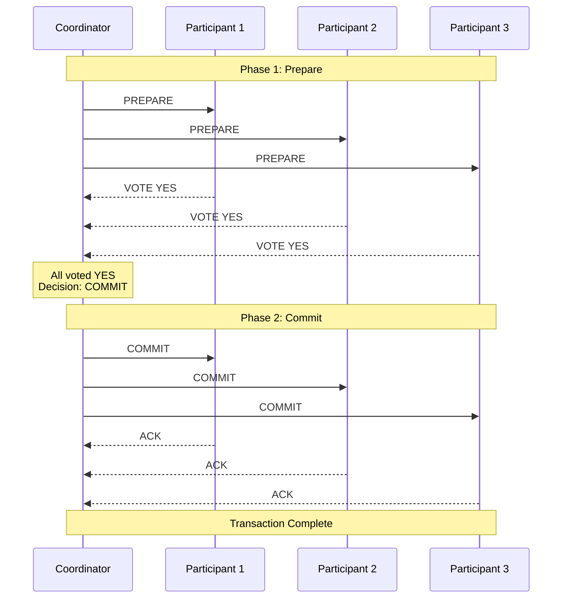
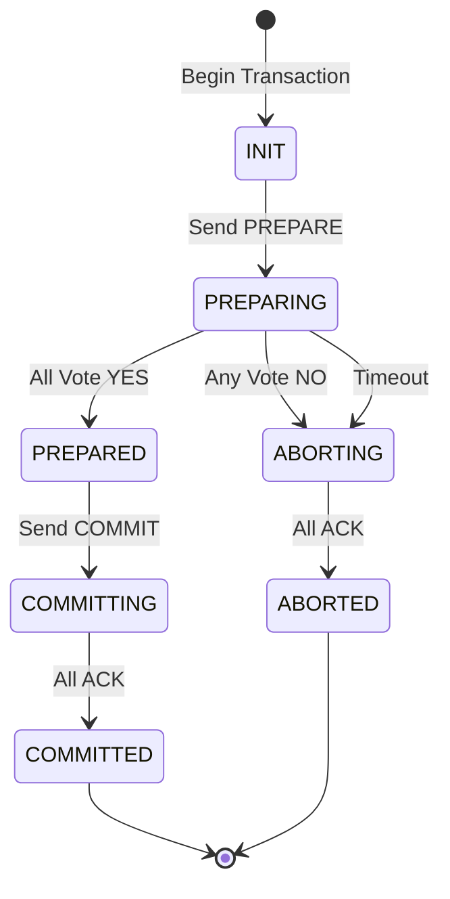
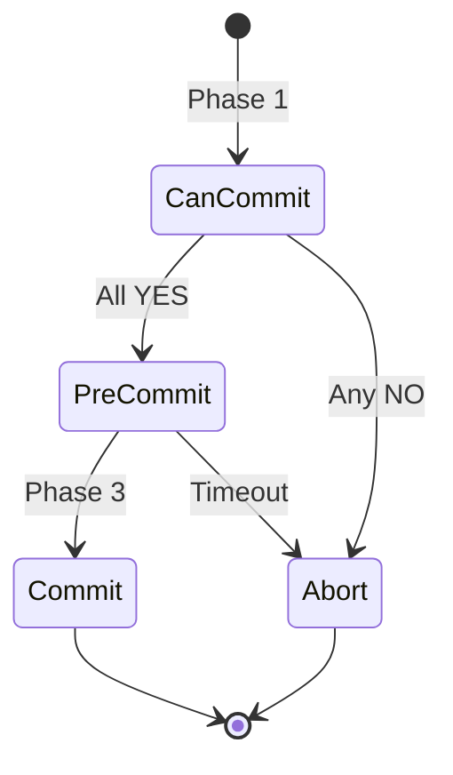
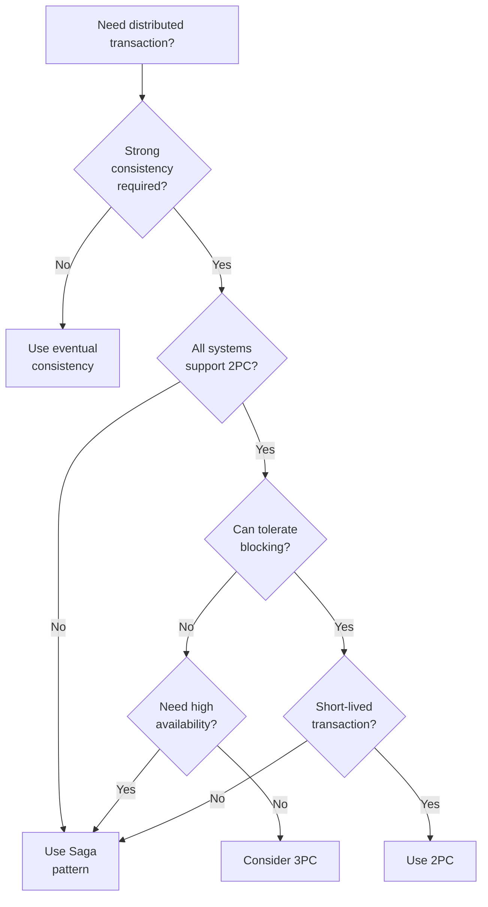

# Two-Phase Commit (2PC)


## The Essential Question

**How can we guarantee ACID properties across multiple databases or resources in a distributed system?**

---

## Level 1: Intuition (5 minutes)

### The Story

A wedding requires both parties to say "I do". The officiant first asks "Do you take...?" (prepare phase), then only after both agree, declares "You are now married" (commit phase). If either party hesitates, the whole ceremony is called off.

2PC works the same way: all participants must agree before any changes become permanent.

### Visual Metaphor

```
Traditional Transaction:          Two-Phase Commit:

┌─────────────────┐              Phase 1 - Prepare:
│ BEGIN           │              Coordinator: "Can you commit?"
│  Update DB1     │              DB1: "Yes" ✓
│  Update DB2     │              DB2: "Yes" ✓
│  Update DB3     │              DB3: "Yes" ✓
│ COMMIT          │              
└─────────────────┘              Phase 2 - Commit:
                                Coordinator: "Commit!"
Single Database                  DB1: Commits ✓
All or Nothing                   DB2: Commits ✓
                                DB3: Commits ✓
```

### In One Sentence

**Two-Phase Commit**: A distributed consensus protocol ensuring all-or-nothing atomicity across multiple resources through coordinated prepare and commit phases.

### Real-World Parallel

Like a group reservation at multiple restaurants - first confirm availability at all venues (prepare), then only book if all can accommodate (commit).

---

## Level 2: Foundation (10 minutes)

### The Problem Space

!!! danger "🔥 Without 2PC: Banking Disaster"
    International transfer: Deducted from source, network failure, never credited to destination.
    - $50M disappeared for 3 days
    - Manual reconciliation of 10K+ transactions
    - Regulatory fines of $2M
    - Customer trust severely damaged

### Core Concept

2PC ensures distributed atomicity through:

1. **Coordinator**: Orchestrates the transaction
2. **Participants**: Resources involved in transaction
3. **Voting Phase**: All participants vote yes/no
4. **Decision Phase**: Coordinator decides based on votes
5. **Persistence**: Decisions logged for recovery

### Basic Protocol Flow



### State Transitions



### Key Properties

| Property | Description | Guarantee |
|----------|-------------|-----------|
| **Atomicity** | All or nothing | ✓ Strong |
| **Consistency** | ACID across resources | ✓ Strong |
| **Durability** | Survives failures | ✓ With logging |
| **Availability** | Can process requests | ✗ Blocking |

### Trade-offs

| Aspect | Benefit | Cost |
|--------|---------|------|
| Consistency | Strong consistency | Reduced availability |
| Simplicity | Clear protocol | Complex failure handling |
| Reliability | Guaranteed atomicity | Performance overhead |
| Recovery | Deterministic | Can block indefinitely |

---

## Level 3: Deep Dive (20 minutes)

### Detailed Implementation

```python
from enum import Enum
from typing import Dict, List, Optional, Set
from dataclasses import dataclass
from datetime import datetime, timedelta
import asyncio
import logging
from abc import ABC, abstractmethod

# Protocol States
class CoordinatorState(Enum):
    INIT = "init"
    PREPARING = "preparing"
    PREPARED = "prepared"
    COMMITTING = "committing"
    COMMITTED = "committed"
    ABORTING = "aborting"
    ABORTED = "aborted"

class ParticipantState(Enum):
    INIT = "init"
    PREPARED = "prepared"
    COMMITTED = "committed"
    ABORTED = "aborted"

# Messages
@dataclass
class PrepareRequest:
    transaction_id: str
    coordinator_id: str
    participants: List[str]
    transaction_data: Dict

@dataclass
class VoteResponse:
    participant_id: str
    transaction_id: str
    vote: bool  # True = YES, False = NO
    
@dataclass
class DecisionRequest:
    transaction_id: str
    decision: str  # "COMMIT" or "ABORT"

# Participant Interface
class Participant(ABC):
    """Base class for 2PC participants"""
    
    def __init__(self, participant_id: str):
        self.participant_id = participant_id
        self.state = ParticipantState.INIT
        self.prepared_transactions: Dict[str, Dict] = {}
        self.logger = logging.getLogger(f"Participant-{participant_id}")
        
    @abstractmethod
    async def can_commit(self, transaction_data: Dict) -> bool:
        """Check if participant can commit this transaction"""
        pass
        
    @abstractmethod
    async def do_commit(self, transaction_id: str) -> None:
        """Actually commit the transaction"""
        pass
        
    @abstractmethod
    async def do_abort(self, transaction_id: str) -> None:
        """Abort/rollback the transaction"""
        pass
        
    async def prepare(self, request: PrepareRequest) -> VoteResponse:
        """Handle prepare request from coordinator"""
        try:
# Check if we can commit
            can_commit = await self.can_commit(request.transaction_data)
            
            if can_commit:
# Save transaction data for later commit
                self.prepared_transactions[request.transaction_id] = {
                    'data': request.transaction_data,
                    'coordinator': request.coordinator_id,
                    'timestamp': datetime.utcnow()
                }
                self.state = ParticipantState.PREPARED
                
# Write prepare record to log (for recovery)
                await self._write_prepare_log(request.transaction_id)
                
                self.logger.info(f"Prepared transaction {request.transaction_id}")
                return VoteResponse(
                    participant_id=self.participant_id,
                    transaction_id=request.transaction_id,
                    vote=True
                )
            else:
                self.logger.info(f"Cannot prepare transaction {request.transaction_id}")
                return VoteResponse(
                    participant_id=self.participant_id,
                    transaction_id=request.transaction_id,
                    vote=False
                )
                
        except Exception as e:
            self.logger.error(f"Error preparing transaction: {e}")
            return VoteResponse(
                participant_id=self.participant_id,
                transaction_id=request.transaction_id,
                vote=False
            )
            
    async def commit(self, request: DecisionRequest) -> None:
        """Handle commit decision from coordinator"""
        transaction_id = request.transaction_id
        
        if transaction_id not in self.prepared_transactions:
            raise Exception(f"Transaction {transaction_id} not prepared")
            
        try:
# Perform actual commit
            await self.do_commit(transaction_id)
            
# Write commit record to log
            await self._write_commit_log(transaction_id)
            
# Clean up
            del self.prepared_transactions[transaction_id]
            self.state = ParticipantState.COMMITTED
            
            self.logger.info(f"Committed transaction {transaction_id}")
            
        except Exception as e:
            self.logger.error(f"Error committing transaction: {e}")
            raise
            
    async def abort(self, request: DecisionRequest) -> None:
        """Handle abort decision from coordinator"""
        transaction_id = request.transaction_id
        
        try:
# Perform rollback
            await self.do_abort(transaction_id)
            
# Write abort record to log
            await self._write_abort_log(transaction_id)
            
# Clean up
            if transaction_id in self.prepared_transactions:
                del self.prepared_transactions[transaction_id]
            self.state = ParticipantState.ABORTED
            
            self.logger.info(f"Aborted transaction {transaction_id}")
            
        except Exception as e:
            self.logger.error(f"Error aborting transaction: {e}")
            raise
            
    async def _write_prepare_log(self, transaction_id: str):
        """Write prepare record for recovery"""
# In production, write to durable storage
        pass
        
    async def _write_commit_log(self, transaction_id: str):
        """Write commit record for recovery"""
# In production, write to durable storage
        pass
        
    async def _write_abort_log(self, transaction_id: str):
        """Write abort record for recovery"""
# In production, write to durable storage
        pass

# Coordinator Implementation
class TwoPhaseCoordinator:
    """Coordinates 2PC protocol"""
    
    def __init__(self, coordinator_id: str, timeout_seconds: int = 30):
        self.coordinator_id = coordinator_id
        self.timeout = timedelta(seconds=timeout_seconds)
        self.state = CoordinatorState.INIT
        self.logger = logging.getLogger(f"Coordinator-{coordinator_id}")
        self.transaction_log: List[Dict] = []
        
    async def execute_transaction(
        self,
        transaction_id: str,
        participants: List[Participant],
        transaction_data: Dict
    ) -> bool:
        """Execute 2PC transaction across participants"""
        
        self.state = CoordinatorState.INIT
        self.logger.info(f"Starting 2PC for transaction {transaction_id}")
        
        try:
# Phase 1: Prepare
            prepare_success = await self._prepare_phase(
                transaction_id, participants, transaction_data
            )
            
            if prepare_success:
# Phase 2: Commit
                await self._commit_phase(transaction_id, participants)
                return True
            else:
# Phase 2: Abort
                await self._abort_phase(transaction_id, participants)
                return False
                
        except Exception as e:
            self.logger.error(f"Transaction failed: {e}")
# Try to abort on any error
            await self._abort_phase(transaction_id, participants)
            return False
            
    async def _prepare_phase(
        self,
        transaction_id: str,
        participants: List[Participant],
        transaction_data: Dict
    ) -> bool:
        """Execute prepare phase"""
        self.state = CoordinatorState.PREPARING
        
# Log decision to prepare
        await self._log_decision("PREPARE", transaction_id)
        
# Send prepare requests to all participants
        prepare_request = PrepareRequest(
            transaction_id=transaction_id,
            coordinator_id=self.coordinator_id,
            participants=[p.participant_id for p in participants],
            transaction_data=transaction_data
        )
        
# Collect votes with timeout
        votes = []
        prepare_tasks = [
            self._prepare_with_timeout(p, prepare_request) 
            for p in participants
        ]
        
        try:
            votes = await asyncio.gather(*prepare_tasks)
        except asyncio.TimeoutError:
            self.logger.error("Prepare phase timeout")
            return False
            
# Check if all voted YES
        all_yes = all(vote.vote for vote in votes if vote is not None)
        
        if all_yes and len(votes) == len(participants):
            self.state = CoordinatorState.PREPARED
            await self._log_decision("PREPARED", transaction_id)
            return True
        else:
            self.logger.info("Not all participants voted YES")
            return False
            
    async def _prepare_with_timeout(
        self,
        participant: Participant,
        request: PrepareRequest
    ) -> Optional[VoteResponse]:
        """Send prepare request with timeout"""
        try:
            return await asyncio.wait_for(
                participant.prepare(request),
                timeout=self.timeout.total_seconds()
            )
        except asyncio.TimeoutError:
            self.logger.error(f"Participant {participant.participant_id} timeout")
            return None
            
    async def _commit_phase(
        self,
        transaction_id: str,
        participants: List[Participant]
    ):
        """Execute commit phase"""
        self.state = CoordinatorState.COMMITTING
        
# Log commit decision
        await self._log_decision("COMMIT", transaction_id)
        
# Send commit to all participants
        decision = DecisionRequest(
            transaction_id=transaction_id,
            decision="COMMIT"
        )
        
        commit_tasks = [
            self._send_decision_with_retry(p, decision, p.commit)
            for p in participants
        ]
        
        await asyncio.gather(*commit_tasks)
        
        self.state = CoordinatorState.COMMITTED
        await self._log_decision("COMMITTED", transaction_id)
        self.logger.info(f"Transaction {transaction_id} committed")
        
    async def _abort_phase(
        self,
        transaction_id: str,
        participants: List[Participant]
    ):
        """Execute abort phase"""
        self.state = CoordinatorState.ABORTING
        
# Log abort decision
        await self._log_decision("ABORT", transaction_id)
        
# Send abort to all participants
        decision = DecisionRequest(
            transaction_id=transaction_id,
            decision="ABORT"
        )
        
        abort_tasks = [
            self._send_decision_with_retry(p, decision, p.abort)
            for p in participants
        ]
        
        await asyncio.gather(*abort_tasks)
        
        self.state = CoordinatorState.ABORTED
        await self._log_decision("ABORTED", transaction_id)
        self.logger.info(f"Transaction {transaction_id} aborted")
        
    async def _send_decision_with_retry(
        self,
        participant: Participant,
        decision: DecisionRequest,
        method
    ):
        """Send decision with retries until acknowledged"""
        max_retries = 3
        retry_delay = 1
        
        for attempt in range(max_retries):
            try:
                await method(decision)
                return
            except Exception as e:
                self.logger.warning(
                    f"Failed to send decision to {participant.participant_id}: {e}"
                )
                if attempt < max_retries - 1:
                    await asyncio.sleep(retry_delay * (2 ** attempt))
                    
# Log persistent failure
        self.logger.error(
            f"Could not deliver decision to {participant.participant_id}"
        )
        
    async def _log_decision(self, decision: str, transaction_id: str):
        """Log coordinator decisions for recovery"""
        log_entry = {
            'timestamp': datetime.utcnow(),
            'transaction_id': transaction_id,
            'decision': decision,
            'coordinator_id': self.coordinator_id
        }
        self.transaction_log.append(log_entry)
# In production, persist to durable storage

# Example Implementation
class DatabaseParticipant(Participant):
    """Example database participant"""
    
    def __init__(self, participant_id: str, db_connection):
        super().__init__(participant_id)
        self.db = db_connection
        self.active_transactions = {}
        
    async def can_commit(self, transaction_data: Dict) -> bool:
        """Validate transaction and acquire locks"""
        try:
# Begin local transaction
            tx = await self.db.begin()
            self.active_transactions[transaction_data['id']] = tx
            
# Validate constraints
            if 'debit' in transaction_data:
                balance = await self._check_balance(
                    transaction_data['account'],
                    transaction_data['debit']
                )
                if not balance:
                    await tx.rollback()
                    return False
                    
# Acquire necessary locks
            await self._acquire_locks(transaction_data)
            
# Ready to commit
            return True
            
        except Exception as e:
            self.logger.error(f"Cannot prepare: {e}")
            return False
            
    async def do_commit(self, transaction_id: str) -> None:
        """Commit the prepared transaction"""
        if transaction_id in self.active_transactions:
            tx = self.active_transactions[transaction_id]
            await tx.commit()
            del self.active_transactions[transaction_id]
            
    async def do_abort(self, transaction_id: str) -> None:
        """Rollback the transaction"""
        if transaction_id in self.active_transactions:
            tx = self.active_transactions[transaction_id]
            await tx.rollback()
            del self.active_transactions[transaction_id]
```

### Failure Scenarios and Recovery

```python
class RecoveryManager:
    """Handles 2PC recovery after failures"""
    
    def __init__(self, log_storage):
        self.log_storage = log_storage
        
    async def recover_coordinator(self, coordinator_id: str):
        """Recover coordinator after crash"""
# Read transaction log
        log = await self.log_storage.read_coordinator_log(coordinator_id)
        
        for entry in log:
            transaction_id = entry['transaction_id']
            last_decision = entry['decision']
            
            if last_decision == "PREPARED":
# Crashed after prepare, before decision
# Must poll participants for their state
                participants_state = await self._poll_participants(transaction_id)
                
                if all(s == "COMMITTED" for s in participants_state):
# Some participant saw commit, must have committed
                    await self._complete_commit(transaction_id)
                elif any(s == "ABORTED" for s in participants_state):
# Some participant aborted
                    await self._complete_abort(transaction_id)
                else:
# All still prepared, make decision
# Conservative: abort to ensure termination
                    await self._initiate_abort(transaction_id)
                    
            elif last_decision == "COMMIT":
# Crashed during commit phase
                await self._complete_commit(transaction_id)
                
            elif last_decision == "ABORT":
# Crashed during abort phase
                await self._complete_abort(transaction_id)
                
    async def recover_participant(self, participant_id: str):
        """Recover participant after crash"""
# Read transaction log
        log = await self.log_storage.read_participant_log(participant_id)
        
        for entry in log:
            transaction_id = entry['transaction_id']
            state = entry['state']
            
            if state == "PREPARED":
# Crashed after prepare, waiting for decision
# Must wait for coordinator or timeout
                await self._wait_for_decision(transaction_id)
```

### Optimization Techniques

1. **Presumed Abort**: Assume abort by default, reduce logging
2. **Presumed Commit**: Assume commit for read-only participants
3. **Early Release**: Release read locks after prepare
4. **Participant Ordering**: Process critical participants first
5. **Hierarchical 2PC**: Tree structure for scalability

---

## Level 4: Expert Practitioner (30 minutes)

### Advanced Variations

#### Three-Phase Commit (3PC)

Adds a "pre-commit" phase to avoid blocking:



#### Paxos Commit

Combines 2PC with Paxos for fault tolerance:
- Multiple acceptors per participant
- Survives coordinator failures
- Higher message complexity

### Performance Analysis

!!! note "🎯 Performance Characteristics"
    **Latency**: 2 × RTT minimum (prepare + commit)
    - WAN: 100-500ms typical
    - LAN: 2-10ms typical
    **Throughput**: Limited by coordinator
    - Single coordinator: ~1000 TPS
    - Sharded coordinators: ~10K TPS
    **Resource Usage**:
    - Locks held for entire duration
    - Log writes at each phase
    - Network: 3N messages minimum

### When to Use 2PC vs Alternatives

| Scenario | 2PC | Saga | Event Sourcing |
|----------|-----|------|----------------|
| Financial transfer between banks | ✓ | ✗ | ✗ |
| Microservice orchestration | ✗ | ✓ | ✓ |
| Inventory + Payment | ✓ | ✓ | ✗ |
| High-throughput systems | ✗ | ✓ | ✓ |
| Cross-database transaction | ✓ | ✗ | ✗ |

### Production Considerations

!!! danger "⚠️ Common Pitfall: Coordinator SPOF"
    Single coordinator crashes → All participants blocked indefinitely.
    **Solution**:
    - Coordinator replication
    - Participant timeout + heuristic decisions
    - Manual intervention procedures

### Monitoring Metrics

```yaml
metrics:
# Transaction Metrics
  - name: 2pc_transaction_duration
    description: End-to-end transaction time
    alert_threshold: p99 > 5s
    
  - name: 2pc_success_rate
    description: Percentage of committed transactions
    alert_threshold: < 99%
    
  - name: 2pc_abort_rate
    description: Percentage of aborted transactions
    alert_threshold: > 5%
    
# Phase Metrics
  - name: prepare_phase_duration
    description: Time to collect all votes
    alert_threshold: p99 > 2s
    
  - name: commit_phase_duration
    description: Time to commit all participants
    alert_threshold: p99 > 3s
    
# Failure Metrics
  - name: coordinator_failures
    description: Coordinator crash/restart events
    alert_threshold: > 0
    
  - name: participant_timeouts
    description: Participants not responding
    alert_threshold: > 1%
    
  - name: blocked_transactions
    description: Transactions in prepared state > 5min
    alert_threshold: > 0
```

---

## Level 5: Mastery (45 minutes)

### Case Study: Global Bank Transfer System

!!! info "🏢 Real-World Implementation"
    **Company**: Major International Bank
    **Scale**: 10M+ transfers/day, 50+ country presence, $1T+ daily volume
    **Challenge**: SWIFT transfers across multiple banking systems with regulatory compliance.
    **Architecture**:
    ```mermaid
    graph TB
    subgraph "Sender Country"
    C1[Customer] --> SB[Sender Bank]
    SB --> SWIFT1[SWIFT Gateway]
    end
    subgraph "2PC Coordination"
    SWIFT1 --> GC[Global Coordinator]
    GC --> CB[Correspondent Banks]
    GC --> FX[FX System]
    GC --> AML[AML Check]
    GC --> REG[Regulatory Report]
    end
    subgraph "Receiver Country"
    RB[Receiver Bank] --> C2[Customer]
    SWIFT2[SWIFT Gateway] --> RB
    end
    GC --> SWIFT2
    style GC fill:#ff9800,stroke:#e65100,stroke-width:3px
    ```
    **Implementation Decisions**:
    1. Hierarchical 2PC with regional coordinators
    2. 5-minute timeout with manual escalation
    3. Presumed abort with compensation
    4. Full audit trail for compliance
    **Results**:
    - 99.99% success rate
    - 15-second average completion
    - Zero fund loss in 5 years
    - Regulatory compliance in all jurisdictions
    **Lessons**:
    1. Timeout strategy critical
    2. Manual procedures essential
    3. Monitoring prevents disasters
    4. Testing failure paths vital

### Economic Analysis

```python
def calculate_2pc_cost(
    transactions_per_day: int,
    participants_per_tx: int,
    network_latency_ms: float,
    lock_hold_time_ms: float
) -> dict:
    """Calculate economic impact of 2PC"""
    
# Direct costs
    coordinator_instances = max(1, transactions_per_day // 100000)
    
    costs = {
        'infrastructure': coordinator_instances * 5000,  # $/month
        'network': transactions_per_day * participants_per_tx * 3 * 0.0001,
        'storage': transactions_per_day * 0.001,  # Log storage
    }
    
# Opportunity costs
    lock_duration_hours = (lock_hold_time_ms / 1000 / 3600)
    locked_capital = transactions_per_day * 10000 * lock_duration_hours / 24
    opportunity_cost = locked_capital * 0.05 / 365  # 5% annual rate
    
    costs['opportunity'] = opportunity_cost
    
# Failure costs
    failure_rate = 0.0001  # 0.01%
    manual_resolution_cost = 50  # $ per incident
    costs['failures'] = transactions_per_day * failure_rate * manual_resolution_cost
    
    return {
        'daily_cost': sum(costs.values()),
        'cost_per_transaction': sum(costs.values()) / transactions_per_day,
        'annual_cost': sum(costs.values()) * 365,
        'breakdown': costs
    }
```

### Future Directions

**Blockchain Integration**: Immutable distributed ledger as transaction log

**Quantum-Safe 2PC**: Post-quantum cryptography for commitment

**AI-Driven Recovery**: ML models predict optimal recovery strategy

**Edge 2PC**: Lightweight protocol for IoT and edge devices

---

## Quick Reference

### Decision Matrix



### Configuration Template

```yaml
# 2PC Configuration
two_phase_commit:
  coordinator:
    timeout_seconds: 30
    max_participants: 10
    log_retention_days: 30
    
  participants:
    prepare_timeout: 10s
    max_prepared_age: 300s
    recovery_poll_interval: 30s
    
  recovery:
    enabled: true
    presumed_abort: true
    heuristic_decisions: false
    escalation_timeout: 600s
    
  monitoring:
    metrics_enabled: true
    trace_sampling: 0.1
    alert_on_blocked: true
```

### Common Commands

```bash
# Transaction Management
2pc start --coordinator=c1 --participants=p1,p2,p3
2pc status --transaction-id=tx123
2pc recover --coordinator=c1
2pc abort --transaction-id=tx123 --force

# Monitoring
2pc list --state=prepared --age=>5m
2pc metrics --period=1h
2pc trace --transaction-id=tx123

# Testing
2pc test --scenario=coordinator-failure
2pc test --scenario=network-partition
2pc benchmark --tps=1000 --participants=5
```

---

<div class="navigation-links">
<div class="prev-link">
<a href="/patterns/tunable-consistency">← Previous: Tunable Consistency</a>
</div>
<div class="next-link">
<a href="/patterns/">Back to Patterns →</a>
</div>
</div>