# Valet Key Pattern

!!! abstract "Pattern Overview"
    **🎯 Purpose**: Grant temporary, limited access to resources without sharing credentials
    **🔑 Analogy**: Like a hotel valet key that only starts the car but can't open the trunk
    **💰 Benefit**: Eliminates proxy overhead for large file transfers
    **⚡ Performance**: Direct client-to-storage = 10-100x faster

## The Problem

### Traditional Approach: Everything Through Your Servers

```mermaid
graph LR
    subgraph "❌ Traditional: Your Server as Middleman"
        CLIENT[Client] -->|1. Request file| SERVER[Your Server]
        SERVER -->|2. Fetch from storage| STORAGE[(Storage)]
        STORAGE -->|3. Return data| SERVER
        SERVER -->|4. Stream to client| CLIENT
    end
    
    subgraph "Problems"
        P1[🔥 Server CPU/Memory overload]
        P2[💸 Double bandwidth costs]
        P3[⏱️ Added latency]
        P4[📈 Doesn't scale]
    end
```



### The Valet Key Solution

```mermaid
graph LR
    subgraph "✅ Valet Key: Direct Access"
        CLIENT2[Client] -->|1. Request access| SERVER2[Your Server]
        SERVER2 -->|2. Generate valet key| AUTH[Auth Service]
        SERVER2 -->|3. Return signed URL| CLIENT2
        CLIENT2 -->|4. Direct access| STORAGE2[(Storage)]
    end
    
    subgraph "Benefits"
        B1[✅ Zero server load]
        B2[✅ Single bandwidth cost]
        B3[✅ Minimal latency]
        B4[✅ Infinite scale]
    end
```



## How It Works

### Valet Key Flow


### Valet Key Components

| Component | Purpose | Example |
|-----------|---------|---------|
| **Resource URI** | What to access | `https://storage.example.com/bucket/file.pdf` |
| **Permissions** | What actions allowed | `READ`, `WRITE`, `DELETE` |
| **Expiration** | Time limit | `2024-01-26T15:30:00Z` |
| **Signature** | Tamper-proof validation | `HMAC-SHA256(data, secret)` |
| **Constraints** | Additional limits | IP range, file size, content type |

## Implementation Examples

### AWS S3 Pre-signed URLs

```python
import boto3
from datetime import datetime, timedelta
import logging

class S3ValetKeyService:
    def __init__(self):
        self.s3_client = boto3.client('s3')
        self.logger = logging.getLogger(__name__)
    
    def generate_download_url(self, bucket, key, expiration=3600, client_ip=None):
        """Generate pre-signed URL for downloading"""
        params = {
            'Bucket': bucket,
            'Key': key
        }
        
        # Add IP restriction if provided
        conditions = []
        if client_ip:
            conditions.append(["ip", client_ip])
        
        url = self.s3_client.generate_presigned_url(
            'get_object',
            Params=params,
            ExpiresIn=expiration,
            Conditions=conditions
        )
        
        # Log metadata only, never the URL
        self.logger.info(f"Generated download URL for bucket={bucket}, key={key}, expires={expiration}s")
        return url
    
    def generate_upload_url(self, bucket, key, content_type, max_size=10485760):
        """Generate pre-signed POST for uploading with constraints"""
        # Expire in 15 minutes for uploads
        expiration = datetime.utcnow() + timedelta(minutes=15)
        
        # Define upload policy
        policy = {
            'expiration': expiration.isoformat() + 'Z',
            'conditions': [
                {'bucket': bucket},
                {'key': key},
                ['content-length-range', 0, max_size],  # Max 10MB
                ['starts-with', '$Content-Type', content_type],
                {'success_action_status': '201'}
            ]
        }
        
        response = self.s3_client.generate_presigned_post(
            Bucket=bucket,
            Key=key,
            Fields={'Content-Type': content_type},
            Conditions=policy['conditions'],
            ExpiresIn=900  # 15 minutes
        )
        
        return response
```

### Azure Storage SAS Tokens

```python
from azure.storage.blob import BlobServiceClient, generate_blob_sas, BlobSasPermissions
from datetime import datetime, timedelta
import logging

class AzureValetKeyService:
    def __init__(self, connection_string):
        self.blob_service = BlobServiceClient.from_connection_string(connection_string)
        self.logger = logging.getLogger(__name__)
    
    def generate_sas_token(self, container, blob, permissions='r', hours=1, ip_range=None):
        """Generate SAS token with specified permissions"""
        expiry = datetime.utcnow() + timedelta(hours=hours)
        
        # Convert permission string to BlobSasPermissions
        sas_permissions = BlobSasPermissions(
            read='r' in permissions,
            write='w' in permissions,
            delete='d' in permissions,
            list='l' in permissions
        )
        
        sas_token = generate_blob_sas(
            account_name=self.blob_service.account_name,
            container_name=container,
            blob_name=blob,
            permission=sas_permissions,
            expiry=expiry,
            ip=ip_range  # e.g., "168.1.5.60-168.1.5.70"
        )
        
        # Construct full URL
        blob_url = f"https://{self.blob_service.account_name}.blob.core.windows.net/{container}/{blob}"
        sas_url = f"{blob_url}?{sas_token}"
        
        self.logger.info(f"Generated SAS for container={container}, blob={blob}, permissions={permissions}")
        return sas_url
```

### Google Cloud Storage Signed URLs

```python
from google.cloud import storage
from datetime import timedelta
import logging

class GCSValetKeyService:
    def __init__(self, project_id):
        self.client = storage.Client(project=project_id)
        self.logger = logging.getLogger(__name__)
    
    def generate_signed_url(self, bucket_name, blob_name, expiration=3600, method='GET'):
        """Generate signed URL for GCS object"""
        bucket = self.client.bucket(bucket_name)
        blob = bucket.blob(blob_name)
        
        # Generate signed URL
        url = blob.generate_signed_url(
            version='v4',
            expiration=timedelta(seconds=expiration),
            method=method,
            headers={
                'X-Goog-Content-Length-Range': '0,10485760'  # Max 10MB for uploads
            } if method == 'PUT' else None
        )
        
        self.logger.info(f"Generated signed URL for gs://{bucket_name}/{blob_name}, method={method}")
        return url
```

## Real-World Use Cases

### 1. File Upload Service


### 2. Secure Document Sharing

```python
class SecureDocumentSharing:
    def __init__(self, storage_service, audit_service):
        self.storage = storage_service
        self.audit = audit_service
    
    def share_document(self, doc_id, recipient_email, expiry_hours=24):
        """Generate time-limited access to sensitive document"""
        # Generate unique access token
        access_token = str(uuid.uuid4())
        
        # Create valet key with restrictions
        valet_url = self.storage.generate_download_url(
            bucket='secure-docs',
            key=f'documents/{doc_id}',
            expiration=expiry_hours * 3600,
            metadata={
                'recipient': recipient_email,
                'access_token': access_token
            }
        )
        
        # Log share event (never log the URL)
        self.audit.log_share_event(
            doc_id=doc_id,
            recipient=recipient_email,
            expiry_hours=expiry_hours,
            access_token=access_token
        )
        
        # Send email with link
        self._send_secure_email(recipient_email, valet_url, expiry_hours)
        
        return access_token
```

### 3. CDN Origin Authentication


## Security Considerations

### Security Decision Matrix

| Threat | Mitigation | Implementation |
|--------|------------|----------------|
| **URL Leakage** | Short expiration | 15-60 minutes max |
| **Replay Attacks** | One-time tokens | Include nonce in signature |
| **Man-in-the-Middle** | HTTPS only | Reject HTTP requests |
| **IP Spoofing** | IP validation | Bind to source IP |
| **Excessive Usage** | Rate limiting | Track by user/IP |
| **Data Exfiltration** | Access logging | Monitor unusual patterns |

### Security Best Practices

```python
class SecureValetKeyGenerator:
    def __init__(self, secret_key, max_expiry=3600):
        self.secret_key = secret_key
        self.max_expiry = max_expiry
    
    def generate_secure_url(self, resource, user_context):
        """Generate cryptographically secure valet key"""
        # Enforce maximum expiration
        expiry = min(user_context.get('expiry', 900), self.max_expiry)
        
        # Build canonical request
        canonical = f"{resource}|{user_context['user_id']}|{user_context['ip']}|{expiry}"
        
        # Generate HMAC signature
        signature = hmac.new(
            self.secret_key.encode(),
            canonical.encode(),
            hashlib.sha256
        ).hexdigest()
        
        # Build URL with all parameters
        params = {
            'user': user_context['user_id'],
            'expires': int(time.time()) + expiry,
            'ip': user_context['ip'],
            'signature': signature
        }
        
        return f"https://secure.example.com{resource}?{urlencode(params)}"
```

## Performance Optimization

### Bandwidth Savings Analysis

| Scenario | Traditional (Proxy) | Valet Key | Savings |
|----------|-------------------|-----------|---------|
| **1GB File Download** | 2GB (in + out) | 0GB (direct) | 100% |
| **100 concurrent users** | 200GB bandwidth | 0GB bandwidth | 100% |
| **Server CPU usage** | 80-90% | <1% | >99% |
| **Memory usage** | 10GB buffering | 100MB | 99% |
| **Connection pool** | Exhausted | Minimal | N/A |

### Caching Strategy


## Common Pitfalls & Solutions

### Pitfall 1: URL Logging

```python
# ❌ BAD: Full URL in logs
logger.info(f"Generated URL: {presigned_url}")

# ✅ GOOD: Metadata only
logger.info(f"Generated valet key",
    extra={
        'user_id': user_id,
        'resource': resource_path,
        'action': 'download',
        'expiry_seconds': expiry
    }
)
```

### Pitfall 2: Long Expiration

```python
# ❌ BAD: 30-day expiration
expiry = datetime.now() + timedelta(days=30)

# ✅ GOOD: Short with refresh
class RefreshableValetKey:
    def __init__(self, initial_expiry=900):  # 15 minutes
        self.expiry = initial_expiry
    
    def get_url(self, resource):
        """Get URL with automatic refresh"""
        if self._needs_refresh():
            self._refresh_url(resource)
        return self.current_url
```

### Pitfall 3: Missing Validation

```python
# ❌ BAD: No validation
def generate_url(bucket, key):
    return s3.generate_presigned_url('get_object', 
        Params={'Bucket': bucket, 'Key': key})

# ✅ GOOD: Comprehensive validation
def generate_url(bucket, key, user_context):
    # Validate user has permission
    if not self.check_permission(user_context['user_id'], key):
        raise PermissionError("Access denied")
    
    # Validate resource exists
    if not self.resource_exists(bucket, key):
        raise ResourceNotFoundError("Resource not found")
    
    # Apply rate limiting
    if not self.rate_limiter.allow(user_context['user_id']):
        raise RateLimitError("Too many requests")
    
    # Generate with constraints
    return self._generate_constrained_url(bucket, key, user_context)
```

## Trade-offs & Alternatives

### When to Use Valet Key vs Alternatives

| Use Case | Valet Key | API Gateway | CDN | Direct Public |
|----------|-----------|-------------|-----|---------------|
| **Large files** | ✅ Best | ❌ Poor | ✅ Good | ⚠️ No auth |
| **Temporary access** | ✅ Best | ✅ Good | ❌ Poor | ❌ Poor |
| **Fine-grained control** | ⚠️ Limited | ✅ Best | ❌ Poor | ❌ None |
| **Audit requirements** | ⚠️ Basic | ✅ Full | ⚠️ Basic | ❌ None |
| **Global distribution** | ✅ Good | ⚠️ Latency | ✅ Best | ✅ Best |
| **Cost at scale** | ✅ Lowest | ❌ Highest | ⚠️ Medium | ✅ Lowest |

### Hybrid Approaches


## Implementation Checklist

### Pre-Implementation
- [ ] Identify resources needing direct access
- [ ] Define permission granularity requirements
- [ ] Choose appropriate expiration strategy
- [ ] Plan for revocation scenarios
- [ ] Design audit logging approach

### Security Implementation
- [ ] Use HTTPS exclusively
- [ ] Implement short expiration times (< 1 hour)
- [ ] Add IP-based restrictions where possible
- [ ] Include request signing/HMAC
- [ ] Never log full URLs

### Operational Implementation
- [ ] Monitor unusual access patterns
- [ ] Implement refresh mechanism for long operations
- [ ] Add metrics for URL generation rate
- [ ] Set up alerts for failed validations
- [ ] Test expiration behavior thoroughly

### Performance Implementation
- [ ] Cache generated URLs appropriately
- [ ] Implement connection pooling for generators
- [ ] Consider CDN integration
- [ ] Plan for geographic distribution
- [ ] Load test direct access paths

## Related Patterns & Laws

### Pattern Relationships


### Related Resources

| Resource | Type | Relevance |
|----------|------|-----------|
| **[API Gateway Pattern](patterns/api-gateway)** | Pattern | Alternative for complex auth |
| **[Circuit Breaker](patterns/circuit-breaker)** | Pattern | Protect storage services |
| **[Rate Limiting](patterns/rate-limiting)** | Pattern | Control valet key generation |
| **[Law 7: Economic Reality](part1-axioms/law7-economics/index)** | Axiom | Cost optimization driver |
| **[Pillar 4: Control](part2-pillars/control/index)** | Pillar | Access control principles |
| **[CDN Pattern](patterns/cdn)** | Pattern | Combine for global scale |
| **[Encryption at Rest](patterns/encryption-at-rest)** | Pattern | Secure storage layer |

## Summary

!!! success "Key Takeaways"
    - **Direct Access**: Eliminate proxy overhead with temporary credentials
    - **Security First**: Short expiration, HTTPS only, never log URLs
    - **Cost Savings**: 50-100% bandwidth reduction, 99% CPU savings
    - **Scale Infinitely**: Storage provider handles all traffic
    - **Simple Implementation**: Native support in all major clouds

The Valet Key pattern is essential for any system handling large files or high-volume content delivery. By granting temporary, limited access directly to storage, you eliminate your servers as bottlenecks while maintaining security and control.