# Valet Key Pattern

!!! abstract "Pattern Overview"
    **🎯 Purpose**: Grant temporary, limited access to resources without sharing credentials
    **🔑 Analogy**: Like a hotel valet key that only starts the car but can't open the trunk
    **💰 Benefit**: Eliminates proxy overhead for large file transfers
    **⚡ Performance**: Direct client-to-storage = 10-100x faster

## The Problem

### Traditional Approach: Everything Through Your Servers

```mermaid
graph LR
    subgraph "❌ Traditional: Your Server as Middleman"
        CLIENT[Client] -->|1. Request file| SERVER[Your Server]
        SERVER -->|2. Fetch from storage| STORAGE[(Storage)]
        STORAGE -->|3. Return data| SERVER
        SERVER -->|4. Stream to client| CLIENT
    end
    
    subgraph "Problems"
        P1[🔥 Server CPU/Memory overload]
        P2[💸 Double bandwidth costs]
        P3[⏱️ Added latency]
        P4[📈 Doesn't scale]
    end
```



### The Valet Key Solution

```mermaid
graph LR
    subgraph "✅ Valet Key: Direct Access"
        CLIENT2[Client] -->|1. Request access| SERVER2[Your Server]
        SERVER2 -->|2. Generate valet key| AUTH[Auth Service]
        SERVER2 -->|3. Return signed URL| CLIENT2
        CLIENT2 -->|4. Direct access| STORAGE2[(Storage)]
    end
    
    subgraph "Benefits"
        B1[✅ Zero server load]
        B2[✅ Single bandwidth cost]
        B3[✅ Minimal latency]
        B4[✅ Infinite scale]
    end
```



## How It Works

### Valet Key Components

| Component | Purpose | Example |
|-----------|---------|---------||
| **Resource URI** | What to access | `https://storage.example.com/bucket/file.pdf` |
| **Permissions** | What actions allowed | `READ`, `WRITE`, `DELETE` |
| **Expiration** | Time limit | `2024-01-26T15:30:00Z` |
| **Signature** | Tamper-proof validation | `HMAC-SHA256(data, secret)` |
| **Constraints** | Additional limits | IP range, file size, etc. |

### Implementation Examples

#### AWS S3 Pre-signed URLs

```python
# Generate valet key for S3 object
def generate_presigned_url(bucket, key, expiration=3600):
    s3_client = boto3.client('s3')
    
    url = s3_client.generate_presigned_url(
        'get_object',
        Params={'Bucket': bucket, 'Key': key},
        ExpiresIn=expiration
    )
    return url

# Result: https://bucket.s3.amazonaws.com/file.pdf?
#         X-Amz-Algorithm=AWS4-HMAC-SHA256&
#         X-Amz-Expires=3600&
#         X-Amz-Signature=...
```

#### Azure SAS Tokens

```python
# Generate SAS token for blob
def generate_sas_token(container, blob, hours=1):
    sas = generate_blob_sas(
        account_name="myaccount",
        container_name=container,
        blob_name=blob,
        permission=BlobSasPermissions(read=True),
        expiry=datetime.utcnow() + timedelta(hours=hours)
    )
    return f"https://myaccount.blob.core.windows.net/{container}/{blob}?{sas}"
```

## Decision Matrix

### When to Use Valet Key

| Scenario | Use Valet Key? | Alternative |
|----------|----------------|-------------|
| **Large file downloads** | ✅ Yes | Proxy = server overload |
| **User uploads** | ✅ Yes | Direct to storage |
| **Temporary sharing** | ✅ Yes | Time-limited access |
| **Public CDN content** | ❌ No | Use public URLs |
| **Complex permissions** | ❌ No | Use API gateway |
| **Audit requirements** | ⚠️ Maybe | Add logging layer |

### Security Trade-offs

| Aspect | Valet Key | Traditional Proxy |
|--------|-----------|------------------|
| **Access Control** | Coarse (file level) | Fine-grained |
| **Revocation** | Wait for expiry | Instant |
| **Audit Trail** | Storage logs only | Full request details |
| **Rate Limiting** | By storage provider | Custom logic |
| **Data Transformation** | Not possible | Can modify in-flight |

## Real-World Patterns

### Pattern 1: Upload with Validation


### Pattern 2: Secure Download with Watermark


## Performance Impact

| Metric | Proxy Approach | Valet Key | Improvement |
|--------|----------------|-----------|-------------|
| **Server CPU** | 80% (streaming) | 1% (auth only) | 80x |
| **Memory Usage** | 10GB (buffering) | 100MB | 100x |
| **Bandwidth Cost** | 2x (in + out) | 1x (direct) | 50% savings |
| **Latency (1GB file)** | 20s | 10s | 2x faster |
| **Concurrent Users** | 100 max | 10,000+ | 100x scale |

## Common Pitfalls

### 🚨 Security Mistakes

| Mistake | Impact | Prevention |
|---------|--------|------------|
| **Long expiration** | URLs leaked remain valid | Max 1 hour, usually 15 min |
| **No IP restrictions** | Anyone can use URL | Bind to client IP |
| **Predictable URLs** | Enumeration attacks | Use random components |
| **HTTP not HTTPS** | Man-in-the-middle | Always use TLS |
| **Logging URLs** | Credentials in logs | Log metadata only |

### 🚨 Implementation Mistakes

```python
# ❌ BAD: URL in logs
logger.info(f"Generated URL: {presigned_url}")

# ✅ GOOD: Log metadata only
logger.info(f"Generated URL for {user_id} accessing {resource_id}")

# ❌ BAD: Long expiration
expiry = datetime.now() + timedelta(days=30)

# ✅ GOOD: Short expiration with refresh
expiry = datetime.now() + timedelta(minutes=15)
```

## Implementation Checklist

- [ ] Choose appropriate expiration time (usually < 1 hour)
- [ ] Implement IP restrictions where possible
- [ ] Use HTTPS only
- [ ] Add request signing to prevent tampering
- [ ] Log access but not credentials
- [ ] Monitor for unusual access patterns
- [ ] Implement refresh mechanism for long operations
- [ ] Test URL expiration behavior
- [ ] Consider CDN integration for global access
- [ ] Plan for revocation scenarios

## Related Patterns & Laws

| Related Concept | Connection | Why Relevant |
|-----------------|------------|-------------|
| **[API Gateway](/patterns/api-gateway/)** | Alternative for complex auth | When fine-grained control needed |
| **[Circuit Breaker](/patterns/circuit-breaker/)** | Protects storage service | Prevent overload during spikes |
| **[Law 7: Economic Reality](/part1-axioms/law7-economics/)** | Cost optimization | Direct access saves bandwidth |
| **[Pillar 4: Control](/part2-pillars/control/)** | Access management | Balancing security vs performance |