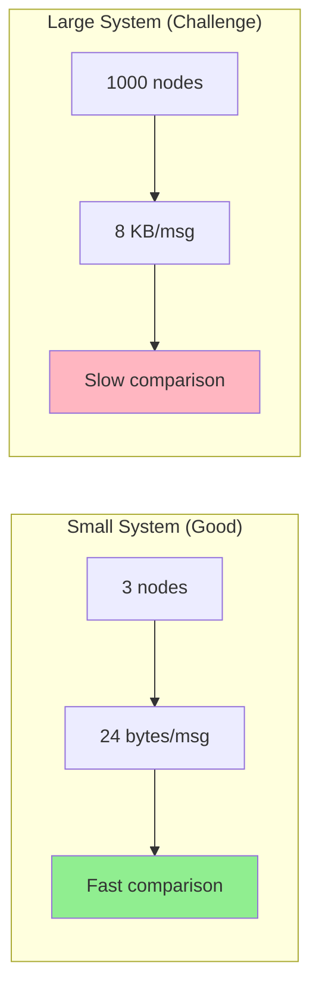
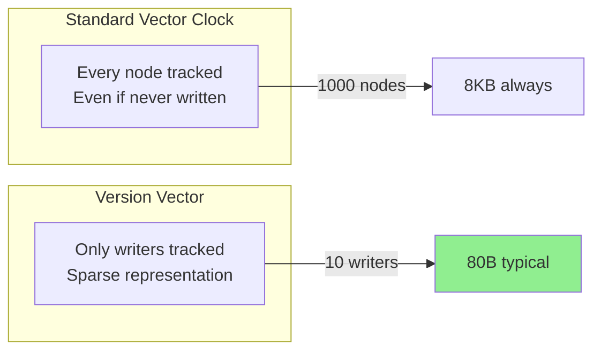
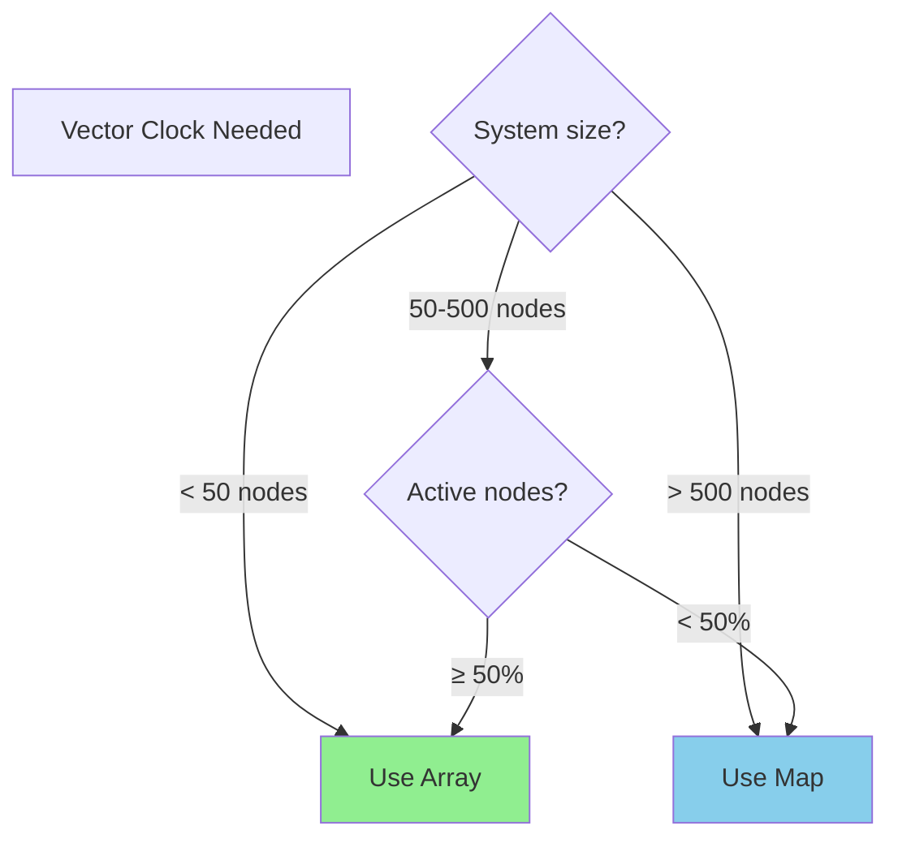
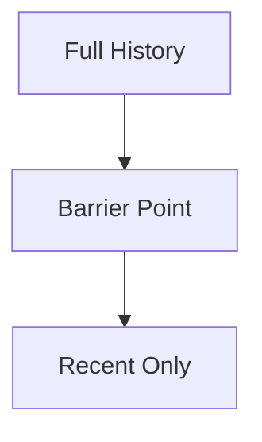
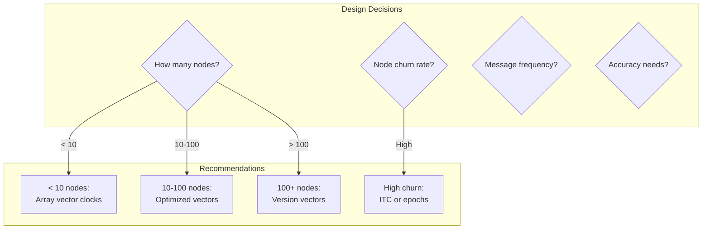

# Vector Clocks Pattern

**Tracking causality and ordering of events in distributed systems**

<div class="law-box">
Vector clocks solve the fundamental problem of determining event ordering in distributed systems without synchronized physical clocks - they capture the "happens-before" relationship between events across multiple nodes.
</div>

## Visual Overview

```mermaid
graph TB
    subgraph "Three-Node System"
        N1[Node A<br/>[1,0,0]]
        N2[Node B<br/>[0,0,0]]
        N3[Node C<br/>[0,0,0]]
    end
    
    subgraph "After Events"
        N1A[Node A<br/>[2,0,0]]
        N2A[Node B<br/>[2,1,0]]
        N3A[Node C<br/>[2,1,1]]
    end
    
    N1 -->|Event 1| N1A
    N1A -->|Send msg| N2A
    N2A -->|Send msg| N3A
```

## How Vector Clocks Work

### Visual Step-by-Step Evolution

```mermaid
flowchart LR
    subgraph "Step 1: Initial State"
        A1[A: [0,0,0]]
        B1[B: [0,0,0]]
        C1[C: [0,0,0]]
    end
    
    subgraph "Step 2: A performs action"
        A2[A: [1,0,0]]
        B2[B: [0,0,0]]
        C2[C: [0,0,0]]
    end
    
    subgraph "Step 3: A sends to B"
        A3[A: [1,0,0]]
        B3[B: [1,1,0]]
        C3[C: [0,0,0]]
    end
    
    subgraph "Step 4: B sends to C"
        A4[A: [1,0,0]]
        B4[B: [1,1,0]]
        C4[C: [1,1,1]]
    end
```

### Core Operations Visualized

<div class="grid">
<div class="card">
<h4>📝 Local Event</h4>

```mermaid
graph TB
    Before[Node A: [2,3,1]]
    Event[Local Event]
    After[Node A: [3,3,1]]
    
    Before --> Event
    Event --> After
    
    style Event fill:#90EE90
```

**Rule**: Increment own counter
</div>

<div class="card">
<h4>📤 Send Message</h4>

```mermaid
graph TB
    Sender[Node A: [3,3,1]]
    Message[Message + [3,3,1]]
    
    Sender --> Message
    
    style Message fill:#87CEEB
```

**Rule**: Attach current vector
</div>

<div class="card">
<h4>📥 Receive Message</h4>

```mermaid
graph TB
    Local[B: [1,4,2]]
    Received[Msg: [3,3,1]]
    Merge[max([1,4,2], [3,3,1])]
    Result[B: [3,5,2]]
    
    Local --> Merge
    Received --> Merge
    Merge --> Result
    
    style Result fill:#FFB6C1
```

**Rule**: Take max, increment own
</div>
</div>

## Causality Detection Algorithm

### Visual Comparison Rules

```mermaid
graph TD
    subgraph "Event Relationships"
        E1[Event 1: V1]
        E2[Event 2: V2]
    end
    
    subgraph "Comparison Rules"
        HB[V1 → V2<br/>Happens Before]
        CC[V1 || V2<br/>Concurrent]
        EQ[V1 = V2<br/>Same Event]
    end
    
    E1 --> Comp{Compare<br/>Vectors}
    E2 --> Comp
    
    Comp -->|All V1[i] ≤ V2[i]<br/>∃ V1[j] < V2[j]| HB
    Comp -->|Neither → other| CC
    Comp -->|All equal| EQ
```

### Comparison Examples Table

| Vector 1 | Vector 2 | Relationship | Explanation |
|----------|----------|--------------|-------------|
| [1,2,0] | [1,3,0] | V1 → V2 | V2 has all of V1's events + more |
| [2,1,0] | [1,2,0] | Concurrent | Neither dominates the other |
| [1,2,3] | [1,2,3] | Equal | Same exact state |
| [0,0,1] | [1,1,0] | Concurrent | Independent branches |
| [3,2,1] | [4,3,2] | V1 → V2 | V2 supersedes V1 |

## Real-World Scenarios

### 1. Distributed Database Conflict Resolution

```mermaid
graph TB
    subgraph "Concurrent Updates"
        Client1[Client 1<br/>Update X=5]
        Client2[Client 2<br/>Update X=10]
        
        Node1[Node A<br/>[2,0,1]]
        Node2[Node B<br/>[1,1,1]]
    end
    
    subgraph "Conflict Detection"
        Compare{[2,0,1] vs [1,1,1]}
        Conflict[Concurrent!<br/>Need resolution]
    end
    
    Client1 --> Node1
    Client2 --> Node2
    Node1 --> Compare
    Node2 --> Compare
    Compare --> Conflict
    
    style Conflict fill:#FFB6C1
```

### 2. Distributed Version Control

```mermaid
flowchart LR
    subgraph "Repository Timeline"
        Base[Base: [1,0,0]]
        Branch1[Alice: [2,0,0]]
        Branch2[Bob: [1,1,0]]
        Merge[Merge: [2,1,0]]
    end
    
    Base --> Branch1
    Base --> Branch2
    Branch1 --> Merge
    Branch2 --> Merge
    
    style Merge fill:#90EE90
```

## Vector Clock Size Analysis

### Growth Characteristics Table

| System Size | Vector Size | Memory/Message | Update Cost | Compare Cost |
|-------------|-------------|----------------|-------------|--------------|
| 3 nodes | 3 × 8 bytes | 24 bytes | O(1) | O(3) |
| 10 nodes | 10 × 8 bytes | 80 bytes | O(1) | O(10) |
| 100 nodes | 100 × 8 bytes | 800 bytes | O(1) | O(100) |
| 1000 nodes | 1000 × 8 bytes | 8 KB | O(1) | O(1000) |
| 10K nodes | 10K × 8 bytes | 80 KB | O(1) | O(10K) |

### Visual Scaling Challenge



## Optimization Strategies

### 1. Pruning Inactive Nodes

<div class="decision-box">
<h4>Dynamic Node Participation</h4>

```mermaid
graph TB
    Full[Full Vector<br/>[1,0,3,0,2,0,0,5]]
    Detect[Detect Inactive<br/>Nodes 2,4,6,7]
    Pruned[Pruned Vector<br/>[1,3,2,5]]
    Map[Node Map<br/>1→1, 3→2, 5→3, 8→4]
    
    Full --> Detect
    Detect --> Pruned
    Detect --> Map
```

**Benefits:**
- Reduces message size by 50%+
- Maintains causality guarantees
- Requires node mapping table
</div>

### 2. Version Vector Optimization



## Common Pitfall Scenarios

### 1. Clock Drift Visualization

```mermaid
graph TD
    subgraph "Scenario: Missing Update"
        A[Node A: [5,2,3]]
        B[Node B: [3,6,1]]
        C[Node C: [2,1,7]]
        
        Problem[Vectors diverge<br/>No convergence]
    end
    
    A --> Problem
    B --> Problem
    C --> Problem
    
    style Problem fill:#FFB6C1
```

### 2. Byzantine Behavior

<div class="truth-box">
<h4>Vector Clock Security Considerations</h4>

| Attack Type | Impact | Mitigation |
|-------------|---------|------------|
| **Clock manipulation** | False causality | Signed vectors |
| **Vector inflation** | DoS via size | Size limits |
| **Node impersonation** | Wrong ordering | Authentication |
| **Rollback attack** | Old state replay | Monotonic checks |
</div>

## Implementation Patterns

### 1. Efficient Storage Structure

```mermaid
graph TB
    subgraph "Array-based (Dense)"
        Array[Index: [0,1,2,3,4]<br/>Value: [5,0,3,0,1]]
        APros[✓ O(1) access<br/>✓ Cache friendly]
        ACons[✗ Wastes space<br/>✗ Fixed size]
    end
    
    subgraph "Map-based (Sparse)"
        Map[{1:5, 3:3, 5:1}]
        MPros[✓ Space efficient<br/>✓ Dynamic]
        MCons[✗ O(log n) access<br/>✗ Overhead]
    end
```

### 2. Hybrid Approach Decision Tree



## Practical Applications Comparison

### When to Use Different Clock Types

| Clock Type | Use Case | Pros | Cons |
|------------|----------|------|------|
| **Physical Clock** | Log timestamps | Simple, intuitive | Clock skew issues |
| **Lamport Clock** | Total ordering | Compact (1 integer) | No concurrent detection |
| **Vector Clock** | Causality tracking | Full causality | O(n) space |
| **Hybrid Clock** | Best of both | Physical + logical | More complex |
| **Interval Tree Clock** | Dynamic systems | Handles join/leave | Implementation complexity |

## Advanced Vector Clock Patterns

### 1. Dotted Version Vectors

```mermaid
graph LR
    subgraph "Problem: Sibling Values"
        Node[Node A]
        V1[Value 1<br/>[2,1,0]]
        V2[Value 2<br/>[2,1,0]]
        
        Node --> V1
        Node --> V2
    end
    
    subgraph "Solution: Dots"
        DVV[Dotted VV<br/>(A:2, [2,1,0])]
        Unique[Uniquely identifies<br/>each value]
    end
    
    V1 --> DVV
    V2 --> DVV
    DVV --> Unique
```

### 2. Causal Context Compression

<div class="grid">
<div class="card">
<h4>🗜️ Delta Encoding</h4>

```mermaid
graph TB
    Full[Full: [10,8,7,9,6]]
    Base[Base: [10,8,6,9,5]]
    Delta[Delta: [+0,+0,+1,+0,+1]]
    
    Full --> Delta
    Base --> Delta
```

Transmit only changes
</div>

<div class="card">
<h4>🎯 Causal Barrier</h4>



Forget ancient history
</div>
</div>

## Production Deployment Guide

### System Design Considerations



### Monitoring Dashboard

<div class="grid">
<div class="card">
<h4>📊 Vector Size</h4>

```
Average: 127 bytes
p95: 256 bytes
p99: 512 bytes
Max: 1024 bytes
```

Track growth over time
</div>

<div class="card">
<h4>🔄 Conflict Rate</h4>

```
Concurrent: 2.3%
Causal: 97.7%
Resolution time: 12ms
```

Monitor conflict patterns
</div>

<div class="card">
<h4>⚡ Operation Performance</h4>

```
Update: 0.1μs
Compare: 0.5μs
Merge: 0.8μs
Serialize: 2.1μs
```

Ensure sub-millisecond
</div>

<div class="card">
<h4>🌐 Network Overhead</h4>

```
Clock bytes: 15%
Payload bytes: 85%
Compression: 40%
```

Optimize if > 20%
</div>
</div>

## Visual Implementation Examples

### Code Pattern Visualization

```mermaid
graph TD
    subgraph "Vector Clock Operations"
        Init[Initialize: [0,0,0]]
        Local[Local Event:<br/>clock[nodeId]++]
        Send[Send Message:<br/>attach clock]
        Receive[Receive Message:<br/>merge + increment]
    end
    
    subgraph "Merge Algorithm"
        Take[Take max of each position]
        Inc[Increment own position]
        Update[Update local clock]
    end
    
    Init --> Local
    Local --> Send
    Send --> Receive
    Receive --> Take
    Take --> Inc
    Inc --> Update
```

### Real Implementation Patterns

<div class="grid">
<div class="card">
<h4>📝 Key-Value Store</h4>

```mermaid
graph TB
    KV[Key: "user:123"]
    V1[Value: {name: "Alice"}<br/>Clock: [2,0,1]]
    V2[Value: {name: "Alicia"}<br/>Clock: [1,1,1]]
    
    KV --> V1
    KV --> V2
    
    Conflict[Concurrent values!<br/>Keep both as siblings]
    
    V1 --> Conflict
    V2 --> Conflict
```

Riak/Voldemort approach
</div>

<div class="card">
<h4>🔄 Replication Log</h4>

```mermaid
graph LR
    Entry[Log Entry]
    VC[Vector Clock]
    Data[Operation Data]
    
    Entry --> VC
    Entry --> Data
    
    Apply{Can apply?}
    VC --> Apply
    
    Apply -->|Yes| Execute
    Apply -->|No| Queue
```

Causally consistent replication
</div>
</div>

## Visual Debugging Guide

### Common Vector Clock Issues

```mermaid
graph TD
    subgraph "Issue 1: Clock Skew"
        A1[A: [100,2,3]]
        B1[B: [5,50,1]]
        C1[C: [2,3,75]]
        P1[No clear ordering!]
    end
    
    subgraph "Issue 2: Missing Updates"
        A2[A: [5,0,0]]
        B2[B: [3,4,0]]
        Gap[Lost message from A→B]
    end
    
    subgraph "Issue 3: Node Churn"
        Old[Old: [1,2,3]]
        New[New: [1,2,3,0,0]]
        Prob[Clock size grows!]
    end
    
    style P1 fill:#FF6B6B
    style Gap fill:#FF6B6B  
    style Prob fill:#FF6B6B
```

### Visual Troubleshooting Steps

<div class="decision-box">
<h4>Debugging Vector Clock Problems</h4>

```mermaid
graph TD
    Problem[Vector clock issue]
    Type{What type?}
    
    Type -->|Diverging clocks| Diverge[Check message delivery]
    Type -->|Growing size| Size[Implement pruning]
    Type -->|Wrong ordering| Order[Verify comparison logic]
    Type -->|Performance| Perf[Consider alternatives]
    
    Diverge --> Fix1[Ensure reliable delivery]
    Size --> Fix2[Remove inactive nodes]
    Order --> Fix3[Fix implementation]
    Perf --> Fix4[Use version vectors]
    
    style Fix1 fill:#4CAF50,color:#fff
    style Fix2 fill:#4CAF50,color:#fff
    style Fix3 fill:#4CAF50,color:#fff
    style Fix4 fill:#4CAF50,color:#fff
```
</div>

## Performance Visualization

### Scalability Analysis

```mermaid
graph LR
    subgraph "Operation Cost by Node Count"
        N10[10 nodes<br/>⏱ 0.1μs]
        N100[100 nodes<br/>⏱ 1μs]
        N1K[1K nodes<br/>⏱ 10μs]
        N10K[10K nodes<br/>⏱ 100μs]
    end
    
    N10 -->|10x nodes| N100
    N100 -->|10x nodes| N1K
    N1K -->|10x nodes| N10K
    
    style N10 fill:#90EE90
    style N100 fill:#FFA500
    style N1K fill:#FF6B6B
    style N10K fill:#8B0000,color:#fff
```

### Memory Overhead Visualization

<div class="truth-box">
<h4>Vector Clock Memory Usage</h4>

| Nodes | Per Clock | 1M Objects | Network Overhead |
|-------|-----------|------------|------------------|
| 10 | 80 bytes | 80 MB | 1.6% |
| 100 | 800 bytes | 800 MB | 16% |
| 1,000 | 8 KB | 8 GB | 160% |
| 10,000 | 80 KB | 80 GB | 1600% |

```mermaid
graph TD
    subgraph "Memory Growth"
        Linear[Linear with nodes]
        Problem[Becomes prohibitive]
        Solution[Need optimization]
    end
    
    Linear --> Problem
    Problem --> Solution
```
</div>

## Summary and Best Practices

<div class="law-box">
<h3>🎯 Vector Clock Decision Framework</h3>

**Use Vector Clocks when:**
- Need to detect concurrent updates
- Building eventually consistent systems
- Implementing multi-master replication
- Debugging distributed systems

**Avoid when:**
- Have more than 100-1000 nodes
- Need only total ordering
- Can use centralized coordination
- Message size is critical
</div>

### Implementation Checklist

| ✓ | Task | Why Important |
|---|------|---------------|
| ☐ | Choose appropriate storage (array vs map) | Performance impact |
| ☐ | Implement comparison correctly | Correctness critical |
| ☐ | Add monitoring for size/conflicts | Production visibility |
| ☐ | Plan for node additions/removals | System evolution |
| ☐ | Consider compression strategies | Network efficiency |
| ☐ | Document conflict resolution | Application logic |

## Visual Algorithm Comparison

### Clock Types at a Glance

```mermaid
graph LR
    subgraph "Physical Clock"
        PC[12:34:56.789]
        PCPro[✅ Simple]
        PCCon[❌ Clock skew]
    end
    
    subgraph "Lamport Clock"
        LC[42]
        LCPro[✅ Compact]
        LCCon[❌ No concurrency]
    end
    
    subgraph "Vector Clock"
        VC[[2,5,3]]
        VCPro[✅ Full causality]
        VCCon[❌ O(n) size]
    end
    
    subgraph "Hybrid Clock"
        HC[12:34:56.42]
        HCPro[✅ Best of both]
        HCCon[❌ Complex]
    end
```

### Visual Decision Tree

```mermaid
graph TD
    Start[Need event ordering?]
    Nodes{How many nodes?}
    
    Start --> Nodes
    Nodes -->|< 10| Small{Need causality?}
    Nodes -->|10-100| Medium{Can tolerate size?}
    Nodes -->|> 100| Large[Consider alternatives]
    
    Small -->|Yes| VC1[Vector Clocks ✅]
    Small -->|No| LC1[Lamport Clocks]
    
    Medium -->|Yes| VC2[Optimized Vector Clocks]
    Medium -->|No| Hybrid[Hybrid Logical Clocks]
    
    Large --> Version[Version Vectors]
    Large --> ITC[Interval Tree Clocks]
    Large --> Central[Centralized Ordering]
    
    style VC1 fill:#4CAF50,color:#fff
    style VC2 fill:#FFA500
    style Version fill:#87CEEB
```

## Related Patterns

- [Logical Clocks](logical-clocks.md) - Simpler alternative for total ordering
- [CRDT](crdt.md) - Uses vector clocks for convergence
- [Eventual Consistency](eventual-consistency.md) - Primary use case
- [Consensus](consensus.md) - Alternative for strong consistency
- Merkle Trees (Coming Soon) - Another verification structure
- [Bloom Filter](bloom-filter.md) - Another space-efficient data structure

## References

- Lamport, L. (1978). "Time, Clocks, and the Ordering of Events"
- [Amazon DynamoDB Paper](https://www.allthingsdistributed.com/files/amazon-dynamo-sosp2007.pdf)
- [Riak Documentation](https://docs.riak.com/riak/kv/latest/learn/concepts/causal-context/)
- [Interval Tree Clocks](http://gsd.di.uminho.pt/members/cbm/ps/itc2008.pdf)
- [Hybrid Logical Clocks](https://cse.buffalo.edu/tech-reports/2014-04.pdf)