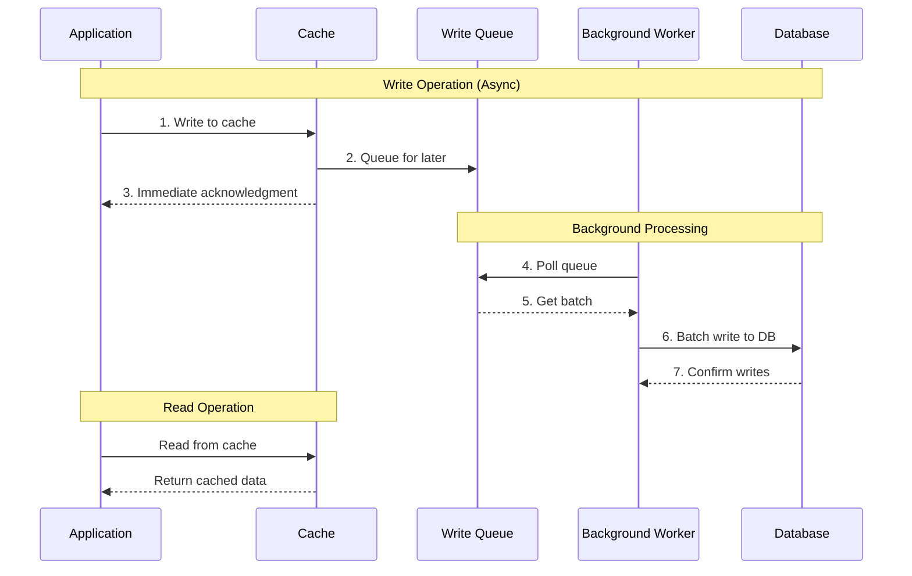
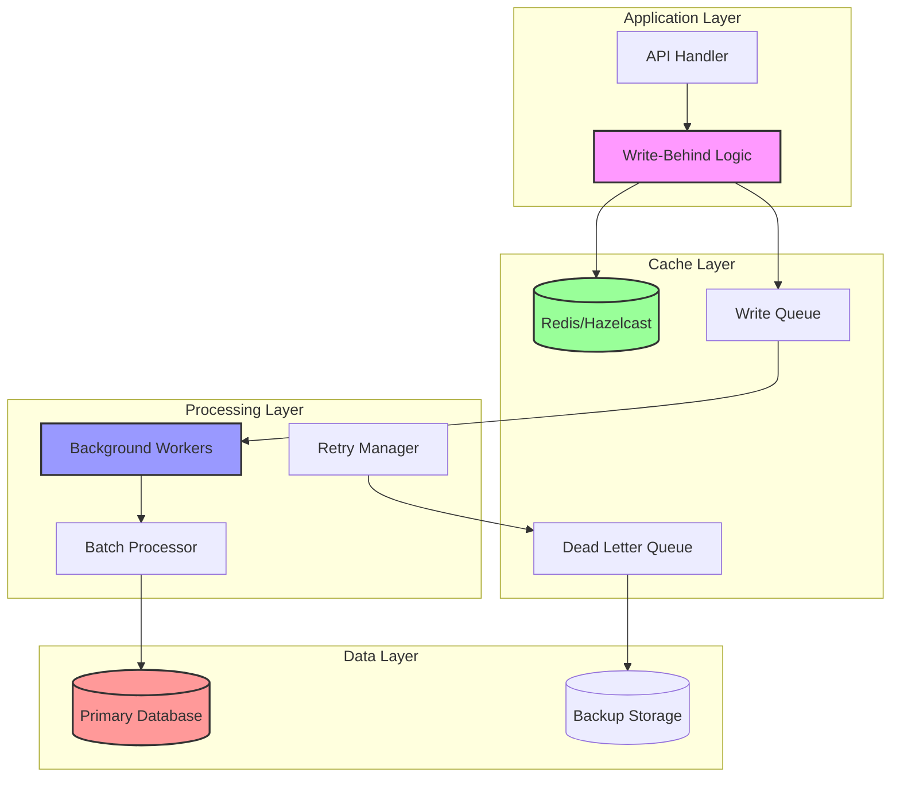
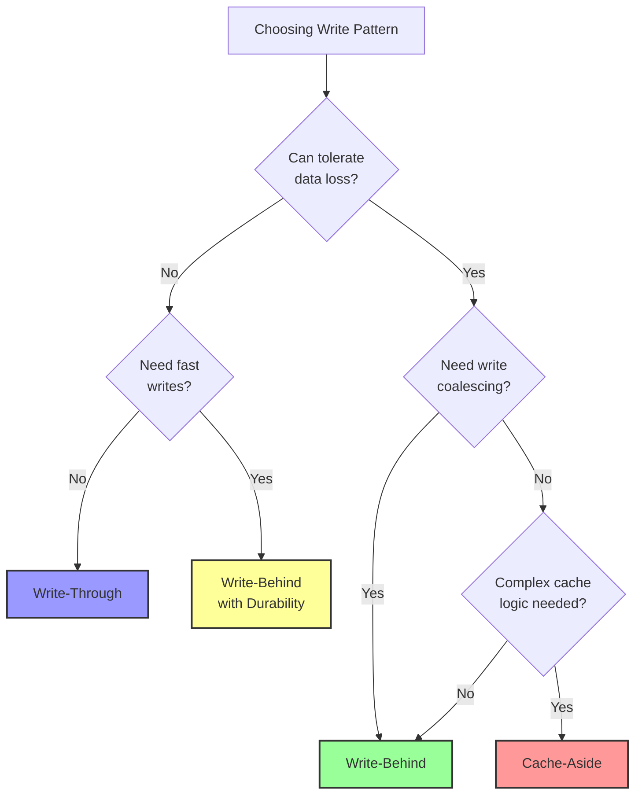

# Write-Behind Cache Pattern

**Write fast now, persist later - Trading consistency for blazing write performance**

> *"In the race between consistency and performance, sometimes you have to let performance win the sprint while consistency catches up in the marathon." - Performance Engineer's Mantra*

---

## Level 1: Intuition

### The Restaurant Order System Analogy

Write-behind caching is like a restaurant where:
1. The waiter writes your order on their notepad (cache) and immediately says "Got it!"
2. You can start chatting while the waiter continues taking other orders
3. Later, the waiter batches all orders and sends them to the kitchen (database)
4. If the waiter drops their notepad before reaching the kitchen, orders are lost
5. But the service is incredibly fast because customers don't wait for kitchen confirmation

### Visual Pattern Flow



### Key Characteristics

<div class="decision-box">

**Write-Behind Pattern**
- **Write Performance**: Ultra-fast (cache-only writes)
- **Consistency**: Eventual consistency
- **Durability Risk**: Possible data loss on cache failure
- **Complexity**: High (queue management, failure handling)
- **Use Case**: Analytics, metrics, non-critical updates

</div>

---

## Level 2: Deep Dive

### Implementation Architecture



### Complete Implementation Example

```python
import redis
import asyncio
import json
from typing import Optional, Any, Dict, List, Tuple
from datetime import datetime, timedelta
from collections import defaultdict
import logging
from dataclasses import dataclass
from enum import Enum

class WriteStatus(Enum):
    PENDING = "pending"
    PROCESSING = "processing"
    COMPLETED = "completed"
    FAILED = "failed"

@dataclass
class WriteOperation:
    key: str
    value: Any
    table: str
    operation: str  # insert, update, delete
    timestamp: datetime
    retry_count: int = 0
    status: WriteStatus = WriteStatus.PENDING

class WriteBehindCache:
    """
    Production-ready Write-Behind Cache implementation with:
    - Asynchronous write queuing
    - Batch processing
    - Failure handling and retry logic
    - Data durability guarantees
    """
    
    def __init__(
        self, 
        redis_client: redis.Redis, 
        db_connection,
        batch_size: int = 100,
        flush_interval: int = 5,
        max_retries: int = 3
    ):
        self.cache = redis_client
        self.db = db_connection
        self.batch_size = batch_size
        self.flush_interval = flush_interval
        self.max_retries = max_retries
        self.logger = logging.getLogger(__name__)
        self.metrics = CacheMetrics()
        
# Write queue and processing state
        self.write_queue = asyncio.Queue()
        self.pending_writes = defaultdict(list)
        self.processing = False
        self.shutdown = False
        
    async def start(self):
        """Start background write processing"""
        self.processing = True
        asyncio.create_task(self._process_write_queue())
        asyncio.create_task(self._periodic_flush())
        self.logger.info("Write-behind cache started")
    
    async def stop(self):
        """Gracefully stop and flush pending writes"""
        self.shutdown = True
        await self._flush_all_pending()
        self.processing = False
        self.logger.info("Write-behind cache stopped")
    
    async def write(
        self, 
        key: str, 
        value: Any, 
        table: str,
        operation: str = "upsert"
    ) -> bool:
        """
        Asynchronous write to cache with queued database write
        """
        start_time = datetime.now()
        
        try:
# Step 1: Write to cache immediately
            cache_value = self._serialize(value)
            await self.cache.set(key, cache_value)
            
# Step 2: Queue for database write
            write_op = WriteOperation(
                key=key,
                value=value,
                table=table,
                operation=operation,
                timestamp=datetime.now()
            )
            
            await self.write_queue.put(write_op)
            
# Record metrics
            duration = (datetime.now() - start_time).total_seconds()
            self.metrics.record_write_behind(key, duration, True)
            
            return True
            
        except Exception as e:
            self.logger.error(f"Write-behind failed for key {key}: {e}")
            self.metrics.record_error(key, "write_behind")
            raise
    
    async def write_batch(
        self,
        items: List[Dict[str, Any]],
        table: str
    ) -> Dict[str, bool]:
        """
        Batch write with write-behind
        """
        results = {}
        
# Use pipeline for cache writes
        pipe = self.cache.pipeline()
        
        for item in items:
            key = f"{table}:{item['id']}"
            pipe.set(key, self._serialize(item))
            
# Queue for database
            write_op = WriteOperation(
                key=key,
                value=item,
                table=table,
                operation="upsert",
                timestamp=datetime.now()
            )
            await self.write_queue.put(write_op)
            results[key] = True
        
# Execute pipeline
        await pipe.execute()
        
        return results
    
    async def read(self, key: str, fetch_func=None) -> Optional[Any]:
        """
        Read from cache (may return stale data during write-behind)
        """
# Always read from cache in write-behind pattern
        cached_value = await self.cache.get(key)
        
        if cached_value:
            self.metrics.record_hit(key)
            return self._deserialize(cached_value)
        
        self.metrics.record_miss(key)
        
# Optional: fetch from database if not in cache
        if fetch_func:
            data = await fetch_func()
            if data:
# Cache for future reads
                await self.cache.set(key, self._serialize(data))
            return data
        
        return None
    
    async def delete(self, key: str, table: str, where_clause: Dict) -> bool:
        """
        Delete with write-behind
        """
# Remove from cache immediately
        await self.cache.delete(key)
        
# Queue delete operation
        write_op = WriteOperation(
            key=key,
            value=where_clause,
            table=table,
            operation="delete",
            timestamp=datetime.now()
        )
        
        await self.write_queue.put(write_op)
        return True
    
    async def _process_write_queue(self):
        """
        Background task to process write queue
        """
        while self.processing:
            try:
# Collect batch of writes
                batch = await self._collect_batch()
                
                if batch:
                    await self._process_batch(batch)
                    
            except Exception as e:
                self.logger.error(f"Error processing write queue: {e}")
                await asyncio.sleep(1)
    
    async def _collect_batch(self) -> List[WriteOperation]:
        """
        Collect a batch of write operations
        """
        batch = []
        deadline = datetime.now() + timedelta(seconds=1)
        
        while len(batch) < self.batch_size and datetime.now() < deadline:
            try:
                timeout = (deadline - datetime.now()).total_seconds()
                write_op = await asyncio.wait_for(
                    self.write_queue.get(), 
                    timeout=max(0.1, timeout)
                )
                batch.append(write_op)
            except asyncio.TimeoutError:
                break
        
        return batch
    
    async def _process_batch(self, batch: List[WriteOperation]):
        """
        Process a batch of write operations
        """
# Group by table and operation
        grouped = self._group_operations(batch)
        
        for (table, operation), ops in grouped.items():
            try:
                if operation == "upsert":
                    await self._batch_upsert(table, ops)
                elif operation == "delete":
                    await self._batch_delete(table, ops)
                    
# Mark as completed
                for op in ops:
                    op.status = WriteStatus.COMPLETED
                    self.metrics.record_write_completed(op.key)
                    
            except Exception as e:
                self.logger.error(
                    f"Batch write failed for {table}.{operation}: {e}"
                )
                await self._handle_failed_batch(ops, e)
    
    async def _batch_upsert(self, table: str, operations: List[WriteOperation]):
        """
        Perform batch upsert to database
        """
        if not operations:
            return
        
# Prepare batch data
        values = [op.value for op in operations]
        
# Use database-specific batch insert/update
        async with self.db.transaction() as tx:
# PostgreSQL example with ON CONFLICT
            columns = list(values[0].keys())
            
# Build query
            query = f"""
                INSERT INTO {table} ({', '.join(columns)})
                VALUES %s
                ON CONFLICT (id) DO UPDATE SET
                {', '.join([f"{col} = EXCLUDED.{col}" for col in columns if col != 'id'])}
            """
            
# Execute batch
            await tx.execute_values(query, values)
    
    async def _handle_failed_batch(
        self, 
        operations: List[WriteOperation], 
        error: Exception
    ):
        """
        Handle failed write operations
        """
        for op in operations:
            op.retry_count += 1
            
            if op.retry_count <= self.max_retries:
# Re-queue for retry
                op.status = WriteStatus.PENDING
                await self.write_queue.put(op)
                self.logger.warning(
                    f"Re-queuing write for {op.key}, "
                    f"retry {op.retry_count}/{self.max_retries}"
                )
            else:
# Move to dead letter queue
                op.status = WriteStatus.FAILED
                await self._move_to_dlq(op, error)
    
    async def _move_to_dlq(self, operation: WriteOperation, error: Exception):
        """
        Move failed operation to dead letter queue
        """
        dlq_entry = {
            'operation': operation.__dict__,
            'error': str(error),
            'timestamp': datetime.now().isoformat()
        }
        
# Store in DLQ (Redis list)
        await self.cache.lpush(
            'write_behind:dlq',
            json.dumps(dlq_entry)
        )
        
        self.logger.error(
            f"Moved operation for {operation.key} to DLQ after "
            f"{operation.retry_count} retries"
        )
        
        self.metrics.record_dlq_entry(operation.key)
    
    async def _periodic_flush(self):
        """
        Periodically flush pending writes
        """
        while self.processing:
            await asyncio.sleep(self.flush_interval)
            
            if not self.shutdown:
                await self._flush_pending_writes()
    
    async def _flush_pending_writes(self):
        """
        Flush any pending writes older than threshold
        """
        now = datetime.now()
        tables_to_flush = []
        
        for table, writes in self.pending_writes.items():
            if writes and (now - writes[0].timestamp).seconds >= self.flush_interval:
                tables_to_flush.append(table)
        
        for table in tables_to_flush:
            writes = self.pending_writes.pop(table, [])
            if writes:
                await self._process_batch(writes)
    
    def _group_operations(
        self, 
        batch: List[WriteOperation]
    ) -> Dict[Tuple[str, str], List[WriteOperation]]:
        """
        Group operations by table and type
        """
        grouped = defaultdict(list)
        
        for op in batch:
            key = (op.table, op.operation)
            grouped[key].append(op)
        
        return grouped

# Advanced features
class AdvancedWriteBehindCache(WriteBehindCache):
    """Extended write-behind with advanced features"""
    
    async def write_with_coalescing(
        self,
        key: str,
        value: Any,
        table: str,
        coalesce_window: int = 1
    ) -> bool:
        """
        Coalesce multiple writes to same key
        """
# Check if key has pending write
        pending_key = f"pending:{key}"
        existing = await self.cache.get(pending_key)
        
        if existing:
# Update only the cache, skip queuing
            await self.cache.set(key, self._serialize(value))
            return True
        
# Mark as pending and queue
        await self.cache.setex(pending_key, coalesce_window, "1")
        return await self.write(key, value, table)
    
    async def write_with_priority(
        self,
        key: str,
        value: Any,
        table: str,
        priority: int = 0
    ) -> bool:
        """
        Priority-based write queuing
        """
# Use priority queue for important writes
        write_op = WriteOperation(
            key=key,
            value=value,
            table=table,
            operation="upsert",
            timestamp=datetime.now()
        )
        
        if priority > 0:
# High priority: process immediately
            await self._process_batch([write_op])
        else:
# Normal priority: use regular queue
            await self.write_queue.put(write_op)
        
        return True
    
    async def conditional_write_behind(
        self,
        key: str,
        value: Any,
        table: str,
        condition_func
    ) -> bool:
        """
        Conditional write-behind based on data characteristics
        """
# Determine write strategy
        use_write_behind = await condition_func(value)
        
        if use_write_behind:
# Use write-behind for non-critical data
            return await self.write(key, value, table)
        else:
# Use synchronous write for critical data
            async with self.db.transaction() as tx:
                await self._write_to_db_sync(tx, table, value)
                await self.cache.set(key, self._serialize(value))
                return True
```

### Durability and Recovery

```python
class DurableWriteBehindCache(WriteBehindCache):
    """Write-behind with durability guarantees"""
    
    def __init__(self, *args, **kwargs):
        super().__init__(*args, **kwargs)
        self.wal_enabled = True
        self.wal_dir = "/var/cache/write_behind/wal"
    
    async def write_with_wal(
        self,
        key: str,
        value: Any,
        table: str
    ) -> bool:
        """
        Write with Write-Ahead Logging for durability
        """
# Write to WAL first
        wal_entry = {
            'key': key,
            'value': value,
            'table': table,
            'timestamp': datetime.now().isoformat(),
            'sequence': await self._get_next_sequence()
        }
        
        await self._append_to_wal(wal_entry)
        
# Then proceed with normal write-behind
        return await self.write(key, value, table)
    
    async def recover_from_wal(self):
        """
        Recover pending writes from WAL on startup
        """
        wal_entries = await self._read_wal()
        
        for entry in wal_entries:
# Check if already processed
            if not await self._is_processed(entry['sequence']):
# Re-queue for processing
                write_op = WriteOperation(
                    key=entry['key'],
                    value=entry['value'],
                    table=entry['table'],
                    operation='upsert',
                    timestamp=datetime.fromisoformat(entry['timestamp'])
                )
                await self.write_queue.put(write_op)
        
        self.logger.info(f"Recovered {len(wal_entries)} entries from WAL")
    
    async def checkpoint(self):
        """
        Create checkpoint and truncate WAL
        """
# Ensure all pending writes are flushed
        await self._flush_all_pending()
        
# Create checkpoint
        checkpoint = {
            'timestamp': datetime.now().isoformat(),
            'last_sequence': await self._get_current_sequence()
        }
        
        await self._write_checkpoint(checkpoint)
        
# Truncate WAL
        await self._truncate_wal(checkpoint['last_sequence'])
```

---

## Level 3: Production Patterns

### Performance Optimization

<div class="law-box">

**Write-Behind Performance Guidelines**

1. **Optimal Batch Sizing**
   - Balance between latency and throughput
   - Consider database connection limits
   - Monitor batch processing time

2. **Queue Management**
   - Use persistent queues for durability
   - Implement back-pressure mechanisms
   - Monitor queue depth and processing lag

3. **Coalescing Strategies**
   - Merge updates to same key
   - Deduplicate operations in queue
   - Use time windows for grouping

</div>

### Common Pitfalls and Solutions

```python
class WriteBehindPitfalls:
    """Common issues and their solutions"""
    
# PITFALL 1: Queue Overflow
    async def handle_queue_overflow(self, write_op: WriteOperation):
        """Handle when queue is full"""
        max_queue_size = 10000
        
        if self.write_queue.qsize() >= max_queue_size:
# Apply back-pressure
            self.metrics.record_backpressure()
            
# Option 1: Block until space available
            await asyncio.wait_for(
                self.write_queue.put(write_op),
                timeout=5.0
            )
            
# Option 2: Spill to disk
            if self.write_queue.qsize() >= max_queue_size:
                await self._spill_to_disk(write_op)
    
# PITFALL 2: Data Loss on Crash
    async def ensure_durability(self, operations: List[WriteOperation]):
        """Ensure durability before acknowledging writes"""
# Use Redis persistence
        if self.redis_persistence_enabled:
# Force BGSAVE after critical writes
            await self.cache.bgsave()
        
# Or use external durability
        await self._persist_to_durable_queue(operations)
    
# PITFALL 3: Stale Reads During Lag
    async def handle_read_after_write(self, key: str):
        """Ensure read-after-write consistency"""
# Check if key has pending writes
        pending = await self._has_pending_writes(key)
        
        if pending:
# Option 1: Wait for write to complete
            await self._wait_for_write_completion(key, timeout=1.0)
            
# Option 2: Read from write queue
            pending_value = await self._read_from_queue(key)
            if pending_value:
                return pending_value
        
# Normal read from cache
        return await self.read(key)
```

### Monitoring and Observability

```python
class WriteBehindMonitoring:
    """Production monitoring for write-behind pattern"""
    
    def __init__(self, metrics_client):
        self.metrics = metrics_client
    
    def track_queue_metrics(self):
        """Monitor queue health"""
        return {
            'queue_depth': self.write_queue.qsize(),
            'processing_lag': self.calculate_processing_lag(),
            'batch_size_avg': self.get_average_batch_size(),
            'write_throughput': self.get_writes_per_second(),
            'dlq_size': self.get_dlq_size()
        }
    
    def track_durability_metrics(self):
        """Monitor durability and data safety"""
        return {
            'pending_writes': self.count_pending_writes(),
            'wal_size': self.get_wal_size(),
            'last_checkpoint': self.get_last_checkpoint_time(),
            'data_at_risk': self.calculate_data_at_risk()
        }
    
    def alert_conditions(self) -> List[Dict]:
        """Define alerting conditions"""
        return [
            {
                'name': 'queue_overflow',
                'condition': lambda m: m['queue_depth'] > 5000,
                'severity': 'warning'
            },
            {
                'name': 'processing_lag',
                'condition': lambda m: m['processing_lag'] > 60,
                'severity': 'critical'
            },
            {
                'name': 'high_dlq_rate',
                'condition': lambda m: m['dlq_rate'] > 0.01,
                'severity': 'warning'
            }
        ]
```

---

## Comparison with Other Patterns

### Write-Behind vs Other Caching Patterns

| Aspect | Write-Behind | Write-Through | Cache-Aside | Read-Through |
|--------|--------------|---------------|-------------|--------------|
| **Write Performance** | Excellent | Poor | Good | N/A |
| **Read Performance** | Excellent | Excellent | Good | Good |
| **Consistency** | Eventual | Strong | Eventual | Strong |
| **Durability** | Risk of loss | Guaranteed | Guaranteed | Guaranteed |
| **Complexity** | High | Medium | Medium | Low |
| **Use Case** | Analytics, logs | Financial | General | Reference data |

### Decision Framework



---

## Best Practices

<div class="truth-box">

**Write-Behind Golden Rules**

1. **Always Plan for Data Loss**
   - Implement WAL or persistent queues
   - Regular checkpoints and backups
   - Monitor pending write volumes

2. **Size Your Queues Appropriately**
   - Calculate based on write rate and processing speed
   - Implement overflow strategies
   - Monitor queue metrics continuously

3. **Handle Failures Gracefully**
   - Implement retry logic with exponential backoff
   - Use dead letter queues for failed writes
   - Alert on high failure rates

4. **Consider Read Consistency**
   - Document eventual consistency behavior
   - Implement read-after-write checks where needed
   - Provide consistency level options

</div>

### Real-World Example: Metrics Collection System

```python
class MetricsCollectionService:
    """Real-world write-behind for high-volume metrics"""
    
    def __init__(self, write_behind_cache: WriteBehindCache):
        self.cache = write_behind_cache
        self.aggregator = MetricsAggregator()
    
    async def record_metric(
        self,
        metric_name: str,
        value: float,
        tags: Dict[str, str],
        timestamp: Optional[datetime] = None
    ):
        """Record metric with write-behind for performance"""
        timestamp = timestamp or datetime.now()
        
# Create metric key
        tag_str = ','.join([f"{k}={v}" for k, v in sorted(tags.items())])
        key = f"metric:{metric_name}:{tag_str}:{timestamp.minute}"
        
# Aggregate in cache (increment counter, update stats)
        metric_data = await self.cache.read(key) or {
            'count': 0,
            'sum': 0,
            'min': float('inf'),
            'max': float('-inf'),
            'values': []
        }
        
        metric_data['count'] += 1
        metric_data['sum'] += value
        metric_data['min'] = min(metric_data['min'], value)
        metric_data['max'] = max(metric_data['max'], value)
        
# Keep reservoir sample for percentiles
        if len(metric_data['values']) < 100:
            metric_data['values'].append(value)
        else:
# Reservoir sampling
            idx = random.randint(0, metric_data['count'])
            if idx < 100:
                metric_data['values'][idx] = value
        
# Write-behind with coalescing
        await self.cache.write_with_coalescing(
            key=key,
            value=metric_data,
            table='metrics_aggregated',
            coalesce_window=60  # 1 minute window
        )
    
    async def bulk_import_metrics(
        self,
        metrics: List[Dict]
    ):
        """High-performance bulk metric import"""
# Group by minute for aggregation
        grouped = defaultdict(list)
        
        for metric in metrics:
            minute_key = metric['timestamp'].replace(
                second=0, microsecond=0
            )
            grouped[minute_key].append(metric)
        
# Process each minute batch
        for minute, minute_metrics in grouped.items():
            aggregated = self.aggregator.aggregate_metrics(minute_metrics)
            
# Write aggregated data
            await self.cache.write_batch(
                items=aggregated,
                table='metrics_aggregated'
            )
    
    async def query_metrics(
        self,
        metric_name: str,
        start_time: datetime,
        end_time: datetime,
        tags: Optional[Dict[str, str]] = None
    ) -> List[Dict]:
        """Query metrics (may include pending writes)"""
        results = []
        
# Generate time buckets
        current = start_time.replace(second=0, microsecond=0)
        while current <= end_time:
# Build key pattern
            if tags:
                tag_str = ','.join([f"{k}={v}" for k, v in sorted(tags.items())])
                pattern = f"metric:{metric_name}:{tag_str}:{current.minute}"
            else:
                pattern = f"metric:{metric_name}:*:{current.minute}"
            
# Read from cache (includes pending writes)
            keys = await self.cache.keys(pattern)
            for key in keys:
                data = await self.cache.read(key)
                if data:
                    results.append({
                        'timestamp': current,
                        'metric': metric_name,
                        'data': data
                    })
            
            current += timedelta(minutes=1)
        
        return results
```

---

## 🔗 Related Patterns

- **[Caching Strategies](caching-strategies.md)**: Overview of all caching patterns
- **[Cache-Aside](cache-aside.md)**: Application-managed caching
- **[Write-Through Cache](write-through-cache.md)**: Synchronous write caching
- **[Read-Through Cache](read-through-cache.md)**: Transparent read caching
- **[Event Sourcing](event-sourcing.md)**: Related async write pattern

---

## 📚 References

1. [Hazelcast - Write-Behind Caching](https://docs.hazelcast.com/hazelcast/latest/data-structures/map#write-behind)
2. [Oracle Coherence - Write-Behind Caching](https://docs.oracle.com/en/middleware/standalone/coherence/14.1.1.0/develop-applications/write-behind-caching.html)
3. [Apache Ignite - Write-Behind Caching](https://ignite.apache.org/docs/latest/persistence/external-storage#write-behind-caching)
4. [Terracotta - Write-Behind Patterns](http://www.terracotta.org/documentation/enterprise-ehcache/write-behind)

---

**Previous**: [← Write-Through Cache](write-through-cache.md) | **Next**: [Read-Through Cache →](read-through-cache.md)