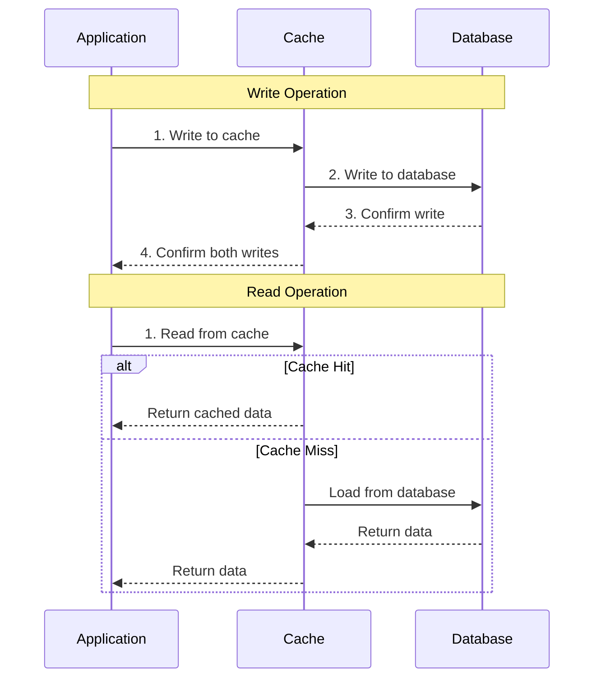
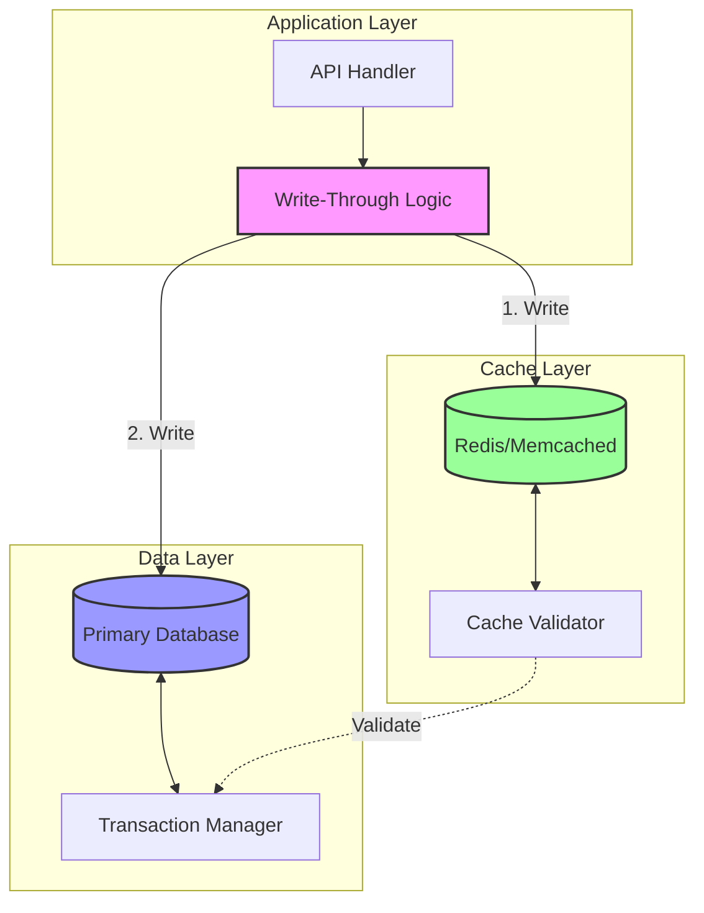
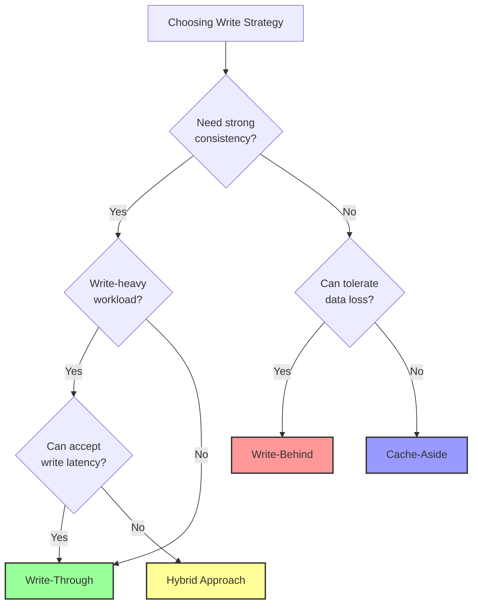

# Write-Through Cache Pattern

**Write it twice, keep it consistent - Synchronous dual-write for data integrity**

> *"The price of consistency is performance, but sometimes that's a price worth paying." - Database Architect Wisdom*

---

## 🎯 Level 1: Intuition

### The Bank Teller Analogy

Write-through caching is like a bank teller who:
1. When you deposit money, they update both the computer system AND write it in the physical ledger simultaneously
2. They don't confirm your transaction until BOTH records are updated
3. The records are always in sync because they're updated together
4. It takes longer, but you never have mismatched records

### Visual Pattern Flow



### Key Characteristics

<div class="decision-box">

**Write-Through Pattern**
- **Consistency**: Strong consistency guaranteed
- **Write Latency**: Higher (writes to both systems)
- **Read Performance**: Fast (always cached after first write)
- **Data Loss Risk**: Minimal
- **Use Case**: When consistency matters more than write speed

</div>

---

## 🔬 Level 2: Deep Dive

### Implementation Architecture



### Complete Implementation Example

```python
import redis
import asyncio
from typing import Optional, Any, Dict, List
from datetime import datetime
import logging
from contextlib import asynccontextmanager

class WriteThroughCache:
    """
    Production-ready Write-Through Cache implementation with:
    - Atomic dual writes
    - Rollback on failure
    - Consistency validation
    - Performance monitoring
    """
    
    def __init__(self, redis_client: redis.Redis, db_connection, default_ttl: int = 3600):
        self.cache = redis_client
        self.db = db_connection
        self.default_ttl = default_ttl
        self.logger = logging.getLogger(__name__)
        self.metrics = CacheMetrics()
        
    @asynccontextmanager
    async def transaction(self):
        """Manage database transaction"""
        tx = await self.db.begin()
        try:
            yield tx
            await tx.commit()
        except Exception:
            await tx.rollback()
            raise
    
    async def write(
        self, 
        key: str, 
        value: Any, 
        table: str,
        id_field: str,
        ttl: Optional[int] = None
    ) -> bool:
        """
        Write-through implementation with atomic guarantees
        
        Args:
            key: Cache key
            value: Data to write
            table: Database table name
            id_field: Primary key field name
            ttl: Cache TTL in seconds
        """
        start_time = datetime.now()
        write_successful = False
        
        try:
            # Prepare data
            cache_value = self._serialize(value)
            db_record = self._prepare_db_record(value)
            
            # Start database transaction
            async with self.transaction() as tx:
                # Step 1: Write to database first (source of truth)
                await self._write_to_db(tx, table, db_record, id_field)
                
                # Step 2: Write to cache
                cache_written = await self._write_to_cache(
                    key, cache_value, ttl or self.default_ttl
                )
                
                if not cache_written:
                    # Cache write failed, but we can proceed
                    # Log warning and continue
                    self.logger.warning(
                        f"Cache write failed for key {key}, "
                        "but database write succeeded"
                    )
                
                write_successful = True
                
            # Record metrics
            duration = (datetime.now() - start_time).total_seconds()
            self.metrics.record_write_through(key, duration, write_successful)
            
            return write_successful
            
        except Exception as e:
            self.logger.error(f"Write-through failed for key {key}: {e}")
            self.metrics.record_error(key, "write_through")
            
            # Ensure cache is invalidated on database error
            await self._invalidate_cache(key)
            raise
    
    async def write_batch(
        self, 
        items: List[Dict[str, Any]], 
        table: str,
        key_pattern: str,
        ttl: Optional[int] = None
    ) -> Dict[str, bool]:
        """
        Batch write-through for multiple items
        """
        results = {}
        
        async with self.transaction() as tx:
            try:
                # Write all to database in one transaction
                for item in items:
                    await self._write_to_db(
                        tx, table, item, item.get('id_field', 'id')
                    )
                
                # If database writes succeed, update cache
                cache_pipeline = self.cache.pipeline()
                
                for item in items:
                    key = key_pattern.format(**item)
                    cache_value = self._serialize(item)
                    cache_pipeline.setex(
                        key, ttl or self.default_ttl, cache_value
                    )
                    results[key] = True
                
                # Execute cache pipeline
                await cache_pipeline.execute()
                
            except Exception as e:
                self.logger.error(f"Batch write-through failed: {e}")
                # Invalidate any partially written cache entries
                for item in items:
                    key = key_pattern.format(**item)
                    await self._invalidate_cache(key)
                    results[key] = False
                raise
        
        return results
    
    async def read(self, key: str, fetch_func=None) -> Optional[Any]:
        """
        Read with write-through semantics
        """
        # Try cache first
        cached_value = await self._read_from_cache(key)
        if cached_value is not None:
            self.metrics.record_hit(key)
            return cached_value
        
        # Cache miss
        self.metrics.record_miss(key)
        
        if fetch_func:
            # Fetch from database
            data = await fetch_func()
            if data:
                # Write through to cache
                await self._write_to_cache(
                    key, self._serialize(data), self.default_ttl
                )
            return data
        
        return None
    
    async def update(
        self,
        key: str,
        updates: Dict[str, Any],
        table: str,
        where_clause: str,
        where_params: List[Any],
        ttl: Optional[int] = None
    ) -> bool:
        """
        Update with write-through
        """
        try:
            async with self.transaction() as tx:
                # Update database
                await self._update_db(
                    tx, table, updates, where_clause, where_params
                )
                
                # Fetch updated record
                updated_record = await self._fetch_from_db(
                    tx, table, where_clause, where_params
                )
                
                if updated_record:
                    # Update cache with new data
                    await self._write_to_cache(
                        key,
                        self._serialize(updated_record),
                        ttl or self.default_ttl
                    )
                else:
                    # Record not found, invalidate cache
                    await self._invalidate_cache(key)
                
                return True
                
        except Exception as e:
            self.logger.error(f"Update write-through failed for key {key}: {e}")
            await self._invalidate_cache(key)
            raise
    
    async def delete(
        self,
        key: str,
        table: str,
        where_clause: str,
        where_params: List[Any]
    ) -> bool:
        """
        Delete with write-through
        """
        try:
            async with self.transaction() as tx:
                # Delete from database
                deleted = await self._delete_from_db(
                    tx, table, where_clause, where_params
                )
                
                # Delete from cache
                await self._invalidate_cache(key)
                
                return deleted > 0
                
        except Exception as e:
            self.logger.error(f"Delete write-through failed for key {key}: {e}")
            raise
    
    # Helper methods
    async def _write_to_cache(self, key: str, value: str, ttl: int) -> bool:
        """Write to cache with error handling"""
        try:
            await self.cache.setex(key, ttl, value)
            return True
        except Exception as e:
            self.logger.warning(f"Cache write failed: {e}")
            return False
    
    async def _write_to_db(self, tx, table: str, record: Dict, id_field: str):
        """Write to database"""
        columns = list(record.keys())
        values = list(record.values())
        placeholders = [f"${i+1}" for i in range(len(values))]
        
        query = f"""
            INSERT INTO {table} ({', '.join(columns)})
            VALUES ({', '.join(placeholders)})
            ON CONFLICT ({id_field}) DO UPDATE SET
            {', '.join([f"{col} = EXCLUDED.{col}" for col in columns if col != id_field])}
        """
        
        await tx.execute(query, *values)
    
    async def _invalidate_cache(self, key: str):
        """Safely invalidate cache entry"""
        try:
            await self.cache.delete(key)
        except Exception as e:
            self.logger.warning(f"Cache invalidation failed: {e}")

# Example usage with a real application
class ProductService:
    def __init__(self, write_through_cache: WriteThroughCache):
        self.cache = write_through_cache
    
    async def create_product(self, product_data: Dict) -> Dict:
        """Create product with write-through caching"""
        product_id = product_data['id']
        cache_key = f"product:{product_id}"
        
        # Write through cache and database
        success = await self.cache.write(
            key=cache_key,
            value=product_data,
            table='products',
            id_field='id',
            ttl=3600  # 1 hour
        )
        
        if success:
            self.logger.info(f"Product {product_id} created with write-through")
            return product_data
        else:
            raise Exception("Failed to create product")
    
    async def update_product_price(
        self, 
        product_id: str, 
        new_price: float
    ) -> bool:
        """Update product price with consistency guarantee"""
        cache_key = f"product:{product_id}"
        
        return await self.cache.update(
            key=cache_key,
            updates={'price': new_price, 'updated_at': datetime.now()},
            table='products',
            where_clause='id = $1',
            where_params=[product_id]
        )
    
    async def bulk_import_products(
        self, 
        products: List[Dict]
    ) -> Dict[str, bool]:
        """Bulk import with write-through"""
        return await self.cache.write_batch(
            items=products,
            table='products',
            key_pattern='product:{id}',
            ttl=3600
        )
```

### Advanced Features

```python
class AdvancedWriteThroughCache(WriteThroughCache):
    """Extended write-through with advanced features"""
    
    async def write_with_validation(
        self,
        key: str,
        value: Any,
        table: str,
        validation_func,
        ttl: Optional[int] = None
    ) -> bool:
        """
        Write-through with pre-write validation
        """
        # Validate before writing
        is_valid = await validation_func(value)
        if not is_valid:
            raise ValueError(f"Validation failed for key {key}")
        
        # Proceed with write-through
        return await self.write(key, value, table, 'id', ttl)
    
    async def conditional_write_through(
        self,
        key: str,
        value: Any,
        table: str,
        condition_func,
        ttl: Optional[int] = None
    ) -> bool:
        """
        Conditional write-through based on business logic
        """
        # Check if we should write through
        should_cache = await condition_func(value)
        
        # Always write to database
        async with self.transaction() as tx:
            await self._write_to_db(tx, table, value, 'id')
            
            # Conditionally write to cache
            if should_cache:
                await self._write_to_cache(
                    key, self._serialize(value), ttl or self.default_ttl
                )
        
        return True
    
    async def write_through_with_ttl_strategy(
        self,
        key: str,
        value: Any,
        table: str,
        ttl_strategy_func
    ) -> bool:
        """
        Dynamic TTL based on data characteristics
        """
        # Calculate TTL based on value
        dynamic_ttl = ttl_strategy_func(value)
        
        return await self.write(key, value, table, 'id', dynamic_ttl)
```

---

## 🏗️ Level 3: Production Patterns

### Performance Optimization

<div class="law-box">

**Write-Through Performance Guidelines**

1. **Minimize Write Latency**
   - Use connection pooling for both cache and database
   - Consider async/parallel writes where consistency allows
   - Implement write coalescing for high-frequency updates

2. **Optimize Database Operations**
   - Use bulk inserts/updates when possible
   - Leverage database-specific features (COPY, bulk operations)
   - Index appropriately for write-heavy workloads

3. **Cache Layer Optimization**
   - Use pipelining for multiple cache operations
   - Consider local cache for extremely hot data
   - Implement cache warming for predictable access patterns

</div>

### Common Pitfalls and Solutions

```python
class WriteThroughPitfalls:
    """Common issues and their solutions"""
    
    # PITFALL 1: Partial Failures
    async def handle_partial_failure(self, key: str, value: Any):
        """Handle when database succeeds but cache fails"""
        max_retries = 3
        retry_delay = 0.1
        
        # Write to database first
        db_success = await self.write_to_database(value)
        
        if db_success:
            # Retry cache write with exponential backoff
            for attempt in range(max_retries):
                try:
                    await self.write_to_cache(key, value)
                    return True
                except Exception as e:
                    if attempt < max_retries - 1:
                        await asyncio.sleep(retry_delay * (2 ** attempt))
                    else:
                        # Log failure but don't fail the operation
                        self.logger.error(
                            f"Cache write failed after {max_retries} attempts: {e}"
                        )
                        # Mark key for background sync
                        await self.mark_for_sync(key)
        
        return db_success
    
    # PITFALL 2: Write Amplification
    async def batch_writes_optimization(self, updates: List[Dict]):
        """Reduce write amplification with batching"""
        # Group updates by table
        grouped = {}
        for update in updates:
            table = update['table']
            if table not in grouped:
                grouped[table] = []
            grouped[table].append(update)
        
        # Execute batched writes per table
        async with self.db.transaction() as tx:
            for table, items in grouped.items():
                await self.bulk_upsert(tx, table, items)
            
            # Update cache in pipeline
            pipe = self.cache.pipeline()
            for update in updates:
                pipe.setex(update['key'], update['ttl'], update['value'])
            await pipe.execute()
    
    # PITFALL 3: Thundering Herd on Cache Failure
    async def write_with_circuit_breaker(self, key: str, value: Any):
        """Prevent cascade failures with circuit breaker"""
        if self.cache_circuit_breaker.is_open():
            # Skip cache write if circuit is open
            self.logger.warning("Cache circuit breaker open, skipping cache write")
            await self.write_to_database(value)
            return
        
        try:
            await self.write_through(key, value)
            self.cache_circuit_breaker.record_success()
        except CacheException:
            self.cache_circuit_breaker.record_failure()
            # Fall back to database-only write
            await self.write_to_database(value)
```

### Monitoring and Observability

```python
class WriteThroughMonitoring:
    """Production monitoring for write-through pattern"""
    
    def __init__(self, metrics_client):
        self.metrics = metrics_client
    
    def track_write_operation(
        self,
        operation_type: str,
        table: str,
        cache_key: str,
        db_duration: float,
        cache_duration: float,
        success: bool
    ):
        """Comprehensive write-through metrics"""
        tags = [
            f'operation:{operation_type}',
            f'table:{table}',
            f'success:{success}'
        ]
        
        # Total operation time
        total_duration = db_duration + cache_duration
        self.metrics.histogram(
            'write_through.duration.total',
            total_duration,
            tags=tags
        )
        
        # Component times
        self.metrics.histogram(
            'write_through.duration.database',
            db_duration,
            tags=tags
        )
        
        self.metrics.histogram(
            'write_through.duration.cache',
            cache_duration,
            tags=tags
        )
        
        # Success rate
        self.metrics.increment(
            'write_through.operations',
            tags=tags
        )
    
    def health_check(self) -> Dict[str, Any]:
        """Write-through health metrics"""
        return {
            'write_latency_p99': self.get_percentile('duration.total', 99),
            'cache_failure_rate': self.get_cache_failure_rate(),
            'db_failure_rate': self.get_db_failure_rate(),
            'consistency_violations': self.get_consistency_violations(),
            'throughput': self.get_operations_per_second()
        }
```

---

## 📊 Comparison with Other Patterns

### Write-Through vs Other Caching Patterns

| Aspect | Write-Through | Cache-Aside | Write-Behind | Read-Through |
|--------|--------------|-------------|--------------|--------------|
| **Consistency** | Strong | Eventual | Eventual | Strong |
| **Write Latency** | High | Low | Low | N/A |
| **Read Performance** | Excellent | Good | Excellent | Good |
| **Complexity** | Medium | Medium | High | Low |
| **Data Loss Risk** | None | None | Possible | None |
| **Use Case** | Financial data | General purpose | Analytics | Reference data |

### Decision Framework



---

## 🎯 Best Practices

<div class="truth-box">

**Write-Through Golden Rules**

1. **Database First, Cache Second**
   - Always treat database as source of truth
   - Cache write failures should not fail the operation
   - Log cache failures for monitoring

2. **Use Transactions Wisely**
   - Keep transaction scope minimal
   - Don't include cache operations in database transactions
   - Implement compensating transactions for failures

3. **Monitor Consistency**
   - Implement consistency checks
   - Alert on cache/database divergence
   - Regular reconciliation jobs

4. **Plan for Cache Unavailability**
   - Implement circuit breakers
   - Graceful degradation to database-only mode
   - Automatic cache resync when available

</div>

### Real-World Example: Financial Transaction System

```python
class FinancialTransactionService:
    """Real-world write-through for financial transactions"""
    
    def __init__(self, write_through_cache: WriteThroughCache):
        self.cache = write_through_cache
        self.audit_log = AuditLogger()
    
    async def process_transaction(
        self,
        transaction: Dict
    ) -> Dict:
        """Process financial transaction with strong consistency"""
        tx_id = transaction['id']
        cache_key = f"transaction:{tx_id}"
        
        # Validate transaction
        if not await self.validate_transaction(transaction):
            raise ValueError("Invalid transaction")
        
        # Calculate derived fields
        transaction['processed_at'] = datetime.now()
        transaction['status'] = 'completed'
        
        try:
            # Write through with audit trail
            success = await self.cache.write(
                key=cache_key,
                value=transaction,
                table='transactions',
                id_field='id',
                ttl=86400  # 24 hours
            )
            
            if success:
                # Audit log (async, non-blocking)
                asyncio.create_task(
                    self.audit_log.log_transaction(transaction)
                )
                
                # Update related caches
                await self._update_account_balance_cache(transaction)
                
                return transaction
            
        except Exception as e:
            # Compensating action
            await self._handle_transaction_failure(transaction, e)
            raise
    
    async def _update_account_balance_cache(self, transaction: Dict):
        """Update account balance with write-through"""
        account_id = transaction['account_id']
        amount = transaction['amount']
        
        # Get current balance
        balance_key = f"balance:{account_id}"
        current_balance = await self.cache.read(balance_key)
        
        if current_balance is None:
            # Fetch from database
            current_balance = await self.fetch_balance_from_db(account_id)
        
        # Calculate new balance
        new_balance = current_balance + amount
        
        # Write through
        await self.cache.update(
            key=balance_key,
            updates={'balance': new_balance, 'last_updated': datetime.now()},
            table='account_balances',
            where_clause='account_id = $1',
            where_params=[account_id],
            ttl=3600  # 1 hour
        )
```

---

## 🔗 Related Patterns

- **[Caching Strategies](caching-strategies.md)**: Overview of all caching patterns
- **[Cache-Aside](cache-aside.md)**: Application-managed caching
- **[Write-Behind Cache](write-behind-cache.md)**: Asynchronous write caching
- **[Read-Through Cache](read-through-cache.md)**: Transparent read caching
- **[Saga Pattern](saga.md)**: Managing distributed transactions

---

## 📚 References

1. [Redis Documentation - Write-Through Caching](https://redis.io/docs/manual/patterns/write-through/)
2. [AWS ElastiCache - Write-Through Strategy](https://docs.aws.amazon.com/AmazonElastiCache/latest/mem-ug/Strategies.html#Strategies.WriteThrough)
3. [Hazelcast - Write-Through Caching](https://docs.hazelcast.com/hazelcast/latest/data-structures/map#write-through)
4. [Oracle Coherence - Write-Through Caching](https://docs.oracle.com/en/middleware/standalone/coherence/14.1.1.0/develop-applications/write-through-caching.html)

---

**Previous**: [← Cache-Aside Pattern](cache-aside.md) | **Next**: [Write-Behind Cache →](write-behind-cache.md)