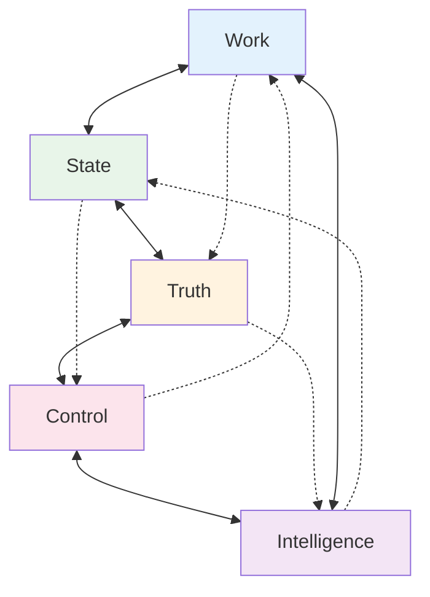

# The 5 Foundational Pillars of Distributed Systems

  
"If laws are the physics constraints, pillars are the engineering challenges they create"

## 🏛 From Laws to Architecture

The 7 laws don't exist in isolation - they interact and compound to create five fundamental challenges that every distributed system must address:

  

    
Asynchrony + Optimization

    
→

    
Work Distribution

  

  
  

    
Failure + Emergence

    
→

    
State Distribution

  

  
  

    
Optimization + Knowledge

    
→

    
Truth Distribution

  

  
  

    
Knowledge + Cognitive Load

    
→

    
Control Distribution

  

  
  

    
Emergence + Economics

    
→

    
Intelligence Distribution

  

## The 5 Pillars Overview

  <a href="../part2-pillars/work/index.md" class="pillar-card pillar-work">
    
⚡

    <h3>Work Distribution</h3>
    
How do we spread computation?

    

      Load balancing
      Task scheduling
      Parallel processing
    

    

      <strong>Key Patterns:</strong> MapReduce, Actor Model, Fork-Join
    

  </a>

  <a href="../part2-pillars/state/index.md" class="pillar-card pillar-state">
    
💾

    <h3>State Distribution</h3>
    
How do we manage distributed data?

    

      Replication
      Partitioning
      Consistency
    

    

      <strong>Key Patterns:</strong> Sharding, Replication, Caching
    

  </a>

  <a href="../part2-pillars/truth/index.md" class="pillar-card pillar-truth">
    
⚖️

    <h3>Truth Distribution</h3>
    
How do we achieve consensus?

    

      Ordering events
      Resolving conflicts
      Maintaining consistency
    

    

      <strong>Key Patterns:</strong> Paxos, Raft, CRDT
    

  </a>

  <a href="../part2-pillars/control/index.md" class="pillar-card pillar-control">
    
🎛️

    <h3>Control Distribution</h3>
    
How do we operate at scale?

    

      Monitoring
      Configuration
      Orchestration
    

    

      <strong>Key Patterns:</strong> Service Mesh, Observability, GitOps
    

  </a>

  <a href="../part2-pillars/intelligence/index.md" class="pillar-card pillar-intelligence">
    
🧠

    <h3>Intelligence Distribution</h3>
    
How do systems adapt and learn?

    

      Auto-scaling
      Self-healing
      Optimization
    

    

      <strong>Key Patterns:</strong> Feedback Loops, ML Operations, Adaptive Systems
    

  </a>

## 🔗 How Pillars Interact

### Key Interactions:
- **Work ↔ State**: Computation needs data, data needs processing
- **State ↔ Truth**: Multiple copies require consensus
- **Truth ↔ Control**: Consensus enables coordination
- **Control ↔ Intelligence**: Monitoring enables adaptation
- **Intelligence ↔ Work**: Learning optimizes distribution

## Pillar Trade-offs Matrix

  <table class="responsive-table">
    <thead>
      <tr>
        <th>Pillar</th>
        <th>Optimize For</th>
        <th>Trade Away</th>
        <th>Example</th>
      </tr>
    </thead>
    <tbody>
      <tr>
        <td data-label="Pillar"><strong>Work</strong></td>
        <td data-label="Optimize For">Throughput</td>
        <td data-label="Trade Away">Latency</td>
        <td data-label="Example">Batch processing</td>
      </tr>
      <tr>
        <td data-label="Pillar"><strong>State</strong></td>
        <td data-label="Optimize For">Availability</td>
        <td data-label="Trade Away">Consistency</td>
        <td data-label="Example">Eventually consistent DB</td>
      </tr>
      <tr>
        <td data-label="Pillar"><strong>Truth</strong></td>
        <td data-label="Optimize For">Consistency</td>
        <td data-label="Trade Away">Availability</td>
        <td data-label="Example">Strongly consistent DB</td>
      </tr>
      <tr>
        <td data-label="Pillar"><strong>Control</strong></td>
        <td data-label="Optimize For">Visibility</td>
        <td data-label="Trade Away">Performance</td>
        <td data-label="Example">Full observability</td>
      </tr>
      <tr>
        <td data-label="Pillar"><strong>Intelligence</strong></td>
        <td data-label="Optimize For">Adaptability</td>
        <td data-label="Trade Away">Predictability</td>
        <td data-label="Example">Auto-scaling systems</td>
      </tr>
    </tbody>
  </table>

## Which Pillar Should You Focus On?

  

    <h4>🚀 Building a New System?</h4>
    
Start with <strong>Work Distribution</strong> - get the computation model right first

  

  
  

    <h4>📊 Handling User Data?</h4>
    
Focus on <strong>State Distribution</strong> - data loss is usually unforgivable

  

  
  

    <h4>💰 Financial/Critical Systems?</h4>
    
Master <strong>Truth Distribution</strong> - consistency errors cost money

  

  
  

    <h4>📈 Scaling Operations?</h4>
    
Invest in <strong>Control Distribution</strong> - can't manage what you can't see

  

  
  

    <h4>🔮 Future-Proofing?</h4>
    
Explore <strong>Intelligence Distribution</strong> - systems that adapt survive

  

## 📚 Learning Paths Through Pillars

### For Different Roles:

  

    <h4>👨‍💻 Backend Engineers</h4>
    <ol>
      <li>Work Distribution (parallelism)</li>
      <li>State Distribution (databases)</li>
      <li>Truth Distribution (consistency)</li>
    </ol>
  

  
  

    <h4>🏗️ Architects</h4>
    <ol>
      <li>Truth Distribution (CAP theorem)</li>
      <li>State Distribution (data models)</li>
      <li>Control Distribution (operations)</li>
    </ol>
  

  
  

    <h4>🚒 SREs</h4>
    <ol>
      <li>Control Distribution (monitoring)</li>
      <li>Intelligence Distribution (automation)</li>
      <li>Work Distribution (capacity)</li>
    </ol>
  

## 🛠 Practical Exercises

Each pillar includes hands-on labs:

  

    <h4>⚡ Load Balancer Lab</h4>
    
Build work distribution algorithms

    <a href="../part2-pillars/work/exercises.md">Start Lab →</a>
  

  
  

    <h4>💾 Replication Lab</h4>
    
Implement state synchronization

    <a href="../part2-pillars/state/exercises.md">Start Lab →</a>
  

  
  

    <h4>⚖️ Consensus Lab</h4>
    
Build a simple Raft implementation

    <a href="../part2-pillars/truth/exercises.md">Start Lab →</a>
  

  
  

    <h4>🎛️ Observability Lab</h4>
    
Create distributed tracing

    <a href="../part2-pillars/control/exercises.md">Start Lab →</a>
  

  
  

    <h4>🧠 Auto-scaling Lab</h4>
    
Build adaptive systems

    <a href="../part2-pillars/intelligence/exercises.md">Start Lab →</a>
  

## Key Insights

  

    <h4>🔄 Pillars Form a Cycle</h4>
    
Work generates State, State needs Truth, Truth requires Control, Control enables Intelligence, Intelligence optimizes Work.

  

  
  

    <h4>⚡ Start Simple</h4>
    
Master one pillar before combining. Complexity emerges from interactions.

  

  
  

    <h4>🎯 No Universal Solution</h4>
    
Each system emphasizes different pillars based on requirements.

  

## Next Steps

  <a href="../part2-pillars/work/index.md" class="primary-cta">
    Explore Work Distribution →
  </a>
  
  

    
Or explore:

    <a href="../axioms/index.md">← Review the 7 Laws</a>
    <a href="../patterns/index.md">See Patterns by Pillar →</a>
    <a href="../case-studies/index.md">Study Pillar Trade-offs →</a>
  

