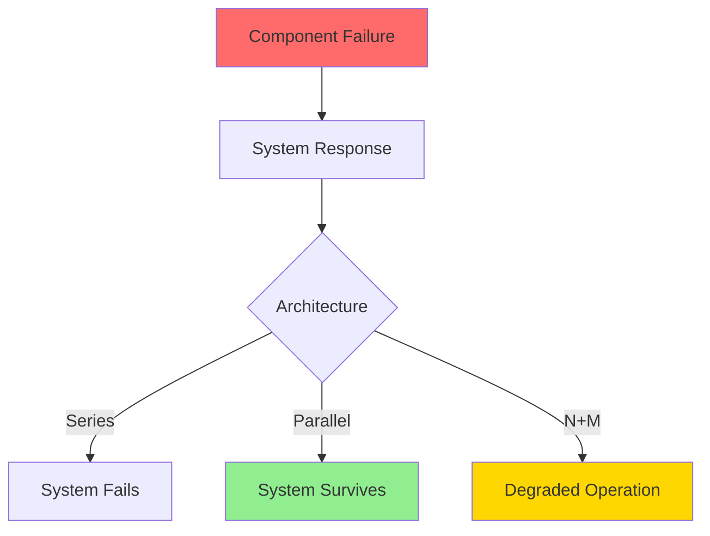
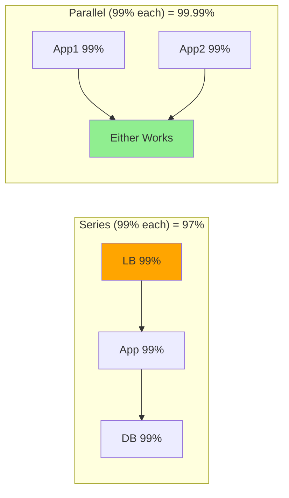
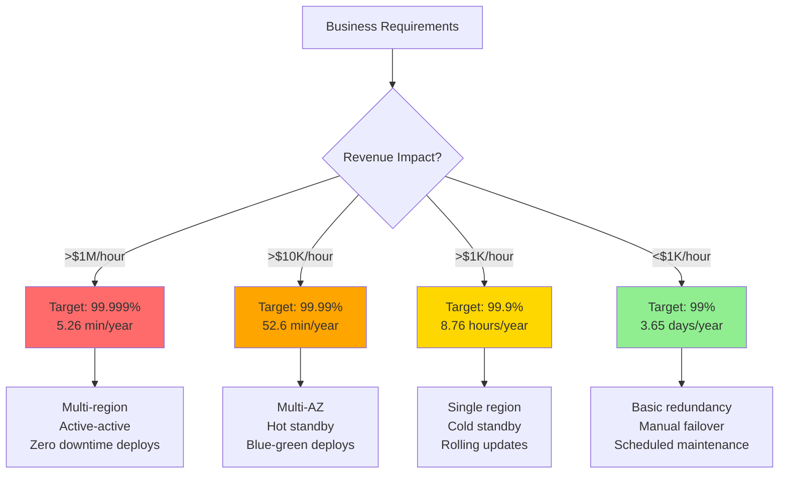
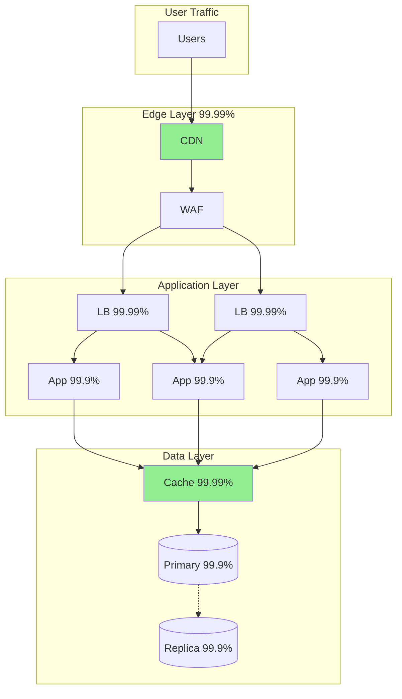
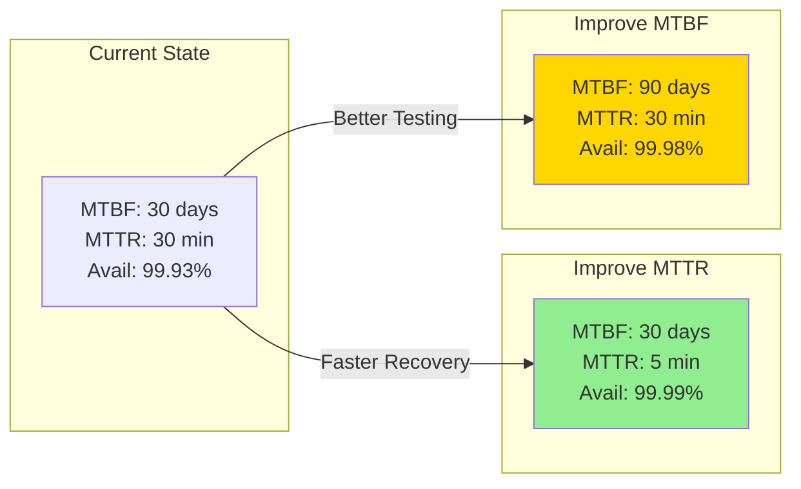
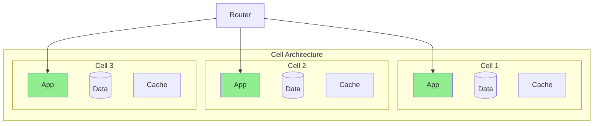

<!-- Navigation -->
[Home](../index.md) → [Part IV: Quantitative](index.md) → **Availability Math & Nines**

# Availability Math & Nines

**Building reliable systems from unreliable parts**

## The Nines

Understanding availability percentages and their real impact:

```python
Availability    Downtime/Year    Downtime/Month    Downtime/Day
-----------    -------------    --------------    ------------
90% (1 nine)    36.5 days       3 days            2.4 hours
99% (2 nines)   3.65 days       7.2 hours         14.4 minutes
99.9% (3 nines) 8.76 hours      43.8 minutes      1.44 minutes
99.99% (4 nines) 52.56 minutes  4.38 minutes      8.64 seconds
99.999% (5 nines) 5.26 minutes  26.3 seconds      0.864 seconds
```

## Availability Calculations

### Series (AND) - Multiply
```text
System works = A works AND B works AND C works
Availability = A × B × C

Example:
Load Balancer (99.99%) → App (99.9%) → Database (99.9%)
System = 0.9999 × 0.999 × 0.999 = 99.79%
```

### Parallel (OR) - Complement
```text
System fails = A fails AND B fails
Availability = 1 - (1-A) × (1-B)

Example:
Two databases (99.9% each) in failover:
System = 1 - (0.001 × 0.001) = 99.9999%
```

### N+M Redundancy

<div class="truth-box">
<h4>📈 N+M Redundancy Formula</h4>

<div style="background: #E3F2FD; padding: 20px; border-radius: 8px; margin: 15px 0;">
  <p><strong>Scenario</strong>: Need N components working, have N+M total</p>
  <p><strong>System fails when</strong>: More than M components fail</p>
  
  <div style="background: white; padding: 15px; border-radius: 5px; margin: 15px 0; font-family: 'Courier New', monospace;">
    <strong>For identical components with availability A:</strong><br><br>
    Availability = Σ<sub>k=0</sub><sup>M</sup> C(N+M,k) × A<sup>(N+M-k)</sup> × (1-A)<sup>k</sup>
  </div>
  
  <div style="margin-top: 15px;">
    <strong>Example: 3+2 Redundancy (Need 3, Have 5)</strong>
    <table style="width: 100%; margin-top: 10px;">
      <tr style="background: #BBDEFB;">
        <th style="padding: 8px;">Component Availability</th>
        <th style="padding: 8px;">System Availability</th>
        <th style="padding: 8px;">Improvement</th>
      </tr>
      <tr>
        <td style="padding: 8px; text-align: center;">90%</td>
        <td style="padding: 8px; text-align: center;">99.14%</td>
        <td style="padding: 8px; text-align: center; color: #4CAF50;">+10x</td>
      </tr>
      <tr style="background: #F5F5F5;">
        <td style="padding: 8px; text-align: center;">99%</td>
        <td style="padding: 8px; text-align: center;">99.999%</td>
        <td style="padding: 8px; text-align: center; color: #4CAF50;">+100x</td>
      </tr>
      <tr>
        <td style="padding: 8px; text-align: center;">99.9%</td>
        <td style="padding: 8px; text-align: center;">99.99999%</td>
        <td style="padding: 8px; text-align: center; color: #4CAF50;">+1000x</td>
      </tr>
    </table>
  </div>
</div>
</div>

## Complex System Modeling

### Active-Active with Load Balancer
```python
     LB (99.99%)
    /           \
App1 (99.9%)  App2 (99.9%)
    \           /
     DB (99.9%)

App tier: 1 - (0.001)² = 99.9999%
Full system: 0.9999 × 0.999999 × 0.999 = 99.89%
```

### Multi-Region Architecture
```python
Region 1                Region 2
LB → Apps → DB         LB → Apps → DB
(99.8%)                (99.8%)

With failover:
System = 1 - (0.002)² = 99.9996%
```

### Microservices Chain
```python
A → B → C → D → E
Each 99.9%

Chain: 0.999⁵ = 99.5%

With circuit breakers and fallbacks:
Can maintain 99.9% overall
```

## Improving Availability

### Strategy Comparison
```python
Approach                Cost    Improvement
--------                ----    -----------
Better hardware         $$     99% → 99.9%
Redundant hardware      $      99% → 99.99%
Multiple regions        $$    99.9% → 99.99%
Reduce dependencies     $       Big impact
Faster recovery         $       Big impact
```

### Redundancy Patterns
```python
Pattern              Formula                     Example
-------              -------                     -------
Simple redundancy    1-(1-A)²                   99% → 99.99%
N+1 redundancy      Complex, see above          99.9% → 99.999%
Geographic redundancy 1-(1-A_region)²            99.9% → 99.999%
```

## Error Budgets

### Calculating Error Budget
```python
SLO: 99.9% availability
Error budget: 0.1% = 43.8 minutes/month

Spending the budget:
- Deployment downtime: 10 min
- Unexpected outage: 20 min
- Remaining: 13.8 min
```

### Error Budget Policy
```python
def can_deploy():
    error_budget_remaining = calculate_remaining_budget()
    deployment_risk = estimate_deployment_risk()

    if error_budget_remaining > deployment_risk * 2:
        return True  # Safe to deploy
    elif error_budget_remaining > 0:
        return needs_approval()  # Risky
    else:
        return False  # Focus on reliability
```

## Real-World Availability

### Cloud Provider SLAs
```proto
Service              SLA      Reality      Your App Max
-------              ---      -------      ------------
AWS EC2              99.99%   99.995%      99.99%
AWS S3               99.99%   99.99%+      99.99%
AWS RDS Multi-AZ     99.95%   99.97%       99.95%
Google GCE           99.99%   99.99%       99.99%
Azure VMs            99.99%   99.98%       99.98%
```

### Building on Cloud
```python
Your app on AWS:
- Your code: 99.9%
- EC2: 99.99%
- ELB: 99.99%
- RDS: 99.95%

Theoretical max: 99.83%
Reality with issues: 99.5-99.7%
```

## MTBF and MTTR

Availability through the lens of failure and recovery:

```python
Availability = MTBF / (MTBF + MTTR)

Where:
MTBF = Mean Time Between Failures
MTTR = Mean Time To Recovery
```

MTTR is directly affected by detection and response latency (see [Latency Ladder](latency-ladder.md)). During recovery, [Little's Law](littles-law.md) helps predict queue buildup.

### Examples
```python
Example 1:
MTBF = 30 days
MTTR = 30 minutes
Availability = 720 hours / 720.5 hours = 99.93%

Example 2: Halving MTTR
New MTTR = 15 minutes
Availability = 720 / 720.25 = 99.97%

Faster recovery is often easier than preventing failures!
```

### Improving MTBF vs MTTR
```python
Improving MTBF:
- Better testing (+10% effort → +20% MTBF)
- Code reviews (+20% effort → +30% MTBF)
- Redundancy (+50% cost → +100% MTBF)

Improving MTTR:
- Better monitoring (+10% effort → -50% MTTR)
- Automated recovery (+20% effort → -80% MTTR)
- Practice runbooks (+5% effort → -30% MTTR)
```

## Availability Patterns

### Failover Time Impact
```python
Failover Time    Monthly Impact    Nines Lost
-------------    --------------    ----------
10 seconds       Negligible        None
1 minute         1-2 incidents     0.1
5 minutes        5-10 incidents    0.5
30 minutes       30-60 incidents   1.0
```

During failover, requests queue up according to [Queueing Theory](queueing-models.md). Understanding this helps size buffers and set appropriate timeouts.

### Partial Availability
```python
System with degraded modes:
- Full functionality: 99.9%
- Degraded (read-only): 99.99%
- Maintenance mode: 99.999%

User-perceived: Much better than binary up/down
```

### Cascading Failures
```proto
Service A (99.9%) depends on B (99.9%) and C (99.9%)

Without circuit breakers:
A = 0.999 × 0.999 × 0.999 = 99.7%

With circuit breakers and fallbacks:
A = 0.999 (degrades gracefully)
```

## Availability Economics

### Cost vs Nines
```python
Nines    Relative Cost    Complexity
-----    -------------    ----------
99%      1x               Simple
99.9%    3x               Moderate
99.99%   10x              High
99.999%  100x             Extreme
```

### ROI of Availability
```bash
E-commerce site:
- Revenue: $10M/year
- Each 0.1% downtime = $10K lost

Investment:
- 99% → 99.9%: $200K
- Saves: $90K/year
- ROI: -55% (not worth it)

- 99.9% → 99.99%: $500K
- Saves: $9K/year
- ROI: -98% (definitely not)

But for $1B/year business: Different story!
```

## Practical Guidelines

### Design for Failure
```python
# Bad: Assume success
result = critical_service.call()
process(result)

# Good: Handle failures
try:
    result = critical_service.call()
except ServiceUnavailable:
    result = use_cache_or_default()
except Timeout:
    result = circuit_breaker.fallback()
process(result)
```

### Measure Component Availability
```python
class AvailabilityTracker:
    def track_request(self, success, component):
        self.requests[component] += 1
        if success:
            self.successes[component] += 1

    def get_availability(self, component):
        return self.successes[component] / self.requests[component]

    def alert_if_degraded(self):
        for component, target_sla in self.slas.items():
            if self.get_availability(component) < target_sla:
                alert(f"{component} below SLA: {availability}")
```

## Axiom Connections

### Axiom 3: Failure is Inevitable


**Key Insight**: Availability math quantifies [Axiom 3: Failure is Inevitable](../part1-axioms/failure/index.md) - we can't prevent failures, but we can design systems that survive them.

### Axiom 2: Finite Capacity
- Redundancy requires 2x resources for high availability
- N+M patterns trade capacity for reliability
- During failures, remaining capacity must handle full load

### Axiom 4: Consistency Has a Cost
```python
# Consistency vs Availability Trade-off
Strong Consistency + Partition = No Availability
High Availability + Partition = Inconsistency
# CAP theorem in action
```

### Axiom 8: Growth Changes Everything
- As systems grow, probability of component failure increases
- More components = more failure modes
- Availability targets become harder to maintain at scale

## Visual Availability Architecture

### Series vs Parallel - Visual Impact



### The Nines Visualization

```dockerfile
99% (2 nines):    ████████████████████░ 3.65 days/year
99.9% (3 nines):  ███████████████████▉░ 8.76 hours/year  
99.99% (4 nines): ████████████████████░ 52.6 minutes/year
99.999% (5 nines):████████████████████░ 5.26 minutes/year

Cost to achieve:  $    $$    $$$    $$$$$$$$
Complexity:       ▂    ▄     ▆      █████████
```

## Decision Framework: Choosing Availability Target



## Real-World Application: E-commerce Platform



### Availability Calculation
```python
# Component Availability
Edge: 0.9999 × 0.9999 = 99.98%
LB Layer: 1 - (0.0001)² = 99.9999%
App Layer: 1 - (0.001)³ = 99.9999%
Cache: 99.99%
DB Layer: 1 - (0.001)² = 99.9999%

# End-to-end (Series)
Total = 0.9998 × 0.999999 × 0.999999 × 0.9999 × 0.999999
      = 99.97% (2.6 hours downtime/year)
```

## MTBF/MTTR Visualization



### Error Budget Dashboard

```dockerfile
Monthly Error Budget: 43.8 minutes (99.9% SLO)

Week 1: ████████░░░░░░░░░░░░ 8.5 min used
Week 2: ████████████░░░░░░░░ 12.3 min used  
Week 3: ██████████████████░░ 18.2 min used
Week 4: ████████████████████ 20.0 min used

Remaining: 4.8 minutes ⚠️
Status: CAUTION - Reduce deployment risk
```

## Advanced Pattern: Cell-Based Architecture



**Availability Impact**:
- Cell failure affects only 1/N of users
- No cascading failures between cells
- Simplified recovery procedures

This architecture pattern is related to [Bulkhead](../patterns/bulkhead.md) and [Cell-Based Architecture](../patterns/cell-based.md) for isolation.

## Key Takeaways

1. **Series multiplies, parallel adds nines** - Architecture matters more than component reliability
2. **Five 9s is extremely expensive** - Most systems don't need it
3. **MTTR often easier to improve than MTBF** - Fast recovery beats perfect prevention
4. **Degraded modes improve perceived availability** - Partial > nothing
5. **Measure actual availability** - SLAs are ceilings, not floors

Remember: Perfect availability is impossible. Design for graceful degradation and fast recovery.

## Related Concepts

- **Quantitative**: [Little's Law](littles-law.md) | [Queueing Theory](queueing-models.md) | [Latency Ladder](latency-ladder.md)
- **Patterns**: [Bulkhead](../patterns/bulkhead.md) | [Circuit Breaker](../patterns/circuit-breaker.md) | [Failover](../patterns/failover.md)
- **Operations**: [SRE Principles](../human-factors/sre-practices.md) | [Chaos Engineering](../human-factors/chaos-engineering.md) | [Incident Response](../human-factors/incident-response.md)
