# Part IV: Quantitative Toolkit

**The math that matters for distributed systems**

## Chapters

<h3>⏱️ Latency & Performance</h3>

<a href="latency-ladder.md" class="quant-card">

🪜

<h4>Latency Ladder 2025</h4>

Know your physics: every operation has a cost

</a>

<a href="littles-law.md" class="quant-card">

📐

<h4>Little's Law Deep-Dive</h4>

The most important equation in systems thinking

</a>

<a href="queueing-models.md" class="quant-card">

📊

<h4>Queueing Theory</h4>

When will your system hit the wall?

</a>

<h3>📈 Scaling Laws</h3>

<a href="amdahl-gustafson.md" class="quant-card">

🔀

<h4>Amdahl & Gustafson Laws</h4>

The limits of parallelization

</a>

<a href="universal-scalability.md" class="quant-card">

🌐

<h4>Universal Scalability Law</h4>

Why systems don't scale linearly

</a>

<h3>💰 Economics & Planning</h3>

<a href="coordination-costs.md" class="quant-card">

🤝

<h4>Coordination Costs</h4>

The hidden tax of distributed systems

</a>

<a href="cache-economics.md" class="quant-card">

💾

<h4>Cache Economics</h4>

When caching saves money

</a>

<a href="availability-math.md" class="quant-card">

✅

<h4>Availability Math</h4>

Building reliable systems from unreliable parts

</a>

<a href="capacity-planning.md" class="quant-card">

📊

<h4>Capacity Planning</h4>

Right-sizing for the future

</a>

<h3>🎯 Practice</h3>

<a href="problem-set.md" class="quant-card">

📝

<h4>Numerical Problem Set</h4>

Practice problems with real-world parameters

</a>

## Key Equations You'll Actually Use

| Concept | Formula | What It Tells You | Real Example |
|---------|---------|------------------|---------------|
| **Little's Law** | L = λW | Items in system = arrival rate × wait time | 1000 users = 100/s × 10s |
| **Utilization** | ρ = λ/μ | How loaded your system is | 80% = danger zone |
| **Queue Length** | L = ρ²/(1-ρ) | Explodes near 100% | At 90%: 81 items waiting |
| **Amdahl's Law** | S = 1/(s + p/n) | Parallel speedup limit | 10% serial = max 10x speedup |
| **Availability** | A = MTBF/(MTBF+MTTR) | Uptime percentage | 99.9% = 43 min/month down |
| **Cost per Request** | $/req = (Fixed + Variable)/QPS | Economics of scale | Drops 10x at 100x volume |

## Your 3-Step Process

```mermaid
graph TD
    subgraph "1. Design Phase"
        D1["Define SLA<br/>(99.9%, <100ms)"] --> D2["Apply Little's Law<br/>(size queues)"]
        D2 --> D3["Check scaling limits<br/>(Amdahl/USL)"]
        D3 --> D4["Validate cost<br/>($X per request)"]
    end
    
    subgraph "2. Debug Phase"
        B1["Measure reality<br/>(p99 = 250ms)"] --> B2["Compare to model<br/>(expected 100ms)"]
        B2 --> B3["Find bottleneck<br/>(DB at 95%)"]
        B3 --> B4["Quantify fix<br/>(shard = 50ms)"]
    end
    
    subgraph "3. Capacity Phase"
        C1["Current baseline<br/>(1K QPS)"] --> C2["Growth projection<br/>(10K in 6mo)"]
        C2 --> C3["Model limits<br/>(breaks at 8K)"]
        C3 --> C4["Plan upgrade<br/>(+3 servers)"]
    end
    
    style D1 fill:#e1f5fe
    style B1 fill:#fee2e2
    style C1 fill:#dcfce7
```

## Quick Decision Guide

| If You're Wondering... | Use This Tool | Quick Answer |
|------------------------|---------------|---------------|
| "How many servers do I need?" | Little's Law | Servers = QPS × ResponseTime |
| "Why is it suddenly slow?" | Queue Theory | Probably hit 80% utilization |
| "Will it scale to 10x?" | Amdahl/USL | Check your serial bottlenecks |
| "How many 9s can I promise?" | Availability Math | 3 replicas = add 2 nines |
| "Is caching worth it?" | Cache Economics | If hit rate > 1 - (cache_cost/db_cost) |
| "When will I run out of capacity?" | Capacity Planning | Draw the curve, find intersection |

## Start Here: The 20% That Gives 80% Value

### 🎯 Must-Know Numbers (Memorize These)

| Operation | Latency | Relative | Real Impact |
|-----------|---------|----------|-------------|
| L1 Cache | 1 ns | 1x | Base reference |
| RAM | 100 ns | 100x | Cache everything possible |
| SSD | 100 μs | 100,000x | Minimize disk I/O |
| Network (same DC) | 500 μs | 500,000x | Batch operations |
| Network (cross-region) | 50 ms | 50,000,000x | Geo-replicate |
| Disk seek | 10 ms | 10,000,000x | Use SSDs |

### 💡 Three Rules That Prevent 90% of Problems

1. **Never exceed 80% utilization** (queues explode exponentially after)
2. **Every 10x scale = new architecture** (what works at 100 QPS fails at 1K)
3. **Measure p99, not average** (average hides disasters)

### 🚀 15-Minute Quick Start

## Next Steps

Part V explores human and operational factors in production. Remember: math gives you the bounds, humans operate within them.

---

## 📚 Complete Quantitative Toolkit Library

### Browse All 47 Quantitative Tools

Below is the complete catalog of all quantitative tools and mathematical models in our library, organized by domain and application.

#### 📏 Fundamental Metrics & Laws

**Core Performance Laws:**
- **[Amdahl & Gustafson Laws](amdahl-gustafson.md)** ⭐ - Parallel speedup limits
- **[Latency Ladder](latency-ladder.md)** ⭐ - Operation cost hierarchy 
- **[Little's Law](littles-law.md)** ⭐ - Fundamental queueing relationship
- **[Universal Scalability Law](universal-scalability.md)** ⭐ - Scaling limitations model

**Reliability & Availability:**
- **[Availability](availability.md)** - System uptime calculations
- **[Availability Math](availability-math.md)** ⭐ - Building reliability from components
- **[Blast Radius](blast-radius.md)** - Failure impact analysis
- **[Failure Models](failure-models.md)** - Types and patterns of failures
- **[MTBF & MTTR](mtbf-mttr.md)** - Mean time metrics
- **[Reliability Engineering](reliability-engineering.md)** - Systematic reliability approach
- **[Reliability Theory](reliability-theory.md)** - Mathematical foundations

#### 🔄 Queueing & Performance Theory

**Queueing Models:**
- **[Queueing Models](queueing-models.md)** ⭐ - M/M/1, M/M/c analysis
- **[Queuing Networks](queuing-networks.md)** - Multi-stage queue systems
- **[Backpressure Math](backpressure-math.md)** - Flow control mathematics

**Performance Analysis:**
- **[Performance Modeling](performance-modeling.md)** - System behavior prediction
- **[Performance Testing](performance-testing.md)** - Load testing methodology
- **[Network Model](network-model.md)** - Network performance analysis
- **[Network Theory](network-theory.md)** - Graph-based network analysis

#### 💾 Storage & Data Theory

**Data Structures & Algorithms:**
- **[Compression](compression.md)** - Data compression theory
- **[Storage Economics](storage-economics.md)** - Cost optimization models
- **[Storage Engines](storage-engines.md)** - Database internals math
- **[Cache Economics](cache-economics.md)** ⭐ - Cache cost-benefit analysis
- **[Collision Probability](collision-probability.md)** - Hash collision mathematics

**Consistency & Coordination:**
- **CAP Theorem (Coming Soon)** ⭐ - Fundamental distributed systems theorem
- **[Consistency Models](consistency-models.md)** ⭐ - Mathematical consistency guarantees
- **[Coordination Costs](coordination-costs.md)** ⭐ - Synchronization overhead

#### 📊 Statistical & Probabilistic Models

**Core Statistics:**
- **[Bayesian Reasoning](bayesian-reasoning.md)** - Probabilistic inference
- **[Information Theory](information-theory.md)** - Entropy and information content
- **[Markov Chains](markov-chains.md)** - State transition models
- **[Power Laws](power-laws.md)** - Scale-free distributions
- **[Probabilistic Structures](probabilistic-structures.md)** - Bloom filters, HyperLogLog
- **[Stochastic Processes](stochastic-processes.md)** - Random process modeling

**Advanced Analytics:**
- **[Time Series](time-series.md)** - Temporal data analysis
- **[Social Networks](social-networks.md)** - Network effect mathematics
- **[Privacy Metrics](privacy-metrics.md)** - Privacy quantification

#### 🗺️ Spatial & Geometric Computing

- **[Comp Geometry](comp-geometry.md)** - Computational geometry basics
- **[Computational Geometry](computational-geometry.md)** - Advanced spatial algorithms
- **[Computer Vision](computer-vision.md)** - Image processing mathematics
- **[Haversine](haversine.md)** - Distance calculations on sphere
- **[Spatial Stats](spatial-stats.md)** - Geographic data analysis

#### 📈 Graph & Network Theory

- **[Graph Models](graph-models.md)** - Graph representation and algorithms
- **[Graph Theory](graph-theory.md)** - Mathematical graph foundations

#### 🔋 Specialized Domain Models

- **[Battery Models](battery-models.md)** - Mobile device power modeling

#### ⏱️ Complexity Analysis

- **[Space Complexity](space-complexity.md)** - Memory usage analysis
- **[Time Complexity](time-complexity.md)** - Algorithm runtime analysis

#### 📐 Planning & Optimization

- **[Capacity Planning](capacity-planning.md)** ⭐ - Resource requirement forecasting

#### 📝 Practice & Application

- **[Problem Set](problem-set.md)** ⭐ - Hands-on practice problems

---

### 📊 Tool Maturity Levels

**⭐ Featured Tools (11):** Complete with:
- Detailed mathematical derivations
- Real-world examples and case studies
- Interactive calculators or code samples
- Common pitfalls and best practices

**📐 Standard Tools (25):** Include:
- Core mathematical concepts
- Basic examples and applications
- Reference formulas

**📋 Specialized Tools (11):** Provide:
- Domain-specific applications
- Advanced mathematical concepts
- Research references

---

### 🔍 Finding the Right Tool

**By Problem Type:**
- **Performance Issues** → Latency Ladder, Little's Law, Queueing Models
- **Scaling Problems** → Universal Scalability Law, Amdahl's Law
- **Reliability Concerns** → Availability Math, MTBF/MTTR, Failure Models
- **Capacity Planning** → Capacity Planning, Performance Modeling
- **Cost Optimization** → Cache Economics, Storage Economics

**By Mathematical Background:**
- **Basic Math** → Latency Ladder, Little's Law, Availability Math
- **Statistics** → Bayesian Reasoning, Markov Chains, Stochastic Processes
- **Advanced Math** → Information Theory, Graph Theory, Computational Geometry

**By System Type:**
- **Distributed Systems** → CAP Theorem, Consistency Models, Coordination Costs
- **Storage Systems** → Storage Engines, Compression, Cache Economics
- **Network Systems** → Network Theory, Queueing Networks
- **Real-time Systems** → Latency Ladder, Performance Modeling

---

### 📚 Learning Paths

**Foundation Path (Essential Mathematics):**
1. [Latency Ladder](latency-ladder.md) - Know your constants
2. [Little's Law](littles-law.md) - Universal flow equation
3. [Queueing Models](queueing-models.md) - Predict system behavior
4. [Availability Math](availability-math.md) - Build reliable systems

**Performance Path:**
1. [Performance Modeling](performance-modeling.md) - Predict behavior
2. [Universal Scalability Law](universal-scalability.md) - Understand limits
3. [Amdahl's Law](amdahl-gustafson.md) - Parallel efficiency
4. [Capacity Planning](capacity-planning.md) - Plan for growth

**Advanced Theory Path:**
1. CAP Theorem (Coming Soon) - Fundamental limits
2. [Information Theory](information-theory.md) - Data fundamentals
3. [Markov Chains](markov-chains.md) - State modeling
4. [Graph Theory](graph-theory.md) - Network analysis

---

### 🧮 Quick Formula Reference

Essential formulas you'll use daily:

- **Little's Law**: L = λW (occupancy = arrival rate × wait time)
- **Utilization**: ρ = λ/μ (arrival rate / service rate)
- **M/M/1 Queue Length**: L = ρ/(1-ρ)
- **Availability**: A = MTBF/(MTBF + MTTR)
- **Amdahl's Speedup**: S = 1/(s + p/n)
- **Distance (Haversine)**: d = 2r·arcsin(√(sin²(Δφ/2) + cos(φ₁)cos(φ₂)sin²(Δλ/2)))
