# Part IV: Quantitative Toolkit

**The math that matters for distributed systems**

## Chapters

## Chapters

### ⏱️ Latency & Performance

- :material-ladder:{ .lg .middle } **[Latency Ladder 2025](quantitative/latency-ladder)**
    
    ---
    
    Know your physics: every operation has a cost
    
    [Learn more →](quantitative/latency-ladder)

- :material-ruler-square:{ .lg .middle } **[Little's Law Deep-Dive](quantitative/littles-law)**
    
    ---
    
    The most important equation in systems thinking
    
    [Learn more →](quantitative/littles-law)

- :material-chart-bar:{ .lg .middle } **[Queueing Theory](quantitative/queueing-models)**
    
    ---
    
    When will your system hit the wall?
    
    [Learn more →](quantitative/queueing-models)

### 📈 Scaling Laws

- :material-arrow-split-vertical:{ .lg .middle } **[Amdahl & Gustafson Laws](quantitative/amdahl-gustafson)**
    
    ---
    
    The limits of parallelization
    
    [Learn more →](quantitative/amdahl-gustafson)

- :material-earth:{ .lg .middle } **[Universal Scalability Law](quantitative/universal-scalability)**
    
    ---
    
    Why systems don't scale linearly
    
    [Learn more →](quantitative/universal-scalability)

### 💰 Economics & Planning

- :material-handshake:{ .lg .middle } **[Coordination Costs](quantitative/coordination-costs)**
    
    ---
    
    The hidden tax of distributed systems
    
    [Learn more →](quantitative/coordination-costs)

- :material-memory:{ .lg .middle } **[Cache Economics](quantitative/cache-economics)**
    
    ---
    
    When caching saves money
    
    [Learn more →](quantitative/cache-economics)

- :material-check-circle:{ .lg .middle } **[Availability Math](quantitative/availability-math)**
    
    ---
    
    Building reliable systems from unreliable parts
    
    [Learn more →](quantitative/availability-math)

- :material-chart-line:{ .lg .middle } **[Capacity Planning](quantitative/capacity-planning)**
    
    ---
    
    Right-sizing for the future
    
    [Learn more →](quantitative/capacity-planning)

### 🎯 Practice

- :material-pencil:{ .lg .middle } **[Numerical Problem Set](quantitative/problem-set)**
    
    ---
    
    Practice problems with real-world parameters
    
    [Learn more →](quantitative/problem-set)

## Key Equations You'll Actually Use

| Concept | Formula | What It Tells You | Real Example |
|---------|---------|------------------|---------------|
| **Little's Law** | L = λW | Items in system = arrival rate × wait time | 1000 users = 100/s × 10s |
| **Utilization** | ρ = λ/μ | How loaded your system is | 80% = danger zone |
| **Queue Length** | L = ρ²/(1-ρ) | Explodes near 100% | At 90%: 81 items waiting |
| **Amdahl's Law** | S = 1/(s + p/n) | Parallel speedup limit | 10% serial = max 10x speedup |
| **Availability** | A = MTBF/(MTBF+MTTR) | Uptime percentage | 99.9% = 43 min/month down |
| **Cost per Request** | $/req = (Fixed + Variable)/QPS | Economics of scale | Drops 10x at 100x volume |

## Your 3-Step Process

```mermaid
graph TD
    subgraph "1. Design Phase"
        D1["Define SLA<br/>(99.9%, <100ms)"] --> D2["Apply Little's Law<br/>(size queues)"]
        D2 --> D3["Check scaling limits<br/>(Amdahl/USL)"]
        D3 --> D4["Validate cost<br/>($X per request)"]
    end
    
    subgraph "2. Debug Phase"
        B1["Measure reality<br/>(p99 = 250ms)"] --> B2["Compare to model<br/>(expected 100ms)"]
        B2 --> B3["Find bottleneck<br/>(DB at 95%)"]
        B3 --> B4["Quantify fix<br/>(shard = 50ms)"]
    end
    
    subgraph "3. Capacity Phase"
        C1["Current baseline<br/>(1K QPS)"] --> C2["Growth projection<br/>(10K in 6mo)"]
        C2 --> C3["Model limits<br/>(breaks at 8K)"]
        C3 --> C4["Plan upgrade<br/>(+3 servers)"]
    end
    
    style D1 fill:#e1f5fe
    style B1 fill:#fee2e2
    style C1 fill:#dcfce7
```

## Quick Decision Guide

| If You're Wondering... | Use This Tool | Quick Answer |
|------------------------|---------------|---------------|
| "How many servers do I need?" | Little's Law | Servers = QPS × ResponseTime |
| "Why is it suddenly slow?" | Queue Theory | Probably hit 80% utilization |
| "Will it scale to 10x?" | Amdahl/USL | Check your serial bottlenecks |
| "How many 9s can I promise?" | Availability Math | 3 replicas = add 2 nines |
| "Is caching worth it?" | Cache Economics | If hit rate > 1 - (cache_cost/db_cost) |
| "When will I run out of capacity?" | Capacity Planning | Draw the curve, find intersection |

## Start Here: The 20% That Gives 80% Value

### Must-Know Numbers (Memorize These)

| Operation | Latency | Relative | Real Impact |
|-----------|---------|----------|-------------|
| L1 Cache | 1 ns | 1x | Base reference |
| RAM | 100 ns | 100x | Cache everything possible |
| SSD | 100 μs | 100,000x | Minimize disk I/O |
| Network (same DC) | 500 μs | 500,000x | Batch operations |
| Network (cross-region) | 50 ms | 50,000,000x | Geo-replicate |
| Disk seek | 10 ms | 10,000,000x | Use SSDs |

### Three Rules That Prevent 90% of Problems

1. **Never exceed 80% utilization** (queues explode exponentially after)
2. **Every 10x scale = new architecture** (what works at 100 QPS fails at 1K)
3. **Measure p99, not average** (average hides disasters)

### 15-Minute Quick Start

## Next Steps

Part V explores human and operational factors in production. Remember: math gives you the bounds, humans operate within them.

---

## 📚 Complete Quantitative Toolkit Library

### Browse All 47 Quantitative Tools

Below is the complete catalog of all quantitative tools and mathematical models in our library, organized by domain and application.

#### 📏 Fundamental Metrics & Laws

**Core Performance Laws:**
- **[Amdahl & Gustafson Laws](quantitative/amdahl-gustafson)** - Parallel speedup limits
- **[Latency Ladder](quantitative/latency-ladder)** - Operation cost hierarchy
- **[Little's Law](quantitative/littles-law)** - Fundamental queueing relationship
- **[Universal Scalability Law](quantitative/universal-scalability)** - Scaling limitations model

**Reliability & Availability:**
- **[Availability](quantitative/availability)** - System uptime calculations
- **[Availability Math](quantitative/availability-math)** - Building reliability from components
- **[Blast Radius](quantitative/blast-radius)** - Failure impact analysis
- **[Failure Models](quantitative/failure-models)** - Types and patterns of failures
- **[MTBF & MTTR](quantitative/mtbf-mttr)** - Mean time metrics
- **[Reliability Engineering](quantitative/reliability-engineering)** - Systematic reliability approach
- **[Reliability Theory](quantitative/reliability-theory)** - Mathematical foundations

#### Queueing & Performance Theory

**Queueing Models:**
- **[Queueing Models](quantitative/queueing-models)** - M/M/1, M/M/c analysis
- **[Queuing Networks](quantitative/queuing-networks)** - Multi-stage queue systems
- **[Backpressure Math](quantitative/backpressure-math)** - Flow control mathematics

**Performance Analysis:**
- **[Performance Modeling](quantitative/performance-modeling)** - System behavior prediction
- **[Performance Testing](quantitative/performance-testing)** - Load testing methodology
- **[Network Model](quantitative/network-model)** - Network performance analysis
- **[Network Theory](quantitative/network-theory)** - Graph-based network analysis

#### 💾 Storage & Data Theory

**Data Structures & Algorithms:**
- **[Compression](quantitative/compression)** - Data compression theory
- **[Storage Economics](quantitative/storage-economics)** - Cost optimization models
- **[Storage Engines](quantitative/storage-engines)** - Database internals math
- **[Cache Economics](quantitative/cache-economics)** - Cache cost-benefit analysis
- **[Collision Probability](quantitative/collision-probability)** - Hash collision mathematics

**Consistency & Coordination:**
- **CAP Theorem (Coming Soon)** - Fundamental distributed systems theorem
- **[Consistency Models](quantitative/consistency-models)** - Mathematical consistency guarantees
- **[Coordination Costs](quantitative/coordination-costs)** - Synchronization overhead

#### Statistical & Probabilistic Models

**Core Statistics:**
- **[Bayesian Reasoning](quantitative/bayesian-reasoning)** - Probabilistic inference
- **[Information Theory](quantitative/information-theory)** - Entropy and information content
- **[Markov Chains](quantitative/markov-chains)** - State transition models
- **[Power Laws](quantitative/power-laws)** - Scale-free distributions
- **[Probabilistic Structures](quantitative/probabilistic-structures)** - Bloom filters, HyperLogLog
- **[Stochastic Processes](quantitative/stochastic-processes)** - Random process modeling

**Advanced Analytics:**
- **[Time Series](quantitative/time-series)** - Temporal data analysis
- **[Social Networks](quantitative/social-networks)** - Network effect mathematics
- **[Privacy Metrics](quantitative/privacy-metrics)** - Privacy quantification

#### 🗺 Spatial & Geometric Computing

- **[Comp Geometry](quantitative/comp-geometry)** - Computational geometry basics
- **[Computational Geometry](quantitative/comp-geometry)** - Advanced spatial algorithms
- **[Computer Vision](quantitative/computer-vision)** - Image processing mathematics
- **[Haversine](quantitative/haversine)** - Distance calculations on sphere
- **[Spatial Stats](quantitative/spatial-stats)** - Geographic data analysis

#### Graph & Network Theory

- **[Graph Models](quantitative/graph-models)** - Graph representation and algorithms
- **[Graph Theory](quantitative/graph-theory)** - Mathematical graph foundations

#### 🔋 Specialized Domain Models

- **[Battery Models](quantitative/battery-models)** - Mobile device power modeling

#### Complexity Analysis

- **[Space Complexity](quantitative/space-complexity)** - Memory usage analysis
- **[Time Complexity](quantitative/time-complexity)** - Algorithm runtime analysis

#### Planning & Optimization

- **[Capacity Planning](quantitative/capacity-planning)** - Resource requirement forecasting

#### Practice & Application

- **[Problem Set](quantitative/problem-set)** - Hands-on practice problems

---

### Tool Maturity Levels

**⭐ Featured Tools (11):** Complete with:
- Detailed mathematical derivations
- Real-world examples and case studies
- Interactive calculators or code samples
- Common pitfalls and best practices

**📐 Standard Tools (25):** Include:
- Core mathematical concepts
- Basic examples and applications
- Reference formulas

**📋 Specialized Tools (11):** Provide:
- Domain-specific applications
- Advanced mathematical concepts
- Research references

---

### Finding the Right Tool

**By Problem Type:**
- **Performance Issues** → Latency Ladder, Little's Law, Queueing Models
- **Scaling Problems** → Universal Scalability Law, Amdahl's Law
- **Reliability Concerns** → Availability Math, MTBF/MTTR, Failure Models
- **Capacity Planning** → Capacity Planning, Performance Modeling
- **Cost Optimization** → Cache Economics, Storage Economics

**By Mathematical Background:**
- **Basic Math** → Latency Ladder, Little's Law, Availability Math
- **Statistics** → Bayesian Reasoning, Markov Chains, Stochastic Processes
- **Advanced Math** → Information Theory, Graph Theory, Computational Geometry

**By System Type:**
- **Distributed Systems** → CAP Theorem, Consistency Models, Coordination Costs
- **Storage Systems** → Storage Engines, Compression, Cache Economics
- **Network Systems** → Network Theory, Queueing Networks
- **Real-time Systems** → Latency Ladder, Performance Modeling

---

### 📚 Learning Paths

**Foundation Path (Essential Mathematics):**
1. [Latency Ladder](quantitative/latency-ladder) - Know your constants
2. [Little's Law](quantitative/littles-law) - Universal flow equation
3. [Queueing Models](quantitative/queueing-models) - Predict system behavior
4. [Availability Math](quantitative/availability-math) - Build reliable systems

**Performance Path:**
1. [Performance Modeling](quantitative/performance-modeling) - Predict behavior
2. [Universal Scalability Law](quantitative/universal-scalability) - Understand limits
3. [Amdahl's Law](quantitative/amdahl-gustafson) - Parallel efficiency
4. [Capacity Planning](quantitative/capacity-planning) - Plan for growth

**Advanced Theory Path:**
1. CAP Theorem (Coming Soon) - Fundamental limits
2. [Information Theory](quantitative/information-theory) - Data fundamentals
3. [Markov Chains](quantitative/markov-chains) - State modeling
4. [Graph Theory](quantitative/graph-theory) - Network analysis

---

### 🧮 Quick Formula Reference

Essential formulas you'll use daily:

- **Little's Law**: L = λW (occupancy = arrival rate × wait time)
- **Utilization**: ρ = λ/μ (arrival rate / service rate)
- **M/M/1 Queue Length**: L = ρ/(1-ρ)
- **Availability**: A = MTBF/(MTBF + MTTR)
- **Amdahl's Speedup**: S = 1/(s + p/n)
- **Distance (Haversine)**: d = 2r·arcsin(√(sin²(Δφ/2) + cos(φ₁)cos(φ₂)sin²(Δλ/2)))