<!-- Navigation -->
[Home](../introduction/index.md) → [Part IV: Quantitative](index.md) → **Latency Ladder 2025**

# Latency Ladder 2025

**Know your physics: Every operation has a cost**

## Fundamental Latency Hierarchy

```
L1 cache reference                0.5 ns      0.5 seconds
Branch mispredict                 5 ns        5 seconds
L2 cache reference                7 ns        7 seconds
Mutex lock/unlock                 25 ns       25 seconds
Main memory reference             100 ns      1.5 minutes
Compress 1KB                      2 μs       33 minutes
Send 1KB over 1 Gbps              10 μs      2.8 hours
Read 4KB random SSD               16 μs      4.4 hours
Read 1MB sequential memory        250 μs     2.9 days
Datacenter round trip             500 μs     5.8 days
Read 1MB from SSD                 1 ms        11.6 days
Disk seek                         10 ms       3.8 months
Read 1MB from disk                20 ms       7.6 months
CA → Netherlands packet           150 ms      4.8 years
```

## 2025 Hardware Update

<div class="law-box">
<h4>🚀 2025 Hardware Evolution</h4>

<table style="width: 100%; border-collapse: collapse;">
<tr style="background: #E8E5F5;">
<th style="padding: 10px; text-align: left; border: 1px solid #D1C4E9;">Operation</th>
<th style="padding: 10px; border: 1px solid #D1C4E9;">Latency</th>
<th style="padding: 10px; border: 1px solid #D1C4E9;">Notes</th>
</tr>
<tr>
<td style="padding: 10px; border: 1px solid #E0E0E0;"><strong>NVMe SSD random read</strong></td>
<td style="padding: 10px; border: 1px solid #E0E0E0; color: #4CAF50;">10 μs</td>
<td style="padding: 10px; border: 1px solid #E0E0E0;">10x faster than 2015</td>
</tr>
<tr style="background: #F5F5F5;">
<td style="padding: 10px; border: 1px solid #E0E0E0;"><strong>Optane persistent memory</strong></td>
<td style="padding: 10px; border: 1px solid #E0E0E0; color: #4CAF50;">100 ns</td>
<td style="padding: 10px; border: 1px solid #E0E0E0;">Between RAM and SSD</td>
</tr>
<tr>
<td style="padding: 10px; border: 1px solid #E0E0E0;"><strong>RDMA network transfer</strong></td>
<td style="padding: 10px; border: 1px solid #E0E0E0; color: #4CAF50;">1-2 μs</td>
<td style="padding: 10px; border: 1px solid #E0E0E0;">Bypass kernel</td>
</tr>
<tr style="background: #F5F5F5;">
<td style="padding: 10px; border: 1px solid #E0E0E0;"><strong>GPU memory transfer</strong></td>
<td style="padding: 10px; border: 1px solid #E0E0E0; color: #FF9800;">10-100 μs</td>
<td style="padding: 10px; border: 1px solid #E0E0E0;">Depends on size</td>
</tr>
<tr>
<td style="padding: 10px; border: 1px solid #E0E0E0;"><strong>5G mobile network latency</strong></td>
<td style="padding: 10px; border: 1px solid #E0E0E0; color: #2196F3;">1-10 ms</td>
<td style="padding: 10px; border: 1px solid #E0E0E0;">10x better than 4G</td>
</tr>
<tr style="background: #F5F5F5;">
<td style="padding: 10px; border: 1px solid #E0E0E0;"><strong>Starlink satellite latency</strong></td>
<td style="padding: 10px; border: 1px solid #E0E0E0; color: #FF5722;">20-40 ms</td>
<td style="padding: 10px; border: 1px solid #E0E0E0;">LEO constellation</td>
</tr>
<tr>
<td style="padding: 10px; border: 1px solid #E0E0E0;"><strong>Cross-region (optimized)</strong></td>
<td style="padding: 10px; border: 1px solid #E0E0E0; color: #FF5722;">30-80 ms</td>
<td style="padding: 10px; border: 1px solid #E0E0E0;">Private backbone</td>
</tr>
<tr style="background: #F5F5F5;">
<td style="padding: 10px; border: 1px solid #E0E0E0;"><strong>Edge compute</strong></td>
<td style="padding: 10px; border: 1px solid #E0E0E0; color: #4CAF50;">&lt;5 ms</td>
<td style="padding: 10px; border: 1px solid #E0E0E0;">Local processing</td>
</tr>
</table>

<div class="progress-visualization" style="margin-top: 20px;">
  <h5 style="margin-bottom: 10px;">Latency Scale Visualization</h5>
  <svg viewBox="0 0 600 120" style="width: 100%;">
    <!-- Log scale bars -->
    <rect x="50" y="20" width="20" height="20" fill="#4CAF50" />
    <text x="75" y="35" font-size="12">ns</text>
    
    <rect x="150" y="20" width="40" height="20" fill="#66BB6A" />
    <text x="195" y="35" font-size="12">μs</text>
    
    <rect x="250" y="20" width="80" height="20" fill="#FFA726" />
    <text x="340" y="35" font-size="12">ms</text>
    
    <rect x="400" y="20" width="160" height="20" fill="#EF5350" />
    <text x="480" y="35" font-size="12">10s of ms</text>
    
    <!-- Labels -->
    <text x="50" y="60" font-size="10">Memory</text>
    <text x="150" y="60" font-size="10">Storage</text>
    <text x="250" y="60" font-size="10">Network</text>
    <text x="400" y="60" font-size="10">WAN</text>
  </svg>
</div>
</div>

## Latency Budget

```
User Perception:
100ms = Instant, 200ms = Fast, 500ms = OK, 1s = Slow, 3s = Bad, 10s = Gone

1000ms Budget Example:
  -50ms Network RTT
  -30ms TLS
  -10ms Infrastructure (LB, Gateway, Mesh)
  -20ms Database
  -5ms Serialization  
  -50ms Response
= 835ms for your logic
```

## Compound Effects

```
Serial: A→B→C = A + B + C
Parallel: A|B|C = MAX(A, B, C)

Percentile multiplication:
99% @ 100ms per service
2 calls = 98% @ 200ms
3 calls = 97% @ 300ms  
10 calls = 90% @ 1000ms!
```

## Industry Targets

```
HFT Trading:    <1 μs     (competitive advantage)
Gaming:         16 ms     (60 FPS)
Video call:     150 ms    (natural conversation)
Web search:     200 ms    (user satisfaction)
E-commerce:     300 ms    (conversion rate)
Streaming:      2 s       (retention)
Email:          5 s       (expectation)
```

## Latency Reduction Strategies

Practical approaches to reduce latency:

<div class="decision-box">
<h4>💡 Latency Reduction Strategies</h4>

<table style="width: 100%; border-collapse: collapse;">
<tr style="background: #E8F5E9;">
<th style="padding: 12px; text-align: left; border: 1px solid #A5D6A7;">Strategy</th>
<th style="padding: 12px; border: 1px solid #A5D6A7;">Typical Improvement</th>
<th style="padding: 12px; border: 1px solid #A5D6A7;">Cost</th>
<th style="padding: 12px; border: 1px solid #A5D6A7;">Implementation</th>
</tr>
<tr>
<td style="padding: 10px; border: 1px solid #E0E0E0;"><strong>Add regional cache</strong></td>
<td style="padding: 10px; border: 1px solid #E0E0E0;">
  <div style="background: #4CAF50; width: 90%; height: 20px; border-radius: 10px;"></div>
  <span>50-90%</span>
</td>
<td style="padding: 10px; border: 1px solid #E0E0E0; color: #4CAF50;">$</td>
<td style="padding: 10px; border: 1px solid #E0E0E0;">Redis, Memcached</td>
</tr>
<tr style="background: #F5F5F5;">
<td style="padding: 10px; border: 1px solid #E0E0E0;"><strong>Use CDN</strong></td>
<td style="padding: 10px; border: 1px solid #E0E0E0;">
  <div style="background: #66BB6A; width: 80%; height: 20px; border-radius: 10px;"></div>
  <span>40-80%</span>
</td>
<td style="padding: 10px; border: 1px solid #E0E0E0; color: #4CAF50;">$</td>
<td style="padding: 10px; border: 1px solid #E0E0E0;">CloudFront, Akamai</td>
</tr>
<tr>
<td style="padding: 10px; border: 1px solid #E0E0E0;"><strong>Optimize queries</strong></td>
<td style="padding: 10px; border: 1px solid #E0E0E0;">
  <div style="background: #81C784; width: 50%; height: 20px; border-radius: 10px;"></div>
  <span>20-50%</span>
</td>
<td style="padding: 10px; border: 1px solid #E0E0E0; color: #4CAF50;">$</td>
<td style="padding: 10px; border: 1px solid #E0E0E0;">Query tuning</td>
</tr>
<tr style="background: #F5F5F5;">
<td style="padding: 10px; border: 1px solid #E0E0E0;"><strong>Add indexes</strong></td>
<td style="padding: 10px; border: 1px solid #E0E0E0;">
  <div style="background: #66BB6A; width: 70%; height: 20px; border-radius: 10px;"></div>
  <span>30-70%</span>
</td>
<td style="padding: 10px; border: 1px solid #E0E0E0; color: #4CAF50;">$</td>
<td style="padding: 10px; border: 1px solid #E0E0E0;">Database indexes</td>
</tr>
<tr>
<td style="padding: 10px; border: 1px solid #E0E0E0;"><strong>Batch operations</strong></td>
<td style="padding: 10px; border: 1px solid #E0E0E0;">
  <div style="background: #66BB6A; width: 60%; height: 20px; border-radius: 10px;"></div>
  <span>40-60%</span>
</td>
<td style="padding: 10px; border: 1px solid #E0E0E0; color: #4CAF50;">$</td>
<td style="padding: 10px; border: 1px solid #E0E0E0;">Code refactor</td>
</tr>
<tr style="background: #F5F5F5;">
<td style="padding: 10px; border: 1px solid #E0E0E0;"><strong>Parallel processing</strong></td>
<td style="padding: 10px; border: 1px solid #E0E0E0;">
  <div style="background: #81C784; width: 50%; height: 20px; border-radius: 10px;"></div>
  <span>30-50%</span>
</td>
<td style="padding: 10px; border: 1px solid #E0E0E0; color: #4CAF50;">$</td>
<td style="padding: 10px; border: 1px solid #E0E0E0;">Async/threads</td>
</tr>
<tr>
<td style="padding: 10px; border: 1px solid #E0E0E0;"><strong>Better algorithms</strong></td>
<td style="padding: 10px; border: 1px solid #E0E0E0;">
  <div style="background: linear-gradient(to right, #A5D6A7 0%, #4CAF50 90%); width: 90%; height: 20px; border-radius: 10px;"></div>
  <span>10-90%</span>
</td>
<td style="padding: 10px; border: 1px solid #E0E0E0; color: #4CAF50;">$</td>
<td style="padding: 10px; border: 1px solid #E0E0E0;">Algorithm research</td>
</tr>
<tr style="background: #F5F5F5;">
<td style="padding: 10px; border: 1px solid #E0E0E0;"><strong>Hardware upgrade</strong></td>
<td style="padding: 10px; border: 1px solid #E0E0E0;">
  <div style="background: #A5D6A7; width: 40%; height: 20px; border-radius: 10px;"></div>
  <span>20-40%</span>
</td>
<td style="padding: 10px; border: 1px solid #E0E0E0; color: #FF9800;">$$</td>
<td style="padding: 10px; border: 1px solid #E0E0E0;">Better servers</td>
</tr>
<tr>
<td style="padding: 10px; border: 1px solid #E0E0E0;"><strong>Protocol optimization</strong></td>
<td style="padding: 10px; border: 1px solid #E0E0E0;">
  <div style="background: #A5D6A7; width: 30%; height: 20px; border-radius: 10px;"></div>
  <span>10-30%</span>
</td>
<td style="padding: 10px; border: 1px solid #E0E0E0; color: #4CAF50;">$</td>
<td style="padding: 10px; border: 1px solid #E0E0E0;">HTTP/3, gRPC</td>
</tr>
<tr style="background: #F5F5F5;">
<td style="padding: 10px; border: 1px solid #E0E0E0;"><strong>Connection pooling</strong></td>
<td style="padding: 10px; border: 1px solid #E0E0E0;">
  <div style="background: #81C784; width: 40%; height: 20px; border-radius: 10px;"></div>
  <span>20-40%</span>
</td>
<td style="padding: 10px; border: 1px solid #E0E0E0; color: #4CAF50;">$</td>
<td style="padding: 10px; border: 1px solid #E0E0E0;">Pool configuration</td>
</tr>
</table>

<div class="key-insight" style="margin-top: 15px;">
💡 <strong>Pro Tip</strong>: Start with caching and query optimization - they offer the best ROI!
</div>
</div>

## Practical Examples

## Example 1: E-commerce Checkout

<div class="truth-box">
<h4>🛍️ E-commerce Checkout Flow</h4>

<div style="background: #E3F2FD; padding: 20px; border-radius: 8px;">
  <div style="text-align: center; margin-bottom: 15px;">
    <strong>User clicks "Buy Now" → Order confirmed</strong>
  </div>
  
  <table style="width: 100%; background: white; border-radius: 5px; margin-bottom: 20px;">
    <tr style="background: #BBDEFB;">
      <th style="padding: 12px; text-align: left;">Step</th>
      <th style="padding: 12px;">Latency</th>
      <th style="padding: 12px;">Type</th>
      <th style="padding: 12px;">Cumulative</th>
    </tr>
    <tr>
      <td style="padding: 10px;">User → CDN edge</td>
      <td style="padding: 10px; text-align: center;">20ms</td>
      <td style="padding: 10px; text-align: center;">Sequential</td>
      <td style="padding: 10px; text-align: center;">20ms</td>
    </tr>
    <tr style="background: #F5F5F5;">
      <td style="padding: 10px;">Edge → Region</td>
      <td style="padding: 10px; text-align: center;">30ms</td>
      <td style="padding: 10px; text-align: center;">Sequential</td>
      <td style="padding: 10px; text-align: center;">50ms</td>
    </tr>
    <tr>
      <td style="padding: 10px;">API Gateway</td>
      <td style="padding: 10px; text-align: center;">5ms</td>
      <td style="padding: 10px; text-align: center;">Sequential</td>
      <td style="padding: 10px; text-align: center;">55ms</td>
    </tr>
    <tr style="background: #F5F5F5;">
      <td style="padding: 10px;">Auth service</td>
      <td style="padding: 10px; text-align: center;">10ms</td>
      <td style="padding: 10px; text-align: center;">Sequential</td>
      <td style="padding: 10px; text-align: center;">65ms</td>
    </tr>
    <tr style="background: #E8F5E9;">
      <td style="padding: 10px;">Inventory check</td>
      <td style="padding: 10px; text-align: center;">15ms</td>
      <td style="padding: 10px; text-align: center; color: #4CAF50;">Parallel</td>
      <td rowspan="2" style="padding: 10px; text-align: center; vertical-align: middle;">165ms</td>
    </tr>
    <tr style="background: #E8F5E9;">
      <td style="padding: 10px;">Payment processing</td>
      <td style="padding: 10px; text-align: center;">100ms</td>
      <td style="padding: 10px; text-align: center; color: #4CAF50;">Parallel</td>
    </tr>
    <tr>
      <td style="padding: 10px;">Order creation</td>
      <td style="padding: 10px; text-align: center;">20ms</td>
      <td style="padding: 10px; text-align: center;">Sequential</td>
      <td style="padding: 10px; text-align: center;">185ms</td>
    </tr>
    <tr style="background: #F5F5F5;">
      <td style="padding: 10px;">Confirmation email</td>
      <td style="padding: 10px; text-align: center;">-</td>
      <td style="padding: 10px; text-align: center; color: #2196F3;">Async</td>
      <td style="padding: 10px; text-align: center;">-</td>
    </tr>
  </table>
  
  <div style="background: #C8E6C9; padding: 15px; border-radius: 5px; text-align: center;">
    <strong style="font-size: 1.2em;">Total Perceived Latency: ~185ms</strong>
    <div style="margin-top: 5px; color: #2E7D32;">Well within 200ms "fast" threshold!</div>
  </div>
</div>
</div>

## Example 2: Real-time Gaming

<div class="failure-vignette">
<h4>🎮 Real-time Gaming Latency</h4>

<div style="background: #FFEBEE; padding: 20px; border-radius: 8px;">
  <div style="text-align: center; margin-bottom: 15px;">
    <strong>Player input → Other players see action</strong>
  </div>
  
  <div style="background: white; padding: 15px; border-radius: 5px; margin-bottom: 20px;">
    <svg viewBox="0 0 600 200" style="width: 100%;">
      <!-- Timeline -->
      <line x1="50" y1="100" x2="550" y2="100" stroke="#333" stroke-width="2"/>
      
      <!-- Input polling -->
      <rect x="50" y="80" width="40" height="40" fill="#2196F3"/>
      <text x="70" y="100" text-anchor="middle" fill="white" font-size="10">8ms</text>
      <text x="70" y="70" text-anchor="middle" font-size="10">Input</text>
      
      <!-- Client to Server -->
      <rect x="90" y="80" width="150" height="40" fill="#FF5722"/>
      <text x="165" y="100" text-anchor="middle" fill="white" font-size="10">30ms</text>
      <text x="165" y="70" text-anchor="middle" font-size="10">Client→Server</text>
      
      <!-- Server processing -->
      <rect x="240" y="80" width="25" height="40" fill="#4CAF50"/>
      <text x="252" y="100" text-anchor="middle" fill="white" font-size="10">5ms</text>
      <text x="252" y="70" text-anchor="middle" font-size="10">Process</text>
      
      <!-- Server to Other clients -->
      <rect x="265" y="80" width="150" height="40" fill="#FF5722"/>
      <text x="340" y="100" text-anchor="middle" fill="white" font-size="10">30ms</text>
      <text x="340" y="70" text-anchor="middle" font-size="10">Server→Clients</text>
      
      <!-- Render -->
      <rect x="415" y="80" width="40" height="40" fill="#2196F3"/>
      <text x="435" y="100" text-anchor="middle" fill="white" font-size="10">8ms</text>
      <text x="435" y="70" text-anchor="middle" font-size="10">Render</text>
      
      <!-- Total indicator -->
      <line x1="50" y1="140" x2="455" y2="140" stroke="#666" stroke-width="2"/>
      <text x="252" y="160" text-anchor="middle" font-weight="bold">Total: 81ms</text>
    </svg>
  </div>
  
  <div style="display: grid; grid-template-columns: 1fr 1fr; gap: 15px;">
    <div style="background: #FFF; padding: 15px; border-radius: 5px; text-align: center;">
      <div style="font-size: 2em; color: #4CAF50;">🎯</div>
      <strong>Latency Budget</strong>
      <div style="font-size: 1.5em; margin: 10px 0;">100ms</div>
      <div style="font-size: 0.9em; color: #666;">Good experience threshold</div>
    </div>
    
    <div style="background: #FFF; padding: 15px; border-radius: 5px; text-align: center;">
      <div style="font-size: 2em; color: #2196F3;">🛡️</div>
      <strong>Safety Margin</strong>
      <div style="font-size: 1.5em; margin: 10px 0;">19ms</div>
      <div style="font-size: 0.9em; color: #666;">Buffer for jitter/spikes</div>
    </div>
  </div>
  
  <div style="margin-top: 15px; background: #FFCDD2; padding: 15px; border-radius: 5px;">
    <strong>⚠️ Warning:</strong> Network jitter can easily consume the 19ms margin. Consider:
    <ul style="margin: 10px 0 0 20px;">
      <li>Client-side prediction</li>
      <li>Lag compensation</li>
      <li>Regional game servers</li>
    </ul>
  </div>
</div>
</div>

## Example 3: Database Query Optimization
```redis
Before: Sequential queries
- Get user: 10ms
- Get orders: 20ms
- Get items per order: 10ms × N
Total: 30ms + 10N ms

After: Batch + parallel
- Get user + orders: 15ms (join)
- Get all items: 15ms (IN clause)
Total: 30ms (constant!)
```

## Law Connections

### Law 2: Asynchronous Reality ⏳


Every operation proves [Law 1](../part1-axioms/law1-failure/index.md) - even L1 cache (0.5ns) > 0.

### Law 4: Trade-offs ⚖️
<div class="failure-vignette">
<h4>📈 Latency Under Load</h4>

<div style="background: #FFF3E0; padding: 20px; border-radius: 8px;">
  <svg viewBox="0 0 600 300" style="width: 100%; max-width: 600px;">
    <!-- Title -->
    <text x="300" y="20" text-anchor="middle" font-weight="bold">Latency vs System Utilization</text>
    
    <!-- Axes -->
    <line x1="50" y1="250" x2="550" y2="250" stroke="#333" stroke-width="2"/>
    <line x1="50" y1="250" x2="50" y2="50" stroke="#333" stroke-width="2"/>
    
    <!-- X-axis labels -->
    <text x="50" y="270" text-anchor="middle" font-size="12">0%</text>
    <text x="150" y="270" text-anchor="middle" font-size="12">25%</text>
    <text x="250" y="270" text-anchor="middle" font-size="12">50%</text>
    <text x="350" y="270" text-anchor="middle" font-size="12">75%</text>
    <text x="450" y="270" text-anchor="middle" font-size="12">90%</text>
    <text x="550" y="270" text-anchor="middle" font-size="12">99%</text>
    <text x="300" y="290" text-anchor="middle" font-size="12">System Utilization</text>
    
    <!-- Y-axis labels -->
    <text x="40" y="250" text-anchor="end" font-size="12">10ms</text>
    <text x="40" y="200" text-anchor="end" font-size="12">100ms</text>
    <text x="40" y="150" text-anchor="end" font-size="12">1s</text>
    <text x="40" y="100" text-anchor="end" font-size="12">10s</text>
    <text x="40" y="50" text-anchor="end" font-size="12">100s</text>
    <text x="20" y="150" text-anchor="middle" font-size="12" transform="rotate(-90 20 150)">Latency</text>
    
    <!-- Exponential curve -->
    <path d="M 50 240 Q 250 240, 350 230 T 450 150 Q 500 100, 550 50" 
          stroke="#FF5722" stroke-width="3" fill="none"/>
    
    <!-- Data points -->
    <circle cx="250" cy="240" r="5" fill="#4CAF50"/>
    <text x="250" y="230" text-anchor="middle" font-size="10">50%: 10ms</text>
    
    <circle cx="450" cy="150" r="5" fill="#FF9800"/>
    <text x="450" y="140" text-anchor="middle" font-size="10">90%: 100ms</text>
    
    <circle cx="550" cy="50" r="5" fill="#F44336"/>
    <text x="480" y="40" text-anchor="middle" font-size="10">99%: 1000ms</text>
    
    <!-- Warning zones -->
    <rect x="350" y="50" width="100" height="200" fill="#FF9800" opacity="0.1"/>
    <text x="400" y="70" text-anchor="middle" font-size="10" fill="#E65100">Danger Zone</text>
    
    <rect x="450" y="50" width="100" height="200" fill="#F44336" opacity="0.2"/>
    <text x="500" y="70" text-anchor="middle" font-size="10" fill="#B71C1C">Critical</text>
  </svg>
</div>

<div class="warning-note" style="margin-top: 15px; background: #FFEBEE; padding: 15px; border-left: 4px solid #F44336;">
⚠️ <strong>Key Insight</strong>: Latency grows exponentially as utilization approaches 100%. Keep systems under 80% utilization for predictable performance!
</div>
</div>

See [Queueing Theory](queueing-models.md): utilization → 100% = latency → ∞

### Law 1: Failure 💥
Timeouts, cascading failures, retry storms from high latency.

### Law 4: Trade-offs ⚖️ (Consistency Trade-off)
Consensus = multiple RTTs. Strong consistency = more hops.

## Visual Latency Comparison

<div class="law-box">
<h4>🕐 Human-Scale Latency Comparison</h4>

<div style="background: #F3E5F5; padding: 20px; border-radius: 8px;">
  <svg viewBox="0 0 700 400" style="width: 100%;">
    <!-- Title -->
    <text x="350" y="30" text-anchor="middle" font-weight="bold" font-size="16">If L1 Cache = 0.5 seconds...</text>
    
    <!-- CPU Operations -->
    <text x="50" y="70" font-weight="bold" fill="#5448C8">CPU Operations</text>
    
    <g transform="translate(50, 80)">
      <!-- L1 Cache -->
      <rect x="0" y="0" width="20" height="20" fill="#4CAF50"/>
      <text x="30" y="15" font-size="12">L1 Cache: 0.5 seconds</text>
      
      <!-- L2 Cache -->
      <rect x="0" y="30" width="140" height="20" fill="#66BB6A"/>
      <text x="150" y="45" font-size="12">L2 Cache: 7 seconds</text>
      
      <!-- Main Memory -->
      <rect x="0" y="60" width="300" height="20" fill="#81C784"/>
      <text x="310" y="75" font-size="12">Main Memory: 1.5 minutes</text>
    </g>
    
    <!-- Storage Operations -->
    <text x="50" y="200" font-weight="bold" fill="#FF5722">Storage Operations</text>
    
    <g transform="translate(50, 210)">
      <!-- SSD Read -->
      <rect x="0" y="0" width="350" height="20" fill="#FFA726"/>
      <text x="360" y="15" font-size="12">SSD Read: 4.4 hours</text>
      
      <!-- Disk Seek -->
      <rect x="0" y="30" width="500" height="20" fill="#FF7043"/>
      <text x="510" y="45" font-size="12">Disk Seek: 3.8 months!</text>
    </g>
    
    <!-- Network Operations -->
    <text x="50" y="320" font-weight="bold" fill="#2196F3">Network Operations</text>
    
    <g transform="translate(50, 330)">
      <!-- Datacenter RTT -->
      <rect x="0" y="0" width="250" height="20" fill="#42A5F5"/>
      <text x="260" y="15" font-size="12">Datacenter RTT: 5.8 days</text>
      
      <!-- Cross-Region -->
      <rect x="0" y="30" width="600" height="20" fill="#1976D2"/>
      <text x="460" y="45" font-size="12" fill="white">Cross-Region: 4.8 YEARS!</text>
    </g>
  </svg>
</div>

<div class="key-insight" style="margin-top: 15px;">
🤯 <strong>Mind-blowing fact</strong>: Cross-region network calls are ~300 million times slower than L1 cache access!
</div>
</div>

## Decision Framework: Choosing Storage Tiers

```mermaid
flowchart TD
    Start[Data Access Pattern?]
    Start --> Hot{Access > 1000/sec?}
    Hot -->|Yes| Memory[Use Memory<br/>100ns latency]
    Hot -->|No| Warm{Access > 10/sec?}
    Warm -->|Yes| SSD[Use SSD<br/>16μs latency]
    Warm -->|No| Cold{Access > 1/hour?}
    Cold -->|Yes| Disk[Use Disk<br/>10ms latency]
    Cold -->|No| Archive[Use Archive<br/>minutes-hours]
    
    style Memory fill:#90EE90
    style SSD fill:#FFD700
    style Disk fill:#FFA500
    style Archive fill:#FF6B6B
```



## Real-World Application: CDN Architecture


## Latency Budget Visualization

```text
Total Budget: 200ms (Fast Experience)
├── Network (User→Edge): 20ms [██████░░░░] 10%
├── TLS Handshake: 30ms      [█████████░] 15%
├── Edge Processing: 5ms      [██░░░░░░░░] 2.5%
├── Cache Check: 2ms          [█░░░░░░░░░] 1%
├── Backend (if miss): 100ms  [██████████] 50%
├── Response Network: 20ms    [██████░░░░] 10%
└── Buffer: 23ms              [███████░░░] 11.5%
```

This budget allocation relates to [Little's Law](littles-law.md) - as latency (W) increases, the number of concurrent requests (L) increases proportionally.

## Key Takeaways

1. **Cache = 200,000x faster than network**
2. **Memory = 100x faster than SSD**
3. **Same-DC = 300x faster than cross-region**
4. **Parallel hides latency** (adds complexity)
5. **Measure actual latencies** (varies)

**Rules**: 1ms (local) | 10ms (datacenter) | 100ms (perception) | 1000ms (patience)

You can't beat physics, but you can work with it.

## Related Concepts

- **Quantitative**: [Little's Law](littles-law.md) | [Queueing Theory](queueing-models.md) | [Availability Math](availability-math.md)
- **Patterns**: [Caching Strategies](../patterns/caching-strategies.md) | [Edge Computing](../patterns/edge-computing.md)
---
