<!-- Navigation -->
[Home](../index.md) → [Part IV: Quantitative](index.md) → **Latency Ladder 2025**

# Latency Ladder 2025

**Know your physics: Every operation has a cost**

## The Fundamental Latency Hierarchy

Understanding latency is crucial for system design. Here's how long common operations take, with human-scale analogies:

```dockerfile
Operation                          Time (ns)     Time (human scale)
---------                          ---------     ------------------
L1 cache reference                      0.5 ns   0.5 seconds
Branch mispredict                       5 ns     5 seconds
L2 cache reference                      7 ns     7 seconds
Mutex lock/unlock                      25 ns     25 seconds
Main memory reference                 100 ns     1.5 minutes
Compress 1KB (Zippy)                2,000 ns     33 minutes
Send 1KB over 1 Gbps               10,000 ns     2.8 hours
Read 4KB random from SSD           16,000 ns     4.4 hours
Read 1MB sequentially from memory 250,000 ns     2.9 days
Round trip within datacenter       500,000 ns     5.8 days
Read 1MB from SSD                1,000,000 ns    11.6 days
Disk seek                        10,000,000 ns    3.8 months
Read 1MB from disk              20,000,000 ns     7.6 months
Send packet CA → Netherlands    150,000,000 ns     4.8 years
```

## 2025 Update: Modern Hardware

Technology evolves, but physics remains constant. Here's what's changed:

```python
Operation                          Latency         Notes
---------                          -------         -----
NVMe SSD random read               10 μs           10x faster than 2015
Optane persistent memory           100 ns          Between RAM and SSD
RDMA network transfer              1-2 μs          Bypass kernel
GPU memory transfer                10-100 μs       Depends on size
5G mobile network latency          1-10 ms         10x better than 4G
Starlink satellite latency         20-40 ms        LEO constellation
Cross-region (optimized path)      30-80 ms        Private backbone
Edge compute                       <5 ms           Local processing
```

## Latency Budget Calculator

Understanding where your milliseconds go:

```proto
User-Perceived Latency Budget:
100ms - Instant
200ms - Fast
500ms - Acceptable
1s    - Noticeable
3s    - Annoying
10s   - User leaves

Backend Budget Breakdown:
Total Budget:           1000 ms
- Network RTT:          -50 ms   (user to edge)
- TLS handshake:        -30 ms   (cached session)
- Load balancer:        -2 ms
- API gateway:          -5 ms
- Service mesh:         -3 ms
- Business logic:       -X ms    (your code)
- Database query:       -20 ms
- Serialization:        -5 ms
- Response network:     -50 ms
= Remaining:            835 ms for your logic
```

## Compound Latency Effects

Latencies combine differently based on architecture:

```proto
Serial Operations (add):
A → B → C = Latency(A) + Latency(B) + Latency(C)

Parallel Operations (max):
A ⟋ B ⟋ C = MAX(Latency(A), Latency(B), Latency(C))

Percentile Multiplication:
If each service is 99% under 100ms
Two serial calls: 98% under 200ms
Three serial calls: 97% under 300ms
Ten serial calls: 90% under 1000ms!
```

## Real-World Latency Targets

Different industries have different requirements:

```redis
Industry            Operation                Target      Why
--------            ---------                ------      ---
HFT Trading         Order execution          <1 μs       Competitive advantage
Gaming              Input to screen          16 ms       60 FPS requirement
Video call          End-to-end audio         150 ms      Natural conversation
Web search          Query to results         200 ms      User satisfaction
E-commerce          Add to cart              300 ms      Conversion rate
Streaming           Start playback           2 s         User retention
Email               Send confirmation        5 s         User expectation
```

## Latency Reduction Strategies

Practical approaches to reduce latency:

```python
Strategy                    Typical Improvement    Cost
--------                    -------------------    ----
Add regional cache          50-90%                 $
Use CDN                     40-80%                 $
Optimize queries            20-50%                 $
Add indexes                 30-70%                 $
Batch operations            40-60%                 $
Parallel processing         30-50%                 $
Better algorithms           10-90%                 $
Hardware upgrade            20-40%                 $$
Protocol optimization       10-30%                 $
Connection pooling          20-40%                 $
```

## Practical Examples

### Example 1: E-commerce Checkout
```python
User clicks "Buy Now" → Order confirmed

Latency breakdown:
- User → CDN edge: 20ms
- Edge → Region: 30ms
- API Gateway: 5ms
- Auth service: 10ms
- Inventory check: 15ms (parallel)
- Payment processing: 100ms (parallel)
- Order creation: 20ms
- Confirmation email: Async
Total: ~200ms perceived
```

### Example 2: Real-time Gaming
```python
Player input → Other players see action

Latency breakdown:
- Input polling: 8ms (120Hz)
- Client → Server: 30ms
- Server processing: 5ms
- Server → Other clients: 30ms
- Render: 8ms
Total: ~81ms

Budget: 100ms for good experience
Margin: 19ms for jitter
```

### Example 3: Database Query Optimization
```redis
Before: Sequential queries
- Get user: 10ms
- Get orders: 20ms
- Get items per order: 10ms × N
Total: 30ms + 10N ms

After: Batch + parallel
- Get user + orders: 15ms (join)
- Get all items: 15ms (IN clause)
Total: 30ms (constant!)
```

## Axiom Connections

Understanding how latency relates to the fundamental axioms:

### Axiom 1: Latency is Non-Zero


**Key Insight**: Every operation shown in the latency ladder proves [Axiom 1](../part1-axioms/latency/index.md). Even L1 cache (0.5ns) has non-zero latency due to electron movement through silicon.

### Axiom 2: Finite Capacity
```python
# Latency increases under load
Base latency: 10ms
At 50% capacity: 10ms
At 90% capacity: 100ms (10x increase!)
At 99% capacity: 1000ms (100x increase!)
```

This exponential growth is explained by [Queueing Theory](queueing-models.md) - as utilization approaches 100%, wait times approach infinity.

### Axiom 3: Failure is Inevitable
- Network timeouts occur when latency exceeds thresholds
- Cascading failures when one slow component backs up the system
- Retry storms when clients assume failure due to high latency

### Axiom 4: Consistency Has a Cost
- Consensus protocols add round-trip latencies
- Strong consistency = multiple network hops
- Eventual consistency trades latency for correctness

## Visual Latency Comparison


## Decision Framework: Choosing Storage Tiers

```mermaid
flowchart TD
    Start[Data Access Pattern?]
    Start --> Hot{Access > 1000/sec?}
    Hot -->|Yes| Memory[Use Memory<br/>100ns latency]
    Hot -->|No| Warm{Access > 10/sec?}
    Warm -->|Yes| SSD[Use SSD<br/>16μs latency]
    Warm -->|No| Cold{Access > 1/hour?}
    Cold -->|Yes| Disk[Use Disk<br/>10ms latency]
    Cold -->|No| Archive[Use Archive<br/>minutes-hours]
    
    style Memory fill:#90EE90
    style SSD fill:#FFD700
    style Disk fill:#FFA500
    style Archive fill:#FF6B6B
```



## Real-World Application: CDN Architecture


### Latency Budget Visualization

```dockerfile
Total Budget: 200ms (Fast Experience)
├── Network (User→Edge): 20ms [██████░░░░] 10%
├── TLS Handshake: 30ms      [█████████░] 15%
├── Edge Processing: 5ms      [██░░░░░░░░] 2.5%
├── Cache Check: 2ms          [█░░░░░░░░░] 1%
├── Backend (if miss): 100ms  [██████████] 50%
├── Response Network: 20ms    [██████░░░░] 10%
└── Buffer: 23ms              [███████░░░] 11.5%
```

This budget allocation relates to [Little's Law](littles-law.md) - as latency (W) increases, the number of concurrent requests (L) increases proportionally.

## Key Takeaways

1. **Cache references are 200,000x faster than network calls** - Design to minimize network hops
2. **Memory is 100x faster than SSD** - Keep hot data in RAM
3. **Same-datacenter is 300x faster than cross-region** - Locality matters
4. **Parallel operations hide latency** - But add complexity
5. **Measure actual latencies** - Hardware varies, networks congest

## Rules of Thumb

- **1ms** - Same machine operation threshold
- **10ms** - Same datacenter threshold
- **100ms** - Human perception threshold
- **1000ms** - User patience threshold

Remember: You can't beat physics, but you can work with it.

## Related Concepts

- **Quantitative**: [Little's Law](littles-law.md) | [Queueing Theory](queueing-models.md) | [Availability Math](availability-math.md)
- **Patterns**: [Caching Strategies](../patterns/caching-strategies.md) | [Edge Computing](../patterns/edge-computing.md)
- **Operations**: [SLO/SLI/SLA](../human-factors/sre-practices.md) | [Performance Monitoring](../human-factors/observability-stacks.md)
---

## 📊 Practical Calculations

### Exercise 1: Basic Application ⭐⭐
**Time**: ~15 minutes
**Objective**: Apply the concepts to a simple scenario

**Scenario**: A web API receives 1,000 requests per second with an average response time of 50ms.

**Calculate**:
1. Apply the concepts from Latency Ladder 2025 to this scenario
2. What happens if response time increases to 200ms?
3. What if request rate doubles to 2,000 RPS?

**Show your work** and explain the practical implications.

### Exercise 2: System Design Math ⭐⭐⭐
**Time**: ~25 minutes
**Objective**: Use quantitative analysis for design decisions

**Problem**: Design capacity for a new service with these requirements:
- Peak load: 50,000 RPS
- 99th percentile latency < 100ms
- 99.9% availability target

**Your Analysis**:
1. Calculate the capacity needed using the principles from Latency Ladder 2025
2. Determine how many servers/instances you need
3. Plan for growth and failure scenarios
4. Estimate costs and resource requirements

### Exercise 3: Performance Debugging ⭐⭐⭐⭐
**Time**: ~20 minutes
**Objective**: Use quantitative methods to diagnose issues

**Case**: Production metrics show:
- Response times increasing over the last week
- Error rate climbing from 0.1% to 2%
- User complaints about slow performance

**Investigation**:
1. What quantitative analysis would you perform first?
2. Apply the concepts to identify potential bottlenecks
3. Calculate the impact of proposed solutions
4. Prioritize fixes based on mathematical impact

---

## 🧮 Mathematical Deep Dive

### Problem Set A: Fundamentals
Work through these step-by-step:

1. **Basic Calculation**: [Specific problem related to the topic]
2. **Real-World Application**: [Industry scenario requiring calculation]
3. **Optimization**: [Finding the optimal point or configuration]

### Problem Set B: Advanced Analysis
For those wanting more challenge:

1. **Multi-Variable Analysis**: [Complex scenario with multiple factors]
2. **Sensitivity Analysis**: [How changes in inputs affect outputs]
3. **Modeling Exercise**: [Build a mathematical model]

---

## 📈 Monitoring & Measurement

**Practical Setup**:
1. What metrics would you collect to validate these calculations?
2. How would you set up alerting based on the thresholds?
3. Create a dashboard to track the key indicators

**Continuous Improvement**:
- How would you use data to refine your calculations?
- What experiments would validate your mathematical models?
- How would you communicate findings to stakeholders?

---
