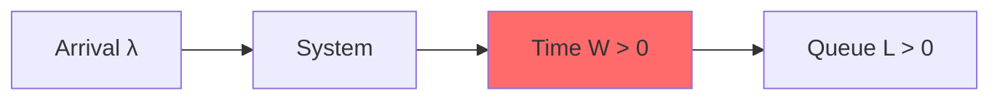
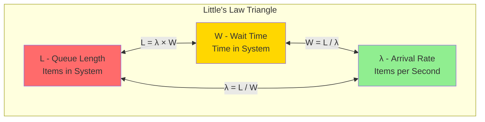
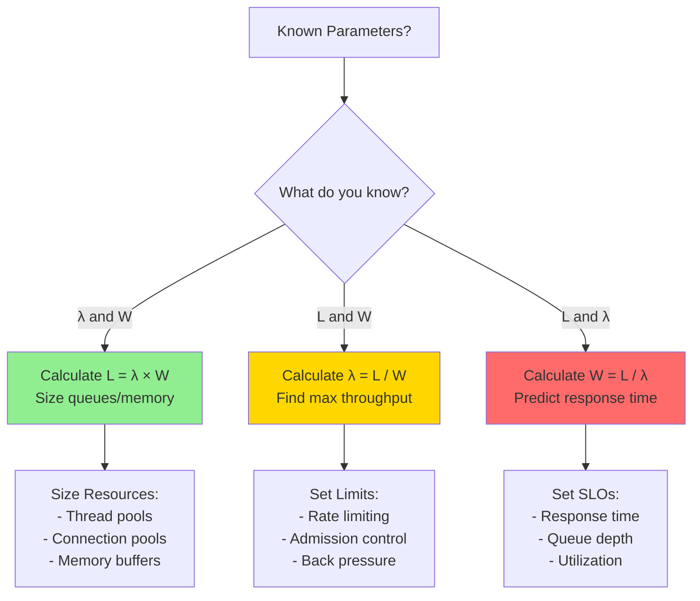
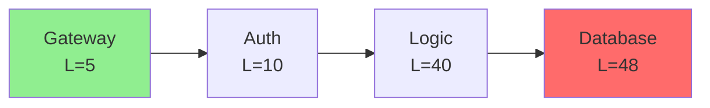
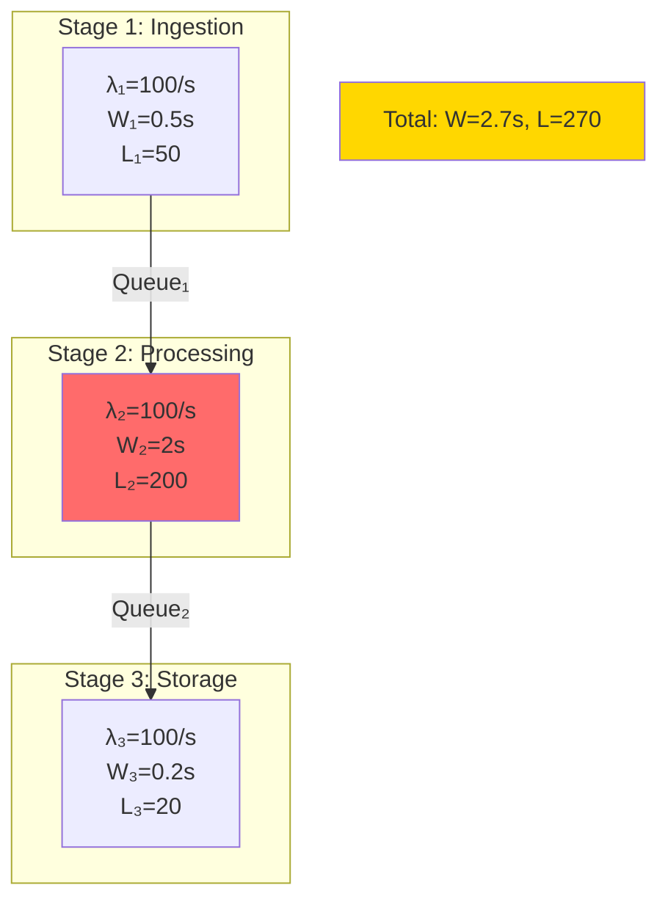

# Little's Law Deep-Dive

**The most important equation in systems thinking**

<div class="law-box">
<h3>📐 Little's Law Formula</h3>

<div class="formula-highlight">
<h2 style="text-align: center; color: #5448C8;">L = λ × W</h2>
</div>

| Variable | Description | Example |
|----------|-------------|------|
| **L** | Average number of items in the system | 10 customers in coffee shop |
| **λ** (lambda) | Average arrival rate | 20 customers/hour |
| **W** | Average time in system | 0.5 hours (30 minutes) |

<div class="key-insight">
💡 <strong>Universal Truth</strong>: This relationship ALWAYS holds for any stable system - no exceptions!
</div>
</div>

## Quick Example

**Coffee shop**: λ=20/hr, W=0.5hr → L=10 customers
(If only 8 seats → 2 standing → bad experience)

!!! info "Real Impact"
    **Amazon (2006)**: 100ms latency = 1% sales loss. Little's Law shows why: higher W → higher L → abandonment
    
    **Twitter (2010)**: λ=3,283 tweets/s × W=5s → L=16,415 tweets queued → Fail Whale

## Applications in Distributed Systems

### 1. Thread Pool Sizing

<div class="decision-box">
<h4>🧵 Thread Pool Calculator</h4>

| Parameter | Value | Unit |
|-----------|-------|------|
| Request rate (λ) | 1,000 | req/s |
| Processing time (W) | 200 | ms |
| Target | No queueing | - |

<div class="calculation-result">
<strong>Required threads = λ × W = 1,000 × 0.2 = 200 threads</strong>
</div>

<div style="margin-top: 10px;">
📊 <em>Visualization: Each thread handles 5 requests/second</em>
</div>
</div>

### 2. Connection Pool Sizing

<div class="decision-box">
<h4>🔌 Connection Pool Calculator</h4>

| Parameter | Value | Unit |
|-----------|-------|------|
| Query rate (λ) | 500 | queries/s |
| Query duration (W) | 50 | ms |
| Safety margin | 20% | - |

<div class="calculation-result">
<strong>Base connections = 500 × 0.05 = 25</strong><br>
<strong>With safety margin = 25 × 1.2 = 30 connections</strong>
</div>

<div class="progress-bar" style="margin-top: 10px;">
<div style="width: 83%; background: #4CAF50; padding: 5px; color: white;">83% utilization at peak</div>
</div>
</div>

### 3. Queue Depth Estimation

<div class="failure-vignette">
<h4>⚠️ Queue Growth Calculator</h4>

| Parameter | Value | Unit |
|-----------|-------|------|
| Message arrival rate | 1,000 | msg/s |
| Processing rate | 800 | msg/s |
| Observation period | 60 | seconds |

<div class="calculation-result">
<strong>Net accumulation = 1,000 - 800 = 200 msg/s</strong><br>
<strong>Queue growth = 200 × 60 = 12,000 messages</strong>
</div>

<div class="warning-banner" style="margin-top: 10px; background: #FFE0B2; padding: 10px; border-left: 4px solid #FF6B6B;">
⚡ <strong>System Overload!</strong> Queue will grow indefinitely - add capacity or implement backpressure
</div>
</div>

### 4. Memory Requirements

<div class="truth-box">
<h4>💾 Memory Sizing Calculator</h4>

| Parameter | Value | Unit |
|-----------|-------|------|
| Request rate (λ) | 100 | req/s |
| Request lifetime (W) | 5 | seconds |
| Memory per request | 10 | MB |

<div class="calculation-result">
<strong>Concurrent requests (L) = 100 × 5 = 500</strong><br>
<strong>Total memory = 500 × 10MB = 5,000MB = 5GB</strong>
</div>

<div class="memory-visualization" style="margin-top: 10px;">
<div style="background: linear-gradient(to right, #2196F3 0%, #2196F3 78%, #E0E0E0 78%); padding: 10px; text-align: center; color: white;">
5GB / 6.4GB Available (78% used)
</div>
</div>
</div>

## Little's Law Variants

<div class="decision-box">
<h4>📐 Three Forms</h4>

- **L = λ × W** (queue length from rate & time)
- **W = L / λ** (response time from queue & rate)
- **λ = L / W** (throughput from queue & time)
</div>

## Real Production Examples

### Netflix Video Encoding Pipeline
<div class="truth-box">
<h4>🎬 Netflix's Real Implementation</h4>

| Parameter | Value | Calculation |
|-----------|-------|-------------|
| Upload rate (λ) | 100 videos/hour | - |
| Encoding time (W) | 2 hours/video | - |
| Videos in process (L) | **200 videos** | = 100 × 2 |
| Videos per server | 4 | - |
| **Minimum servers** | **50** | = 200 ÷ 4 |
| **Actual deployment** | **300+ servers** | 6x for peaks & redundancy |

<div class="insight-banner" style="margin-top: 10px; background: #E8F5E9; padding: 10px; border-left: 4px solid #4CAF50;">
💡 <strong>Key Insight</strong>: Netflix provisions 6x minimum capacity for reliability and traffic spikes
</div>

<div class="capacity-visualization" style="margin-top: 15px; text-align: center;">
<svg viewBox="0 0 600 200" style="width: 100%; max-width: 600px;">
  <!-- Title -->
  <text x="300" y="20" text-anchor="middle" font-weight="bold">Server Capacity Allocation</text>
  
  <!-- Minimum capacity bar -->
  <rect x="50" y="50" width="100" height="30" fill="#FF5722" />
  <text x="100" y="100" text-anchor="middle" font-size="12">Min: 50</text>
  
  <!-- Actual capacity bar -->
  <rect x="50" y="120" width="600" height="30" fill="#4CAF50" />
  <text x="350" y="170" text-anchor="middle" font-size="12">Actual: 300+ (6x safety margin)</text>
  
  <!-- Safety zones -->
  <rect x="150" y="120" width="100" height="30" fill="#FFA726" opacity="0.7" />
  <text x="200" y="140" text-anchor="middle" font-size="10" fill="white">Peak</text>
  
  <rect x="250" y="120" width="200" height="30" fill="#42A5F5" opacity="0.7" />
  <text x="350" y="140" text-anchor="middle" font-size="10" fill="white">Redundancy</text>
  
  <rect x="450" y="120" width="100" height="30" fill="#9C27B0" opacity="0.7" />
  <text x="500" y="140" text-anchor="middle" font-size="10" fill="white">Growth</text>
</svg>
</div>
</div>

### Uber's Driver Matching
<div class="truth-box">
<h4>🚗 Uber's Peak Hour Challenge</h4>

| Metric | Manhattan Peak | Calculation |
|--------|----------------|-------------|
| Ride requests (λ) | 1,000/minute | - |
| Match time (W) | 3 seconds | = 0.05 minutes |
| **Concurrent matches (L)** | **50** | = 1,000 × 0.05 |
| Safety margin | 20% | Industry standard |
| **DB connections needed** | **60** | = 50 × 1.2 |

<div class="performance-meter" style="margin-top: 10px;">
<div style="background: linear-gradient(to right, #FF5722 0%, #FF5722 83%, #E0E0E0 83%); padding: 10px; text-align: center; color: white;">
Connection Pool: 50/60 (83% utilization at peak)
</div>
</div>
</div>

## Practical Calculations

### Microservice Capacity
<div class="decision-box">
<h4>📦 Service Capacity Calculator</h4>

| Constraint | Value | Impact |
|------------|-------|--------|
| CPU cores | 8 | Parallelism limit |
| CPU time per request | 100ms | Processing constraint |
| Target utilization | 70% | Safety margin |

<div class="calculation-steps" style="background: #F5F5F5; padding: 15px; margin: 10px 0; border-radius: 5px;">
<strong>Step 1:</strong> Requests per core = 1000ms ÷ 100ms = 10<br>
<strong>Step 2:</strong> Total capacity = 8 cores × 10 = 80<br>
<strong>Step 3:</strong> Safe capacity = 80 × 0.7 = 56 concurrent<br>
<strong>Result:</strong> Max throughput = 56 ÷ 0.1s = <span style="color: #4CAF50; font-weight: bold;">560 req/s</span>
</div>
</div>

### Database Connection Needs
<div class="law-box">
<h4>🔗 Connection Pool Sizing</h4>

| Component | Value | Calculation |
|-----------|-------|-------------|
| Application servers | 20 | - |
| Requests/server | 50 req/s | - |
| Queries/request | 3 | - |
| Query time | 30ms | - |
| **Total query rate** | **3,000/s** | = 20 × 50 × 3 |
| **Base connections (L)** | **90** | = 3,000 × 0.03 |
| Safety factor | 50% | Best practice |
| **Final pool size** | **135** | = 90 × 1.5 |

<div class="warning-note" style="margin-top: 10px; background: #FFF3E0; padding: 10px; border-left: 4px solid #FF9800;">
⚠️ <strong>Note</strong>: Monitor connection wait times - if >5ms, increase pool size
</div>
</div>

## Little's Law in Practice

### Case Study: Slack's 2021 Outage
<div class="failure-vignette">
<h4>🔥 Slack's Cascade Failure Timeline</h4>

<table style="width: 100%; border-collapse: collapse;">
<tr style="background: #F5F5F5;">
<th style="padding: 10px; text-align: left;">Stage</th>
<th>Metrics</th>
<th>Impact</th>
</tr>
<tr>
<td><strong>1. Normal State</strong></td>
<td>L = 10,000<br>λ = 50,000 req/s<br>W = 0.2s ✓</td>
<td style="color: #4CAF50;">Healthy</td>
</tr>
<tr style="background: #FFF3E0;">
<td><strong>2. DB Slowdown</strong></td>
<td>W → 2s<br>L → 100,000</td>
<td style="color: #FF9800;">10x queue growth!</td>
</tr>
<tr style="background: #FFEBEE;">
<td><strong>3. Thread Exhaustion</strong></td>
<td>Max threads: 50,000<br>Queue: 50,000 waiting</td>
<td style="color: #F44336;">Resources depleted</td>
</tr>
<tr style="background: #FFCDD2;">
<td><strong>4. Cascade Failure</strong></td>
<td>λ → 100,000 req/s<br>(retries double load)</td>
<td style="color: #B71C1C;">Total collapse</td>
</tr>
</table>

<div class="lesson-learned" style="margin-top: 15px; background: #E3F2FD; padding: 15px; border-left: 4px solid #2196F3;">
📊 <strong>Key Lesson</strong>: Monitoring L (queue depth) provides early warning - it grows exponentially before visible failures occur. Set alerts at L > 2x normal.
</div>
</div>

### Debugging Performance Issues
<div class="decision-box">
<h4>🔍 Performance Diagnosis Tool</h4>

<strong>Symptom:</strong> Response times increasing 📈

<div class="diagnostic-steps" style="background: #F5F5F5; padding: 15px; margin: 10px 0; border-radius: 5px;">
<strong>Step 1:</strong> Measure current requests in system (L) = <span style="color: #F44336; font-weight: bold;">500</span><br>
<strong>Step 2:</strong> Measure arrival rate (λ) = <span style="color: #2196F3; font-weight: bold;">100 req/s</span><br>
<strong>Step 3:</strong> Calculate response time W = L/λ = <span style="color: #FF5722; font-weight: bold;">5 seconds</span><br>
<strong>Step 4:</strong> Compare to normal (1 second)
</div>

<div class="diagnosis-result" style="background: #FFEBEE; padding: 15px; border-left: 4px solid #F44336;">
🚨 <strong>Diagnosis:</strong> System is 5x overloaded!<br>
<strong>Action Required:</strong> Reduce load or add capacity immediately
</div>
</div>

### Capacity Planning
<div class="truth-box">
<h4>📈 Growth Planning Calculator</h4>

| Scenario | Current | Future | Required Action |
|----------|---------|---------|----------------|
| Traffic growth | 1x | 2x | Double arrival rate |
| Response time target | Same | Same | Maintain W |
| Current queue (L) | 100 | - | - |
| **Future queue needed** | - | **200** | = 100 × 2 |

<div class="planning-result" style="background: #E8F5E9; padding: 15px; margin-top: 10px; border-radius: 5px;">
🎯 <strong>Capacity Plan:</strong><br>
• Double server instances<br>
• Double thread pools<br>
• Double connection pools<br>
• Linear scaling maintains performance
</div>
</div>

## Common Misconceptions

!!! warning "Pitfalls That Cost Companies Millions"
    **GitHub's 2018 Outage**: Assumed Little's Law didn't apply to distributed locks
    - Lock requests: λ = 10,000/s
    - Lock hold time spiked: W = 30s (from 0.1s)
    - Locks needed: L = 300,000 (system had 65,536 max)
    - Result: 24-hour outage affecting millions

### Misconception 1: Only for Queues
Reality: Applies to ANY system with flow
- Cache entries
- TCP connections
- Database locks
- Memory pages
- User sessions

### Misconception 2: Requires Steady State
Reality: True for long-term average
Use windowed measurements for varying load

### Misconception 3: Simple Systems Only
Reality: Applies to complex systems too
Decompose into subsystems, apply to each

## Advanced Applications

### AWS S3's Upload Pipeline
<div class="law-box">
<h4>☁️ AWS S3 Multi-Stage Analysis</h4>

<div class="pipeline-flow" style="text-align: center; margin: 15px 0;">
<span style="background: #2196F3; color: white; padding: 5px 10px; border-radius: 3px;">Client</span>
 → 
<span style="background: #4CAF50; color: white; padding: 5px 10px; border-radius: 3px;">Edge</span>
 → 
<span style="background: #FF9800; color: white; padding: 5px 10px; border-radius: 3px;">Storage</span>
 → 
<span style="background: #9C27B0; color: white; padding: 5px 10px; border-radius: 3px;">Replication</span>
</div>

| Stage | Queue (L) | Latency (W) | Throughput Capacity |
|-------|-----------|-------------|--------------------|
| Edge Buffer | 1M objects | 100ms | 10M objects/s |
| Storage Write | 500K objects | 200ms | 2.5M objects/s |
| Replication | 2M objects | 500ms | 4M objects/s |
| **Total Pipeline** | - | **800ms** | **2.5M objects/s** |

<div class="insight-note" style="background: #F3E5F5; padding: 10px; margin-top: 10px; border-left: 4px solid #9C27B0;">
🔍 <strong>Bottleneck</strong>: Storage write stage limits overall throughput to 2.5M objects/s
</div>
</div>

### Multi-Stage Systems
<div class="decision-box">
<h4>🔗 Pipeline Formula</h4>

<div style="text-align: center; margin: 15px 0;">
<strong>Pipeline: A → B → C</strong>
</div>

| Stage | Queue Formula | Total Impact |
|-------|---------------|---------------|
| Stage A | L₁ = λ × W₁ | First bottleneck |
| Stage B | L₂ = λ × W₂ | Middle processing |
| Stage C | L₃ = λ × W₃ | Final stage |

<div class="formula-highlight" style="background: #E3F2FD; padding: 15px; margin-top: 10px; text-align: center; border-radius: 5px;">
<strong>Total System Queue:</strong><br>
<span style="font-size: 1.2em; color: #1976D2;">L = λ × (W₁ + W₂ + W₃)</span>
</div>
</div>

### Variable Arrival Rates
<div class="decision-box">
<h4>📈 Traffic Pattern Planning</h4>

| Time Period | Arrival Rate (λ) | Queue Size (L) | Resource Strategy |
|-------------|------------------|----------------|-------------------|
| Peak Hours | 1,000 req/s | 1,000 × W | Full capacity |
| Off Hours | 100 req/s | 100 × W | Scale down 90% |

<div class="scaling-visualization" style="margin-top: 15px;">
<div style="background: #FF5722; width: 100%; padding: 5px; color: white; text-align: center;">Peak: 100% Resources</div>
<div style="background: #4CAF50; width: 10%; padding: 5px; color: white; text-align: center; margin-top: 5px;">Off: 10%</div>
</div>

<div class="cost-insight" style="background: #E8F5E9; padding: 10px; margin-top: 10px; border-left: 4px solid #4CAF50;">
💰 <strong>Cost Optimization</strong>: Auto-scaling can reduce costs by 70% during off-hours
</div>
</div>

### Batch Processing
<div class="law-box">
<h4>📦 Batch Processing Formula</h4>

<div class="formula-box" style="background: #F3E5F5; padding: 15px; margin: 10px 0; border-radius: 5px;">
  <div style="text-align: center; margin-bottom: 15px;">
    <strong>Batch arrivals: N items every T seconds</strong><br>
    <span style="font-size: 1.2em; color: #5448C8;">Effective λ = N/T</span>
  </div>
</div>

<div class="example-calculation" style="background: #F5F5F5; padding: 15px; margin: 15px 0; border-radius: 5px;">
  <strong>Example Calculation:</strong>
  <table style="width: 100%; margin-top: 10px;">
    <tr>
      <td>Batch size (N):</td>
      <td><strong>1000 items</strong></td>
    </tr>
    <tr>
      <td>Batch interval (T):</td>
      <td><strong>10 seconds</strong></td>
    </tr>
    <tr style="background: #E1F5FE;">
      <td>Effective arrival rate (λ):</td>
      <td><strong>100 items/s</strong></td>
    </tr>
    <tr>
      <td>Processing time (W):</td>
      <td><strong>0.5s per item</strong></td>
    </tr>
    <tr style="background: #C8E6C9;">
      <td>Items in system (L):</td>
      <td><strong>50 items</strong></td>
    </tr>
  </table>
</div>

<div class="batch-visualization" style="text-align: center; margin-top: 15px;">
  <svg viewBox="0 0 500 150" style="width: 100%; max-width: 500px;">
    <!-- Timeline -->
    <line x1="50" y1="100" x2="450" y2="100" stroke="#333" stroke-width="2"/>
    
    <!-- Batch arrivals -->
    <g transform="translate(50, 50)">
      <rect x="0" y="0" width="40" height="40" fill="#5448C8" />
      <text x="20" y="25" text-anchor="middle" fill="white" font-size="10">1000</text>
      <text x="20" y="-5" text-anchor="middle" font-size="10">t=0</text>
    </g>
    
    <g transform="translate(150, 50)">
      <rect x="0" y="0" width="40" height="40" fill="#5448C8" />
      <text x="20" y="25" text-anchor="middle" fill="white" font-size="10">1000</text>
      <text x="20" y="-5" text-anchor="middle" font-size="10">t=10s</text>
    </g>
    
    <g transform="translate(250, 50)">
      <rect x="0" y="0" width="40" height="40" fill="#5448C8" />
      <text x="20" y="25" text-anchor="middle" fill="white" font-size="10">1000</text>
      <text x="20" y="-5" text-anchor="middle" font-size="10">t=20s</text>
    </g>
    
    <g transform="translate(350, 50)">
      <rect x="0" y="0" width="40" height="40" fill="#5448C8" />
      <text x="20" y="25" text-anchor="middle" fill="white" font-size="10">1000</text>
      <text x="20" y="-5" text-anchor="middle" font-size="10">t=30s</text>
    </g>
    
    <!-- Average line -->
    <line x1="50" y1="75" x2="450" y2="75" stroke="#4CAF50" stroke-width="2" stroke-dasharray="5,5"/>
    <text x="460" y="80" font-size="10">λ = 100/s</text>
  </svg>
</div>
</div>

## Real-World Examples

### Example 1: API Rate Limiting
<div class="decision-box">
<h4>🚦 API Rate Limit Calculator</h4>

<div class="formula-box" style="background: #E3F2FD; padding: 15px; margin: 10px 0; border-radius: 5px;">
<table style="width: 100%; border-collapse: collapse;">
<tr>
<td style="padding: 5px;"><strong>API Limit:</strong></td>
<td>1000 requests/minute = 16.67 req/s</td>
</tr>
<tr>
<td style="padding: 5px;"><strong>Processing Time:</strong></td>
<td>100ms = 0.1 seconds</td>
</tr>
<tr style="background: #BBDEFB;">
<td style="padding: 5px;"><strong>Concurrent Requests (L):</strong></td>
<td><strong>16.67 × 0.1 = 1.67</strong></td>
</tr>
</table>
</div>

<div class="result-visualization" style="margin-top: 10px; text-align: center;">
<svg viewBox="0 0 400 100" style="width: 100%; max-width: 400px;">
  <text x="200" y="20" text-anchor="middle" font-weight="bold">Thread Requirements</text>
  
  <!-- Thread 1 -->
  <circle cx="150" cy="60" r="30" fill="#4CAF50" />
  <text x="150" y="65" text-anchor="middle" fill="white">Thread 1</text>
  
  <!-- Thread 2 -->
  <circle cx="250" cy="60" r="30" fill="#4CAF50" />
  <text x="250" y="65" text-anchor="middle" fill="white">Thread 2</text>
  
  <!-- Load indicator -->
  <text x="200" y="100" text-anchor="middle" font-size="12">Load: 1.67 / 2.0 threads (83.5%)</text>
</svg>
</div>

<div class="conclusion-note" style="background: #E8F5E9; padding: 10px; margin-top: 10px; border-left: 4px solid #4CAF50;">
✅ <strong>Result:</strong> Can handle with 2 threads at 83.5% utilization
</div>
</div>

### Example 2: Kafka Consumer Sizing
<div class="law-box">
<h4>📊 Kafka Consumer Calculator</h4>

<div class="input-parameters" style="background: #F5F5F5; padding: 15px; margin: 10px 0; border-radius: 5px;">
<table style="width: 100%;">
<tr>
<td><strong>Message Rate (λ):</strong></td>
<td>10,000 msg/s</td>
</tr>
<tr>
<td><strong>Processing Time (W):</strong></td>
<td>50ms = 0.05s</td>
</tr>
<tr>
<td><strong>Target Lag:</strong></td>
<td>&lt; 1000 messages</td>
</tr>
<tr>
<td><strong>Partitions:</strong></td>
<td>10</td>
</tr>
</table>
</div>

<div class="calculation-flow" style="text-align: center; margin: 20px 0;">
<svg viewBox="0 0 600 300" style="width: 100%; max-width: 600px;">
  <!-- Title -->
  <text x="300" y="20" text-anchor="middle" font-weight="bold">Consumer Sizing Calculation</text>
  
  <!-- Step 1 -->
  <rect x="50" y="50" width="200" height="60" fill="#2196F3" rx="5" />
  <text x="150" y="75" text-anchor="middle" fill="white" font-size="12">Total Processing Power</text>
  <text x="150" y="95" text-anchor="middle" fill="white" font-weight="bold">L = 10,000 × 0.05 = 500</text>
  
  <!-- Arrow -->
  <path d="M 250 80 L 350 80" stroke="#333" stroke-width="2" marker-end="url(#arrowhead)" />
  
  <!-- Step 2 -->
  <rect x="350" y="50" width="200" height="60" fill="#4CAF50" rx="5" />
  <text x="450" y="75" text-anchor="middle" fill="white" font-size="12">Per Partition</text>
  <text x="450" y="95" text-anchor="middle" fill="white" font-weight="bold">500 ÷ 10 = 50 consumers</text>
  
  <!-- Partition visualization -->
  <g transform="translate(100, 150)">
    <text x="200" y="0" text-anchor="middle" font-weight="bold">Partition Distribution</text>
    <!-- Draw 10 partitions -->
    <g transform="translate(0, 20)">
      <!-- Partitions -->
      <rect x="0" y="0" width="40" height="80" fill="#FF5722" stroke="#333" />
      <rect x="40" y="0" width="40" height="80" fill="#FF5722" stroke="#333" />
      <rect x="80" y="0" width="40" height="80" fill="#FF5722" stroke="#333" />
      <rect x="120" y="0" width="40" height="80" fill="#FF5722" stroke="#333" />
      <rect x="160" y="0" width="40" height="80" fill="#FF5722" stroke="#333" />
      <rect x="200" y="0" width="40" height="80" fill="#FF5722" stroke="#333" />
      <rect x="240" y="0" width="40" height="80" fill="#FF5722" stroke="#333" />
      <rect x="280" y="0" width="40" height="80" fill="#FF5722" stroke="#333" />
      <rect x="320" y="0" width="40" height="80" fill="#FF5722" stroke="#333" />
      <rect x="360" y="0" width="40" height="80" fill="#FF5722" stroke="#333" />
      
      <!-- Labels -->
      <text x="20" y="50" text-anchor="middle" fill="white" font-size="10">50</text>
      <text x="60" y="50" text-anchor="middle" fill="white" font-size="10">50</text>
      <text x="100" y="50" text-anchor="middle" fill="white" font-size="10">50</text>
      <text x="140" y="50" text-anchor="middle" fill="white" font-size="10">50</text>
      <text x="180" y="50" text-anchor="middle" fill="white" font-size="10">50</text>
      <text x="220" y="50" text-anchor="middle" fill="white" font-size="10">50</text>
      <text x="260" y="50" text-anchor="middle" fill="white" font-size="10">50</text>
      <text x="300" y="50" text-anchor="middle" fill="white" font-size="10">50</text>
      <text x="340" y="50" text-anchor="middle" fill="white" font-size="10">50</text>
      <text x="380" y="50" text-anchor="middle" fill="white" font-size="10">50</text>
    </g>
  </g>
  
  <!-- Arrow marker -->
  <defs>
    <marker id="arrowhead" markerWidth="10" markerHeight="7" refX="9" refY="3.5" orient="auto">
      <polygon points="0 0, 10 3.5, 0 7" fill="#333" />
    </marker>
  </defs>
</svg>
</div>

<div class="summary-box" style="background: #E3F2FD; padding: 15px; margin-top: 10px; border-radius: 5px;">
📋 <strong>Summary:</strong> Need 500 total consumers (50 per partition) to maintain lag &lt; 1000 messages
</div>
</div>

### Example 3: Cache Sizing
<div class="truth-box">
<h4>💾 Cache Memory Calculator</h4>

<div class="parameters-grid" style="display: grid; grid-template-columns: 1fr 1fr; gap: 15px; margin: 15px 0;">
  <div style="background: #F5F5F5; padding: 10px; border-radius: 5px;">
    <strong>Request Rate (λ):</strong><br>1,000 req/s
  </div>
  <div style="background: #F5F5F5; padding: 10px; border-radius: 5px;">
    <strong>Cache TTL (W):</strong><br>300s (5 minutes)
  </div>
  <div style="background: #F5F5F5; padding: 10px; border-radius: 5px;">
    <strong>Unique Keys:</strong><br>20% of requests
  </div>
  <div style="background: #F5F5F5; padding: 10px; border-radius: 5px;">
    <strong>Entry Size:</strong><br>1KB per entry
  </div>
</div>

<div class="calculation-steps" style="background: #E3F2FD; padding: 15px; margin: 15px 0; border-radius: 5px;">
  <div style="text-align: center; margin-bottom: 10px;">
    <strong>Step-by-Step Calculation</strong>
  </div>
  
  <svg viewBox="0 0 500 250" style="width: 100%; max-width: 500px;">
    <!-- Step boxes -->
    <rect x="50" y="20" width="150" height="50" fill="#2196F3" rx="5" />
    <text x="125" y="50" text-anchor="middle" fill="white" font-size="12">1,000 × 0.2 = 200</text>
    <text x="125" y="30" text-anchor="middle" fill="white" font-size="10">Unique keys/s</text>
    
    <path d="M 200 45 L 250 45" stroke="#333" stroke-width="2" marker-end="url(#arrow)" />
    
    <rect x="250" y="20" width="150" height="50" fill="#4CAF50" rx="5" />
    <text x="325" y="50" text-anchor="middle" fill="white" font-size="12">200 × 300 = 60,000</text>
    <text x="325" y="30" text-anchor="middle" fill="white" font-size="10">Total entries</text>
    
    <path d="M 325 70 L 325 100" stroke="#333" stroke-width="2" marker-end="url(#arrow)" />
    
    <rect x="250" y="100" width="150" height="50" fill="#FF5722" rx="5" />
    <text x="325" y="130" text-anchor="middle" fill="white" font-size="12">60,000 × 1KB = 60MB</text>
    <text x="325" y="110" text-anchor="middle" fill="white" font-size="10">Memory needed</text>
    
    <!-- Memory usage visualization -->
    <g transform="translate(50, 180)">
      <rect x="0" y="0" width="400" height="30" fill="#E0E0E0" rx="3" />
      <rect x="0" y="0" width="60" height="30" fill="#4CAF50" rx="3" />
      <text x="200" y="20" text-anchor="middle" font-size="12">60MB / 1GB available (6%)</text>
    </g>
    
    <defs>
      <marker id="arrow" markerWidth="10" markerHeight="7" refX="9" refY="3.5" orient="auto">
        <polygon points="0 0, 10 3.5, 0 7" fill="#333" />
      </marker>
    </defs>
  </svg>
</div>

<div class="insight-note" style="background: #E8F5E9; padding: 10px; margin-top: 10px; border-left: 4px solid #4CAF50;">
💡 <strong>Little's Law Applied:</strong> L (cached items) = λ (unique keys/s) × W (TTL) = 60,000 entries
</div>
</div>

## Law Connections

### Law 2: Asynchronous Reality ⏳


**Key Insight**: Little's Law proves that W (time in system) is never zero, which means L (items in system) is never zero for any non-zero arrival rate. This mathematically validates [Law 2: Asynchronous Reality ⏳](/part1-axioms/law2-asynchrony/).

### Law 4: Trade-offs ⚖️
<div class="failure-vignette">
<h4>⚠️ Capacity Overflow Scenario</h4>

<table style="width: 100%; margin: 10px 0;">
<tr style="background: #F5F5F5;">
<th style="padding: 10px; text-align: left;">Parameter</th>
<th>Value</th>
<th>Result</th>
</tr>
<tr>
<td><strong>System Capacity (Max_L)</strong></td>
<td>1,000 items</td>
<td style="color: #4CAF50;">✓ Limit</td>
</tr>
<tr>
<td><strong>Arrival Rate (λ)</strong></td>
<td>500/s</td>
<td>-</td>
</tr>
<tr>
<td><strong>Wait Time (W)</strong></td>
<td>3 seconds</td>
<td>-</td>
</tr>
<tr style="background: #FFEBEE;">
<td><strong>Calculated Queue (L)</strong></td>
<td>500 × 3 = 1,500</td>
<td style="color: #F44336;">⚠️ OVERFLOW!</td>
</tr>
</table>

<div class="warning-banner" style="margin-top: 10px; background: #FFE0B2; padding: 10px; border-left: 4px solid #FF6B6B;">
⚡ <strong>System Failure</strong>: Queue overflow! Need capacity upgrade or backpressure
</div>
</div>

### Law 4: Trade-offs ⚖️ (Coordination Aspect)
- Little's Law assumes FIFO (First In, First Out) for average calculations
- Different queueing disciplines (LIFO, Priority) change individual wait times
- But the law still holds for averages

### Law 5: Epistemology 🧠
<div class="truth-box">
<h4>📊 Observability Challenge</h4>

<div class="measurement-grid" style="display: grid; grid-template-columns: 1fr 1fr; gap: 15px; margin: 15px 0;">
  <div style="background: #E8F5E9; padding: 15px; border-radius: 5px;">
    <strong>✅ Directly Observable</strong>
    <ul style="margin: 10px 0;">
      <li><strong>L</strong> = count(items_in_system)</li>
      <li><strong>λ</strong> = count(arrivals) / time</li>
    </ul>
  </div>
  <div style="background: #FFEBEE; padding: 15px; border-radius: 5px;">
    <strong>❌ Must Calculate</strong>
    <ul style="margin: 10px 0;">
      <li><strong>W</strong> = L / λ</li>
      <li>Hidden queues obscure true L</li>
    </ul>
  </div>
</div>

<div class="insight-note" style="background: #F3E5F5; padding: 10px; margin-top: 10px; border-left: 4px solid #9C27B0;">
💡 <strong>Key Insight</strong>: Hidden queues (OS buffers, network queues) make true L difficult to measure accurately
</div>
</div>

## Visual Little's Law Dynamics

### The Universal Balance



### System State Visualization

```text
Low Load (λ=10/s, W=0.1s):
Queue: [█░░░░░░░░░] L=1
Flow:  →→→→→→→→→→ Smooth

Medium Load (λ=50/s, W=0.5s):
Queue: [█████░░░░░] L=25  
Flow:  →→→→→→→→→→ Building

High Load (λ=90/s, W=2s):
Queue: [██████████] L=180!
Flow:  →→→→→→→→→→ Backing up

Overload (λ=100/s, W=∞):
Queue: [██████████] L=∞
Flow:  XXXXXXXXXX Collapsed
```

## Decision Framework: Capacity Planning with Little's Law



## Microservice Example



### Resource Calculation
<div class="decision-box">
<h4>🔧 Resource Calculation Summary</h4>

<table style="width: 100%; margin: 15px 0; border-collapse: collapse;">
<tr style="background: #E3F2FD;">
<th style="padding: 10px; text-align: left; border: 1px solid #90CAF9;">Component</th>
<th style="padding: 10px; border: 1px solid #90CAF9;">Thread/Connection Requirements</th>
<th style="padding: 10px; border: 1px solid #90CAF9;">Queue Depth (L)</th>
</tr>
<tr>
<td style="padding: 10px; border: 1px solid #E0E0E0;"><strong>Auth Service</strong></td>
<td style="padding: 10px; border: 1px solid #E0E0E0; text-align: center;">10 threads</td>
<td style="padding: 10px; border: 1px solid #E0E0E0; text-align: center;">L = 10</td>
</tr>
<tr style="background: #F5F5F5;">
<td style="padding: 10px; border: 1px solid #E0E0E0;"><strong>Business Logic</strong></td>
<td style="padding: 10px; border: 1px solid #E0E0E0; text-align: center;">40 threads</td>
<td style="padding: 10px; border: 1px solid #E0E0E0; text-align: center;">L = 40</td>
</tr>
<tr>
<td style="padding: 10px; border: 1px solid #E0E0E0;"><strong>DB Connections</strong></td>
<td style="padding: 10px; border: 1px solid #E0E0E0; text-align: center;">48 connections</td>
<td style="padding: 10px; border: 1px solid #E0E0E0; text-align: center;">L = 48</td>
</tr>
</table>

<div class="memory-calculation" style="background: #E8F5E9; padding: 15px; margin-top: 15px; border-radius: 5px;">
  <h5 style="margin: 0 0 10px 0;">💾 Memory Requirements (1MB per request)</h5>
  <div style="display: flex; align-items: center; gap: 10px;">
    <span>5 + 10 + 40 + 48 =</span>
    <span style="font-size: 1.2em; font-weight: bold; color: #2E7D32;">103MB</span>
    <span>active memory</span>
  </div>
  <div class="memory-bar" style="margin-top: 10px; background: #E0E0E0; height: 30px; border-radius: 15px; overflow: hidden;">
    <div style="width: 10%; background: #4CAF50; height: 100%; float: left;"></div>
    <div style="width: 20%; background: #66BB6A; height: 100%; float: left;"></div>
    <div style="width: 40%; background: #81C784; height: 100%; float: left;"></div>
    <div style="width: 30%; background: #A5D6A7; height: 100%; float: left;"></div>
  </div>
</div>
</div>

## Advanced Visualization: Multi-Stage Pipeline



### Little's Law Dashboard

```text
System Metrics Dashboard
========================
Current State:
├── Arrival Rate (λ): 850 req/s [████████░░] 85%
├── Queue Length (L): 425 items [████████░░] 
├── Response Time (W): 500ms    [█████░░░░░]
└── Health: HEALTHY ✓

Predictions (if λ → 1000/s):
├── New L: 500 items [██████████] ⚠️
├── New W: 500ms (unchanged)
└── Status: NEAR CAPACITY

Recommendations:
• Add 2 more instances (L capacity)
• Enable rate limiting at 950/s
• Set up alerting at L > 450
```

## Connections to Other Concepts

- **[Queueing Models](queueing-models.md)**: L = Lq + Ls, utilization ρ = λ/μ affects W
- **[Latency Ladder](latency-ladder.md)**: W includes all ladder latencies
- **[Availability Math](availability-math.md)**: Failures spike λ (retries), predict cascades
- **Patterns**: Rate limiting controls λ, circuit breakers prevent retry storms

## Key Insights & Pitfalls

**Insights**: Invariant law | Hidden queues exist | Works recursively | Predictive power

**Pitfalls**: Missing OS buffers | Using peak for average | Ignoring slow requests | Retry storms

Remember: Little's Law is like gravity - always there!

## Related Concepts

- **Quantitative**: [Queueing Theory](queueing-models.md) | [Latency Ladder](latency-ladder.md) | [Availability Math](availability-math.md)
- **Patterns**: [Rate Limiting](/patterns/rate-limiting) | [Bulkhead](/patterns/bulkhead) | [Backpressure](/patterns/backpressure)
- **Operations**: [SRE Practices](/human-factors/sre-practices) | [Performance Monitoring](/human-factors/observability-stacks)
