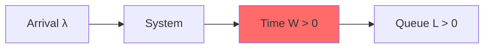
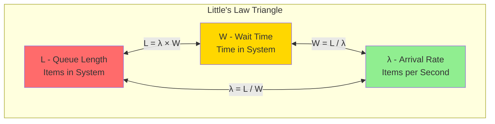
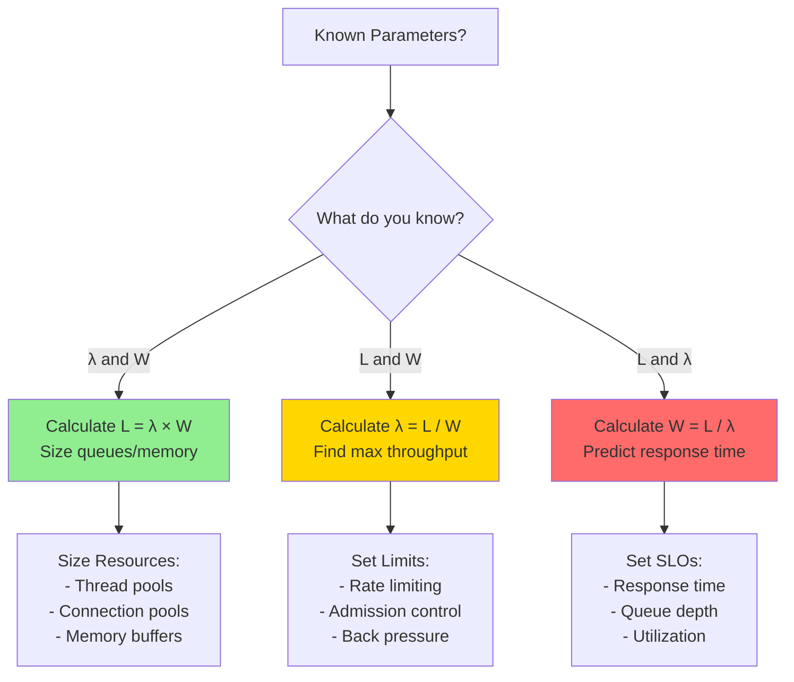
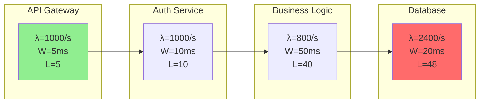
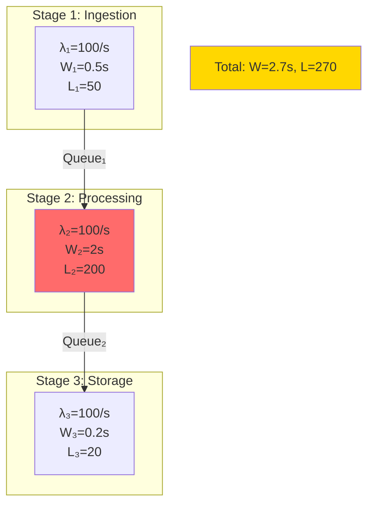

<!-- Navigation -->
[Home](../index.md) → [Part IV: Quantitative](index.md) → **Little's Law Deep-Dive**

# Little's Law Deep-Dive

**The most important equation in systems thinking**

## The Law

Little's Law is deceptively simple yet universally applicable:

```python
L = λ × W

Where:
L = Average number of items in the system
λ = Average arrival rate
W = Average time in system

This ALWAYS holds for stable systems!
```

## Intuitive Understanding

Think of a coffee shop:
- Customers arrive: 20 per hour (λ)
- Each stays: 30 minutes or 0.5 hours (W)
- Customers in shop: L = 20 × 0.5 = 10 people

If the shop has 8 seats → 2 people standing → Bad experience

!!! info "Real-World Impact"
    **Amazon's Discovery**: In 2006, Amazon found every 100ms of latency cost them 1% in sales
    Using Little's Law: If page load W increases by 100ms and λ (visitors) = 100M/day
    Then L (concurrent users waiting) increases proportionally, leading to abandonment

    **Twitter's Fail Whale**: During 2010 World Cup
    - Tweet rate λ = 3,283 tweets/second (peak)
    - Processing time W = 5 seconds (overloaded)
    - Queue depth L = 16,415 tweets backed up
    - Result: The infamous Fail Whale error page

## Applications in Distributed Systems

### 1. Thread Pool Sizing

```python
Given:
- Request rate: 1000 req/s
- Processing time: 200ms
- Target: No queueing

Required threads = 1000 × 0.2 = 200 threads
```

### 2. Connection Pool Sizing

```python
Given:
- Query rate: 500 queries/s
- Query duration: 50ms
- Add 20% safety margin

Pool size = 500 × 0.05 × 1.2 = 30 connections
```

### 3. Queue Depth Estimation

```proto
Given:
- Message rate: 1000 msg/s
- Processing rate: 800 msg/s
- Observation period: 60s

Queue growth = (1000 - 800) × 60 = 12,000 messages
```

### 4. Memory Requirements

```python
Given:
- Request rate: 100 req/s
- Request lifetime: 5s
- Memory per request: 10MB

Memory needed = 100 × 5 × 10MB = 5GB
```

## Little's Law Variants

### Response Time Formula
```python
W = L / λ

Use when you know:
- System occupancy (L)
- Arrival rate (λ)
Need: Response time
```

### Throughput Formula
```python
λ = L / W

Use when you know:
- Queue length (L)
- Processing time (W)
Need: Maximum throughput
```

## Real Production Examples

### Netflix Video Encoding Pipeline
```python
Scenario: Netflix processes uploads for streaming
- Upload rate: λ = 100 videos/hour
- Encoding time: W = 2 hours per video
- Encoding servers needed: L = 100 × 2 = 200 videos in process

If each server handles 4 videos: 200/4 = 50 servers required
Actual Netflix: Uses 300+ servers for redundancy and peak loads
```

### Uber's Driver Matching
```python
Peak hour in Manhattan:
- Ride requests: λ = 1,000 requests/minute
- Match time: W = 3 seconds = 0.05 minutes
- Concurrent matches: L = 1,000 × 0.05 = 50 matches in progress

Database connections needed = 50 × 1.2 (safety) = 60 connections
```

## Practical Calculations

### Microservice Capacity
```proto
Service constraints:
- CPU cores: 8
- Time per request: 100ms CPU
- Target utilization: 70%

Max concurrent requests = 8 cores × (1000ms/100ms) × 0.7 = 56
Max throughput = 56 / 0.1s = 560 req/s
```

### Database Connection Needs
```python
Application servers: 20
Requests per server: 50 req/s
Query time: 30ms
Queries per request: 3

Total query rate = 20 × 50 × 3 = 3000 queries/s
Connections needed = 3000 × 0.03 = 90 connections
Add safety: 90 × 1.5 = 135 connections
```

## Little's Law in Practice

### Case Study: Slack's 2021 Outage
```python
Incident Timeline:
1. Normal state: L = 10,000 concurrent requests, λ = 50,000 req/s
   W = 10,000 / 50,000 = 0.2s (200ms) ✓

2. Database slowdown begins: W increases to 2s
   New L = 50,000 × 2 = 100,000 concurrent requests

3. Thread pool exhaustion at 50,000 threads
   Queue backup: 50,000 requests waiting

4. Cascading failure as timeouts trigger retries
   Effective λ doubles to 100,000 req/s
   System collapses

Lesson: Monitor L continuously - it predicts collapse before it happens
```

### Debugging Performance Issues
```python
Symptom: Response times increasing

Measure:
1. Current requests in system (L) = 500
2. Arrival rate (λ) = 100 req/s
3. Calculate W = 500/100 = 5 seconds

If normal W = 1 second → System is 5x overloaded
```

### Capacity Planning
```python
Future state:
- Expected traffic: 2x current
- Same response time target
- Current L = 100

New L needed = 100 × 2 = 200
Need to double resources (servers, threads, connections)
```

## Common Misconceptions

!!! warning "Pitfalls That Cost Companies Millions"
    **GitHub's 2018 Outage**: Assumed Little's Law didn't apply to distributed locks
    - Lock requests: λ = 10,000/s
    - Lock hold time spiked: W = 30s (from 0.1s)
    - Locks needed: L = 300,000 (system had 65,536 max)
    - Result: 24-hour outage affecting millions

### Misconception 1: Only for Queues
Reality: Applies to ANY system with flow
- Cache entries
- TCP connections
- Database locks
- Memory pages
- User sessions

### Misconception 2: Requires Steady State
Reality: True for long-term average
Use windowed measurements for varying load

### Misconception 3: Simple Systems Only
Reality: Applies to complex systems too
Decompose into subsystems, apply to each

## Advanced Applications

### AWS S3's Upload Pipeline
```python
Real multi-stage system:
Client → Edge → Storage Layer → Replication

Stage measurements:
- Edge buffer: L₁ = 1M objects, W₁ = 100ms
- Storage write: L₂ = 500K objects, W₂ = 200ms
- Replication: L₃ = 2M objects, W₃ = 500ms

Total latency: W = 100 + 200 + 500 = 800ms
Throughput: λ = L₁/W₁ = 10M objects/second capacity
```

### Multi-Stage Systems
```python
Pipeline: A → B → C

For each stage:
L₁ = λ × W₁
L₂ = λ × W₂
L₃ = λ × W₃

Total: L = λ × (W₁ + W₂ + W₃)
```

### Variable Arrival Rates
```python
Peak hours: λ_peak = 1000 req/s
Off hours: λ_off = 100 req/s

Size for peak:
L_peak = 1000 × W
L_off = 100 × W

Resources needed for peak, can scale down off-hours
```

### Batch Processing
```text
Batch arrivals: N items every T seconds
Effective λ = N/T

Example:
1000 items every 10 seconds
λ = 100 items/s
If W = 0.5s per item
L = 50 items in system
```

## Real-World Examples

### Example 1: API Rate Limiting
```python
API limit: 1000 requests/minute
Processing time: 100ms

Concurrent requests = (1000/60) × 0.1 = 1.67
Can handle with 2 threads
```

### Example 2: Kafka Consumer Sizing
```proto
Message rate: 10,000 msg/s
Processing time: 50ms/msg
Target lag: < 1000 messages

Consumers needed = 10,000 × 0.05 = 500
With 10 partitions: 50 consumers per partition
```

### Example 3: Cache Sizing
```python
Request rate: 1000 req/s
Cache TTL: 300s (5 minutes)
Unique keys: 20% of requests

Cached items = 1000 × 0.2 × 300 = 60,000 entries
At 1KB per entry: 60MB cache needed
```

## Axiom Connections

### Axiom 1: Latency is Non-Zero


**Key Insight**: Little's Law proves that W (time in system) is never zero, which means L (items in system) is never zero for any non-zero arrival rate. This mathematically validates [Axiom 1: Latency is Non-Zero](../part1-axioms/latency/index.md).

### Axiom 2: Finite Capacity
```python
# When L exceeds system capacity
Max_L = 1000  # System limit
λ = 500/s, W = 3s
L = 500 × 3 = 1500 > Max_L
# System fails - queue overflow!
```

### Axiom 5: Time and Order
- Little's Law assumes FIFO (First In, First Out) for average calculations
- Different queueing disciplines (LIFO, Priority) change individual wait times
- But the law still holds for averages

### Axiom 7: Observability is Limited
```python
# What we can measure
L = count(items_in_system)  # Observable
λ = count(arrivals) / time  # Observable
W = ?  # Must calculate from L/λ

# Hidden queues make true L hard to measure
```

## Visual Little's Law Dynamics

### The Universal Balance



### System State Visualization

```dockerfile
Low Load (λ=10/s, W=0.1s):
Queue: [█░░░░░░░░░] L=1
Flow:  →→→→→→→→→→ Smooth

Medium Load (λ=50/s, W=0.5s):
Queue: [█████░░░░░] L=25  
Flow:  →→→→→→→→→→ Building

High Load (λ=90/s, W=2s):
Queue: [██████████] L=180!
Flow:  →→→→→→→→→→ Backing up

Overload (λ=100/s, W=∞):
Queue: [██████████] L=∞
Flow:  XXXXXXXXXX Collapsed
```

## Decision Framework: Capacity Planning with Little's Law



## Real-World Application: Microservice Architecture



### Resource Calculation
```python
# Thread Pool Sizing
Auth Service: 10 threads (L=10)
Business Logic: 40 threads (L=40)
DB Connections: 48 connections (L=48)

# Memory Requirements (1MB per request)
Total Memory = 5 + 10 + 40 + 48 = 103MB active
```

## Advanced Visualization: Multi-Stage Pipeline



### Little's Law Dashboard

```dockerfile
System Metrics Dashboard
========================
Current State:
├── Arrival Rate (λ): 850 req/s [████████░░] 85%
├── Queue Length (L): 425 items [████████░░] 
├── Response Time (W): 500ms    [█████░░░░░]
└── Health: HEALTHY ✓

Predictions (if λ → 1000/s):
├── New L: 500 items [██████████] ⚠️
├── New W: 500ms (unchanged)
└── Status: NEAR CAPACITY

Recommendations:
• Add 2 more instances (L capacity)
• Enable rate limiting at 950/s
• Set up alerting at L > 450
```

## Integration with Other Concepts

### Connection to [Queueing Models](queueing-models.md)
- Little's Law provides the foundation for M/M/1 analysis
- L in Little's Law = Lq + Ls in queueing theory
- Utilization ρ = λ/μ affects W, thus affecting L

### Connection to [Latency Ladder](latency-ladder.md)
- W includes all latencies in the ladder
- Network latency, processing time, queue wait all contribute to W
- Use latency ladder to estimate W, then calculate L

### Connection to [Availability Math](availability-math.md)
- During failures, λ may spike (retries)
- Increased W during degradation increases L
- Can predict cascade failures using Little's Law

### Connection to Patterns
- [Rate Limiting](../patterns/rate-limiting.md) controls λ to keep L manageable
- [Bulkhead](../patterns/bulkhead.md) isolates L to prevent system-wide impact
- [Circuit Breaker](../patterns/circuit-breaker.md) prevents λ spikes during failures

## Key Insights

1. **Little's Law is invariant** - It always holds, no exceptions
2. **Measure, don't guess** - Real systems have hidden queues
3. **Applied recursively** - Works at every level of abstraction
4. **Predictive power** - Change one variable, predict the others
5. **Debugging tool** - Quickly identify system overload

## Common Pitfalls

1. **Forgetting hidden queues** - OS buffers, network queues
2. **Using peak λ for average sizing** - Wastes resources
3. **Ignoring W variations** - Slow requests dominate
4. **Not accounting for failures** - Retries increase λ
5. **Missing feedback loops** - High L can increase W

Remember: Little's Law is like gravity - it's always there, whether you account for it or not!

## Related Concepts

- **Quantitative**: [Queueing Theory](queueing-models.md) | [Latency Ladder](latency-ladder.md) | [Availability Math](availability-math.md)
- **Patterns**: [Rate Limiting](../patterns/rate-limiting.md) | [Bulkhead](../patterns/bulkhead.md) | [Backpressure](../patterns/backpressure.md)
- **Operations**: [Capacity Planning](../human-factors/capacity-planning.md) | [Performance Monitoring](../human-factors/observability.md)
