<!-- Navigation -->
[Home](../introduction/index.md) → [Quantitative](index.md) → **Performance Modeling**

# Performance Modeling for Distributed Systems

<div class="law-box">
<h3>🎯 Core Principle</h3>
Performance models help predict system behavior under various conditions, enabling data-driven capacity planning and optimization decisions before problems occur in production.
</div>

## Visual Performance Modeling Framework


## Fundamental Performance Equations

### 1. Response Time Breakdown

<div class="formula-box">
<h4>R = W + S</h4>
<table class="formula-table">
<tr><td><strong>R</strong></td><td>Response time (total)</td></tr>
<tr><td><strong>W</strong></td><td>Wait time (queueing)</td></tr>
<tr><td><strong>S</strong></td><td>Service time (processing)</td></tr>
</table>

**Expanded Form**:
```
R_total = R_network + R_queue + R_service + R_database + R_cache_miss
```
</div>

### 2. Throughput Limits

```mermaid
graph LR
    subgraph "Throughput Constraints"
        T1[CPU Limit<br/>1000 ops/sec]
        T2[Memory BW<br/>800 ops/sec]
        T3[Disk I/O<br/>200 ops/sec]
        T4[Network<br/>500 ops/sec]
    end
    
    T1 --> Min[System Throughput<br/>= MIN(all limits)<br/>= 200 ops/sec]
    T2 --> Min
    T3 --> Min
    T4 --> Min
    
    style T3 fill:#ff6b6b
    style Min fill:#ffd700
```

### 3. Utilization Law

<div class="formula-box">
<h4>U = λ × S</h4>
<table class="formula-table">
<tr><td><strong>U</strong></td><td>Utilization (0-1)</td></tr>
<tr><td><strong>λ</strong></td><td>Arrival rate</td></tr>
<tr><td><strong>S</strong></td><td>Service time</td></tr>
</table>

**Critical Insight**: As U → 1, response time → ∞
</div>

## Queueing Models for Distributed Systems

### M/M/1 Queue (Single Server)

```python
def mm1_queue_metrics(arrival_rate, service_rate):
    """Calculate M/M/1 queue performance metrics"""
    utilization = arrival_rate / service_rate
    
    if utilization >= 1:
        return "System unstable!"
    
    metrics = {
        'utilization': utilization,
        'avg_queue_length': utilization / (1 - utilization),
        'avg_response_time': 1 / (service_rate - arrival_rate),
        'avg_wait_time': utilization / (service_rate - arrival_rate),
        'prob_empty': 1 - utilization
    }
    
    return metrics

# Example: 80 req/s arriving, 100 req/s capacity
# U = 0.8, Avg Response = 50ms, Queue Length = 4
```

### M/M/c Queue (Multiple Servers)

```mermaid
graph TB
    subgraph "M/M/c Model"
        Q[Queue] --> S1[Server 1]
        Q --> S2[Server 2]
        Q --> S3[Server 3]
        Q --> Sc[Server c]
        
        A[Arrivals<br/>λ] --> Q
        S1 --> D[Departures<br/>μ]
        S2 --> D
        S3 --> D
        Sc --> D
    end
```



**Erlang C Formula** (probability of queueing):
```python
def erlang_c(servers, offered_load):
    """Probability that arriving request must queue"""
    # offered_load = arrival_rate / service_rate
    
    numerator = (offered_load**servers / factorial(servers)) * \
                (servers / (servers - offered_load))
    
    denominator = sum([(offered_load**k / factorial(k)) 
                      for k in range(servers)])
    denominator += numerator
    
    return numerator / denominator
```

## Network of Queues Model

### Jackson Network

```mermaid
graph LR
    subgraph "3-Tier Architecture"
        LB[Load Balancer<br/>μ=10k/s]
        
        subgraph "App Tier"
            A1[App 1<br/>μ=1k/s]
            A2[App 2<br/>μ=1k/s]
            A3[App 3<br/>μ=1k/s]
        end
        
        subgraph "Data Tier"
            C[Cache<br/>μ=5k/s]
            DB[Database<br/>μ=500/s]
        end
    end
    
    Users[Users<br/>λ=2k/s] --> LB
    LB --> A1
    LB --> A2
    LB --> A3
    
    A1 --> C
    A2 --> C
    A3 --> C
    
    C -->|20% miss| DB
    C -->|80% hit| Response
    DB --> Response
```



**End-to-End Response Time**:
```python
def jackson_network_response(path_probabilities, service_times):
    """Calculate mean response time through network"""
    total_response = 0
    
    for path, prob in path_probabilities.items():
        path_time = sum([service_times[node] for node in path])
        total_response += prob * path_time
    
    return total_response

# Example paths:
# 80%: LB → App → Cache (5ms total)
# 20%: LB → App → Cache → DB (25ms total)
# Average: 0.8 * 5 + 0.2 * 25 = 9ms
```

## Performance Under Load

### Response Time vs Load Curve

```mermaid
graph TB
    subgraph "Performance Regions"
        Linear[Linear Region<br/>R ≈ constant]
        Knee[Knee Point<br/>R starts rising]
        Exp[Exponential Region<br/>R → ∞]
    end
    
    Linear -->|U < 0.7| Knee
    Knee -->|U = 0.7-0.9| Exp
    Exp -->|U > 0.9| Collapse[System Collapse]
    
    style Linear fill:#90ee90
    style Knee fill:#ffd700
    style Exp fill:#ff6b6b
    style Collapse fill:#8b0000,color:#fff
```



### Hockey Stick Curve

```python
import matplotlib.pyplot as plt
import numpy as np

def response_time_curve(utilization):
    """Classic hockey stick response time curve"""
    # Response time = S / (1 - U) for M/M/1
    service_time = 10  # ms
    return service_time / (1 - utilization)

# Plot
u = np.linspace(0, 0.99, 100)
r = [response_time_curve(x) for x in u]

# Key points:
# U=0.5: R=20ms (2x service time)
# U=0.8: R=50ms (5x service time)  
# U=0.9: R=100ms (10x service time)
# U=0.95: R=200ms (20x service time)
```

## Modeling Distributed Systems

### Parallel Processing Model

<div class="model-card">
<h4>Amdahl's Law Extended</h4>

```
Speedup = 1 / (s + p/n + o(n))

where:
- s = serial fraction
- p = parallel fraction
- n = number of processors
- o(n) = coordination overhead
```

**Coordination Overhead Models**:
- Constant: o(n) = c
- Linear: o(n) = cn
- Quadratic: o(n) = cn²
</div>

### Universal Scalability Law (USL)

```python
def usl_throughput(N, alpha, beta):
    """
    N: number of processors/threads
    alpha: contention coefficient
    beta: coherency coefficient
    """
    return N / (1 + alpha*(N-1) + beta*N*(N-1))

# Example: Web application scaling
# alpha=0.03 (3% serialization)
# beta=0.0001 (minimal coherency)

# Results:
# N=1: throughput = 1x
# N=10: throughput = 7.8x (78% efficiency)
# N=100: throughput = 24x (24% efficiency)
# N=316: throughput = 25x (peak)
# N>316: throughput decreases!
```

## Modeling Techniques Comparison

<div class="comparison-table">
<table>
<thead>
<tr>
<th>Technique</th>
<th>Accuracy</th>
<th>Speed</th>
<th>Complexity</th>
<th>Best For</th>
</tr>
</thead>
<tbody>
<tr>
<td><strong>Analytical</strong></td>
<td>Medium</td>
<td>Fast</td>
<td>Low</td>
<td>Quick estimates</td>
</tr>
<tr>
<td><strong>Queueing Theory</strong></td>
<td>High</td>
<td>Fast</td>
<td>Medium</td>
<td>Steady-state analysis</td>
</tr>
<tr>
<td><strong>Discrete Simulation</strong></td>
<td>Very High</td>
<td>Slow</td>
<td>High</td>
<td>Complex scenarios</td>
</tr>
<tr>
<td><strong>Machine Learning</strong></td>
<td>Variable</td>
<td>Medium</td>
<td>High</td>
<td>Pattern recognition</td>
</tr>
<tr>
<td><strong>Hybrid Models</strong></td>
<td>High</td>
<td>Medium</td>
<td>Very High</td>
<td>Production systems</td>
</tr>
</tbody>
</table>
</div>

## Practical Modeling Process


## Case Study: E-Commerce Platform

### System Architecture


### Performance Model

```python
class EcommerceModel:
    def __init__(self):
        self.cdn_hit_rate = 0.7
        self.cache_hit_rate = 0.85
        self.web_capacity = 100  # total req/s
        self.db_capacity = 100   # queries/s
        self.search_capacity = 200
        
    def calculate_response_time(self, arrival_rate):
        # CDN handles 70% of requests
        backend_rate = arrival_rate * (1 - self.cdn_hit_rate)
        
        # Web tier utilization
        web_util = backend_rate / self.web_capacity
        web_response = 10 / (1 - web_util)  # M/M/c approximation
        
        # Cache misses go to DB
        db_rate = backend_rate * (1 - self.cache_hit_rate)
        db_util = db_rate / self.db_capacity
        
        if db_util >= 1:
            return float('inf')  # System overloaded
            
        db_response = 50 / (1 - db_util)
        
        # Total response time
        total = web_response + \
                self.cache_hit_rate * 1 + \  # Cache hit: 1ms
                (1 - self.cache_hit_rate) * db_response
                
        return total

# Analysis:
# 200 req/s: 13ms response time
# 300 req/s: 18ms response time  
# 330 req/s: 35ms response time (knee)
# 340 req/s: ∞ (DB saturated)
```

## Bottleneck Identification

### Method of Bottleneck Analysis

```python
def identify_bottleneck(components):
    """Find system bottleneck using utilization analysis"""
    bottleneck = None
    max_utilization = 0
    
    for component in components:
        utilization = component['load'] / component['capacity']
        
        if utilization > max_utilization:
            max_utilization = utilization
            bottleneck = component['name']
    
    return {
        'bottleneck': bottleneck,
        'utilization': max_utilization,
        'headroom': 1 - max_utilization
    }

# Example:
components = [
    {'name': 'Web Tier', 'load': 80, 'capacity': 100},
    {'name': 'Database', 'load': 95, 'capacity': 100},  # Bottleneck!
    {'name': 'Cache', 'load': 200, 'capacity': 1000}
]
```

## Advanced Topics

### Tail Latency Modeling

```python
def percentile_response_time(mean, cv, percentile):
    """
    Estimate percentile from mean and coefficient of variation
    Assumes log-normal distribution
    """
    import scipy.stats as stats
    
    # Log-normal parameters
    sigma = np.sqrt(np.log(1 + cv**2))
    mu = np.log(mean) - sigma**2/2
    
    return np.exp(mu + sigma * stats.norm.ppf(percentile))

# Example: mean=50ms, CV=2
# P50: 35ms
# P95: 150ms
# P99: 300ms
# P99.9: 600ms
```

### Microservices Performance Model

```mermaid
graph LR
    subgraph "Service Mesh"
        A[Service A<br/>10ms] -->|RPC| B[Service B<br/>20ms]
        A -->|RPC| C[Service C<br/>15ms]
        B -->|RPC| D[Service D<br/>30ms]
        C -->|RPC| D
    end
    
    subgraph "Critical Path"
        CP[A → B → D = 60ms]
    end
```



## Key Takeaways

<div class="truth-box">
<h4>🎯 Performance Modeling Best Practices</h4>

1. **Start simple** - Basic models often provide 80% of insights
2. **Measure everything** - Models are only as good as input data
3. **Focus on bottlenecks** - Optimize the constraining resource
4. **Consider variability** - Averages hide tail latency issues
5. **Validate continuously** - Production behavior changes
6. **Plan for peaks** - Size for 95th percentile, not average
</div>

## Related Topics

- **Theory**: [Little's Law](littles-law.md) | [Queueing Models](queueing-models.md) | [Universal Scalability](universal-scalability.md)
- **Practice**: [Capacity Planning](capacity-planning.md) | [Load Testing](load-testing.md) | [Monitoring](../patterns/observability.md)
- **Laws**: [Law 4: Trade-offs](../part1-axioms/law4-tradeoffs/index.md) | [Law 7: Economics](../part1-axioms/law7-economics/index.md)
