```mermaid
graph LR
    A[Arrival Rate λ] --> B{Queue}
    B --> C[Service Rate μ]
    B --> D[Queue Growth]
    
    D --> E[Memory Limit]
    E --> F[System Failure]
    
    style E fill:#ff6b6b
    style F fill:#ff0000
```

# Queueing Models (M/M/1)

**When will your system hit the wall?**

## M/M/1 Basics

**M/M/1** = Markovian arrivals / Markovian service / 1 server

$$\rho = \frac{\lambda}{\mu} \text{ (utilization)}$$

Where:
- $\lambda$ = arrival rate
- $\mu$ = service rate

## Fundamental Formulas

### Average Queue Length
!!! abstract "📈 Queue Length Formula"

 <div class="formula-highlight">
 $$L_q = \frac{\rho^2}{1-\rho}$$

<svg viewBox="0 0 600 300">
 <!-- Title -->
 <text x="300" y="20" text-anchor="middle" font-weight="bold">Queue Length vs Utilization</text>
 
 <!-- Axes -->
 <line x1="60" y1="250" x2="550" y2="250" stroke="#333" stroke-width="2"/>
 <line x1="60" y1="250" x2="60" y2="30" stroke="#333" stroke-width="2"/>
 
 <!-- Y-axis labels -->
 <text x="40" y="255" text-anchor="end" font-size="10">0</text>
 <text x="40" y="205" text-anchor="end" font-size="10">5</text>
 <text x="40" y="155" text-anchor="end" font-size="10">10</text>
 <text x="40" y="105" text-anchor="end" font-size="10">15</text>
 <text x="40" y="55" text-anchor="end" font-size="10">20</text>
 
 <!-- X-axis labels -->
 <text x="60" y="270" text-anchor="middle" font-size="10">0%</text>
 <text x="160" y="270" text-anchor="middle" font-size="10">50%</text>
 <text x="260" y="270" text-anchor="middle" font-size="10">60%</text>
 <text x="360" y="270" text-anchor="middle" font-size="10">70%</text>
 <text x="460" y="270" text-anchor="middle" font-size="10">80%</text>
 <text x="510" y="270" text-anchor="middle" font-size="10">90%</text>
 <text x="540" y="270" text-anchor="middle" font-size="10">95%</text>
 
 <!-- Data points with values -->
 <circle cx="160" cy="240" r="5" fill="#4CAF50"/>
 <text x="160" y="230" text-anchor="middle" font-size="10">0.5</text>
 
 <circle cx="460" cy="190" r="5" fill="#FFA726"/>
 <text x="460" y="180" text-anchor="middle" font-size="10">3.2</text>
 
 <circle cx="510" cy="140" r="5" fill="#FF5722"/>
 <text x="510" y="130" text-anchor="middle" font-size="10">8.1</text>
 
 <circle cx="540" cy="60" r="5" fill="#F44336"/>
 <text x="540" y="50" text-anchor="middle" font-size="10">18!</text>
 
 <!-- Curve -->
 <path d="M 60,250 Q 160,240 260,230 T 360,210 460,190 510,140 540,60" 
 stroke="#5448C8" stroke-width="3" fill="none"/>
 
 <!-- Danger zones -->
 <rect x="460" y="30" width="90" height="220" fill="#FF5722" opacity="0.1"/>
 <text x="505" y="100" text-anchor="middle" font-size="12" fill="#B71C1C" font-weight="bold">DANGER</text>
 </svg>

<table class="responsive-table">
 <thead>
 <tr>
 <th>Utilization (ρ)</th>
 <th>Queue Length (Lq)</th>
 <th>Impact</th>
 </tr>
 </thead>
 <tbody>
 <tr>
 <td data-label="Utilization (ρ)">50%</td>
 <td data-label="Queue Length (Lq)">0.5 customers</td>
 <td data-label="Impact">✅ Stable</td>
 </tr>
 <tr>
 <td data-label="Utilization (ρ)">80%</td>
 <td data-label="Queue Length (Lq)">3.2 customers</td>
 <td data-label="Impact">⚠️ Growing</td>
 </tr>
 <tr>
 <td data-label="Utilization (ρ)">90%</td>
 <td data-label="Queue Length (Lq)">8.1 customers</td>
 <td data-label="Impact">🚨 Critical</td>
 </tr>
 <tr>
 <td data-label="Utilization (ρ)">95%</td>
 <td data-label="Queue Length (Lq)">18 customers!</td>
 <td data-label="Impact">🔥 Explosive</td>
 </tr>
 </tbody>
</table>
</div>

### Average Wait Time
!!! note "⏱️ Wait Time Calculator"
 $$W_q = \frac{L_q}{\lambda} = \frac{\rho}{\mu - \lambda}$$

<div class="interactive-calculator">
 <div>
 <strong>Service Rate (μ) = 100 req/s</strong>
 
 <svg viewBox="0 0 500 250">
 <!-- Bar chart showing wait times -->
 <text x="250" y="20" text-anchor="middle" font-weight="bold">Wait Time by Arrival Rate</text>
 
 <!-- Bars -->
 <g transform="translate(50, 50)">
 <!-- 50 req/s -->
 <rect x="0" y="140" width="80" height="10" fill="#4CAF50"/>
 <text x="40" y="135" text-anchor="middle" font-size="10">λ=50</text>
 <text x="90" y="150" font-size="10">10ms</text>
 
 <!-- 80 req/s -->
 <rect x="0" y="100" width="80" height="40" fill="#FFA726"/>
 <text x="40" y="95" text-anchor="middle" font-size="10">λ=80</text>
 <text x="90" y="125" font-size="10">40ms</text>
 
 <!-- 90 req/s -->
 <rect x="0" y="60" width="80" height="90" fill="#FF5722"/>
 <text x="40" y="55" text-anchor="middle" font-size="10">λ=90</text>
 <text x="90" y="110" font-size="10">90ms</text>
 
 <!-- 95 req/s -->
 <rect x="0" y="20" width="80" height="190" fill="#F44336"/>
 <text x="40" y="15" text-anchor="middle" font-size="10">λ=95</text>
 <text x="90" y="120" font-size="10" fill="white" font-weight="bold">190ms!</text>
 </g>
 
 <!-- Visual indicators -->
 <g transform="translate(350, 80)">
 <text x="0" y="0" font-size="12" font-weight="bold">Performance Impact</text>
 <text x="0" y="20" font-size="10" fill="#4CAF50">✅ 10ms - Excellent</text>
 <text x="0" y="40" font-size="10" fill="#FFA726">⚠️ 40ms - Noticeable</text>
 <text x="0" y="60" font-size="10" fill="#FF5722">🚨 90ms - Poor</text>
 <text x="0" y="80" font-size="10" fill="#F44336">🔥 190ms - Unacceptable</text>
 </g>
 </svg>
</div>

!!! info
 ⚡ <strong>Key Insight:</strong> Wait time grows exponentially as arrival rate approaches service rate!
</div>

### Response Time Distribution
$$P(\text{response} > t) = e^{-\mu(1-\rho)t}$$

| Utilization | P(>1s) |
|-------------|--------|
| 50% | 0.0000% |
| 80% | 0.02% |
| 90% | 0.37% |
| 95% | 7.8%! |

## The Knee of the Curve

!!! info "📉 The Exponential Growth Zone"
 <svg viewBox="0 0 600 400">
 <!-- Title -->
 <text x="300" y="20" text-anchor="middle" font-weight="bold">Response Time vs Utilization</text>
 <!-- Axes -->
 <line x1="60" y1="350" x2="550" y2="350" stroke="#333" stroke-width="2"/>
 <line x1="60" y1="350" x2="60" y2="30" stroke="#333" stroke-width="2"/>
 <!-- Y-axis labels (ms) -->
 <text x="40" y="355" text-anchor="end" font-size="10">0</text>
 <text x="40" y="305" text-anchor="end" font-size="10">100</text>
 <text x="40" y="255" text-anchor="end" font-size="10">200</text>
 <text x="40" y="205" text-anchor="end" font-size="10">300</text>
 <text x="40" y="155" text-anchor="end" font-size="10">400</text>
 <text x="40" y="105" text-anchor="end" font-size="10">500</text>
 <text x="40" y="55" text-anchor="end" font-size="10">1000</text>
 <!-- X-axis labels (utilization) -->
 <text x="110" y="370" text-anchor="middle" font-size="10">50%</text>
 <text x="210" y="370" text-anchor="middle" font-size="10">60%</text>
 <text x="310" y="370" text-anchor="middle" font-size="10">70%</text>
 <text x="410" y="370" text-anchor="middle" font-size="10">80%</text>
 <text x="460" y="370" text-anchor="middle" font-size="10">85%</text>
 <text x="510" y="370" text-anchor="middle" font-size="10">90%</text>
 <text x="540" y="370" text-anchor="middle" font-size="10">95%</text>
 <!-- The curve -->
 <path d="M 110,340 C 210,335 310,320 410,300 460,280 510,200 540,50"
 stroke="#2196F3" stroke-width="3" fill="none"/>
 <!-- Safe zone -->
 <rect x="60" y="30" width="350" height="320" fill="#4CAF50" opacity="0.1"/>
 <text x="235" y="190" text-anchor="middle" font-size="14" fill="#2E7D32" font-weight="bold">SAFE ZONE</text>
 <!-- Danger zone -->
 <rect x="410" y="30" width="140" height="320" fill="#FF5722" opacity="0.2"/>
 <text x="480" y="190" text-anchor="middle" font-size="14" fill="#B71C1C" font-weight="bold">DANGER</text>
 <!-- The knee -->
 <circle cx="410" cy="300" r="8" fill="#FF5722"/>
 <text x="410" y="280" text-anchor="middle" font-size="12" font-weight="bold">The Knee</text>
 <text x="410" y="265" text-anchor="middle" font-size="10">80% utilization</text>
 </svg>

<div class="response-time-table">
 <table class="responsive-table">
 <thead>
 <tr>
 <th>Utilization</th>
 <th>Queue Time</th>
 <th>Service Time</th>
 <th>Total Response</th>
 <th>Status</th>
 </tr>
 </thead>
 <tbody>
 <tr>
 <td data-label="Utilization">50%</td>
 <td data-label="Queue Time">10ms</td>
 <td data-label="Service Time">10ms</td>
 <td data-label="Total Response"><strong>20ms</strong></td>
 <td data-label="Status">✅ Excellent</td>
 </tr>
 <tr>
 <td data-label="Utilization">60%</td>
 <td data-label="Queue Time">15ms</td>
 <td data-label="Service Time">10ms</td>
 <td data-label="Total Response"><strong>25ms</strong></td>
 <td data-label="Status">✅ Good</td>
 </tr>
 <tr>
 <td data-label="Utilization">70%</td>
 <td data-label="Queue Time">23ms</td>
 <td data-label="Service Time">10ms</td>
 <td data-label="Total Response"><strong>33ms</strong></td>
 <td data-label="Status">✅ Acceptable</td>
 </tr>
 <tr>
 <td data-label="Utilization">80%</td>
 <td data-label="Queue Time">40ms</td>
 <td data-label="Service Time">10ms</td>
 <td data-label="Total Response"><strong>50ms</strong></td>
 <td data-label="Status">⚠️ Caution</td>
 </tr>
 <tr>
 <td data-label="Utilization">85%</td>
 <td data-label="Queue Time">57ms</td>
 <td data-label="Service Time">10ms</td>
 <td data-label="Total Response"><strong>67ms</strong></td>
 <td data-label="Status">🚨 Warning</td>
 </tr>
 <tr>
 <td data-label="Utilization">90%</td>
 <td data-label="Queue Time">90ms</td>
 <td data-label="Service Time">10ms</td>
 <td data-label="Total Response"><strong>100ms</strong></td>
 <td data-label="Status">🚨 Critical</td>
 </tr>
 <tr>
 <td data-label="Utilization">95%</td>
 <td data-label="Queue Time">190ms</td>
 <td data-label="Service Time">10ms</td>
 <td data-label="Total Response"><strong>200ms</strong></td>
 <td data-label="Status">🔥 Emergency</td>
 </tr>
 <tr>
 <td data-label="Utilization">99%</td>
 <td data-label="Queue Time">990ms</td>
 <td data-label="Service Time">10ms</td>
 <td data-label="Total Response"><strong>1000ms!</strong></td>
 <td data-label="Status">💥 Meltdown</td>
 </tr>
 </tbody>
</table>

!!! info
 💡 <strong>Critical Finding:</strong> Beyond 80% utilization, small load increases cause massive latency spikes. This is why production systems target 50-70% utilization for stability.
</div>

## M/M/c Multi-Server Queue

### Erlang C Formula
$$P(\text{queue}) = \frac{\frac{\rho^c}{c!}}{\sum_{k=0}^{c-1}\frac{\rho^k}{k!} + \frac{\rho^c}{c!} \times \frac{1}{1-\rho/c}}$$

### Impact
```
Servers @ 80% util: 1→80%, 2→44%, 4→23%, 8→11%, 16→5% queue probability
```

**Rule**: 2 servers @ 80% > 1 server @ 40%

## Real-World Applications

### API Server Sizing
!!! note "🖥️ Server Capacity Planning"
 !!! info
 <strong>Given Requirements:</strong>
 <table class="responsive-table">
 <tr><td>Request rate:</td><td><strong>1000 req/s</strong></td></tr>
 <tr><td>Service time:</td><td><strong>50ms</strong></td></tr>
 <tr><td>Target:</td><td><strong>95% requests < 200ms</strong></td></tr>
 </table>

<div class="calculation-visualization">
 <svg viewBox="0 0 600 350">
 <!-- Title -->
 <text x="300" y="20" text-anchor="middle" font-weight="bold">Server Sizing Analysis</text>
 
 <!-- Single server attempt -->
 <g transform="translate(50, 50)">
 <rect x="0" y="0" width="500" height="60" fill="#FFCDD2" rx="5"/>
 <text x="250" y="25" text-anchor="middle" font-weight="bold">🚫 Single Server Analysis</text>
 <text x="250" y="45" text-anchor="middle">ρ = 1000 × 0.05 = 50 (5000% utilization!)</text>
 <text x="250" y="65" text-anchor="middle" font-size="12" fill="#B71C1C">IMPOSSIBLE - Need parallelism</text>
 </g>
 
 <!-- Multi-server scenarios -->
 <g transform="translate(50, 140)">
 <text x="0" y="0" font-weight="bold">Multi-Server Scenarios:</text>
 
 <!-- 60 servers -->
 <g transform="translate(0, 20)">
 <rect x="0" y="0" width="200" height="50" fill="#FFE0B2" rx="5"/>
 <text x="100" y="20" text-anchor="middle" font-weight="bold">60 Servers</text>
 <text x="100" y="35" text-anchor="middle" font-size="11">ρ = 50/60 = 83%</text>
 <text x="100" y="48" text-anchor="middle" font-size="10">Queue: ~250ms ❌</text>
 
 <!-- Visual load indicator -->
 <rect x="220" y="15" width="100" height="20" fill="#E0E0E0" rx="3"/>
 <rect x="220" y="15" width="83" height="20" fill="#FF5722" rx="3"/>
 <text x="270" y="30" text-anchor="middle" font-size="10" fill="white">83%</text>
 </g>
 
 <!-- 70 servers -->
 <g transform="translate(0, 80)">
 <rect x="0" y="0" width="200" height="50" fill="#C8E6C9" rx="5"/>
 <text x="100" y="20" text-anchor="middle" font-weight="bold">70 Servers</text>
 <text x="100" y="35" text-anchor="middle" font-size="11">ρ = 50/70 = 71%</text>
 <text x="100" y="48" text-anchor="middle" font-size="10">Queue: ~100ms ✅</text>
 
 <!-- Visual load indicator -->
 <rect x="220" y="15" width="100" height="20" fill="#E0E0E0" rx="3"/>
 <rect x="220" y="15" width="71" height="20" fill="#4CAF50" rx="3"/>
 <text x="270" y="30" text-anchor="middle" font-size="10" fill="white">71%</text>
 </g>
 </g>
 
 <!-- Response time chart -->
 <g transform="translate(380, 140)">
 <text x="0" y="0" font-weight="bold">Response Times:</text>
 <rect x="0" y="20" width="150" height="100" fill="#F5F5F5" rx="5"/>
 
 <!-- Target line -->
 <line x1="10" y1="50" x2="140" y2="50" stroke="#2196F3" stroke-width="2" stroke-dasharray="5,5"/>
 <text x="75" y="45" text-anchor="middle" font-size="10" fill="#2196F3">Target: 200ms</text>
 
 <!-- 60 servers bar -->
 <rect x="20" y="60" width="40" height="40" fill="#FF5722"/>
 <text x="40" y="110" text-anchor="middle" font-size="9">60 srv</text>
 <text x="40" y="55" text-anchor="middle" font-size="9" fill="#B71C1C">300ms</text>
 
 <!-- 70 servers bar -->
 <rect x="90" y="80" width="40" height="20" fill="#4CAF50"/>
 <text x="110" y="110" text-anchor="middle" font-size="9">70 srv</text>
 <text x="110" y="75" text-anchor="middle" font-size="9" fill="#2E7D32">150ms</text>
 </g>
 </svg>

!!! info
 🎯 <strong>Recommendation:</strong> Deploy 70 servers to maintain 71% utilization, ensuring 95th percentile response time stays under 200ms with safety margin.
</div>

This sizing directly impacts [Availability](availability-math.md) - overloaded servers fail, reducing system availability.

### Database Connection Pool
!!! abstract "🔗 Connection Pool Calculator"

 <div class="problem-statement">
 <table class="responsive-table">
 <tr><td><strong>Query rate:</strong></td><td>500 queries/s</td></tr>
 <tr><td><strong>Query time:</strong></td><td>20ms</td></tr>
 <tr><td><strong>Target wait:</strong></td><td>&lt; 5ms</td></tr>
 </table>

<svg viewBox="0 0 500 300">
 <!-- Title -->
 <text x="250" y="20" text-anchor="middle" font-weight="bold">Connection Pool Sizing</text>
 
 <!-- Step 1: Calculate utilization -->
 <rect x="50" y="50" width="400" height="60" fill="#E1BEE7" rx="5"/>
 <text x="250" y="70" text-anchor="middle" font-weight="bold">Step 1: Find Required Utilization</text>
 <text x="250" y="90" text-anchor="middle">Wait time formula: W = S×ρ/(1-ρ)</text>
 <text x="250" y="105" text-anchor="middle">5ms = 20ms×ρ/(1-ρ) → ρ = 0.2 (20%)</text>
 
 <!-- Step 2: Calculate connections -->
 <rect x="50" y="130" width="400" height="60" fill="#D1C4E9" rx="5"/>
 <text x="250" y="150" text-anchor="middle" font-weight="bold">Step 2: Calculate Connections</text>
 <text x="250" y="170" text-anchor="middle">Load = 500 × 0.02s = 10 concurrent queries</text>
 <text x="250" y="185" text-anchor="middle">Connections = 10 / 0.2 = 50 connections</text>
 
 <!-- Visual representation -->
 <g transform="translate(100, 210)">
 <text x="150" y="0" text-anchor="middle" font-weight="bold">Connection Pool Utilization</text>
 <rect x="0" y="10" width="300" height="30" fill="#E0E0E0" rx="5"/>
 <rect x="0" y="10" width="60" height="30" fill="#5448C8" rx="5"/>
 <text x="150" y="30" text-anchor="middle" fill="white">20% utilized (10/50)</text>
 <text x="150" y="55" text-anchor="middle" font-size="10">🔒 40 connections available for bursts</text>
 </g>
 </svg>

!!! info
 💡 <strong>Counter-intuitive Result:</strong> To maintain low wait times, you need very low utilization (20%). This is why connection pools seem "oversized" - they're designed for responsiveness, not efficiency.
</div>

### Message Queue Sizing
!!! note "📦 Queue Worker Calculator"
 <div>
 <div><strong>Message rate:</strong> 1,000 msg/s
 <div><strong>Process time:</strong> 10ms/msg
 <div><strong>Target latency:</strong> &lt; 100ms</div>
 <div><strong>Service time:</strong> 10ms</div>
 </div>
</div>

<svg viewBox="0 0 600 350">
 <!-- Title -->
 <text x="300" y="20" text-anchor="middle" font-weight="bold">Worker Sizing Analysis</text>
 
 <!-- Calculation box -->
 <rect x="50" y="40" width="500" height="80" fill="#F5F5F5" rx="5"/>
 <text x="300" y="60" text-anchor="middle">Target: 100ms = 10ms (service) + 90ms (queue)</text>
 <text x="300" y="80" text-anchor="middle">Queue formula: 90ms = 10ms × ρ/(1-ρ)</text>
 <text x="300" y="100" text-anchor="middle" font-weight="bold">ρ = 0.9 (90% utilization allowed)</text>
 <text x="300" y="115" text-anchor="middle" font-size="12">Load = 1000 × 0.01 = 10 → Workers = 10/0.9 = 11</text>
 
 <!-- Worker visualization -->
 <g transform="translate(50, 150)">
 <text x="250" y="0" text-anchor="middle" font-weight="bold">Worker Pool Configuration</text>
 
 <!-- Minimum workers -->
 <g transform="translate(0, 20)">
 <text x="0" y="15" font-size="12">Minimum (11):</text>
 <g transform="translate(100, 0)">
 <!-- Draw 11 workers -->
 <rect x="0" y="0" width="20" height="20" fill="#4CAF50" stroke="#333"/>
 <rect x="25" y="0" width="20" height="20" fill="#4CAF50" stroke="#333"/>
 <rect x="50" y="0" width="20" height="20" fill="#4CAF50" stroke="#333"/>
 <rect x="75" y="0" width="20" height="20" fill="#4CAF50" stroke="#333"/>
 <rect x="100" y="0" width="20" height="20" fill="#4CAF50" stroke="#333"/>
 <rect x="125" y="0" width="20" height="20" fill="#4CAF50" stroke="#333"/>
 <rect x="150" y="0" width="20" height="20" fill="#4CAF50" stroke="#333"/>
 <rect x="175" y="0" width="20" height="20" fill="#4CAF50" stroke="#333"/>
 <rect x="200" y="0" width="20" height="20" fill="#4CAF50" stroke="#333"/>
 <rect x="225" y="0" width="20" height="20" fill="#4CAF50" stroke="#333"/>
 <rect x="250" y="0" width="20" height="20" fill="#4CAF50" stroke="#333"/>
 <text x="290" y="15" font-size="10">90% util</text>
 </g>
 </g>
 
 <!-- Recommended workers -->
 <g transform="translate(0, 60)">
 <text x="0" y="15" font-size="12">Recommended (15):</text>
 <g transform="translate(100, 0)">
 <!-- Draw 15 workers -->
 <rect x="0" y="0" width="20" height="20" fill="#2196F3" stroke="#333"/>
 <rect x="25" y="0" width="20" height="20" fill="#2196F3" stroke="#333"/>
 <rect x="50" y="0" width="20" height="20" fill="#2196F3" stroke="#333"/>
 <rect x="75" y="0" width="20" height="20" fill="#2196F3" stroke="#333"/>
 <rect x="100" y="0" width="20" height="20" fill="#2196F3" stroke="#333"/>
 <rect x="125" y="0" width="20" height="20" fill="#2196F3" stroke="#333"/>
 <rect x="150" y="0" width="20" height="20" fill="#2196F3" stroke="#333"/>
 <rect x="175" y="0" width="20" height="20" fill="#2196F3" stroke="#333"/>
 <rect x="200" y="0" width="20" height="20" fill="#2196F3" stroke="#333"/>
 <rect x="225" y="0" width="20" height="20" fill="#2196F3" stroke="#333"/>
 <rect x="250" y="0" width="20" height="20" fill="#2196F3" stroke="#333"/>
 <rect x="275" y="0" width="20" height="20" fill="#81C784" stroke="#333"/>
 <rect x="300" y="0" width="20" height="20" fill="#81C784" stroke="#333"/>
 <rect x="325" y="0" width="20" height="20" fill="#81C784" stroke="#333"/>
 <rect x="350" y="0" width="20" height="20" fill="#81C784" stroke="#333"/>
 <text x="390" y="15" font-size="10">67% util + buffer</text>
 </g>
 </g>
 </g>
 
 <!-- Performance comparison -->
 <g transform="translate(100, 280)">
 <rect x="0" y="0" width="400" height="50" fill="#E3F2FD" rx="5"/>
 <text x="200" y="20" text-anchor="middle" font-weight="bold">Performance Comparison</text>
 <text x="100" y="40" text-anchor="middle" font-size="11">11 workers: 90ms queue</text>
 <text x="300" y="40" text-anchor="middle" font-size="11">15 workers: 40ms queue ✅</text>
 </g>
 </svg>

🎯 <strong>Best Practice:</strong> Deploy 15 workers for 67% utilization. This provides headroom for traffic spikes and maintains consistent sub-100ms latency.
</div>

## When M/M/1 Breaks

- **Bursty traffic**: Use peak (2x average) not average
- **Variable service**: 80% fast + 20% slow = worse queues
- **Correlated arrivals**: Sessions, retries, batches > predictions

## Queue Management

1. **Admission control**: `if queue > threshold: reject_503()`
2. **Adaptive capacity**: Scale based on wait time
3. **Priority queues**: Payments > API > Batch

## Advanced Patterns

- **Timeout**: $\lambda_{\text{eff}} = \lambda \times P(\text{wait} < \text{timeout})$
- **Bulk service**: Process N together, trade latency for throughput
- **Processor sharing**: All served at once (CPU scheduling)

## Practical Guidelines

### Sizing for Latency
```
2x service time → 50% max util
5x service time → 80% max util
10x service time → 90% max util
```

### Key Metrics
$L$ (queue), $W$ (wait), $\rho$ (util), $\lambda$ (arrival), $\mu$ (service)

### Capacity Planning
```
2x traffic @ 70% util = 140% = FAIL!
Options: 2x servers | Optimize service | Add cache
```

## Law Connections

### Law 4: Trade-offs


**Key Insight**: M/M/1 models directly demonstrate [Law 4: Trade-offs ⚖️](part1-axioms/law4-tradeoffs) - when ρ ≥ 1, the queue grows infinitely until system resources are exhausted.

### Law 1: Failure
- At high utilization (>90%), small disruptions cause catastrophic queue growth
- Variance in service times creates unpredictable failure modes
- Queue overflow leads to dropped requests and cascading failures

### Law 4: Trade-offs (Ordering Constraints/index)
```python
# FIFO Queue Ordering
Customer 1 arrives at t=0, waits 0ms
Customer 2 arrives at t=1, waits 10ms
Customer 3 arrives at t=2, waits 20ms
# Order preserved, but wait times compound
```

### Law 5: Epistemology
- Queue depth is observable, but individual wait times require tracking
- Utilization is measurable, but doesn't capture variance effects
- True service time distribution often unknown

## Visual Queue Dynamics

### The Knee of the Curve - Interactive View


### Queue Behavior Visualization

```text
Utilization: 50%
Queue: [█░░░░░░░░░] 1 item avg
Wait: ▁▁▁▁▂▁▁▁▁▁ Stable

Utilization: 80%
Queue: [████░░░░░░] 4 items avg
Wait: ▁▂▄▂▅▃▂▄▃▂ Variable

Utilization: 90%
Queue: [████████░░] 8 items avg
Wait: ▂▅█▄██▆█▇█ Spiky

Utilization: 95%
Queue: [██████████] 20+ items!
Wait: ▅███████▇█ Unstable
```

## Decision Framework: Queue Configuration


## Real-World Application: Load Balancer Design


### Capacity Planning Visualization

```python
# Current State Analysis
Current Load: 1000 req/s
Service Time: 50ms
Servers: 60
Utilization: 83% ⚠️

# Growth Scenarios
┌─────────────┬──────────┬────────────┬─────────────┐
│ Growth │ New Load │ Servers │ Queue Time │
├─────────────┼──────────┼────────────┼─────────────┤
│ +20% │ 1200 │ 60 ❌ │ ∞ (fails) │
│ +20% │ 1200 │ 70 ✓ │ 100ms │
│ +50% │ 1500 │ 85 ✓ │ 120ms │
│ +100% │ 2000 │ 115 ✓ │ 110ms │
└─────────────┴──────────┴────────────┴─────────────┘
```

## Advanced Visualization: Multi-Queue System


## Key Takeaways

1. **80% = practical limit** (queues explode beyond)
2. **Variance matters** (unpredictable = worse)
3. **Multiple servers help** (diminishing returns)
4. **Monitor utilization** (predicts response time)
5. **Plan for peaks** (not averages)

Queues are everywhere. Understand them before they break.

## Related Concepts

- **Quantitative**: [Little's Law](littles-law.md) | [Latency Ladder](latency-ladder.md) | [Availability Math](availability-math.md)
- **Patterns**: [Circuit Breaker](../patterns/circuit-breaker.md) | [Backpressure](../patterns/backpressure.md) | [Rate Limiting](../patterns/rate-limiting.md)
