<!-- Navigation -->
[Home](../index.md) → [Part IV: Quantitative](index.md) → **Queueing Models (M/M/1)**

# Queueing Models (M/M/1)

**When will your system hit the wall?**

## M/M/1 Queue Basics

M/M/1 notation means:
- **M**arkovian (exponential) arrivals
- **M**arkovian (exponential) service times
- **1** server

Key parameter:
```proto
ρ = λ/μ (utilization)
Where:
λ = arrival rate
μ = service rate
```

This builds on [Little's Law](littles-law.md) where L = λW, and connects to the [Latency Ladder](latency-ladder.md) for understanding service times.

## Fundamental Formulas

### Average Queue Length
<div class="axiom-box">
<h4>📈 Queue Length Formula</h4>

<div class="formula-highlight" style="text-align: center; padding: 20px; background: #F3E5F5; margin: 10px 0; border-radius: 5px;">
  <span style="font-size: 1.5em; color: #5448C8;">Lq = ρ²/(1-ρ)</span>
</div>

<div class="utilization-chart" style="margin: 20px 0;">
  <svg viewBox="0 0 600 300" style="width: 100%; max-width: 600px;">
    <!-- Title -->
    <text x="300" y="20" text-anchor="middle" font-weight="bold">Queue Length vs Utilization</text>
    
    <!-- Axes -->
    <line x1="60" y1="250" x2="550" y2="250" stroke="#333" stroke-width="2"/>
    <line x1="60" y1="250" x2="60" y2="30" stroke="#333" stroke-width="2"/>
    
    <!-- Y-axis labels -->
    <text x="40" y="255" text-anchor="end" font-size="10">0</text>
    <text x="40" y="205" text-anchor="end" font-size="10">5</text>
    <text x="40" y="155" text-anchor="end" font-size="10">10</text>
    <text x="40" y="105" text-anchor="end" font-size="10">15</text>
    <text x="40" y="55" text-anchor="end" font-size="10">20</text>
    
    <!-- X-axis labels -->
    <text x="60" y="270" text-anchor="middle" font-size="10">0%</text>
    <text x="160" y="270" text-anchor="middle" font-size="10">50%</text>
    <text x="260" y="270" text-anchor="middle" font-size="10">60%</text>
    <text x="360" y="270" text-anchor="middle" font-size="10">70%</text>
    <text x="460" y="270" text-anchor="middle" font-size="10">80%</text>
    <text x="510" y="270" text-anchor="middle" font-size="10">90%</text>
    <text x="540" y="270" text-anchor="middle" font-size="10">95%</text>
    
    <!-- Data points with values -->
    <circle cx="160" cy="240" r="5" fill="#4CAF50"/>
    <text x="160" y="230" text-anchor="middle" font-size="10">0.5</text>
    
    <circle cx="460" cy="190" r="5" fill="#FFA726"/>
    <text x="460" y="180" text-anchor="middle" font-size="10">3.2</text>
    
    <circle cx="510" cy="140" r="5" fill="#FF5722"/>
    <text x="510" y="130" text-anchor="middle" font-size="10">8.1</text>
    
    <circle cx="540" cy="60" r="5" fill="#F44336"/>
    <text x="540" y="50" text-anchor="middle" font-size="10">18!</text>
    
    <!-- Curve -->
    <path d="M 60,250 Q 160,240 260,230 T 360,210 460,190 510,140 540,60" 
          stroke="#5448C8" stroke-width="3" fill="none"/>
    
    <!-- Danger zones -->
    <rect x="460" y="30" width="90" height="220" fill="#FF5722" opacity="0.1"/>
    <text x="505" y="100" text-anchor="middle" font-size="12" fill="#B71C1C" font-weight="bold">DANGER</text>
  </svg>
</div>

<div class="utilization-table" style="background: #F5F5F5; padding: 15px; border-radius: 5px;">
  <table style="width: 100%; text-align: center;">
    <tr style="background: #E0E0E0;">
      <th>Utilization (ρ)</th>
      <th>Queue Length (Lq)</th>
      <th>Impact</th>
    </tr>
    <tr style="background: #C8E6C9;">
      <td>50%</td>
      <td>0.5 customers</td>
      <td>✅ Stable</td>
    </tr>
    <tr style="background: #FFF9C4;">
      <td>80%</td>
      <td>3.2 customers</td>
      <td>⚠️ Growing</td>
    </tr>
    <tr style="background: #FFCCBC;">
      <td>90%</td>
      <td>8.1 customers</td>
      <td>🚨 Critical</td>
    </tr>
    <tr style="background: #FFCDD2;">
      <td>95%</td>
      <td>18 customers!</td>
      <td>🔥 Explosive</td>
    </tr>
  </table>
</div>
</div>

### Average Wait Time
<div class="decision-box">
<h4>⏱️ Wait Time Calculator</h4>

<div class="formula-highlight" style="text-align: center; padding: 20px; background: #E8F5E9; margin: 10px 0; border-radius: 5px;">
  <span style="font-size: 1.3em; color: #4CAF50;">Wq = Lq/λ = ρ/(μ-λ)</span>
</div>

<div class="interactive-calculator" style="background: #F5F5F5; padding: 20px; border-radius: 5px; margin: 15px 0;">
  <div style="text-align: center; margin-bottom: 15px;">
    <strong>Service Rate (μ) = 100 req/s</strong>
  </div>
  
  <svg viewBox="0 0 500 250" style="width: 100%; max-width: 500px;">
    <!-- Bar chart showing wait times -->
    <text x="250" y="20" text-anchor="middle" font-weight="bold">Wait Time by Arrival Rate</text>
    
    <!-- Bars -->
    <g transform="translate(50, 50)">
      <!-- 50 req/s -->
      <rect x="0" y="140" width="80" height="10" fill="#4CAF50"/>
      <text x="40" y="135" text-anchor="middle" font-size="10">λ=50</text>
      <text x="90" y="150" font-size="10">10ms</text>
      
      <!-- 80 req/s -->
      <rect x="0" y="100" width="80" height="40" fill="#FFA726"/>
      <text x="40" y="95" text-anchor="middle" font-size="10">λ=80</text>
      <text x="90" y="125" font-size="10">40ms</text>
      
      <!-- 90 req/s -->
      <rect x="0" y="60" width="80" height="90" fill="#FF5722"/>
      <text x="40" y="55" text-anchor="middle" font-size="10">λ=90</text>
      <text x="90" y="110" font-size="10">90ms</text>
      
      <!-- 95 req/s -->
      <rect x="0" y="20" width="80" height="190" fill="#F44336"/>
      <text x="40" y="15" text-anchor="middle" font-size="10">λ=95</text>
      <text x="90" y="120" font-size="10" fill="white" font-weight="bold">190ms!</text>
    </g>
    
    <!-- Visual indicators -->
    <g transform="translate(350, 80)">
      <text x="0" y="0" font-size="12" font-weight="bold">Performance Impact</text>
      <text x="0" y="20" font-size="10" fill="#4CAF50">✅ 10ms - Excellent</text>
      <text x="0" y="40" font-size="10" fill="#FFA726">⚠️ 40ms - Noticeable</text>
      <text x="0" y="60" font-size="10" fill="#FF5722">🚨 90ms - Poor</text>
      <text x="0" y="80" font-size="10" fill="#F44336">🔥 190ms - Unacceptable</text>
    </g>
  </svg>
</div>

<div class="insight-note" style="background: #FFE0B2; padding: 10px; margin-top: 10px; border-left: 4px solid #FF6B6B;">
⚡ <strong>Key Insight:</strong> Wait time grows exponentially as arrival rate approaches service rate!
</div>
</div>

### Response Time Distribution
```python
P(response time > t) = e^(-μ(1-ρ)t)

Probability of response > 1 second:
At 50% util: e^(-50×0.5×1) = 0.0000%
At 80% util: e^(-20×0.2×1) = 0.02%
At 90% util: e^(-10×0.1×1) = 0.37%
At 95% util: e^(-5×0.05×1) = 7.8%!
```

## The Knee of the Curve

<div class="truth-box">
<h4>📉 The Exponential Growth Zone</h4>

<div class="curve-visualization" style="margin: 20px 0;">
  <svg viewBox="0 0 600 400" style="width: 100%; max-width: 600px;">
    <!-- Title -->
    <text x="300" y="20" text-anchor="middle" font-weight="bold">Response Time vs Utilization</text>
    
    <!-- Axes -->
    <line x1="60" y1="350" x2="550" y2="350" stroke="#333" stroke-width="2"/>
    <line x1="60" y1="350" x2="60" y2="30" stroke="#333" stroke-width="2"/>
    
    <!-- Y-axis labels (ms) -->
    <text x="40" y="355" text-anchor="end" font-size="10">0</text>
    <text x="40" y="305" text-anchor="end" font-size="10">100</text>
    <text x="40" y="255" text-anchor="end" font-size="10">200</text>
    <text x="40" y="205" text-anchor="end" font-size="10">300</text>
    <text x="40" y="155" text-anchor="end" font-size="10">400</text>
    <text x="40" y="105" text-anchor="end" font-size="10">500</text>
    <text x="40" y="55" text-anchor="end" font-size="10">1000</text>
    
    <!-- X-axis labels (utilization) -->
    <text x="110" y="370" text-anchor="middle" font-size="10">50%</text>
    <text x="210" y="370" text-anchor="middle" font-size="10">60%</text>
    <text x="310" y="370" text-anchor="middle" font-size="10">70%</text>
    <text x="410" y="370" text-anchor="middle" font-size="10">80%</text>
    <text x="460" y="370" text-anchor="middle" font-size="10">85%</text>
    <text x="510" y="370" text-anchor="middle" font-size="10">90%</text>
    <text x="540" y="370" text-anchor="middle" font-size="10">95%</text>
    
    <!-- The curve -->
    <path d="M 110,340 C 210,335 310,320 410,300 460,280 510,200 540,50" 
          stroke="#2196F3" stroke-width="3" fill="none"/>
    
    <!-- Safe zone -->
    <rect x="60" y="30" width="350" height="320" fill="#4CAF50" opacity="0.1"/>
    <text x="235" y="190" text-anchor="middle" font-size="14" fill="#2E7D32" font-weight="bold">SAFE ZONE</text>
    
    <!-- Danger zone -->
    <rect x="410" y="30" width="140" height="320" fill="#FF5722" opacity="0.2"/>
    <text x="480" y="190" text-anchor="middle" font-size="14" fill="#B71C1C" font-weight="bold">DANGER</text>
    
    <!-- The knee -->
    <circle cx="410" cy="300" r="8" fill="#FF5722"/>
    <text x="410" y="280" text-anchor="middle" font-size="12" font-weight="bold">The Knee</text>
    <text x="410" y="265" text-anchor="middle" font-size="10">80% utilization</text>
  </svg>
</div>

<div class="response-time-table" style="background: #F5F5F5; padding: 15px; border-radius: 5px;">
  <table style="width: 100%;">
    <tr style="background: #E0E0E0;">
      <th>Utilization</th>
      <th>Queue Time</th>
      <th>Service Time</th>
      <th>Total Response</th>
      <th>Status</th>
    </tr>
    <tr style="background: #C8E6C9;">
      <td>50%</td>
      <td>10ms</td>
      <td>10ms</td>
      <td><strong>20ms</strong></td>
      <td>✅ Excellent</td>
    </tr>
    <tr style="background: #DCEDC8;">
      <td>60%</td>
      <td>15ms</td>
      <td>10ms</td>
      <td><strong>25ms</strong></td>
      <td>✅ Good</td>
    </tr>
    <tr style="background: #F0F4C3;">
      <td>70%</td>
      <td>23ms</td>
      <td>10ms</td>
      <td><strong>33ms</strong></td>
      <td>✅ Acceptable</td>
    </tr>
    <tr style="background: #FFF9C4;">
      <td>80%</td>
      <td>40ms</td>
      <td>10ms</td>
      <td><strong>50ms</strong></td>
      <td>⚠️ Caution</td>
    </tr>
    <tr style="background: #FFE0B2;">
      <td>85%</td>
      <td>57ms</td>
      <td>10ms</td>
      <td><strong>67ms</strong></td>
      <td>🚨 Warning</td>
    </tr>
    <tr style="background: #FFCCBC;">
      <td>90%</td>
      <td>90ms</td>
      <td>10ms</td>
      <td><strong>100ms</strong></td>
      <td>🚨 Critical</td>
    </tr>
    <tr style="background: #FFCDD2;">
      <td>95%</td>
      <td>190ms</td>
      <td>10ms</td>
      <td><strong>200ms</strong></td>
      <td>🔥 Emergency</td>
    </tr>
    <tr style="background: #EF9A9A;">
      <td>99%</td>
      <td>990ms</td>
      <td>10ms</td>
      <td><strong>1000ms!</strong></td>
      <td>💥 Meltdown</td>
    </tr>
  </table>
</div>

<div class="key-insight" style="background: #E3F2FD; padding: 15px; margin-top: 15px; border-left: 4px solid #2196F3;">
💡 <strong>Critical Finding:</strong> Beyond 80% utilization, small load increases cause massive latency spikes. This is why production systems target 50-70% utilization for stability.
</div>
</div>

## M/M/c Multi-Server Queue

With multiple servers, the math gets complex but the insights remain:

### Erlang C Formula
Probability that an arriving customer must queue:
```python
P(queue) = (ρ^c / c!) / Σ(k=0 to c-1)[(ρ^k / k!) + (ρ^c / c!) × (1/(1-ρ/c))]
```

### Practical Impact
```python
Servers  Utilization  Queue Probability
-------  -----------  -----------------
1        80%          80%
2        80%          44%
4        80%          23%
8        80%          11%
16       80%          5%
```

**Rule of thumb**: 2 servers at 80% > 1 server at 40%

## Real-World Applications

### API Server Sizing
```proto
Given:
- Request rate: 1000 req/s
- Service time: 50ms
- Target: 95% < 200ms

Single server: ρ = 1000×0.05 = 50 (impossible!)
Need: 50+ servers

With 60 servers: ρ = 50/60 = 83%
Queue time ≈ 250ms (too high)

With 70 servers: ρ = 50/70 = 71%
Queue time ≈ 100ms (acceptable)
```

This sizing directly impacts [Availability](availability-math.md) - overloaded servers fail, reducing system availability.

### Database Connection Pool
```redis
Queries: 500/s
Query time: 20ms
Target wait: <5ms

Utilization for 5ms wait:
5 = 20×ρ/(1-ρ)
ρ = 0.2 (20% utilization!)

Connections needed = 500×0.02/0.2 = 50
```

### Message Queue Sizing
```python
Messages: 1000/s
Process time: 10ms
Target: <100ms latency

ρ for 100ms total:
100 = 10 + 10×ρ/(1-ρ)
ρ ≈ 0.9

Workers needed = 1000×0.01/0.9 = 11
Add safety: 15 workers
```

## When M/M/1 Breaks Down

### Real Traffic is Bursty
```python
Actual pattern:
- Morning spike: 2x average
- Lunch lull: 0.5x average
- End of day: 1.5x average

Solution: Use peak, not average
Safety factor: 1.5-2x
```

### Service Times Vary
```python
Real distribution:
- Fast queries: 10ms (80%)
- Slow queries: 200ms (20%)

High variance → Worse queueing
Use M/G/1 model or simulation
```

### Correlated Arrivals
```python
Real pattern:
- User sessions generate bursts
- Failures cause retries
- Batch jobs create spikes

Impact: Actual queue >> M/M/1 prediction
```

## Queue Management Strategies

### Admission Control
```python
if queue_length > threshold:
    reject_with_503()

# Prevents:
# - Unbounded queue growth
# - Memory exhaustion
# - Cascade failures
```

This is a key component of the [Circuit Breaker pattern](../patterns/circuit-breaker.md) and [Backpressure](../patterns/backpressure.md) mechanisms.

### Adaptive Capacity
```python
if avg_wait_time > target:
    scale_up()
elif avg_wait_time < target/2:
    scale_down()

# Maintains:
# - Consistent performance
# - Cost efficiency
```

### Priority Queues
```text
High priority: Payment processing
Normal priority: Regular API calls
Low priority: Batch operations

Separate queues or weighted fair queueing
```

## Advanced Queueing Patterns

### Queue with Timeout
```python
Effective arrival rate when customers leave:
λ_eff = λ × P(wait < timeout)

Improves system stability but reduces throughput
```

### Bulk Service
```python
Process N items together:
- Reduces per-item overhead
- Increases minimum latency
- Better for batch workloads
```

### Processor Sharing
```python
All customers served simultaneously at reduced rate
- Used in CPU scheduling
- Fair but higher average latency
- No queue buildup
```

## Practical Guidelines

### Sizing for Latency
```proto
Target Latency  Max Utilization
--------------  ---------------
2x service time      50%
5x service time      80%
10x service time     90%
20x service time     95%
```

### Queue Monitoring
Key metrics to track:
- Queue depth (L)
- Wait time (W)
- Utilization (ρ)
- Arrival rate (λ)
- Service rate (μ)

### Capacity Planning
```proto
Current: 70% utilization, 30ms response
Future: 2x traffic

New utilization: 140% (system fails!)

Options:
1. Double servers: 70% util maintained
2. Optimize service: Reduce service time 50%
3. Add cache: Reduce arrival rate 50%
```

## Axiom Connections

### Axiom 2: Finite Capacity

```mermaid
graph LR
    A[Arrival Rate λ] --> B{Queue}
    B --> C[Service Rate μ]
    B --> D[Queue Growth]
    
    D --> E[Memory Limit]
    E --> F[System Failure]
    
    style E fill:#ff6b6b
    style F fill:#ff0000
```


**Key Insight**: M/M/1 models directly demonstrate [Axiom 2: Finite Capacity](../part1-axioms/capacity/index.md) - when ρ ≥ 1, the queue grows infinitely until system resources are exhausted.

### Axiom 3: Failure is Inevitable
- At high utilization (>90%), small disruptions cause catastrophic queue growth
- Variance in service times creates unpredictable failure modes
- Queue overflow leads to dropped requests and cascading failures

### Axiom 5: Time and Order
```python
# FIFO Queue Ordering
Customer 1 arrives at t=0, waits 0ms
Customer 2 arrives at t=1, waits 10ms
Customer 3 arrives at t=2, waits 20ms
# Order preserved, but wait times compound
```

### Axiom 7: Observability is Limited
- Queue depth is observable, but individual wait times require tracking
- Utilization is measurable, but doesn't capture variance effects
- True service time distribution often unknown

## Visual Queue Dynamics

### The Knee of the Curve - Interactive View


### Queue Behavior Visualization

```dockerfile
Utilization: 50%
Queue: [█░░░░░░░░░] 1 item avg
Wait:  ▁▁▁▁▂▁▁▁▁▁  Stable

Utilization: 80%
Queue: [████░░░░░░] 4 items avg
Wait:  ▁▂▄▂▅▃▂▄▃▂  Variable

Utilization: 90%
Queue: [████████░░] 8 items avg
Wait:  ▂▅█▄██▆█▇█  Spiky

Utilization: 95%
Queue: [██████████] 20+ items!
Wait:  ▅███████▇█  Unstable
```

## Decision Framework: Queue Configuration


## Real-World Application: Load Balancer Design


### Capacity Planning Visualization

```python
# Current State Analysis
Current Load: 1000 req/s
Service Time: 50ms
Servers: 60
Utilization: 83% ⚠️

# Growth Scenarios
┌─────────────┬──────────┬────────────┬─────────────┐
│ Growth      │ New Load │ Servers    │ Queue Time  │
├─────────────┼──────────┼────────────┼─────────────┤
│ +20%        │ 1200     │ 60 ❌      │ ∞ (fails)   │
│ +20%        │ 1200     │ 70 ✓      │ 100ms       │
│ +50%        │ 1500     │ 85 ✓      │ 120ms       │
│ +100%       │ 2000     │ 115 ✓     │ 110ms       │
└─────────────┴──────────┴────────────┴─────────────┘
```

## Advanced Visualization: Multi-Queue System


## Key Takeaways

1. **80% is the practical limit** - Beyond this, queues explode
2. **Variance matters** - High variance = worse queuing
3. **Multiple servers help** - But with diminishing returns
4. **Monitor utilization** - It predicts response time
5. **Plan for peaks** - Average traffic is misleading

Remember: Queues are everywhere - CPU, network, disk, application. Understanding queueing theory helps predict system behavior before it breaks.

## Related Concepts

- **Quantitative**: [Little's Law](littles-law.md) | [Latency Ladder](latency-ladder.md) | [Availability Math](availability-math.md)
- **Patterns**: [Circuit Breaker](../patterns/circuit-breaker.md) | [Backpressure](../patterns/backpressure.md) | [Rate Limiting](../patterns/rate-limiting.md)
- **Operations**: [Capacity Planning](../human-factors/capacity-planning.md) | [Load Testing](../human-factors/performance-testing.md)
