<!-- Navigation -->
[Home](../introduction/index.md) → [Quantitative](index.md) → **Reliability Theory**

# Reliability Theory for Distributed Systems

<div class="law-box">
<h3>🎯 Core Principle</h3>
Reliability theory provides mathematical tools to predict, measure, and improve system dependability. It quantifies the probability that a system performs correctly throughout a specified time duration under stated conditions.
</div>

## Fundamental Concepts

### Reliability Function

<div class="formula-box">
<h4>R(t) = P(T > t)</h4>
<table class="formula-table">
<tr><td><strong>R(t)</strong></td><td>Reliability at time t</td></tr>
<tr><td><strong>T</strong></td><td>Time to failure (random variable)</td></tr>
<tr><td><strong>F(t)</strong></td><td>Failure probability = 1 - R(t)</td></tr>
<tr><td><strong>f(t)</strong></td><td>Failure density = dF/dt</td></tr>
<tr><td><strong>λ(t)</strong></td><td>Hazard rate = f(t)/R(t)</td></tr>
</table>
</div>

```mermaid
graph TD
    subgraph "Reliability Metrics Relationship"
        R[Reliability R(t)] -->|1 - R(t)| F[Failure CDF F(t)]
        F -->|dF/dt| f[Failure PDF f(t)]
        f -->|f(t)/R(t)| h[Hazard Rate λ(t)]
        h -->|exp(-∫λ)| R
    end
```

## Common Reliability Models

### 1. Exponential Distribution (Constant Failure Rate)

```python
import numpy as np
import matplotlib.pyplot as plt

def exponential_reliability(t, lambda_rate):
    """Exponential reliability model - memoryless"""
    R_t = np.exp(-lambda_rate * t)
    MTTF = 1 / lambda_rate
    
    return {
        'reliability': R_t,
        'hazard_rate': lambda_rate,  # Constant!
        'MTTF': MTTF,
        'median_life': MTTF * np.log(2)
    }

# Example: Server with MTTF = 10,000 hours
lambda_rate = 1/10000  # failures per hour
t = 8760  # 1 year
R_1year = exponential_reliability(t, lambda_rate)
# Result: R(1 year) = 0.416 (41.6% survive 1 year)
```

### 2. Weibull Distribution (Wear-Out Effects)

```python
def weibull_reliability(t, beta, eta):
    """
    Weibull model for various failure patterns
    beta < 1: Decreasing failure rate (infant mortality)
    beta = 1: Constant failure rate (exponential)
    beta > 1: Increasing failure rate (wear-out)
    """
    R_t = np.exp(-(t/eta)**beta)
    hazard = (beta/eta) * (t/eta)**(beta-1)
    
    return {
        'reliability': R_t,
        'hazard_rate': hazard,
        'shape': beta,
        'scale': eta
    }
```

### 3. Bathtub Curve


## System Reliability Models

### 1. Series Systems

```mermaid
graph LR
    subgraph "Series System: All components must work"
        C1[Component 1<br/>R₁=0.99] --> C2[Component 2<br/>R₂=0.98] --> C3[Component 3<br/>R₃=0.97]
    end
    
    Result[R_system = R₁ × R₂ × R₃ = 0.941]
```



```python
def series_reliability(component_reliabilities):
    """Series system: fails if any component fails"""
    R_system = np.prod(component_reliabilities)
    
    # Approximation for high reliability components
    # R_s ≈ 1 - Σ(1 - R_i)
    
    return R_system

# Example: 10 components, each 99% reliable
R_series = series_reliability([0.99] * 10)
# Result: 0.904 (90.4% system reliability)
```

### 2. Parallel Systems

```mermaid
graph TB
    subgraph "Parallel System: Any component can work"
        Input --> C1[Component 1<br/>R₁=0.90]
        Input --> C2[Component 2<br/>R₂=0.90]
        Input --> C3[Component 3<br/>R₃=0.90]
        C1 --> Output
        C2 --> Output
        C3 --> Output
    end
    
    Result[R_system = 1 - (1-R₁)(1-R₂)(1-R₃) = 0.999]
```

```python
def parallel_reliability(component_reliabilities):
    """Parallel system: fails only if all components fail"""
    unreliability = np.prod([1 - R for R in component_reliabilities])
    R_system = 1 - unreliability
    
    return R_system

# Example: 3 components, each 90% reliable
R_parallel = parallel_reliability([0.90, 0.90, 0.90])
# Result: 0.999 (99.9% system reliability)
```

### 3. k-out-of-n Systems

```python
from scipy.special import comb

def k_out_of_n_reliability(n, k, p):
    """
    System works if at least k out of n components work
    Examples: 
    - 2-out-of-3 voting system
    - 3-out-of-5 quorum system
    """
    R_system = 0
    for i in range(k, n+1):
        R_system += comb(n, i) * (p**i) * ((1-p)**(n-i))
    
    return R_system

# Example: 3-out-of-5 system, each 95% reliable
R_3of5 = k_out_of_n_reliability(5, 3, 0.95)
# Result: 0.9988 (99.88% system reliability)
```

## Fault Tree Analysis (FTA)


### Fault Tree Calculations

```python
def fault_tree_analysis(tree):
    """Calculate top event probability from fault tree"""
    def calculate_node(node):
        if node['type'] == 'basic':
            return node['probability']
        elif node['type'] == 'OR':
            # P(A or B) = 1 - (1-P(A))(1-P(B))
            p = 1.0
            for child in node['children']:
                p *= (1 - calculate_node(child))
            return 1 - p
        elif node['type'] == 'AND':
            # P(A and B) = P(A) * P(B)
            p = 1.0
            for child in node['children']:
                p *= calculate_node(child)
            return p
    
    return calculate_node(tree['root'])
```

## Markov Models for Repairable Systems

### Two-State Model

```mermaid
stateDiagram-v2
    [*] --> Working: System starts
    Working --> Failed: Failure rate λ
    Failed --> Working: Repair rate μ
    
    note right of Working
        Steady-state availability:
        A = μ/(λ + μ) = MTTF/(MTTF + MTTR)
    end note
```



```python
def markov_availability(lambda_fail, mu_repair, t):
    """Time-dependent availability for repairable system"""
    # Steady-state availability
    A_ss = mu_repair / (lambda_fail + mu_repair)
    
    # Time-dependent (starting in working state)
    A_t = A_ss + (1 - A_ss) * np.exp(-(lambda_fail + mu_repair) * t)
    
    return {
        'instantaneous': A_t,
        'steady_state': A_ss,
        'MTTF': 1/lambda_fail,
        'MTTR': 1/mu_repair,
        'MTBF': 1/lambda_fail + 1/mu_repair
    }
```

### Multi-State Models

```python
import numpy as np
from scipy.linalg import expm

def multi_state_reliability(Q, initial_state, t):
    """
    Q: Generator matrix (transition rates)
    initial_state: Initial probability vector
    t: Time
    """
    # State probability vector at time t
    P_t = initial_state @ expm(Q * t)
    
    return P_t

# Example: 3-state system (Working, Degraded, Failed)
Q = np.array([
    [-0.01,  0.008, 0.002],  # From Working
    [0.1,   -0.11,  0.01],   # From Degraded  
    [0.2,    0.3,  -0.5]     # From Failed
])

initial = np.array([1, 0, 0])  # Start in Working
P_1year = multi_state_reliability(Q, initial, 8760)
# Result: [0.65, 0.30, 0.05] probability distribution
```

## Software Reliability Models

### 1. Software Reliability Growth

```python
def goel_okumoto_model(a, b, t):
    """
    Goel-Okumoto NHPP model for software debugging
    a: Total number of faults
    b: Fault detection rate
    t: Testing time
    """
    mean_faults_found = a * (1 - np.exp(-b * t))
    current_failure_rate = a * b * np.exp(-b * t)
    
    return {
        'faults_found': mean_faults_found,
        'faults_remaining': a - mean_faults_found,
        'failure_rate': current_failure_rate
    }
```

### 2. Fault Injection Analysis


## Distributed System Reliability

### 1. Consensus System Reliability

```python
def consensus_reliability(n, f, node_reliability):
    """
    Reliability of consensus with n nodes, tolerating f failures
    """
    # System works if at least n-f nodes work
    R_consensus = k_out_of_n_reliability(n, n-f, node_reliability)
    
    # Byzantine case: need n > 3f
    byzantine_possible = n > 3*f
    
    return {
        'reliability': R_consensus,
        'fault_tolerance': f,
        'byzantine_capable': byzantine_possible
    }

# Example: 5-node Raft cluster (tolerates 2 failures)
# Each node 99.9% reliable
R_raft = consensus_reliability(5, 2, 0.999)
# Result: 0.99999 (5 nines reliability)
```

### 2. Geo-Replicated Systems

```python
def geo_replicated_reliability(regions, quorum_size, region_reliability, 
                              correlation=0):
    """
    Reliability with geographic distribution
    correlation: Common-mode failure correlation
    """
    if correlation == 0:
        # Independent failures
        return k_out_of_n_reliability(regions, quorum_size, 
                                     region_reliability)
    else:
        # Correlated failures (simplified model)
        R_independent = k_out_of_n_reliability(regions, quorum_size, 
                                              region_reliability)
        R_common_mode = region_reliability
        
        # Weighted combination
        R_system = (1 - correlation) * R_independent + \
                   correlation * R_common_mode
        
        return R_system
```

## Reliability Optimization

### Cost-Reliability Trade-off

```python
def optimize_redundancy(component_cost, component_reliability, 
                       target_reliability, budget):
    """
    Find optimal redundancy allocation
    """
    from scipy.optimize import minimize
    
    def objective(x):
        # x[i] = number of components in parallel for subsystem i
        total_cost = sum(x[i] * component_cost[i] for i in range(len(x)))
        
        if total_cost > budget:
            return 1e10  # Penalty for exceeding budget
        
        # System reliability (series of parallel subsystems)
        R_system = 1.0
        for i in range(len(x)):
            R_subsystem = 1 - (1 - component_reliability[i])**x[i]
            R_system *= R_subsystem
        
        return -R_system  # Maximize reliability
    
    # Optimize
    x0 = np.ones(len(component_cost))  # Start with no redundancy
    result = minimize(objective, x0, method='SLSQP', 
                     bounds=[(1, 10) for _ in x0])
    
    return result.x
```

## Reliability Testing

### Accelerated Life Testing

```python
def accelerated_test_planning(normal_MTTF, acceleration_factor, 
                             confidence=0.9, precision=0.1):
    """
    Plan accelerated reliability test
    """
    from scipy import stats
    
    # Accelerated MTTF
    accelerated_MTTF = normal_MTTF / acceleration_factor
    
    # Sample size for desired confidence/precision
    z = stats.norm.ppf((1 + confidence) / 2)
    n = (z / precision)**2
    
    # Test duration (multiples of accelerated MTTF)
    test_duration = 2 * accelerated_MTTF  # Common choice
    
    return {
        'sample_size': int(np.ceil(n)),
        'test_duration_hours': test_duration,
        'equivalent_normal_hours': test_duration * acceleration_factor
    }
```

## Key Metrics Summary

<div class="performance-stats">
<table>
<thead>
<tr>
<th>Metric</th>
<th>Formula</th>
<th>Typical Target</th>
<th>Notes</th>
</tr>
</thead>
<tbody>
<tr>
<td><strong>Availability</strong></td>
<td>MTTF/(MTTF+MTTR)</td>
<td>99.9% - 99.999%</td>
<td>Includes repair time</td>
</tr>
<tr>
<td><strong>Reliability</strong></td>
<td>e^(-λt)</td>
<td>90% @ 1 year</td>
<td>No repair considered</td>
</tr>
<tr>
<td><strong>MTTF</strong></td>
<td>1/λ</td>
<td>10,000+ hours</td>
<td>Non-repairable</td>
</tr>
<tr>
<td><strong>MTBF</strong></td>
<td>MTTF + MTTR</td>
<td>10,000+ hours</td>
<td>Repairable systems</td>
</tr>
<tr>
<td><strong>Failure Rate</strong></td>
<td>1/MTTF</td>
<td><0.01%/hour</td>
<td>During useful life</td>
</tr>
</tbody>
</table>
</div>

## Best Practices

<div class="truth-box">
<h4>🎯 Reliability Engineering Principles</h4>

1. **Design for failure**: Assume components will fail
2. **Eliminate single points of failure**: Redundancy at all levels
3. **Fail fast, fail safe**: Detect and contain failures quickly
4. **Monitor everything**: Can't improve what you don't measure
5. **Test failures regularly**: Chaos engineering approach
6. **Consider common-mode failures**: Diversity in redundancy
7. **Human factors matter**: Operator errors are system failures
</div>

## Related Topics

- **Theory**: [Failure Models](failure-models.md) | [MTBF/MTTR](mtbf-mttr.md) | [Availability Math](availability-math.md)
- **Practice**: [Fault Tolerance](../patterns/fault-tolerance.md) | [Chaos Engineering](../human-factors/chaos-engineering.md)
- **Laws**: [Law 1: Correlated Failure](../part1-axioms/law1-failure/index.md) | [Law 4: Trade-offs](../part1-axioms/law4-tradeoffs/index.md)
