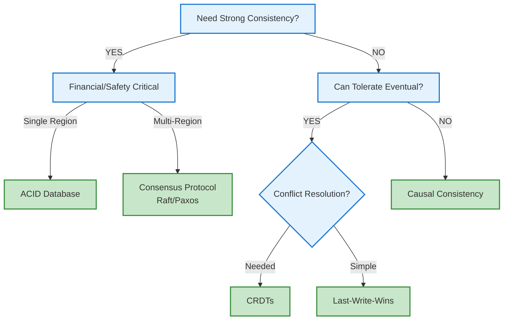

# Distributed Systems Cheat Sheets

---

## 🧮 Essential Calculations

### Little's Law
`L = λW`
- L: Average number in system
- λ: Arrival rate (req/s)
- W: Average time in system (s)

**Example**: 100 req/s × 0.5s = 50 concurrent requests

**Learn More**: [Little's Law in Detail](../architects-handbook/quantitative-analysis/littles-law.md)

---

### Availability Math

`Availability = MTBF / (MTBF + MTTR)`

**SLA Targets**:
| Availability | Downtime/Year | Downtime/Month | Use Case |
|--------------|---------------|----------------|----------|
| 90% | 36.53 days | 73 hours | Internal tools |
| 99% | 3.65 days | 7.31 hours | Standard services |
| 99.9% | 8.77 hours | 43.8 minutes | Production services |
| 99.99% | 52.6 minutes | 4.38 minutes | Critical services |
| 99.999% | 5.26 minutes | 26.3 seconds | Mission critical |


**Parallel**: `A_total = 1 - (1 - A₁)(1 - A₂)...(1 - Aₙ)`
**Series**: `A_total = A₁ × A₂ × ... × Aₙ`

---

### Latency Budget Planning

**Speed of Light**:
- NYC ↔ SF: 21ms (4,000km)
- NYC ↔ London: 28ms (5,600km)
- NYC ↔ Tokyo: 67ms (10,800km)
- Satellite: 240ms (round trip)

**200ms Budget Example**:
- Network: 60ms (30%)
- Load balancer: 10ms
- Application: 50ms (25%)
- Database: 60ms (30%)
- Buffer: 20ms (10%)

---

### Capacity Planning

**M/M/1 Queue**:
- Utilization: `ρ = λ/μ`
- Queue length: `L = ρ/(1-ρ)`
- Wait time: `W = ρ/[μ(1-ρ)]`

**Keep utilization < 80%**

**Scaling**: Linear O(n), Database O(n log n), Coordination O(n²)

**Learn More**: [Queueing Theory](../architects-handbook/quantitative-analysis/queueing-models.md), [Scaling Laws](../quantitative-analysis/universal-scalability.md)

---

## Decision Trees

### Consistency Model Selection



### Pattern Selection

**Law 2 (Asynchronous Reality ⏳)**: Caching, Edge Computing, Circuit Breaker, Async Processing

**Law 1 (Correlated Failure ⛓️)**: Retry+Backoff, Circuit Breaker, Bulkhead, Health Checks

**Law 3 (Emergent Chaos 🌪️)**: Sharding, Load Balancing, Caching, Async Processing

**Law 4 (Multidimensional Optimization ⚖️)**: Event Sourcing, CQRS, Saga, Outbox

---

## Performance Baselines

### Latency Reference

**Memory**: L1 0.5ns, L2 7ns, RAM 100ns, SSD 150μs, HDD 10ms

**Network**: Same DC 0.5ms, Cross-AZ 1-5ms, Cross-region 50-200ms

**Database**: KV lookup 1ms, Indexed query 10ms, Scan 100ms+, Commit 10ms

### Throughput Baselines

**Network**: 1G 125MB/s, 10G 1.25GB/s, Internet 10-100Mbps

**Storage**: HDD 100MB/s, SSD 500MB/s, NVMe 3GB/s, RAM 50GB/s

**CPU**: Hash 1M/s, JSON 100K/s, Crypto 10K/s

---

## 🛠 Configuration Templates

### Circuit Breaker Settings

**Conservative**: failure_threshold: 5, timeout: 30s, recovery: 60s

**Aggressive**: failure_threshold: 10, timeout: 10s, recovery: 30s

### Retry Configuration

**Exponential**: 100ms initial, 2x multiplier, 30s max, 25% jitter

**Linear**: 500ms initial, 500ms increment, 10s max

### Timeouts

**Service Calls**: DB 1-5s, External API 10-30s, Internal 100ms-1s

**Connections**: TCP 3-10s, HTTP 30s, DB connection 5-30s

---

## Monitoring Thresholds

### Golden Signals

**Latency**: P50 <100ms, P95 <500ms, P99 <1s

**Throughput**: Alert on >20% deviation

**Errors**: Critical <0.1%, Standard <1%, Experimental <5%

**Saturation**: CPU <70%, Memory <80%, Disk <85%, Network <70%

### Alert Levels

**Critical**: Service down, Errors >5%, Latency >5x baseline

**Warning**: Errors >1%, Latency >2x baseline, Resources >80%

**Info**: Capacity trends, Performance degradation

---

## Incident Response

### Incident Response

**Triage**: Scope? Impact? Timeline? Trend? Recent changes?

**Severity**: S1 Complete outage, S2 Major feature, S3 Minor feature, S4 Cosmetic

**Template**: Status: [STATE] | Impact: [DESC] | Actions: [DOING] | Next: [TIME]

---

## Testing Strategies

### Chaos Engineering

**Chaos**: Kill instances, Add latency, Fail dependencies, Network partitions, Resource exhaustion

**Load**: Baseline (1x), Peak (2-3x), Spike (10x), Soak (extended), Failure (with outages)

**Verification**: Error budgets maintained, Alerts fired correctly, Recovery successful, No data loss

---

## Quick Formulas

### Replication Factor
- **2N+1 Rule**: Need 2N+1 nodes to tolerate N failures
- **Quorum**: (N/2) + 1 nodes must agree
- **Example**: 5 nodes = tolerate 2 failures, need 3 for quorum

### Storage Calculations
- **RAID 5**: Capacity = (N-1) × disk size, Read = N×, Write = (N-1)×
- **RAID 6**: Capacity = (N-2) × disk size, tolerates 2 disk failures
- **3-way replication**: 3× storage cost, any 2 can fail

### Network Calculations
- **Bandwidth**: Mbps = (bytes × 8) / (seconds × 1,000,000)
- **Latency budget**: User limit (100ms) - Network (20ms) - Processing (30ms) = 50ms for services
- **Connection pool**: Pool size = (RPS × Response Time) / Utilization target

---

## Architecture Decision Records (ADR)

### ADR Template
```
# Title: Short noun phrase

## Status
[Proposed | Accepted | Deprecated | Superseded]

## Context
What is the issue that we're seeing that is motivating this decision?

## Decision
What is the change that we're proposing/doing?

## Consequences
What becomes easier or harder because of this change?
```

### Common Trade-offs
- **Consistency vs Availability**: Strong → CP, Eventual → AP
- **Latency vs Throughput**: Batching increases throughput but latency
- **Cost vs Performance**: Caching costs memory but saves compute
- **Simplicity vs Flexibility**: Abstractions hide complexity but limit control

---

## Security Checklist

### Zero Trust Principles
- **Never trust**: Verify every request, even internal
- **Least privilege**: Minimum permissions required
- **Defense in depth**: Multiple security layers
- **Assume breach**: Design for compromise containment

### Quick Security Audit
- [ ] TLS everywhere (including internal)
- [ ] Secrets in vault, not config
- [ ] API keys rotate automatically
- [ ] Audit logs tamper-proof
- [ ] Rate limiting on all endpoints
- [ ] Input validation whitelist-based

---

## Distributed Systems Laws Summary

### The 7 Fundamental Laws
1. **Correlated Failure 🔥**: Failures cluster and cascade
2. **Asynchronous Reality ⏱️**: The speed of light is finite
3. **Emergent Chaos 🌪️**: Systems have emergent behaviors
4. **Multidimensional Optimization ⚖️**: Trade-offs in multiple dimensions
5. **Distributed Knowledge 🧠**: No single source of truth
6. **Cognitive Load 🤯**: Must fit human mental capacity
7. **Economic Reality 💰**: Cost constrains everything

### The 5 Pillars
1. **Work Distribution**: Computation across nodes
2. **State Distribution**: Data across locations
3. **Truth Distribution**: Consensus and consistency
4. **Control Distribution**: Coordination and orchestration
5. **Intelligence Distribution**: ML and decision-making

---

## Next Steps

- Review [Patterns Index](../pattern-library/tools/consistency-calculator.md) for specific scenarios
- Practice with [Case Studies](../architects-handbook/case-studies/index.md) 
- Build mental models with [Recipe Cards](recipe-cards.md)

---

*Quick reference designed for rapid lookup during incidents and architecture reviews.*
